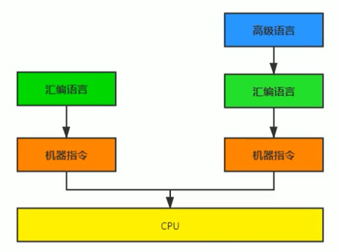
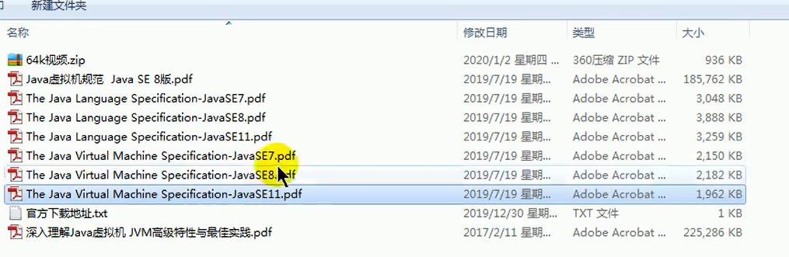
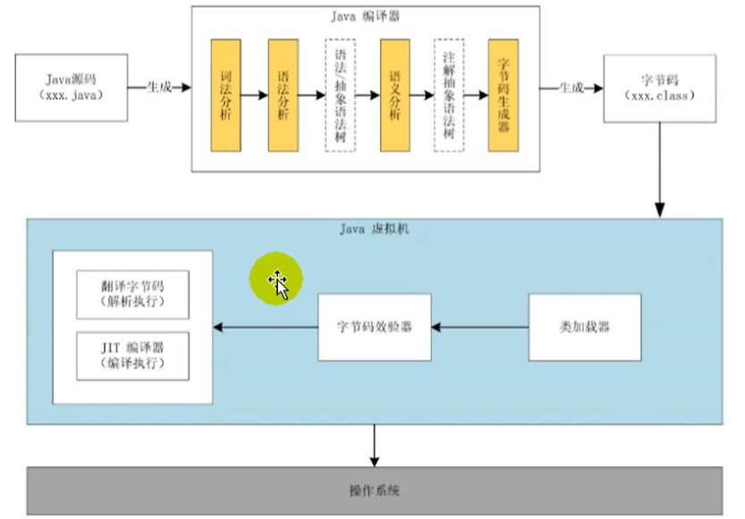
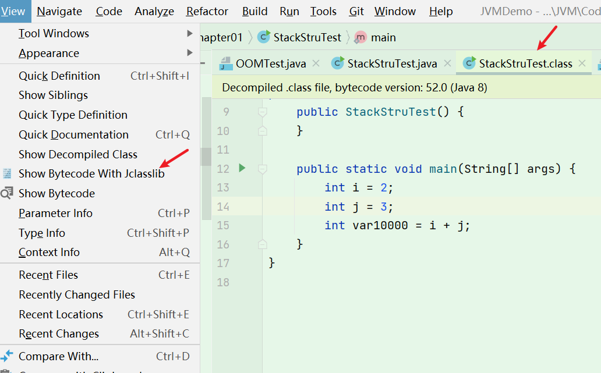
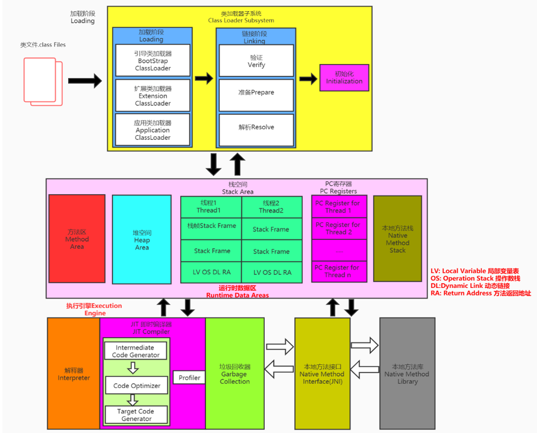
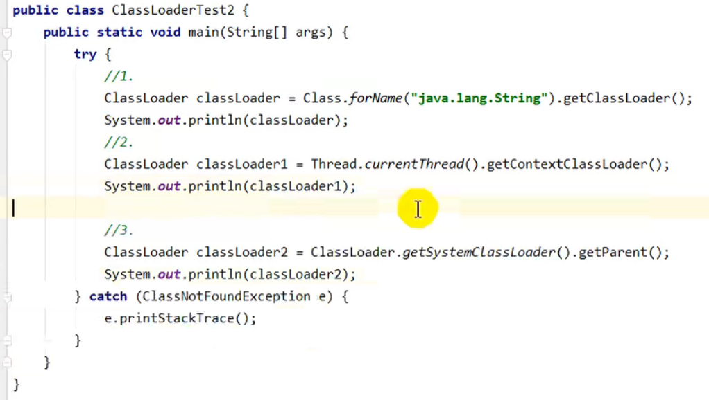

# 目录

[JVM](JVM.md)

## JVM上篇:内存与垃圾回收篇

[3运行时数据区](运行时数据区.md)

- [3运行时数据区概述及线程](运行时数据区.md#3运行时数据区概述及线程)
- [4程序计数器](运行时数据区.md#4程序计数器)
- [5虚拟机栈](运行时数据区.md#5虚拟机栈)
- [8堆](运行时数据区.md#8堆)
- [9运行时方法区](运行时数据区.md#8堆)

[10对象实例化内存布局与访问定位](10对象实例化内存布局与访问定位.md)

[11直接内存 Direct Memory](10对象实例化内存布局与访问定位.md)

[12执行引擎](执行引擎.md)

[13StringTable](13StringTable.md)

[垃圾回收](垃圾回收.md)

- [14垃圾回收概述](垃圾回收.md# 14垃圾回收概述)
- [15垃圾回收相关算法](垃圾回收.md#15垃圾回收相关算法)
- [16垃圾回收相关概念](垃圾回收.md#16垃圾回收相关概念)
- [17垃圾回收器](垃圾回收.md#17垃圾回收器)

## JVM中篇:字节码与类的加载篇

[JVM中篇-字节码与类的加载篇](./JVM中篇-字节码与类的加载篇/JVM中篇-字节码与类的加载篇.md)

[2字节码指令集](./2字节码指令集.md)

[3类的加载过程（类的生命周期）详解.md](.\3类的加载过程（类的生命周期）详解.md)

[4再谈类的加载器](./JVM中篇-字节码与类的加载篇/4再谈类的加载器.md)

# JVM与Java体系结构


## 1前言

作为Java工程师的你曾被伤害过吗？你是否也遇到过这些问题？

运行着的线上系统突然卡死，系统无法访问，甚至直接OOMM！

- 想解决线上JVM GC问题，但却无从下手。
- 新项目上线，对各种JVM参数设置一脸茫然，直接默认吧然后就GG了
- 每次面试之前都要重新背一遍JVM的一些原理概念性的东西，然而面试官却
    经常问你在实际项目中如何调优VM参数，如何解决GC、OOM等问题，一脸
    懵逼。


大部分Java开发人员，除会在项目中使用到与Java平台相关的各种高精尖技术，
对于Java技术的核心Java虚拟机了解甚少。

一些有一定工作经验的开发人员，打心眼儿里觉得SSM、微服务等上层技术才是
重点，基础技术并不重要，这其实是一种本末倒置的“病态”。如果我们把核心类库
的API比做数学公式的话，那么Java虚拟机的知识就好比公式的推导过程。

计算机系统体系对我们来说越来越远，在不了解底层实现方式的前提下，通过高级
语言很容易编写程序代码。但事实上计算机并不认识高级语言




### 架构师每天都在思考什么？

  • 应该如何让我的系统更快？

  • 如何避免系统出现瓶颈？

  知乎上有条帖子：应该如何看招聘信息，直通年薪 50 万+？

  • 参与现有系统的性能优化，重构，保证平台性能和稳定性

  • 根据业务场景和需求，决定技术方向，做技术选型

  • 能够独立架构和设计海量数据下高并发分布式解决方案，满足功能和非功能需

  求

  • 解决各类潜在系统风险，核心功能的架构与代码编写

  • 分析系统瓶颈，解决各种疑难杂症，性能调优等

### 为什么要学习JVM

• 面试的需要（BATJ、TMD，PKQ等面试都爱问）

• 中高级程序员必备技能

 	– 项目管理、调优的需求

• 追求极客的精神

​	– 比如：垃圾回收算法、JIT（及时编译器）、底层原理

### Java vs C++

垃圾收集机制为我们打理了很多繁琐的工作，大大提高了开发的效率，但是，垃圾

收集也不是万能的，懂得JVM内部的内存结构、工作机制，是设计高扩展性应用

和诊断运行时问题的基础，也是Java工程师进阶的必备能力。


C语言需要自己来分配内存和回收内存，Java全部交给JVM进行分配和回收。

## 2推荐资料-书籍

java相关规范下载地址:https://docs.oracle.com/javase/specs/




## 3Java及JVM简介

### Java生态圈

https://www.tiobe.com/tiobe-index/

Java是目前应用最为广泛的软件开发平台之一。随着Java以及Java社区的不断壮
大 Java 也早已不再是简简单单的一门计算机语言了，它更是一个平台、一种文化、
一个社区。

- **作为一个平台**，Java虚拟机扮演着举足轻重的作用
    - Groovy、Scala、JRuby、Kotlin等都是Java平台的一部分
- **作为一种文化**，Java几乎成为了“开源”的代名词。
    - 第三方开源软件和框架。如Tomcat、Struts，MyBatis，Spring等。
    - 就连JDK和JVM自身也有不少开源的实现，如openJDK、Harmony。
- **作为一个社区**，Java拥有全世界最多的技术拥护者和开源社区支持，有数不
    清的论坛和资料。从桌面应用软件、嵌入式开发到企业级应用、后台服务器、
    中间件，都可以看到Java的身影。其应用形式之复杂、参与人数之众多也令
    人咋舌。

**Java跨平台的语言**


每个语言都需要转换成字节码文件，最后转换的字节码文件都能通过Java虚拟机进行运行和处理

**JVM:跨语言的平台**


随着Java7的正式发布，Java虚拟机的设计者们通过JSR-292规范基本实现在**Java虚拟机平台上运行非Java语言编写的程序。**

Java虚拟机根本不关心运行在其内部的程序到底是使用何种编程语言编写的，它**只关心“字节码”文件**。也就是说Java虚拟机拥有语言无关性，并不会单纯地与Java语言“终身绑定”，只要其他编程语言的编译结果满足并包含Java虚拟机的内部指令集、符号表以及其他的辅助信息，它就是一个有效的字节码文件，就能够被

虚拟机所识别并装载运行。

### 字节码
我们平时说的java字节码，指的是用java语言编译成的字节码。准确的说任何能在JVM平台上执行的字节码格式都是一样的。所以应该统称为**：JVM字节码。**

不同的编译器，可以编译出相同的字节码文件，字节码文件也可以在不同的JVM上运行。

Java虚拟机与Java语言并没有必然的联系，它只与特定的二进制文件格式—Class文件格式所关联，Class文件中包含了Java虚拟机指令集（或者称为字节码、

### 多语言混合编程

**Java平台上的多语言混合编程正成为主流，通过特定领域的语言去解决特定领域的问题是当前软件开发应对日趋复杂的项目需求的一个方向。**

试想一下，在一个项目之中，并行处理用clojure语言编写，展示层使用JRuby/Rails，中间层则是Java，每个应用层都将使用不同的编程语言来完成，而且，接口对每一层的开发者都是透明的，**各种语言之间的交互不存在任何困难，就像使用自己语言的原生API一样方便，因为它们最终都运行在一个虚拟机之上。**

对这些运行于Java虚拟机之上、Java之外的语言，来自系统级的、底层的支持正在迅速增强，以JSR-292为核心的一系列项目和功能改进（如Da Vinci Machine项目、Nashorn引擎、InvokeDynamic指令、java.lang.invoke包等），**推动Java虚拟机从“Java语言的虚拟机”向 “多语言虚拟机”的方向发展。**

### 如何真正搞懂JVM


## 4Java发展的重大事件

- 1990 年，在Sun计算机公司中，由Patrick Naughton、MikeSheridan及James Gosling领导的小组Green Team，开发出的新的程序语言，命名为oak，后期命名为Java
- 1995 年，Sun正式发布Java和HotJava产品，Java首次公开亮相。
- 1996 年 1 月 23 日sun Microsystems发布了JDK 1.0。
- 1998 年，JDK1.2版本发布。同时，sun发布了JSP/Servlet、EJB规范，以及将Java分成了J2EE、J2SE和J2ME。这表明了Java开始向企业、桌面应用和移动设备应用 3 大领域挺进。
- 2000 年，JDK1.3发布**，Java HotSpot Virtual Machine正式发布，成为Java的默认虚拟机。**


- 2002 年，JDK1.4发布，古老的Classic虚拟机退出历史舞台。
- 2003 年年底，**Java 平台的scala正式发布，同年Groovy也加入了Java阵营。**
- 2004 年，JDK1.5发布。同时JDK1.5改名为JavaSE 5.0。
- 2006 年，JDK6发布。同年**，Java开源并建立了openJDK**。顺理成章，**Hotspot虚拟机也成为了openJDK中的默认虚拟机。**
- 2007 年，**Java平台迎来了新伙伴Clojure。**
- 2008 年，oracle收购了BEA，**得到了JRockit虚拟机。**
- 2009 年，Twitter宣布把后台大部分程序从Ruby迁移到scala，这是Java平台的又一次大规模应用。
- 2010 年，oracle收购了sun，**获得Java商标和最具价值的HotSpot虚拟机**。此时，oracle拥有市场占用率最高的两款虚拟机HotSpot和JRockit，并计划在未来对它们进行整合：HotRockit
- 2011 年，JDK7发布。在JDK1.7u4中，**正式启用了新的垃圾回收器G1。**
- 2017 年，JDK9发布。**将G1设置为默认Gc，替代CMS**
- 同年，**IBM的J9开源**，形成了现在的open J9社区
- 2018 年，Android的Java侵权案判决，Google赔偿oracle计 88 亿美元
- 同年，oracle宣告JavagE成为历史名词JDBC、JMS、Servlet赠予Eclipse基金会
- 同年，JDK11发布，LTS版本的JDK，**发布革命性的zGc，调整JDK授权许可**
- 2019 年，JDK12发布，加入RedHat领导开发的shenandoah GC


在JDK11之前，oracleJDK中还会存在一些openJDK中没有的、闭源的功能。但在JDK11中，我们可以认为openJDK和oracleJDK代码实质上已经完全一致的程度。

## 5虚拟机与Java虚拟机

### 虚拟机

所谓虚拟机（Virtual Machine），就是一台虚拟的计算机。它是一款软件，用来执
行一系列虚拟计算机指令。大体上，虚拟机可以分为**系统虚拟机**和**程序虚拟机**。

- 大名鼎鼎的Visual Box，Mware就属于系统虚拟机，它们**完全是对物理计算机的仿真**，提供了一个可运行完整操作系统的软件平台。
- 程序虚拟机的典型代表就是Java虚拟机，它**专门为执行单个计算机程序而设计**，在Java虚拟机中执行的指令我们称为Java字节码指令。

无论是系统虚拟机还是程序虚拟机，在上面运行的软件都被限制于虚拟机提供的资源中。

### Java虚拟机

Java虚拟机是一台执行Java字节码的虚拟计算机，它拥有独立的运行机制，其运行的Java字节码也未必由Java语言编译而成。

JVM平台的各种语言可以共享Java虚拟机带来的跨平台性、优秀的垃圾回器，以及可靠的即时编译器。

**Java技术的核心就是Java虚拟机**（JVM，Java Virtual Machine），因为所有的Java程序都运行在Java虚拟机内部。

作用：

**Java虚拟机就是二进制字节码的运行环境**，负责装载字节码到其内部，解释/编译为对应平台上的机器指令执行。每一条Java指令，Java虚拟机规范中都有详细定义，如怎么取操作数，怎么处理操作数，处理结果放在哪里。

特点：

- 一次编译，到处运行
- 自动内存管理
- 自动垃圾回收功能

### JVM的位置

JVM是运行在操作系统之上的，它与硬件没有直接的交互


Java的体系结构(JDK8)

javac(前端编译器)

JVM(后端编译器)


## 6JVM整体结构

- HotSpot VM是目前市面上高性能虚拟机的代表作之一。
- 它采用解释器与即时编译器并存的架构。
- 在今天，Java程序的运行性能早已脱胎换骨，已经达到了可以和C/C++程序
    一较高下的地步。

### **HotSpot JVM Architecture**


执行引擎包含三部分：解释器，及时编译器，垃圾回收器

- 方法区、堆。多线程共享
- java栈、本地方法区、程序计数器，每个线程独有。

## 7Java代码执行流程



只是能生成被Java虚拟机所能解释的字节码文件，那么理论上就可以自己设计一套代码了

## 8JVM的架构模型

Java编译器输入的指令流基本上是一种基于**栈的指令集架构**，另外一种指令集架
构则是基于**寄存器的指令集架构**。

具体来说：这两种架构之间的区别：

**基于栈式架构的特点：**

> 零地址指令:
>
> 指令：地址，操作数。零地址指令则没有地址，只有操作数。

- 设计和实现更简单，适用于资源受限的系统；
- 避开了寄存器的分配难题：使用<u>零地址指令</u>方式分配。
- 指令流中的指令大部分是零地址指令，其执行过程依赖于操作栈。指令集更小，
    编译器容易实现。
- 不需要硬件支持，可移植性更好，更好实现跨平台

**基于寄存器架构的特点:**


- 典型的应用是x86的二进制指令集：比如传统的PC以及Android的Davlik
    虚拟机。
- **指令集架构则完全依赖硬件，可移植性差**
- **性能优秀和执行更高效**
- 花费更少的指令去完成一项操作。
- 在大部分情况下，基于寄存器架构的指令集往往都以一地址指令、二地址指令
    和三地址指令为主，而基于栈式架构的指令集却是以零地址指令为主方水洋

#### 举例

同样执行2+3这种逻辑操作，其指令分别如下：

基于栈的计算流程（以Java虚拟机为例）：

```
iconst_2 //常量 2 入栈
istore_1
iconst_3 // 常量 3 入栈
istore_2
iload_1
iload_2
iadd //常量2/3出栈，执行相加
istore_0 // 结果 5 入栈
```

而基于寄存器的计算流程

```
mov eax,2 //将eax寄存器的值设为 1
add eax,3 //使eax寄存器的值加 3
```

### 字节码反编译

#### idea有看字节码的插件jclasslib

**jclasslib**

使用

选中.java文件，然后点击菜单**View** -> **Show Bytecode With Jclasslib**



我们编写一个简单的代码，然后查看一下字节码的反编译后的结果

```java
public class StackStruTest {
    public static void main(String[] args) {
        int i = 2 + 3;
    }
}
```

然后我们找到编译后的 class文件，使用下列命令进行反编译

```bash
javap -v StackStruTest.class
```

得到的文件为:

```
  public static void main(java.lang.String[]);
    descriptor: ([Ljava/lang/String;)V
    flags: ACC_PUBLIC, ACC_STATIC
    Code:
      stack=2, locals=4, args_size=1
         0: iconst_2
         1: istore_1
         2: iconst_3
         3: istore_2
         4: iload_1
         5: iload_2
         6: iadd
         7: istore_3
         8: return
      LineNumberTable:
        line 9: 0
        line 10: 2
        line 11: 4
        line 12: 8
      LocalVariableTable:
        Start  Length  Slot  Name   Signature
            0       9     0  args   [Ljava/lang/String;
            2       7     1     i   I
            4       5     2     j   I
            8       1     3     k   I
```

### 总结

**由于跨平台性的设计，Java的指令都是根据栈来设计的。**不同平台CPU架构不同，所以不能设计为基于寄存器的。优点是跨平台，指令集小，编译器容易实现，缺点是性能下降，实现同样的功能需要更多的指令。

时至今日，尽管嵌入式平台已经不是Java程序的主流运行平台了（准确来说应该是HotSpotVM的宿主环境已经不局限于嵌入式平台了），那么为什么不将架构更换为基于寄存器的架构呢？

### 栈

- 跨平台性
- 指令集小
- 指令多
- 执行性能比寄存器差

> 指令集小，就是指令小的意思啊，应该是完成一个任务所需的指令数多

## 9JVM生命周期

### 虚拟机的启动

Java虚拟机的启动是通过引导类加载器（bootstrap class loader）创建一个初始类（initial class）来完成的，这个类是由虚拟机的具体实现指定的。

### 虚拟机的执行

- 一个运行中的Java虚拟机有着一个清晰的任务：执行Java程序。
- 程序开始执行时他才运行，程序结束时他就停止。
- **执行一个所谓的Java程序的时候，真真正正在执行的是一个叫做Java虚拟机的进程。**

### 虚拟机的退出

有如下的几种情况：

- 程序正常执行结束

- 程序在执行过程中遇到了异常或错误而异常终止
- 由于操作系统用现错误而导致Java虚拟机进程终止
- 某线程调用Runtime类或system类的exit方法，或Runtime类的halt方法，并且Java安全管理器也允许这次exit或halt操作。
- 除此之外，JNI（Java Native Interface）规范描述了用JNI Invocation API来加载或卸载 Java虚拟机时，Java虚拟机的退出情况。

## 10JVM发展历程

### Sun Classic VM

- 早在1996年Java1.0版本的时候，Sun公司发布了一款名为sun classic VM的Java虚拟机，它同时也**是世界上第一款商用Java虚拟机**，JDK1.4时完全被淘汰。
- 这款虚拟机内部只提供解释器。现在还有及时编译器，因此效率比较低，而及时编译器会把热点代码缓存起来，那么以后使用热点代码的时候，效率就比较高。
- 如果使用JIT编译器，就需要进行外挂。但是一旦使用了JIT编译器，JIT就会接管虚拟机的执行系统。解释器就不再工作。解释器和编译器不能配合工作。
- 现在hotspot内置了此虚拟机。

### Exact VM

为了解决上一个虚拟机问题，jdk1.2时，sun提供了此虚拟机。
Exact Memory Management：准确式内存管理

- 也可以叫Non-Conservative/Accurate Memory Management
- 虚拟机可以知道内存中某个位置的数据具体是什么类型。|

具备现代高性能虚拟机的维形

- 热点探测（寻找出热点代码进行缓存）
- 编译器与解释器混合工作模式

只在solaris平台短暂使用，其他平台上还是classic vm，英雄气短，终被Hotspot虚拟机替换

### HotSpot VM

HotSpot历史

- 最初由一家名为“Longview Technologies”的小公司设计
- 1997年，此公司被sun收购；2009年，Sun公司被甲骨文收购。
- JDK1.3时，HotSpot VM成为默认虚拟机

**目前Hotspot占有绝对的市场地位，称霸武林。**

- 不管是现在仍在广泛使用的JDK6，还是使用比例较多的JDK8中，默认的虚拟机都是HotSpot
- Sun/oracle JDK和openJDK的默认虚拟机
- 因此本课程中默认介绍的虚拟机都是HotSpot，相关机制也主要是指HotSpot的Gc机制。（比如其他两个商用虚机都没有方法区的概念）

从服务器、桌面到移动端、嵌入式都有应用。

名称中的HotSpot指的就是它的**热点代码探测技术**。

- 通过计数器找到最具编译价值代码，触发即时编译或栈上替换
- 通过编译器与解释器协同工作，在最优化的程序响应时间与最佳执行性能中取得平衡

### JRockit

专注于服务器端应用

- 它可以不太关注程序启动速度，因此**JRockit内部不包含解析器实现**，全部代码都靠即时编译器编译后执行。

大量的行业基准测试显示，**JRockit JVM是世界上最快的JVM。**

- 使用JRockit产品，客户已经体验到了显著的性能提高（一些超过了70%）和硬件成本的减少（达50%）。

优势：全面的Java运行时解决方案组合

- JRockit面向延迟敏感型应用的解决方案JRockit Real Time提供以毫秒或微秒级的JVM响应时间，适合财务、军事指挥、电信网络的需要
- MissionControl服务套件，它是一组以极低的开销来监控、管理和分析生产环境中的应用程序的工具。

2008年，JRockit被oracle收购。

oracle表达了整合两大优秀虚拟机的工作，大致在JDK8中完成。整合的方式是在HotSpot的基础上，移植JRockit的优秀特性。

高斯林：目前就职于谷歌，研究人工智能和水下机器人

### IBM的J9

全称：IBM Technology for Java Virtual Machine，简称IT4J，内部代号：J9

市场定位与HotSpot接近，服务器端、桌面应用、嵌入式等多用途VM广泛用于IBM的各种Java产品。

目前，**有影响力的三大商用虚拟机之一**，也号称是世界上最快的Java虚拟机。

2017年左右，IBM发布了开源J9VM，命名为openJ9，交给EClipse基金会管理，也称为Eclipse OpenJ9

OpenJDK   -> 是JDK开源了，包括了虚拟机

### KVM和CDC / CLDC  Hotspot

oracle在Java ME产品线上的两款虚拟机为：CDC/CLDC HotSpot Implementation VM KVM（Kilobyte）是CLDC-HI早期产品目前移动领域地位尴尬，智能机被Angroid和ioS二分天下。

KVM简单、轻量、高度可移植，面向更低端的设备上还维持自己的一片市场

- 智能控制器、传感器
- 老人手机、经济欠发达地区的功能手机

**所有的虚拟机的原则：一次编译，到处运行。**

### Azul VM

前面三大“高性能Java虚拟机”使用在通用硬件平台上这里Azu1VW和BEALiquid VM是与**特定硬件平台绑定、软硬件配合的专有虚拟机**

- 高性能Java虚拟机中的战斗机。

Azul VM是Azu1Systems公司在HotSpot基础上进行大量改进，运行于Azul Systems公司的专有硬件Vega系统上的ava虚拟机。

**每个Azu1VM实例都可以管理至少数十个CPU和数百GB内存的硬件资源，并提供在巨大内存范围内实现可控的GC时间的垃圾收集器、专有硬件优化的线程调度等优秀特性。**

2010年，AzulSystems公司开始从硬件转向软件，发布了自己的zing JVM，可以在通用x86平台上提供接近于Vega系统的特性。

### Liquid VM

高性能Java虚拟机中的战斗机。

BEA公司开发的，直接运行在自家Hypervisor系统上Liquid VM即是现在的JRockit VE（Virtual Edition），

Liquid VM不需要操作系统的支持，或者说它自己本身实现了一个专用操作系统的必要功能，如线程调度、文件系统、网络支持等。

随着JRockit虚拟机终止开发，Liquid vM项目也停止了。

### Apache Marmony

Apache也曾经推出过与JDK1.5和JDK1.6兼容的Java运行平台Apache Harmony。

它是IElf和Inte1联合开发的开源JVM，受到同样开源的openJDK的压制，Sun坚决不让Harmony获得JCP认证，最终于2011年退役，IBM转而参与OpenJDK

虽然目前并没有Apache Harmony被大规模商用的案例，但是它的Java类库代码吸纳进了Android SDK。

### Micorsoft JVM

微软为了在IE3浏览器中支持Java Applets，开发了Microsoft JVM。

只能在window平台下运行。但确是当时Windows下性能最好的Java VM。

1997年，sun以侵犯商标、不正当竞争罪名指控微软成功，赔了sun很多钱。微软windowsXPSP3中抹掉了其VM。现在windows上安装的jdk都是HotSpot。

### Taobao JVM

由AliJVM团队发布。阿里，国内使用Java最强大的公司，覆盖云计算、金融、物流、电商等众多领域，需要解决高并发、高可用、分布式的复合问题。有大量的开源产品。

**基于openJDK开发了自己的定制版本AlibabaJDK**，简称AJDK。是整个阿里Java体系的基石。

基于openJDK Hotspot VM发布的国内第一个优化、**深度定制且开源的高性能服务器版Java虚拟机。**

- 创新的GCIH（GCinvisible heap）技术实现了off-heap，**即将生命周期较长的Java对象从heap中移到heap之外，并且Gc不能管理GCIH内部的Java对象，以此达到降低GC的回收频率和提升Gc的回收效率的目的。**
- GCIH中的**对象还能够在多个Java虚拟机进程中实现共享**
- 使用crc32指令实现JVM intrinsic降低JNI的调用开销
- PMU hardware的Java profiling tool和诊断协助功能
- 针对大数据场景的ZenGc 

taobao vm应用在阿里产品上性能高，硬件严重依赖inte1的cpu，损失了兼容性，但提高了性能

目前已经在淘宝、天猫上线，把oracle官方JVM版本全部替换了。

### Dalvik VM

谷歌开发的，应用于Android系统，并在Android2.2中提供了JIT，发展迅猛。

**Dalvik VM只能称作虚拟机，而不能称作“Java虚拟机”**，它没有遵循 Java虚拟机规范

不能直接执行Java的Class文件

基于寄存器架构，不是JVM的栈架构。

执行的是编译以后的dex（Dalvik Executable）文件。执行效率比较高。

- 它执行的dex（Dalvik Executable）文件可以通过class文件转化而来，使用Java语法编写应用程序，可以直接使用大部分的Java API等。

Android 5.0使用**支持提前编译（Ahead of Time Compilation，AoT）**的ART VM替换Dalvik VM。

### Graal VM

2018年4月，oracle Labs公开了GraalvM，号称 "**Run Programs Faster Anywhere**"，勃勃野心。与1995年java的”write once，run anywhere"遥相呼应。

GraalVM在HotSpot VM基础上增强而成的**跨语言全栈虚拟机，可以作为“任何语言”的运行平台使用。**语言包括：Java、Scala、Groovy、Kotlin；C、C++、Javascript、Ruby、Python、R等支持不同语言中混用对方的接口和对象，支持这些语言使用已经编写好的本地库文件

工作原理是将这些语言的源代码或源代码编译后的中间格式，通过解释器转换为能被Graal VM接受的中间表示。Graal VM提供Truffle工具集快速构建面向一种新语言的解释器。在运行时还能进行即时编译优化，获得比原生编译器更优秀的执行效率。

**如果说HotSpot有一天真的被取代，Graal VM希望最大。**但是Java的软件生态没有丝毫变化。

### 总结

具体JVM的内存结构，其实取决于其实现，不同厂商的JVM，或者同一厂商发布的不同版本，都有可能存在一定差异。主要以oracle HotSpot VM为默认虚拟机。


# 2类加载子系统

## 1内存结构概述


完整图如下




如果自己想手写一个Java虚拟机的话，主要考虑哪些结构呢？

- 类加载器
- 执行引擎

## 2-类加载器与类的加载过程

### 类加载器子系统作用

**类加载器子系统**负责从文件系统或者网络中**加载Class文件**，class文件在文件开头有**特定的文件标识（CAFE BABE）。**

ClassLoader**只负责class文件的加载**，至于它是否可以运行，则由Execution Engine决定。

加载的类信息存放于一块称为方法区的内存空间。除了类的信息外，方法区中还会存放运行时常量池信息，可能还包括字符串字面量和数字常量（这部分常量信息是Class文件中常量池部分的内存映射）


- class file存在于本地硬盘上，可以理解为设计师画在纸上的模板，而最终这个模板在执行的时候是要加载到JVM当中来根据这个文件实例化出n个一模一样的实例。
- class file加载到JVM中，被称为DNA元数据模板，放在方法区。
- 在.class文件->JVM->最终成为元数据模板，此过程就要一个运输工具（类装载器Class Loader），扮演一个快递员的角色。


## 2类的加载过程

例如下面的一段简单的代码

```java
/**
 * 类加载子系统
 */
public class HelloLoader {
    public static void main(String[] args) {
        System.out.println("我已经被加载啦");
    }
}
```

它的加载过程是怎么样的呢?


完整的流程图如下所示


#### 加载阶段

1. 通过一个类的全限定名获取定义此类的二进制字节流

2. 将这个字节流所代表的静态存储结构转化为方法区的运行时数据结构

3. **在内存中生成一个代表这个类的java.lang.Class对象**，作为方法区这个类的各种数据的访问入口

##### 加载class文件的方式

- 从本地系统中直接加载
- 通过网络获取，典型场景：Web Applet
- 从zip压缩包中读取，成为日后jar、war格式的基础
- 运行时计算生成，使用最多的是：动态代理技术
- 由其他文件生成，典型场景：JSP应用从专有数据库中提取.class文件，比较少见
- 从加密文件中获取，典型的防Class文件被反编译的保护措施

### 链接阶段

3个阶段：

#### 验证 Verify

目的在于确保Class文件的字节流中**包含信息符合当前虚拟机要求**，保证被加载类的正确性，不会危害虚拟机自身安全。（如：CAFE BABE 开头）

主要包括四种验证，文件格式验证，元数据验证，字节码验证，符号引用验证。

> 工具：Binary Viewer查看
>
> [vscode]下的hexdump插件可以查看二进制文件

使用：用文件夹打开，然后选择show hexdump


如果出现不合法的字节码文件，那么将会验证不通过

同时我们可以通过安装IDEA的插件，来查看我们的Class文件

jclasslib


安装完成后，我们编译完一个class文件后，点击view即可显示我们安装的插件来查看字节码方法了


#### 准备 Prepare

**为类变量分配内存并且设置该类变量的默认初始值，即零值。**

```java
/**
 */
public class HelloApp {
    private static int a = 1;  // 准备阶段为0，在下个阶段，也就是初始化的时候才是1
    public static void main(String[] args) {
        System.out.println(a);
    }
}
```

上面的变量a在准备阶段会赋初始值，但不是1，而是0。

**这里不包含用final修饰的static，因为final在编译的时候就会分配了，准备阶段会显式初始化；**

**这里不会为实例变量分配初始化**，类变量会分配在方法区中，而实例变量是会随着对象一起分配到Java堆中。

例如下面这段代码

#### 解析 Resolve

**将常量池内的符号引用转换为直接引用的过程。**

事实上，解析操作往往会伴随着JVM在执行完初始化之后再执行。

符号引用就是一组符号来描述所引用的目标。符号引用的字面量形式明确定义在《java虚拟机规范》的class文件格式中。直接引用就是直接指向目标的指针、相对偏移量或一个间接定位到目标的句柄。

解析动作**主要针对类或接口、字段、类方法、接口方法、方法类型等**。对应常量池中的CONSTANT Class info、CONSTANT Fieldref info、CONSTANT Methodref info等

> 符号引用，就是你代码中对函数、或静态变量、全局变量的调用，实际运行它们，需要知道它们的运行时的绝对地址，就是解析就是赋给它们地址，然后重定位到代码中

### 初始化阶段

**初始化阶段就是执行类构造器法``<clinit>()``的过程。**

- 此方法不需定义，是javac编译器自动收集类中的所有**类变量的赋值动作和静态代码块中的语句合并而来**。

- 也就是说，当我们**代码中包含static变量的时候**，就会有clinit方法构造器方法中指令按语句在源文件中出现的顺序执行。

**``<clinit>()``不同于类的构造器。**（关联：<u>构造器是虚拟机视角下的`<init>()`</u>）

- 若该类具有父类，JVM会保证子类的`<clinit>()`执行前，父类的`<clinit>()`已经执行完毕。
- 虚拟机必须保证一个类的`<clinit> ()`方法在多线程下被同步加锁。

- **任何一个类在声明后，都有生成一个构造器，默认是空参构造器**

```java
/**
 */
public class ClassInitTest {
    private static int num = 1;
    static {
        num = 2;
        number = 20;
        System.out.println(num);
        System.out.println(number);  //报错，非法的前向引用
    }

    private static int number = 10;

    public static void main(String[] args) {
        System.out.println(ClassInitTest.num); // 2
        System.out.println(ClassInitTest.number); // 10
    }
}
```

关于涉及到父类时候的变量赋值过程

```java
/**
 * @author: 
 * @create: 2020-07-05-9:06
 */
public class ClinitTest1 {
    static class Father {
        public static int A = 1;
        static {
            A = 2;
        }
    }

    static class Son extends Father {
        public static int b = A;
    }

    public static void main(String[] args) {
        System.out.println(Son.b);
    }
}
```

我们输出结果为 2，也就是说首先加载ClinitTest1的时候，会找到main方法，然后执行Son的初始化，但是Son继承了Father，因此还需要执行Father的初始化，同时将A赋值为2。我们通过反编译得到Father的加载过程，首先我们看到原来的值被赋值成1，然后又被复制成2，最后返回

```bash
iconst_1
putstatic #2 <com/atguigu/java/chapter02/ClinitTest1$Father.A>
iconst_2
putstatic #2 <com/atguigu/java/chapter02/ClinitTest1$Father.A>
return
```

虚拟机必须保证一个类的`<clinit>()`方法在多线程下被同步加锁。

```java
/**
 * @author: 
 * @create: 2020-07-05-9:14
 */
public class DeadThreadTest {
    public static void main(String[] args) {
        new Thread(() -> {
            System.out.println(Thread.currentThread().getName() + "\t 线程t1开始");
            new DeadThread();
        }, "t1").start();

        new Thread(() -> {
            System.out.println(Thread.currentThread().getName() + "\t 线程t2开始");
            new DeadThread();
        }, "t2").start();
    }
}
class DeadThread {
    static {
        if (true) {
            System.out.println(Thread.currentThread().getName() + "\t 初始化当前类");
            while(true) {

            }
        }
    }
}
```

上面的代码，输出结果为

```
线程t1开始
线程t2开始
线程t2 初始化当前类
```

从上面可以看出初始化后，只能够执行一次初始化，这也就是同步加锁的过程

## 3类加载器的分类

JVM支持两种类型的类加载器 。分别为**引导类加载器（Bootstrap ClassLoader）和自定义类加载器（User-Defined ClassLoader）。**

从概念上来讲，自定义类加载器一般指的是程序中由开发人员自定义的一类类加载器，但是Java虚拟机规范却没有这么定义，**而是将所有派生于抽象类ClassLoader的类加载器都划分为自定义类加载器。**

无论类加载器的类型如何划分，在程序中我们最常见的类加载器始终只有3个，如下所示：


**这里的四者之间是包含关系，不是上层和下层，也不是子系统的继承关系。**

我们通过一个类，获取它不同的加载器

```java
public class ClassLoaderTest {
    public static void main(String[] args) {
        // 获取系统类加载器
        ClassLoader systemClassLoader = ClassLoader.getSystemClassLoader();
        System.out.println(systemClassLoader);//sun.misc.Launcher$AppClassLoader@18b4aac2

        // 获取其上层的：扩展类加载器
        ClassLoader extClassLoader = systemClassLoader.getParent();
        System.out.println(extClassLoader); //sun.misc.Launcher$ExtClassLoader@1b6d3586

        // 试图获取 根加载器
        //获取其上层:获取不到引导类加载器
        ClassLoader bootstrapClassLoader = extClassLoader.getParent();
        System.out.println(bootstrapClassLoader); //null


        // 获取自定义加载器
        //对于用户自定义类来说:默认使用系统类加载器进行加载
        ClassLoader classLoader = ClassLoaderTest.class.getClassLoader();
        System.out.println(classLoader); //sun.misc.Launcher$AppClassLoader@18b4aac2

        // 获取String类型的加载器
        //String类使用引导类加载器进行加载的。--->Java的核心类库都是使用引导类加载器进行加载的。
        // (不能用此例子证明，但事实就是这样的)
        ClassLoader classLoader1 = String.class.getClassLoader();
        System.out.println(classLoader1); //null
    }
}
```

得到的结果，从结果可以看出 根加载器无法直接通过代码获取，同时目前用户代码所使用的加载器为系统类加载器。同时我们通过获取String类型的加载器，发现是null，那么说明String类型是通过根加载器进行加载的，也就是说Java的核心类库都是使用根加载器进行加载的。

```
sun.misc.Launcher$AppClassLoader@18b4aac2
sun.misc.Launcher$ExtClassLoader@1540e19d
null
sun.misc.Launcher$AppClassLoader@18b4aac2
null 
```

### 虚拟机自带的加载器

3个：

#### 启动类加载器（引导类加载器，Bootstrap ClassLoader）

- 这个类加载使用**C/C++语言实现**的，嵌套在JVM内部。
- 它用来加载Java的核心库（JAVAHOME/jre/1ib/rt.jar、resources.jar或sun.boot.class.path路径下的内容），用于提供JVM自身需要的类
- 并不继承自ava.lang.ClassLoader，没有父加载器。
- 加载扩展类和应用程序类加载器，并指定为他们的父类加载器。
- 出于安全考虑，Bootstrap启动类加载器只加载包名为java、javax、sun等开头的类

#### 扩展类加载器（Extension ClassLoader）

- **Java语言编写**，由sun.misc.Launcher$ExtClassLoader实现。
- **派生于ClassLoader类**
- 父类加载器为启动类加载器
- 从java.ext.dirs系统属性所指定的目录中加载类库，或从JDK的安装目录的jre/1ib/ext子目录（扩展目录）下加载类库。**如果用户创建的JAR放在此目录下，也会自动由扩展类加载器加载。**


#### 应用程序类加载器（系统类加载器，AppClassLoader）

- javI语言编写，由sun.misc.LaunchersAppClassLoader实现
- 派生于ClassLoader类
- 父类加载器为扩展类加载器
- 它负责加载环境变量classpath或系统属性java.class.path指定路径下的类库
- **该类加载是程序中默认的类加载器**，一般来说，**Java应用的类都是由它来完成加载**
- 通过classLoader#getSystemclassLoader（）方法可以获取到该类加载器
- 按照包含关系，引导类加载器加载扩展类加载器，扩展类加载器加载系统类加载器，用户自定义加载器则是由系统类加载器完成加载

### 用户自定义类加载器

在Java的日常应用程序开发中，类的加载几乎是由上述3种类加载器相互配合执行的，在必要时，我们还可以自定义类加载器，来定制类的加载方式。
为什么要自定义类加载器？

- 隔离加载类
- 修改类加载的方式
- 扩展加载源
- 防止源码泄漏

**用户自定义类加载器实现步骤：**

- 开发人员可以通过继承抽象类ava.lang.ClassLoader类的方式，实现自己的类加载器，以满足一些特殊的需求
- 在JDK1.2之前，在自定义类加载器时，总会去继承ClassLoader类并重写1oadClass（）方法，从而实现自定义的类加载类，但是在JDK1.2之后已不再建议用户去覆盖1oadclass（）方法，而是建议把自定义的类加载逻辑写在findclass（）方法中
- 在编写自定义类加载器时，如果没有太过于复杂的需求，可以直接继承URIClassLoader类，这样就可以避免自己去编写findclass（）方法及其获取字节码流的方式，使自定义类加载器编写更加简洁。

### 查看根加载器所能加载的目录

刚刚我们通过概念了解到了，根加载器只能够加载 java /lib目录下的class，我们通过下面代码验证一下

```java
package com.atguigu.java.chapter02;

import com.sun.java.accessibility.AccessBridge;
import sun.security.util.CurveDB;

import java.net.URL;
import java.security.Provider;

/**
 * @author:
 * @create: 2020-07-05-10:17
 */
public class ClassLoaderTest1 {
    public static void main(String[] args) {
        System.out.println("*********启动类加载器************");
        // 获取BootstrapClassLoader 能够加载的API的路径
        URL[] urls = sun.misc.Launcher.getBootstrapClassPath().getURLs();
        for (URL url : urls) {
            System.out.println(url.toExternalForm());
        }

        // 从上面路径中，随意选择一个类，来看看他的类加载器是什么：得到的是null，说明是  引导类加载器
        ClassLoader classLoader = Provider.class.getClassLoader();
        System.out.println(classLoader);

        System.out.println("**********扩展类加载器***********");
        String extDirs = System.getProperty("java.ext.dirs");
        for (String path : extDirs.split(";")) {
            System.out.println(path);
        }
        //从上面的路径中随意选择一个类,来看看他的类加载器是什么: 扩展类加载器
        ClassLoader classLoader1 = AccessBridge.class.getClassLoader();
        System.out.println(classLoader1);   //sun.misc.Launcher$ExtClassLoader@7f31245a

    }
}

```

得到的结果

```
*********启动类加载器************
file:/C:/Program%20Files/Java/jdk1.8.0_321/jre/lib/resources.jar
file:/C:/Program%20Files/Java/jdk1.8.0_321/jre/lib/rt.jar
file:/C:/Program%20Files/Java/jdk1.8.0_321/jre/lib/sunrsasign.jar
file:/C:/Program%20Files/Java/jdk1.8.0_321/jre/lib/jsse.jar
file:/C:/Program%20Files/Java/jdk1.8.0_321/jre/lib/jce.jar
file:/C:/Program%20Files/Java/jdk1.8.0_321/jre/lib/charsets.jar
file:/C:/Program%20Files/Java/jdk1.8.0_321/jre/lib/jfr.jar
file:/C:/Program%20Files/Java/jdk1.8.0_321/jre/classes
null
**********扩展类加载器***********
C:\Program Files\Java\jdk1.8.0_321\jre\lib\ext
C:\Windows\Sun\Java\lib\ext
sun.misc.Launcher$ExtClassLoader@7f31245a

Process finished with exit code 0
```

## 4关于ClassLoader

ClassLoader类，它是一个抽象类，其后所有的类加载器都继承自ClassLoader（不包括启动类加载器）


sun.misc.Launcher 它是一个java虚拟机的入口应用


获取ClassLoader的途径

- 获取当前ClassLoader：clazz.getClassLoader()
- 获取当前线程上下文的ClassLoader：Thread.currentThread().getContextClassLoader()
- 获取系统的ClassLoader：ClassLoader.getSystemClassLoader()
- 获取调用者的ClassLoader：DriverManager.getCallerClassLoader()



## 5双亲委派机制

Java虚拟机对class文件采用的是**按需加载**的方式，也就是说当需要使用该类时才会将它的class文件加载到内存生成class对象。而且加载某个类的class文件时，Java虚拟机采用的是**双亲委派模式，**即把请求交由父类处理，它是一种任务委派模式。

### 工作原理

1.  如果一个类加载器收到了类加载请求，它并不会自己先去加载，而是把这个请求委托给父类的加载器去执行；

2.  如果父类加载器还存在其父类加载器，则进一步向上委托，依次递归，请求最终将到达顶层的启动类加载器；
3. 如果父类加载器可以完成类加载任务，就成功返回，倘若父类加载器无法完成此加载任务，**子加载器才会尝试自己去加载**，这就是双亲委派模式。


### 双亲委派机制举例

当我们加载jdbc.jar 用于实现数据库连接的时候，首先我们需要知道的是 jdbc.jar是基于SPI接口进行实现的，所以在加载的时候，会进行双亲委派，最终从根加载器中加载 SPI核心类，然后在加载SPI接口类，接着在进行反向委派，通过线程上下文类加载器进行实现类 jdbc.jar的加载。


```java
//错误: 在类 java.lang.String 中找不到 main 方法
 class String  {
    static {
        System.out.println("自定义String");
    }

     public static void main(String[] args) {
         System.out.println("hello,String");
     }
}
```


### 双亲委派机制的优势

通过上面的例子，我们可以知道，双亲机制可以

- **避免类的重复加载**
- **保护程序安全，防止核心API被随意篡改**
  - 自定义类：java.lang.String
  - 自定义类：java.lang.ShkStart（报错：阻止创建 java.lang开头的类）

### 沙箱安全机制

自定义string类，但是在加载自定义String类的时候会率先使用引导类加载器加载，而引导类加载器在加载的过程中会先加载jdk自带的文件（rt.jar包中java\lang\String.class），报错信息说没有main方法，就是因为加载的是rt.jar包中的string类。这样可以保证对java核心源代码的保护，这就是沙箱安全机制。

## 6其它

###  如何判断两个class对象是否相同

在JVM中表示两个class对象是否为同一个类存在两个必要条件：

- 类的完整类名必须一致，包括包名。
- 加载这个类的ClassLoader（指ClassLoader实例对象）必须相同。

换句话说，在JVM中，即使这两个类对象（class对象）来源同一个Class文件，被同一个虚拟机所加载，但只要加载它们的ClassLoader实例对象不同，那么这两个类对象也是不相等的。

JVM必须知道一个类型是由启动加载器加载的还是由用户类加载器加载的。如果一个类型是由用户类加载器加载的，那么JVM会**将这个类加载器的一个引用作为类型信息的一部分保存在方法区中**。当解析一个类型到另一个类型的引用的时候，JVM需要保证这两个类型的类加载器是相同的。

### 类的主动使用和被动使用

**Java程序对类的使用方式分为：主动使用和被动使用。**
主动使用，又分为七种情况：

- 创建类的实例
- 访问某个类或接口的静态变量，或者对该静态变量赋值
- 调用类的静态方法I
- 反射（比如：Class.forName（"com.atguigu.Test"））
- 初始化一个类的子类
- Java虚拟机启动时被标明为启动类的类
- JDK7开始提供的动态语言支持：
- java.lang.invoke.MethodHandle实例的解析结果REF getStatic、REF putStatic、REF invokeStatic句柄对应的类没有初始化，则初始化

除了以上七种情况，其他使用Java类的方式都被看作是对**类的被动使用**，都**不会导致类的初始化**。

# JVM

### 常用的调优工具

- JDK命令行

- Eclipse：Memory Analyzer Tool

- Jconsole

- Visual VM（实时监控  推荐~）
-  Jprofiler（推荐~）

 >idea中有插件，可以下载.
 >
 >使用时需要先安装
 >
 >官网地址：https://www.ej-technologies.com/

- Java Flight Recorder（实时监控）

- GCViewer

- GCEasy

# 学习中遇到的问题

## IDEA中的Terminal输入javap显示不是内部或外部命令，也不是可运行的程序或批处理文件

https://blog.csdn.net/TecentYun/article/details/115657295

javap不识别的**用管理员打开idea**

javap 要加-p 才能看到private的方法

# 相关资料

学习视频：[尚硅谷宋红康JVM全套教程（详解java虚拟机）](https://www.bilibili.com/video/BV1PJ411n7xZ?spm_id_from=333.337.search-card.all.click)

本地代码：D:\Codes\java\JVMCode

远程仓库代码地址：https://github.com/codeOflI/JVMDemo