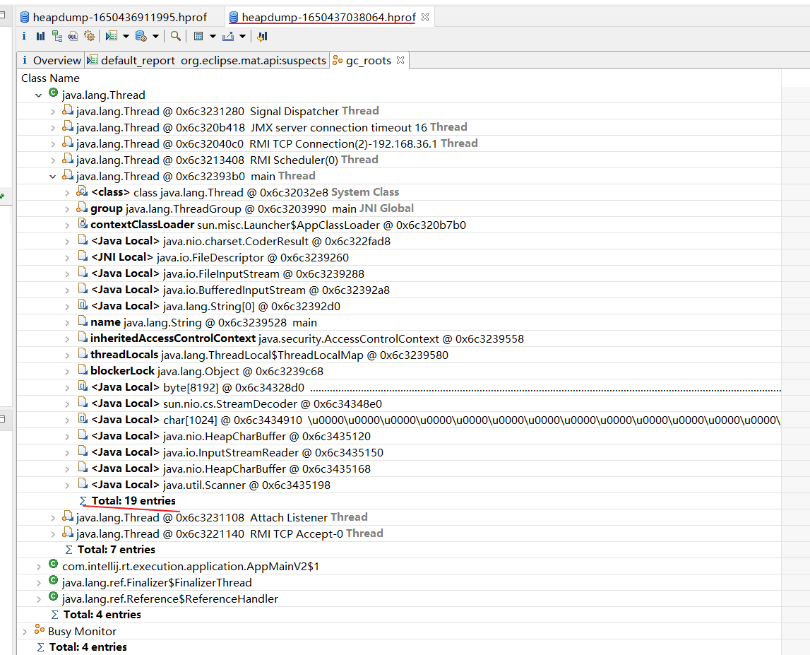
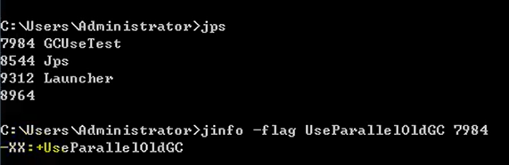
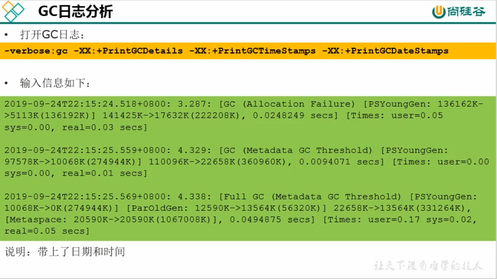

# 目录

[JVM](JVM.md)


# 14垃圾回收概述

## 概念

这次我们主要关注的是黄色部分，内存的分配与回收


## 1什么是垃圾

在提到什么是垃圾之前，我们先看下面一张图


从上图我们可以很明确的知道，Java 和 C++语言的区别，就在于垃圾收集技术和内存动态分配上，C语言没有垃圾收集技术，需要我们手动的收集。

垃圾收集，不是Java语言的伴生产物。早在1960年，第一门开始使用内存动态分配和垃圾收集技术的Lisp语言诞生。
关于垃圾收集有三个经典问题：

- 哪些内存需要回收？
- 什么时候回收？
- 如何回收？

垃圾收集机制是**Java的招牌能力**，极大地提高了开发效率。如今，垃圾收集几乎成为现代语言的标配，即使经过如此长时间的发展，Java的垃圾收集机制仍然在不断的演进中，不同大小的设备、不同特征的应用场景，对垃圾收集提出了新的挑战，这当然也是**面试的热点**。

### 什么是垃圾？

垃圾是指在**运行程序中没有任何指针指向的对象**，这个对象就是需要被回收的垃圾。

如果不及时对内存中的垃圾进行清理，那么，这些垃圾对象所占的内存空间会一直保留到应用程序的结束，被保留的空间无法被其它对象使用，甚至可能**导致内存溢出**。

### 磁盘碎片整理

机械硬盘需要进行磁盘整理，同时还有坏道


### 大厂面试题

#### 蚂蚁金服

- 你知道哪几种垃圾回收器，各自的优缺点，重点讲一下cms和G1？
- JVM GC算法有哪些，目前的JDK版本采用什么回收算法？
- G1回收器讲下回收过程GC是什么？为什么要有GC？
- GC的两种判定方法？CMS收集器与G1收集器的特点

#### 百度

- 说一下GC算法，分代回收说下
- 垃圾收集策略和算法

#### 天猫

- JVM GC原理，JVM怎么回收内存
- CMS特点，垃圾回收算法有哪些？各自的优缺点，他们共同的缺点是什么？

#### 滴滴

Java的垃圾回收器都有哪些，说下g1的应用场景，平时你是如何搭配使用垃圾回收器的

#### 京东

- 你知道哪几种垃圾收集器，各自的优缺点，重点讲下cms和G1，
- 包括原理，流程，优缺点。垃圾回收算法的实现原理

#### 阿里

- 讲一讲垃圾回收算法。
- 什么情况下触发垃圾回收？
- 如何选择合适的垃圾收集算法？
- JVM有哪三种垃圾回收器？

#### 字节跳动

- 常见的垃圾回收器算法有哪些，各有什么优劣？
- System.gc（）和Runtime.gc（）会做什么事情？
- Java GC机制？GC Roots有哪些？
- Java对象的回收方式，回收算法。
- CMS和G1了解么，CMS解决什么问题，说一下回收的过程。
- CMS回收停顿了几次，为什么要停顿两次?

## 2为什么需要GC

对于高级语言来说，一个基本认知是如果不进行垃圾回收，**内存迟早都会被消耗完**，因为不断地分配内存空间而不进行回收，就好像不停地生产生活垃圾而从来不打扫一样。

除了释放没用的对象，垃圾回收也可以清除内存里的记录碎片。碎片整理将所占用的堆内存移到堆的一端，以便**JVM将整理出的内存分配给新的对象。**

随着应用程序所应付的业务越来越庞大、复杂，用户越来越多，**没有GC就不能保证应用程序的正常进行**。而经常造成STW的GC又跟不上实际的需求，所以才会不断地尝试对GC进行优化。

## 3早期垃圾回收

在早期的C/C++时代，垃圾回收基本上是手工进行的。开发人员可以使用new关键字进行内存申请，并使用delete关键字进行内存释放。比如以下代码：

```c++
MibBridge *pBridge= new cmBaseGroupBridge（）；
//如果注册失败，使用Delete释放该对象所占内存区域
if（pBridge->Register（kDestroy）！=NO ERROR）
	delete pBridge；
```

这种方式可以灵活控制内存释放的时间，但是会给开发人员带来**频繁申请和释放内存的管理负担**。倘若有一处内存区间由于程序员编码的问题忘记被回收，那么就会产生**内存泄漏**，垃圾对象永远无法被清除，随着系统运行时间的不断增长，垃圾对象所耗内存可能持续上升，直到出现内存溢出并造成**应用程序崩溃**。 

有了垃圾回收机制后，上述代码极有可能变成这样

```c++
MibBridge *pBridge=new cmBaseGroupBridge(); 
pBridge->Register(kDestroy);
```

现在，除了Java以外，C#、Python、Ruby等语言都使用了自动垃圾回收的思想，也是未来发展趋势，可以说这种自动化的内存分配和来及回收方式已经成为了线代开发语言必备的标准。

## 4Java垃圾回收机制

### 优点

自动内存管理，无需开发人员手动参与内存的分配与回收，这样**降低内存泄漏和内存溢出的风险**

没有垃圾回收器，java也会和cpp一样，各种悬垂指针，野指针，泄露问题让你头疼不已。

自动内存管理机制，将程序员从繁重的内存管理中释放出来，可以**更专心地专注于业务开发**

oracle官网关于垃圾回收的介绍
https://docs.oracle.com/javase/8/docs/technotes/guides/vm/gctuning/toc.html

### 担忧

对于Java开发人员而言，自动内存管理就像是一个黑匣子，如果过度依赖于“自动”，那么这将会是一场灾难，最严重的就会**弱化Java开发人员在程序出现内存溢出时定位问题和解决问题的能力。**

此时，了解JVM的自动内存分配和内存回收原理就显得非常重要，只有在真正了解JVM是如何管理内存后，我们才能够在遇见outofMemoryError时，快速地根据错误异常日志定位问题和解决问题。

当需要排查各种内存溢出、内存泄漏问题时，当垃圾收集成为系统达到更高并发量的瓶颈时，我们就必须对这些“自动化”的技术**实施必要的监控和调节。**

### GC主要关注的区域

GC主要关注于 **方法区 和堆中的垃圾收集**


垃圾收集器可以对年轻代回收，也可以对老年代回收，甚至是全栈和方法区的回收

- 其中，**Java堆是垃圾收集器的工作重点**

从次数上讲：

- **频繁收集Young区**
- **较少收集Old区**
- **基本不收集Perm区（元空间）**

# 15垃圾回收相关算法

**1-垃圾标记阶段的算法之**
**引用计数算法**

## 标记阶段：引用计数算法

在堆里存放着几乎所有的Java对象实例，在GC执行垃圾回收之前，首先**需要区分出内存中哪些是存活对象，哪些是已经死亡的对象**。只有被标记为己经死亡的对象，GC才会在执行垃圾回收时，释放掉其所占用的内存空间，因此这个过程我们可以称为**垃圾标记阶段。**

那么在JVM中究竟是如何标记一个死亡对象呢？简单来说，当一个对象已经不再被任何的存活对象继续引用时，就可以宣判为已经死亡。

判断对象存活一般有两种方式：**引用计数算法**和**可达性分析算法。**

引用计数算法（Reference Counting）比较简单，对每个对象保存一个整型的**引用计数器属性。用于记录对象被引用的情况。**

对于一个对象A，只要有任何一个对象引用了A，则A的引用计数器就加1；当引用失效时，引用计数器就减1。只要对象A的引用计数器的值为0，即表示对象A不可能再被使用，可进行回收。

优点：**实现简单，垃圾对象便于辨识；判定效率高，回收没有延迟性。**

缺点：

- 它需要单独的字段存储计数器，这样的做法增加了**存储空间的开销**。

- 每次赋值都需要更新计数器，伴随着加法和减法操作，这增加了**时间开销**。

- 引用计数器有一个严重的问题，即**无法处理循环引用的情况。**这是一条致命缺陷，导致在Java的垃圾回收器中没有使用这类算法。

### 循环引用

当p的指针断开的时候，内部的引用形成一个循环，这就是循环引用，从而造成内存泄漏


### 举例

我们使用一个案例来测试Java中是否采用的是引用计数算法

```java
/**
 * -XX:+PrintGCDetails
 * 引用计数算法测试
 */
public class RefCountGC {
    // 这个成员属性的唯一作用就是占用一点内存
    private byte[] bigSize = new byte[5*1024*1024];
    // 引用
    Object reference = null;

    public static void main(String[] args) {
        RefCountGC obj1 = new RefCountGC();
        RefCountGC obj2 = new RefCountGC();
        obj1.reference = obj2;
        obj2.reference = obj1;
        obj1 = null;
        obj2 = null;
        // 显示的执行垃圾收集行为，判断obj1 和 obj2是否被回收？
        System.gc();
    }
}
```

运行结果

```
[GC (System.gc()) [PSYoungGen: 15490K->808K(76288K)] 15490K->816K(251392K), 0.0061980 secs] [Times: user=0.00 sys=0.00, real=0.36 secs] 
[Full GC (System.gc()) [PSYoungGen: 808K->0K(76288K)] [ParOldGen: 8K->672K(175104K)] 816K->672K(251392K), [Metaspace: 3479K->3479K(1056768K)], 0.0045983 secs] [Times: user=0.00 sys=0.00, real=0.00 secs] 
Heap
 PSYoungGen      total 76288K, used 655K [0x000000076b500000, 0x0000000770a00000, 0x00000007c0000000)
  eden space 65536K, 1% used [0x000000076b500000,0x000000076b5a3ee8,0x000000076f500000)
  from space 10752K, 0% used [0x000000076f500000,0x000000076f500000,0x000000076ff80000)
  to   space 10752K, 0% used [0x000000076ff80000,0x000000076ff80000,0x0000000770a00000)
 ParOldGen       total 175104K, used 672K [0x00000006c1e00000, 0x00000006cc900000, 0x000000076b500000)
  object space 175104K, 0% used [0x00000006c1e00000,0x00000006c1ea8070,0x00000006cc900000)
 Metaspace       used 3486K, capacity 4496K, committed 4864K, reserved 1056768K
  class space    used 385K, capacity 388K, committed 512K, reserved 1048576K
```

我们能够看到，上述进行了GC收集的行为，将上述的新生代中的两个对象都进行回收了

```
PSYoungGen: 15490K->808K(76288K)] 15490K->816K(251392K)
```

如果使用引用计数算法，那么这两个对象将会无法回收。而现在两个对象被回收了，说明**Java使用的不是引用计数算法来进行标记的。**


### 小结

引用计数算法，是很多语言的资源回收选择，例如因人工智能而更加火热的Python，它更是同时支持引用计数和垃圾收集机制。

具体哪种最优是要看场景的，业界有大规模实践中仅保留引用计数机制，以提高吞吐量的尝试。

Java并没有选择引用计数，是因为其存在一个基本的难题，也就是很难处理循环引用关系。Python如何解决循环引用？

>手动解除：很好理解，就是在合适的时机，解除引用关系。
>使用弱引用weakref，weakref是Python提供的标准库，旨在解决循环引用。


## 标记阶段：可达性分析算法

### 概念

可达性分析算法：也可以称为 **根搜索算法**、追踪性垃圾收集

相对于引用计数算法而言，可达性分析算法不仅同样具备实现简单和执行高效等特点，更重要的是该算法可以有效地**解决在引用计数算法中循环引用的问题，防止内存泄漏的发生。**

相较于引用计数算法，这里的可达性分析就是**Java、C#选择的**。这种类型的垃圾收集通常也叫作**追踪性垃圾收集（Tracing Garbage Collection）**

### 思路

所谓"GCRoots”根集合就是一组必须活跃的引用。

基本思路：

- 可达性分析算法是以根对象集合（GCRoots）为起始点，按照从上至下的方式**搜索被根对象集合所连接的目标对象是否可达。**
- 使用可达性分析算法后，内存中的存活对象都会被根对象集合直接或间接连接着，搜索所走过的路径称为**引用链（Reference Chain）**
- 如果目标对象没有任何引用链相连，则是不可达的，就意味着该对象己经死亡，可以标记为垃圾对象。
- 在可达性分析算法中，只有能够被根对象集合直接或者间接连接的对象才是存活对象。


官场上的裙带关系，可达性分析在人类关系网中


### GC Roots可以是哪些？

- **虚拟机栈中引用的对象**
  - 比如：各个线程被调用的方法中使用到的参数、局部变量等。
- 本地方法栈内JNI（通常说的本地方法）引用的对象
- 方法区中类静态属性引用的对象
  - 比如：Java类的引用类型静态变量
- 方法区中常量引用的对象
  - 比如：**字符串常量池（string Table）**里的引用
- 所有被同步锁synchronized持有的对象
- Java虚拟机内部的引用。
  - 基本数据类型对应的Class对象，一些常驻的异常对象（如：Nu11PointerException、outofMemoryError），系统类加载器。
- 反映java虚拟机内部情况的JMXBean、JVMTI中注册的回调、本地代码缓存等。


#### 总结

总结一句话就是，除了堆空间外的一些结构，比如 虚拟机栈、本地方法栈、方法区、字符串常量池 等地方对堆空间进行引用的，都可以作为GC Roots进行可达性分析

除了这些固定的GC Roots集合以外，根据用户所选用的垃圾收集器以及当前回收的内存区域不同，还可以有其他对象“临时性”地加入，共同构成完整GC Roots集合。比如：分代收集和局部回收（PartialGC）。

如果只针对Java堆中的某一块区域进行垃圾回收（比如：典型的只针对新生代），必须考虑到内存区域是虚拟机自己的实现细节，更不是孤立封闭的，这个区域的对象完全有可能被其他区域的对象所引用，这时候就需要一并将关联的区域对象也加入GCRoots集合中去考虑，才能保证可达性分析的准确性。

#### 小技巧

由于Root采用栈方式存放变量和指针，所以如果一个指针，它保存了堆内存里面的对象，但是自己又不存放在堆内存里面，那它就是一个Root。

### 注意

如果要使用可达性分析算法来判断内存是否可回收，那么分析工作必须在一个能保障一致性的快照中进行。这点不满足的话分析结果的准确性就无法保证。

这点也是导致GC进行时必须“stop The World”的一个重要原因。

即使是号称（几乎）不会发生停顿的CMS收集器中，**枚举根节点时也是必须要停顿的。**

## 3对象的finalization机制

Java语言提供了对象终止（finalization）机制来允许开发人员提供**对象被销毁之前的自定义处理逻辑。**

当垃圾回收器发现没有引用指向一个对象，即：垃圾回收此对象之前，总会先调用这个对象的finalize()方法。

finalize() 方法**允许在子类中被重写，用于在对象被回收时进行资源释放**。通常在这个方法中进行一些资源释放和清理的工作，比如关闭文件、套接字和数据库连接等。

### 注意

永远不要主动调用某个对象的finalize（）方法，应该交给垃圾回收机制调用。理由包括下面三点：

- 在finalize（）时可能会导致对象复活。
- finalize（）方法的执行时间是没有保障的，它完全由GC线程决定，极端情况下，若不发生GC，则finalize（）方法将没有执行机会。
  - 因为优先级比较低，即使主动调用该方法，也不会因此就直接进行回收
- 一个糟糕的finalize（）会严重影响GC的性能。

从功能上来说，finalize（）方法与c++中的析构函数比较相似，但是Java采用的是基于垃圾回收器的自动内存管理机制，所以finalize（）方法在本质上不同于C++中的析构函数。

> 至于为什么会存在这样一个鸡肋的方法：书中说“它不是C/C++中的析构函数，而是Java刚诞生时为了使C/C++程序员更容易接受它所做出的一个妥协”。

由于finalize（）方法的存在，**虚拟机中的对象一般处于三种可能的状态。**

### 生存还是死亡？

如果从所有的根节点都无法访问到某个对象，说明对象己经不再使用了。一般来说，此对象需要被回收。但事实上，也并非是“非死不可”的，这时候它们暂时处于“缓刑”阶段。**一个无法触及的对象有可能在某一个条件下“复活”自己**，如果这样，那么对它的回收就是不合理的，为此，定义虚拟机中的对象可能的三种状态。如下：

- **可触及的**：从根节点开始，可以到达这个对象。
- **可复活的**：对象的所有引用都被释放，但是对象有可能在finalize()中复活。
- **不可触及的**：对象的finalize（）被调用，并且没有复活，那么就会进入不可触及状态。不可触及的对象不可能被复活，因为**finalize()只会被调用一次**。

以上3种状态中，是由于finalize（）方法的存在，进行的区分。只有在对象不可触及时才可以被回收。

### 具体过程

判定一个对象objA是否可回收，至少(最多？)要经历两次标记过程：

- 如果对象objA到GC Roots没有引用链，则进行第一次标记。

- 进行筛选，判断此对象是否有必要执行finalize（）方法
  - 如果对象objA没有重写finalize（）方法，或者finalize（）方法已经被虚拟机调用过，则虚拟机视为“没有必要执行”，objA被判定为不可触及的。
  - 如果对象objA重写了finalize（）方法，且还未执行过，那么objA会被插入到F-Queue队列中，由一个虚拟机自动创建的、低优先级的Finalizer线程触发其finalize（）方法执行。
  - **finalize（）方法是对象逃脱死亡的最后机会**，稍后GC会对F-Queue队列中的对象进行第二次标记。如果objA在finalize（）方法中与引用链上的任何一个对象建立了联系，那么在第二次标记时，objA会被移出“即将回收”集合。之后，对象会再次出现没有引用存在的情况。在这个情况下，finalize方法不会被再次调用，对象会直接变成不可触及的状态，也就是说，一个对象的finalize方法只会被调用一次。


上图就是我们看到的Finalizer线程

### 代码演示

我们使用重写 finalize()方法，然后在方法的内部，重写将其存放到GC Roots中

```java
/**
 * 测试Object类中finalize()方法
 * 对象复活场景
 */
public class CanReliveObj {
    // 类变量，属于GC Roots的一部分
    public static CanReliveObj canReliveObj;

    //此方法只能被调用一次
    @Override
    protected void finalize() throws Throwable {
        super.finalize();
        System.out.println("调用当前类重写的finalize()方法");
        canReliveObj = this;    //当前待回收的对象在finalize()方法中与引用链上的任何-一个对象建立联系
    }

    public static void main(String[] args) throws InterruptedException {
        canReliveObj = new CanReliveObj();
        //对象第一次成功拯救自己
        canReliveObj = null;
        System.gc();//调用垃圾回收器
        System.out.println("-----------------第一次gc操作------------");
        // 因为Finalizer线程的优先级比较低，暂停2秒，以等待它
        Thread.sleep(2000);
        if (canReliveObj == null) {
            System.out.println("obj is dead");
        } else {
            System.out.println("obj is still alive");
        }

        System.out.println("-----------------第二次gc操作------------");
        canReliveObj = null;
        System.gc();
        // 下面代码和上面代码是一样的，但是 canReliveObj却自救失败了
        Thread.sleep(2000);
        if (canReliveObj == null) {
            System.out.println("obj is dead");
        } else {
            System.out.println("obj is still alive");
        }

    }
}
```

最后运行结果

```
-----------------第一次gc操作------------
调用当前类重写的finalize()方法
obj is still alive
-----------------第二次gc操作------------
obj is dead
```

在进行第一次清除的时候，我们会执行finalize方法，然后 对象 进行了一次自救操作，但是因为finalize()方法只会被调用一次，因此第二次该对象将会被垃圾清除。

## 4MAT与JProfiler的GC Roots溯源

### MAT是什么？

MAT是Memory Analyzer的简称，它是一款功能强大的Java堆内存分析器。用于查找内存泄漏以及查看内存消耗情况。

MAT是基于Eclipse开发的，是一款免费的性能分析工具。

大家可以在http://www.eclipse.org/mat/下载并使用MAT

### 命令行使用 jmap


### 使用JVIsualVM

捕获的heap dump文件是一个临时文件，关闭JVisualVM后自动删除，若要保留，需要将其另存为文件。可通过以下方法捕获heap dump：

在左侧“Application"（应用程序）子窗口中右击相应的应用程序，选择Heap Dump（堆Dump）。

在**Monitor（监视）子标签页**中点击**Heap Dump（堆Dump）按钮**。本地应用程序的Heap dumps作为应用程序标签页的一个子标签页打开。同时，heap dump在左侧的Application（应用程序）栏中对应一个含有时间戳的节点。

右击这个节点选择save as（另存为）即可将heap dump保存到本地。

### 使用MAT打开Dump文件

打开后，我们就可以看到有哪些可以作为GC Roots的对象


里面我们能够看到有一些常用的Java类，然后Thread线程。

```java
public class GCRootsTest {
    public static void main(String[] args) {
        List<Object> numList = new ArrayList<>();
        Date birth = new Date();
        for (int i = 0; i < 100; i++) {
            numList.add(String.valueOf(i));
            try {
                Thread.sleep(10);
            } catch (InterruptedException e) {
                e.printStackTrace();
            }
            System.out.println("数据添加完毕，请操作:");
            new Scanner(System.in).next();
            numList = null;
            birth = null;
            System.out.println("numList、birth已置空， 请操作: ");
            new Scanner(System.in).next();
            System.out.println("结束");
        }
    }
}
```




### JProfiler的GC Roots溯源

我们在实际的开发中，一般不会查找全部的GC Roots，可能只是查找某个对象的整个链路，或者称为GC Roots溯源，这个时候，我们就可以使用JProfiler


### 如何判断什么原因造成OOM

当我们程序出现OOM的时候，我们就需要进行排查，我们首先使用下面的例子进行说明

```java
/**
 * 内存溢出排查
 * -Xms8m -Xmx8m -XX:+HeapDumpOnOutOfMemoryError
 */
public class HeapOOM {
    // 创建1M的文件
    byte [] buffer = new byte[1 * 1024 * 1024];

    public static void main(String[] args) {
        ArrayList<HeapOOM> list = new ArrayList<>();
        int count = 0;
        try {
            while (true) {
                list.add(new HeapOOM());
                count++;
            }
        } catch (Exception e) {
            e.getStackTrace();
            System.out.println("count:" + count);
        }
    }
}
```

上述代码就是不断的创建一个1M小字节数组，然后让内存溢出，我们需要限制一下内存大小，同时使用HeapDumpOnOutOfMemoryError将出错时候的dump文件输出

```
-Xms8m -Xmx8m -XX:+HeapDumpOnOutOfMemoryError
```

我们将生成的dump文件打开，然后点击Biggest Objects就能够看到超大对象


然后我们通过线程，还能够定位到哪里出现OOM


## 5清除阶段：标记-清除算法

当成功区分出内存中存活对象和死亡对象后，GC接下来的任务就是执行垃圾回收，释放掉无用对象所占用的内存空间，以便有足够的可用内存空间为新对象分配内存。目前在JVM中比较常见的三种垃圾收集算法是

- 标记一清除算法（Mark-Sweep）
- 复制算法（copying）
- 标记-压缩算法（Mark-Compact）

标记-清除算法（Mark-Sweep）是一种非常基础和常见的垃圾收集算法，该算法被J.McCarthy等人在1960年提出并并应用于Lisp语言。

### 执行过程

当堆中的有效内存空间（available memory）被耗尽的时候，就会停止整个程序（也被称为stop the world），然后进行两项工作，第一项则是标记，第二项则是清除

- **标记**：Collector从引用根节点开始遍历，**标记所有被引用的对象**。一般是在**对象的Header中**记录为可达对象。
  - **标记的是引用的对象，不是垃圾！！**
- **清除**：Collector对堆内存从头到尾进行线性的遍历，如果发现某个对象在其Header中没有标记为可达对象，则将其回收


### 什么是清除？

这里所谓的清除并不是真的置空，而是把需要清除的对象地址保存在空闲的地址列表里。下次有新对象需要加载时，判断垃圾的位置空间是否够，如果够，就存放覆盖原有的地址。

关于空闲列表是在为对象分配内存的时候 提过

- 如果内存规整
  - 采用指针碰撞的方式进行内存分配
- 如果内存不规整
  - 虚拟机需要维护一个列表
  - 空闲列表分配

###  缺点

- 标记清除算法的效率不算高
- 在进行GC的时候，需要停止整个应用程序，用户体验较差
- 这种方式清理出来的空闲内存是不连续的，产生内碎片，需要维护一个空闲列表

## 清除阶段：复制算法

### 背景

为了解决标记-清除算法在垃圾收集效率方面的缺陷，M.L.Minsky于1963年发表了著名的论文，“使用双存储区的Lisp语言垃圾收集器CA LISP Garbage Collector Algorithm Using Serial Secondary Storage）”。M.L.Minsky在该论文中描述的算法被人们称为复制（Copying）算法，它也被M.L.Minsky本人成功地引入到了Lisp语言的一个实现版本中。

### 核心思想

将活着的内存空间分为两块，每次只使用其中一块，在垃圾回收时将正在使用的内存中的存活对象复制到未被使用的内存块中，之后清除正在使用的内存块中的所有对象，交换两个内存的角色，最后完成垃圾回收


把可达的对象，直接复制到另外一个区域中复制完成后，A区就没有用了，里面的对象可以直接清除掉，其实里面的新生代里面就用到了复制算法


### 优点

- 没有标记和清除过程，实现简单，运行高效
- 复制过去以后保证空间的连续性，不会出现“碎片”问题。

### 缺点

- 此算法的缺点也是很明显的，就是需要两倍的内存空间。
- 对于G1这种分拆成为大量region的GC，复制而不是移动，意味着GC需要维护region之间对象引用关系，不管是内存占用或者时间开销也不小

### 注意

如果系统中的垃圾对象很多，复制算法不会很理想，因为理想的复制算法需要复制的存活对象数量并不会太大，或者说非常低才行（老年代大量的对象存活，那么复制的对象将会有很多，效率会很低）

在新生代，对常规应用的垃圾回收，一次通常可以回收70% - 99% 的内存空间。回收性价比很高。所以现在的商业虚拟机都是用这种收集算法回收新生代。


## 清除阶段：标记-整理算法

### 背景

复制算法的高效性是建立在存活对象少、垃圾对象多的前提下的。这种情况在新生代经常发生，但是在老年代，更常见的情况是大部分对象都是存活对象。如果依然使用复制算法，由于存活对象较多，复制的成本也将很高。因此，**基于老年代垃圾回收的特性，需要使用其他的算法。**

标记一清除算法的确可以应用在老年代中，但是该算法不仅执行效率低下，而且在执行完内存回收后还会产生内存碎片，所以JvM的设计者需要在此基础之上进行改进。标记-压缩（Mark-Compact）算法由此诞生。

1970年前后，G.L.Steele、C.J.Chene和D.s.Wise等研究者发布标记-压缩算法。在许多现代的垃圾收集器中，人们都使用了标记-压缩算法或其改进版本。

### 执行过程

第一阶段和标记清除算法一样，从根节点开始标记所有被引用对象

第二阶段将所有的存活对象压缩到内存的一端，按顺序排放。之后，清理边界外所有的空间。


### 标清和标整的区别

标记-压缩算法的最终效果等同于标记-清除算法执行完成后，再进行一次内存碎片整理，因此，也可以把它称为**标记-清除-压缩（Mark-Sweep-Compact）算法。**

二者的本质差异在于标记-清除算法是一种**非移动式的回收算法**，标记-压缩是**移动式的**。是否移动回收后的存活对象是一项优缺点并存的风险决策。可以看到，标记的存活对象将会被整理，按照内存地址依次排列，而未被标记的内存会被清理掉。如此一来，当我们需要给新对象分配内存时，JVM只需要持有一个内存的起始地址即可，这比维护一个空闲列表显然少了许多开销。

### 标整的优缺点

#### 优点

- 消除了标记-清除算法当中，内存区域分散的缺点，我们需要给新对象分配内存时，JVM只需要持有一个内存的起始地址即可。
- 消除了复制算法当中，内存减半的高额代价。

#### 缺点

- 从效率上来说，标记-整理算法要低于复制算法。
- 移动对象的同时，如果对象被其他对象引用，则还需要调整引用的地址
- 移动过程中，需要全程暂停用户应用程序。即：STW

## 小结

效率上来说，复制算法是当之无愧的老大，但是却浪费了太多内存。

而为了尽量兼顾上面提到的三个指标，标记-整理算法相对来说更平滑一些，但是效率上不尽如人意，它比复制算法多了一个标记的阶段，比标记-清除多了一个整理内存的阶段。

|              | 标记清除           | 标记整理         | 复制                                  |
| ------------ | ------------------ | ---------------- | ------------------------------------- |
| **速率**     | 中等               | 最慢             | 最快                                  |
| **空间开销** | 少（但会堆积碎片） | 少（不堆积碎片） | 通常需要活对象的2倍空间（不堆积碎片） |
| **移动对象** | 否                 | 是               | 是                                    |

综合我们可以找到，没有最好的算法，只有最合适的算法

### 分代收集算法

前面所有这些算法中，并没有一种算法可以完全替代其他算法，它们都具有自己独特的优势和特点。分代收集算法应运而生。

分代收集算法，是基于这样一个事实：不同的对象的生命周期是不一样的。因此，**不同生命周期的对象可以采取不同的收集方式，以便提高回收效率。**一般是把Java堆分为新生代和老年代，这样就可以根据各个年代的特点使用不同的回收算法，以提高垃圾回收的效率。

在Java程序运行的过程中，会产生大量的对象，其中有些对象是与业务信息相关，比如**Http请求中的Session对象、线程、Socket连接**，这类对象跟业务直接挂钩，因此生命周期比较长。但是还有一些对象，主要是程序运行过程中生成的临时变量，这些对象生命周期会比较短，比如：**string对象**，由于其不变类的特性，系统会产生大量的这些对象，有些对象甚至只用一次即可回收。

**目前几乎所有的GC都采用分代手机算法执行垃圾回收的**

在HotSpot中，基于分代的概念，GC所使用的内存回收算法必须结合年轻代和老年代各自的特点。

- 年轻代（Young Gen）

年轻代特点：区域相对老年代较小，对象生命周期短、存活率低，回收频繁。

这种情况复制算法的回收整理，速度是最快的。复制算法的效率只和当前存活对象大小有关，因此很适用于年轻代的回收。而复制算法内存利用率不高的问题，通过hotspot中的两个survivor的设计得到缓解。

- 老年代（Tenured Gen）

老年代特点：区域较大，对象生命周期长、存活率高，回收不及年轻代频繁。

这种情况存在大量存活率高的对象，复制算法明显变得不合适。一般是由标记-清除或者是标记-清除与标记-整理的混合实现。

- Mark阶段的开销与存活对象的数量成正比。
- Sweep阶段的开销与所管理区域的大小成正相关。
- compact阶段的开销与存活对象的数据成正比。

以HotSpot中的CMS回收器为例，CMS是基于Mark-Sweep实现的，对于对象的回收效率很高。而对于碎片问题，CMS采用基于Mark-Compact算法的Serial old回收器作为补偿措施：当内存回收不佳（碎片导致的Concurrent Mode Failure时），将采用serial old执行FullGC以达到对老年代内存的整理。

分代的思想被现有的虚拟机广泛使用。几乎所有的垃圾回收器都区分新生代和老年代

## 增量收集算法

### 概述

上述现有的算法，在垃圾回收过程中，应用软件将处于一种**stop the World**的状态。在stop the World状态下，应用程序所有的线程都会挂起，暂停一切正常的工作，等待垃圾回收的完成。如果垃圾回收时间过长，应用程序会被挂起很久，**将严重影响用户体验或者系统的稳定性。**为了解决这个问题，即对实时垃圾收集算法的研究直接导致了增量收集（Incremental Collecting）算法的诞生。

如果一次性将所有的垃圾进行处理，需要造成系统长时间的停顿，那么就可以让垃圾收集线程和应用程序线程交替执行。每次，**垃圾收集线程只收集一小片区域的内存空间，接着切换到应用程序线程。依次反复，直到垃圾收集完成。**

总的来说，增量收集算法的基础仍是传统的标记-清除和复制算法。**增量收集算法通过对线程间冲突的妥善处理**，**允许垃圾收集线程以分阶段的方式完成标记、清理或复制工作**

### 缺点

使用这种方式，由于在垃圾回收过程中，间断性地还执行了应用程序代码，所以能减少系统的停顿时间。但是，因为线程切换和上下文转换的消耗，会使得垃圾回收的总体成本上升，**造成系统吞吐量的下降。**

## 分区算法

一般来说，在相同条件下，堆空间越大，一次GC时所需要的时间就越长，有关GC产生的停顿也越长。为了更好地控制GC产生的停顿时间，将一块大的内存区域分割成多个小块，根据目标的停顿时间，每次合理地回收若干个小区间，而不是整个堆空间，从而减少一次GC所产生的停顿。

分代算法将按照对象的生命周期长短划分成两个部分，分区算法将整个堆空间划分成连续的不同小区间。
每一个小区间都独立使用，独立回收。这种算法的好处是可以控制一次回收多少个小区间。


## 写到最后

注意，这些只是基本的算法思路，实际GC实现过程要复杂的多，目前还在发展中的前沿GC都是复合算法，并且并行和并发兼备。

# 16垃圾回收相关概念

## 1System.gc()的理解

在默认情况下，通过system.gc（）者Runtime.getRuntime().gc() 的调用，**会显式触发FullGC**，同时对老年代和新生代进行回收，尝试释放被丢弃对象占用的内存。

然而system.gc() )调用附带一个免责声明，**无法保证对垃圾收集器的调用。(不能确保立即生效)**

JVM实现者可以通过system.gc() 调用来决定JVM的GC行为。而一般情况下，垃圾回收应该是自动进行的，**无须手动触发，否则就太过于麻烦了**。在一些特殊情况下，如我们正在编写一个性能基准，我们可以在运行之间调用System.gc() 

代码演示是否出发GC操作

```java
/**
 * System.gc()
 */
public class SystemGCTest {
    public static void main(String[] args) {
        new SystemGCTest();
        // 提醒JVM进行垃圾回收
        System.gc();
        //System.runFinalization();
    }

    @Override
    protected void finalize() throws Throwable {
        super.finalize();
        System.out.println("SystemGCTest 执行了 finalize方法");
    }
}
```

运行结果，但是不一定会触发销毁的方法，调用System.runFinalization()会强制调用 失去引用对象的finalize()

```
SystemGCTest 执行了 finalize方法
```

### 手动GC来理解不可达对象的回收

代码如下所示：

```java
/**
 * 局部变量回收
 -XX:+PrintGCDetails
 */
public class LocalVarGC {

    /**
     * 触发Minor GC没有回收对象，然后在触发Full GC将该对象存入old区
     */
    public void localvarGC1() {
        byte[] buffer = new byte[10*1024*1024];
        System.gc();
    }

    /**
     * 触发YoungGC的时候，已经被回收了
     */
    public void localvarGC2() {
        byte[] buffer = new byte[10*1024*1024];
        buffer = null;
        System.gc();
    }

    /**
     * 不会被回收，因为它还存放在局部变量表索引为1的槽中
     */
    public void localvarGC3() {
        {
            byte[] buffer = new byte[10*1024*1024];
        }
        System.gc();
    }

    /**
     * 会被回收，因为它还存放在局部变量表索引为1的槽中，但是后面定义的value把这个槽给替换了
     */
    public void localvarGC4() {
        {
            byte[] buffer = new byte[10*1024*1024];
        }
        int value = 10;
        System.gc();
    }

    /**
     * localvarGC5中的数组已经被回收
     */
    public void localvarGC5() {
        localvarGC1();
        System.gc();
    }

    public static void main(String[] args) {
        LocalVarGC localVarGC = new LocalVarGC();
        localVarGC.localvarGC3();
    }
}
```

## 2内存溢出和内存泄漏

### 内存溢出

内存溢出相对于内存泄漏来说，尽管更容易被理解，但是同样的，内存溢出也是引发程序崩溃的罪魁祸首之一。

由于GC一直在发展，所有一般情况下，除非应用程序占用的内存增长速度非常快，造成垃圾回收已经跟不上内存消耗的速度，否则不太容易出现ooM的情况。

大多数情况下，GC会进行各种年龄段的垃圾回收，实在不行了就放大招，来一次独占式的FullGC操作，这时候会回收大量的内存，供应用程序继续使用。

javadoc中对outofMemoryError的解释是，**没有空闲内存，并且垃圾收集器也无法提供更多内存。**

首先说没有空闲内存的情况：说明Java虚拟机的堆内存不够。原因有二：

- **Java虚拟机的堆内存设置不够。**

比如：可能存在内存泄漏问题；也很有可能就是堆的大小不合理，比如我们要处理比较可观的数据量，但是没有显式指定JVM堆大小或者指定数值偏小。我们可以通过参数-Xms 、-Xmx来调整。

- **代码中创建了大量大对象，并且长时间不能被垃圾收集器收集（存在被引用）**

对于老版本的oracle JDK，因为永久代的大小是有限的，并且JVM对永久代垃圾回收（如，常量池回收、卸载不再需要的类型）非常不积极，所以当我们不断添加新类型的时候，永久代出现OutOfMemoryError也非常多见，尤其是在运行时存在大量动态类型生成的场合；类似intern字符串缓存占用太多空间，也会导致OOM问题。对应的异常信息，会标记出来和永久代相关：“java.lang.OutOfMemoryError:PermGen space"。

随着元数据区的引入，方法区内存已经不再那么窘迫，所以相应的ooM有所改观，出现ooM，异常信息则变成了：“java.lang.OutofMemoryError:Metaspace"。直接内存不足，也会导致OOM。

这里面隐含着一层意思是，在抛出OutofMemoryError之前，通常垃圾收集器会被触发，尽其所能去清理出空间。

>例如：在引用机制分析中，涉及到JVM会去尝试**回收软引用指向的对象等。**
>在java.nio.BIts.reserveMemory（）方法中，我们能清楚的看到，System.gc（）会被调用，以清理空间。

当然，也不是在任何情况下垃圾收集器都会被触发的

比如，我们去分配一个超大对象，类似一个超大数组超过堆的最大值，JVM可以判断出垃圾收集并不能解决这个问题，所以直接抛出OutofMemoryError。

### 内存泄漏

也称作“存储渗漏”。==严格来说，==**只有对象不会再被程序用到了，但是GC又不能回收他们的情况，才叫内存泄漏。**

但实际情况很多时候一些不太好的实践（或疏忽）会导致对象的生命周期变得很长甚至导致00M，也可以叫做**宽泛意义上的“内存泄漏”。**

尽管内存泄漏并不会立刻引起程序崩溃，但是一旦发生内存泄漏，程序中的可用内存就会被逐步蚕食，直至耗尽所有内存，最终出现outofMemory异常，导致程序崩溃。

注意，这里的存储空间并不是指物理内存，而是指虚拟内存大小，这个虚拟内存大小取决于磁盘交换区设定的大小。

> 买房子：80平的房子，但是有10平是公摊的面积，我们是无法使用这10平的空间，这就是所谓的内存泄漏


Java使用可达性分析算法，最上面的数据不可达，就是需要被回收的。后期有一些对象不用了，按道理应该断开引用，但是存在一些链没有断开，从而导致没有办法被回收。

#### 举例

- 单例模式 

单例的生命周期和应用程序是一样长的，所以单例程序中，如果持有对外部对象的引用的话，那么这个外部对象是不能被回收的，则会导致内存泄漏的产生。

- 一些提供close的资源未关闭导致内存泄漏

数据库连接（dataSourse.getConnection() ），网络连接（socket）和io连接必须手动close，否则是不能被回收的。

## 3Stop The World

 stop-the-world，简称STW，指的是**GC事件发生过程中，会产生应用程序的停顿**。**停顿产生时整个应用程序线程都会被暂停，没有任何响应**，有点像卡死的感觉，这个停顿称为STW。

可达性分析算法中枚举根节点（GC Roots）会导致所有Java执行线程停顿。

- 分析工作必须在一个能确保一致性的快照中进行
- 一致性指整个分析期间整个执行系统看起来像被冻结在某个时间点上

- **如果出现分析过程中对象引用关系还在不断变化，则分析结果的准确性无法保证**

被STW中断的应用程序线程会在完成GC之后恢复，频繁中断会让用户感觉像是网速不快造成电影卡带一样，所以我们需要减少STw的发生。

STW事件和采用哪款GC无关，**所有的GC都有这个事件。**

哪怕是G1也不能完全避免Stop-the-world情况发生，只能说垃圾回收器越来越优秀，回收效率越来越高，尽可能地缩短了暂停时间。

STW是JVM在**后台自动发起和自动完成**的。在用户不可见的情况下，把用户正常的工作线程全部停掉。

开发中不要用System.gc() 会导致stop-the-world的发生。

## 4垃圾回收的并行与并发

### 并发(Concurrent)

在操作系统中，是指一个**时间段**中有几个程序都处于已启动运行到运行完毕之间，且这几个程序都是在同一个处理器上运行。

并发不是真正意义上的“同时进行”，只是CPU把一个时间段划分成几个时间片段（时间区间），然后在这几个时间区间之间来回切换，由于CPU处理的速度非常快，只要时间间隔处理得当，即可让用户感觉是多个应用程序同时在进行。


### 并行(Parallel)

当系统有一个以上CPU时，当一个CPU执行一个进程时，另一个CPU可以执行另一个进程，两个进程互不抢占CPU资源，可以同时进行，我们称之为并行（Parallel）。

其实决定并行的因素不是CPU的数量，而是CPU的核心数量，比如一个CPU多个核也可以并行。

适合科学计算，后台处理等弱交互场景


### 并发和并行对比

**并发**，指的是多个事情，在**==同一时间段内同时发生了。==**

**并行**，指的是多个事情，在**==同一时间点上同时发生了。==**

并发的多个任务之间是互相抢占资源的。并行的多个任务之间是不互相抢占资源的。

只有在多CPU或者一个CPU多核的情况中，才会发生并行。

否则，看似同时发生的事情，其实都是并发执行的。

### 垃圾回收的并行与并发

并发和并行，在谈论垃圾收集器的上下文语境中，它们可以解释如下：

- 并行（Parallel）：指**多条垃圾收集线程并行工作**，但此时用户线程仍处于等待状态。如ParNew、Parallel Scavenge、Parallel old；

- 串行（Serial）
  - 相较于并行的概念，单线程执行。
  - 如果内存不够，则程序暂停，启动JM垃圾回收器进行垃圾回收。回收完，再启动程序的线程。


并发和并行，在谈论垃圾收集器的上下文语境中，它们可以解释如下：

并发（Concurrent）：指**用户线程与垃圾收集线程同时执行**（但不一定是并行的，可能会交替执行），垃圾回收线程在执行时不会停顿用户程序的运行。>用户程序在继续运行，而垃圾收集程序线程运行于另一个CPU上；

>如：CMS、G1


## 5安全点与安全区域

### 安全点

程序执行时并非在所有地方都能停顿下来开始GC，只有在特定的位置才能停顿下来开始GC，这些位置称为“安全点（Safepoint）”。

Safe Point的选择很重要，**如果太少可能导致GC等待的时间太长，如果太频繁可能导致运行时的性能问题**。大部分指令的执行时间都非常短暂，通常会根据**“是否具有让程序长时间执行的特征**”为标准。比如：选择一些执行时间较长的指令作为Safe Point，如**方法调用、循环跳转和异常跳转等**。

如何在GC 发生时，检查所有线程都跑到最近的安全点停顿下来呢？

- **抢先式中断**：（目前没有虚拟机采用了）首先中断所有线程。如果还有线程不在安全点，就恢复线程，让线程跑到安全点。
- **主动式中断**：设置一个中断标志，各个线程运行到Safe Point的时候主动轮询这个标志，如果中断标志为真，则将自己进行中断挂起。（有轮询的机制）

### 安全区域

Safepoint 机制保证了程序执行时，在不太长的时间内就会遇到可进入GC的Safepoint。但是，程序“不执行”的时候呢？例如线程处于sleep-状态或Blocked 状态，这时候线程无法响应JVM的中断请求，“走”到安全点去中断挂起，JVM也不太可能等待线程被唤醒。对于这种情况，就需要安全区域（Safe Region）来解决。

**安全区域是指在一段代码片段中，对象的引用关系不会发生变化，在这个区域中的任何位置开始GC都是安全的。**我们也可以把Safe Region看做是被扩展了的Safepoint。

**执行流程：**

- 当线程运行到Safe Region的代码时，首先标识已经进入了Safe Relgion，如果这段时间内发生GC，JVM会忽略标识为Safe Region状态的线程
- 当线程即将离开Safe Region时，会检查JVM是否已经完成GC，如果完成了，则继续运行，否则线程必须等待直到收到可以安全离开Safe Region的信号为止；

> 个人理解就是在线程执行的时候走到某个点就进入安全区域了，这个时候就可以进行GC了，如果中途醒了，就看你GC完成了没有，如果完成了就走出安全区域了，如果没有就等着，等GC完成

## 再谈引用

我们希望能描述这样一类对象：当内存空间还足够时，则能保留在内存中；如果内存空间在进行垃圾收集后还是很紧张，则可以抛弃这些对象。

【既**偏门**又非常**高频**的面试题】强引用、软引用、弱引用、虚引用有什么区别？具体使用场景是什么？
在JDK1.2版之后，Java对引用的概念进行了扩充，将引用分为：

- 强引用（Strong Reference）
- 软引用（Soft Reference）
- 弱引用（Weak Reference）
- 虚引用（Phantom Reference）

**这4种引用强度依次逐渐减弱**。除强引用外，其他3种引用均可以在java.1ang.ref包中找到它们的身影。如下图，显示了这3种引用类型对应的类，开发人员可以在应用程序中直接使用它们。

.

Reference子类中只有终结器引用是包内可见的，其他3种引用类型均为public，可以在应用程序中直接使用

- **强引用（StrongReference）**：最传统的“引用”的定义，是指在程序代码之中普遍存在的引用赋值，即类似“object obj=new Object（）”这种引用关系。无论任何情况下，==只要强引用关系还存在，垃圾收集器就永远不会回收掉被引用的对象==。

- **软引用（SoftReference）**：在系统将要发生内存溢出之前，将会把这些对象列入回收范围之中进行第二次回收。如果这次回收后还没有足够的内存，才会抛出内存流出异常。
  
> 软引用，内存不足即回收

- **弱引用（WeakReference）**：被弱引用关联的对象只能生存到下一次垃圾收集之前。当垃圾收集器工作时，无论内存空间是否足够，都会回收掉被弱引用关联的对象。

- **虚引用（PhantomReference）**：一个对象是否有虚引用的存在，完全不会对其生存时间构成影响，也无法通过虚引用来获得一个对象的实例。==为一个对象设置虚引用关联的唯一目的就是能在这个对象被收集器回收时收到一个系统通知==。

### 强引用

在Java程序中，最常见的引用类型是强引用**（普通系统99%以上都是强引用）**，也就是我们最常见的普通对象引用，**也是默认的引用类型（变量指向堆等内存中的对象）。**

当在Java语言中使用new操作符创建一个新的对象，并将其赋值给一个变量的时候，这个变量就成为指向该对象的一个强引用。

**如果强引用的对象是可触及的，垃圾收集器就永远不会回收掉被引用的对象。**

对于一个普通的对象，如果没有其他的引用关系，只要超过了引用的作用域或者显式地将相应（强）引用赋值为nu11，就是可以当做垃圾被收集了，当然具体回收时机还是要看垃圾收集策略。

相对的，软引用、弱引用和虚引用的对象是软可触及、弱可触及和虚可触及的，在一定条件下，都是可以被回收的。所以，**强引用是造成Java内存泄漏的主要原因之一。**

#### 举例

强引用的案例说明

```java
StringBuffer str = new StringBuffer("hello mogublog");
```

局部变量str指向stringBuffer实例所在堆空间，通过str可以操作该实例，那么str就是stringBuffer实例的强引用对应内存结构：


如果此时，在运行一个赋值语句

```java
StringBuffer str = new StringBuffer("hello mogublog");
StringBuffer str1 = str;
```

对应的内存结构为:


那么我们将 str = null; 则 原来堆中的对象也不会被回收，因为还有其它对象指向该区域

#### 总结

本例中的两个引用，都是强引用，强引用具备以下特点：

- 强引用可以直接访问目标对象。
- 强引用所指向的对象在任何时候都不会被系统回收，虚拟机宁愿抛出OOM异常，也不会回收强引用所指向对象。
- 强引用可能导致内存泄漏。

###  软引用

软引用（Soft Reference)——**内存不足即回收**

软引用是用来描述一些还有用，但非必需的对象。**只被软引用关联着的对象，在系统将要发生内存溢出异常前，会把这些对象列进回收范围之中进行第二次回收**，如果这次回收还没有足够的内存，才会抛出内存溢出异常。

> 注意，这里的第一次回收是不可达的对象

软引用通常用来实现内存敏感的缓存。比如：**高速缓存**就有用到软引用。如果还有空闲内存，就可以暂时保留缓存，当内存不足时清理掉，这样就保证了使用缓存的同时，不会耗尽内存。

垃圾回收器在某个时刻决定回收软可达的对象的时候，会清理软引用，并可选地把引用存放到一个引用队列（Reference Queue）。

> 讲错了，引用队列是可选参数，是把软引用里面的的对象删除再把软引用放到队列里，后面三个引用同理

类似弱引用，只不过Java虚拟机会尽量让软引用的存活时间长一些，迫不得已才清理。

> 一句话概括：当内存足够时，不会回收软引用可达的对象。内存不够时，会回收软引用的可达对象

在JDK1.2版之后提供了SoftReference类来实现软引用

```java
// 声明强引用
Object obj = new Object();
// 创建一个软引用
SoftReference<Object> sf = new SoftReference<>(obj);
obj = null; //销毁强引用，这是必须的，不然会存在强引用和软引用
```

```java
/**
 * 软引用
 * -Xms10m -Xmx10m
 * -XX:+PrintGCDetails
 */
public class SoftReferenceTest {
    public static class User {
        public User(int id, String name) {
            this.id = id;
            this.name = name;
        }

        public int id;
        public String name;

        @Override
        public String toString() {
            return "[id=" + id + "，name=" + name + "]";
        }
    }

    public static void main(String[] args) {
        //创建对象，建立软引用
        SoftReference<User> userSoftRef = new SoftReference<User>(new User(1, "songhk"));
        //上面的一行代码，等价于如下的三行代码
        //User u1 = new User(1,"songhk");
        //SoftReference<User> userSoftRef = new SoftReference<User>(u1);
        //u1 = null;//取消强引用

        //从软引用中重新获得强引用对象
        System.out.println(userSoftRef.get());
        System.gc();
        System.out.println("After GC:");
        //垃圾回收之后获得软引用中的对象
        System.out.println(userSoftRef.get());//由于堆空间内存足够，所有不会回收软引用的可达对象。
        try {
            //让系统认为内存资源紧张
            //byte[] b = new byte[1024 * 1024 * 7];
            //让系统认为内存资源不足,没有报oom
            byte[] b = new byte[1024 * (7168-597)];
        } catch (Throwable e) {
            e.printStackTrace();
        } finally {
            //再次从软引用中获取数据
            System.out.println(userSoftRef.get());;//在报00M之前，垃圾回收器会回收软引用的可达对象。
        }
    }
}
```


### 弱引用

> **发现即回收**

弱引用也是用来描述那些非必需对象，**只被弱引用关联的对象只能生存到下一次垃圾收集发生为止**。在系统GC时，只要发现弱引用，不管系统堆空间使用是否充足，都会回收掉只被弱引用关联的对象。

但是，由于垃圾回收器的线程通常优先级很低，因此，并不一定能很快地发现持有弱引用的对象。在这种情况下，**弱引用对象可以存在较长的时间。**

弱引用和软引用一样，在构造弱引用时，也可以指定一个引用队列，当弱引用对象被回收时，就会加入指定的引用队列，通过这个队列可以跟踪对象的回收情况。

**软引用、弱引用都非常适合来保存那些可有可无的缓存数据**。如果这么做，当系统内存不足时，这些缓存数据会被回收，不会导致内存溢出。而当内存资源充足时，这些缓存数据又可以存在相当长的时间，从而起到加速系统的作用。

在JDK1.2版之后提供了WeakReference类来实现弱引用

```java
// 声明强引用
Object obj = new Object();
// 创建一个弱引用
WeakReference<Object> sf = new WeakReference<>(obj);
obj = null; //销毁强引用，这是必须的，不然会存在强引用和弱引用
```

**弱引用对象与软引用对象的最大不同就在于**，当GC在进行回收时，需要通过算法检查是否回收软引用对象，而对于弱引用对象，GC总是进行回收。**弱引用对象更容易、更快被GC回收。**

面试题：你开发中使用过WeakHashMap吗？

WeakHashMap用来存储图片信息，可以在内存不足的时候，及时回收，避免了OOM

### 再谈引用：虚引用

也称为“幽灵引用”或者“幻影引用”，是所有引用类型中最弱的一个

一个对象是否有虚引用的存在，完全不会决定对象的生命周期。如果一个对象仅持有虚引用，那么它和没有引用几乎是一样的，随时都可能被垃圾回收器回收。

它不能单独使用，也无法通过虚引用来获取被引用的对象。当试图通过虚引用的get（）方法取得对象时，总是null

**为一个对象设置虚引用关联的唯一目的在于跟踪垃圾回收过程。比如：能在这个对象被收集器回收时收到一个系统通知。**

虚引用必须和引用队列一起使用。虚引用在创建时必须提供一个引用队列作为参数。当垃圾回收器准备回收一个对象时，如果发现它还有虚引用，就会在回收对象后，将这个虚引用加入引用队列，以通知应用程序对象的回收情况。

**由于虚引用可以跟踪对象的回收时间，因此，也可以将一些资源释放操作放置在虚引用中执行和记录。**

> 虚引用无法获取到我们的数据

在JDK1.2版之后提供了PhantomReference类来实现虚引用。

```java
// 声明强引用
Object obj = new Object();
// 声明引用队列
ReferenceQueue phantomQueue = new ReferenceQueue();
// 声明虚引用（还需要传入引用队列）
PhantomReference<Object> sf = new PhantomReference<>(obj, phantomQueue);
obj = null; 
```

### 案例

我们使用一个案例，来结合虚引用，引用队列，finalize进行讲解

> 前面说过不能通过虚引用的get()方法去拿到对象。 这里讲的是： 在垃圾回收这个虚引用时，将虚引用放入绑定的引用队列中，这样就**可以通过引用队列是否能够拿到引用而判断虚引用对象是否被垃圾回收了**
>
> 重要的是理解 虚引用对应的引用队列能够拿到对象的虚引用，但是这个虚引用的get()方法一直返回null

```java
public class PhantomReferenceTest {
    // 当前类对象的声明
    public static PhantomReferenceTest obj;
    // 引用队列
    static ReferenceQueue<PhantomReferenceTest> phantomQueue = null;

    @Override
    protected void finalize() throws Throwable {
        super.finalize();
        System.out.println("调用当前类的finalize方法");
        obj = this;
    }

    public static void main(String[] args) {
        Thread thread = new Thread(() -> {
            while(true) {
                if (phantomQueue != null) {
                    PhantomReference<PhantomReferenceTest> objt = null;
                    try {
                        objt = (PhantomReference<PhantomReferenceTest>) phantomQueue.remove();
                    } catch (Exception e) {
                        e.getStackTrace();
                    }
                    if (objt != null) {
                        System.out.println("追踪垃圾回收过程：PhantomReferenceTest实例被GC了");
                    }
                }
            }
        }, "t1");
        thread.setDaemon(true);// 当程序中没有非守护线程时，守护线程也就执行结束了

        thread.start();

        phantomQueue = new ReferenceQueue<>();
        obj = new PhantomReferenceTest();
        // 构造了PhantomReferenceTest对象的虚引用，并指定了引用队列
        PhantomReference<PhantomReferenceTest> phantomReference = new PhantomReference<>(obj, phantomQueue);
        try {
            System.out.println(phantomReference.get());
            // 去除强引用
            obj = null;
            // 第一次进行GC，由于对象可复活，GC无法回收该对象
            System.out.println("第一次GC操作");
            System.gc();
            Thread.sleep(1000);
            if (obj == null) {
                System.out.println("obj 是 null");
            } else {
                System.out.println("obj 不是 null");
            }
            System.out.println("第二次GC操作");
            obj = null;
            System.gc();// -旦将obj对象回收，就会将此虚引用存放到引用队列中。|
            Thread.sleep(1000);
            if (obj == null) {
                System.out.println("obj 是 null");
            } else {
                System.out.println("obj 不是 null");
            }
        } catch (Exception e) {
            e.printStackTrace();
        } finally {

        }
    }
}
```

最后运行结果

```java
null
第一次GC操作
调用当前类的finalize方法
obj 不是 null
第二次GC操作
追踪垃圾回收过程：PhantomReferenceTest实例被GC了
obj 是 null
```

从上述运行结果我们知道，第一次尝试获取虚引用的值，发现无法获取的，这是因为虚引用是无法直接获取对象的值，然后进行第一次gc，因为会调用finalize方法，将对象复活了，所以对象没有被回收，但是调用第二次gc操作的时候，因为finalize方法只能执行一次，所以就触发了GC操作，将对象回收了，同时将会触发第二个操作就是 将回收的值存入到引用队列中。

## 终结器引用

它用于实现对象的finalize() 方法，也可以称为终结器引用

无需手动编码，其内部配合引用队列使用

# 17垃圾回收器

## 1GC分类与性能指标

垃圾收集器没有在规范中进行过多的规定，可以由不同的厂商、不同版本的JVM来实现。

由于JDK的版本处于高速迭代过程中，因此Java发展至今已经衍生了众多的GC版本。

从不同角度分析垃圾收集器，可以将GC分为不同的类型。

> Java不同版本新特性
>
> - 语法层面：Lambda表达式、switch、自动拆箱装箱、enum
> - API层面：Stream API、新的日期时间、Optional、String、集合框架
> - 底层优化：JVM优化、GC的变化、元空间、静态域、字符串常量池位置变化

### 垃圾收集器分类

#### **按线程数分**

**按线程数分**（垃圾回收线程数），可以分为串行垃圾回收器和并行垃圾回收器。


串行回收指的是在同一时间段内只允许有一个CPU用于执行垃圾回收操作，此时工作线程被暂停，直至垃圾收集工作结束。

- 在诸如单CPU处理器或者较小的应用内存等硬件平台不是特别优越的场合，串行回收器的性能表现可以超过并行回收器和并发回收器。所以，**串行回收默认被应用在客户端的Client模式下的JVM中**
- 在并发能力比较强的CPU上，并行回收器产生的停顿时间要短于串行回收器。

和串行回收相反，并行收集可以运用多个CPU同时执行垃圾回收，因此提升了应用的吞吐量，不过并行回收仍然与串行回收一样，采用独占式，使用了“stop-the-world”机制。

#### 按工作模式分

按照工作模式分，可以分为**并发式垃圾回收器和独占式垃圾回收器。**

- 并发式垃圾回收器与应用程序线程交替工作，以尽可能减少应用程序的停顿时间。
- 独占式垃圾回收器（Stop the world）一旦运行，就停止应用程序中的所有用户线程，直到垃圾回收过程完全结束。


#### 按碎片处理方式分

按碎片处理方式分，可分为压缩式垃圾回收器和非压缩式垃圾回收器。

- 压缩式垃圾回收器会在回收完成后，对存活对象进行压缩整理，消除回收后的碎片。
  - 再分配对象空间使用:指针碰撞
- 非压缩式的垃圾回收器不进行这步操作。
  - 再分配对象空间使用:空闲列表

### 工作的内存区间

按**工作的内存区间 **分，又可分为**年轻代垃圾回收器和老年代垃圾回收器。**

### 评估GC的性能指标

- **吞吐量**：**运行用户代码的时间占总运行时间的比例**（总运行时间 = 程序的运行时间 + 内存回收的时间）
- **垃圾收集开销**：吞吐量的补数，垃圾收集所用时间与总运行时间的比例。
- **暂停时间**：**==执行垃圾收集时，程序的工作线程被暂停的时间。==**
- **收集频率**：相对于应用程序的执行，收集操作发生的频率。
- **内存占用**：**Java堆区所占的内存大小。**
- **快速**：一个对象从诞生到被回收所经历的时间。

吞吐量、暂停时间、内存占用 这三者共同构成一个“不可能三角”。三者总体的表现会随着技术进步而越来越好。一款优秀的收集器通常最多同时满足其中的两项。
这三项里，暂停时间的重要性日益凸显。因为随着硬件发展，内存占用多些越来越能容忍，硬件性能的提升也有助于降低收集器运行时对应用程序的影响，即提高了吞吐量。而内存的扩大，对延迟反而带来负面效果。
简单来说，主要抓住两点：

这三项里，暂停时间的重要性日益凸显。因为随着硬件发展，内存占用多些越来越能容忍，硬件性能的提升也有助于降低收集器运行时对应用程序的影响，即提高了吞吐量。而内存的扩大，对延迟反而带来负面效果。
简单来说，主要抓住两点：

- 吞吐量
- 暂停时间

### 性能指标：吞吐量

吞吐量就是CPU用于运行用户代码的时间与CPU总消耗时间的比值，即吞吐量=运行用户代码时间 /（运行用户代码时间+垃圾收集时间）

>比如：虚拟机总共运行了100分钟，其中垃圾收集花掉1分钟，那吞吐量就是99%。

这种情况下，应用程序能容忍较高的暂停时间，因此，高吞吐量的应用程序有更长的时间基准，快速响应是不必考虑的

吞吐量优先，意味着在单位时间内，STW的时间最短：0.2+0.2=e.4


### 性能指标：暂停时间

“暂停时间”是指一个时间段内应用程序线程暂停，让GC线程执行的状态

例如，GC期间1ee毫秒的暂停时间意味着在这1e0毫秒期间内没有应用程序线程是活动的。暂停时间优先，意味着尽可能让单次STW的时间最短：0.1+0.1 + 0.1+ 0.1+ 0.1=0.5


### 吞吐量vs暂停时间

高吞吐量较好因为这会让应用程序的最终用户感觉只有应用程序线程在做“生产性”工作。直觉上，吞吐量越高程序运行越快。

低暂停时间（低延迟）较好因为从最终用户的角度来看不管是GC还是其他原因导致一个应用被挂起始终是不好的。这取决于应用程序的类型，**有时候甚至短暂的200毫秒暂停都可能打断终端用户体验**。因此，具有低的较大暂停时间是非常重要的，特别是对于一个**交互式应用程序**。

不幸的是”高吞吐量”和”低暂停时间”是一对相互竞争的目标（矛盾）。

因为如果**选择以吞吐量优先**，那么**必然需要降低内存回收的执行频率**，但是这样会导致GC需要更长的暂停时间来执行内存回收。

相反的，如果**选择以低延迟优先为原则**，那么为了降低每次执行内存回收时的暂停时间，也**只能频繁地执行内存回收**，但这又引起了年轻代内存的缩减和导致程序吞吐量的下降。

在设计（或使用）GC算法时，我们必须确定我们的目标：一个GC算法只可能针对两个目标之一（即只专注于较大吞吐量或最小暂停时间），或尝试找到一个二者的折衷。

现在标准：**在最大吞吐量优先的情况下，降低停顿时间**。


## 2不同的垃圾回收器概述

垃圾收集机制是Java的招牌能力，极大地提高了开发效率。这当然也是面试的热点。

那么，Java常见的垃圾收集器有哪些？

> GC垃圾收集器是和JVM一脉相承的，它是和JVM进行搭配使用，在不同的使用场景对应的收集器也是有区别

### 垃圾回收器发展史

有了虚拟机，就一定需要收集垃圾的机制，这就是Garbage Collection，对应的产品我们称为Garbage Collector。

- 1999年随JDK1.3.1一起来的是串行方式的serialGc，它是第一款GC。ParNew垃圾收集器是Serial收集器的多线程版本
- 2002年2月26日，Parallel GC和Concurrent Mark Sweep GC跟随JDK1.4.2一起发布·
- Parallel GC在JDK6之后成为HotSpot默认GC。
- 2012年，在JDK1.7u4版本中，G1可用。
- 2017年，JDK9中G1变成默认的垃圾收集器，以替代CMS。
- 2018年3月，JDK10中G1垃圾回收器的并行完整垃圾回收，实现并行性来改善最坏情况下的延迟。
- 2018年9月，JDK11发布。引入Epsilon 垃圾回收器，又被称为 "No-Op(无操作)“ 回收器。同时，引入ZGC：可伸缩的低延迟垃圾回收器（Experimental）
- 2019年3月，JDK12发布。增强G1，自动返回未用堆内存给操作系统。同时，引入Shenandoah GC：低停顿时间的GC（Experimental）。·2019年9月，JDK13发布。增强zGC，自动返回未用堆内存给操作系统。
- 2020年3月，JDK14发布。删除cMs垃圾回收器。扩展zGC在macos和Windows上的应用

### 7种经典的垃圾收集器

- 串行回收器：Serial、Serial old
- 并行回收器：ParNew、Parallel Scavenge、Parallel old
- 并发回收器：CMS、G11


### 7款经典收集器与垃圾分代之间的关系


新生代收集器：Serial、ParNew、Parallel Scavenge；

老年代收集器：Serial old、Parallel old、CMS；

整堆收集器：G1；

### 垃圾收集器的组合关系

更新到了jdk14


- 两个收集器间有连线，表明它们可以搭配使用：Serial/Serial old、Serial/CMS、ParNew/Serial old、ParNew/CMS、Parallel Scavenge/Serial 0ld、Parallel Scavenge/Parallel 01d、G1；
- 其中Serial o1d作为CMs出现"Concurrent Mode Failure"失败的后备预案。
- （红色虚线）由于维护和兼容性测试的成本，在JDK 8时将Serial+CMS、ParNew+Serial old这两个组合声明为废弃（JEP173），并在JDK9中完全取消了这些组合的支持（JEP214），即：移除。
- （绿色虚线）JDK14中：弃用Parallel Scavenge和Serialold GC组合（JEP366）
- （青色虚线）JDK14中：删除CMs垃圾回收器（JEP363）

为什么要有很多收集器，一个不够吗？因为Java的使用场景很多，移动端，服务器等。所以就需要针对不同的场景，提供不同的垃圾收集器，提高垃圾收集的性能。

虽然我们会对各个收集器进行比较，但并非为了挑选一个最好的收集器出来。没有一种放之四海皆准、任何场景下都适用的完美收集器存在，更加没有万能的收集器。所以**我们选择的只是对具体应用最合适的收集器。**

### 如何查看默认垃圾收集器

- -XX:+PrintCommandLineFlags：查看命令行相关参数（包含使用的垃圾收集器） 

  jdk8中

  ```bash
  -XX:InitialHeapSize=265147264 -XX:MaxHeapSize=4242356224 -XX:+PrintCommandLineFlags -XX:+UseCompressedClassPointers -XX:+UseCompressedOops -XX:-UseLargePagesIndividualAllocation -XX:+UseParallelGC 
  ```

- 使用命令行指令：jinfo -flag  相关垃圾回收器参数  进程ID 


## 3Serial回收器：串行回收

Serial收集器是最基本、历史最悠久的垃圾收集器了。JDK1.3之前回收新生代唯一的选择。

Serial收集器作为HotSpot中client模式下的默认新生代垃圾收集器。

**Serial收集器采用复制算法、串行回收和"stop-the-World"机制的方式执行内存回收。**

除了年轻代之外，Serial收集器还提供用于执行老年代垃圾收集的Serial old收集器。**Serial old收集器同样也采用了串行回收和"stop the World"机制，只不过内存回收算法使用的是==标记-压缩算法==。**

- Serial old是运行在Client模式下默认的老年代的垃圾回收器
- Serial 0ld在Server模式下主要有两个用途：
  - 与新生代的Parallel scavenge配合使用
  - 作为老年代CMS收集器的后备垃圾收集方案


这个收集器是一个单线程的收集器，但它的“单线程”的意义并不仅仅说明它**只会使用一个CPU或一条收集线程去完成垃圾收集工作**，更重要的是在它进行垃圾收集时，**必须暂停其他所有的工作线程**，直到它收集结束（Stop The World）

优势：**简单而高效**（与其他收集器的单线程比），对于限定单个cPU的环境来说，Serial收集器由于没有线程交互的开销，专心做垃圾收集自然可以获得最高的单线程收集效率。

运行在client模式下的虚拟机是个不错的选择。

在用户的桌面应用场景中，可用内存一般不大（几十MB至一两百MB），可以在较短时间内完成垃圾收集（几十ms至一百多ms），只要不频繁发生，使用串行回收器是可以接受的。

在HotSpot虚拟机中，使用**-XX:+UseSerialGC**参数可以指定年轻代和老年代都使用串行收集器。

等价于**新生代用Serial GC，且老年代用Serial old GC**

### 总结

这种垃圾收集器大家了解，现在已经不用串行的了。而且在限定单核cpu才可以用。现在都不是单核的了。

对于交互较强的应用而言，这种垃圾收集器是不能接受的。一般在Java web应用程序中是不会采用串行垃圾收集器的。

## 4ParNew回收器：并行回收

如果说serialGC是年轻代中的单线程垃圾收集器，那么ParNew收集器则是serial收集器的多线程版本。

- Par是Parallel的缩写，New：只能处理的是新生代

ParNew 收集器除了采用**并行回收**的方式执行内存回收外，两款垃圾收集器之间几乎没有任何区别。ParNew收集器在年轻代中同样也是采用**复制算法、"stop-the-World"**机制。

ParNew 是很多JVM运行在Server模式下新生代的默认垃圾收集器。


- 对于新生代，回收次数频繁，使用并行方式高效。
- 对于老年代，回收次数少，使用串行方式节省资源。（CPU并行需要切换线程，串行可以省去切换线程的资源）

由于ParNew收集器是基于并行回收，那么是否可以断定ParNew收集器的回收效率在任何场景下都会比serial收集器更高效？

-  ParNew收集器运行在多CPU的环境下，由于可以充分利用多CPU、多核心等物理硬件资源优势，可以更快速地完成垃圾收集，提升程序的吞吐量。
-  但是在**单个CPU的环境下，ParNew收集器不比Serial收集器更高效**。虽然Serial收集器是基于串行回收，但是由于CPU不需要频繁地做任务切换，因此可以有效避免多线程交互过程中产生的一些额外开销。

因为除Serial外，目前只有ParNew GC能与CMS收集器配合工作

在程序中，开发人员可以通过选项"**-XX:+UseParNewGC**"手动指定使用ParNew收集器执行内存回收任务。它表示年轻代使用并行收集器，不影响老年代。

-XX:ParallelGCThreads限制线程数量，默认开启和CPU数据相同的线程数。

## 5Parallel回收器：吞吐量优先

HotSpot的年轻代中除了拥有ParNew收集器是基于并行回收的以外，Parallel Scavenge收集器同样也采用了**复制算法、并行回收和"Stop the World"机制。**

那么Parallel 收集器的出现是否多此一举？

- 和ParNew收集器不同，Parallel Scavenge收集器的目标则是达到一个**可控制的吞吐量**（Throughput），它也被称为吞吐量优先的垃圾收集器。
- 自适应调节策略也是Parallel Scavenge与ParNew一个重要区别。

高吞吐量则可以高效率地利用CPU时间，尽快完成程序的运算任务，主要**适合在后台运算而不需要太多交互的任务**。因此，常见在服务器环境中使用。**例如，那些执行批量处理、订单处理、工资支付、科学计算的应用程序。**

Parallel收集器在JDK1.6时提供了用于执行老年代垃圾收集的Parallel Old收集器，用来代替老年代的serialold收集器。

Parallel old收集器采用了**标记-压缩算法**，但同样也是**基于并行回收和"stop-the-World"机制**。


在程序吞吐量优先的应用场景中，Parallel收集器和Parallel old收集器的组合，在server模式下的内存回收性能很不错。**在Java8中，默认是此垃圾收集器。**

### 参数配置

**-XX:+UseParallelGC** 手动指定**年轻代使用Parallel并行收集器**执行内存回收任务。

**-XX:+UseParallelOldGc** 手动指定**老年代都是使用并行回收收集器**。

- 分别适用于新生代和老年代。默认jdk8是开启的。
- 上面两个参数，**默认开启一个，另一个也会被开启。==（互相激活）==**



**-XX:ParallelGcrhreads**设置年轻代并行收集器的线程数。一般地，最好与CPU数量相等，以避免过多的线程数影响垃圾收集性能。

在默认情况下，当CPU数量小于8个，ParallelGcThreads的值等于CPU数量。

当CPU数量大于8个，ParallelGCThreads的值等于3+[5*CPU Count]/8]

**-XX:MaxGCPauseMillis** 设置垃圾收集器最大停顿时间（即STw的时间）。单位是毫秒。

- 为了尽可能地把停顿时间控制在MaxGCPauseMi11s以内，收集器在工作时会调整Java堆大小或者其他一些参数。
- 对于用户来讲，停顿时间越短体验越好。但是在服务器端，我们注重高并发，整体的吞吐量。所以服务器端适合Parallel，进行控制。
- ==该参数使用需谨慎。==

**-XX:GCTimeRatio**垃圾收集时间占总时间的比例（=1/（N+1））。用于衡量吞吐量的大小。

取值范围（0，100）。默认值99，也就是垃圾回收时间不超过1。

与前一个-xx:MaxGCPauseMillis参数有一定矛盾性。暂停时间越长，Radio参数就容易超过设定的比例。

**-XX:+UseAdaptivesizepplicy** 设置Parallel scavenge收集器具有**自适应调节策略**

在这种模式下，年轻代的大小、Eden和Survivor的比例、晋升老年代的对象年龄等参数会被自动调整，已达到在堆大小、吞吐量和停顿时间之间的平衡点。

在手动调优比较困难的场合，可以直接使用这种自适应的方式，仅指定虚拟机的最大堆、目标的吞吐量（GCTimeRatio）和停顿时间（MaxGCPauseMil1s），让虚拟机自己完成调优工作。

## 6CMS回收器：低延迟

在JDK1.5时期，Hotspot推出了一款在**强交互应用**中几乎可认为有划时代意义的垃圾收集器：cMS（Concurrent-Mark-Sweep）收集器，这款收集器是HotSpot虚拟机中第一款真正意义上的并发收集器，**它第一次实现了让垃圾收集线程与用户线程同时工作**。

CMS收集器的关注点是尽可能缩短垃圾收集时用户线程的停顿时间。停顿时间越短（低延迟）就越适合与用户交互的程序，良好的响应速度能提升用户体验。

**目前很大一部分的Java应用集中在互联网站或者B/S系统的服务端上，这类应用尤其重视服务的响应速度，希望系统停顿时间最短**，以给用户带来较好的体验。CMS收集器就非常符合这类应用的需求。

CMS的垃圾收集算法采用**标记-清除**算法，并且也会"stop-the-world"

不幸的是，CMS作为老年代的收集器，却无法与JDK1.4.0中已经存在的新生代收集器Parallel Scavenge配合工作，所以在JDK1.5中使用CMS来收集老年代的时候，新生代只能选择ParNew或者Serial收集器中的一个。

在G1出现之前，CMS使用还是非常广泛的。一直到今天，仍然有很多系统使用CMS GC。


CMS整个过程比之前的收集器要复杂，整个过程分为4个主要阶段，即初始标记阶段、并发标记阶段、重新标记阶段和并发清除阶段。(涉及STW的阶段主要是：初始标记 和 重新标记)

- **初始标记**（Initial-Mark）阶段：在这个阶段中，程序中所有的工作线程都将会因为**“stop-the-world”机制而出现短暂的暂停**，这个阶段的主要任务**仅仅只是标记出GCRoots能直接关联到的对象**。一旦标记完成之后就会恢复之前被暂停的所有应用线程。由于直接关联对象比较小，所以这里的**速度非常快。**
- **并发标记**（Concurrent-Mark）阶段：从GC Roots的**直接关联对象开始遍历整个对象图的过程**，这个过程**耗时较长**但是**不需要停顿用户线程**，可以与垃圾收集线程一起并发运行。
- **重新标记**（Remark）阶段：由于在并发标记阶段中，程序的工作线程会和垃圾收集线程同时运行或者交叉运行，因此为了**修正并发标记期间，因用户程序继续运作而导致标记产生变动的那一部分对象的标记记录**，这个阶段的**停顿时间(STW)**通常会比初始标记阶段稍长一些，但也远比并发标记阶段的时间短。
- **并发清除**（Concurrent-Sweep）阶段：此阶段**清理删除掉标记阶段判断的已经死亡的对象，释放内存空间**。由于不需要移动存活对象，所以这个阶段也是可以与用户线程同时并发的

尽管CMS收集器采用的是并发回收（非独占式），但是在其**初始化标记和再次标记这两个阶段中仍然需要执行“Stop-the-World”机制**暂停程序中的工作线程，不过暂停时间并不会太长，因此可以说明目前所有的垃圾收集器都做不到完全不需要“stop-the-World”，只是尽可能地缩短暂停时间。

**由于最耗费时间的并发标记与并发清除阶段都不需要暂停工作，所以整体的回收是低停顿的。**

另外，由于在垃圾收集阶段用户线程没有中断，所以**在CMS回收过程中，还应该确保应用程序用户线程有足够的内存可用。**因此，CMS收集器不能像其他收集器那样等到老年代几乎完全被填满了再进行收集，而是**当堆内存使用率达到某一阈值时，便开始进行回收**，以确保应用程序在CMS工作过程中依然有足够的空间支持应用程序运行。要是CMS运行期间预留的内存无法满足程序需要，就会出现一次“**Concurrent Mode Failure**”
失败，这时虚拟机将启动后备预案：临时启用Serial old收集器来重新进行老年代的垃圾收集，这样停顿时间就很长了。

CMS收集器的垃圾收集算法采用的是**标记—清除算法**，这意味着每次执行完内存回收后，由于被执行内存回收的无用对象所占用的内存空间极有可能是不连续的一些内存块，不可避免地将**会产生一些内存碎片**。那么CMS在为新对象分配内存空间时，将无法使用指针碰撞（Bump the Pointer）技术，而只能够选择空闲列表（Free List）执行内存分配。


### CMS为什么不使用标记整理算法？

答案其实很简答，因为当并发清除的时候，用Compact整理内存的话，原来的用户线程使用的内存还怎么用呢？**要保证用户线程能继续执行，前提的它运行的资源不受影响**嘛。**Mark Compact更适合“Stop the world”**
**这种场景下使用**

### 优点

- 并发收集
- 低延迟

### 缺点

- **会产生内存碎片**，导致并发清除后，用户线程可用的空间不足。在无法分配大对象的情况下，不得不提前触发FullGC。

- **CMS收集器对CPU资源非常敏感**。在并发阶段，它虽然不会导致用户停顿，但是会因为占用了一部分线程而导致应用程序变慢，总吞吐量会降低。
- **CMS收集器无法处理浮动垃圾**。可能出现“Concurrent Mode Failure"失败而导致另一次Full GC的产生。在并发标记阶段由于程序的工作线程和垃圾收集线程是同时运行或者交叉运行的，那么**在并发标记阶段如果产生新的垃圾对象，CMS将无法对这些垃圾对象进行标记，最终会导致这些新产生的垃圾对象没有被及时回收**，从而只能在下一次执行GC时释放这些之前未被回收的内存空间。

### 设置的参数

- `-XX:+UseConcMarkSweepGC`手动指定使用CMS收集器执行内存回收任务。

- - 开启该参数后<u>会自动将-xx:+UseParNewGC打开</u>。即：ParNew（Young区用）+CMS（01d区用）+Serial old的组合。

- **-XX:CMSInitiatingoccupanyFraction** 设置堆内存使用率的阈值，一旦达到该阈值，便开始进行回收。

JDK5及以前版本的默认值为68，即当老年代的空间使用率达到68%时，会执行一次cMs回收。**JDK6及以上版本默认值为92%**

如果内存增长缓慢，则可以设置一个稍大的值，大的阀值可以有效降低CMS的触发频率，减少老年代回收的次数可以较为明显地改善应用程序性能。反之，如果应用程序内存使用率增长很快，则应该降低这个阈值，以避免频繁触发老年代串行收集器。因此**通过该选项便可以有效降低Full GC的执行次数**。

- -XX:+UseCMSCompactAtFullCollection用于指定在执行完Ful1

GC后对内存空间进行压缩整理，以此避免内存碎片的产生。不过由于内存压缩整理过程无法并发执行，所带来的问题就是停顿时间变得更长了。

- -XX:CMSFullGCsBeforecompaction 设置在执行多少次Ful1GC后对内存空间进行压缩整理。

- -XX:ParallelcMSThreads 设置cMs的线程数量。

CMs默认启动的线程数是（Paralle1GCThreads+3）/4，ParallelGCThreads是年轻代并行收集器的线程数。当CPU资源比较紧张时，受到CMS收集器线程的影响，应用程序的性能在垃圾回收阶段可能会非常糟糕。

### 小结

HotSpot有这么多的垃圾回收器，那么如果有人问，Serial GC、Parallel GC、Concurrent Mark Sweep GC这三个GC有什么不同呢？

请记住以下口令：

- 如果你想要最小化地使用内存和并行开销，请选Serial GC；
- 如果你想要最大化应用程序的吞吐量，请选Parallel GC；
- 如果你想要最小化GC的中断或停顿时间（低延迟），请选CMS GC。


### JDK后续版本中CMS的变化

**JDK9新特性**：CMS被标记为deprecate了（JEP291）>如果对JDK9及以上版本的HotSpot虚拟机使用参数-XX：
+UseConcMarkSweepGC来开启CMS收集器的话，用户会收到一个警告信息，提示CMS未来将会被废弃。

JDK14新特性：删除CMs垃圾回收器（JEP363）移除了CMS垃圾收集器，如果在JDK14中使用
XX:+UseConcMarkSweepGC的话，JVM不会报错，只是给出一个warning信息，但是不会exit。JVM会自动回退以默认GC方式启动JVM

## 7G1回收器：区域化分代式

### G1

#### 既然我们已经有了前面几个强大的GC，为什么还要发布Garbage First（G1）？

原因就在于应用程序所应对的**业务越来越庞大、复杂，用户越来越多**，没有GC就不能保证应用程序正常进行，而经常造成STW的GC又跟不上实际的需求，所以才会不断地尝试对GC进行优化。G1（Garbage-First）垃圾回收器是在Java7 update4之后引入的一个新的垃圾回收器，是当今收集器技术发展的最前沿成果之一。

与此同时，为了适应现在**不断扩大的内存和不断增加的处理器数量**，进一步降低暂停时间（pause time），同时兼顾良好的吞吐量。

**官方给G1设定的目标是在延迟可控的情况下获得尽可能高的吞吐量，所以才担当起“全功能收集器”的重任与期望**。

#### 为什么名字叫 Garbage First(G1)呢？

因为G1是一个并行回收器，它把堆内存分割为很多不相关的区域（Region）（物理上不连续的）。使用不同的Region来表示Eden、幸存者0区，幸存者1区，老年代等。

G1 GC有计划地避免在整个Java堆中进行全区域的垃圾收集。G1跟踪各个Region里面的垃圾堆积的价值大小（回收所获得的空间大小以及回收所需时间的经验值），在后台维护一个优先列表，**每次根据允许的收集时间，优先回收价值最大的Region。**

由于这种方式的侧重点在于回收垃圾最大量的区间（Region），所以我们给G1一个名字：垃圾优先（Garbage First）。

G1（Garbage-First）是一款面向服务端应用的垃圾收集器，**主要针对配备多核CPU及大容量内存的机器**，以极高概率满足GC停顿时间的同时，还兼具高吞吐量的性能特征。

在JDK1.7版本正式启用，移除了Experimental的标识，是JDK9以后的默认垃圾回收器，取代了CMS回收器以及Parallel+Parallel old组合。被Oracle官方称为**“全功能的垃圾收集器”**。

与此同时，CMS已经在JDK9中被标记为废弃（deprecated）。在jdk8中还不是默认的垃圾回收器，需要使用-xx:+UseG1GC来启用。

### G1特点

#### G1垃圾收集器的优点

与其他GC收集器相比，G1使用了全新的分区算法，其特点如下所示：

**并行与并发**

- 并行性：G1在回收期间，可以有多个GC线程同时工作，有效利用多核计算能力。此时用户线程STW
- 并发性：G1拥有与应用程序交替执行的能力，部分工作可以和应用程序同时执行，因此，一般来说，不会在整个回收阶段发生完全阻塞应用程序的情况

**分代收集**

- 从分代上看，**G1依然属于分代型垃圾回收器**，它会区分年轻代和老年代，年轻代依然有Eden区和Survivor区。但从堆的结构上看，它不要求整个Eden区、年轻代或者老年代都是连续的，也不再坚持固定大小和固定数量。
- 将**堆空间分为若干个区域（Region），这些区域中包含了逻辑上的年轻代和老年代。**
- 和之前的各类回收器不同，它同时**兼顾年轻代和老年代。**对比其他回收器，或者工作在年轻代，或者工作在老年代；

G1所谓的分代，已经不是下面这样的了


而是这样的一个区域

> 我的理解：Eden，S0等区域**逻辑上是连续的，不要求物理上连续。**


**空间整合**

- CMS：“标记-清除”算法、内存碎片、若干次GC后进行一次碎片整理
- G1将内存划分为一个个的region。内存的回收是以region作为基本单位的。**Region之间是复制算法**，但整体上实际可看作是**标记-压缩（Mark-Compact）算法**，两种算法都可以避免内存碎片。这种特性有利于程序长时间运行，分配大对象时不会因为无法找到连续内存空间而提前触发下一次GC。尤其是当Java堆非常大的时候，G1的优势更加明显。

**可预测的停顿时间模型（即：软实时soft real-time）**
这是G1相对于CMS的另一大优势，G1除了追求低停顿外，还能建立可预测的停顿时间模型，能让使用者明确指定在一个长度为M毫秒的时间片段内，消耗在垃圾收集上的时间不得超过N毫秒。

- 由于分区的原因，G1可以只选取部分区域进行内存回收，这样缩小了回收的范围，因此对于全局停顿情况的发生也能得到较好的控制。
- G1跟踪各个Region里面的垃圾堆积的价值大小（**回收所获得的空间大小以及回收所需时间的经验**值），在后台维护一个优先列表**，每次根据允许的收集时间，优先回收价值最大的Region**。保证了G1收集器在有限的时间内可以**获取尽可能高的收集效率。**
- 相比于CMS GC，G1未必能做到CMS在最好情况下的延时停顿，但是最差情况要好很多。

#### G1垃圾收集器的缺点

相较于CMS，G1还不具备全方位、压倒性优势。比如在用户程序运行过程中，G1无论是为了垃圾收集产生的内存占用（Footprint）还是程序运行时的额外执行负载（overload）都要比CMS要高。

从经验上来说，在小内存应用上CMS的表现大概率会优于G1，而G1在大内存应用上则发挥其优势。平衡点在6-8GB之间。

### G1参数设置

- **-XX:+UseG1GC**：手动指定使用G1垃圾收集器执行内存回收任务
- **-XX:G1HeapRegionSize**设置每个Region的大小。值是2的幂，范围是1MB到32MB之间，目标是根据最小的Java堆大小划分出约2048个区域。默认是堆内存的1/2000。
- **-XX:MaxGCPauseMillis** 设置期望达到的最大GC停顿时间指标（JVM会尽力实现，但不保证达到）。默认值是200ms
- -XX:+ParallelGcThread 设置STW工作线程数的值。最多设置为8
- -XX:ConcGCThreads 设置并发标记的线程数。将n设置为并行垃圾回收线程数（ParallelGcThreads）的1/4左右。
- -XX:InitiatingHeapoccupancyPercent 设置触发并发GC周期的Java堆占用率阈值。超过此值，就触发GC。默认值是45。

### G1收集器的常见操作步骤

G1的设计原则就是简化JVM性能调优，开发人员只需要简单的三步即可完成调优：

- 第一步：开启G1垃圾收集器
- 第二步：设置堆的最大内存
- 第三步：设置最大的停顿时间

G1中提供了三种垃圾回收模式：YoungGC、Mixed GC和FullGC，在不同的条件下被触发。

### G1收集器的适用场景

面向服务端应用，针对具有大内存、多处理器的机器。（在普通大小的堆里表现并不惊喜）

最主要的应用是需要低GC延迟，并具有大堆的应用程序提供解决方案；

如：在堆大小约6GB或更大时，可预测的暂停时间可以低于e.5秒；（G1通过每次只清理一部分而不是全部的Region的增量式清理来保证每次GC停顿时间不会过长）。
用来替换掉JDK1.5中的CMS收集器；在下面的情况时，使用61可能比CMS好：

- 超过5e%的Java堆被活动数据占用；
- 对象分配频率或年代提升频率变化很大；
- GC停顿时间过长（长于e.5至1秒）

HotSpot垃圾收集器里，除了61以外，其他的垃圾收集器使用内置的JVM线程执行GC的多线程操作，而G1GC可以采用应用线程承担后台运行的GC工作，即当JVM的GC线程处理速度慢时，系统会调用应用程序线程帮助加速垃圾回收过程。

> jvm线程cpu抢占能力差，用应用线程gc就能提高抢占能力。吞吐量降低其实不好说，因为gc抢占cpu率提高也意味着gc会早点结束

### 分区Region：化整为零

使用G1收集器时，它将整个Java堆划分成约2048个大小相同的独立Region块，每个Region块大小根据堆空间的实际大小而定，整体被控制在1MB到32MB之间，且为2的N次幂，即1MB，2MB，4MB，8MB，16MB，32MB。可以通过

XX:G1HeapRegionsize设定。**所有的Region大小相同，且在JVM生命周期内不会被改变。**

虽然还保留有新生代和老年代的概念，但新生代和老年代不再是物理隔离的了，它们都是一部分Region（不需要连续）的集合。通过Region的动态分配方式实现逻辑上的连续。


一个region有可能属于Eden，Survivor或者old/Tenured内存区域。但是一个region只可能属于一个角色。图中的E表示该region属于Eden内存区域，s表示属于survivor内存区域，o表示属于01d内存区域。图中空白的表示未使用的内存空间。

G1垃圾收集器还增加了一种新的内存区域，叫做Humongous内存区域，如图中的H块。主要用于存储大对象，如果超过1.5个region，就放到H。

**设置H的原因：**对于堆中的对象，默认直接会被分配到老年代，但是如果它是一个短期存在的大对象就会对垃圾收集器造成负面影响。为了解决这个问题，G1划分了一个**Humongous区，它用来专门存放大对象**。**如果一个H区装不下一个大对象，那么G1会寻找连续的H区来存储**。为了能找到连续的H区，有时候不得不启动Full Gc。G1的大多数行为都把H区作为老年代的一部分来看待。

每个Region都是通过指针碰撞来分配空间


### G1垃圾回收器的回收过程

G1 GC的垃圾回收过程主要包括如下三个环节：

- 年轻代GC（Young GC）
- 老年代并发标记过程（Concurrent Marking）
- 混合回收（Mixed GC）

（如果需要，单线程、独占式、高强度的FullGC还是继续存在的。它针对GC的评估失败提供了一种失败保护机制，即强力回收。）


顺时针，young gc->young gc+concurrent mark->Mixed GC顺序，进行垃圾回收。

应用程序分配内存，**当年轻代的Eden区用尽时开始年轻代回收过程**；G1的年轻代收集阶段是一个**并行的独占式**收集器。在年轻代回收期，G1 GC暂停所有应用程序线程，启动多线程执行年轻代回收。然后**从年轻代区间移动存活对象到Survivor区间或者老年区间，也有可能是两个区间都会涉及。**

当堆内存使用达到一定值（默认45%）时，开始老年代并发标记过程。

标记完成马上开始混合回收过程。对于一个混合回收期，G1 GC从老年区间移动存活对象到空闲区间，这些空闲区间也就成为了老年代的一部分。和年轻代不同，老年代的G1回收器和其他GC不同，G1的老年代回收器不需要整个老年代被回收，一次只需要扫描/回收一小部分老年代的Region就可以了。同时，这个老年代Region是和年轻代一起被回收的。

举个例子：一个Web服务器，Java进程最大堆内存为4G，每分钟响应1500个请求，每45秒钟会新分配大约2G的内存。G1会每45秒钟进行一次年轻代回收，每31个小时整个堆的使用率会达到45%，会开始老年代并发标记过程，标记完成后开始四到五次的混合回收。

### Remembered Set（记忆集）

一个对象被不同区域引用的问题

一个Region不可能是孤立的，一个Region中的对象可能被其他任意Region中对象引用，判断对象存活时，是否需要扫描整个Java堆才能保证准确？

在其他的分代收集器，也存在这样的问题（而G1更突出）回收新生代也不得不同时扫描老年代？这样的话会降低MinorGC的效率；

**解决方法：**

无论G1还是其他分代收集器，JVM都是使用Remembered Set来避免全局扫描：

**每个Region都有一个对应的Remembered Set；**

每次Reference类型数据写操作时，都会产生一个Write Barrier暂时中断操作；

然后检查将要写入的引用指向的对象是否和该Reference类型数据在不同的Region（其他收集器：检查老年代对象是否引用了新生代对象）；如果不同，通过cardTable把相关引用信息记录到引用指向对象的所在Region对应的Remembered Set中；当进行垃圾收集时，在GC根节点的枚举范围加入Remembered Set；就可以保证不进行全局扫描，也不会有遗漏。


### G1回收过程

#### G1回收过程-年轻代GC

JVM启动时，G1先准备好Eden区，程序在运行过程中不断创建对象到Eden区，当Eden空间耗尽时，G1会启动一次年轻代垃圾回收过程。

**年轻代垃圾回收只会回收Eden区和Survivor区。**

YGC时，首先G1停止应用程序的执行（stop-The-Wor1d），G1创建回收集（Collection Set），回收集是指需要被回收的内存分段的集合，年轻代回收过程的回收集包含年轻代Eden区和Survivor区所有的内存分段。


然后开始如下回收过程：

- **第一阶段，扫描根**

根是指static变量指向的对象，正在执行的方法调用链条上的局部变量等。根引用连同RSet记录的外部引用作为扫描存活对象的入口。

- **第二阶段，更新RSet**

处理dirty card queue（见备注）中的card，更新RSet。此阶段完成后，**RSet可以准确的反映老年代对所在的内存分段中对象的引用。**

> 对于应用程序的引用赋值语句object.field=object , JVM会在之前和之后执行特殊的操作以在dirty card queue中入队一个保存了对象引用信息的card。在年轻代回收的时候，G1会对Dirty Card Queue中所有的card进行处理,以更新RSet ,保证RSet实时准确的反映引用关系。
> 那为什么不在引用赋值语句处直接更新RSet呢? 
>
> 这是为了性能的需要，RSet的处理需要线程同步， 开销会很大,使用队列性能会好很多。

- **第三阶段，处理RSet**

识别被老年代对象指向的Eden中的对象，这些被指向的Eden中的对象被认为是存活的对象。

- **第四阶段，复制对象。**

此阶段，对象树被遍历，Eden区内存段中存活的对象会被复制到Survivor区中空的内存分段，Survivor区内存段中存活的对象如果年龄未达阈值，年龄会加1，达到阀值会被会被复制到o1d区中空的内存分段。如果Survivor空间不够，Eden空间的部分数据会直接晋升到老年代空间。

- **第五阶段，处理引用**

处理Soft，Weak，Phantom，Final，JNI Weak 等引用。最终Eden空间的数据为空，GC停止工作，而目标内存中的对象都是连续存储的，没有碎片，所以复制过程可以达到内存整理的效果，减少碎片。

#### G1回收过程-并发标记过程

- 初始标记阶段：标记从根节点直接可达的对象。这个阶段是sTw的，并且会触发一次年轻代GC。
- **根区域扫描（Root Region Scanning）**：G1 GC扫描survivor区直接可达的老年代区域对象，并标记被引用的对象。这一过程必须在youngGC之前完成。
- **并发标记（Concurrent Marking）**：在整个堆中进行并发标记（和应用程序并发执行），此过程可能被youngGC中断。在并发标记阶段，**若发现区域对象中的所有对象都是垃圾，那这个区域会被立即回收**。同时，并发标记过程中，会计算每个区域的对象活性（区域中存活对象的比例）。
- 再次标记（Remark）：由于应用程序持续进行，需要修正上一次的标记结果。是STW的。G1中采用了比CMS更快的初始快照算法：snapshot-at-the-beginning（SATB）。
- 独占清理（cleanup，STW）：计算各个区域的存活对象和GC回收比例，并进行排序，识别可以混合回收的区域。为下阶段做铺垫。是sTw的。这个阶段并不会实际上去做垃圾的收集
- 并发清理阶段：识别并清理完全空闲的区域。

#### G1回收过程 - 混合回收

当越来越多的对象晋升到老年代o1d region时，为了避免堆内存被耗尽，虚拟机会触发一个混合的垃圾收集器，即Mixed GC，该算法并不是一个old GC，除了回收整个Young Region，还会回收一部分的old Region。这里需要注意：**是一部分老年代，而不是全部老年代**。可以选择哪些o1d Region进行收集，从而可以对垃圾回收的耗时时间进行控制。也要注意的是Mixed GC并不是Full GC。


并发标记结束以后，老年代中百分百为垃圾的内存分段被回收了，部分为垃圾的内存分段被计算了出来。默认情况下，这些老年代的内存分段会分8次（可以通过-XX:G1MixedGCCountTarget设置）被回收

混合回收的回收集（Collection Set）包括八分之一的老年代内存分段，Eden区内存分段，Survivor区内存分段。混合回收的算法和年轻代回收的算法完全一样，只是回收集多了老年代的内存分段。具体过程请参考上面的年轻代回收过程。

由于老年代中的内存分段默认分8次回收，G1会优先回收垃圾多的内存分段。垃圾占内存分段比例越高的，越会被先回收。并且有一个阈值会决定内存分段是否被回收，

XX:G1MixedGCLiveThresholdPercent，默认为65%，意思是垃圾占内存分段比例要达到65%才会被回收。如果垃圾占比太低，意味着存活的对象占比高，在复制的时候会花费更多的时间。

混合回收并不一定要进行8次。有一个阈值-XX:G1HeapWastePercent，默认值为1e%，意思是允许整个堆内存中有10%的空间被浪费，意味着如果发现可以回收的垃圾占堆内存的比例低于1e%，则不再进行混合回收。因为GC会花费很多的时间但是回收到的内存却很少。

#### G1回收可选的过程4 - Full GC

G1的初衷就是要避免FullGC的出现。但是如果上述方式不能正常工作，G1会**停止应用程序的执行**（stop-The-world），使用**单线程**的内存回收算法进行垃圾回收，性能会非常差，应用程序停顿时间会很长。

要避免Full GC的发生，一旦发生需要进行调整。什么时候会发生Ful1 GC呢？比如**堆内存太小**，当G1在复制存活对象的时候没有空的内存分段可用，则会回退到full gc，这种情况可以通过增大内存解决。
导致G1Full GC的原因可能有两个：

- EVacuation的时候没有足够的to-space来存放晋升的对象；
- 并发处理过程完成之前空间耗尽。

### G1回收的优化建议

 从oracle官方透露出来的信息可获知，回收阶段（Evacuation）其实本也有想过设计成与用户程序一起并发执行，但这件事情做起来比较复杂，考虑到G1只是回一部分Region，停顿时间是用户可控制的，所以并不迫切去实现，而**选择把这个特性放到了G1之后出现的低延迟垃圾收集器（即ZGC）中**。另外，还考虑到G1不是仅仅面向低延迟，停顿用户线程能够最大幅度提高垃圾收集效率，为了保证吞吐量所以才选择了完全暂停用户线程的实现方案。

年轻代大小

- 避免使用-Xmn或-XX:NewRatio等相关选项显式设置年轻代大小
- 固定年轻代的大小会覆盖

暂停时间目标暂停时间目标不要太过严苛

- G1 GC的吞吐量目标是90%的应用程序时间和10%的垃圾回收时间
- 评估G1GC的吞吐量时，暂停时间目标不要太严苛。目标太过严苛表示你愿意承受更多的垃圾回收开销，而这些会直接影响到吞吐量。

## 8垃圾回收器总结

截止JDK1.8，一共有7款不同的垃圾收集器。每一款的垃圾收集器都有不同的特点，在具体使用的时候，需要根据具体的情况选用不同的垃圾收集器。


GC发展阶段：Seria l=> Parallel（并行）=> CMS（并发）=> G1 => ZGC

> G1region与region之间是复制算法，但是整体来说是压缩标记，讲G1优势那集，讲空间整合那一点的时候有提到

不同厂商、不同版本的虚拟机实现差距比较大。HotSpot虚拟机在JDK7/8后所有收集器及组合如下图


### 怎么选择垃圾回收器

Java垃圾收集器的配置对于JVM优化来说是一个很重要的选择，选择合适的垃圾收集器可以让JVM的性能有一个很大的提升。怎么选择垃圾收集器？

- 优先调整堆的大小让JVM自适应完成。
- 如果内存小于100M，使用串行收集器
- 如果是单核、单机程序，并且没有停顿时间的要求，串行收集器
- 如果是多CPU、需要高吞吐量、允许停顿时间超过1秒，选择并行或者JVM自己选择
- 如果是多CPU、追求低停顿时间，需快速响应（比如延迟不能超过1秒，如互联网应用），使用并发收集器
- 官方推荐G1，性能高。**现在互联网的项目，基本都是使用G1。**

最后需要明确一个观点：

- 没有最好的收集器，更没有万能的收集
- 调优永远是针对特定场景、特定需求，不存在一劳永逸的收集器

### 面试

对于垃圾收集，面试官可以循序渐进从理论、实践各种角度深入，也未必是要求面试者什么都懂。但如果你懂得原理，一定会成为面试中的加分项。
这里较通用、基础性的部分如下：

垃圾收集的算法有哪些？如何判断一个对象是否可以回收？

垃圾收集器工作的基本流程。

另外，大家需要多关注垃圾回收器这一章的各种常用的参数

## 9GC日志分析

通过阅读GC日志，我们可以了解Java虚拟机内存分配与回收策略。
内存分配与垃圾回收的参数列表

- -XX:+PrintGC 输出GC日志。类似：-verbose:gc
- -XX:+PrintGCDetails 输出GC的详细日志
- -XX:+PrintGCTimeStamps  输出GC的时间戳（以基准时间的形式）
- -XX:+PrintGCDateStamps 输出GC的时间戳（以日期的形式，如2013-05-04T21：53：59.234+0800）
- -XX:+PrintHeapAtGC在进行GC的前后打印出堆的信息
- **-Xloggc:./logs/gc.log** 日志文件的输出路径

### verbose:gc

打开GC日志

```bash
-verbose:gc
```

这个只会显示总的GC堆的变化，如下：


参数解析


### PrintGCDetails

打开GC日志

```bash
-verbose:gc -XX:+PrintGCDetails
```

输入信息如下


参数解析


### PrintGCTimeStamps 

```
-XX:+PrintGCTimeStamps  -XX:+PrintGCDateStamps 
```



### GC日志分析补充说明：

- [GC"和"[FullGC"说明了这次垃圾收集的停顿类型，如果有"Full "则说明GC发生了"stop The World"
- 使用Serial收集器在新生代的名字是Default New Generation，因此显示的是"[DefNew"
- 使用ParNew收集器在新生代的名字会变成"[ParNew"，意思是"Parallel New Generation"
- 使用Parallel scavenge收集器在新生代的名字是”[PSYoungGen"
- 老年代的收集和新生代道理一样，名字也是收集器决定的
- 使用G1收集器的话，会显示为"garbage-first heap"

**Allocation Failure**表明本次引起GC的原因是因为在年轻代中没有足够的空间能够存储新的数据了。

**[PSYoungGen：5986K->696K（8704K）]5986K->704K（9216K）**中括号内：GC回收前年轻代大小，回收后大小，（年轻代总大小）括号外：GC回收前年轻代和老年代大小，回收后大小，（年轻代和老年代总大小）

**user代表用户态回收耗时，sys内核态回收耗时，rea实际耗时。由于多核的原因，时间总和可能会超过real时间**

### Young GC图片


### FullGC图片、


### GC回收举例

我们编写一个程序，用来说明GC收集的过程

```java
/**
 * GC垃圾收集过程
 */
public class GCUseTest {
    static final Integer _1MB = 1024 * 1024;
    public static void main(String[] args) {
        byte [] allocation1, allocation2, allocation3, allocation4;
        allocation1 = new byte[2 *_1MB];
        allocation2 = new byte[2 *_1MB];
        allocation3 = new byte[2 *_1MB];
        allocation4 = new byte[4 *_1MB];
    }
}
```

我们设置JVM启动参数

```bash
-Xms10m -Xmx10m -XX:+PrintGCDetails
-verbose:gc -Xms20M -Xmx20M -Xmn10M -XX:+PrintGCDetails -XX:SurvivorRatio=8 -XX:+UseSerialGC
```

**以下为JDK7版本，8中4mb直接晋升到Old区**

首先我们会将3个2M的数组存放到Eden区，然后后面4M的数组来了后，将无法存储，因为Eden区只剩下2M的剩余空间了，那么将会进行一次Young GC操作，将原来Eden区的内容，存放到Survivor区，但是Survivor区也存放不下，那么就会直接晋级存入Old 区


然后我们将4M对象存入到Eden区中


### 日志分析工具

可以用一些工具去分析这些GC日志

常用的日志分析工具有：GCViewer、GCEasy、GCHisto、GCLogViewer、Hpjmeter、garbagecat等

**GCViewer**

> [GCViewer官方地址](https://github.com/chewiebug/GCViewer)


**GC easy**

> [官网地址](https://gceasy.io/)
>
> 需在线联网分析


## 垃圾回收器的新发展

GC仍然处于飞速发展之中，目前的默认选项**G1 GC在不断的进行改进**，很多我们原来认为的缺点，例如串行的FullGC、Card Table扫描的低效等，都已经被大幅改进，例如，JDK10以后，FullGC已经是并行运行，在很多场景下，其表现还略优于ParallelGC的并行Ful1GC实现。

即使是SerialGC，虽然比较古老，但是简单的设计和实现未必就是过时的，它本身的开销，不管是GC相关数据结构的开销，还是线程的开销，都是非常小的，所以随着云计算的兴起，**在Serverless等新的应用场景下，Serial GC找到了新的舞台。**

比较不幸的是CMS GC，因为其算法的理论缺陷等原因，虽然现在还有非常大的用户群体，但在JDK9中已经被标记为废弃，并在JDK14版本中移除

Epsilon:A No-Op GarbageCollector（Epsilon垃圾回收器，"No-Op（无操作）"回收器）http://openidk.java.net/ieps/318

ZGC:A Scalable Low-Latency Garbage Collector（Experimental）（ZGC：可伸缩的低延迟垃圾回收器，处于实验性阶段）

现在G1回收器已成为默认回收器好几年了。我们还看到了引入了两个新的收集器：ZGC（JDK11出现）和Shenandoah（Open JDK12）

>主打特点：低停顿时间

### Open JDK12的Shenandoash GC

Open JDK12的shenandoash GC：低停顿时间的GC（实验性）

**Shenandoah，无疑是众多GC中最孤独的一个**。是第一款不由oracle公司团队领导开发的Hotspot垃圾收集器。不可避免的**受到官方的排挤。**比如号称openJDK和OracleJDk没有区别的Oracle公司仍拒绝在oracleJDK12中支持Shenandoah。

Shenandoah垃圾回收器最初由RedHat进行的一项垃圾收集器研究项目Pauseless GC的实现，**旨在针对JVM上的内存回收实现低停顿的需求**。在2014年贡献给OpenJDK。

Red Hat研发Shenandoah团队对外宣称，**Shenandoah垃圾回收器的暂停时间与堆大小无关，这意味着无论将堆设置为200MB还是200GB，99.9%的目标都可以把垃圾收集的停顿时间限制在十毫秒以内**。不过实际使用性能将取决于实际工作堆的大小和工作负载。


这是RedHat在2016年发表的论文数据，测试内容是使用Es对200GB的维基百科数据进行索引。从结果看：

>停顿时间比其他几款收集器确实有了质的飞跃，但也未实现最大停顿时间控制在十毫秒以内的目标。
>而吞吐量方面出现了明显的下降，总运行时间是所有测试收集器里最长的。

总结

- **shenandoah GC的弱项：高运行负担下的吞吐量下降。**
- **shenandoah GC的强项：低延迟时间。**


### 革命性的ZGC

https://docs.oracle.com/en/javal/javase/12/gctuning/

zGC与shenandoah目标高度相似，**在尽可能对吞吐量影响不大的前提下，实现在任意堆内存大小下都可以把垃圾收集的停顿时间限制在十毫秒以内的低延迟。**

《深入理解Java虚拟机》一书中这样定义ZGC：ZGC收集器是一款基于Region内存布局的，（暂时）不设分代的，使用了读屏障、染色指针和内存多重映射等技术来实现**可并发的标记-压缩算法**的，以**低延迟为首要目标**的一款垃圾收集器。

ZGC的工作过程可以分为4个阶段：**并发标记 - 并发预备重分配 - 并发重分配 - 并发重映射** 等。

ZGC几乎在所有地方并发执行的，除了初始标记的是STw的。所以停顿时间几乎就耗费在初始标记上，这部分的实际时间是非常少的。


停顿时间对比


虽然ZGC还在试验状态，没有完成所有特性，但此时性能已经相当亮眼，用“令人震惊、革命性”来形容，不为过。
**未来将在服务端、大内存、低延迟应用的首选垃圾收集器。**


JDK14之前，ZGC仅Linux才支持。

尽管许多使用ZGC的用户都使用类Linux的环境，但在Windows和macos上，人们也需要ZGC进行开发部署和测试。许多桌面应用也可以从ZGC中受益。因此，ZGC特性被移植到了Windows和macos上。

现在mac或Windows上也能使用ZGC了，示例如下：

```bash
-XX:+UnlockExperimentalVMOptions-XX:+UseZGC
```

### AliGC 

AliGC是阿里巴巴JVM团队基于G1算法，面向大堆（LargeHeap）应用场景。指定场景下的对比：


当然，其它厂商也提供了各种别具一格的GC实现，例如比较有名的低延迟GC Zing

在GC时，终结器引用入队。由Finalizer线程通过终结器引用找到被引用对象调用它的finalize()方法，第二次GC时才回收被引用的对象