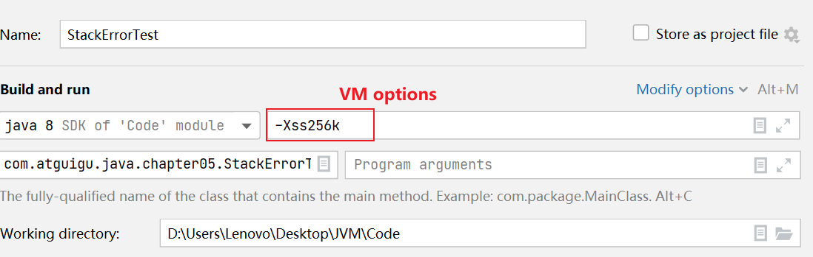
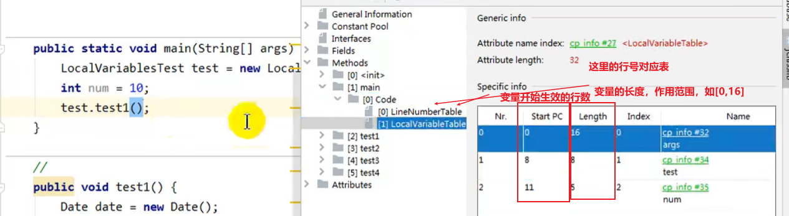
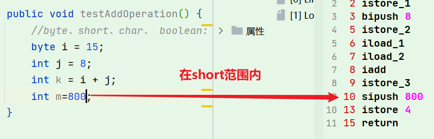
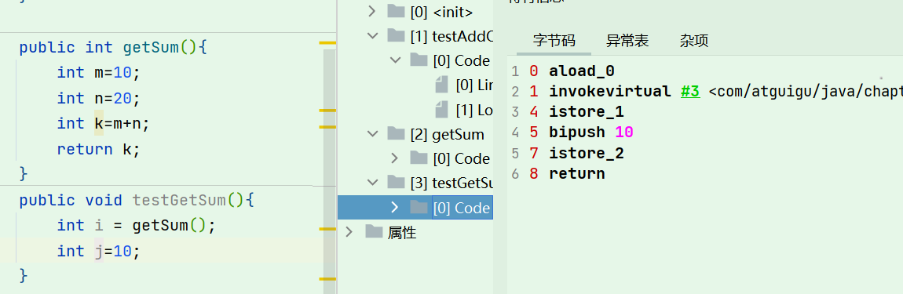
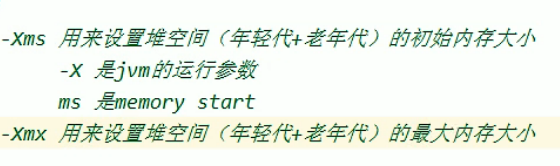
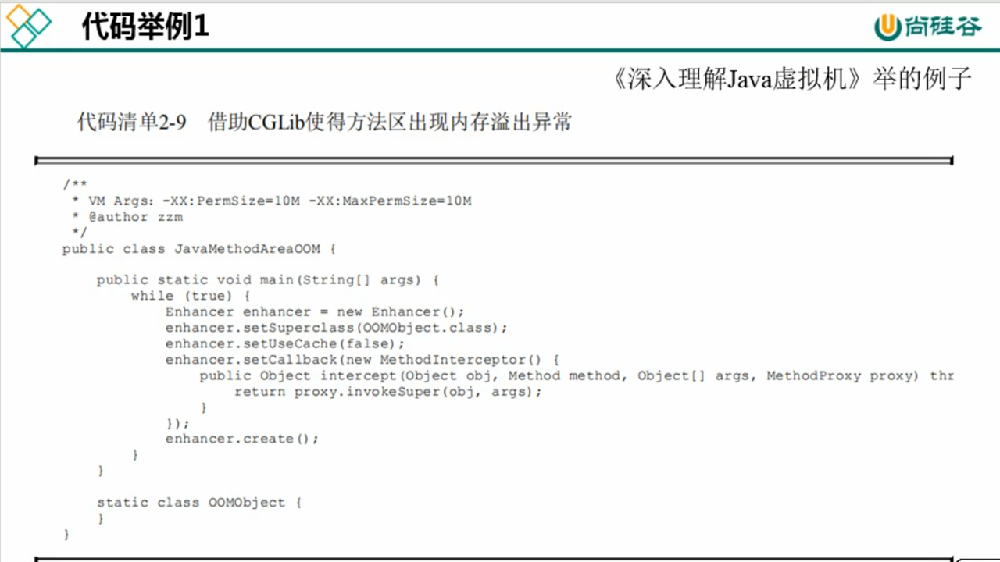

# **运行时数据区章节**

Runtime Data Areas


3大重点章节


# 3运行时数据区概述及线程

## 1概述

本节主要讲的是运行时数据区，也就是下图这部分，它是在类加载完成后的阶段


当我们通过前面的：类的加载-> 验证 -> 准备 -> 解析 -> 初始化 这几个阶段完成后，就会用到执行引擎对我们的类进行使用，同时执行引擎将会使用到我们运行时数据区


也就是大厨做饭，我们把大厨后面的东西（切好的菜，刀，调料），比作是运行时数据区。而厨师可以类比于执行引擎，将通过准备的东西进行制作成精美的菜品


> cpu-＞cache-＞内存-＞硬盘

**内存是非常重要的系统资源，是硬盘和CPU的中间仓库及桥梁**，承载着操作系统和应用程序的实时运行JVM内存布局规定了Java在运行过程中内存申请、分配、管理的策略，保证了JVM的高效稳定运行。不同的JVM对于内存的划分方式和管理机制存在着部分差异。结合JVM虚拟机规范，来探讨一下经典的JVM内存布局。

> 我们通过磁盘或者网络IO得到的数据，都需要先加载到内存中，然后CPU从内存中获取数据进行读取，也就是说内存充当了CPU和磁盘之间的桥梁

运行时数据区的完整图


> 是的，**元空间是方法区的具体实现**

Java虚拟机定义了若干种程序运行期间会使用到的运行时数据区，其中有一些会随着虚拟机启动而创建，随着虚拟机退出而销毁。另外一些则是与线程一一对应的，这些与线程对应的数据区域会随着线程开始和结束而创建和销毁。


**灰色的为单独线程私有的，红色的为多个线程共享的**。即：

- 每个线程：独立包括程序计数器、栈、本地栈。
- 线程间共享：堆、堆外内存（永久代或元空间、代码缓存）


关于线程间共享的说明


**每个JVM只有一个Runtime实例**。即为运行时环境，相当于内存结构的中间的那个框框:运行时环境（运行时数据区）。

## 2线程

线程是一个程序里的运行单元。JVM允许一个应用有多个线程并行的执行。
在Hotspot JVM里，每个线程都与操作系统的本地线程直接映射。

- 当一个Java线程准备好执行以后，此时一个操作系统的本地线程也同时创建。Java线程执行终止后，本地线程也会回收。

操作系统负责所有线程的安排调度到任何一个可用的CPU上。一旦本地线程初始化成功，它就会调用Java线程中的run（）方法。

>  ●守护线程、普通线程
>
> 如：如果最后一个线程是守护线程，JVM就可以退出了

### JVM系统线程

如果你使用**jconsole**或者是任何一个调试工具，都能看到在后台有许多线程在运行。这些后台线程不包括调用public static void main（String[]）的main线程以及所有这个main线程自己创建的线程。|
这些主要的后台系统线程在Hotspot JVM里主要是以下几个：

- 虚拟机线程：这种线程的操作是需要JVM达到**安全点**才会出现。这些操作必须在不同的线程中发生的原因是他们都需要JVM达到安全点，这样堆才不会变化。这种线程的执行类型包括"stop-the-world"的垃圾收集，线程栈收集，线程挂起以及偏向锁撤销。
- 周期任务线程：这种线程是时间周期事件的体现（比如中断），他们一般用于周期性操作的调度执行。
- GC线程：这种线程对在JVM里不同种类的垃圾收集行为提供了支持。
- 编译线程：这种线程在运行时会将字节码编译成到本地代码。
- 信号调度线程：这种线程接收信号并发送给JVM，在它内部通过调用适当的方法进行处理。

# 4程序计数器

## 介绍


[官网介绍](https://docs.oracle.com/javase/specs/jvms/se8/html/)

JVM中的**程序计数寄存器（Program Counter Register**中，Register的命名源于CPU的寄存器，寄存器存储指令相关的现场信息。CPU只有把数据装载到寄存器才能够运行。这里，并非是广义上所指的物理寄存器，或许将其翻译为PC计数器（或指令计数器）会更加贴切（也称为程序钩子），并且也不容易引起一些不必要的误会。**JVM中的PC寄存器是对物理PC寄存器的一种抽象模拟。**


它是一块很小的内存空间，几乎可以忽略不记。也是运行速度最快的存储区域。

在JVM规范中，每个线程都有它自己的程序计数器，是线程私有的，生命周期与线程的生命周期保持一致。（只要是线程私有的，生命周期都是一致的）

任何时间一个线程都只有一个方法在执行，也就是所谓的**当前方法**。程序计数器会存储当前线程正在执行的Java方法的JVM指令地址；或者，如果是在执行native方法，则是未指定值（undefned）。

它是程序控制流的指示器，分支、循环、跳转、异常处理、线程恢复等基础功能都需要依赖这个计数器来完成。字节码解释器工作时就是通过改变这个计数器的值来选取下一条需要执行的字节码指令。

它是唯一一个在Java虚拟机规范中没有规定任何outotMemoryError情况的区域。

> PC计数器既没有GC、也没有OOM
>
> PC计数器，有点类似于集合中的迭代器。

## 作用

PC寄存器用来**存储指向下一条指令的地址**，也即将要执行的指令代码。由执行引擎读取下一条指令。


## 代码演示

我们首先写一个简单的代码

```java
/**程序计数器
 */
public class PCRegisterTest {
    public static void main(String[] args) {
        int i = 10;
        int j = 20;
        int k = i + j;
    }
}
```

然后将代码进行编译成字节码文件，我们再次查看 ，发现在**字节码的左边有一个行号标识，它其实就是指令地址**，用于指向当前执行到哪里。

```bash
Code:
    stack=2, locals=4, args_size=1
      0: bipush        10
      2: istore_1
      3: bipush        20
      5: istore_2
      6: iload_1
      7: iload_2
      8: iadd
      9: istore_3
      10: return
```

通过PC寄存器，我们就可以知道当前程序执行到哪一步了 


## PC计数器的作用？

**使用PC寄存器存储字节码指令地址有什么用呢?
为什么使用PC寄存器记录当前线程的执行地址呢?**

因为CPU**需要不停的切换各个线程**，这时候切换回来以后，就得知道接着从哪开始继续执行。

JVM的字节码解释器就需要通过改变PC寄存器的值来明确下一条应该执行什么样的字节码指令。


## PC寄存器为什么被设定为私有的？

我们都知道所谓的多线程在一个特定的时间段内只会执行其中某一个线程的方法，CPU会不停地做任务切换，这样必然导致经常中断或恢复，如何保证分毫无差呢？**为了能够准确地记录各个线程正在执行的当前字节码指令地址，最好的办法自然是为每一个线程都分配一个PC寄存器**这样一来各个线程之间便可以进行独立计算，从而不会出现相互干扰的情况。

由于CPU时间片轮限制，众多线程在并发执行过程中，任何一个确定的时刻，一个处理器或者多核处理器中的一个内核，只会执行某个线程中的一条指令。

这样必然导致经常中断或恢复，如何保证分毫无差呢？每个线程在创建后，都会产生自己的程序计数器和栈帧，程序计数器在各个线程之间互不影响。


## CPU时间片

CPU时间片即CPU分配给各个程序的时间，每个线程被分配一个时间段，称作它的时间片。

在宏观上：俄们可以同时打开多个应用程序，每个程序并行不悖，同时运行。

但在微观上：由于只有一个CPU，一次只能处理程序要求的一部分，如何处理公平，一种方法就是引入时间片，每个程序轮流执行。


# 5虚拟机栈

## 1虚拟机栈概述

由于跨平台性的设计，Java的指令都是根据栈来设计的。不同平台CPU架构不同，所以不能设计为基于寄存器的。
**优点是跨平台，指令集小，编译器容易实现，缺点是性能下降，实现同样的功能需要更多的指令。**

有不少Java开发人员一提到Java内存结构，就会非常粗粒度地将JVM中的内存区理解为仅有Java堆（heap）和Java战（stack）？为什么？

首先栈是运行时的单位，而堆是存储的单位

- **栈解决程序的运行问题**，即程序如何执行，或者说如何处理数据。
- **堆解决的是数据存储的问题**，即数据怎么放，放哪里


### Java虚拟机栈是什么

Java虚拟机栈（Java Virtual Machine Stack），早期也叫Java栈。每个线程在创建时都会创建一个虚拟机栈，其内部保存一个个的**栈帧（Stack Frame）**，对应着一次次的Java方法调用。

- **是线程私有的**


### 生命周期

生命周期和线程一致，也就是线程结束了，该虚拟机栈也销毁了

### 作用

主管Java程序的运行，它保存方法的局部变量（8种基本数据类型、对象的引用地址）、部分结果，并参与方法的调用和返回。

> 局部变量，它是相比于成员变量来说的（或属性）
>
> 基本数据类型变量 VS  引用类型变量（类、数组、接口）

### 栈的特点

栈是一种快速有效的分配存储方式，访问速度仅次于程序计数器。JVM直接对Java栈的操作只有两个：

- 每个方法执行，伴随着进栈（入栈、压栈）
- 执行结束后的出栈工作

对于**栈来说不存在垃圾回收（GC）问题（栈存在溢出的情况，OOM）**


### 开发中遇到哪些异常？

栈中可能出现的异常

Java 虚拟机规范允许**Java栈的大小是动态的或者是固定不变的。**

如果采用**固定大小的Java虚拟机栈**，那每一个线程的Java虚拟机栈容量可以在线程创建的时候独立选定。如果线程请求分配的栈容量超过Java虚拟机栈允许的最大容量，Java虚拟机将会抛出一个`StackoverflowError` 异常。

如果**Java虚拟机栈可以动态扩展**，并且在尝试扩展的时候无法申请到足够的内存，或者在创建新的线程时没有足够的内存去创建对应的虚拟机栈，那Java虚拟机将会抛出一个 `outofMemoryError` 异常。

```java
/**
 * 演示栈中的异常：StackOverflowError

 * @create: 2020-07-05-17:11
 */
public class StackErrorTest {
    private static int count = 1;
    public static void main(String[] args) {
        System.out.println(count++);
        main(args);
    }
}
```

当栈深度达到9825（不同电脑可能不同）的时候，就出现栈内存空间不足

### 设置栈内存大小

我们可以使用参数 **-Xss选项来设置线程的最大栈空间**，栈的大小直接决定了函数调用的最大可达深度

官网解释：[官网链接](https://docs.oracle.com/en/java/javase/11/tools/java.html#GUID-3B1CE181-CD30-4178-9602-230B800D4FAE)

- -Xss size（X stack size ？？）

Sets the thread stack size (in bytes). Append the letter `k` or `K` to indicate KB, `m` or `M` to indicate MB, and `g` or `G` to indicate GB. The default value depends on the platform:

- Linux/x64 (64-bit): 1024 KB
- macOS (64-bit): 1024 KB
- Oracle Solaris/x64 (64-bit): 1024 KB
- Windows: The default value depends on virtual memory

The following examples set the thread stack size to 1024 KB in different units:

```
Copy-Xss1m
-Xss1024k
-Xss1048576
```



## 2栈的存储单位-栈帧

每个线程都有自己的栈，栈中的数据都是**以栈帧（Stack Frame）的格式存在。**

在这个线程上正在执行的每个方法都各自对应一个栈帧（Stack Frame）。

栈帧是一个内存区块，是一个数据集，维系着方法执行过程中的各种数据信息。

### 栈中存储什么？-栈帧

> OOP的基本概念：类和对象
>
> 类中基本结构：field（属性、字段、域）、method

JVM直接对Java栈的操作只有两个，就是对栈帧的**压栈**和出栈，**遵循“先进后出”/“后进先出”原则。**

在一条活动线程中，一个时间点上，只会有一个活动的栈帧。即只有当前正在执行的方法的栈帧（栈顶栈帧）是有效的，这个栈帧被称为**当前栈帧（Current Frame）**，与当前栈帧相对应的方法就是**当前方法（Current Method）**，定义这个方法的类就是**当前类（Current Class）**。

执行引擎运行的所有字节码指令只针对当前栈帧进行操作。

如果在该方法中调用了其他方法，对应的新的栈帧会被创建出来，放在栈的顶端，成为新的当前帧。


下面写一个简单的代码

```java
/**
 * 栈帧
 *
 * @create: 2020-07-05-20:33
 */
public class StackFrameTest {
    public static void main(String[] args) {
        method01();
    }

    private static int method01() {
        System.out.println("方法1的开始");
        int i = method02();
        System.out.println("方法1的结束");
        return i;
    }

    private static int method02() {
        System.out.println("方法2的开始");
        int i = method03();;
        System.out.println("方法2的结束");
        return i;
    }
    private static int method03() {
        System.out.println("方法3的开始");
        int i = 30;
        System.out.println("方法3的结束");
        return i;
    }
}
```

输出结果为

```bash
方法1的开始
方法2的开始
方法3的开始
方法3的结束
方法2的结束
方法1的结束
```

满足栈先进后出的概念，**通过Idea的 DEBUG，能够看到栈信息**


### 栈运行原理

不同线程中所包含的栈帧是不允许存在相互引用的，即不可能在一个栈帧之中引用另外一个线程的栈帧。

如果当前方法调用了其他方法，方法返回之际，当前栈帧会传回此方法的执行结果给前一个栈帧，接着，虚拟机会丢弃当前栈帧，使得前一个栈帧重新成为当前栈帧。

Java方法有**两种返回函数的方式**，**一种是==正常==的函数返回，使用return指令；另外一种是抛出==异常==。不管使用哪种方式，都会导致栈帧被弹出。**

### 栈帧的内部结构

每个栈帧中存储着：

- **局部变量表（Local Variables）**
- **操作数栈（operand Stack）（或表达式栈）**
- 动态链接（DynamicLinking）（或指向运行时常量池的方法引用）
- 方法返回地址（Return Address）（或方法正常退出或者异常退出的定义）
- 一些附加信息

> 栈里栈帧的数量取决于栈帧的大小，栈帧的大小主要取决于局部变量表和操作数栈的大小


并行每个线程下的栈都是私有的，因此每个线程都有自己各自的栈，并且每个栈里面都有很多栈帧，栈帧的大小主要由局部变量表 和 操作数栈决定的


## 3局部变量表

局部变量表：**Local Variables**，被称之为局部变量数组或本地变量表

**定义为一个数字数组，主要用于存储方法参数和定义在方法体内的局部变量,**这些数据类型包括各类基本数据类型、对象引用（reference），以及returnAddress类型。

由于局部变量表是建立在线程的栈上，是线程的私有数据，因此**不存在数据安全问题(多线程操作，没有数据共享)**

**局部变量表所需的容量大小是在编译期确定下来的**，并保存在方法的Code属性的**maximum local variables**数据项中。在方法运行期间是不会改变局部变量表的大小的。

**方法嵌套调用的次数由栈的大小决定**，一般来说，**栈越大，方法嵌套调用次数越多**对一个函数而言，它的参数和局部变量越多，使得局部变量表膨胀，它的栈帧就越大，以满足方法调用所需传递的信息增大的需求。进而函数调用就会占用更多的栈空间，导致其嵌套调用次数就会减少。

**局部变量表中的变量只在当前方法调用中有效**。在方法执行时，虚拟机通过使用局部变量表完成参数值到参数变量列表的传递过程。**当方法调用结束后，随着方法栈帧的销毁，局部变量表也会随之销毁。**


```bash
  public static void main(java.lang.String[]);
    descriptor: ([Ljava/lang/String;)V
    flags: ACC_PUBLIC, ACC_STATIC
    Code:
      stack=2, locals=3, args_size=1		//locals表示局部变量表（）容量
         0: new           #3                  // class com/atguigu/java/chapter05/LocalVariablesTest
         3: dup
         4: invokespecial #4                  // Method "<init>":()V
         7: astore_1
         8: bipush        10
        10: istore_2
        11: aload_1
        12: invokevirtual #5                  // Method test1:()V
        15: return
      LineNumberTable:
        line 9: 0
        line 10: 8
        line 11: 11
        line 12: 15
      LocalVariableTable:
        Start  Length  Slot  Name   Signature
            0      16     0  args   [Ljava/lang/String; #L表示引用类型
            8       8     1  test   Lcom/atguigu/java/chapter05/LocalVariablesTest;
           11       5     2   num   I

```



### 关于Slot的理解

参数值的存放总是在局部变量数组的index0开始，到数组长度-1的索引结束。

局部变量表，**最基本的存储单元是Slot（变量槽）**

局部变量表中存放编译期可知的各种基本数据类型（8种），引用类型（reference），returnAddress类型的变量。

在局部变量表里，**32位以内的类型只占用一个slot（包括returnAddress类型），64位的类型（1ong和double）占用两个slot。**

>byte、short、char 在存储前被转换为int，boolean也被转换为int，0表示false，非0表示true。
>long和double则占据两个slot。

JVM会为局部变量表中的每一个Slot都分配一个访问索引，通过这个索引即可成功访问到局部变量表中指定的局部变量值

当一个实例方法被调用的时候，它的方法参数和方法体内部定义的局部变量将**会按照顺序被复制**到局部变量表中的每一个slot上

**如果需要访问局部变量表中一个64bit的局部变量值时，只需要使用前一个索引即可。**（比如：访问1ong或doub1e类型变量）

如果当前帧是由构造方法或者实例方法创建的，那么**该对象引用this将会存放在index为0的s1ot处，**其余的参数按照参数表顺序继续排列。


### Slot的重复利用

**栈帧中的局部变量表中的槽位是可以重用的**，如果一个局部变量过了其作用域，那么在其作用域之后申明的新的局部变就很有可能会复用过期局部变量的槽位 **，从而达到节省资源的目的**

```java
public void test4() {
    int a = 0;
    {
        int b = 0;
        b = a + 1;
    }
    //变量c使用之前已经销毁的变量b占据的slot的位置
    int c = a + 1;
}
```

### 静态变量与局部变量的对比

变量的分类：

- 按数据类型分：基本数据类型、引用数据类型

- 按类中声明的位置分：成员变量（类变量，实例变量）、局部变量
  
  - 成员变量 在使用前，都经历过默认初始化赋值
     - 类变量：linking的paper阶段，给类变量默认赋值，initial阶段给类变量显示赋值及静态代码块
     - 实例变量：随着对象创建，会在堆空间中分配实例变量空间，并进行默认赋值
  - 局部变量：在使用前必须进行显式赋值，不然编译不通过。

参数表分配完毕之后，再根据方法体内定义的变量的顺序和作用域分配。

我们知道类变量表有两次初始化的机会，第一次是在**“准备阶段”**，执行系统初始化，对类变量设置零值，另一次则是在“**初始化**”阶段，赋予程序员在代码中定义的初始值。

和类变量初始化不同的是，局部变量表不存在系统初始化的过程，这意味着一旦定义了局部变量则必须人为的初始化，否则无法使用。

```java
public void test() {
    int i;
    System. out. println(i);
}
```


这样的代码是错误的，没有赋值不能够使用。

**补充说明**

在栈帧中，与性能调优关系最为密切的部分就是前面提到的局部变量表。在方法执行时，虚拟机使用局部变量表完成方法的传递。

**局部变量表中的变量也是重要的垃圾回收根节点，只要被局部变量表中直接或间接引用的对象都不会被回收。**

## 4操作数栈

### 概念

操作数栈：Operand Stack

每一个独立的栈帧除了包含局部变量表以外，还包含一个后进先出（Last - In - First -Out）的 **操作数栈**，也可以称之为 **表达式栈**（Expression Stack）

**操作数栈，在方法执行过程中，根据字节码指令，往栈中写入数据或提取数据，即入栈（push）和 出栈（pop）**

- 某些字节码指令将值压入操作数栈，其余的字节码指令将操作数取出栈。使用它们后再把结果压入栈
- 比如：执行复制、交换、求和等操作


代码举例


操作数栈，**主要用于保存计算过程的中间结果，同时作为计算过程中变量临时的存储空间。**

操作数栈就是JVM执行引擎的一个工作区，当一个方法刚开始执行的时候，一个新的栈帧也会随之被创建出来，**这个方法的操作数栈是空的。**

> 这个时候数组是有长度的，因为数组一旦创建，那么就是不可变的

每一个操作数栈都会拥有一个明确的栈深度用于存储数值，其所需的最大深度在**编译期就定义好了**，保存在方法的Code属性中，**为(max) stack的值**。

栈中的任何一个元素都是可以任意的Java数据类型

- 32bit的类型占用一个栈单位深度
- 64bit的类型占用两个栈单位深度

操作数栈并非采用访问索引的方式来进行数据访问的，而是只能通过标准的入栈和出栈操作来完成一次数据访问

**如果被调用的方法带有返回值的话，其返回值将会被压入当前栈帧的操作数栈中**，并更新PC寄存器中下一条需要执行的字节码指令。

操作数栈中元素的数据类型必须与字节码指令的序列严格匹配，这由编译器在编译器期间进行验证，同时在类加载过程中的类检验阶段的数据流分析阶段要再次验证。|

另外，我们说Java虚拟机的**解释引擎是基于栈的执行引擎**，其中的**栈指的就是操作数栈。**

## 5代码追踪

我们给定代码

```java
public void testAddOperation() {
    byte i = 15;
    int j = 8;
    int k = i + j;
}
```

使用javap 命令反编译class文件： javap -v 类名.class


> byte、short、char、boolean 内部都是使用int型来进行保存的
>
> 从上面的代码我们可以知道，我们都是通过bipush对操作数 15 和  8进行入栈操作
>
> 同时使用的是 iadd方法进行相加操作，i -> 代表的就是 int，也就是int类型的加法操作
>
> istore_1 保存在局部变量表为1的位置

执行流程如下所示：

首先执行第一条语句，PC寄存器指向的是0，也就是指令地址为0，然后使用bipush让操作数15入栈。


执行完后，让PC + 1，指向下一行代码，下一行代码就是将操作数栈的元素存储到局部变量表1的位置，我们可以看到局部变量表的已经增加了一个元素


> 为什么局部变量表不是从0开始的呢？
>
> 其实局部变量表也是从0开始的，但是因为0号位置存储的是this指针，所以说就直接省略了~

然后PC+1，指向的是下一行。让操作数8也入栈，同时执行store操作，存入局部变量表中


然后从局部变量表中，依次将数据放在操作数栈中


然后将操作数栈中的两个元素执行相加操作，并存储在局部变量表3的位置


最后PC寄存器的位置指向10，也就是return方法，则直接退出方法

### 补充





### 5.3-涉及操作数栈的字节码指令执行分析

> aload_0：从当前栈帧的局部变量表中获取this对象到操作数栈；load从局部变量表取出到操作数栈入栈，0是this，
> invokevirtual：调用实例方法getSum();
> istore_1:将getSum()返回值保存在局部变量表中。
> invokvirtual会将返回值保存到operand stack里面。



i++和++i的区别

```java
/*
程序员面试过程中，常见的i++和++i 的区别，放到字节码篇章时再介绍。
*/
public void add() {
    //第1类问题:
    int i1 = 10;
    i1++;
    int i2 = 10;
    ++i2;
    //第2类问题:
    int i3 = 10;
    int i4 = i3++;
    int i5 = 10;
    int i6 = ++i5;

    //第3类问题:
    int i7 = 10;
    i7 = i7++;
    int i8 = 10;
    i8 = ++i8;
    //第4类问题:
    int i9 = 10;
    int i10 = i9++ + ++i9;

}
```


## 6栈顶缓存技术

栈顶缓存技术：**Top Of Stack Cashing**

前面提过，基于栈式架构的虚拟机所使用的零地址指令更加紧凑，但完成一项操作的时候必然需要使用更多的入栈和出栈指令，这同时也就意味着将需要更多的指令分派（instruction dispatch）次数和内存读/写次数。

由于操作数是存储在内存中的，因此频繁地执行内存读/写操作必然会影响执行速度。为了解决这个问题，HotSpot JVM的设计者们提出了栈顶缓存（Tos，Top-of-Stack Cashing）技术，**将栈顶元素全部缓存在物理CPU的寄存器中，以此降低对内存的读/写次数，提升执行引擎的执行效率。**

> 寄存器：指令更少，执行速度快
>
> 寄存器是由d触发器做的，而内存是由电容做的，两个效率差很多，寄存器可以做到在几个cpu时间的读到数据

## 7动态链接

动态链接：**Dynamic Linking**，又称为 **==指向运行时常量池的方法引用==**


> **动态链接、方法返回地址、附加信息** ： 有些地方被称为**帧数据区**

每一个栈帧内部都包含一个指向 ==**运行时常量池**== 中**该栈帧所属方法的引用**,包含这个引用的目的就是为了支持当前方法的代码能够实现**动态链接（Dynamic Linking）**。比如：<u>invokedynamic指令</u>

在Java源文件被编译到字节码文件中时，所有的变量和方法引用都作为符号引用（symbolic Reference）保存在class文件的常量池里。

比如：描述一个方法调用了另外的其他方法时，就是通过常量池中指向方法的符号引用来表示的，那么**动态链接的作用就是为了将这些符号引用转换为调用方法的直接引用。**


> 由类的字节码文件生成该类的二进制流，通过字节流将该类的类信息放在方法区，最后在内存中生成该类的Class对象放在堆中，这个Class对象作为访问方法区数据的入口


> **为什么需要运行时常量池？**
>
> 因为在不同的方法，都可能调用**常量或者方法**，所以**只需要存储一份即可，节省了空间**
>
> 常量池的作用：就是为了**提供一些符号和常量，便于指令的识别**

## 8方法调用：解析与分配

在JVM中，将符号引用转换为调用方法的直接引用与方法的绑定机制相关

### 链接

#### 静态链接

当一个字节码文件被装载进JVM内部时，如果**被调用的目标方法在编译期可知**，且运行期保持不变时，这种情况下将调用方法的符号引用转换为直接引用的过程称之为静态链接

> ==**符号引用**== 
>
> 在java中，一个java类将会编译成一个class文件。在编译时，**java类并不知道引用类的实际内存地址，因此只能使用符号引用来代替。** 比如org.simple.People类引用org.simple.Tool类，在编译时People类并不知道Tool类的实际内存地址，因此只能使用符号org.simple.Tool(假设)来表示Tool类的地址。而在类装载器装载People类时，此时可以通过虚拟机获取Tool类 的实际内存地址，因此便可以既将符号org.simple.Tool替换为Tool类的实际内存地址，及直接引用地址。

#### 动态链接

如果**被调用的方法在编译期无法被确定下来**，也就是说，只能够在程序运行期将调用的方法的符号转换为直接引用，由于这种引用转换过程具备动态性，因此也被称之为动态链接。

### 绑定机制
>包含：字段、方法或者类
而 **(动态、静态)链接只是方法的符号引用转换为直接引用**

对应的方法的绑定机制为：早期绑定（Early Binding）和晚期绑定（Late Binding）。**绑定是一个字段、方法或者类在符号引用被替换为直接引用的过程，这仅仅发生一次。**

#### 早期绑定

早期绑定就是指被调用的**目标方法如果在编译期可知，且运行期保持不变时**，即可将这个方法与所属的类型进行绑定，这样一来，由于明确了被调用的目标方法究竟是哪一个，因此也就可以使用静态链接的方式将符号引用转换为直接引用。

#### 晚期绑定

如果**被调用的方法在编译期无法被确定下来，只能够在程序运行期根据实际的类型绑定相关的方法**，这种绑定方式也就被称之为晚期绑定。


### 早晚期绑定的发展历史

随着高级语言的横空出世，类似于Java一样的基于面向对象的编程语言如今越来越多，尽管这类编程语言在语法风格上存在一定的差别，但是它们彼此之间始终保持着一个共性，那就是都支持封装、继承和多态等面向对象特性，既然**这一类的编程语言具备多态特悄，那么自然也就具备早期绑定和晚期绑定两种绑定方式。**

Java中**任何一个普通的方法其实都具备虚函数的特征**，它们相当于C++语言中的虚函数（C++中则需要使用关键字virtual来显式定义）。如果在**Java程序中不希望某个方法拥有虚函数的特征时，则可以使用关键字final来标记这个方法。**

### 虚方法和非虚方法

- 如果**方法在编译期就确定了**具体的调用版本，这个版本在运行时是不可变的。这样的方法称为**非虚方法。**
- 静态方法、私有方法、fina1方法、实例构造器、父类方法都是非虚方法。
- **其他方法称为虚方法。**

> 子类对象的多态的使用前提
>
> - 类的继承关系
> - 方法的重写

虚拟机中提供了以下几条**方法调用指令**：

#### 普通调用指令：

- **invokestatic：调用静态方法，解析阶段确定唯一方法版本**
- **invokespecial：调用`<init>`方法、私有及父类方法，解析阶段确定唯一方法版本**
- invokevirtual：调用所有虚方法
- invokeinterface：调用接口方法

#### 动态调用指令：

- invokedynamic：动态解析出需要调用的方法，然后执行

前四条指令固化在虚拟机内部，方法的调用执行不可人为干预，而invokedynamic指令则支持由用户确定方法版本。**其中invokestatic指令和invokespecial指令调用的方法称为非虚方法，其余的（fina1修饰的除外）称为虚方法。**

> 静态方法不能被重写
>
> 其余的（fina1修饰的除外）称为虚方法。
>
> 这个是历史遗留问题，《Java语言规范》**明确定义final修饰的方法是非虚方法**

### invokednamic指令

JVM字节码指令集一直比较稳定，一直到Java7中才增加了一个invokedynamic指令，**这是【Java为了实现动态类型语言】支持而做的一种改进。**

但是在Java7中并没有提供直接生成invokedynamic指令的方法，需要借助ASM这种底层字节码工具来产生invokedynamic指令。**直到Java8的Lambda表达式的出现，invokedynamic指令的生成，在Java中才有了直接的生成方式。**

Java7中增加的动态语言类型支持的本质是对Java虚拟机规范的修改，而不是对Java语言规则的修改，这一块相对来讲比较复杂，增加了虚拟机中的方法调用，最直接的受益者就是运行在Java平台的动态语言的编译器。

### 动态类型语言和静态类型语言

动态类型语言和静态类型语言两者的区别就在于**对类型的检查是在编译期还是在运行期**，满足前者就是静态类型语言，反之是动态类型语言。

说的再直白一点就是，**静态类型语言是==判断变量自身的类型信息==；动态类型语言是==判断变量值的类型信息==，变量没有类型信息，变量值才有类型信息**，这是动态语言的一个重要特征。

> Java：String info = "mogu blog";     (Java是静态类型语言的，会先编译就进行类型检查)
>
> JS：var name = "shkstart";    var name = 10;    （运行时才进行检查）

### 方法重写的本质

#### Java 语言中方法重写的本质：

- 找到操作数栈顶的第一个元素所执行的对象的实际类型，记作C。

  > 1、在编译阶段，**编译器只知道对象的静态类型，而不知道实际类型**，因此只能在class文件中确定调用父类的方法。
  >
  > 2、在执行过程中，它将判断对象的实际类型。如果实际类型实现了这种方法，它将被直接调用。如果没有实现，它将根据继承关系从下到上进行检索。只要检索到，它将被调用。如果没有检索到，它将被抛弃。

- 如果在类型C中找到与常量中的描述符合简单名称都相符的方法，则进行访问权限校验，如果通过则返回这个方法的直接引用，查找过程结束；如果不通过，则返回java.1ang.I1legalAccessError 异常。

- 否则，按照继承关系从下往上依次对C的各个父类进行第2步的搜索和验证过程。

- 如果始终没有找到合适的方法，则抛出java.1ang.AbstractMethodsrror异常。

#### IllegalAccessError介绍

程序试图访问或修改一个属性或调用一个方法，这个属性或方法，你没有权限访问。一般的，这个会引起编译器异常。这个错误如果发生在运行时，就说明一个类发生了不兼容的改变。

### 方法的调用：虚方法表

在面向对象的编程中，会很频繁的使用到动态分派，如果在每次动态分派的过程中都要重新在类的方法元数据中搜索合适的目标的话就可能影响到执行效率。因此，==为了提高性能==，JVM采用在类的方法区建立一个**虚方法表（virtual method table）（非虚方法不会出现在表中）来实现。使用索引表来代替查找。**

每个类中都有一个虚方法表，表中存放着各个方法的实际入口。

**虚方法表是什么时候被创建的呢？**

虚方法表会在类加载的 **链接阶段(解析阶段Resolve)** 被创建并开始初始化，类的变量初始值准备完成之后，JVM会把该类的方法表也初始化完毕。

建立虚方法表：**在调用父类有子类没有的方法时，直接到虚方法表中去寻找即可，提高了效率。**


如上图所示：如果类中重写了方法，那么调用的时候，就会直接在虚方法表中查找，否则将会直接连接到Object的方法中。


## 9方法返回地址

**(Return Address)**

存放调用该方法的pc寄存器的值。一个方法的结束，有两种方式：

- 正常执行完成

- 出现未处理的异常，非正常退出

无论通过哪种方式退出，在方法退出后都返回到该方法被调用的位置。方法正常退出时，**调用者的pc计数器的值作为返回地址，即调用该方法的指令的下一条指令的地址**。而通过异常退出的，返回地址是要通过异常表来确定，栈帧中一般不会保存这部分信息。

本质上，方法的退出就是当前栈帧出栈的过程。此时，需要恢复上层方法的局部变量表、操作数栈、将返回值压入调用者栈帧的操作数栈、设置PC寄存器值等，让调用者方法继续执行下去。
**正常完成出口和异常完成出口的区别在于:通过异常完成出口退出的不会给他的上层调用者产生任何的返回值**。

当一个方法开始执行后，只有两种方式可以退出这个方法：

执行引擎遇到任意一个方法返回的字节码指令（return），会有返回值传递给上层的方法调用者，简称**正常完成出口；**

- 一个方法在正常调用完成之后，究竟需要使用哪一个返回指令，还需要根据方法返回值的实际数据类型而定。
- 在字节码指令中，返回指令包含ireturn（当返回值是boolean，byte，char，short和int类型时使用），lreturn（Long类型），freturn（Float类型），dreturn（Double类型），areturn。另外还有一个return指令声明为void的方法，实例初始化方法，类和接口的初始化方法使用。

在方法执行过程中遇到异常（Exception），并且这个异常没有在方法内进行处理，也就是只要在本方法的异常表中没有搜索到匹配的异常处理器，就会导致方法退出，简称**异常完成出口**。

方法执行过程中，抛出异常时的异常处理，存储在一个异常处理表，方便在发生异常的时候找到处理异常的代码


本质上，方法的退出就是当前栈帧出栈的过程。此时，需要恢复上层方法的局部变量表、操作数栈、将返回值压入调用者栈帧的操作数栈、设置PC寄存器值等，让调用者方法继续执行下去。

```bash
  public void method2();
    descriptor: ()V
    flags: ACC_PUBLIC
    Code:
      stack=1, locals=2, args_size=1
         0: aload_0
         1: invokevirtual #2                  // Method methodVoid:()V
         4: aload_0
         5: invokevirtual #3                  // Method method1:()V
         8: goto          16
        11: astore_1
        12: aload_1
        13: invokevirtual #5                  // Method java/io/IOException.printStackTrace:()V
        16: return
      Exception table:
         from    to  target type
             4     8    11   Class java/io/IOException
      LineNumberTable:
        line 62: 0
        line 64: 4
        line 67: 8
        line 65: 11
        line 66: 12
        line 68: 16
      LocalVariableTable:
        Start  Length  Slot  Name   Signature
           12       4     1     e   Ljava/io/IOException;
            0      17     0  this   Lcom/atguigu/java/chapter05/ReturnAddressTest;
      StackMapTable: number_of_entries = 2
        frame_type = 75 /* same_locals_1_stack_item */
          stack = [ class java/io/IOException ]
        frame_type = 4 /* same */

```

正常完成出口和异常完成出口的区别在于：通过异常完成出口退出的不会给他的上层调用者产生任何的返回值。

## 10一些附加信息

栈帧中还允许携带与Java虚拟机实现相关的一些附加信息。例如：对程序调试提供支持的信息。

## 11栈的相关面试题

- 举例栈溢出的情况？（StackOverflowError）
  - 通过 -Xss设置栈的大小
- 调整栈大小，就能保证不出现溢出么？
  - 不能保证不溢出
- 分配的栈内存越大越好么？
  - 不是，一定时间内降低了OOM概率，但是会挤占其它的线程空间，因为整个空间是有限的。
- 垃圾回收是否涉及到虚拟机栈？
  - 不会
- 方法中定义的局部变量是否线程安全？
  - 具体问题具体分析

```java
/**
 * 面试题
 * 方法中定义局部变量是否线程安全？具体情况具体分析
 * 何为线程安全？
 *    如果只有一个线程才可以操作此数据，则必是线程安全的
 *    如果有多个线程操作，则此数据是共享数据，如果不考虑共享机制，则为线程不安全

 * @create: 2020-07-06-16:08
 */
public class StringBuilderTest {

    // s1的声明方式是线程安全的
    //每次都是new的局部对象，多线程也是安全的，引用是放在局部变量表里的，是私有的
    public static void method01() {
        // 线程内部创建的，属于局部变量
        StringBuilder s1 = new StringBuilder();
        s1.append("a");
        s1.append("b");
    }

    // 这个也是线程不安全的，因为有返回值，有可能被其它的程序所调用
    public static StringBuilder method04() {
        StringBuilder stringBuilder = new StringBuilder();
        stringBuilder.append("a");
        stringBuilder.append("b");
        return stringBuilder;
    }

    // stringBuilder 是线程不安全的，操作的是共享数据
    public static void method02(StringBuilder stringBuilder) {
        stringBuilder.append("a");
        stringBuilder.append("b");
    }


    /**
     * 同时并发的执行，会出现线程不安全的问题
     */
    public static void method03() {
        StringBuilder stringBuilder = new StringBuilder();
        new Thread(() -> {
            stringBuilder.append("a");
            stringBuilder.append("b");
        }, "t1").start();

        method02(stringBuilder);
    }

    // StringBuilder是线程安全的，但是String也可能线程不安全的
    public static String method05() {
        StringBuilder stringBuilder = new StringBuilder();
        stringBuilder.append("a");
        stringBuilder.append("b");
        return stringBuilder.toString();
    }
}
```

总结一句话就是：**如果对象是在内部产生，并在内部消亡，没有返回到外部，那么它就是线程安全的，反之则是线程不安全的。**

### 运行时数据区，是否存在Error和GC？

| 运行时数据区 | 是否存在Error | 是否存在GC |
| ------------ | ------------- | ---------- |
| 程序计数器   | 否            | 否         |
| 虚拟机栈     | 是            | 否         |
| 本地方法栈   | 是            | 否         |
| 方法区       | 是（OOM）     | 是         |
| 堆           | 是            | 是         |


# 6本地方法接口

## 什么是本地方法

简单地讲，**一个Native Methodt是一个Java调用非Java代码的接囗**。一个Native Method是这样一个Java方法：该方法的实现由非Java语言实现，比如C。这个特征并非Java所特有，很多其它的编程语言都有这一机制，比如在C++中，你可以用extern "c" 告知c++编译器去调用一个c的函数。

"A native method is a Java method whose implementation is provided by non-java code."（本地方法是一个非Java的方法，它的具体实现是非Java代码的实现）

在定义一个native method时，并不提供实现体（有些像定义一个Java interface），因为其实现体是由非java语言在外面实现的。

本地接口的作用是融合不同的编程语言为Java所用，它的初衷是融合C/C++程序。


代码举例说明Native方法是如何编写的

```java
/**
 * 本地方法
 */
public class IhaveNatives {
    public native void Native1(int x);
    native static public long Native2();
    native synchronized private float Native3(Object o);
    native void Natives(int[] ary) throws Exception;
}
```

> 需要注意的是：**标识符native可以与其它java标识符连用，但是abstract除外**

## 为什么使用Native Method？

Java使用起来非常方便，然而有些层次的任务用Java实现起来不容易，或者我们对程序的效率很在意时，问题就来了。

### 与Java环境的交互

**有时Java应用需要与Java外面的环境交互，这是本地方法存在的主要原因。** 你可以想想Java需要与一些底层系统，如操作系统或某些硬件交换信息时的情况。本地方法正是这样一种交流机制：它为我们提供了一个非常简洁的接口，而且我们无需去了解Java应用之外的繁琐的细节。

### 与操作系统的交互

JVM支持着Java语言本身和运行时库，它是Java程序赖以生存的平台，它由一个解释器（解释字节码）和一些连接到本地代码的库组成。然而不管怎样，它毕竟不是一个完整的系统，它经常依赖于一底层系统的支持。这些底层系统常常是强大的操作系统。**通过使用本地方法，我们得以用Java实现了jre的与底层系统的交互，甚至JVM的一些部分就是用c写的。** 还有，如果我们要使用一些Java语言本身没有提供封装的操作系统的特性时，我们也需要使用本地方法。

### Sun's Java

**Sun的解释器是用C实现的，这使得它能像一些普通的C一样与外部交互。** jre大部分是用Java实现的，它也通过一些本地方法与外界交互。例如：类java.lang.Thread的setpriority（）方法是用Java实现的，但是它实现调用的是该类里的本地方法setpriorityo（）。这个本地方法是用C实现的，并被植入JVM内部，在Windows 95的平台上，这个本地方法最终将调用Win32 setpriority（）ApI。这是一个本地方法的具体实现由JVM直接提供，更多的情况是本地方法由外部的动态链接库（external dynamic link library）提供，然后被JVw调用。

## 现状

**目前该方法使用的越来越少了，除非是与硬件有关的应用**，比如通过Java程序驱动打印机或者Java系统管理生产设备，在企业级应用中已经比较少见。因为现在的异构领域间的通信很发达，比如可以使用Socket通信，也可以使用Web Service等等，不多做介绍。

# 7本地方法栈

**Java虚拟机栈于管理Java方法的调用，而本地方法栈用于管理本地方法的调用。**

本地方法栈，也是线程私有的。

允许被实现成固定或者是可动态扩展的内存大小。（在内存溢出方面是相同的）

- 如果线程请求分配的栈容量超过本地方法栈允许的最大容量，Java虚拟机将会抛出一个stackoverflowError 异常。
- 如果本地方法栈可以动态扩展，并且在尝试扩展的时候无法申请到足够的内存，或者在创建新的线程时没有足够的内存去创建对应的本地方法栈，那么Java虚拟机将会抛出一个outofMemoryError异常。

本地方法是使用C语言实现的。

它的具体做法是Native Method Stack中登记native方法，在Execution Engine 执行时加载本地方法库。


**当某个线程调用一个本地方法时，它就进入了一个全新的并且==不再受虚拟机限制的世界==。它和虚拟机拥有同样的权限。**

- 本地方法可以通过本地方法接口来访问虚拟机内部的运行时数据区。
- 它甚至可以直接使用本地处理器中的寄存器
- 直接从本地内存的堆中分配任意数量的内存。

**并不是所有的JVM都支持本地方法。因为Java虚拟机规范并没有明确要求本地方法栈的使用语言、具体实现方式、数据结构等。**如果JVM产品不打算支持native方法，也可以无需实现本地方法栈。

在Hotspot JVM中，直接将**本地方法栈和虚拟机栈合二为一。**

# 8堆

## 1堆的核心概念

**堆针对一个JVM进程来说是唯一的，也就是一个进程只有一个JVM**，但是进程包含多个线程，他们是共享同一堆空间的。


**一个JVM实例只存在一个堆内存**，堆也是Java内存管理的核心区域。

Java堆区在JVM启动的时候即被创建，其空间大小也就确定了。是JVM管理的最大一块内存空间。

- 堆内存的大小是可以调节的。

《Java虚拟机规范》规定，堆可以处于**物理上不连续**的内存空间中，但在**逻辑上**它应该被视为**连续的**。

所有的线程共享Java堆，在这里还可以划分**线程私有的缓冲区（Thread Local Allocation Buffer，TLAB）。**

> -Xms10m：最小堆内存
>
> -Xmx10m：最大堆内存

下图就是使用：Java VisualVM查看堆空间的内容，通过 jdk bin提供的插件

> jdk/bin目录下
>
> idea中有这个插件： VisualVM Launcher，可以直接运行，自动跳出VisualVM
>
> 这里需要安装visualGC插件：没有visualGC的点**工具->插件自己安装就有了**


《Java虚拟机规范》中对Java堆的描述是：所有的对象实例以及数组都应当在运行时分配在堆上。（The heap is the run-time data area from which memory for all class instances and arrays is allocated）

我要说的是：“几乎”所有的对象实例都在这里分配内存。—从实际使用角度看的。

- 因为还有一些对象是在栈上分配的

数组和对象可能永远不会存储在栈上，因为栈帧中保存引用，这个引用指向对象或者数组在堆中的位置。

在方法结束后，堆中的对象不会马上被移除，**仅仅在垃圾收集的时候才会被移除。**

- 也就是触发了GC的时候，才会进行回收
- 如果堆中对象马上被回收，那么用户线程就会收到影响，因为有stop the word

堆，是GC（Garbage Collection，垃圾收集器）执行垃圾回收的重点区域。


### 堆内存细分

Java 7及之前堆内存逻辑上分为三部分：新生代+老年代+**永久区**

- Young Generation Space 新生区  Young/New   
  - 又被划分为**Eden区和Survivor区**
- Tenure generation space 养老区 Old/Tenure
- Permanent Space永久区   Perm

Java 8及之后堆内存逻辑上分为三部分：新生代+老年代+**元空间**

- Young Generation Space新生区  Young/New  又被划分为Eden区和Survivor区
- Tenure generation space 养老区  Old/Tenure
- Meta Space  元空间   Meta

约定：新生区 <-> 新生代 <-> 年轻代   、  养老区 <-> 老年区  <-> 老年代、 永久区  <->  永久代


堆空间内部结构，JDK1.8之后从**永久代  替换成 元空间**


## 2设置堆内存大小与OOM

Java堆区用于存储Java对象实例，那么堆的大小在JVM启动时就已经设定好了，大家可以通过选项"-Xmx"和"-Xms"来进行设置。

- “-Xms"用于表示堆区的起始内存，等价于-xx:InitialHeapSize
- “-Xmx"则用于表示堆区的最大内存，等价于-XX:MaxHeapSize



一旦堆区中的内存大小超过“-xmx"所指定的最大内存时，将会抛出outofMemoryError异常。

**通常会将-Xms和-Xmx两个参数配置相同的值**，其目的是**为了能够在ava垃圾回收机制清理完堆区后不需要重新分隔计算堆区的大小，从而提高性能**。

- -Xms (memory start): 设置初始内存大小，用来设置堆空间（年轻代+老年代）的初始内存大小
- -Xmx（），用来设置堆空间（年轻代+老年代）的最大内存大小

**默认堆空间的大小**

**默认情况下**

- 初始内存大小：物理电脑内存大小/64
- 最大内存大小：物理电脑内存大小/4

**开发中建议将初始堆内存和最大的堆内存设置成相同的值**。

> 说白了就是不一直区扩容和释放，降低性能消耗

```java
 3.手动设置: -Xms600m -Xmx600m
 * 开发中建议将初始堆内存和最大的堆内存设置成相同的值。/**
 * -Xms 用来设置堆空间（年轻代+老年代）的初始内存大小
 *  -X：是jvm运行参数
 *  ms：memory start
 * -Xmx：用来设置堆空间（年轻代+老年代）的最大内存大小
 * 3.手动设置: -Xms600m -Xmx600m
 * 开发中建议将初始堆内存和最大的堆内存设置成相同的值。
  * 4. 查看设置的参数:
 *  方式一: jps / jstat -gc 进程id
 *  方式二: -XX: +PrintGCDetails
 */
public class HeapSpaceInitial {
    public static void main(String[] args) {
        // 返回Java虚拟机中的堆内存总量
        long initialMemory = Runtime.getRuntime().totalMemory() / 1024 / 1024;
        // 返回Java虚拟机试图使用的最大堆内存
        long maxMemory = Runtime.getRuntime().maxMemory() / 1024 / 1024;
        System.out.println("-Xms:" + initialMemory + "M");
        System.out.println("-Xmx:" + maxMemory + "M");
    }
}
```

输出结果

```
-Xms:245M
-Xmx:3614M
```

### 查看设置的参数:

 *  方式一: jps / jstat -gc 进程id
 *  方式二: -XX:+PrintGCDetails

如何查看堆内存的内存分配情况

```
jps  ->  jstat -gc 进程id
```


capacity

```
-XX:+PrintGCDetails
```


### OutOfMemory举例


我们简单的写一个OOM例子

```java
/**
 * OOM测试
 */
public class OOMTest {
    public static void main(String[] args) {
        List<Integer> list = new ArrayList<>();
        while(true) {
            list.add(999999999);
        }
    }
}
```

然后设置启动参数

```
-Xms10m -Xmx:10m
```

运行后，就出现OOM了，那么我们可以通过 VisualVM这个工具查看具体是什么参数造成的OOM


## 3年轻代与老年代

存储在JVM中的Java对象可以被划分为两类：

- 一类是生命周期较短的瞬时对象，这类对象的创建和消亡都非常迅速
  - **生命周期短的，及时回收即可**
- 另外一类对象的生命周期却非常长，在某些极端的情况下还能够与JVM的生命周期保持一致

Java堆区进一步细分的话，可以划分为**年轻代（YoungGen）和老年代（oldGen）**

其中年轻代又可以划分为**Eden空间、Survivor0空间和Survivor1空间**（**有时也叫做from区、to区**）


下面这参数开发中一般不会调：


- Eden：From：to ->  8:1:1
- **新生代：老年代  - >  1 : 2**

配置新生代与老年代在堆结构的占比。

- 默认-XX:**NewRatio=2=老年代：新生代**，表示新生代占1，老年代占2，新生代占整个堆的1/3

- 可以修改-XX:NewRatio=4，表示新生代占1，老年代占4，新生代占整个堆的1/5

> 当发现在整个项目中，生命周期长的对象偏多，那么就可以通过调整 老年代的大小，来进行调优

在HotSpot中，Eden空间和另外两个survivor空间缺省所占的比例是8：1：1,当然开发人员可以通过选项“-xx:SurvivorRatio”调整这个空间比例。比如-xx:SurvivorRatio=8

> ```
> -XX: -UseAdaptivesizePolicy: 关闭自适应的内存分配策略 (暂时用不到)
> ```

**几乎所有**的Java对象都是在Eden区被new出来的。绝大部分的Java对象的销毁都在新生代进行了。（有些大的对象在Eden区无法存储时候，将直接进入老年代）

>IBM公司的专门研究表明，新生代中80%的对象都是“朝生夕死”的。
>
>可以使用选项"-Xmn"设置新生代最大内存大小
>
>这个参数一般使用默认值就可以了。


## 4图解对象分配过程

### 概念

为新对象分配内存是一件非常严谨和复杂的任务，JM的设计者们不仅需要考虑内存如何分配、在哪里分配等问题，并且由于内存分配算法与内存回收算法密切相关，所以还需要考虑GC执行完内存回收后是否会在内存空间中产生内存碎片。

 1. new的对象先放伊甸园区。此区有大小限制。

 2. 当伊甸园的空间填满时，程序又需要创建对象，JVM的垃圾回收器将对伊甸园区进行**垃圾回收（MinorGC），**将伊甸园区中的不再被其他对象所引用的对象进行销毁。再加载新的对象放到伊甸园区

 3. 然后将伊甸园中的剩余对象移动到幸存者0区。

 4.  如果再次触发垃圾回收，此时上次幸存下来的放到幸存者0区的，如果没有回收，就会放到幸存者1区。

 5.  如果再次经历垃圾回收，此时会重新放回幸存者0区，接着再去幸存者1区。

 6. 啥时候能**去养老区呢？可以设置次数。默认是15次。**

  **可以设置参数：-Xx:MaxTenuringThreshold= N进行设置**

 7. 在养老区，相对悠闲。当养老区内存不足时，再次触发GC：Major GC，进行养老区的内存清理

 8. 若养老区执行了Major GC之后，发现依然无法进行对象的保存，就会产生OOM异常。


### 图解过程


我们创建的对象，一般都是存放在Eden区的，当我们**Eden区满了后，就会触发GC操作**，一般被称为 **YGC / Minor GC操作**


当我们进行一次垃圾收集后，红色的将会被回收，而绿色的还会被占用着，存放在S0(Survivor From)区。同时我们**给每个对象设置了一个年龄计数器，一次回收后就是1。**

同时Eden区继续存放对象，当Eden区再次存满的时候，又会触发一个MinorGC操作，此时GC将会把 **Eden和Survivor From区中的对象 进行一次收集**，把存活的对象放到 Survivor To区，同时让年龄 + 1

> S0,S1区，谁满谁就是from区，谁空谁就是to区


我们继续不断的进行对象生成 和 垃圾回收，当Survivor中的对象的**年龄达到15的时候，将会触发一次 Promotion晋升的操作**，也就是将年轻代中的对象  晋升到 老年代中


### 思考：幸存区满了后？

特别注意，在Eden区满了的时候，才会触发MinorGC，而**幸存者区满了后，不会触发MinorGC操作**

如果**Survivor区满了后**，将会触发一些特殊的规则，也就是**可能直接晋升老年代**

> 举例：以当兵为例，正常人的晋升可能是 ：  新兵 -> 班长 -> 排长 -> 连长
>
> 但是也有可能有些人因为做了非常大的贡献，直接从  新兵 -> 排长

### 对象分配的特殊情况


> 不是，是在YGC无效对象清除阶段后，在转存Eden数据到TO区时，如果某对象的大小 > 此时TO区的留存空间大小，仅会将此对象存入Old区。另外S区有自己的升规则，S区放不下，不是S区对象晋升条件。

### 代码演示对象分配过程

我们不断的创建大对象

```java
/**
 * 代码演示对象创建过程
 */
public class HeapInstanceTest {
    byte [] buffer = new byte[new Random().nextInt(1024 * 200)];
    public static void main(String[] args) throws InterruptedException {
        ArrayList<HeapInstanceTest> list = new ArrayList<>();
        while (true) {
            list.add(new HeapInstanceTest());
            Thread.sleep(10);
        }
    }
}
```

然后设置JVM参数

```bash
-Xms600m -Xmx600m
```

然后cmd输入下面命令，打开VisualVM图形化界面

```
jvisualvm
```

然后通过执行上面代码，通过VisualGC进行动态化查看


最终，在老年代和新生代都满了，就出现OOM

```
Exception in thread "main" java.lang.OutOfMemoryError: Java heap space
	at com.atguigu.java.chapter08.HeapInstanceTest.<init>(HeapInstanceTest.java:13)
	at com.atguigu.java.chapter08.HeapInstanceTest.main(HeapInstanceTest.java:17)
```

### 总结

- **针对幸存者s0，s1区的总结：复制之后有交换，谁空谁是to**
- **关于垃圾回收：频繁在新生区收集，很少在老年代收集，几乎不再永久代和元空间进行收集**
- 新生代采用复制算法的目的：是为了减少内碎片

## 5Minor GC，MajorGC、Full GC

- Minor GC：新生代的GC
- Major GC：老年代的GC
- Full GC：**整堆收集**，收集整个Java堆和方法区的垃圾收集

>我们都知道，JVM的调优的一个环节，也就是垃圾收集，我们需要尽量的避免垃圾回收，因为在垃圾回收的过程中，容易出现STW的问题
>
>而 Major GC 和 Full GC出现STW的时间，是Minor GC的10倍以上

JVM在进行GC时，并非每次都对上面三个内存区域一起回收的，大部分时候回收的都是指新生代。针对Hotspot VM的实现，它里面的GC**按照回收区域又分为两大种类型**：一种是**部分收集（Partial GC），一种是整堆收集（FullGC）**

部分收集：不是完整收集整个Java堆的垃圾收集。其中又分为：

- 新生代收集（MinorGC/YoungGC）：只是新生代的垃圾收集
- 老年代收集（MajorGC/o1dGC）：只是老年代的圾收集。
  - 目前，只有CMSGC会有单独收集老年代的行为。
  - **注意，很多时候Major GC会和Full GC混淆使用，需要具体分辨是老年代回收还是整堆回收。**
- 混合收集（MixedGC）：收集整个新生代以及部分老年代的垃圾收集。
  - 目前，只有G1 GC会有这种行为

整堆收集（FullGC）：收集整个java堆和方法区的垃圾收集。

### Minor GC

当年轻代空间不足时，就会触发MinorGC，这里的年轻代满指的是Eden代满，Survivor满不会引发GC。（每次Minor GC会清理年轻代的内存。）

因为Java对象**大多都具备 朝生夕灭** 的特性，所以Minor GC非常频繁，一般回收速度也比较快。这一定义既清晰又易于理解。

Minor GC**会引发STW，暂停其它用户的线程**，等垃圾回收结束，用户线程才恢复运行

> STW：**stop the word**


### Major GC

指发生在老年代的GC，对象从老年代消失时，我们说 “Major Gc” 或 “Full GC” 发生了

出现了MajorGc，经常会伴随至少一次的Minor GC（但非绝对的，在Paralle1 Scavenge收集器的收集策略里就有直接进行MajorGC的策略选择过程）

- 也就是在老年代空间不足时，会先尝试触发MinorGc。如果之后空间还不足，则触发Major GC

Major GC的速度一般会比MinorGc慢10倍以上，STW的时间更长，**如果Major GC后，内存还不足，就报OOM了**

### Full GC

触发FullGC执行的情况有如下五种：

- 调用System.gc()时，系统建议执行FullGC，但是不必然执行
- **老年代空间不足**
- 方法区空间不足
- 通过Minor GC后进入老年代的平均大小大于老年代的可用内存
- 由Eden区、survivor spacee（From Space）区向survivor spacel（To Space）区复制时，**对象大小大于To Space可用内存**，则把该对象转存到老年代，且老年代的可用内存小于该对象大小

说明：**Full GC 是开发或调优中尽量要避免的。这样暂停时间会短一些**


### GC 举例

我们编写一个OOM的异常，因为我们在不断的创建字符串，是存放在元空间的

```java
/**
 * GC测试
 */
public class GCTest {
    public static void main(String[] args) {
        int i = 0;
        try {
            List<String> list = new ArrayList<>();
            String a = "mogu blog";
            while(true) {
                list.add(a);
                a = a + a;
                i++;
            }
        }catch (Exception e) {
            e.getStackTrace();
        }
    }
}
```

设置JVM启动参数

```bash
-Xms10m -Xmx10m -XX:+PrintGCDetails
```

打印出的日志

```
[GC (Allocation Failure) [PSYoungGen: 2038K->500K(2560K)] 2038K->797K(9728K), 0.3532002 secs] [Times: user=0.01 sys=0.00, real=0.36 secs] 
[GC (Allocation Failure) [PSYoungGen: 2108K->480K(2560K)] 2405K->1565K(9728K), 0.0014069 secs] [Times: user=0.00 sys=0.00, real=0.00 secs] 
[Full GC (Ergonomics) [PSYoungGen: 2288K->0K(2560K)] [ParOldGen: 6845K->5281K(7168K)] 9133K->5281K(9728K), [Metaspace: 3482K->3482K(1056768K)], 0.0058675 secs] [Times: user=0.00 sys=0.00, real=0.01 secs] 
[GC (Allocation Failure) [PSYoungGen: 0K->0K(2560K)] 5281K->5281K(9728K), 0.0002857 secs] [Times: user=0.00 sys=0.00, real=0.00 secs] 
[Full GC (Allocation Failure) [PSYoungGen: 0K->0K(2560K)] [ParOldGen: 5281K->5263K(7168K)] 5281K->5263K(9728K), [Metaspace: 3482K->3482K(1056768K)], 0.0058564 secs] [Times: user=0.00 sys=0.00, real=0.01 secs] 
Heap
 PSYoungGen      total 2560K, used 60K [0x00000000ffd00000, 0x0000000100000000, 0x0000000100000000)
  eden space 2048K, 2% used [0x00000000ffd00000,0x00000000ffd0f138,0x00000000fff00000)
  from space 512K, 0% used [0x00000000fff00000,0x00000000fff00000,0x00000000fff80000)
  to   space 512K, 0% used [0x00000000fff80000,0x00000000fff80000,0x0000000100000000)
 ParOldGen       total 7168K, used 5263K [0x00000000ff600000, 0x00000000ffd00000, 0x00000000ffd00000)
  object space 7168K, 73% used [0x00000000ff600000,0x00000000ffb23cf0,0x00000000ffd00000)
 Metaspace       used 3514K, capacity 4498K, committed 4864K, reserved 1056768K
  class space    used 388K, capacity 390K, committed 512K, reserved 1048576K
  
  Exception in thread "main" java.lang.OutOfMemoryError: Java heap space
	at java.util.Arrays.copyOfRange(Arrays.java:3664)
	at java.lang.String.<init>(String.java:207)
	at java.lang.StringBuilder.toString(StringBuilder.java:407)
	at com.atguigu.java.chapter08.GCTest.main(GCTest.java:20)
```

触发OOM的时候，一定是进行了一次Full GC，因为只有在老年代空间不足时候，才会爆出OOM异常

## 6堆空间分代思想

 为什么要把Java堆分代？不分代就不能正常工作了吗？经研究，不同对象的生命周期不同。70%-99%的对象是临时对象。

>新生代：有Eden、两块大小相同的survivor（又称为from/to，s0/s1）构成，to总为空。
>老年代：存放新生代中经历多次GC仍然存活的对象。


其实不分代完全可以，分代的唯一理由就是**优化GC性能**。如果没有分代，那所有的对象都在一块，就如同把一个学校的人都关在一个教室。GC的时候要找到哪些对象没用，这样就会对堆的所有区域进行扫描。而很多对象都是朝生夕死的，如果分代的话，把新创建的对象放到某一地方，当GC的时候先把这块存储“朝生夕死”对象的区域进行回收，这样就会腾出很大的空间出来。


## 7内存分配策略

如果对象在Eden出生并经过第一次Minor GC后仍然存活，并且能被Survivor容纳的话，将被移动到survivor空间中，并将对象年龄设为1。对象在survivor区中每熬过一次MinorGC，年龄就增加1岁，当它的年龄增加到一定程度（默认为15岁，其实每个JVM、每个GC都有所不同）时，就会被晋升到老年代

对象晋升老年代的年龄阀值，可以通过选项**-xx:MaxTenuringThreshold**来设置

针对不同年龄段的对象分配原则如下所示：

- 优先分配到Eden
  - 开发中比较长的字符串或者数组，会直接存在老年代，但是因为新创建的对象 都是 朝生夕死的，所以这个大对象可能也很快被回收，但是因为老年代触发Major GC的次数比 Minor GC要更少，因此可能回收起来就会比较慢
- 大对象直接分配到老年代
  - 尽量避免程序中出现过多的大对象
- 长期存活的对象分配到老年代
- 动态对象年龄判断
  - 如果survivor区中相同年龄的所有对象大小的总和大于Survivor空间的一半，年龄大于或等于该年龄的对象可以直接进入老年代，无须等到MaxTenuringThreshold 中要求的年龄。

空间分配担保： -Xx:HandlePromotionFailure

- 也就是经过Minor GC后，所有的对象都存活，因为Survivor比较小，所以就需要将Survivor无法容纳的对象，存放到老年代中。

## 8为对象分配内存：TLAB

### 问题：堆空间都是共享的么？

不一定，因为还有TLAB这个概念，**在堆中划分出一块区域，为每个线程所独占**

### 为什么有TLAB？

**TLAB：Thread Local Allocation Buffer**，也就是为每个线程单独分配了一个缓冲区

堆区是线程共享区域，任何线程都可以访问到堆区中的共享数据

由于对象实例的创建在JVM中非常频繁，因此在并发环境下从堆区中划分内存空间是线程不安全的

为避免多个线程操作同一地址，需要使用加锁等机制，进而影响分配速度。

> TLAB不是为了解决线程安全问题，是**解决加锁后性能不佳的问题**，TLAB那一块**还是存在线程安全**

### 什么是TLAB

从内存模型而不是垃圾收集的角度，对Eden区域继续进行划分，**JVM为每个线程分配了一个私有缓存区域**，它包含在Eden空间内。

多线程同时分配内存时，使用TLAB可以避免一系列的非线程安全问题，同时还能够提升内存分配的吞吐量，因此我们可以将这种内存分配方式称之为**快速分配策略**。

据我所知所有OpenJDK衍生出来的JVM都提供了TLAB的设计。


尽管不是所有的对象实例都能够在TLAB中成功分配内存，但**JVM确实是将TLAB作为内存分配的首选。**

在程序中，开发人员可以通过选项“-Xx:UseTLAB”设置是否开启TLAB空间。

默认情况下，TLAB空间的内存非常小，**仅占有整个Eden空间的1%**，当然我们可以通过选项“-Xx:TLABWasteTargetPercent”设置TLAB空间所占用Eden空间的百分比大小。

> XX:UseTLAB参数是否开启的情况:**默认情况是开启的**

一旦对象在TLAB空间分配内存失败时，JVM就会尝试着通过**使用加锁机制**确保数据操作的原子性，从而直接在Eden空间中分配内存。

### TLAB分配过程

对象首先是通过TLAB开辟空间，如果不能放入，那么需要通过Eden来进行分配


## 小结-堆空间的参数设置

官网说明：https://docs.oracle.com/en/java/javase/11/tools/java.html#GUID-3B1CE181-CD30-4178-9602-230B800D4FAE

- -XX:+PrintFlagsInitial    ：查看所有的参数的默认初始值

- -XX：+PrintFlagsFinal：查看所有的参数的最终值（可能会存在修改，不再是初始值）

  - 具体查看某个参数的指令: 

  - ```bash
    jps: 查看当前运行中的进程
    jinfo -flag survivorRatio 进程id
    ```

    

- -Xms：初始堆空间内存（默认为物理内存的1/64）

- -Xmx：最大堆空间内存（默认为物理内存的1/4）

- -Xmn：设置新生代的大小。（初始值及最大值）

- -XX:NewRatio：配置新生代与老年代在堆结构的占比

- -XX:SurvivorRatio：设置新生代中Eden和S0/S1空间的比例

- -XX:MaxTenuringThreshold：设置新生代垃圾的最大年龄

- -XX：+PrintGCDetails：输出详细的GC处理日志
  
  - 打印gc简要信息：①-Xx：+PrintGC  ② - verbose:gc
  
- -XX:HandlePromotionFalilure：是否设置空间分配担保


在发生Minor GC之前，虚拟机会**检查老年代最大可用的连续空间是否大于新生代所有对象的总空间。  **

- 如果大于，则此次Minor GC是安全的
- 如果小于，则虚拟机会查看-xx:HandlePromotionFailure设置值是否允担保失败。
  - 如果HandlePromotionFailure=true，那么会继续**检查老年代最大可用连续空间是否大于历次晋升到老年代的对象的平均大小。**
  - 如果大于，则尝试进行一次Minor GC，但这次Minor GC依然是有风险的；
  - 如果小于，则改为进行一次FullGC。
  - 如果HandlePromotionFailure=false，则改为进行一次Full Gc。

在JDK6 Update24(可以记作JDK7)之后，HandlePromotionFailure参数不会再影响到虚拟机的空间分配担保策略，观察openJDK中的源码变化，虽然源码中还定义了HandlePromotionFailure参数，但是**在代码中已经不会再使用它**。JDK6 Update 24之后的规则变为**只要老年代的连续空间大于新生代对象总大小**或者**历次晋升的平均大小**就会进行Minor GC，否则将进行FullGC。

## 10堆是分配对象的唯一选择么？

### 逃逸分析

在《深入理解Java虚拟机》中关于Java堆内存有这样一段描述：

随着JIT编译期的发展与**逃逸分析技术**逐渐成熟，**栈上分配、标量替换优化技术**将会导致一些微妙的变化，所有的对象都分配到堆上也渐渐变得不那么“绝对”了。

在Java虚拟机中，对象是在Java堆中分配内存的，这是一个普遍的常识。但是，有一种特殊情况，那就是**如果经过逃逸分析（Escape Analysis）后发现，一个对象并没有逃逸出方法的话，那么就可能被优化成栈上分配。**这样就无需在堆上分配内存，也无须进行垃圾回收了。这也是最常见的堆外存储技术。

此外，前面提到的基于openJDk深度定制的TaoBaovm，其中创新的GCIH（GC invisible heap）技术实现off-heap，将生命周期较长的Java对象从heap中移至heap外，并且GC不能管理GCIH内部的Java对象，以此达到降低GC的回收频率和提升GC的回收效率的目的。

如何将堆上的对象分配到栈，需要使用逃逸分析手段。

这是一种可以有效减少Java程序中同步负载和内存堆分配压力的跨函数全局数据流分析算法。通过逃逸分析，Java Hotspot编译器能够分析出一个新的对象的引用的使用范围从而决定是否要将这个对象分配到堆上。

逃逸分析的基本行为就是分析对象动态作用域：

- **当一个对象在方法中被定义后，对象只在方法内部使用，则认为没有发生逃逸。**
- 当一个对象在方法中被定义后，它被外部方法所引用，则认为发生逃逸。例如作为调用参数传递到其他地方中。

#### 逃逸分析举例

没有发生逃逸的对象，则可以分配到栈上，随着方法执行的结束，栈空间就被移除，每个栈里面包含了很多栈帧，也就是发生逃逸分析

```java
public void my_method() {
    V v = new V();
    // use v
    // ....
    v = null;
}
```

针对下面的代码

```java
public static StringBuffer createStringBuffer(String s1, String s2) {
    StringBuffer sb = new StringBuffer();
    sb.append(s1);
    sb.append(s2);
    return sb;
}
```

如果想要StringBuffer sb不发生逃逸，可以这样写

```java
public static String createStringBuffer(String s1, String s2) {
    StringBuffer sb = new StringBuffer();
    sb.append(s1);
    sb.append(s2);
    return sb.toString();
}
```

完整的逃逸分析代码举例

```java
/**
 * 逃逸分析
 * 如何快速的判断是否发生了逃逸分析，大家就看new的对象是否在方法外被调用。
 * @author: 
 * @create: 2020-07-07-20:05
 */
public class EscapeAnalysis {

    public EscapeAnalysis obj;

    /**
     * 方法返回EscapeAnalysis对象，发生逃逸
     * @return
     */
    public EscapeAnalysis getInstance() {
        return obj == null ? new EscapeAnalysis():obj;
    }

    /**
     * 为成员属性赋值，发生逃逸
     */
    public void setObj() {
        this.obj = new EscapeAnalysis();
    }

    /**
     * 对象的作用于仅在当前方法中有效，没有发生逃逸
     */
    public void useEscapeAnalysis() {
        EscapeAnalysis e = new EscapeAnalysis();
    }

    /**
     * 引用成员变量的值，发生逃逸
     */
    public void useEscapeAnalysis2() {
        EscapeAnalysis e = getInstance();
        // getInstance().XXX  发生逃逸
    }
}
```

#### 参数设置

在JDK 1.7 版本之后，HotSpot中默认就已经开启了逃逸分析

如果使用的是较早的版本，开发人员则可以通过：

- 选项“-xx：+DoEscapeAnalysis"显式开启逃逸分析
- 通过选项“-xx：+PrintEscapeAnalysis"查看逃逸分析的筛选结果

#### 结论

**开发中能使用局部变量的，就不要使用在方法外定义。**

### 逃逸分析：代码优化

使用逃逸分析，编译器可以对代码做如下优化：

- **栈上分配**：将堆分配转化为栈分配。如果一个对象在子程序中被分配，要使指向该对象的指针永远不会发生逃逸，对象可能是栈上分配的候选，而不是堆上分配
- **同步省略**：如果一个对象被发现只有一个线程被访问到，那么对于这个对象的操作可以不考虑同步。
- **分离对象或标量替换**：有的对象可能不需要作为一个连续的内存结构存在也可以被访问到，那么对象的部分（或全部）可以不存储在内存，而是存储在CPU寄存器中。

### 栈上分配

JIT编译器在编译期间根据逃逸分析的结果，发现如果一个对象并没有逃逸出方法的话，就可能被优化成栈上分配。分配完成后，继续在调用栈内执行，最后线程结束，栈空间被回收，局部变量对象也被回收。这样就无须进行垃圾回收了。

常见的栈上分配的场景

> 在逃逸分析中，已经说明了。分别是给成员变量赋值、方法返回值、实例引用传递。

#### 举例

我们通过举例来说明 开启逃逸分析 和 未开启逃逸分析时候的情况

```java
/**
 * 栈上分配
 * -Xmx1G -Xms1G -XX:-DoEscapeAnalysis -XX:+PrintGCDetails
 */
class User {
    private String name;
    private String age;
    private String gender;
    private String phone;
}
public class StackAllocation {
    public static void main(String[] args) throws InterruptedException {
        long start = System.currentTimeMillis();
        for (int i = 0; i < 100000000; i++) {
            alloc();
        }
        long end = System.currentTimeMillis();
        System.out.println("花费的时间为：" + (end - start) + " ms");

        // 为了方便查看堆内存中对象个数，线程sleep
        Thread.sleep(10000000);
    }

    private static void alloc() {
        // 未发生逃逸
        User user = new User(); 
    }
}
```

设置JVM参数，表示未开启逃逸分析

```
-Xmx1G -Xms1G -XX:-DoEscapeAnalysis -XX:+PrintGCDetails
```

运行结果，同时还触发了GC操作

```
花费的时间为：664 ms
```

然后查看内存的情况，发现有大量的User存储在堆中


我们在开启逃逸分析

```
-Xmx1G -Xms1G -XX:+DoEscapeAnalysis -XX:+PrintGCDetails
```

然后查看运行时间，我们能够发现花费的时间快速减少，同时不会发生GC操作

```
花费的时间为：5 ms
```

在看内存情况，我们发现只有很少的User对象，说明User未发生逃逸，因为它存储在栈中，随着栈的销毁而消失


### 同步省略

线程同步的代价是相当高的，同步的后果是降低并发性和性能。

在动态编译同步块的时候，JIT编译器可以借助逃逸分析来**判断同步块所使用的锁对象是否只能够被一个线程访问而没有被发布到其他线程**。如果没有，那么JIT编译器在编译这个同步块的时候就会取消对这部分代码的同步。这样就能大大提高并发性和性能。这个取消同步的过程就叫同步省略，也叫**锁消除**。

例如下面的代码

```java
public void f() {
    Object hellis = new Object();
    synchronized(hellis) {
        System.out.println(hellis);
    }
}
```

代码中对hellis这个对象加锁，但是hellis对象的生命周期只在f()方法中，并不会被其他线程所访问到，所以在JIT编译阶段就会被优化掉，优化成：

```java
public void f() {
    Object hellis = new Object();
	System.out.println(hellis);
}
```

我们将其转换成字节码


### 分离对象和标量替换

**标量（scalar）**是指一个无法再分解成更小的数据的数据。**Java中的原始数据类型就是标量。**

相对的，那些还可以分解的数据叫做**聚合量（Aggregate）**，Java中的对象就是聚合量，因为他可以分解成其他聚合量和标量。

在JIT阶段，如果经过逃逸分析，发现一个对象不会被外界访问的话，那么经过JIT优化，就会把这个**对象拆解成若干个其中包含的若干个成员变量来代替**。这个过程就是**标量替换**。

```java
public static void main(String args[]) {
    alloc();
}
class Point {
    private int x;
    private int y;
}
private static void alloc() {
    Point point = new Point(1,2);
    System.out.println("point.x" + point.x + ";point.y" + point.y);
}
```

以上代码，经过标量替换后，就会变成

```java
private static void alloc() {
    int x = 1;
    int y = 2;
    System.out.println("point.x = " + x + "; point.y=" + y);
}
```

可以看到，Point这个聚合量经过逃逸分析后，发现他并没有逃逸，就被替换成两个标量了。那么标量替换有什么好处呢？就是可以**大大减少堆内存的占用**。因为一旦不需要创建对象了，那么就不再需要分配堆内存了。
标量替换为栈上分配提供了很好的基础。

### 代码优化之标量替换

```java
/**
 * 标量替换测试
 * -Xmx100m -Xms100m -XX:+DoEscapeAnalysis -XX:+PrintGC -XX:+EliminateAllocations
 */

public class ScalarReplace {
    static class User {
        public int id;
        public String name;
    }

    public static void alloc() {
        User u = new User();//未发生逃逸
        u.id = 5;
        u.name = "Www.atguigu.com";

    }

    public static void main(String[] args) {
        long start = System.currentTimeMillis();

        for (int i = 0; i < 10000000; i++) {
            alloc();


        }
        long end = System.currentTimeMillis();
        System.out.println("花费的时间为:" + (end - start) + "ms");
    }
}
```

上述代码在主函数中进行了1亿次alloc。调用进行对象创建，由于User对象实例需要占据约16字节的空间，因此累计分配空间达到将近1.5GB。如果堆空间小于这个值，就必然会发生GC。使用如下参数运行上述代码：

```bash
-server -Xmx100m -Xms100m -XX:+DoEscapeAnalysis -XX:+PrintGC -XX:+EliminateAllocations
```

这里设置参数如下：

- 参数-server：启动Server模式，因为在server模式下，才可以启用逃逸分析。(64位默认开启)

  

- 参数-XX:+DoEscapeAnalysis：启用逃逸分析

- 参数-Xmx10m：指定了堆空间最大为10MB

- 参数-XX:+PrintGC：将打印Gc日志

- 参数一xx：+EliminateAllocations：开启了标量替换（默认打开），允许将对象打散分配在栈上，比如对象拥有id和name两个字段，那么这两个字段将会被视为两个独立的局部变量进行分配

### 逃逸分析的不足

关于逃逸分析的论文在1999年就已经发表了，但直到JDK1.6才有实现，而且这项技术到如今也并不是十分成熟。

其根本原因就是**无法保证逃逸分析的性能消耗一定能高于他的消耗。虽然经过逃逸分析可以做标量替换、栈上分配、和锁消除。但是逃逸分析自身也是需要进行一系列复杂的分析的，这其实也是一个相对耗时的过程。**
**一个极端的例子，就是经过逃逸分析之后，发现没有一个对象是不逃逸的。那这个逃逸分析的过程就白白浪费掉了。**

虽然这项技术并不十分成熟，但是它**也是即时编译器优化技术中一个十分重要的手段**。注意到有一些观点，认为通过逃逸分析，JVM会在栈上分配那些不会逃逸的对象，这在理论上是可行的，但是取决于JvM设计者的选择。据我所知，oracle Hotspot JVM中并未这么做，这一点在逃逸分析相关的文档里已经说明，所以可以明确所有的对象实例都是创建在堆上。

目前很多书籍还是基于JDK7以前的版本，JDK已经发生了很大变化，intern字符串的缓存和静态变量曾经都被分配在永久代上，而永久代已经被元数据区取代。但是，intern字符串缓存和静态变量并不是被转移到元数据区，而是直接在堆上分配，所以这一点同样符合前面一点的结论：**对象实例都是分配在堆上。**

## 小结

年轻代是对象的诞生、成长、消亡的区域，一个对象在这里产生、应用，最后被垃圾回收器收集、结束生命。

老年代放置长生命周期的对象，通常都是从survivor区域筛选拷贝过来的Java对象。当然，也有特殊情况，我们知道普通的对象会被分配在TLAB上；如果对象较大，JVM会试图直接分配在Eden其他位置上；如果对象太大，完全无法在新生代找到足够长的连续空闲空间，JVM就会直接分配到老年代。当GC只发生在年轻代中，回收年轻代对象的行为被称为MinorGc。

当GC发生在老年代时则被称为MajorGc或者FullGC。一般的，MinorGc的发生频率要比MajorGC高很多，即老年代中垃圾回收发生的频率将大大低于年轻代。

## 总结

### 常用vm参数

```
-Xms10m：最小堆内存

-Xmx10m：最大堆内存
```


# 9方法区

## 前言

这次所讲述的是运行时数据区的最后一个部分


从线程共享与否的角度来看


ThreadLocal：如何保证多个线程在并发环境下的安全性？典型应用就是数据库连接管理，以及会话管理

## 1栈、堆、方法区的交互关系

下面就涉及了对象的访问定位


- Person：存放在元空间，也可以说方法区
- person：存放在**Java栈的局部变量表中**
- new Person()：存放在Java堆中

## 2方法区的理解


《Java虚拟机规范》中明确说明：“尽管所有的方法区在逻辑上是属于堆的一部分，但一些简单的实现可能不会选择去进行垃圾收集或者进行压缩。”但对于HotSpotJVM而言，方法区还有一个别名叫做Non-Heap（非堆），目的就是要和堆分开。

所以，**方法区看作是一块独立于Java堆的内存空间。**


方法区主要存放的是 Class，而堆中主要存放的是 实例化的对象

- 方法区（Method Area）与Java堆一样，是各个线程共享的内存区域。
- 方法区在JVM启动的时候被创建，并且它的实际的物理内存空间中和Java堆区一样都可以是不连续的。
- 方法区的大小，跟堆空间一样，可以选择固定大小或者可扩展。
- 方法区的大小决定了系统可以保存多少个类，如果系统定义了太多的类，导致方法区溢出，虚拟机同样会抛出内存溢出错误：ava.lang.OutofMemoryError：**PermGen space** 或者java.lang.OutOfMemoryError:**Metaspace**
  - **加载大量的第三方的jar包**
  - **Tomcat部署的工程过多（30~50个）**
  - **大量动态的生成反射类**
- 关闭JVM就会释放这个区域的内存。
- 一个很简单的类的运行也会加载很多类


### HotSpot中方法区的演进

在jdk7及以前**，习惯上把方法区，称为永久代**。jdk8开始，使用元空间取代了永久代。

- JDK 1.8后，元空间存放在堆外内存中

本质上，**方法区和永久代并不等价**。仅是对hotspot而言的。《Java虚拟机规范》对如何实现方法区，不做统一要求。例如：BEAJRockit / IBM J9 中不存在永久代的概念。            

>现在来看，当年使用永久代，不是好的idea。导致Java程序更容易oom（超过-XX:MaxPermsize上限）


而到了JDK8，终于完全废弃了永久代的概念，改用与JRockit、J9一样在**==本地内存中==实现的元空间（Metaspace）来代替**


元空间的本质和永久代类似，都是对JVM规范中方法区的实现。不过元空间与永久代最大的区别在于：**元空间不在虚拟机设置的内存中，而是使用本地内存**

永久代、元空间二者并不只是名字变了，内部结构也调整了

根据《Java虚拟机规范》的规定，如果方法区无法满足新的内存分配需求时，将抛出OOM异常

## 3设置方法区大小与OOM

方法区的大小不必是固定的，JVM可以根据应用的需要动态调整。 

### jdk7及以前

- 通过-xx:Permsize来设置永久代初始分配空间。默认值是20.75M
- -XX:MaxPermsize来设定永久代最大可分配空间。32位机器默认是64M，64位机器模式是82M
- 当JVM加载的类信息容量超过了这个值，会报异常OutofMemoryError:PermGen space。


### JDK8以后

元数据区大小可以使用参数 -XX:MetaspaceSize 和 -XX:MaxMetaspaceSize指定

```bash
-XX:MetaspaceSize=10m  -XX:MaxMetaspaceSize=10m
```

默认值依赖于平台。**windows下，-XX:MetaspaceSize是21M，-XX:MaxMetaspaceSize的值是-1，即没有限制。**


与永久代不同，如果不指定大小，默认情况下，虚拟机会耗尽所有的可用系统内存。如果元数据区发生溢出，虚拟机一样会抛出异常OutOfMemoryError:Metaspace

-XX:MetaspaceSize：设置初始的元空间大小。对于一个64位的服务器端JVM来说，其默认的-xx:MetaspaceSize值为21MB。这就是初始的高水位线，一旦触及这个水位线，fullGC将会被触发并卸载没用的类（即这些类对应的类加载器不再存活）然后这个高水位线将会重置。新的高水位线的值取决于GC后释放了多少元空间。如果释放的空间不足，那么在不超过MaxMetaspaceSize时，适当提高该值。如果释放空间过多，则适当降低该值。

如果初始化的高水位线设置过低，上述高水位线调整情况会发生很多次。通过垃圾回收器的日志可以观察到fullGC多次调用。为了避免频繁地GC，建议将-XX:MetaspaceSize设置为一个相对较高的值。

### 如何解决这些OOM



- 要解决ooM异常或heap space的异常，一般的手段是首先通过内存映像分析工具（如Ec1ipse Memory Analyzer）对dump出来的堆转储快照进行分析，重点是确认内存中的对象是否是必要的，也就是要先分清楚到底是出现了内存泄漏（Memory Leak）还是内存溢出（Memory Overflow）
  - 内存泄漏就是 有大量的引用指向某些对象，但是这些对象以后不会使用了，但是因为它们还和GC ROOT有关联，所以导致以后这些对象也不会被回收，这就是内存泄漏的问题

- 如果是内存泄漏，可进一步通过工具查看泄漏对象到GC Roots的引用链。于是就能找到泄漏对象是通过怎样的路径与GCRoots相关联并导致垃圾收集器无法自动回收它们的。掌握了泄漏对象的类型信息，以及GCRoots引用链的信息，就可以比较准确地定位出泄漏代码的位置。

- 如果不存在内存泄漏，换句话说就是内存中的对象确实都还必须存活着，那就应当检查虚拟机的堆参数（-Xmx与-Xms），与机器物理内存对比看是否还可以调大，从代码上检查是否存在某些对象生命周期过长、持有状态时间过长的情况，尝试减少程序运行期的内存消耗。

## 4方法区的内部结构


《深入理解Java虚拟机》书中对方法区（Method Area）存储内容描述如下：它用于存储已被虚拟机加载的**类型信息、常量、静态变量、即时编译器编译后的代码缓存**等。


### 类型信息

对每个加载的类型（类class、接口interface、枚举enum、注解annotation），JVM必须在方法区中存储以下类型信息：

- 这个类型的完整有效名称（全名=包名.类名）
- 这个类型直接父类的完整有效名（对于interface或是java.lang.object，都没有父类）
- 这个类型的修饰符（public，abstract，final的某个子集）
- 这个类型直接接口的一个有序列表

### 域信息

JVM必须在方法区中保存类型的所有域的相关信息以及域的声明顺序。

域的相关信息包括：域名称、域类型、域修饰符（public，private，protected，static，final，volatile，transient的某个子集）

### 方法（Method）信息

JVM必须保存所有方法的以下信息，同域信息一样包括声明顺序：

- 方法名称
- 方法的返回类型（或void）
- 方法参数的数量和类型（按顺序）
- 方法的修饰符（public，private，protected，static，final，synchronized，native，abstract的一个子集）
- 方法的字节码（bytecodes）、操作数栈、局部变量表及大小（abstract和native方法除外）
- 异常表（abstract和native方法除外）

>每个异常处理的开始位置、结束位置、代码处理在程序计数器中的偏移地址、被捕获的异常类的常量池索引

```java
Classfile /D:/Users/Lenovo/Desktop/JVM/Code/target/classes/com/atguigu/java/chapter09/MethodInnerstrucTest.class
  Last modified 2022-4-16; size 1645 bytes
  MD5 checksum 90f5c5b03d84111eae43d5644622ea91
  Compiled from "MethodInnerstrucTest.java"
  //类型信息
public class com.atguigu.java.chapter09.MethodInnerstrucTest extends java.lang.Object 
implements java.lang.Comparable<java.lang.String>, java.io.Serializable
  minor version: 0
  major version: 52
  flags: ACC_PUBLIC, ACC_SUPER
Constant pool:
   #1 = Methodref          #18.#52        // java/lang/Object."<init>":()V
   #2 = Fieldref           #17.#53        // com/atguigu/java/chapter09/MethodInnerstrucTest.num:I
   #3 = Fieldref           #54.#55        // java/lang/System.out:Ljava/io/PrintStream;
   #4 = Class              #56            // java/lang/StringBuilder
   #5 = Methodref          #4.#52         // java/lang/StringBuilder."<init>":()V
   #6 = String             #57            // count =
。。。
  #80 = Utf8               ()Ljava/lang/String;
  #81 = Utf8               java/io/PrintStream
  #82 = Utf8               println
  #83 = Utf8               (Ljava/lang/String;)V
  #84 = Utf8               printStackTrace
{
	//域信息
  public int num;
    descriptor: I
    flags: ACC_PUBLIC

  private static java.lang.String str;
    descriptor: Ljava/lang/String;
    flags: ACC_PRIVATE, ACC_STATIC
	//方法（Method）信息
  public com.atguigu.java.chapter09.MethodInnerstrucTest();
    descriptor: ()V
    flags: ACC_PUBLIC
    Code:
      stack=2, locals=1, args_size=1
         0: aload_0
         1: invokespecial #1                  // Method java/lang/Object."<init>":()V
         4: aload_0
         5: bipush        10
         7: putfield      #2                  // Field num:I
        10: return
      LineNumberTable:
        line 5: 0
        line 7: 4
      LocalVariableTable:
        Start  Length  Slot  Name   Signature
            0      11     0  this   Lcom/atguigu/java/chapter09/MethodInnerstrucTest;

  public void test1();
    descriptor: ()V
    flags: ACC_PUBLIC
    Code:
      stack=3, locals=2, args_size=1
         0: bipush        20
         2: istore_1
         3: getstatic     #3                  // Field java/lang/System.out:Ljava/io/PrintStream;
         6: new           #4                  // class java/lang/StringBuilder
         9: dup
        10: invokespecial #5                  // Method java/lang/StringBuilder."<init>":()V
        13: ldc           #6                  // String count =
        15: invokevirtual #7                  // Method java/lang/StringBuilder.append:(Ljava/lang/String;)Ljava/lang/StringBuilder;
        18: iload_1
        19: invokevirtual #8                  // Method java/lang/StringBuilder.append:(I)Ljava/lang/StringBuilder;
        22: invokevirtual #9                  // Method java/lang/StringBuilder.toString:()Ljava/lang/String;
        25: invokevirtual #10                 // Method java/io/PrintStream.println:(Ljava/lang/String;)V
        28: return
      LineNumberTable:
        line 14: 0
        line 15: 3
        line 17: 28
      LocalVariableTable:
        Start  Length  Slot  Name   Signature
            0      29     0  this   Lcom/atguigu/java/chapter09/MethodInnerstrucTest;
            3      26     1 count   I

  public static int test2(int);
    descriptor: (I)I
    flags: ACC_PUBLIC, ACC_STATIC
    Code:
      stack=2, locals=3, args_size=1
         0: iconst_0
         1: istore_1
         2: bipush        30
         4: istore_2
         5: iload_2
         6: iload_0
         7: idiv
         8: istore_1
         9: goto          17
        12: astore_2
        13: aload_2
        14: invokevirtual #12                 // Method java/lang/Exception.printStackTrace:()V
        17: iload_1
        18: ireturn
      Exception table:
         from    to  target type
             2     9    12   Class java/lang/Exception
      LineNumberTable:
        line 20: 0
        line 22: 2
        line 23: 5
        line 26: 9
        line 24: 12
        line 25: 13
        line 27: 17
      LocalVariableTable:
        Start  Length  Slot  Name   Signature
            5       4     2 value   I
           13       4     2     e   Ljava/lang/Exception;
            0      19     0   cal   I
            2      17     1 result   I
      StackMapTable: number_of_entries = 2
        frame_type = 255 /* full_frame */
          offset_delta = 12
          locals = [ int, int ]
          stack = [ class java/lang/Exception ]
        frame_type = 4 /* same */

  public int compareTo(java.lang.String);
    descriptor: (Ljava/lang/String;)I
    flags: ACC_PUBLIC
    Code:
      stack=1, locals=2, args_size=2
         0: iconst_0
         1: ireturn
      LineNumberTable:
        line 32: 0
      LocalVariableTable:
        Start  Length  Slot  Name   Signature
            0       2     0  this   Lcom/atguigu/java/chapter09/MethodInnerstrucTest;
            0       2     1     s   Ljava/lang/String;

  public int compareTo(java.lang.Object);
    descriptor: (Ljava/lang/Object;)I
    flags: ACC_PUBLIC, ACC_BRIDGE, ACC_SYNTHETIC
    Code:
      stack=2, locals=2, args_size=2
         0: aload_0
         1: aload_1
         2: checkcast     #13                 // class java/lang/String
         5: invokevirtual #14                 // Method compareTo:(Ljava/lang/String;)I
         8: ireturn
      LineNumberTable:
        line 5: 0
      LocalVariableTable:
        Start  Length  Slot  Name   Signature
            0       9     0  this   Lcom/atguigu/java/chapter09/MethodInnerstrucTest;

  static {};
    descriptor: ()V
    flags: ACC_STATIC
    Code:
      stack=1, locals=0, args_size=0
         0: ldc           #15                 // String 测试方法的内部结构
         2: putstatic     #16                 // Field str:Ljava/lang/String;
         5: return
      LineNumberTable:
        line 8: 0
}
Signature: #49                          // Ljava/lang/Object;Ljava/lang/Comparable<Ljava/lang/String;>;Ljava/io/Serializable;
SourceFile: "MethodInnerstrucTest.java"
```

### 类变量static

#### non-final的类变量

**静态变量和类关联在一起，随着类的加载而加载**，他们成为类数据在逻辑上的一部分

类变量被类的所有实例共享，即使没有类实例时，你也可以访问它

```java
/**
 * non-final的类变量
 */
public class MethodAreaTest {
    public static void main(String[] args) {
        Order order = new Order();
        order.hello();
        System.out.println(order.count);
    }
}
class Order {
    public static int count = 1;
    public static final int number = 2;
    public static void hello() {
        System.out.println("hello!");
    }
}
```

如上代码所示，即使我们把order设置为null，也不会出现空指针异常

#### 全局常量

全局常量就是使用 static final 进行修饰

被声明为final的类变量的处理方法则不同，每个**全局常量在编译的时候就会被分配了**。 

### 运行时常量池 VS 常量池

运行时常量池，就是运行时常量池


- **方法区，内部包含了运行时常量池**
- 字节码文件，内部包含了常量池
- 要弄清楚方法区，需要理解清楚ClassFile，因为加载类的信息都在方法区。
- 要弄清楚方法区的运行时常量池，需要理解清楚classFile中的常量池。

### 常量池


一个**有效的字节码文件中**除了包含类的版本信息、字段、方法以及接口等描述符信息外，还**包含一项信息就是常量池表（Constant Pool Table），包括各种字面量和对类型、域和方法的符号引用**

#### 为什么需要常量池

一个java源文件中的类、接口，编译后产生一个字节码文件。而Java中的字节码需要数据支持，通常这种数据会很大以至于不能直接存到字节码里，换另一种方式，可以存到常量池，这个字节码包含了指向常量池的引用。在动态链接的时候会用到运行时常量池，之前有介绍。

比如：如下的代码：

```java
public class SimpleClass {
    public void sayHello() {
        System.out.println("hello");
    }
}
```

虽然上述代码只有194字节，但是里面却使用了String、System、PrintStream及Object等结构。这里的代码量其实很少了，如果代码多的话，引用的结构将会更多，这里就需要用到常量池了。

#### 常量池中有什么

- 数量值
- 字符串值
- 类引用
- 字段引用
- 方法引用

例如下面这段代码

```java
public class MethodAreaTest2 {
    public static void main(String args[]) {
        Object obj = new Object();
    }
}
```

将会被翻译成如下字节码

```bash
new #2  
dup
invokespecial
```

#### 小结

常量池、**可以看做是一张表**，<u>虚拟机指令根据这张常量表找到要执行的类名、方法名、参数类型、字面量等类型</u>

### 运行时常量池

**运行时常量池（Runtime Constant Pool）**是方法区的一部分。

常量池表（Constant Pool Table）是Class文件的一部分，**用于==存放编译期生成的各种字面量与符号引用==，这部分内容将在类加载后存放到方法区的运行时常量池中。**

运行时常量池，在加载类和接口到虚拟机后，就会创建对应的运行时常量池。

JVM为每个已加载的类型（类或接口）都维护一个常量池。池中的数据项像数组项一样，是通过索引访问的。

运行时常量池中包含多种不同的常量，**包括编译期就已经明确的数值字面量**，**也包括到运行期解析后才能够获得的方法或者字段引用**。此时不再是常量池中的符号地址了，这里换为真实地址。

运行时常量池，相对于Class文件常量池的另一重要特征是：==**具备动态性。**==

> 举例：String. intern ()
>
> 当调用 intern() 方法时，编译器会将字符串添加到常量池中（stringTable维护），并返回指向该常量的引用。

运行时常量池类似于传统编程语言中的符号表（symboltable），但是它所包含的数据却比符号表要更加丰富一些。

当创建类或接口的运行时常量池时，如果构造运行时常量池所需的内存空间超过了方法区所能提供的最大值，则JVM会抛outofMemoryError异常。

## 5方法区使用举例

如下代码

```java
public class MethodAreaDemo {
    public static void main(String args[]) {
        int x = 500;
        int y = 100;
        int a = x / y;
        int b = 50;
        System.out.println(a+b);
    }
}
```

字节码执行过程展示


首先现将操作数500放入到操作数栈中


然后存储到局部变量表中


然后重复一次，把100放入局部变量表中，最后再将变量表中的500 和 100 取出，进行操作


将500 和 100 进行一个除法运算，在把结果入栈


在最后就是输出流，需要调用运行时常量池的常量


最后调用invokevirtual（虚方法调用），然后返回

> 非虚方法是在运行前就确定好了的方法。


返回时


程序计数器始终计算的都是当前代码运行的位置，目的是为了方便记录 方法调用后能够正常返回，或者是进行了CPU切换后，也能回来到原来的代码进行执行。

## 6方法区的演进细节

首先明确：**只有Hotspot才有永久代**。BEA JRockit、IBMJ9等来说，是不存在永久代的概念的。原则上如何实现方法区属于虚拟机实现细节，不受《Java虚拟机规范》管束，并不要求统一

**Hotspot**中方法区的变化：

| JDK1.6及以前 | 有永久代，静态变量存储在永久代上                             |
| ------------ | ------------------------------------------------------------ |
| JDK1.7       | 有永久代，但已经逐步 “去永久代”，字符串常量池，静态变量移除，保存在堆中 |
| JDK1.8       | 无永久代，类型信息**，字段，方法，常量保存在本地内存的元空间**，但**字符串常量池、静态变量仍然在堆中。** |

JDK6的时候


JDK7的时候


JDK8的时候，元空间大小只受物理内存影响


### 为什么永久代要被元空间替代？

JRockit是和HotSpot融合后的结果，因为JRockit没有永久代，所以他们不需要配置永久代

随着Java8的到来，HotSpot VM中再也见不到永久代了。但是这并不意味着类的元数据信息也消失了。这些数据被移到了一个**与堆不相连的本地内存区域，这个区域叫做元空间（Metaspace）**。

由于类的元数据分配在本地内存中，元空间的最大可分配空间就是系统可用内存空间，这项改动是很有必要的，原因有：

- **为永久代设置空间大小是很难确定的。**

在某些场景下，如果动态加载类过多，容易产生Perm区的oom。比如某个实际Web工
程中，因为功能点比较多，在运行过程中，要不断动态加载很多类，经常出现致命错误。

“Exception in thread‘dubbo client x.x connector'java.lang.OutOfMemoryError:PermGen space”

而元空间和永久代之间最大的区别在于：元空间并不在虚拟机中，而是使用本地内存。
因此，默认情况下，元空间的大小仅受本地内存限制。

- **对永久代进行调优是很困难的。**
  - 主要是为了降低Full GC

有些人认为方法区（如HotSpot虚拟机中的元空间或者永久代）是没有垃圾收集行为的，其实不然。《Java虚拟机规范》对方法区的约束是非常宽松的，提到过可以不要求虚拟机在方法区中实现垃圾收集。事实上也确实有未实现或未能完整实现方法区类型卸载的收集器存在（如JDK11时期的ZGC收集器就不支持类卸载）。
一般来说这个区域的回收效果比较难令人满意，尤其是类型的卸载，条件相当苛刻。但是这部分区域的回收有时又确实是必要的。以前sun公司的Bug列表中，曾出现过的若干个严重的Bug就是由于低版本的HotSpot虚拟机对此区域未完全回收而导致内存泄漏

**方法区的垃圾收集主要回收两部分内容：常量池中废弃的常量和不在使用的类型**

### StringTable为什么要调整位置

jdk7中将StringTable放到了堆空间中。因为**永久代的回收效率很低**，在full gc的时候才会触发。而fullgc是老年代的空间不足、永久代不足时才会触发。

这就导致stringTable回收效率不高。而我们开发中会有大量的字符串被创建，回收效率低，导致永久代内存不足。放到堆里，能及时回收内存。

### 静态变量存放在那里？

**静态引用对应的对象实体始终都存在堆空间**

可以使用 jhsdb.ext，需要在jdk9的时候才引入的

```java
/**
 * staticObj、instanceObj、 LocalObj存放在哪里?
 */
public class StaticObjTest {
    static class Test {
        static ObjectHolder staticObj = new ObjectHolder();
        ObjectHolder instance0bj = new ObjectHolder();

        void foo() {
            ObjectHolder local0bj = new ObjectHolder();
            System.out.println("done");
        }

        private static class ObjectHolder {
            public static void main(String[] args) {
                Test test = new StaticObjTest.Test();
                test.foo();
            }
        }
    }
}
```

**staticobj随着Test的类型信息存放在方法区**，instanceobj随着Test的**对象实例存放在Java堆**，**localobject则是存放在foo（）方法栈帧的局部变量表中。**


测试发现：**三个对象的数据在内存中的地址都落在Eden区范围内**，所以结论：**只要是对象实例必然会在Java堆中分配。**

接着，找到了一个引用该staticobj对象的地方，是在一个java.1ang.Class的实例里，并且给出了这个实例的地址，通过Inspector查看该对象实例，可以清楚看到这确实是一个java.lang.Class类型的对象实例，里面有一个名为staticobj的实例字段：


从《Java虚拟机规范》所定义的概念模型来看，所有Class相关的信息都应该存放在方法区之中，但方法区该如何实现，《Java虚拟机规范》并未做出规定，这就成了一件允许不同虚拟机自己灵活把握的事情。**JDK7及其以后版本的HotSpot虚拟机选择把静态变量与类型在Java语言一端的映射class对象存放在一起，存储于Java堆之中，从我们的实验中也明确验证了这一点**

```java
/**
 * 静态引用对应的对象实体始终都存在堆空间
 * jdk7:
 * -Xms200m - Xmx200m -XX: PermSize= 300m XX: MaxPermSize= 300m - XX: +PrintGCDetails
 * jdk 8:
 * -Xms200m -Xmx200m -XX:MetaspaceSize=300m -XX:MaxMetaspaceSize=300m -XX:+PrintGCDetails
 *
 */
public class StaticFieldTest {
    private static byte[] arr = new byte[1024 * 1024 * 100];

    public static void main(String[] args) {
        System.out.println(StaticFieldTest.arr);
        //try {
        //    Thread.sleep(1000000);
        //} catch (
        //        InterruptedException e) {
        //    e.printStackTrace();
        //}
    }
}
```


## 7方法区的垃圾回收

有些人认为方法区（如Hotspot虚拟机中的元空间或者永久代）是没有垃圾收集行为的，其实不然。《Java虚拟机规范》对方法区的约束是非常宽松的，提到过可以不要求虚拟机在方法区中实现垃圾收集。事实上也确实有未实现或未能完整实现方法区类型卸载的收集器存在（如JDK11时期的zGC收集器就不支持类卸载）。

一般来说**这个区域的回收效果比较难令人满意，尤其是类型的卸载，条件相当苛刻**。但是这部分区域的回收**有时又确实是必要的**。以前sun公司的Bug列表中，曾出现过的若干个严重的Bug就是由于低版本的HotSpot虚拟机对此区域未完全回收而导致内存泄漏。

**方法区的垃圾收集主要回收两部分内容：常量池中废弃的常量和不再使用的类型。**

先来说说方法区内常量池之中主要存放的两大类常量：字面量和符号引用。字面量比较接近Java语言层次的常量概念，如文本字符串、被声明为final的常量值等。而符号引用则属于编译原理方面的概念，包括下面三类常量：

- 类和接口的全限定名
- 字段的名称和描述符
- 方法的名称和描述符

HotSpot虚拟机对常量池的回收策略是很明确的，**只要常量池中的常量没有被任何地方引用，就可以被回收。**

回收废弃常量与回收Java堆中的对象非常类似。（关于常量的回收比较简单，重点是类的回收）

判定一个常量是否“废弃”还是相对简单，而要判定一个类型是否属于“不再被使用的类”的条件就比较苛刻了。需要同时满足下面三个条件：

- 该类所有的实例都已经被回收，也就是Java堆中不存在该类及其任何派生子类的实例。
  加载该类的类加载器已经被回收，这个条件除非是经过精心设计的可替换类加载器的场景，如osGi、JSP的重加载等，否则通常是很难达成的。
- 该类对应的java.lang.C1ass对象没有在任何地方被引用，无法在任何地方通过反射访问该类的方法。I Java虚拟机被允许对满足上述三个条件的无用类进行回收，这里说的仅仅是“被允许”，而并不是和对象一样，没有引用了就必然会回收。关于是否要对类型进行回收，HotSpot虚拟机提供了-Xnoclassgc参数进行控制，还可以使用-verbose:class 以及 -XX：+TraceClass-Loading、-XX：+TraceClassUnLoading查看类加载和卸载信息
- 在大量使用反射、动态代理、CGLib等字节码框架，动态生成JSP以及oSGi这类频繁自定义类加载器的场景中，<u>通常都需要Java虚拟机具备类型卸载的能力，以保证不会对方法区造成过大的内存压力。</u>

## 总结


### 常见面试题

百度
三面：说一下JVM内存模型吧，有哪些区？分别干什么的？

蚂蚁金服：
Java8的内存分代改进
JVM内存分哪几个区，每个区的作用是什么？
一面：JVM内存分布/内存结构？栈和堆的区别？堆的结构？为什么两个survivor区？
二面：Eden和survior的比例分配

小米：
jvm内存分区，为什么要有新生代和老年代

字节跳动：
二面：Java的内存分区
二面：讲讲vm运行时数据库区
什么时候对象会进入老年代？

京东：
JVM的内存结构，Eden和Survivor比例。
JVM内存为什么要分成新生代，老年代，持久代。新生代中为什么要分为Eden和survivor。

天猫：
一面：Jvm内存模型以及分区，需要详细到每个区放什么。
一面：JVM的内存模型，Java8做了什么改

拼多多：
JVM内存分哪几个区，每个区的作用是什么？

美团：
java内存分配
jvm的永久代中会发生垃圾回收吗？
一面：jvm内存分区，为什么要有新生代和老年代？


