[toc]

# 3. JVM监控及诊断工具-GUI篇


## 3.1. 工具概述

使用上一章命令行工具或组合能帮您获取目标Java应用性能相关的基础信息，但它们存在下列局限：

- 1．无法获取方法级别的分析数据，如方法间的调用关系、各方法的调用次数和调用时间等（这对定位应用性能瓶颈至关重要）。

- 2．要求用户登录到目标 Java 应用所在的宿主机上，使用起来不是很方便。

- 3．分析数据通过终端输出，结果展示不够直观。

为此，JDK提供了一些内存泄漏的分析工具，如jconsole，jvisualvm等，用于辅助开发人员定位问题，但是这些工具很多时候并不足以满足快速定位的需求。所以这里我们介绍的工具相对多一些、丰富一些。

**JDK自带的工具**

-  jconsole：JDK自带的可视化监控工具。查看Java应用程序的运行概况、监控堆信息、永久区（或元空间）使用情况、类加载情况等 

-  Visual VM：Visual VM是一个工具，它提供了一个可视界面，用于查看Java虚拟机上运行的基于Java技术的应用程序的详细信息。 

-  JMC：Java Mission Control，内置Java Flight Recorder。能够以极低的性能开销收集Java虚拟机的性能数据。 

**第三方工具**

-  MAT：MAT（Memory Analyzer Tool）是基于Eclipse的内存分析工具，是一个快速、功能丰富的Java heap分析工具，它可以帮助我们查找内存泄漏和减少内存消耗 

-  JProfiler：商业软件，需要付费。功能强大。 

## 3.2. JConsole

jconsole：从Java5开始，在JDK中自带的java监控和管理控制台。用于对JVM中内存、线程和类等的监控，是一个基于JMX（java management extensions）的GUI性能监控工具。

官方地址：https://docs.oracle.com/javase/7/docs/technotes/guides/management/jconsole.html

### 启动

在jdk安装目录中找到jconsole.exe，双击该可执行文件就可以

打开DOS窗口，直接输入jconsole就可以了

### 三种连接方式

#### Local

使用JConsole连接一个正在本地系统运行的JVM，并且执行程序的和运行JConsole的需要是同一个用户。JConsole使用文件系统的授权通过RMI连接起链接到平台的MBean的服务器上。这种从本地连接的监控能力只有Sun的JDK具有。

注意：本地连接要求 启动jconsole的用户 和 运行当前程序的用户 是同一个用户

具体操作如下：
1、在DOS窗口中输入jconsole


2、在控制台上填写相关信息


3、选择“不安全的连接”


4、进入控制台页面


#### Remote

使用下面的URL通过RMI连接器连接到一个JMX代理，service:jmx:rmi:///jndi/rmi://hostName:portNum/jmxrmi。JConsole为建立连接，需要在环境变量中设置mx.remote.credentials来指定用户名和密码，从而进行授权。

#### Advanced

使用一个特殊的URL连接JMX代理。一般情况使用自己定制的连接器而不是RMI提供的连接器来连接JMX代理，或者是一个使用JDK1.4的实现了JMX和JMX Rmote的应用

### 主要作用

1、概览


2、内存


3、根据线程检测死锁


4、线程

	5、VM 概要


## ==3.3. Visual VM==

> 其实可以只学这个就够了

Visual VM是一个功能强大的多合一故障诊断和性能监控的可视化工具。

它集成了多个JDK命令行工具，使用Visual VM可用于显示虚拟机进程及进程的配置和环境信息（jps，jinfo），监视应用程序的CPU、GC、堆、方法区及线程的信息（jstat、jstack）等，甚至代替JConsole。

在JDK 6 Update 7以后，Visual VM便作为JDK的一部分发布（VisualVM 在JDK／bin目录下）即：它完全免费。

**主要功能：**

- 1.生成/读取堆内存/线程快照

- 2.查看JVM参数和系统属性

- 3.查看运行中的虚拟机进程

- 4.程序资源的实时监控

- 5.JMX代理连接、远程环境监控、CPU分析和内存分析


官方地址：https://visualvm.github.io/index.html

### 插件的安装


首先在IDEA中搜索VisualVM Launcher插件并安装：

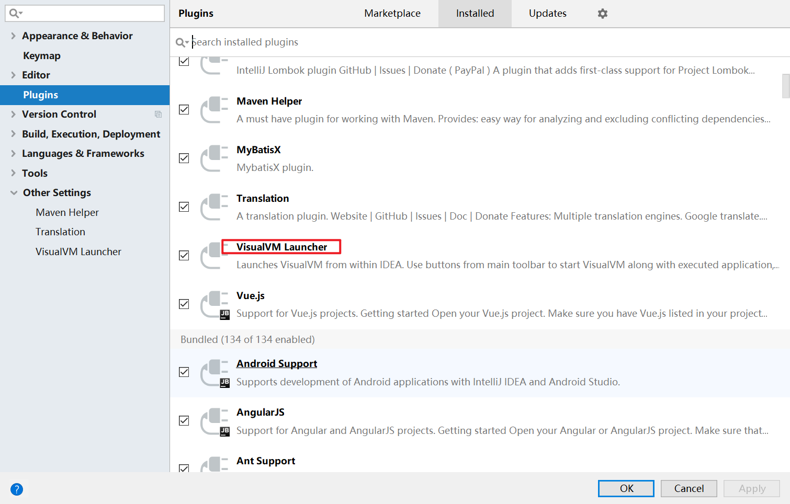

2、重启IDEA，然后配置该插件


3、使用两种方式来运行程序

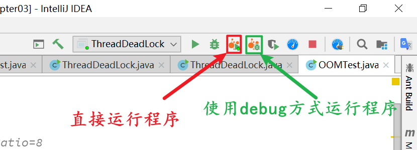

4、运行效果
还是打开jvisualvm界面，只是不需要我们手动打开jvisualvm而已

### 连接方式

#### 本地连接

监控本地Java进程的CPU、类、线程等

#### 远程连接

1-确定远程服务器的ip地址

2-添加JMX（通过JMX技术具体监控远程服务器哪个Java进程）

3-修改bin/catalina.sh文件，连接远程的tomcat

4-在…/conf中添加jmxremote.access和jmxremote.password文件

5-将服务器地址改成公网ip地址

6-设置阿里云安全策略和防火墙策略

7-启动tomcat，查看tomcat启动日志和端口监听

8-JMX中输入端口号、用户名、密码登录

### 主要功能

#### 1.生成/读取堆内存快照

一、生成堆内存快照

1、方式1：


2、方式2：


注意：
生成堆内存快照如下图：


这些快照存储在内存中，当线程停止的时候快照就会丢失，如果还想利用，可以将快照进行另存为操作，如下图：


二、装入堆内存快照


2.查看JVM参数和系统属性

3.查看运行中的虚拟机进程

#### 4.生成/读取线程快照

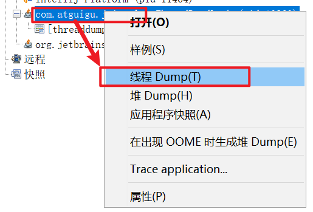

5.程序资源的实时监控

6.其他功能

JMX代理连接

远程环境监控

CPU分析和内存分析


## 3.4. Eclipse MAT

### 基本概述

MAT（Memory Analyzer Tool）工具是一款功能强大的**Java堆内存分析器**。可以**用于查找内存泄漏以及查看内存消耗情况。**MAT是基于Eclipse开发的，不仅可以单独使用，还可以作为插件的形式嵌入在Eclipse中使用。是一款免费的性能分析工具，使用起来非常方便。

官方地址： https://www.eclipse.org/mat/downloads.php

### 获取堆dump文件

#### dump文件内存

MAT可以分析heap dump文件。在进行内存分析时，只要获得了反映当前设备内存映像的hprof文件，通过MAT打开就可以直观地看到当前的内存信息。一般说来，这些内存信息包含：


- 所有的对象信息，包括对象实例、成员变量、存储于栈中的基本类型值和存储于堆中的其他对象的引用值。

- 所有的类信息，包括classloader、类名称、父类、静态变量等

- GCRoot到所有的这些对象的引用路径

- 线程信息，包括线程的调用栈及此线程的线程局部变量（TLS）

#### 两点说明

MAT 不是一个万能工具，它并不能处理所有类型的堆存储文件。但是比较主流的厂家和格式，例如Sun，HP，SAP 所采用的 HPROF 二进制堆存储文件，以及 IBM的 PHD 堆存储文件等都能被很好的解析。


**最吸引人的还是能够快速为开发人员生成内存泄漏报表，方便定位问题和分析问题。**虽然MAT有如此强大的功能，但是内存分析也没有简单到一键完成的程度，很多内存问题还是需要我们从MAT展现给我们的信息当中通过经验和直觉来判断才能发现。

#### 获取dump文件

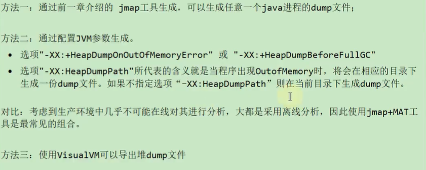


### 分析堆dump文件


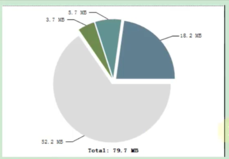


##### histogram

展示了各个类的实例数目以及这些实例的Shallow heap或者Retained heap的总和

##### thread overview

查看系统中的Java线程

查看局部变量的信息	

图标：


具体信息：


#### 获得对象互相引用的关系

with outgoing references

图示：


结果：

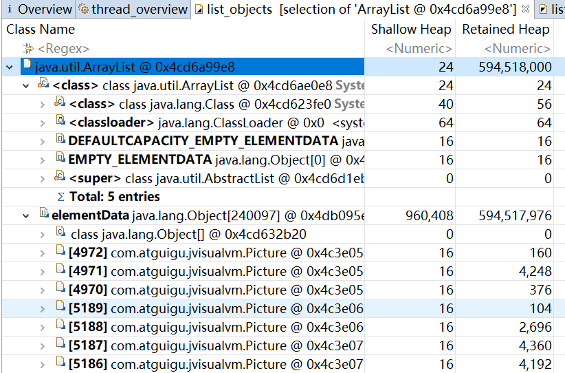

##### with incoming references

图示：


结果：

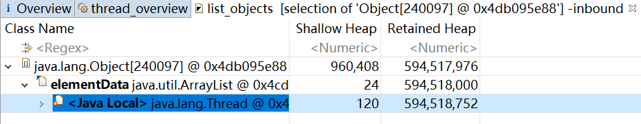

#### 浅堆与深堆

##### shallow heap

**浅堆(Shallow Heap)**是指**一个对象所消耗的内存**。在32位系统中，一个对象引用会占据4个字节，一个
int类型会占据4个字节，long型变量会占据8个字节，每个对象头需要占用8个字节。根据堆快照格式不同，对象的大小可能会同8字节进行对齐。

以String为例: 2个int值共占8字节，对象引用占用4字节，对象头8字节，合计20字节，向8字节对齐，故占24字节。(jdk7中)


这24字节为String对象的浅堆大小。它与String的value实际取值无关,无论字符串长度如何，浅堆大小始终是24字节。


对象头代表根据类创建的对象的对象头，还有对象的大小不是可能向8字节对齐，而是就向8字节对齐

##### retained heap

**保留集(Retained Set):**
		对象A的保留集指当对象A被垃圾回收后，可以被释放的所有的对象集合(包括对象A本身)，即对象A的保
留集可以被认为是**只能通过**对象A被直接或间接访问到的所有对象的集合。通俗地说，就是指仅被对象
A所持有的对象的集合。
		**深堆(Retained Heap):**
		深堆是指**对象的保留集中所有的对象的浅堆大小之和。**
注意:**浅堆指对象本身占用的内存，不包括其内部引用对象的大小**。一个对象的深堆指只能通过该对象访问到的(直接或间接)所有对象的浅堆之和，即对象被回收后，可以释放的真实空间。

注意：
当前深堆大小 = 当前对象的浅堆大小 + 对象中所包含对象的深堆大小

##### 补充：对象实际大小

另外一个常用的概念是对象的实际大小。这里，对象的实际大小定义为一个对象**所能触及的**所有对象的
浅堆大小之和，也就是通常意义上我们说的对象大小。与深堆相比，似乎这个在日常开发中更为直观和
被人接受，**但实际上，这个概念和垃圾回收无关。**
 		下图显示了一个简单的对象引用关系图，对象A引用了C和D，对象B引用了C和E。那么对象A的浅堆大
小只是A本身，不含C和D，而A的实际大小为A、C、D三者之和。而A的深堆大小为A与D之和，由于对
象C还可以通过对象B访问到，因此不在对象A的深堆范围内。


##### 练习


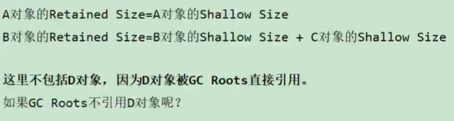

##### 案例分析：StudentTrace

代码：

```java
/**

 * 有一个学生浏览网页的记录程序，它将记录 每个学生访问过的网站地址。
 * 它由三个部分组成：Student、WebPage和StudentTrace三个类
   *
 * -XX:+HeapDumpBeforeFullGC -XX:HeapDumpPath=c:\code\student.hprof
 * @author shkstart
 * @create 16:11
* */
public class StudentTrace {
    static List<WebPage> webpages = new ArrayList<WebPage>();

    public static void createWebPages() {
        for (int i = 0; i < 100; i++) {
            WebPage wp = new WebPage();
            wp.setUrl("http://www." + Integer.toString(i) + ".com");
            wp.setContent(Integer.toString(i));
            webpages.add(wp);
        }
    }

    public static void main(String[] args) {
        createWebPages();//创建了100个网页
        //创建3个学生对象
        Student st3 = new Student(3, "Tom");
        Student st5 = new Student(5, "Jerry");
        Student st7 = new Student(7, "Lily");

        for (int i = 0; i < webpages.size(); i++) {
            if (i % st3.getId() == 0)
                st3.visit(webpages.get(i));
            if (i % st5.getId() == 0)
                st5.visit(webpages.get(i));
            if (i % st7.getId() == 0)
                st7.visit(webpages.get(i));
        }
        webpages.clear();
        System.gc();

    }
}

class Student {
    private int id;
    private String name;
    private List<WebPage> history = new ArrayList<>();

    public Student(int id, String name) {
        super();
        this.id = id;
        this.name = name;
    }

    public int getId() {
        return id;
    }

    public void setId(int id) {
        this.id = id;
    }

    public String getName() {
        return name;
    }

    public void setName(String name) {
        this.name = name;
    }

    public List<WebPage> getHistory() {
        return history;
    }

    public void setHistory(List<WebPage> history) {
        this.history = history;
    }

    public void visit(WebPage wp) {
        if (wp != null) {
            history.add(wp);
        }
    }

}


class WebPage {
    private String url;
    private String content;

    public String getUrl() {
        return url;
    }

    public void setUrl(String url) {
        this.url = url;
    }

    public String getContent() {
        return content;
    }

    public void setContent(String content) {
        this.content = content;
    }

}
```

图片：

结论：
elementData数组的浅堆是80个字节，而elementData数组中的所有WebPage对象的深堆之和是1208个字节，所以加在一起就是elementData数组的深堆之和，也就是1288个字节
解释：
我说“elementData数组的浅堆是80个字节”，其中15个对象一共是60个字节，对象头8个字节，数组对象本身4个字节，这些的和是72个字节，然后总和要是8的倍数，所以“elementData数组的浅堆是80个字节”
我说“WebPage对象的深堆之和是1208个字节”，一共有15个对象，其中0、21、42、63、84、35、70不仅仅是7的倍数，还是3或者5的倍数，所以这几个数值对应的i不能计算在深堆之内，这15个对象中大多数的深堆是152个字节，但是i是0和7的那两个深堆是144个字节，所以(13*152+144*2)-(6*152+144)=1208，所以这也印证了我上面的话，即“WebPage对象的深堆之和是1208个字节”
因此“elementData数组的浅堆80个字节”加上“WebPage对象的深堆之和1208个字节”，正好是1288个字节，说明“elementData数组的浅堆1288个字节”

#### 支配树


注意：
跟随我一起来理解如何从“对象引用图---》支配树”，首先需要理解支配者（如果要到达对象B，毕竟经过对象A，那么对象A就是对象B的支配者，可以想到支配者大于等于1），然后需要理解直接支配者（在支配者中距离对象B最近的对象A就是对象B的直接支配者，你要明白直接支配者不一定就是对象B的上一级，然后直接支配者只有一个），然后还需要理解支配树是怎么画的，其实支配树中的对象与对象之间的关系就是直接支配关系，也就是上一级是下一级的直接支配者，只要按照这样的方式来作图，肯定能从“对象引用图---》支配树”

**在Eclipse MAT工具中如何查看支配树：**


### 案例：Tomcat堆溢出分析

#### 说明

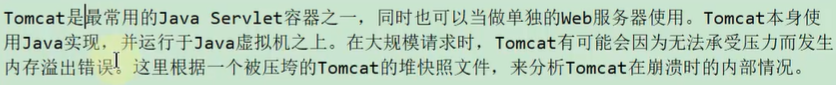

#### 分析过程

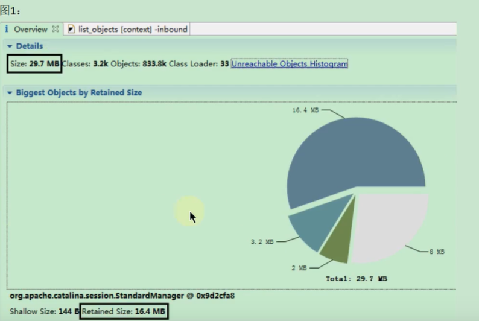


	


## 补充1：再谈内存泄露

### 内存泄露的理解与分析


### Java中内存泄露的8种情况

#### 1-静态集合类


#### 2-单例模式


#### 3-内部类持有外部类

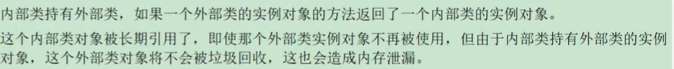

#### 4-各种连接，如数据库连接、网络连接和IO连接等

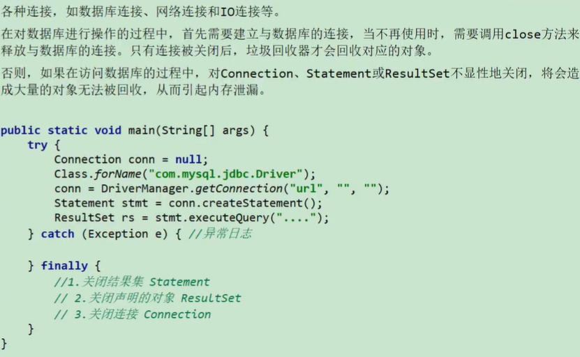

#### 5-变量不合理的作用域


#### 6-改变哈希值


例1：

```java
/**
 * 演示内存泄漏
 * @author shkstart
 */
public class ChangeHashCode {
    public static void main(String[] args) {
        HashSet set = new HashSet();
        Person p1 = new Person(1001, "AA");
        Person p2 = new Person(1002, "BB");

        set.add(p1);
        set.add(p2);

        p1.name = "CC";//导致了内存的泄漏
        set.remove(p1); //删除失败

        System.out.println(set);

        set.add(new Person(1001, "CC"));
        System.out.println(set);

        set.add(new Person(1001, "AA"));
        System.out.println(set);
    }
}

class Person {
    int id;
    String name;

    public Person(int id, String name) {
        this.id = id;
        this.name = name;
    }

    @Override
    public boolean equals(Object o) {
        if (this == o) return true;
        if (!(o instanceof Person)) return false;

        Person person = (Person) o;

        if (id != person.id) return false;
        return name != null ? name.equals(person.name) : person.name == null;
    }

    @Override
    public int hashCode() {
        int result = id;
        result = 31 * result + (name != null ? name.hashCode() : 0);
        return result;
    }

    @Override
    public String toString() {
        return "Person{" +
                "id=" + id +
                ", name='" + name + '\'' +
                '}';
    }
}
```

例2：

```java

    /**
     * 演示内存泄漏
     * @author shkstart
     * @create 14:47
     */
    public class ChangeHashCode1 {
        public static void main(String[] args) {
            HashSet<Point> hs = new HashSet<Point>();
            Point cc = new Point();
            cc.setX(10);//hashCode = 41
            hs.add(cc);

            cc.setX(20);//hashCode = 51  此行为导致了内存的泄漏

            System.out.println("hs.remove = " + hs.remove(cc));//false
            hs.add(cc);
            System.out.println("hs.size = " + hs.size());//size = 2

            System.out.println(hs);
        }

    }

    class Point {
        int x;

        public int getX() {
            return x;
        }

        public void setX(int x) {
            this.x = x;
        }

        @Override
        public int hashCode() {
            final int prime = 31;
            int result = 1;
            result = prime * result + x;
            return result;
        }

        @Override
        public boolean equals(Object obj) {
            if (this == obj) return true;
            if (obj == null) return false;
            if (getClass() != obj.getClass()) return false;
            Point other = (Point) obj;
            if (x != other.x) return false;
            return true;
        }

        @Override
        public String toString() {
            return "Point{" +
                    "x=" + x +
                    '}';
        }
    }
```


#### 7-缓存泄露


例子：

```java

/**
 * 演示内存泄漏
 *
 * @author shkstart
 * @create 14:53
 */
public class MapTest {
    static Map wMap = new WeakHashMap();
    static Map map = new HashMap();

    public static void main(String[] args) {
        init();
        testWeakHashMap();
        testHashMap();
    }

    public static void init() {
        String ref1 = new String("obejct1");
        String ref2 = new String("obejct2");
        String ref3 = new String("obejct3");
        String ref4 = new String("obejct4");
        wMap.put(ref1, "cacheObject1");
        wMap.put(ref2, "cacheObject2");
        map.put(ref3, "cacheObject3");
        map.put(ref4, "cacheObject4");
        System.out.println("String引用ref1，ref2，ref3，ref4 消失");

    }

    public static void testWeakHashMap() {

        System.out.println("WeakHashMap GC之前");
        for (Object o : wMap.entrySet()) {
            System.out.println(o);
        }
        try {
            System.gc();
            TimeUnit.SECONDS.sleep(5);
        } catch (InterruptedException e) {
            e.printStackTrace();
        }
        System.out.println("WeakHashMap GC之后");
        for (Object o : wMap.entrySet()) {
            System.out.println(o);
        }
    }

    public static void testHashMap() {
        System.out.println("HashMap GC之前");
        for (Object o : map.entrySet()) {
            System.out.println(o);
        }
        try {
            System.gc();
            TimeUnit.SECONDS.sleep(5);
        } catch (InterruptedException e) {
            e.printStackTrace();
        }
        System.out.println("HashMap GC之后");
        for (Object o : map.entrySet()) {
            System.out.println(o);
        }
    }

}

结果：
String引用ref1，ref2，ref3，ref4 消失
WeakHashMap GC之前
obejct2=cacheObject2
obejct1=cacheObject1
WeakHashMap GC之后
HashMap GC之前
obejct4=cacheObject4
obejct3=cacheObject3
Disconnected from the target VM, address: '127.0.0.1:51628', transport: 'socket'
HashMap GC之后
obejct4=cacheObject4
obejct3=cacheObject3
```

分析：


#### 8-监听器和回调

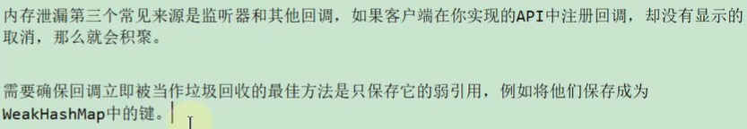

### 内存泄露案例分析

#### 案例1

##### 案例代码

```java
public class Stack {
    private Object[] elements;
    private int size = 0;
    private static final int DEFAULT_INITIAL_CAPACITY = 16;

    public Stack() {
        elements = new Object[DEFAULT_INITIAL_CAPACITY];
    }

    public void push(Object e) { //入栈
        ensureCapacity();
        elements[size++] = e;
    }

    public Object pop() {	//出栈
        if (size == 0)
            throw new EmptyStackException();
        Object result = elements[--size];
        elements[size] = null;
        return result;
    }

    private void ensureCapacity() {
        if (elements.length == size)
            elements = Arrays.copyOf(elements, 2 * size + 1);
    }
}
```

##### 分析


##### 解决办法

将代码中的pop()方法变成如下方法：

```java
public Object pop() { //出栈
    if (size == 0)
        throw new EmptyStackException();
    return elements[--size];
}
```

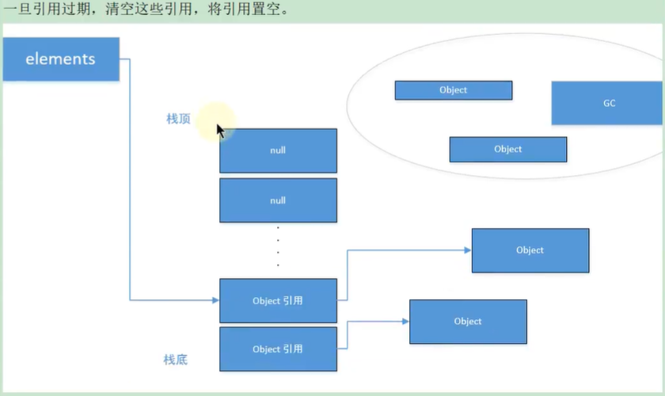

## 补充2：支持使用OQL语言查询对象信息

### SELECT子句


### FROM子句

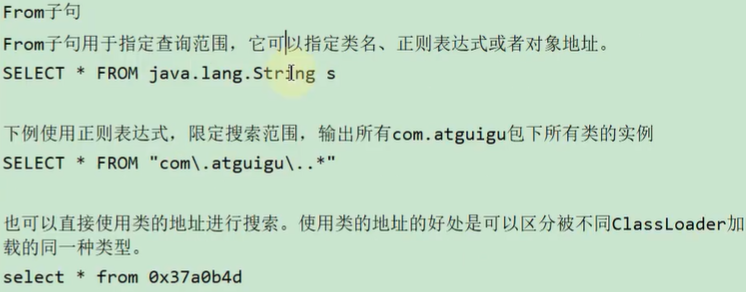

### WHERE子句


### 内置对象与方法


## 3.5. JProfiler

### 基本概述

在运行Java的时候有时候想测试运行时占用内存情况，这时候就需要使用测试工具查看了。在eclipse里面有 Eclipse Memory Analyzer tool（MAT）插件可以测试，而在IDEA中也有这么一个插件，就是JProfiler。JProfiler 是由 ej-technologies 公司开发的一款 Java 应用性能诊断工具。功能强大，但是收费。

官网地址：https://www.ej-technologies.com/products/jprofiler/overview.html

**特点：**

- 使用方便、界面操作友好（简单且强大）

- 对被分析的应用影响小（提供模板）

- CPU，Thread，Memory分析功能尤其强大

- 支持对jdbc，noSql，jsp，servlet，socket等进行分析

- 支持多种模式（离线，在线）的分析

- 支持监控本地、远程的JVM

- 跨平台，拥有多种操作系统的安装版本

**主要功能：**

- 1-方法调用：对方法调用的分析可以帮助您了解应用程序正在做什么，并找到提高其性能的方法

- 2-内存分配：通过分析堆上对象、引用链和垃圾收集能帮您修复内存泄露问题，优化内存使用

- 3-线程和锁：JProfiler提供多种针对线程和锁的分析视图助您发现多线程问题

- 4-高级子系统：许多性能问题都发生在更高的语义级别上。例如，对于JDBC调用，您可能希望找出执行最慢的SQL语句。JProfiler支持对这些子系统进行集成分析

**数据采集方式：**

JProfier数据采集方式分为两种：Sampling（样本采集）和Instrumentation（重构模式）

**Instrumentation**：这是JProfiler全功能模式。在class加载之前，JProfier把相关功能代码写入到需要分析的class的bytecode中，对正在运行的jvm有一定影响。

- 优点：功能强大。在此设置中，调用堆栈信息是准确的。

- 缺点：若要分析的class较多，则对应用的性能影响较大，CPU开销可能很高（取决于Filter的控制）。因此使用此模式一般配合Filter使用，只对特定的类或包进行分析

**Sampling**：类似于样本统计，每隔一定时间（5ms）将每个线程栈中方法栈中的信息统计出来。

- 优点：对CPU的开销非常低，对应用影响小（即使你不配置任何Filter）

- 缺点：一些数据／特性不能提供（例如：方法的调用次数、执行时间）

注：JProfiler本身没有指出数据的采集类型，这里的采集类型是针对方法调用的采集类型。因为JProfiler的绝大多数核心功能都依赖方法调用采集的数据，所以可以直接认为是JProfiler的数据采集类型。

**遥感监测 Telemetries**


**内存视图 Live Memory**


Live memory 内存剖析：class／class instance的相关信息。例如对象的个数，大小，对象创建的方法执行栈，对象创建的热点。


- **所有对象 All Objects**：显示所有加载的类的列表和在堆上分配的实例数。只有Java 1.5（JVMTI）才会显示此视图。

- **记录对象 Record Objects**：查看特定时间段对象的分配，并记录分配的调用堆栈。

- **分配访问树 Allocation Call Tree**：显示一棵请求树或者方法、类、包或对已选择类有带注释的分配信息的J2EE组件。

- **分配热点 Allocation Hot Spots**：显示一个列表，包括方法、类、包或分配已选类的J2EE组件。你可以标注当前值并且显示差异值。对于每个热点都可以显示它的跟踪记录树。

- **类追踪器 Class Tracker**：类跟踪视图可以包含任意数量的图表，显示选定的类和包的实例与时间。


**堆遍历 heap walker**


**cpu视图 cpu views**


JProfiler 提供不同的方法来记录访问树以优化性能和细节。线程或者线程组以及线程状况可以被所有的视图选择。所有的视图都可以聚集到方法、类、包或J2EE组件等不同层上。


- **访问树 Call Tree**：显示一个积累的自顶向下的树，树中包含所有在JVM中已记录的访问队列。JDBC，JMS和JNDI服务请求都被注释在请求树中。请求树可以根据Servlet和JSP对URL的不同需要进行拆分。

- **热点 Hot Spots**：显示消耗时间最多的方法的列表。对每个热点都能够显示回溯树。该热点可以按照方法请求，JDBC，JMS和JNDI服务请求以及按照URL请求来进行计算。

- **访问图 Call Graph**：显示一个从已选方法、类、包或J2EE组件开始的访问队列的图。

- **方法统计 Method Statistis**：显示一段时间内记录的方法的调用时间细节。


**线程视图 threads**


JProfiler通过对线程历史的监控判断其运行状态，并监控是否有线程阻塞产生，还能将一个线程所管理的方法以树状形式呈现。对线程剖析。


- **线程历史 Thread History**：显示一个与线程活动和线程状态在一起的活动时间表。

- **线程监控 Thread Monitor**：显示一个列表，包括所有的活动线程以及它们目前的活动状况。

- **线程转储 Thread Dumps**：显示所有线程的堆栈跟踪。


线程分析主要关心三个方面：


- 1．web容器的线程最大数。比如：Tomcat的线程容量应该略大于最大并发数。

- 2．线程阻塞

- 3．线程死锁


**监控和锁 Monitors ＆Locks**


所有线程持有锁的情况以及锁的信息。观察JVM的内部线程并查看状态：


- **死锁探测图表 Current Locking Graph**：显示JVM中的当前死锁图表。

- **目前使用的监测器 Current Monitors**：显示目前使用的监测器并且包括它们的关联线程。

- **锁定历史图表 Locking History Graph**：显示记录在JVM中的锁定历史。

- **历史检测记录 Monitor History**：显示重大的等待事件和阻塞事件的历史记录。

- **监控器使用统计 Monitor Usage Statistics**：显示分组监测，线程和监测类的统计监测数据


## 3.6. Arthas

上述工具都必须在服务端项目进程中配置相关的监控参数，然后工具通过远程连接到项目进程，获取相关的数据。这样就会带来一些不便，比如线上环境的网络是隔离的，本地的监控工具根本连不上线上环境。并且类似于Jprofiler这样的商业工具，是需要付费的。


那么有没有一款工具不需要远程连接，也不需要配置监控参数，同时也提供了丰富的性能监控数据呢？


阿里巴巴开源的性能分析神器Arthas应运而生。


Arthas是Alibaba开源的Java诊断工具，深受开发者喜爱。在线排查问题，无需重启；动态跟踪Java代码；实时监控JVM状态。Arthas 支持JDK 6＋，支持Linux／Mac／Windows，采用命令行交互模式，同时提供丰富的 Tab 自动补全功能，进一步方便进行问题的定位和诊断。当你遇到以下类似问题而束手无策时，Arthas可以帮助你解决：


- 这个类从哪个 jar 包加载的？为什么会报各种类相关的 Exception？

- 我改的代码为什么没有执行到？难道是我没 commit？分支搞错了？

- 遇到问题无法在线上 debug，难道只能通过加日志再重新发布吗？

- 线上遇到某个用户的数据处理有问题，但线上同样无法 debug，线下无法重现！

- 是否有一个全局视角来查看系统的运行状况？

- 有什么办法可以监控到JVM的实时运行状态？

- 怎么快速定位应用的热点，生成火焰图？


官方地址：https://arthas.aliyun.com/doc/quick-start.html


安装方式：如果速度较慢，可以尝试国内的码云Gitee下载。


```shell
wget https://io/arthas/arthas-boot.jar
wget https://arthas/gitee/io/arthas-boot.jar
```


Arthas只是一个java程序，所以可以直接用java -jar运行。


除了在命令行查看外，Arthas目前还支持 Web Console。在成功启动连接进程之后就已经自动启动,可以直接访问 http://127.0.0.1:8563/ 访问，页面上的操作模式和控制台完全一样。


**基础指令**


```shell
quit/exit 退出当前 Arthas客户端，其他 Arthas喜户端不受影响
stop/shutdown 关闭 Arthas服务端，所有 Arthas客户端全部退出
help 查看命令帮助信息
cat 打印文件内容，和linux里的cat命令类似
echo 打印参数，和linux里的echo命令类似
grep 匹配查找，和linux里的gep命令类似
tee 复制标隹输入到标准输出和指定的文件，和linux里的tee命令类似
pwd 返回当前的工作目录，和linux命令类似
cls 清空当前屏幕区域
session 查看当前会话的信息
reset 重置增强类，将被 Arthas增强过的类全部还原, Arthas服务端关闭时会重置所有增强过的类
version 输出当前目标Java进程所加载的 Arthas版本号
history 打印命令历史
keymap Arthas快捷键列表及自定义快捷键
```


**jvm相关**


```shell
dashboard 当前系统的实时数据面板
thread 查看当前JVM的线程堆栈信息
jvm 查看当前JVM的信息
sysprop 查看和修改JVM的系统属性
sysem 查看JVM的环境变量
vmoption 查看和修改JVM里诊断相关的option
perfcounter 查看当前JVM的 Perf Counter信息
logger 查看和修改logger
getstatic 查看类的静态属性
ognl 执行ognl表达式
mbean 查看 Mbean的信息
heapdump dump java heap，类似jmap命令的 heap dump功能
```


**class/classloader相关**


```shell
sc 查看JVM已加载的类信息
	-d 输出当前类的详细信息，包括这个类所加载的原始文件来源、类的声明、加载的Classloader等详细信息。如果一个类被多个Classloader所加载，则会出现多次
	-E 开启正则表达式匹配，默认为通配符匹配
	-f 输出当前类的成员变量信息（需要配合参数-d一起使用）
	-X 指定输出静态变量时属性的遍历深度，默认为0，即直接使用toString输出
sm 查看已加载类的方法信息
	-d 展示每个方法的详细信息
	-E 开启正则表达式匹配,默认为通配符匹配
jad 反编译指定已加载类的源码
mc 内存编译器，内存编译.java文件为.class文件
retransform 加载外部的.class文件, retransform到JVM里
redefine 加载外部的.class文件，redefine到JVM里
dump dump已加载类的byte code到特定目录
classloader 查看classloader的继承树，urts，类加载信息，使用classloader去getResource
	-t 查看classloader的继承树
	-l 按类加载实例查看统计信息
	-c 用classloader对应的hashcode来查看对应的 Jar urls
```


**monitor/watch/trace相关**


```plain
monitor 方法执行监控，调用次数、执行时间、失败率
	-c 统计周期，默认值为120秒
watch 方法执行观测，能观察到的范围为：返回值、抛出异常、入参，通过编写groovy表达式进行对应变量的查看
	-b 在方法调用之前观察(默认关闭)
	-e 在方法异常之后观察(默认关闭)
	-s 在方法返回之后观察(默认关闭)
	-f 在方法结束之后(正常返回和异常返回)观察(默认开启)
	-x 指定输岀结果的属性遍历深度,默认为0
trace 方法内部调用路径,并输出方法路径上的每个节点上耗时
	-n 执行次数限制
stack 输出当前方法被调用的调用路径
tt 方法执行数据的时空隧道,记录下指定方法每次调用的入参和返回信息,并能对这些不同的时间下调用进行观测
```


**其他**


```shell
jobs 列出所有job
kill 强制终止任务
fg 将暂停的任务拉到前台执行
bg 将暂停的任务放到后台执行
grep 搜索满足条件的结果
plaintext 将命令的结果去除ANSI颜色
wc 按行统计输出结果
options 查看或设置Arthas全局开关
profiler 使用async-profiler对应用采样，生成火焰图
```


## 3.7. Java Misssion Control

在Oracle收购Sun之前，Oracle的JRockit虚拟机提供了一款叫做 JRockit Mission Control 的虚拟机诊断工具。


在Oracle收购sun之后，Oracle公司同时拥有了Hotspot和 JRockit 两款虚拟机。根据Oracle对于Java的战略，在今后的发展中，会将JRokit的优秀特性移植到Hotspot上。其中一个重要的改进就是在Sun的JDK中加入了JRockit的支持。


在Oracle JDK 7u40之后，Mission Control这款工具己经绑定在Oracle JDK中发布。


自Java11开始，本节介绍的JFR己经开源。但在之前的Java版本，JFR属于Commercial Feature通过Java虚拟机参数-XX:+UnlockCommercialFeatures 开启。


Java Mission Control（简称JMC) ， Java官方提供的性能强劲的工具，是一个用于对 Java应用程序进行管理、监视、概要分析和故障排除的工具套件。它包含一个GUI客户端以及众多用来收集Java虚拟机性能数据的插件如 JMX Console（能够访问用来存放虚拟机齐个于系统运行数据的MXBeans）以及虚拟机内置的高效 profiling 工具 Java Flight Recorder（JFR）。


JMC的另一个优点就是：采用取样，而不是传统的代码植入技术，对应用性能的影响非常非常小，完全可以开着JMC来做压测（唯一影响可能是 full gc 多了）。


官方地址：https://github.com/JDKMissionControl/jmc


**Java Flight Recorder**


Java Flight Recorder是JMC的其中一个组件，能够以极低的性能开销收集Java虚拟机的性能数据。与其他工具相比，JFR的性能开销很小，在默认配置下平均低于1%。JFR能够直接访问虚拟机内的敌据并且不会影响虚拟机的优化。因此它非常适用于生产环境下满负荷运行的Java程序。


Java Flight Recorder 和 JDK Mission Control共同创建了一个完整的工具链。JDK Mission Control 可对 Java Flight Recorder 连续收集低水平和详细的运行时信息进行高效、详细的分析。


当启用时 JFR将记录运行过程中发生的一系列事件。其中包括Java层面的事件如线程事件、锁事件，以及Java虚拟机内部的事件，如新建对象，垃圾回收和即时编译事件。按照发生时机以及持续时间来划分，JFR的事件共有四种类型，它们分别为以下四种：


-  瞬时事件（Instant Event) ，用户关心的是它们发生与否，例如异常、线程启动事件。 

-  持续事件(Duration Event) ，用户关心的是它们的持续时间，例如垃圾回收事件。 

-  计时事件(Timed Event) ，是时长超出指定阈值的持续事件。 

-  取样事件（Sample Event)，是周期性取样的事件。 


取样事件的其中一个常见例子便是方法抽样（Method Sampling），即每隔一段时问统计各个线程的栈轨迹。如果在这些抽样取得的栈轨迹中存在一个反复出现的方法，那么我们可以推测该方法是热点方法


## 3.8. 其他工具


**Flame Graphs（火焰图）**


在追求极致性能的场景下，了解你的程序运行过程中cpu在干什么很重要，火焰图就是一种非常直观的展示CPU在程序整个生命周期过程中时间分配的工具。火焰图对于现代的程序员不应该陌生，这个工具可以非常直观的显示出调用找中的CPU消耗瓶颈。


网上的关于Java火焰图的讲解大部分来自于Brenden Gregg的博客 [http://new.brendangregg.com/flamegraphs.html ](http://new.brendangregg.com/flamegraphs.html)


火焰图，简单通过x轴横条宽度来度量时间指标，y轴代表线程栈的层次。


**Tprofiler**


案例： 使用JDK自身提供的工具进行JVM调优可以将下 TPS 由2.5提升到20（提升了7倍），并准确 定位系统瓶颈。


系统瓶颈有：应用里释态对象不是太多、有大量的业务线程在频繁创建一些生命周期很长的临时对象，代码里有问题。


那么，如何在海量业务代码里边准确定位这些性能代码？这里使用阿里开源工具 Tprofiler 来定位 这些性能代码，成功解决掉了GC 过于频繁的性能瓶预，并最终在上次优化的基础上将 TPS 再提升了4倍，即提升到100。


- Tprofiler配置部署、远程操作、 日志阅谈都不太复杂，操作还是很简单的。但是其却是能够 起到一针见血、立竿见影的效果，帮我们解决了GC过于频繁的性能瓶预。

- Tprofiler最重要的特性就是能够统汁出你指定时间段内 JVM 的 top method 这些 top method 极有可能就是造成你 JVM 性能瓶颈的元凶。这是其他大多数 JVM 调优工具所不具备的，包括 JRockit Mission Control。JRokit 首席开发者 Marcus Hirt 在其私人博客《 Lom Overhead Method Profiling cith Java Mission Control》下的评论中曾明确指出  JRMC 井不支持 TOP 方法的统计。


官方地址：http://github.com/alibaba/Tprofiler


**Btrace**


常见的动态追踪工具有BTrace、HouseHD（该项目己经停止开发）、Greys-Anatomy（国人开发 个人开发者）、Byteman（JBoss出品），注意Java运行时追踪工具井不限干这几种，但是这几个是相对比较常用的。


BTrace是SUN Kenai 云计算开发平台下的一个开源项目，旨在为java提供安全可靠的动态跟踪分析工具。先看一卜日Trace的官方定义：


大概意思是一个 Java 平台的安全的动态追踪工具，可以用来动态地追踪一个运行的 Java 程序。BTrace动态调整目标应用程序的类以注入跟踪代码（“字节码跟踪“）。


**YourKit**


**JProbe**


**Spring Insight**