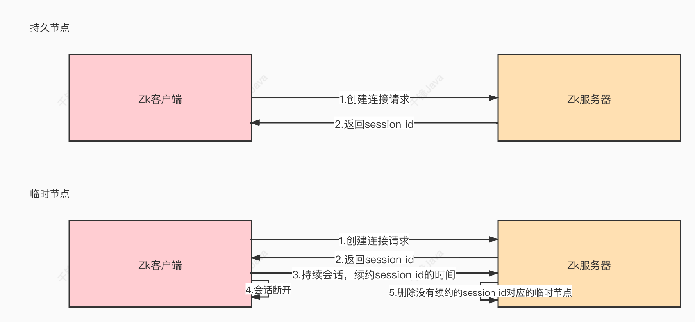
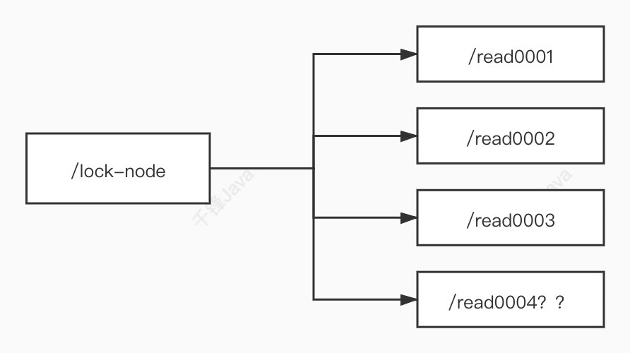
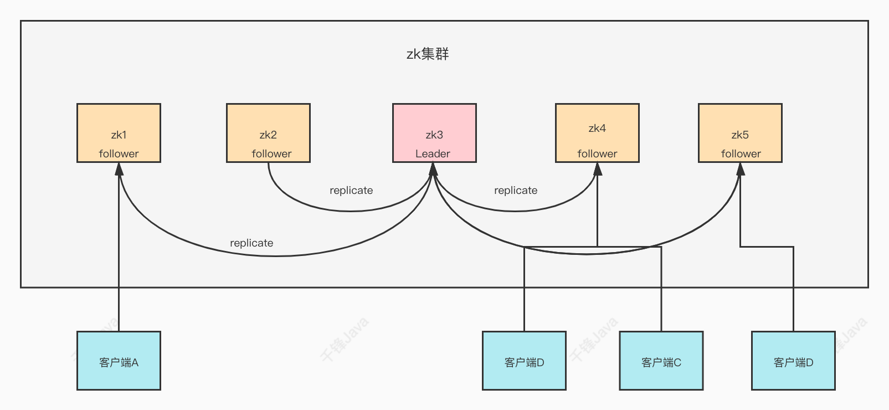
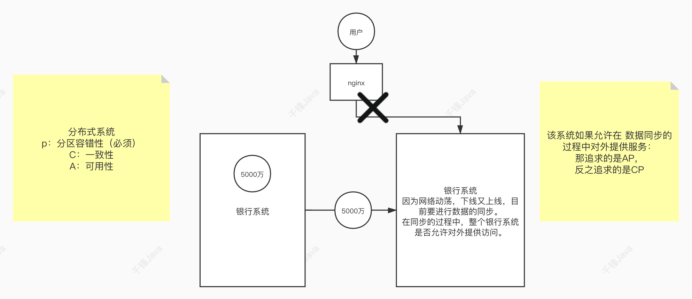

## 一、Zookeeper介绍

### 1、什么是Zookeeper

​	Zookeeper 是一种**分布式协调服务**，用于管理大型主机。在分布式环境中协调和管理服务是一个复杂的过程，ZooKeeper通过其简单的架构和API解决了这个问题。ZooKeeper 能让开发人员专注于核心应用程序逻辑，而不必担心应用程序的分布式特性。

### 2、Zookeeper的应用场景

- **分布式协调组件**


在分布式系统中，需要有zookeeper作为分布式协调组件，协调分布式系统中的状态

- 分布式锁

zk在实现分布式锁上，可以做到强一致性，关于分布式锁的相关知识，会在之后的ZAB协议中介绍

- 无状态化的实现


## 二、搭建ZooKeeper服务器

### 0 下载、安装zk

https://www.apache.org/dyn/closer.lua/zookeeper/zookeeper-3.7.1/apache-zookeeper-3.7.1-bin.tar.gz


```
root@lee-virtual-machine:/usr/local# mkdir zookeeper
root@lee-virtual-machine:/usr/local# cd zookeeper/
root@lee-virtual-machine:/usr/local/zookeeper# pwd
/usr/local/zookeeper
```

上传解压

```
tar -zxvf apache-zookeeper-3.7.1-bin.tar.gz
rm -rf apache-zookeeper-3.7.1-bin.tar.gz

```

修改配置文件zoo.cfg

```
mv zoo_sample.cfg zoo.cfg
```

zoo.cfg

```
dataDir=/usr/local/zookeeper/zkdata
```


### 1、zoo.conf配置文件说明

```properties
# zookeeper时间配置中的基本单位 (毫秒)
tickTime=2000
# 允许follower初始化连接到leader最⼤时⻓，它表示tickTime时间倍数
即:initLimit*tickTime
initLimit=10
# 允许follower与leader数据同步最⼤时⻓,它表示tickTime时间倍数
syncLimit=5
#zookeper 数据存储⽬录及⽇志保存⽬录（如果没有指明dataLogDir，则⽇志也保存在这个
⽂件中）
dataDir=/tmp/zookeeper
#对客户端提供的端⼝号
clientPort=2181
#单个客户端与zookeeper最⼤并发连接数
maxClientCnxns=60
# 保存的数据快照数量，之外的将会被清除
autopurge.snapRetainCount=3
#⾃动触发清除任务时间间隔，⼩时为单位。默认为0，表示不⾃动清除。
autopurge.purgeInterval=1
```

### 2、Zookeeper服务器的操作命令

重命名conf中的文件zoo_sample.cfg->zoo.cfg

```
mv zoo_sample.cfg zoo.cfg
```

启动、重启zk服务器：

~~~ shell
./bin/zkServer.sh start ./conf/zoo.cfg

# 不配置 默认找/conf/zoo.cfg
./bin/zkServer.sh start
~~~

查看zk服务器的状态：

~~~ shell
./bin/zkServer.sh status ./conf/zoo.cfg

# 不配置 默认找/conf/zoo.cfg
./bin/zkServer.sh status
~~~

停止服务器：

~~~ shell
./bin/zkServer.sh stop ./conf/zoo.cfg

# 不配置 默认找/conf/zoo.cfg
./bin/zkServer.sh stop
~~~


## 三、Zookeeper内部的数据模型

### 1、zk是如何保存数据的

zk中的数据是保存在节点上的，节点就是znode，多个znode之间构成一棵树的目录结构。

Zookeeper的数据模型是什么样子呢？**类似于数据结构中的树**，同时也很像文件系统的目录

树是由节点所组成，Zookeeper的数据存储也同样是基于节点，这种节点叫做**Znode**，但是不同于树的节点，Znode的引用方式是路劲引用，类似于文件路径：

~~~mark
/动物/猫
/汽车/宝马
~~~

这样的层级结构，让每一个Znode的节点拥有唯一的路径，就像命名空间一样对不同信息做出清晰的隔离。

### 2、zk中的znode是什么样的数据结构

zk中的znode包含了四个部分

 data：保存数据

 acl：权限：定义了什么样的⽤户能够操作这个节点，且能够进⾏怎样的操作。

​			c：create 创建权限，允许在该节点下创建子节点

​			w：write 更新权限，允许更新该节点的数据

​			r：read 读取权限，允许读取该节点的内容以及子节点的列表信息

​			d：delete 删除权限，允许删除该节点的子节点信息

​			a：admin 管理者权限，允许对该节点进行acl权限设置

  stat：描述当前znode的元数据

  child：当前节点的子节点

### 3、zk中节点znode的类型

1、持久节点：创建出的节点，在会话结束后依然存在。保存数据

2、持久序号节点：创建出的节点，**根据先后顺序，会在节点之后带上一个数值**，越后执行数值越大，适用于分布式锁的应用场景-单调递增

3、**临时节点**：临时节点是**在会话结束后，自动被删除的**，通过这个特性，zk可以**实现服务注册与发现的效果**。



临时序号节点：跟持久序号节点相同，适用于临时的分布式锁

Container节点（3.5.3版本新增）：Container容器节点，当**容器中没有任何子节点，该容器节点会被zk定期删除**

TTL节点：可以指定节点的到期时间，到期后被zk定时删除。只能通过系统配置zookeeper.extendedTypeEnablee=true开启

### 4、zk的数据持久化

zk的数据是运行在内存中，zk提供了两种持久化机制：

- 事务日志

​	zk把执行的命令以日志形式保存在dataLogDir指定的路径中的文件中（如果没有指定dataLogDir，则按照 dataDir指定的路径）。

- 数据快照

​	zk会在一定的时间间隔内做一次内存数据快照，把时刻的内存数据保存在快照文件中。

zk通过**两种形式的持久化**，在恢复时先恢复快照文件中的数据到内存中，再用日志文件中的数据做增量恢复，这样恢复的速度更快。

## 四、Zookeeper客户端（zkCli）的使用

### 1、多节点类型创建

- 创建持久节点

  ```
  create path [data] [acl]
  ```

- 创建持久序号节点

  ```
  create -s path [data] [acl]
  ```

- 创建临时节点，ephemeralOwner

  ```
  create -e path [data] [acl]
  ```

- 创建临时序号节点

  create -e -s path [data] [acl]

- 创建容器节点

  ```
  create -c path [data] [acl]
  ```
  
  

### 2、查询节点

- 普通查询

  - ls [-s -R] path

    -s 详细信息

    -R 当前目录和子目录中的所有信息

- 查询节点相关信息
  - cZxid：创建节点的事务ID
  - mZxid：修改节点的事务ID
  - pZxid：添加和删除子节点的事务ID
  - ctime：节点创建的时间
  - mtime：节点最近修改的时间
  - dataVersion：节点内数据的版本，每更新一次数据，版本会+1
  - aclVersion：此节点的权限版本
  - ephemeralOwner：如果当前节点是临时节点，该**值是当前节点所有者的session id**。如果节点不是临时节点，则该值为零
  - dataLength：节点内数据的长度
  - numChildren：该节点的子节点个数

- 查询节点的内容

  - get [-s] path

    -s 详细信息

### 3、删除节点

- 普通删除

- 乐观锁删除

  - delete [-v] path

    -v 版本（每次进行修改，版本号都会加一，初始创建为0）

  - deleteall path [-b batch size]

### 3、权限设置

- 注册当前会话的账号和密码：

  ~~~mark
  addauth digest xiaowang:123456
  ~~~

- 创建节点并设置权限（指定该节点的用户，以及用户所拥有的权限s）

  ~~~ mark
  create /test-node abcd auth:xiaowang:123456:cdwra
  ~~~

- 在另一个会话中必须先使用账号密码，才能拥有操作节点的权限

```
[zk: localhost:2181(CONNECTED) 0] addauth digest xiaoming:123456
[zk: localhost:2181(CONNECTED) 1] create /test
test1   test2
[zk: localhost:2181(CONNECTED) 1] create /test-node abc auth:xiaoming:123456z:cdrwa
Created /test-node
[zk: localhost:2181(CONNECTED) 2] get /test
test-node   test1       test2
[zk: localhost:2181(CONNECTED) 2] get /test-node
abc

```

```
[zk: localhost:2181(CONNECTED) 2] get /test-node
Insufficient permission : /test-node
[zk: localhost:2181(CONNECTED) 3] addauth digest xiaoming:123456
[zk: localhost:2181(CONNECTED) 4] get /test-node
abc

```


### 使用案例

```shell
Command not found: Command not found ./zkCli.sh
[zk: localhost:2181(CONNECTED) 1] ls
ls [-s] [-w] [-R] path
[zk: localhost:2181(CONNECTED) 2] ls /
[zookeeper]
[zk: localhost:2181(CONNECTED) 3] create /test1
Created /test1
[zk: localhost:2181(CONNECTED) 4] ls /
[test1, zookeeper]
[zk: localhost:2181(CONNECTED) 5] create /test1/sub1
Created /test1/sub1
[zk: localhost:2181(CONNECTED) 6] ls /
[test1, zookeeper]
[zk: localhost:2181(CONNECTED) 7] create /test2 abc
Created /test2
[zk: localhost:2181(CONNECTED) 8] get /test2
abc
[zk: localhost:2181(CONNECTED) 9] get test2
Path must start with / character
[zk: localhost:2181(CONNECTED) 10]

```


## 五、Curator客户端的使用

### 1、Curator介绍

Curator是Netflix公司开源的**一套zookeeper客户端框架**，Curator是对Zookeeper支持最好的客户端框架。Curator封装了大部分Zookeeper的功能，比如Leader选举、分布式锁等，减少了技术人员在使用Zookeeper时的底层细节开发工作。

### 2、引入Curator

#### 引⼊依赖

~~~ xml
<!--Curator-->
<dependency>
	<groupId>org.apache.curator</groupId>
    <artifactId>curator-framework</artifactId>
    <version>2.12.0</version>
</dependency>
<dependency>
	<groupId>org.apache.curator</groupId>
    <artifactId>curator-recipes</artifactId>
    <version>2.12.0</version>
</dependency>
<!--Zookeeper-->
<dependency>
	<groupId>org.apache.zookeeper</groupId>
    <artifactId>zookeeper</artifactId>
    <version>3.7.14</version>
</dependency>


~~~

#### application.properties配置⽂件

```properties
#配置curator基本连接信息
curator.retryCount=5
curator.elapsedTimeMs=5000
curator.connectionString=192.168.142.128:2181
curator.sessionTimeoutMs=60000
curator.connectionTimeoutMs=4000
```


### 3、编写配置curator配置类

- 注⼊配置Bean

```java
@Data
@Component
@ConfigurationProperties(prefix = "curator")
public class WrapperZK {
  private int retryCount;

  private int elapsedTimeMs;

  private String connectionString;

  private int sessionTimeoutMs;

  private int connectionTimeoutMs;
}
```

- 注⼊CuratorFramework


~~~ java
//引用配置类
@Configuration
public class CuratorConfig {

    @Autowired
    private WrapperZK wrapperZK;

    @Bean(initMethod = "start")
    public CuratorFramework curatorFramework(){
        return CuratorFrameworkFactory.newClient(
            wrapperZK.getConnectionString(),
            wrapperZK.getSessionTimeoutMs(),
            wrapperZK.getConnectionTimeoutMs(),
            new RetryNTimes(wrapperZK.getRetryCount(), wrapperZK.getElapsedTimeMs())
        );
    }

}
~~~

### 4、测试

~~~ java
@Autowired
private CuratorFramework curatorFramework;

@Test
//添加节点
void createNode() throws Exception{
    //添加默认(持久)节点
    String path = curatorFramework.create().forPath("/curator-node");
    //添加临时序号节点
    //String path2 = curatorFramework.create().withMode(CreateMode.EPHEMERAL_SEQUENTIAL).forPath("/curator-nodes", "messageDate".getBytes());
    System.out.println(String.format("curator create node :%s  successfully!", path));
    //		System.in.read();
}

@Test
//获取节点值
void getDate() throws Exception {
    byte[] bttes = curatorFramework.getData().forPath("/curator-node");
    System.out.println("bttes = " + bttes);
}

@Test
//设置节点值
void setDate() throws Exception {
    curatorFramework.setData().forPath("/curator-node", "newMessage".getBytes());
    byte[] bytes = curatorFramework.getData().forPath("/curator-node");
    System.out.println("bytes = " + bytes);
}

@Test
//创建多级节点
void createWithParent() throws Exception {
    String pathWithParent = "/node-parent/sub-node-1";
    String path = curatorFramework.create().creatingParentContainersIfNeeded().forPath(pathWithParent);
    System.out.println(String.format("curator create node :%s success!", path));
}

@Test
//删除节点
void delete() throws Exception {
    String path = "/node-parent";
    //删除节点的同时一并删除子节点
    curatorFramework.delete().guaranteed().deletingChildrenIfNeeded().forPath(path);
}
~~~

## 六、zk实现分布式锁

### 1、zk中锁的种类：

- 读锁（读锁共享）：大家都可以读。上锁前提：之前的锁没有写锁
- 写锁（写锁排他）：只有得到写锁的才能写。上锁前提：之前没有任何锁

### 2、zk如何上读锁	

- 创建**一个临时序号节点，节点的数据是read**，表示是读锁
- 获取当前zk中序号比自己小的所有节点
  - 最小节点如果是写锁，那就根本不存在后面的节点了；最小节点如果是读锁，后面也不会存在写锁，所以可以上读锁；
- 判断最小节点是否是读锁
  - 如果不是读锁的话，则上锁失败，为最小节点设置监听。阻塞等待，zk的watch机制会当最小节点发生变化时通知当前节点，再执行第二步的流程
  - 如果是读锁的话，则上锁成功。



### 3、zk如何上写锁

- 创建一个临时序号节点，**节点的数据是write，表示写锁**
- 获取zk中所有的子节点
- 判断自己是否是最小的节点：
  - 如果是，则上写锁成功
  - 如果不是，说明前面还有锁，则上锁失败，监听最小节点，如果最小节点有变化，则再执行第二步。


### 4、羊群效应

如果用上述的上锁方式，只要有节点发生变化，就会触发其他节点的监听事件，这样对zk的压力非常大，**而羊群效应，可以调整成链式监听。解决这个问题**。

- 羊群效应：之前的设计都是监听最小的节点，当最小节点释放后，所有的尝试加锁的线程都会尝试去


### 5、Curator实现读写锁

- 获取读锁

~~~ java
@Test
void testGetReadLock()throws Exception{
    //读写锁
    InterProcessReadWriteLock interProcessReadWriteLock = new InterProcessReadWriteLock(client, "/lock1");
    //获取读锁对象
    InterProcessLock interProcessLock = interProcessReadWriteLock.readLock();
    System.out.println("等待获取读锁对象中...");
    //获取锁
    interProcessLock.acquire();
    for(int i = 1; i <= 100; i ++){
        Thread.sleep(3000);
        System.out.println(i);
    }
    //释放锁
    interProcessLock.release();
    System.out.println("等待释放锁...");
}
~~~

- 获取写锁

~~~ java
@Test
void testGetWriteLock()throws Exception{
    //读写锁
    InterProcessReadWriteLock interProcessReadWriteLock = new InterProcessReadWriteLock(client, "/lock1");
    //获取写锁对象
    InterProcessLock interProcessLock = interProcessReadWriteLock.writeLock();
    System.out.println("等待获取写锁对象中...");
    //获取锁
    interProcessLock.acquire();
    for(int i = 1; i <= 100; i ++){
        Thread.sleep(3000);
        System.out.println(i);
    }
    //释放锁
    interProcessLock.release();
    System.out.println("等待释放锁...");
}
~~~


## 七、zk的watch机制

### 1、Watch机制介绍

我们可以把Watch理解成是注册在特定Znode上的触发器。当这个Znode发生改变，也就是调用了create，delete，setData方法的时候，将会触发Znode上注册的对应事件，请求Watch的客户端会收到异步通知。

具体交互过程如下：

- 客户端调用getData方法，watch参数是true。服务端接到请求，返回节点数据，并且在对应的哈希表里插入被Watch的Znode路径，以及Watcher列表。

  

- 当被Watch的Znode已删除，服务端会查找哈希表，找到该Znode对应的所有Watcher，异步通知客户端，并且删除哈希表中对应的key-value。

### 2、zkCli客户端使用Watch

~~~ shell
create /test date
get -w /test	一次性监听节点
ls -w /test		监听目录，创建和删除子节点会收到通知。但是子节点中新增节点不会被监听到
ls -R -w /test	监听子节点中节点的变化，但内容的变化不会收到通知
~~~

### 3、Curator客户端使用Watch

~~~ java
@Test
public void addNodeListener() throws Exception{
    NodeCache nodeCache = new NodeCache(curatorFramework,"/curator-node");
    nodeCache.getListenable().addListener(new NodeCacheListener() {
        @Override
        public void nodeChanged() throws Exception{
            log.info("{} path nodeChanged: ", "/curator-node");
            printNodeData();
        }
    )};
    nodeCache.start();
    //System.in.read();
}

public void printNodeData() throws Exception{
    byte[] bytes = curatorFramework.getData().forPath("/curator-node");
    log.info("data: {}", new String(bytes));
}
~~~

## 八、Zookeeper集群实战

### 1、Zookeeper集群角色

zookeeper集群中的节点有三种角色

- Leader：处理集群的所有事务请求，集群中只有一个Leader
- Follwoer：只能处理读请求，参与Leader选举
- Observer：只能处理读请求，提升集群读的性能，但不能参与Leader选举


### 2、集群搭建

搭建4个节点，其中一个节点为Observer

- 创建4个节点的myid并设值

  在/usr/local/zookeeper/zkdata/中创建一下四个文件

  ```
  mkdir zk1
  mkdir zk2
  mkdir zk3
  mkdir zk4
  
  echo 1 > ./zk1/myid
  echo 2 > ./zk2/myid
  echo 3 > ./zk3/myid
  echo 4 > ./zk4/myid
  ```

  

  ~~~ shell
  /usr/local/zookeeper/zkdata/zk1# echo 1 > myid
  /usr/local/zookeeper/zkdata/zk2# echo 2 > myid
  /usr/local/zookeeper/zkdata/zk3# echo 3 > myid
  /usr/local/zookeeper/zkdata/zk4# echo 4 > myid
  ~~~

- 编写4个zoo.cfg

  ~~~ shell
  # The number of milliseconds of each tick
  tickTime=2000
  # The number of ticks that the initial 
  # synchronization phase can take
  initLimit=10
  # The number of ticks that can pass between 
  # sending a request and getting an acknowledgement
  syncLimit=5
  # the directory where the snapshot is stored.
  # do not use /tmp for storage, /tmp here is just 
  # example sakes. 修改对应的zk1 zk2 zk3 zk4
  dataDir=/usr/local/zookeeper/zkdata/zk1
  # the port at which the clients will connect
  # 修改对应的端⼝ 2181 2182 2183 2184
  clientPort=2181
  
  # 2001为集群通信端⼝，3001为集群选举端⼝，observer表示不参与集群选举
  server.1=192.168.142.128:2001:3001
  server.2=192.168.142.128:2002:3002
  server.3=192.168.142.128:2003:3003
  server.4=192.168.142.128:2004:3004:observer
  
~~~
  

  
  ```shell
  cp zoo1.cfg  zoo2.cfg
  cp zoo1.cfg  zoo3.cfg
  cp zoo1.cfg  zoo4.cfg
  ```
  
  zoo2.cfg
  
  ```shell
  dataDir=/usr/local/zookeeper/zkdata/zk2
  # the port at which the clients will connect
  clientPort=2182
  ```
  
  ### 启动4台Zookeeper
  
  ```
  ./zkServer.sh start ../conf/zoo1.cfg
  ./zkServer.sh start ../conf/zoo2.cfg
  ./zkServer.sh start ../conf/zoo3.cfg
  ./zkServer.sh start ../conf/zoo4.cfg
  ```
  
  > 启动错误：**注意仔细检查每项配置是否配置错误**
  
  ### 3、连接Zookeeper集群
  
  ~~~ shell
  ./bin/zkCli.sh -server 192.168.142.128:2181,192.168.142.128:2182,192.168.142.128:2183
  ~~~

## 九、ZAB协议

### 1、什么是ZAB协议

zookeeper作为非常重要的分布式协调组件，需要进行集群部署，集群中会以一主多从的形式进行部署。zookeeper为了保证数据的一致性，使用了ZAB（Zookeeper Atomic Broadcast）协议，这个协议解决了Zookeeper的崩溃恢复和主从数据同步的问题。




### 2、ZAB协议定义的四种节点状态

- Looking：选举状态
- Following：Following节点（从节点）所处的状态
- Leading：Leader节点（主节点）所处状态

### 3、集群上线Leader选举过程


### 4、崩溃恢复时的Leader选举

Leader建立完后，Leader周期性地不断向Follower发送心跳（ping命令，没有内容的socket）。当Leader崩溃后，Follower发现socket通道已关闭，于是Follower开始进入到Looking状态，重新回到上一节中的Leader选举状态，此时集群不能对外提供服务。


这里讲错了，应该是主机向每个从机发送通信心跳，接收不到，从机转为lock状态，

### 5、主从服务器之间的数据同步


### 6、Zookeeper中的NIO与BIO的应用

- NIO
  - 用于被客户端连接的2181端口，使用的是NIO模式与客户端建立连接
  - 客户端开启Watch时，也使用NIO，等待Zookeeper服务器的回调
- BIO
  - 集群在选举时，多个节点之间的投票通信端口，使用BIO进行通信

## 十、CAP理论

2000年7月，加州大学伯克利分校的 Eric Brewer教授在ACM PODC会议上提出CAP猜想。2年后，麻省理工学院的Seth Gilbert和 Nancy Lynch 从理论上证明了CAP。之后，CAP理论正式成为分布式计算领域的公认定理。


### CAP理论

CAP理论为：一个分布式系统最多只能同时满足一致性（Consistency）、可用性（Availability）和区分容错性（Partition tolerance）这三项中的两项。

- —致性(Consistency)

一致性指"all nodespsee the same data at the same time"，即更新操作成功并返回客户端完成后，所有节点在同一时间的数据完全一致。

- 可用性(Availability)

可用性指"Reads and writes always succeed"，即服务一直可用，而且是正常响应时间。

- 分区容错性(Partition tolerance)

分区容错性指"the system continues to operate despite arbitrary message loss or failure of part of the system"，即分布式系统在遇到某节点或网络分区故障的时候，仍然能够对外提供满足一致性或可用性的服务。——避免单点故障，就要进行冗余部署，冗余部署相当于是服务的分区，这样的分区就具备了容错性。



### BASE理论

eBay的架构师Dan Pritchett源于对大规模分布式系统的实践总结，在ACM上发表文章提出BASE理论，BASE理论是对CAP理论的延伸，核心思想是即使无法做到强一致性《Strong Consistency，CAP的一致性就是强一致性)，但应用可以采用适合的方式达到最终一致性(Eventual Consitency) 。

- 基本可用(Basically Available)

基本可用是指分布式系统在出现故障的时候，允许损失部分可用性，即保证核心可用。

电商大促时，为了应对访问量激增，部分用户可能会被引导到降级页面，服务层也可能只提供降级服务。这就是损失部分可用性的体现。

- 软状态(Soft State)

软状态是指允许系统存在中间状态，而该中间状态不会影响系统整体可用性。分布式存储中一般一份数据至少会有三个副本，允许不同节点间副本同步的延时就是软状态的体现。mysql replication的异步复制也是一种体现。

- 最终一致性(Eventual Consistency)

最终一致性是指系统中的所有数据副本经过一定时间后，最终能够达到一致的状态。弱一致性和强一致性相反，最终一致性是弱一致性的—种特殊情况。

### Zookeeper追求的一致性

Zookeeper在数据同步时，追求的并不是强一致性，而是顺序一致性（事务id的单调递增）

## Reference

- 视频地址（讲的一般）：https://www.bilibili.com/video/BV1Ph411n7Ep
- 本地代码地址：D:\Codes\java\boot-zk-client
- 