# 1. AQS 原理

## 1. 概述 

全称是 AbstractQueuedSynchronizer，抽象队列同步器，是阻塞式锁和相关的同步器工具的框架 ，许多同步类实现都依赖于该同步器


### 特点： 

#### state属性 独占/共享模式

- 用 **state 属性来表示资源的状态（分独占模式和共享模式）**，子类需要定义如何维护这个状态，控制如何获取锁和释放锁 

- - getState - 获取 state 状态 
  - setState - 设置 state 状态 
  - compareAndSetState - cas 机制设置 state 状态 
  - **独占模式是只有一个线程能够访问资源，而共享模式可以允许多个线程访问资源** 


## 3. 心得 

### 起源 

早期程序员会自己通过一种同步器去实现另一种相近的同步器，例如用可重入锁去实现信号量，或反之。这显然不够优雅，于是在 JSR166（java 规范提案）中创建了 AQS，提供了这种通用的同步器机制。 


### 目标 

AQS 要实现的功能目标 

- 阻塞版本获取锁 acquire 和非阻塞的版本尝试获取锁 tryAcquire 
- 获取锁超时机制
- 通过打断取消机制 
- 独占机制及共享机制 
- 条件不满足时的等待机制 


要实现的性能目标 

Instead, the primary performance goal here is scalability: to predictably maintain effiffifficiency even, or especially, when synchronizers are contended. 


### 设计 

AQS 的基本思想其实很简单 

获取锁的逻辑

```java
while(state 状态不允许获取) {
    if(队列中还没有此线程) {
        入队并阻塞
    }
}
当前线程出队
```

释放锁的逻辑

```java
if(state 状态允许了) {
    恢复阻塞的线程(s) 
}
```

要点 

- 原子维护 state 状态 
- 阻塞及恢复线程 
- 维护队列 


#### 2) 阻塞恢复设计 

- 早期的控制线程暂停和恢复的 api 有 suspend 和 resume，但它们是不可用的，因为如果先调用的 resume 那么 suspend 将感知不到 
- 解决方法是使用 park & unpark 来实现线程的暂停和恢复，具体原理在之前讲过了，先 unpark 再 park 也没 问题 
- park & unpark 是针对线程的，而不是针对同步器的，因此控制粒度更为精细 
- park 线程还可以通过 interrupt 打断 

#### 3) 队列设计 

- 使用了 FIFO 先入先出队列，并不支持优先级队列 
- 设计时借鉴了 CLH 队列，它是一种单向无锁队列

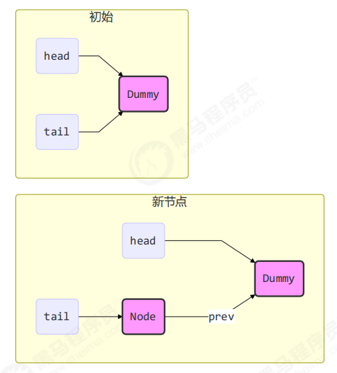

队列中有 head 和 tail 两个指针节点，都用 volatile 修饰配合 cas 使用，每个节点有 state 维护节点状态

入队伪代码，只需要考虑 tail 赋值的原子性

```java
do {
    // 原来的 tail
    Node prev = tail;
    // 用 cas 在原来 tail 的基础上改为 node
} while(tail.compareAndSet(prev, node))
```

出队伪代码

```java
// prev 是上一个节点
while((Node prev=node.prev).state != 唤醒状态) {
}
// 设置头节点
head = node;
```

CLH 好处： 

- 无锁，使用自旋
- 快速，无阻塞 


AQS 在一些方面改进了 CLH

```java
private Node enq(final Node node) {
    for (;;) {
        Node t = tail;
        // 队列中还没有元素 tail 为 null
        if (t == null) {
            // 将 head 从 null -> dummy
            if (compareAndSetHead(new Node()))
                tail = head;
        } else {
            // 将 node 的 prev 设置为原来的 tail
            node.prev = t;
            // 将 tail 从原来的 tail 设置为 node
            if (compareAndSetTail(t, node)) {
                // 原来 tail 的 next 设置为 node
                t.next = node;
                return t;
            }
        }
    }
}
```


## 主要用到 AQS 的并发工具类

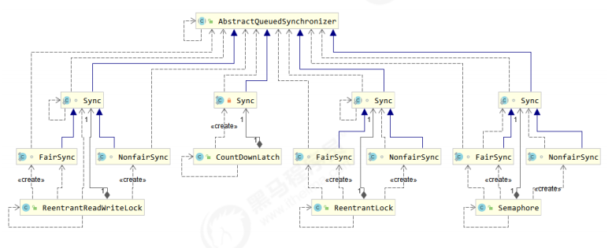

# 2. ReentrantLock使用和原理


## 与synchronized 锁对比

ReentrantLock 相对于 synchronized 具备如下特点：

1. **锁的实现**：synchronized 是 JVM 实现的，而 ReentrantLock 是 JDK 实现的
2. 性能：新版本 Java 对 synchronized 进行了很多优化，synchronized 与 ReentrantLock 大致相同
3. 使用：ReentrantLock 需要手动解锁，synchronized 执行完代码块自动解锁
4. **可中断**：ReentrantLock 可中断，而 synchronized 不行
5. **公平锁**：公平锁是指多个线程在等待同一个锁时，必须按照申请锁的时间顺序来依次获得锁
   * ReentrantLock 可以设置公平锁，synchronized 中的锁是非公平的
   * 不公平锁的含义是阻塞队列内公平，队列外非公平
6. 锁超时：尝试获取锁，超时获取不到直接放弃，不进入阻塞队列
   * ReentrantLock 可以设置超时时间，synchronized 会一直等待
7. 锁绑定多个条件：一个 ReentrantLock 可以同时绑定多个 Condition 对象，更细粒度的唤醒线程
8. 两者都是可重入锁


## 使用锁

构造方法：`ReentrantLock lock = new ReentrantLock();`

ReentrantLock 类 API：

* `public void lock()`：获得锁
  * 如果锁没有被另一个线程占用，则将锁定计数设置为 1

  * 如果当前线程已经保持锁定，则保持计数增加 1 

  * 如果锁被另一个线程保持，则当前线程被禁用线程调度，并且在锁定已被获取之前处于休眠状态

* `public void unlock()`：尝试释放锁
  * 如果当前线程是该锁的持有者，则保持计数递减
  * 如果保持计数现在为零，则锁定被释放
  * 如果当前线程不是该锁的持有者，则抛出异常

基本语法：

```java
// 获取锁
reentrantLock.lock();
try {
    // 临界区
} finally {
	// 释放锁
	reentrantLock.unlock();
}
```


## 公平锁和非公平锁

### 基本使用

构造方法：`ReentrantLock lock = new ReentrantLock(true)`

```java
public ReentrantLock(boolean fair) {
    sync = fair ? new FairSync() : new NonfairSync();
}
```


***


## 非公平锁原理

>  注： 可以通过debug加深印象加锁解锁流程

构造器：

**ReentrantLock 默认是不公平的**：

```java
public ReentrantLock() {
    sync = new NonfairSync();
}
```

说明：**公平锁一般没有必要，会降低并发度**


### 加锁

#### ReentrantLock非公平加锁流程简洁版
简洁：
ReentrantLock对象调用lock方法

- **CAS获取锁**：用 **cas 尝试（仅尝试一次）将 state 从 0 改为 1, 如果成功则将exclusiveOwnerThread 设置为当前线程** , 如果成功表示【获得了独占锁】

- **是否锁重入**：CAS修改失败后，则回去**判断当前线程是否是AQS中的独占线程变量**，如果是，则进行了锁重入，直接将state加1
- addWaiter方法，**封装当前线程为一个Node节点**：通过**CAS插入到Node队列的尾部**，失败就**不断自旋重试**，直到插入成功
- acquireQueued方法， **逻辑阻塞线程**：acquireQueued 会在**一个自旋中不断尝试获得锁，失败后进入 park 阻塞**
  * 如果**当前线程是在 head 节点后，会再次 tryAcquire 尝试获取锁**，state 仍为 1 则失败（第三次）
  * 进入 shouldParkAfterFailedAcquire 逻辑，**将前驱 node 的 waitStatus 改为 -1，返回 false；waitStatus 为 -1 的节点用来唤醒下一个节点**
  * shouldParkAfterFailedAcquire 执行完毕回到 acquireQueued ，**再次 tryAcquire 尝试获取锁**，这时 state 仍为 1 获取失败（第四次）
  * 当再次进入 shouldParkAfterFailedAcquire 时，**这时其前驱 node 的 waitStatus 已经是 -1 了，返回 true**
  * **进入 parkAndCheckInterrupt， 线程Thread-1 park**（灰色表示）


reentrantLock对象调用lock方法

- **没有竞争，当前线程CAS获取锁成功**：用 cas 尝试（仅尝试一次）将 state 从 0 改为 1, 如果成功则将exclusiveOwnerThread 设置为当前线程, 如果成功表示【获得了独占锁】

- **竞争失败**：CAS修改失败，则进入 **acquire(1)逻辑**

- **acquire(1)逻辑**:在**tryAcquire 尝试获取锁失败**时, 会**调用 addWaiter 将当前线程封装成node入队**，**acquireQueued 阻塞当前线程**，acquireQueued 返回 true 表示挂起过程中线程被中断唤醒过，false 表示未被中断过

- **tryAcquire 尝试获取锁**:进入 tryAcquire 尝试获取锁逻辑，这时 state 已经是1，结果仍然失败（第二次），**加锁成功有两种情况**：

  * 当前 AQS 处于无锁状态
  * 加锁线程就是当前线程，说明发生了锁重入

- 接下来**进入 addWaiter 逻辑**，构造 Node 队列（不是阻塞队列），前置条件是当前线程获取锁失败，说明有线程占用了锁；**通过CAS插入到Node队列的尾部，失败就不断自旋重试，直到插入成功**

  * 图中黄色三角表示该 Node 的 waitStatus 状态，其中 0 为默认**正常状态**
  * Node 的创建是懒惰的，其中第一个 Node 称为 **Dummy（哑元）或哨兵**，用来占位，并不关联线程

  

- 线程节点加入队列成功，进入 AbstractQueuedSynchronizer#**acquireQueued 逻辑阻塞线程**

  * acquireQueued 会在**一个自旋中不断尝试获得锁，失败后进入 park 阻塞**
  * 如果**当前线程是在 head 节点后，会再次 tryAcquire 尝试获取锁**，state 仍为 1 则失败（第三次）
  * 进入 shouldParkAfterFailedAcquire 逻辑，**将前驱 node 的 waitStatus 改为 -1，返回 false；waitStatus 为 -1 的节点用来唤醒下一个节点**
  * shouldParkAfterFailedAcquire 执行完毕回到 acquireQueued ，**再次 tryAcquire 尝试获取锁**，这时 state 仍为 1 获取失败（第四次）
  * 当再次进入 shouldParkAfterFailedAcquire 时，**这时其前驱 node 的 waitStatus 已经是 -1 了，返回 true**
  * **进入 parkAndCheckInterrupt， 线程Thread-1 park**（灰色表示）


---

#### 详解版


NonfairSync 继承自 AQS

```java
public void lock() {
    sync.lock();
}
```

#### 没有竞争

* 没有竞争：通过cas将state从0改为1成功，exclusiveOwnerThread 属于 Thread-0，

  ```java
  // ReentrantLock.NonfairSync#lock
  final void lock() {
      // 用 cas 尝试（仅尝试一次）将 state 从 0 改为 1, 如果成功表示【获得了独占锁】
      if (compareAndSetState(0, 1))
          // 设置当前线程为独占线程
          setExclusiveOwnerThread(Thread.currentThread());
      else
          acquire(1);//失败进入
  }
  ```

#### acquire 逻辑

* 第一个竞争出现：Thread-1 执行，CAS 尝试将 state 由 0 改为 1，结果失败（第一次），进入 acquire 逻辑

  ```java
  // AbstractQueuedSynchronizer#acquire
  public final void acquire(int arg) {
      // tryAcquire 尝试获取锁失败时, 会调用 addWaiter 将当前线程封装成node入队，acquireQueued 阻塞当前线程，
      // acquireQueued 返回 true 表示挂起过程中线程被中断唤醒过，false 表示未被中断过
      if (!tryAcquire(arg) && acquireQueued(addWaiter(Node.EXCLUSIVE), arg))
          // 如果线程被中断了逻辑来到这，完成一次真正的打断效果
          selfInterrupt();
  }
  ```


* 进入 tryAcquire 尝试获取锁逻辑，这时 state 已经是1，结果仍然失败（第二次），加锁成功有两种情况：

  * 当前 AQS 处于无锁状态
  * 加锁线程就是当前线程，说明发生了锁重入

  ```java
  // ReentrantLock.NonfairSync#tryAcquire
  protected final boolean tryAcquire(int acquires) {
      return nonfairTryAcquire(acquires);
  }
  // 抢占成功返回 true，抢占失败返回 false
  final boolean nonfairTryAcquire(int acquires) {
      final Thread current = Thread.currentThread();
      // state 值
      int c = getState();
      // 条件成立说明当前处于【无锁状态】
      if (c == 0) {
          //如果还没有获得锁，尝试用cas获得，这里体现非公平性: 不去检查 AQS 队列是否有阻塞线程直接获取锁        
      	if (compareAndSetState(0, acquires)) {
              // 获取锁成功设置当前线程为独占锁线程。
              setExclusiveOwnerThread(current);
              return true;
           }    
  	}    
     	// 如果已经有线程获得了锁, 独占锁线程还是当前线程, 表示【发生了锁重入】
  	else if (current == getExclusiveOwnerThread()) {
          // 更新锁重入的值
          int nextc = c + acquires;
          // 越界判断，当重入的深度很深时，会导致 nextc < 0，int值达到最大之后再 + 1 变负数
          if (nextc < 0) // overflow
              throw new Error("Maximum lock count exceeded");
          // 更新 state 的值，这里不使用 cas 是因为当前线程正在持有锁，所以这里的操作相当于在一个管程内
          setState(nextc);
          return true;
      }
      // 获取失败
      return false;
  }
  ```

##### addWaiter 逻辑，构造 Node 队列

* 接下来进入 addWaiter 逻辑，构造 Node 队列（不是阻塞队列），前置条件是当前线程获取锁失败，说明有线程占用了锁

  * 图中黄色三角表示该 Node 的 waitStatus 状态，其中 0 为默认**正常状态**
  * Node 的创建是懒惰的，其中第一个 Node 称为 **Dummy（哑元）或哨兵**，用来占位，并不关联线程

  ```java
  // AbstractQueuedSynchronizer#addWaiter，返回当前线程的 node 节点
  private Node addWaiter(Node mode) {
      // 将当前线程关联到一个 Node 对象上, 模式为独占模式   
      Node node = new Node(Thread.currentThread(), mode);
      Node pred = tail;
      // 快速入队，如果 tail 不为 null，说明存在队列
      if (pred != null) {
          // 将当前节点的前驱节点指向 尾节点
          node.prev = pred;
          // 通过 cas 将 Node 对象加入 AQS 队列，成为尾节点，【尾插法】
          if (compareAndSetTail(pred, node)) {
              pred.next = node;// 双向链表
              return node;
          }
      }
      // 初始时队列为空，或者 CAS 失败进入这里
      enq(node);
      return node;
  }
  ```

  ```java
  // AbstractQueuedSynchronizer#enq
  private Node enq(final Node node) {
      // 自旋入队，必须入队成功才结束循环
      for (;;) {
          Node t = tail;
          // 说明当前锁被占用，且当前线程可能是【第一个获取锁失败】的线程，【还没有建立队列】
          if (t == null) {
              // 设置一个【哑元节点】，头尾指针都指向该节点
              if (compareAndSetHead(new Node()))
                  tail = head;
          } else {
              // 自旋到这，普通入队方式，首先赋值尾节点的前驱节点【尾插法】
              node.prev = t;
              // 【在设置完尾节点后，才更新的原始尾节点的后继节点，所以此时从前往后遍历会丢失尾节点】
              if (compareAndSetTail(t, node)) {
                  //【此时 t.next  = null，并且这里已经 CAS 结束，线程并不是安全的】
                  t.next = node;
                  return t;	// 返回当前 node 的前驱节点
              }
          }
      }
  }
  ```

  


##### acquireQueued 逻辑阻塞线程

* 线程节点加入队列成功，进入 AbstractQueuedSynchronizer#acquireQueued 逻辑阻塞线程

  * acquireQueued 会在一个自旋中不断尝试获得锁，失败后进入 park 阻塞

  * 如果当前线程是在 head 节点后，会再次 tryAcquire 尝试获取锁，state 仍为 1 则失败（第三次）

  ```java
  final boolean acquireQueued(final Node node, int arg) {
      // true 表示当前线程抢占锁失败，false 表示成功
      boolean failed = true;
      try {
          // 中断标记，表示当前线程是否被中断
          boolean interrupted = false;
          for (;;) {
              // 获得当前线程节点的前驱节点
              final Node p = node.predecessor();
              // 前驱节点是 head, FIFO 队列的特性表示轮到当前线程可以去获取锁
              if (p == head && tryAcquire(arg)) {
                  // 获取成功, 设置当前线程自己的 node 为 head
                  setHead(node);
                  p.next = null; // help GC
                  // 表示抢占锁成功
                  failed = false;
                  // 返回当前线程是否被中断
                  return interrupted;
              }
              // 判断是否应当 park，返回 false 后需要新一轮的循环，返回 true 进入条件二阻塞线程
              if (shouldParkAfterFailedAcquire(p, node) && parkAndCheckInterrupt())
                  // 条件二返回结果是当前线程是否被打断，没有被打断返回 false 不进入这里的逻辑
                  // 【就算被打断了，也会继续循环，并不会返回】
                  interrupted = true;
          }
      } finally {
          // 【可打断模式下才会进入该逻辑】
          if (failed)
              cancelAcquire(node);
      }
  }
  ```

#####  shouldParkAfterFailedAcquire 逻辑和parkAndCheckInterrupt逻辑

  * 进入 shouldParkAfterFailedAcquire 逻辑，**将前驱 node 的 waitStatus 改为 -1**，返回 false；waitStatus 为 -1 的节点用来唤醒下一个节点

  ```java
  private static boolean shouldParkAfterFailedAcquire(Node pred, Node node) {
      int ws = pred.waitStatus;
      // 表示前置节点是个可以唤醒当前节点的节点，返回 true
      if (ws == Node.SIGNAL)
          return true;
      // 前置节点的状态处于取消状态，需要【删除前面所有取消的节点】, 返回到外层循环重试
      if (ws > 0) {
          do {
              node.prev = pred = pred.prev;
          } while (pred.waitStatus > 0);
          // 获取到非取消的节点，连接上当前节点
          pred.next = node;
      // 默认情况下 node 的 waitStatus 是 0，进入这里的逻辑
      } else {
          // 【设置上一个节点状态为 Node.SIGNAL】，返回外层循环重试
          compareAndSetWaitStatus(pred, ws, Node.SIGNAL);
      }
      // 返回不应该 park，再次尝试一次
      return false;
  }
  ```

  * shouldParkAfterFailedAcquire 执行完毕回到 acquireQueued ，再次 tryAcquire 尝试获取锁，这时 state 仍为 1 获取失败（第四次）
  * 当再次进入 shouldParkAfterFailedAcquire 时，这时其前驱 node 的 waitStatus 已经是 -1 了，返回 true
  * 进入 parkAndCheckInterrupt， Thread-1 park（灰色表示）

  ```java
  private final boolean parkAndCheckInterrupt() {
      // 阻塞当前线程，如果打断标记已经是 true, 则 park 会失效
      LockSupport.park(this);
      // 判断当前线程是否被打断，清除打断标记
      return Thread.interrupted();
  }
  ```

* 再有多个线程经历竞争失败后：

  


***


### 解锁

#### ReentrantLock非公平解锁流程简洁版√


ReentrantLock对象对用unlock方法释放锁

**持锁线程Thread-0 释放锁**，进入 release(1) 流程

* 进入 tryRelease，每次state减1（锁进入次数减一，因为`sync.release(1)`;），直到state = 0时，设置 exclusiveOwnerThread 为 null, **当前线程就是持有锁线程**，所以可以**直接更新锁，不需要使用 CAS**

* 当前**队列不为 null，并且 head 的 waitStatus = -1**，进入 unparkSuccessor

* 进入 AbstractQueuedSynchronizer#unparkSuccessor 方法，**唤醒当前节点的后继节点**

  * 找到**队列中距离 head 最近的一个没取消的 Node，unpark 恢复其运行**，本例中即为 Thread-1
  * 回到 Thread-1 的 acquireQueued 流程

  - **从后向前的唤醒的原因**：enq 方法中，节点是尾插法，首先赋值的是尾节点的前驱节点，此时前驱节点的 next 并没有指向尾节点，从前**遍历会丢失尾节点**

* 唤醒的线程会从 park 位置开始执行，如果加锁成功（没有竞争），会设置

  * exclusiveOwnerThread 为唤醒的线程 Thread-1，state = 1
  * head 指向刚刚 Thread-1 所在的 Node，该 Node 会清空 Thread
  * 原本的 head 因为从链表断开，而可被垃圾回收（图中有错误，原来的头节点的 waitStatus 被改为 0 了）

  

* 如果这时有其它线程来竞争**（非公平）**，例如这时有 Thread-4 来了并抢占了锁

  * Thread-4 被设置为 exclusiveOwnerThread，state = 1
  * Thread-1 再次进入 acquireQueued 流程，获取锁失败，重新进入 park 阻塞

  


---

#### 详解版

ReentrantLock#unlock：释放锁

```java
public void unlock() {
    sync.release(1);
}
```

####  release 流程

Thread-0 **释放锁**，进入 release 流程

* 进入 tryRelease，设置 exclusiveOwnerThread 为 null，state = 0（每次state减1，因为`sync.release(1)`;）

* 当前队列不为 null，并且 head 的 waitStatus = -1，进入 unparkSuccessor

  ```java
  // AbstractQueuedSynchronizer#release
  public final boolean release(int arg) {
      // 尝试释放锁，tryRelease 返回 true 表示当前线程已经【完全释放锁，重入的释放了】
      if (tryRelease(arg)) {
          // 队列头节点
          Node h = head;
          // 头节点什么时候是空？没有发生锁竞争，没有竞争线程创建哑元节点
          // 条件成立说明阻塞队列有等待线程，需要唤醒 head 节点后面的线程
          if (h != null && h.waitStatus != 0)
              unparkSuccessor(h);
          return true;
      }    
      return false;
  }
  ```

  ```java
  // ReentrantLock.Sync#tryRelease
  protected final boolean tryRelease(int releases) {
      // 减去释放的值，可能重入
      int c = getState() - releases;
      // 如果当前线程不是持有锁的线程直接报错
      if (Thread.currentThread() != getExclusiveOwnerThread())
          throw new IllegalMonitorStateException();
      // 是否已经完全释放锁
      boolean free = false;
      // 支持锁重入, 只有 state 减为 0, 才完全释放锁成功
      if (c == 0) {
          free = true;
          setExclusiveOwnerThread(null);
      }
      // 当前线程就是持有锁线程，所以可以直接更新锁，不需要使用 CAS
      setState(c);
      return free;
  }
  ```


#### unparkSuccessor 方法

* 进入 AbstractQueuedSynchronizer#unparkSuccessor 方法，**唤醒当前节点的后继节点**

  * 找到队列中距离 head 最近的一个没取消的 Node，unpark 恢复其运行，本例中即为 Thread-1
  * 回到 Thread-1 的 acquireQueued 流程

  ```java
  private void unparkSuccessor(Node node) {
      // 当前节点的状态
      int ws = node.waitStatus;    
      if (ws < 0)        
          // 【尝试重置状态为 0】，因为当前节点要完成对后续节点的唤醒任务了，不需要 -1 了
          compareAndSetWaitStatus(node, ws, 0);    
      // 找到需要 unpark 的节点，当前节点的下一个    
      Node s = node.next;    
      // 已取消的节点不能唤醒，需要找到距离头节点最近的非取消的节点
      if (s == null || s.waitStatus > 0) {
          s = null;
          // AQS 队列【从后至前】找需要 unpark 的节点，直到 t == 当前的 node 为止，找不到就不唤醒了
          for (Node t = tail; t != null && t != node; t = t.prev)
              // 说明当前线程状态需要被唤醒
              if (t.waitStatus <= 0)
                  // 置换引用
                  s = t;
      }
      // 【找到合适的可以被唤醒的 node，则唤醒线程】
      if (s != null)
          LockSupport.unpark(s.thread);
  }
  ```

  **从后向前的唤醒的原因**：enq 方法中，节点是尾插法，首先赋值的是尾节点的前驱节点，此时前驱节点的 next 并没有指向尾节点，从前**遍历会丢失尾节点**

* 唤醒的线程会从 park 位置开始执行，如果加锁成功（没有竞争），会设置

  * exclusiveOwnerThread 为 Thread-1，state = 1
  * head 指向刚刚 Thread-1 所在的 Node，该 Node 会清空 Thread
  * 原本的 head 因为从链表断开，而可被垃圾回收（图中有错误，原来的头节点的 waitStatus 被改为 0 了）

  

* 如果这时有其它线程来竞争**（非公平）**，例如这时有 Thread-4 来了并抢占了锁

  * Thread-4 被设置为 exclusiveOwnerThread，state = 1
  * Thread-1 再次进入 acquireQueued 流程，获取锁失败，重新进入 park 阻塞

  


***

### 非公平锁实现原理: 流程和源码分解版

#### 加锁解锁流程 

先从构造器开始看，默认为非公平锁实现

```java
public ReentrantLock() {
   sync = new NonfairSync();
}
```

NonfairSync 继承自 AQS 

##### 没有竞争时(占有锁)


##### 第一个竞争出现时(发生排队)

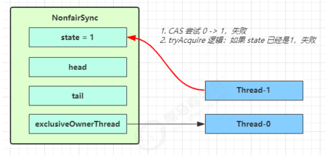

Thread-1 执行了 

1. CAS 尝试将 state 由 0 改为 1，结果失败 

2. 进入 tryAcquire 逻辑，这时 state 已经是1，结果仍然失败 

3. 接下来进入 addWaiter 逻辑，构造 Node 队列 

- - 图中黄色三角表示该 Node 的 waitStatus 状态，其中 0 为默认正常状态 
  - Node 的创建是懒惰的 
  - 其中第一个 Node 称为 Dummy（哑元）或哨兵，用来占位，并不关联线程


当前线程进入 acquireQueued 逻辑 

1. acquireQueued 会在一个死循环中不断尝试获得锁，失败后进入 park 阻塞 

2. 如果自己是紧邻着 head（排第二位），那么再次 tryAcquire 尝试获取锁，当然这时 state 仍为 1，失败 

3. 进入 shouldParkAfterFailedAcquire 逻辑，将前驱 node，即 head 的 waitStatus 改为 -1，这次返回 false


4. shouldParkAfterFailedAcquire 执行完毕回到 acquireQueued ，再次 tryAcquire 尝试获取锁，当然这时state 仍为 1，失败 

5. 当再次进入 shouldParkAfterFailedAcquire 时，这时因为其前驱 node 的 waitStatus 已经是 -1，这次返回true 

6. 进入 parkAndCheckInterrupt， Thread-1 park（灰色表示）

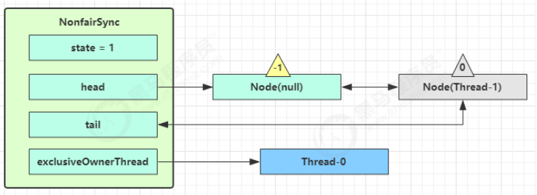

再次有多个线程经历上述过程竞争失败，变成这个样子

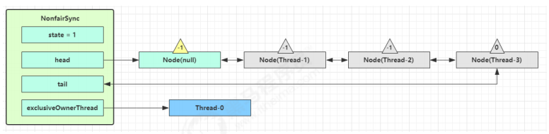

##### 原OwnerThread释放锁时


Thread-0 释放锁，进入 tryRelease 流程，如果成功 

- 设置 exclusiveOwnerThread 为 null 
- state = 0


##### 队列内线程抢到锁

当前队列不为 null，并且 head 的 waitStatus = -1，进入 unparkSuccessor 流程 

找到队列中离 head 最近的一个 Node（没取消的），unpark 恢复其运行，本例中即为 Thread-1 

回到 Thread-1 的 acquireQueued 流程

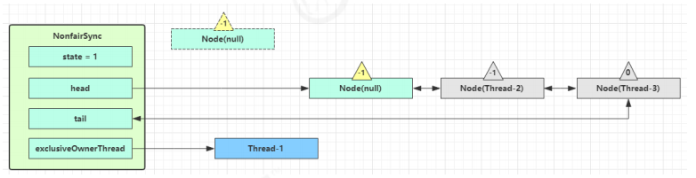

如果加锁成功（没有竞争），会设置 

- exclusiveOwnerThread 为 Thread-1，state = 1 
- head 指向刚刚 Thread-1 所在的 Node，该 Node 清空 Thread 
- 原本的 head 因为从链表断开，而可被垃圾回收 


##### 队列外线程抢到锁

如果这时候有其它线程来竞争（非公平的体现），例如这时有 Thread-4 来了

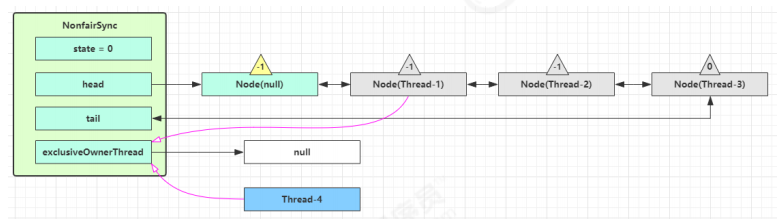

如果不巧又被 Thread-4 占了先 

- Thread-4 被设置为 exclusiveOwnerThread，state = 1 
- Thread-1 再次进入 acquireQueued 流程，获取锁失败，重新进入 park 阻塞 


#### 加锁源码

```java
// Sync 继承自 AQS
static final class NonfairSync extends Sync {
    private static final long serialVersionUID = 7316153563782823691L;
    
    // 加锁实现
    final void lock() {
        // 首先用 cas 尝试（仅尝试一次）将 state 从 0 改为 1, 如果成功表示获得了独占锁
        if (compareAndSetState(0, 1))
            setExclusiveOwnerThread(Thread.currentThread());
        else
            // 如果尝试失败，进入 ㈠
            acquire(1);
    }
    
    // ㈠ AQS 继承过来的方法, 方便阅读, 放在此处
    public final void acquire(int arg) {
        // ㈡ tryAcquire 
        if (
            !tryAcquire(arg) &&
            // 当 tryAcquire 返回为 false 时, 先调用 addWaiter ㈣, 接着 acquireQueued ㈤
            acquireQueued(addWaiter(Node.EXCLUSIVE), arg)
        ) {
            selfInterrupt();
        }
    }
    
    // ㈡ 进入 ㈢
    protected final boolean tryAcquire(int acquires) {
        return nonfairTryAcquire(acquires);
    }
    
    // ㈢ Sync 继承过来的方法, 方便阅读, 放在此处
    final boolean nonfairTryAcquire(int acquires) {
        final Thread current = Thread.currentThread();
        int c = getState();
        // 如果还没有获得锁
        if (c == 0) {
            // 尝试用 cas 获得, 这里体现了非公平性: 不去检查 AQS 队列
            if (compareAndSetState(0, acquires)) {
                setExclusiveOwnerThread(current);
                return true;
            }
        }
        // 如果已经获得了锁, 线程还是当前线程, 表示发生了锁重入
        else if (current == getExclusiveOwnerThread()) {
            // state++
            int nextc = c + acquires;
            if (nextc < 0) // overflow
                throw new Error("Maximum lock count exceeded");
            setState(nextc);
            return true;
        }
        // 获取失败, 回到调用处
        return false;
    }
    
    // ㈣ AQS 继承过来的方法, 方便阅读, 放在此处
    private Node addWaiter(Node mode) {
        // 将当前线程关联到一个 Node 对象上, 模式为独占模式
        Node node = new Node(Thread.currentThread(), mode);
        // 如果 tail 不为 null, cas 尝试将 Node 对象加入 AQS 队列尾部
        Node pred = tail;
        if (pred != null) {
            node.prev = pred;
            if (compareAndSetTail(pred, node)) {
                // 双向链表
                pred.next = node;
                return node;
            }
        }
        // 尝试将 Node 加入 AQS, 进入 ㈥
        enq(node);
        return node;
    }
    
    // ㈥ AQS 继承过来的方法, 方便阅读, 放在此处
    private Node enq(final Node node) {
        for (;;) {
            Node t = tail;
            if (t == null) {
                // 还没有, 设置 head 为哨兵节点（不对应线程，状态为 0）
                if (compareAndSetHead(new Node())) {
                    tail = head;
                }
            } else {
                // cas 尝试将 Node 对象加入 AQS 队列尾部
                node.prev = t;
                if (compareAndSetTail(t, node)) {
                    t.next = node;
                    return t;
                }
            }
        }
    }
    
    // ㈤ AQS 继承过来的方法, 方便阅读, 放在此处
    final boolean acquireQueued(final Node node, int arg) {
        boolean failed = true;
        try {
            boolean interrupted = false;
            for (;;) {
                final Node p = node.predecessor();
                // 上一个节点是 head, 表示轮到自己（当前线程对应的 node）了, 尝试获取
                if (p == head && tryAcquire(arg)) {
                    // 获取成功, 设置自己（当前线程对应的 node）为 head
                    setHead(node);
                    // 上一个节点 help GC
                    p.next = null;
                    failed = false;
                    // 返回中断标记 false
                    return interrupted;
                }
                if (
                    // 判断是否应当 park, 进入 ㈦
                    shouldParkAfterFailedAcquire(p, node) &&
                    // park 等待, 此时 Node 的状态被置为 Node.SIGNAL ㈧
                    parkAndCheckInterrupt()
                ) {
                    interrupted = true;
                }
            }
        } finally {
            if (failed)
                cancelAcquire(node);
        }
    }
    
    // ㈦ AQS 继承过来的方法, 方便阅读, 放在此处
    private static boolean shouldParkAfterFailedAcquire(Node pred, Node node) {
        // 获取上一个节点的状态
        int ws = pred.waitStatus;
        if (ws == Node.SIGNAL) {
            // 上一个节点都在阻塞, 那么自己也阻塞好了
            return true;
        }
        // > 0 表示取消状态
        if (ws > 0) {
            // 上一个节点取消, 那么重构删除前面所有取消的节点, 返回到外层循环重试
            do {
                node.prev = pred = pred.prev;
            } while (pred.waitStatus > 0);
            pred.next = node;
        } else {
            // 这次还没有阻塞
            // 但下次如果重试不成功, 则需要阻塞，这时需要设置上一个节点状态为 Node.SIGNAL
            compareAndSetWaitStatus(pred, ws, Node.SIGNAL);
        }
        return false;
    }
    
    // ㈧ 阻塞当前线程
    private final boolean parkAndCheckInterrupt() {
        LockSupport.park(this);
        return Thread.interrupted();
    }
}
```

**注意** 

- 是否需要 unpark 是由当前节点的前驱节点的 waitStatus == Node.SIGNAL 来决定，而不是本节点的 waitStatus 决定 


#### 解锁源码

```java
// Sync 继承自 AQS
static final class NonfairSync extends Sync {
    // 解锁实现
    public void unlock() {
        sync.release(1);
    }
    
    // AQS 继承过来的方法, 方便阅读, 放在此处
    public final boolean release(int arg) {
        // 尝试释放锁, 进入 ㈠
        if (tryRelease(arg)) {
            // 队列头节点 unpark
            Node h = head; 
            if (
                // 队列不为 null
                h != null &&
                // waitStatus == Node.SIGNAL 才需要 unpark
                h.waitStatus != 0
            ) {
                // unpark AQS 中等待的线程, 进入 ㈡
                unparkSuccessor(h);
            }
            return true;
        }
        return false;
    }
    
    // ㈠ Sync 继承过来的方法, 方便阅读, 放在此处
    protected final boolean tryRelease(int releases) {
        // state--
        int c = getState() - releases;
        if (Thread.currentThread() != getExclusiveOwnerThread())
            throw new IllegalMonitorStateException();
        boolean free = false;
        // 支持锁重入, 只有 state 减为 0, 才释放成功
        if (c == 0) {
            free = true;
            setExclusiveOwnerThread(null);
        }
        setState(c);
        return free;
    }
    
    // ㈡ AQS 继承过来的方法, 方便阅读, 放在此处
    private void unparkSuccessor(Node node) {
        // 如果状态为 Node.SIGNAL 尝试重置状态为 0
        // 不成功也可以
        int ws = node.waitStatus;
        if (ws < 0) {
            compareAndSetWaitStatus(node, ws, 0);
        }
        // 找到需要 unpark 的节点, 但本节点从 AQS 队列中脱离, 是由唤醒节点完成的
        Node s = node.next;
        // 不考虑已取消的节点, 从 AQS 队列从后至前找到队列最前面需要 unpark 的节点
        if (s == null || s.waitStatus > 0) {
            s = null;
            for (Node t = tail; t != null && t != node; t = t.prev)
                if (t.waitStatus <= 0)
                    s = t;
        }
        if (s != null)
            LockSupport.unpark(s.thread);
    }
}
```


## 公平锁原理

与非公平锁主要区别在于 tryAcquire 方法：**先检查 AQS 队列中是否有前驱节点，没有才去 CAS 竞争**

```java
static final class FairSync extends Sync {
    private static final long serialVersionUID = -3000897897090466540L;
    final void lock() {
        acquire(1);
    }
	// AQS 继承过来的方法, 方便阅读, 放在此处
    public final void acquire(int arg) {
        if (
            !tryAcquire(arg) &&
            acquireQueued(addWaiter(Node.EXCLUSIVE), arg)
        ) {
            selfInterrupt();
        }
    }
    // 与非公平锁主要区别在于 tryAcquire 方法的实现
    protected final boolean tryAcquire(int acquires) {
        final Thread current = Thread.currentThread();
        int c = getState();
        if (c == 0) {
            // 先检查 AQS 队列中是否有前驱节点, 没有(false)才去竞争
            if (!hasQueuedPredecessors() &&
                compareAndSetState(0, acquires)) {
                setExclusiveOwnerThread(current);
                return true;
            }
        }
        // 锁重入
        else if (current == getExclusiveOwnerThread()) {
            int nextc = c + acquires;
            if (nextc < 0)
                throw new Error("Maximum lock count exceeded");
            setState(nextc);
            return true;
        }
        return false;
    }
    
}
```

```java
// AQS 继承过来的方法, 方便阅读, 放在此处
public final boolean hasQueuedPredecessors() {    
    Node t = tail;
    Node h = head;
    Node s;    
    // 头尾指向一个节点，链表为空，返回false
    return h != t && 	//h != t 时表示队列中有 Node
        // 头尾之间有节点，判断头节点的下一个是不是空;  (s = h.next) == null 表示队列中还有没有老二
        // 不是空进入最后的判断，第二个节点的线程是否是本线程，不是返回 true，表示当前节点有前驱节点
        ((s = h.next) == null || s.thread != Thread.currentThread());
}
```


## 可重入原理

ReentrantLock中使用volatile修饰的i**nt类型state表示锁重入的个数**，在**加锁时发现state !=0**会**尝试去判断当前线程是否是持锁线程**。

### 可重入

可重入是指同一个线程如果首次获得了这把锁，那么它是这把锁的拥有者，因此有权利再次获取这把锁，如果不可重入锁，那么第二次获得锁时，自己也会被锁挡住，直接造成死锁

源码解析参考：`nonfairTryAcquire(int acquires)) ` 和 `tryRelease(int releases)`

```java
static final class NonfairSync extends Sync {
    // ...
    
    // Sync 继承过来的方法, 方便阅读, 放在此处
    final boolean nonfairTryAcquire(int acquires) {
        final Thread current = Thread.currentThread();
        int c = getState();
        if (c == 0) {
            if (compareAndSetState(0, acquires)) {
                setExclusiveOwnerThread(current);
                return true;
            }
        }
        // 如果已经获得了锁, 线程还是当前线程, 表示发生了锁重入
        else if (current == getExclusiveOwnerThread()) {
            // state++
            int nextc = c + acquires;
            if (nextc < 0) // overflow
                throw new Error("Maximum lock count exceeded");
            setState(nextc);
            return true;
        }
        return false;
    }
    
    // Sync 继承过来的方法, 方便阅读, 放在此处
    protected final boolean tryRelease(int releases) {
        // state-- 
        int c = getState() - releases;
        if (Thread.currentThread() != getExclusiveOwnerThread())
            throw new IllegalMonitorStateException();
        boolean free = false;
        // 支持锁重入, 只有 state 减为 0, 才释放成功
        if (c == 0) {
            free = true;
            setExclusiveOwnerThread(null);
        }
        setState(c);
        return free;
    }
}
```


### 使用案例

```java
static ReentrantLock lock = new ReentrantLock();
public static void main(String[] args) {
    method1();
}
public static void method1() {
    lock.lock();
    try {
        System.out.println(Thread.currentThread().getName() + " execute method1");
        method2();
    } finally {
        lock.unlock();
    }
}
public static void method2() {
    lock.lock();
    try {
        System.out.println(Thread.currentThread().getName() + " execute method2");
    } finally {
        lock.unlock();
    }
}
```

在 Lock 方法加两把锁会是什么情况呢？

* 加锁两次解锁两次：正常执行
* 加锁两次解锁一次：程序直接卡死，线程不能出来，也就说明**申请几把锁，最后需要解除几把锁**
* 加锁一次解锁两次：运行程序会直接报错

```java
public void getLock() {
    lock.lock();
    lock.lock();
    try {
        System.out.println(Thread.currentThread().getName() + "\t get Lock");
    } finally {
        lock.unlock();
        //lock.unlock();
    }
}
```


## 可打断原理 

### 基本使用

`public void lockInterruptibly()`：获得可打断的锁

* 如果没有竞争此方法就会获取 lock 对象锁
* 如果有竞争就进入阻塞队列，可以被其他线程用 interrupt 打断

注意：**如果是不可中断模式，那么即使使用了 interrupt 也不会让等待状态中的线程中断**

```java
public static void main(String[] args) throws InterruptedException {    
    ReentrantLock lock = new ReentrantLock();    
    Thread t1 = new Thread(() -> {        
        try {            
            System.out.println("尝试获取锁");            
            lock.lockInterruptibly();        
        } catch (InterruptedException e) {            
            System.out.println("没有获取到锁，被打断，直接返回");            
            return;        
        }        
        try {            
            System.out.println("获取到锁");        
        } finally {            
            lock.unlock();        
        }    
    }, "t1");    
    lock.lock();    
    t1.start();    
    Thread.sleep(2000);    
    System.out.println("主线程进行打断锁");    
    t1.interrupt();
}
```


***


### 实现原理

#### 不可打断模式

不可打断模式：即使它被打断，仍会驻留在 AQS 阻塞队列中，一直要**等到获得锁后才能得知自己被打断**了

```java
public final void acquire(int arg) {    
    if (!tryAcquire(arg) && acquireQueued(addWaiter(Node.EXCLUSIVE), arg))//阻塞等待        
        // 如果acquireQueued返回true，打断状态 interrupted = true        
        selfInterrupt();
}
static void selfInterrupt() {
    // 知道自己被打断了，需要重新产生一次中断完成中断效果
    Thread.currentThread().interrupt();
}
```

```java
final boolean acquireQueued(final Node node, int arg) {    
    try {        
        boolean interrupted = false;        
        for (;;) {            
            final Node p = node.predecessor();            
            if (p == head && tryAcquire(arg)) {                
                setHead(node);                
                p.next = null; // help GC                
                failed = false;                
                // 还是需要获得锁后, 才能返回打断状态
                return interrupted;            
            }            
            if (shouldParkAfterFailedAcquire(p, node) && parkAndCheckInterrupt()){
                // 条件二中判断当前线程是否被打断，被打断返回true，设置中断标记为 true，【获取锁后返回】
                interrupted = true;  
            }                  
        } 
    } finally {
        if (failed)
            cancelAcquire(node);
    }
}
 private final boolean parkAndCheckInterrupt() {    
     // 阻塞当前线程，如果打断标记已经是 true, 则 park 会失效
     LockSupport.park(this);    
     // 判断当前线程是否被打断，清除打断标记，被打断返回true
     return Thread.interrupted();
 }
```

#### 可打断模式

可打断模式：AbstractQueuedSynchronizer#acquireInterruptibly，**被打断后会直接抛出异常**

```java
public void lockInterruptibly() throws InterruptedException {    
    sync.acquireInterruptibly(1);
}
public final void acquireInterruptibly(int arg) {
    // 被其他线程打断了直接返回 false
    if (Thread.interrupted())
		throw new InterruptedException();
    if (!tryAcquire(arg))
        // 没获取到锁，进入这里
        doAcquireInterruptibly(arg);
}
```

```java
private void doAcquireInterruptibly(int arg) throws InterruptedException {
    // 返回封装当前线程的节点
    final Node node = addWaiter(Node.EXCLUSIVE);
    boolean failed = true;
    try {
        for (;;) {
            //...
            if (shouldParkAfterFailedAcquire(p, node) && parkAndCheckInterrupt())
                // 【在 park 过程中如果被 interrupt 会抛出异常】, 而不会再次进入循环获取锁后才完成打断效果
                throw new InterruptedException();
        }    
    } finally {
        // 抛出异常前会进入这里
        if (failed)
            // 取消当前线程的节点
            cancelAcquire(node);
    }
}
```

```java
// 取消节点出队的逻辑
private void cancelAcquire(Node node) {
    // 判空
    if (node == null)
        return;
	// 把当前节点封装的 Thread 置为空
    node.thread = null;
	// 获取当前取消的 node 的前驱节点
    Node pred = node.prev;
    // 前驱节点也被取消了，循环找到前面最近的没被取消的节点
    while (pred.waitStatus > 0)
        node.prev = pred = pred.prev;
    
	// 获取前驱节点的后继节点，可能是当前 node，也可能是 waitStatus > 0 的节点
    Node predNext = pred.next;
    
	// 把当前节点的状态设置为 【取消状态 1】
    node.waitStatus = Node.CANCELLED;
    
	// 条件成立说明当前节点是尾节点，把当前节点的前驱节点设置为尾节点
    if (node == tail && compareAndSetTail(node, pred)) {
        // 把前驱节点的后继节点置空，这里直接把所有的取消节点出队
        compareAndSetNext(pred, predNext, null);
    } else {
        // 说明当前节点不是 tail 节点
        int ws;
        // 条件一成立说明当前节点不是 head.next 节点
        if (pred != head &&
            // 判断前驱节点的状态是不是 -1，不成立说明前驱状态可能是 0 或者刚被其他线程取消排队了
            ((ws = pred.waitStatus) == Node.SIGNAL ||
             // 如果状态不是 -1，设置前驱节点的状态为 -1
             (ws <= 0 && compareAndSetWaitStatus(pred, ws, Node.SIGNAL))) &&
            // 前驱节点的线程不为null
            pred.thread != null) {
            
            Node next = node.next;
            // 当前节点的后继节点是正常节点
            if (next != null && next.waitStatus <= 0)
                // 把 前驱节点的后继节点 设置为 当前节点的后继节点，【从队列中删除了当前节点】
                compareAndSetNext(pred, predNext, next);
        } else {
            // 当前节点是 head.next 节点，唤醒当前节点的后继节点
            unparkSuccessor(node);
        }
        node.next = node; // help GC
    }
}
```


## 条件变量

### 基本使用

synchronized 的条件变量，是当条件不满足时进入 WaitSet 等待；ReentrantLock 的条件变量比 synchronized 强大之处在于**支持多个条件变量**

ReentrantLock 类获取 Condition 对象：`public Condition newCondition()`

Condition 类 API：

* `void await()`：当前线程从运行状态进入等待状态，释放锁
* `void signal()`：唤醒一个等待在 Condition 上的线程，但是必须获得与该 Condition 相关的锁

使用流程：

* **await / signal 前需要获得锁**
* await 执行后，会释放锁进入 ConditionObject 等待
* await 的线程被唤醒去重新竞争 lock 锁

* **线程在条件队列被打断会抛出中断异常**

* 竞争 lock 锁成功后，从 await 后继续执行

```java
public static void main(String[] args) throws InterruptedException {    
    ReentrantLock lock = new ReentrantLock();
    //创建一个新的条件变量
    Condition condition1 = lock.newCondition();
    Condition condition2 = lock.newCondition();
    new Thread(() -> {
        try {
            lock.lock();
            System.out.println("进入等待");
            //进入休息室等待
            condition1.await();
            System.out.println("被唤醒了");
        } catch (InterruptedException e) {
            e.printStackTrace();
        } finally {
            lock.unlock();
        }    
    }).start();
    Thread.sleep(1000);
    //叫醒
    new Thread(() -> {
        try {            
            lock.lock();
            //唤醒
            condition2.signal();
        } finally {
            lock.unlock();
        }
    }).start();
}
```


### 条件变量原理

**每个条件变量其实就对应着一个条件等待队列，其实现类是 ConditionObject** 

#### await

##### ReentrantLock条件变量await等待原理简洁版√

总体流程：
 **await方法将持锁线程包装成 一个为等待状态（Node.CONDITION）的node节点加入到ConditionObject（AQS提供）的条件队列中**，然后**释放掉持锁线程所持有的锁（state减为0，exclusiveOwnerThread置为null）**，然后**unpark AQS抽象的阻塞队列中的一个节点，让它去竞争锁**，**然后持锁线程park住自己**


> 持锁线程就是ReentrantLock中exclusiveOwnerThread变量（Thread类型）是当前线程
>  **每个 ConditionObject 对象都包含一个等待队列**
> 

- 开始 **持锁线程Thread-0调用 await，线程进入 ConditionObject 等待**，直到被唤醒或打断，调用 await 方法的线程都是持锁状态的，所以说逻辑里**不存在并发**

- **创建新的 Node 状态为 -2（Node.CONDITION）**，关联 持锁线程Thread-0，加入等待队列尾部

- 接下来进入 AQS 的 fullyRelease 流程，**释放同步器上的锁**

- **unpark AQS 队列中的下一个节点，竞争锁**，假设没有其他竞争线程，那么 Thread-1 竞争成功

- 然后park阻塞住以前的持锁线程Thread-0

  


---

总体流程是将 await 线程包装成 node 节点放入 ConditionObject 的条件队列，如果被唤醒就将 node 转移到 AQS 的执行阻塞队列，等待获取锁，**每个 Condition 对象都包含一个等待队列**

* 开始 Thread-0 持有锁，调用 await，线程进入 ConditionObject 等待，直到被唤醒或打断，调用 await 方法的线程都是持锁状态的，所以说逻辑里**不存在并发**

  ```java
  public final void await() throws InterruptedException {
       // 判断当前线程是否是中断状态，是就直接给个中断异常
      if (Thread.interrupted())
          throw new InterruptedException();
      // 将调用 await 的线程包装成 Node，添加到条件队列并返回
      Node node = addConditionWaiter();
      // 完全释放节点持有的锁，因为其他线程唤醒当前线程的前提是【持有锁】
      // 如果重入了n次，则state - n 变为0
      int savedState = fullyRelease(node);
      
      // 设置打断模式为没有被打断，状态码为 0
      int interruptMode = 0;
      
      // 如果该节点还没有转移至 AQS 阻塞队列, park 阻塞，等待进入阻塞队列
      while (!isOnSyncQueue(node)) {
          LockSupport.park(this);
          // 如果被打断，退出等待队列，对应的 node 【也会被迁移到阻塞队列】尾部，状态设置为 0
          if ((interruptMode = checkInterruptWhileWaiting(node)) != 0)
              break;
      }
      // 逻辑到这说明当前线程退出等待队列，进入【阻塞队列】
      
      // 尝试抢锁，释放了多少锁就【重新获取多少锁】，获取锁成功判断打断模式
      if (acquireQueued(node, savedState) && interruptMode != THROW_IE)
          interruptMode = REINTERRUPT;
      
      // node 在条件队列时 如果被外部线程中断唤醒，会加入到阻塞队列，但是并未设 nextWaiter = null
      if (node.nextWaiter != null)
          // 清理条件队列内所有已取消的 Node
          unlinkCancelledWaiters();
      // 条件成立说明挂起期间发生过中断
      if (interruptMode != 0)
          // 应用打断模式
          reportInterruptAfterWait(interruptMode);
  }
  ```

  ```java
  // 打断模式 - 在退出等待时重新设置打断状态
  private static final int REINTERRUPT = 1;
  // 打断模式 - 在退出等待时抛出异常
  private static final int THROW_IE = -1;
  ```

  

##### addConditionWaiter

* **创建新的 Node 状态为 -2（Node.CONDITION）**，关联 Thread-0，加入等待队列尾部

  ```java
  private Node addConditionWaiter() {
      // 获取当前条件队列的尾节点的引用，保存到局部变量 t 中
      Node t = lastWaiter;
      // 当前队列中不是空，并且尾节点t的状态不是 CONDITION（-2），说明当前节点发生了中断
      if (t != null && t.waitStatus != Node.CONDITION) {
          // 清理条件队列内所有已取消的 Node
          unlinkCancelledWaiters();
          // 清理完成重新获取 尾节点 的引用
          t = lastWaiter;
      }
      // 创建一个关联当前线程的新 node, 设置状态为 CONDITION(-2)，添加至队列尾部
      Node node = new Node(Thread.currentThread(), Node.CONDITION);
      if (t == null)
          firstWaiter = node;		// 空队列直接放在队首【不用CAS因为执行线程是持锁线程，并发安全】
      else
          t.nextWaiter = node;	// 非空队列队尾追加
      lastWaiter = node;			// 更新队尾的引用
      return node;
  }
  ```

  

  ##### unlinkCancelledWaiters()

  清理条件队列内所有已取消（不是CONDITION）的 node

  ```java
  // 清理条件队列内所有已取消（不是CONDITION）的 node，【链表删除的逻辑】
  private void unlinkCancelledWaiters() {
      // 从头节点开始遍历【FIFO】
      Node t = firstWaiter;
      // 指向正常的 CONDITION 节点
      Node trail = null;
      // 等待队列不空
      while (t != null) {
          // 获取当前节点的后继节点
          Node next = t.nextWaiter;
          // 判断 t 节点是不是 CONDITION 节点，条件队列内不是 CONDITION 就不是正常的
          if (t.waitStatus != Node.CONDITION) { 
              // 不是正常节点，需要 t 与下一个节点断开
              t.nextWaiter = null;
              // 条件成立说明遍历到的节点还未碰到过正常节点
              if (trail == null)
                  // 更新 firstWaiter 指针为下个节点
                  firstWaiter = next;
              else
                  // 让上一个正常节点指向 当前取消节点的 下一个节点，【删除非正常的节点】
                  trail.nextWaiter = next;
              // t 是尾节点了，更新 lastWaiter 指向最后一个正常节点
              if (next == null)
                  lastWaiter = trail;
          } else {
              // trail 指向的是正常节点 
              trail = t;
          }
          // 把 t.next 赋值给 t，循环遍历
          t = next; 
      }
  }
  ```

######  fullyRelease 流程，释放同步器上的锁

* 接下来 Thread-0 进入 AQS 的 fullyRelease 流程，释放同步器上的锁

  ```java
  // 线程可能重入，需要将 state 全部释放
  final int fullyRelease(Node node) {
      // 完全释放锁是否成功，false 代表成功
      boolean failed = true;
      try {
          // 获取当前线程所持有的 state 值总数
          int savedState = getState();
          // release -> tryRelease 解锁重入锁
          if (release(savedState)) {
              // 释放成功
              failed = false;
              // 返回解锁的深度
              return savedState;
          } else {
              // 解锁失败抛出异常
              throw new IllegalMonitorStateException();
          }
      } finally {
          // 没有释放成功，将当前 node 设置为取消状态
          if (failed)
              node.waitStatus = Node.CANCELLED;
      }
  }
  ```

  

* fullyRelease 中会 unpark AQS 队列中的下一个节点竞争锁，假设 Thread-1 竞争成功

  - fullyRelease会调用release(savedState)，release持锁线程，会唤醒阻塞对列中的阻塞线程

  


###### isOnSyncQueue 逻辑

* Thread-0 进入 isOnSyncQueue 逻辑判断节点**是否移动到阻塞队列**，没有就 park 阻塞 Thread-0

  ```java
  final boolean isOnSyncQueue(Node node) {
      // node 的状态是 CONDITION，signal 方法是先修改状态再迁移，所以前驱节点为空证明还【没有完成迁移】
      if (node.waitStatus == Node.CONDITION || node.prev == null)
          return false;
      // 说明当前节点已经成功入队到阻塞队列，且当前节点后面已经有其它 node，因为条件队列的 next 指针为 null
      if (node.next != null)
          return true;
  	// 说明【可能在阻塞队列，但是是尾节点】
      // 从阻塞队列的尾节点开始向前【遍历查找 node】，如果查找到返回 true，查找不到返回 false
      return findNodeFromTail(node);
  }
  ```


* await 线程 park 后如果被 unpark 或者被打断，都会进入 checkInterruptWhileWaiting 判断线程是否被打断：**在条件队列被打断的线程需要抛出异常**

  ```java
  private int checkInterruptWhileWaiting(Node node) {
      // Thread.interrupted() 返回当前线程中断标记位，并且重置当前标记位 为 false
      // 如果被中断了，根据是否在条件队列被中断的，设置中断状态码
      return Thread.interrupted() ?(transferAfterCancelledWait(node) ? THROW_IE : REINTERRUPT) : 0;
  }
  ```

  ```java
  // 这个方法只有在线程是被打断唤醒时才会调用
  final boolean transferAfterCancelledWait(Node node) {
      // 条件成立说明当前node一定是在条件队列内，因为 signal 迁移节点到阻塞队列时，会将节点的状态修改为 0
      if (compareAndSetWaitStatus(node, Node.CONDITION, 0)) {
          // 把【中断唤醒的 node 加入到阻塞队列中】
          enq(node);
          // 表示是在条件队列内被中断了，设置为 THROW_IE 为 -1
          return true;
      }
  
      //执行到这里的情况：
      //1.当前node已经被外部线程调用 signal 方法将其迁移到 阻塞队列 内了
      //2.当前node正在被外部线程调用 signal 方法将其迁移至 阻塞队列 进行中状态
      
      // 如果当前线程还没到阻塞队列，一直释放 CPU
      while (!isOnSyncQueue(node))
          Thread.yield();
  
      // 表示当前节点被中断唤醒时不在条件队列了，设置为 REINTERRUPT 为 1
      return false;
  }
  ```

* 最后开始处理中断状态：

  ```java
  private void reportInterruptAfterWait(int interruptMode) throws InterruptedException {
      // 条件成立说明【在条件队列内发生过中断，此时 await 方法抛出中断异常】
      if (interruptMode == THROW_IE)
          throw new InterruptedException();
  
      // 条件成立说明【在条件队列外发生的中断，此时设置当前线程的中断标记位为 true】
      else if (interruptMode == REINTERRUPT)
          // 进行一次自己打断，产生中断的效果
          selfInterrupt();
  }
  ```

  


***


#### signal

##### ReentrantLock条件变量signal唤醒原理简洁版
> 在AQS中条件队列中的节点和抽象的阻塞队列中的节点都是**同一个Node类型**
> ReentrantLock.signal方法,也**必须要持锁线程才能执行**

简洁版：
**持锁线程**执行**ReentrantLock.signal方法**，**唤醒**在等待队列（ConditionObject抽象的队列）中的**第一个Node节点**，**修改该Node节点waitStatus为0**，然后将该节点**插入到AQS的抽象的阻塞队列的尾部**，并修改**该节点的前驱节点的waitStatus值为-1**（waitStatus 为 -1的节点表示可以唤醒下一个线程）。


进入 ConditionObject 的 doSignal 流程，**取得等待队列中第一个 Node**

执行 transferForSignal 流程，将**将该Node节点 的 waitStatus 改为 0，然后将该 Node 加入 AQS 队列尾部，**，将**唤醒线程的前驱节点的waitStatus 改为 -1**，waitStatus 为 -1的节点表示可以唤醒下一个线程


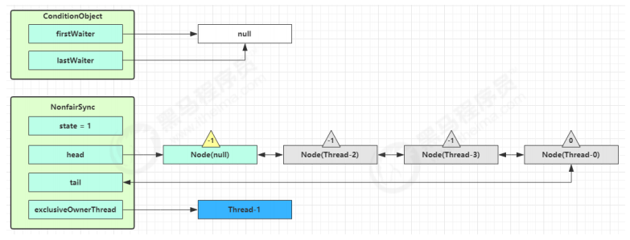

Thread-1 释放锁，进入 unlock 流程，略 


---


* 假设 Thread-1 要来唤醒 Thread-0，进入 ConditionObject 的 doSignal 流程，**取得等待队列中第一个 Node**，即 Thread-0 所在 Node，必须持有锁才能唤醒, 因此 doSignal 内线程安全

  ```java
  public final void signal() {
      // 判断调用 signal 方法的线程是否是独占锁持有线程
      if (!isHeldExclusively())
          throw new IllegalMonitorStateException();
      // 获取条件队列中第一个 Node
      Node first = firstWaiter;
      // 不为空就将第该节点【迁移到阻塞队列】
      if (first != null)
          doSignal(first);
  }
  ```

  ```java
  // 唤醒 - 【将没取消的第一个节点转移至 AQS 队列尾部】
  private void doSignal(Node first) {
      do {
          // 成立说明当前节点的下一个节点是 null，当前节点是尾节点了，队列中只有当前一个节点了
          if ((firstWaiter = first.nextWaiter) == null)
              lastWaiter = null;
          first.nextWaiter = null;
      // 将等待队列中的 Node 转移至 AQS 队列，不成功且还有节点则继续循环
      } while (!transferForSignal(first) && (first = firstWaiter) != null);
  }
  
  // signalAll() 会调用这个函数，唤醒所有的节点
  private void doSignalAll(Node first) {
      lastWaiter = firstWaiter = null;
      do {
          Node next = first.nextWaiter;
          first.nextWaiter = null;
          transferForSignal(first);
          first = next;
      // 唤醒所有的节点，都放到阻塞队列中
      } while (first != null);
  }
  ```

###### transferForSignal

* 执行 transferForSignal，**先将节点的 waitStatus 改为 0，然后加入 AQS 阻塞队列尾部**，将 Thread-3 的 waitStatus 改为 -1

  ```java
  // 如果节点状态是取消, 返回 false 表示转移失败, 否则转移成功
  final boolean transferForSignal(Node node) {
      // CAS 修改当前节点的状态，修改为 0，因为当前节点马上要迁移到阻塞队列了
      // 如果状态已经不是 CONDITION, 说明线程被取消（await 释放全部锁失败）或者被中断（可打断 cancelAcquire）
      if (!compareAndSetWaitStatus(node, Node.CONDITION, 0))
          // 返回函数调用处继续寻找下一个节点
          return false;
      
      // 【先改状态，再进行迁移】
      // 将当前 node 入阻塞队列，p 是当前节点在阻塞队列的【前驱节点】
      Node p = enq(node);
      int ws = p.waitStatus;
      
      // 如果前驱节点被取消或者不能设置状态为 Node.SIGNAL，就 unpark 取消当前节点线程的阻塞状态, 
      // 让 thread-0 线程竞争锁，重新同步状态
      if (ws > 0 || !compareAndSetWaitStatus(p, ws, Node.SIGNAL))
          LockSupport.unpark(node.thread);
      return true;
  }
  ```

  

* Thread-1 释放锁，进入 unlock 流程


### 整体流程原理版本

#### await 流程 

开始 Thread-0 持有锁，调用 await，进入 ConditionObject 的 addConditionWaiter 流程 

创建**新的 Node 状态为 -2（Node.CONDITION）**，关联 Thread-0，加入等待队列尾部


接下来进入 AQS 的 fullyRelease 流程，释放同步器上的锁

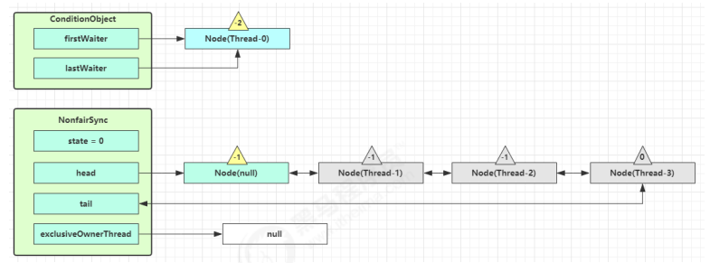

unpark AQS 队列中的下一个节点，竞争锁，假设没有其他竞争线程，那么 Thread-1 竞争成功


park 阻塞 Thread-0


#### signal 流程 

假设 Thread-1 要来唤醒 Thread-0

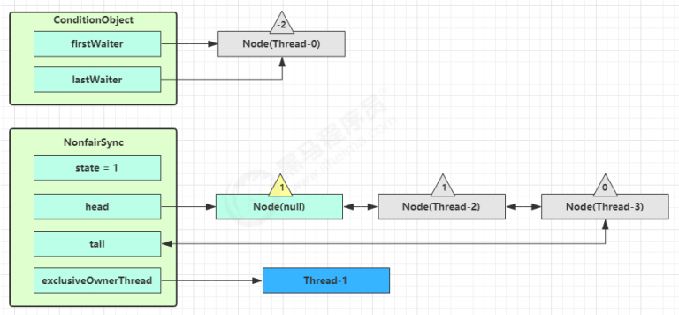

进入 ConditionObject 的 doSignal 流程，取得等待队列中第一个 Node，即 Thread-0 所在 Node


执行 transferForSignal 流程，将该 Node 加入 AQS 队列尾部，将 Thread-0 的 waitStatus 改为 0，Thread-3 的waitStatus 改为 -1


Thread-1 释放锁，进入 unlock 流程，略 


### 源码

```java
public class ConditionObject implements Condition, java.io.Serializable {
    private static final long serialVersionUID = 1173984872572414699L;
    
    // 第一个等待节点
    private transient Node firstWaiter;
    
    // 最后一个等待节点
    private transient Node lastWaiter;
    public ConditionObject() { }
    // ㈠ 添加一个 Node 至等待队列
    private Node addConditionWaiter() {
        Node t = lastWaiter;
        // 所有已取消的 Node 从队列链表删除, 见 ㈡
        if (t != null && t.waitStatus != Node.CONDITION) {
            unlinkCancelledWaiters();
            t = lastWaiter;
        }
        // 创建一个关联当前线程的新 Node, 添加至队列尾部
        Node node = new Node(Thread.currentThread(), Node.CONDITION);
        if (t == null)
            firstWaiter = node;
        else
            t.nextWaiter = node;
        lastWaiter = node;
        return node;
    }
    // 唤醒 - 将没取消的第一个节点转移至 AQS 队列
    private void doSignal(Node first) {
        do {
            // 已经是尾节点了
            if ( (firstWaiter = first.nextWaiter) == null) {
                lastWaiter = null;
            }
            first.nextWaiter = null;
        } while (
            // 将等待队列中的 Node 转移至 AQS 队列, 不成功且还有节点则继续循环 ㈢
            !transferForSignal(first) &&
            // 队列还有节点
            (first = firstWaiter) != null
        );
    }
    
    // 外部类方法, 方便阅读, 放在此处
    // ㈢ 如果节点状态是取消, 返回 false 表示转移失败, 否则转移成功
    final boolean transferForSignal(Node node) {
        // 如果状态已经不是 Node.CONDITION, 说明被取消了
        if (!compareAndSetWaitStatus(node, Node.CONDITION, 0))
            return false;
        // 加入 AQS 队列尾部
        Node p = enq(node);
        int ws = p.waitStatus;
        if (
            // 上一个节点被取消
            ws > 0 ||
            // 上一个节点不能设置状态为 Node.SIGNAL
            !compareAndSetWaitStatus(p, ws, Node.SIGNAL) 
        ) {
            // unpark 取消阻塞, 让线程重新同步状态
            LockSupport.unpark(node.thread);
        }
        return true;
    }
    // 全部唤醒 - 等待队列的所有节点转移至 AQS 队列
    private void doSignalAll(Node first) {
        lastWaiter = firstWaiter = null;
        do {
            Node next = first.nextWaiter;
            first.nextWaiter = null;
            transferForSignal(first);
            first = next;
        } while (first != null);
    }
    
    // ㈡
    private void unlinkCancelledWaiters() {
        // ...
    }
    // 唤醒 - 必须持有锁才能唤醒, 因此 doSignal 内无需考虑加锁
    public final void signal() {
        if (!isHeldExclusively())
            throw new IllegalMonitorStateException();
        Node first = firstWaiter;
        if (first != null)
            doSignal(first);
    }
    // 全部唤醒 - 必须持有锁才能唤醒, 因此 doSignalAll 内无需考虑加锁
    public final void signalAll() {
        if (!isHeldExclusively())
            throw new IllegalMonitorStateException();
        Node first = firstWaiter;
        if (first != null)
            doSignalAll(first);
    }
    // 不可打断等待 - 直到被唤醒
    public final void awaitUninterruptibly() {
        // 添加一个 Node 至等待队列, 见 ㈠
        Node node = addConditionWaiter();
        // 释放节点持有的锁, 见 ㈣
        int savedState = fullyRelease(node);
        boolean interrupted = false;
        // 如果该节点还没有转移至 AQS 队列, 阻塞
        while (!isOnSyncQueue(node)) {
            // park 阻塞
            LockSupport.park(this);
            // 如果被打断, 仅设置打断状态
            if (Thread.interrupted())
                interrupted = true;
        }
        // 唤醒后, 尝试竞争锁, 如果失败进入 AQS 队列
        if (acquireQueued(node, savedState) || interrupted)
            selfInterrupt();
    }
    // 外部类方法, 方便阅读, 放在此处
    // ㈣ 因为某线程可能重入，需要将 state 全部释放
    final int fullyRelease(Node node) {
        boolean failed = true;
        try {
            int savedState = getState();
            if (release(savedState)) {
                failed = false;
                return savedState;
            } else {
                throw new IllegalMonitorStateException();
            }
        } finally {
            if (failed)
                node.waitStatus = Node.CANCELLED;
        }
    }
    // 打断模式 - 在退出等待时重新设置打断状态
    private static final int REINTERRUPT = 1;
    // 打断模式 - 在退出等待时抛出异常
    private static final int THROW_IE = -1;
    // 判断打断模式
    private int checkInterruptWhileWaiting(Node node) {
        return Thread.interrupted() ?
            (transferAfterCancelledWait(node) ? THROW_IE : REINTERRUPT) :
        0;
    }
    // ㈤ 应用打断模式
    private void reportInterruptAfterWait(int interruptMode)
        throws InterruptedException {
        if (interruptMode == THROW_IE)
            throw new InterruptedException();
        else if (interruptMode == REINTERRUPT)
            selfInterrupt();
    }
    // 等待 - 直到被唤醒或打断
    public final void await() throws InterruptedException {
        if (Thread.interrupted()) {
            throw new InterruptedException();
        }
        // 添加一个 Node 至等待队列, 见 ㈠
        Node node = addConditionWaiter();
        // 释放节点持有的锁
        int savedState = fullyRelease(node);
        int interruptMode = 0;
        // 如果该节点还没有转移至 AQS 队列, 阻塞
        while (!isOnSyncQueue(node)) {
            // park 阻塞
            LockSupport.park(this);
            // 如果被打断, 退出等待队列
            if ((interruptMode = checkInterruptWhileWaiting(node)) != 0)
                break;
        }
        // 退出等待队列后, 还需要获得 AQS 队列的锁
        if (acquireQueued(node, savedState) && interruptMode != THROW_IE)
            interruptMode = REINTERRUPT;
        // 所有已取消的 Node 从队列链表删除, 见 ㈡
        if (node.nextWaiter != null) 
            unlinkCancelledWaiters();
        // 应用打断模式, 见 ㈤
        if (interruptMode != 0)
            reportInterruptAfterWait(interruptMode);
    }
    // 等待 - 直到被唤醒或打断或超时
    public final long awaitNanos(long nanosTimeout) throws InterruptedException {
        if (Thread.interrupted()) {
            throw new InterruptedException();
        }
        // 添加一个 Node 至等待队列, 见 ㈠
        Node node = addConditionWaiter();
        // 释放节点持有的锁
        int savedState = fullyRelease(node);
        // 获得最后期限
        final long deadline = System.nanoTime() + nanosTimeout;
        int interruptMode = 0;
        // 如果该节点还没有转移至 AQS 队列, 阻塞
        while (!isOnSyncQueue(node)) {
            // 已超时, 退出等待队列
            if (nanosTimeout <= 0L) {
                transferAfterCancelledWait(node);
                break;
            }
            // park 阻塞一定时间, spinForTimeoutThreshold 为 1000 ns
            if (nanosTimeout >= spinForTimeoutThreshold)
                LockSupport.parkNanos(this, nanosTimeout);
            // 如果被打断, 退出等待队列
            if ((interruptMode = checkInterruptWhileWaiting(node)) != 0)
                break;
            nanosTimeout = deadline - System.nanoTime();
        }
        // 退出等待队列后, 还需要获得 AQS 队列的锁
        if (acquireQueued(node, savedState) && interruptMode != THROW_IE)
            interruptMode = REINTERRUPT;
        // 所有已取消的 Node 从队列链表删除, 见 ㈡
        if (node.nextWaiter != null)
            unlinkCancelledWaiters();
        // 应用打断模式, 见 ㈤
        if (interruptMode != 0)
            reportInterruptAfterWait(interruptMode);
        return deadline - System.nanoTime();
    }
    // 等待 - 直到被唤醒或打断或超时, 逻辑类似于 awaitNanos
    public final boolean awaitUntil(Date deadline) throws InterruptedException {
        // ...
    }
    // 等待 - 直到被唤醒或打断或超时, 逻辑类似于 awaitNanos
    public final boolean await(long time, TimeUnit unit) throws InterruptedException {
        // ...
    }
    // 工具方法 省略 ...
}
```

## 锁超时

##### 基本使用

`public boolean tryLock()`：尝试获取锁，获取到返回 true，获取不到直接放弃，不进入阻塞队列

`public boolean tryLock(long timeout, TimeUnit unit)`：在给定时间内获取锁，获取不到就退出

注意：tryLock 期间也可以被打断

```java
public static void main(String[] args) {
    ReentrantLock lock = new ReentrantLock();
    Thread t1 = new Thread(() -> {
        try {
            if (!lock.tryLock(2, TimeUnit.SECONDS)) {
                System.out.println("获取不到锁");
                return;
            }
        } catch (InterruptedException e) {
            System.out.println("被打断，获取不到锁");
            return;
        }
        try {
            log.debug("获取到锁");
        } finally {
            lock.unlock();
        }
    }, "t1");
    lock.lock();
    System.out.println("主线程获取到锁");
    t1.start();
    
    Thread.sleep(1000);
    try {
        System.out.println("主线程释放了锁");
    } finally {
        lock.unlock();
    }
}
```


***


##### 实现原理

* 成员变量：指定超时限制的阈值，小于该值的线程不会被挂起

  ```java
  static final long spinForTimeoutThreshold = 1000L;
  ```

  超时时间设置的小于该值，就会被禁止挂起，因为阻塞在唤醒的成本太高，不如选择自旋空转

* tryLock()

  ```java
  public boolean tryLock() {   
      // 只尝试一次
      return sync.nonfairTryAcquire(1);
  }
  ```

* tryLock(long timeout, TimeUnit unit)

  ```java
  public final boolean tryAcquireNanos(int arg, long nanosTimeout) {
      if (Thread.interrupted())        
          throw new InterruptedException();    
      // tryAcquire 尝试一次
      return tryAcquire(arg) || doAcquireNanos(arg, nanosTimeout);
  }
  protected final boolean tryAcquire(int acquires) {    
      return nonfairTryAcquire(acquires);
  }
  ```

  ```java
  private boolean doAcquireNanos(int arg, long nanosTimeout) {    
      if (nanosTimeout <= 0L)
          return false;
      // 获取最后期限的时间戳
      final long deadline = System.nanoTime() + nanosTimeout;
      //...
      try {
          for (;;) {
              //...
              // 计算还需等待的时间
              nanosTimeout = deadline - System.nanoTime();
              if (nanosTimeout <= 0L)	//时间已到     
                  return false;
              if (shouldParkAfterFailedAcquire(p, node) &&
                  // 如果 nanosTimeout 大于该值，才有阻塞的意义，否则直接自旋会好点
                  nanosTimeout > spinForTimeoutThreshold)
                  LockSupport.parkNanos(this, nanosTimeout);
              // 【被打断会报异常】
              if (Thread.interrupted())
                  throw new InterruptedException();
          }    
      }
  }
  ```


***


##### 哲学家就餐

```java
public static void main(String[] args) {
    Chopstick c1 = new Chopstick("1");//...
    Chopstick c5 = new Chopstick("5");
    new Philosopher("苏格拉底", c1, c2).start();
    new Philosopher("柏拉图", c2, c3).start();
    new Philosopher("亚里士多德", c3, c4).start();
    new Philosopher("赫拉克利特", c4, c5).start();    
    new Philosopher("阿基米德", c5, c1).start();
}
class Philosopher extends Thread {
    Chopstick left;
    Chopstick right;
    public void run() {
        while (true) {
            // 尝试获得左手筷子
            if (left.tryLock()) {
                try {
                    // 尝试获得右手筷子
                    if (right.tryLock()) {
                        try {
                            System.out.println("eating...");
                            Thread.sleep(1000);
                        } finally {
                            right.unlock();
                        }
                    }
                } finally {
                    left.unlock();
                }
            }
        }
    }
}
class Chopstick extends ReentrantLock {
    String name;
    public Chopstick(String name) {
        this.name = name;
    }
    @Override
    public String toString() {
        return "筷子{" + name + '}';
    }
}
```


# 3. 读写锁


## 3.1 ReentrantReadWriteLock

当读操作远远高于写操作时，这时候使用 `读写锁` 让 `读-读` 可以并发，提高性能。 

类似于数据库中的 `select ... from ... lock in share mode` 


### 示例

提供一个 `数据容器类` 内部分别使用读锁保护数据的 `read()` 方法，写锁保护数据的 `write()` 方法

```java
class DataContainer {
    
    private Object data;
    private ReentrantReadWriteLock rw = new ReentrantReadWriteLock();
    private ReentrantReadWriteLock.ReadLock r = rw.readLock();
    private ReentrantReadWriteLock.WriteLock w = rw.writeLock();
    
    public Object read() {
        log.debug("获取读锁...");
        r.lock();
        try {
            log.debug("读取");
            sleep(1);
            return data;
        } finally {
            log.debug("释放读锁...");
            r.unlock();
        }
    }
    
    public void write() {
        log.debug("获取写锁...");
        w.lock();
        try {
            log.debug("写入");
            sleep(1);
        } finally {
            log.debug("释放写锁...");
            w.unlock();
        }
    }
    
}
```

#### 读-读 可并发

测试 `读锁-读锁` 可以并发

```java
DataContainer dataContainer = new DataContainer();

new Thread(() -> {
    dataContainer.read();
}, "t1").start();

new Thread(() -> {
    dataContainer.read();
}, "t2").start();
```

输出结果，从这里可以看到 Thread-0 锁定期间，Thread-1 的读操作不受影响

```java
14:05:14.341 c.DataContainer [t2] - 获取读锁... 
14:05:14.341 c.DataContainer [t1] - 获取读锁... 
14:05:14.345 c.DataContainer [t1] - 读取
14:05:14.345 c.DataContainer [t2] - 读取
14:05:15.365 c.DataContainer [t2] - 释放读锁... 
14:05:15.386 c.DataContainer [t1] - 释放读锁...
```

#### 读-写 / 写-写 互斥

测试 `读锁-写锁` 相互阻塞

```java
DataContainer dataContainer = new DataContainer();

new Thread(() -> {
    dataContainer.read();
}, "t1").start();

Thread.sleep(100);
new Thread(() -> {
    dataContainer.write();
}, "t2").start();
```

输出结果

```java
14:04:21.838 c.DataContainer [t1] - 获取读锁... 
14:04:21.838 c.DataContainer [t2] - 获取写锁... 
14:04:21.841 c.DataContainer [t2] - 写入
14:04:22.843 c.DataContainer [t2] - 释放写锁... 
14:04:22.843 c.DataContainer [t1] - 读取
14:04:23.843 c.DataContainer [t1] - 释放读锁...
```

`写锁-写锁` 也是相互阻塞的，这里就不测试了 


#### 注意事项 

- 读锁不支持条件变量,写锁支持
- 重入时不支持升级：即持有读锁的情况下去获取写锁，会导致获取写锁永久等待

```java
r.lock();
try {
    // ...
    w.lock();
    try {
        // ...
    } finally{
        w.unlock();
    }
} finally{
    r.unlock();
}
```

- **重入时支持降级：即持有写锁的情况下去获取读锁**

```java
class CachedData {
    Object data;
    // 是否有效，如果失效，需要重新计算 data
    volatile boolean cacheValid;
    final ReentrantReadWriteLock rwl = new ReentrantReadWriteLock();
    void processCachedData() {
        rwl.readLock().lock();
        if (!cacheValid) {
            // 获取写锁前必须释放读锁
            rwl.readLock().unlock();
            rwl.writeLock().lock();
            try {
                // 判断是否有其它线程已经获取了写锁、更新了缓存, 避免重复更新
                if (!cacheValid) {
                    data = ...
                        cacheValid = true;
                }
                // 降级为读锁, 释放写锁, 这样能够让其它线程读取缓存
                rwl.readLock().lock();
            } finally {
                rwl.writeLock().unlock();
            }
        }
        // 自己用完数据, 释放读锁 
        try {
            use(data);
        } finally {
            rwl.readLock().unlock();
        }
    }
}
```


### ***** **应用之缓存** 

#### 1. 缓存更新策略 

更新时，是先清缓存还是先更新数据库 

先清缓存

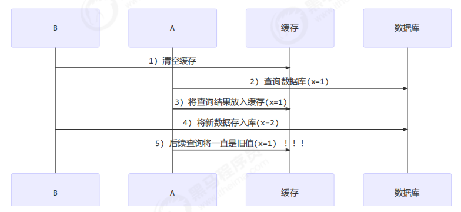

先更新数据库

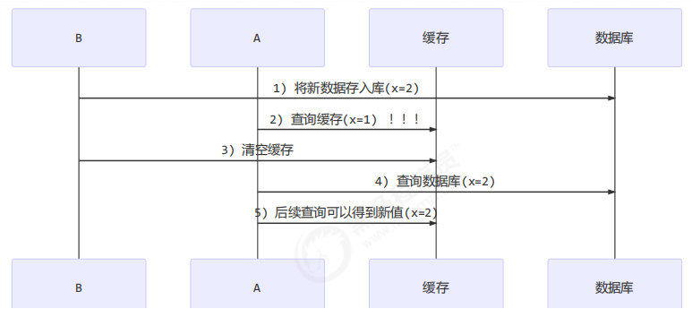

补充一种情况，假设查询线程 A 查询数据时恰好缓存数据由于时间到期失效，或是第一次查询


这种情况的出现几率非常小，见 facebook 论文


#### 2. 读写锁实现一致性缓存 

使用读写锁实现一个简单的按需加载缓存

```java
class GenericCachedDao<T> {
    // HashMap 作为缓存非线程安全, 需要保护
    HashMap<SqlPair, T> map = new HashMap<>();
    
    ReentrantReadWriteLock lock = new ReentrantReadWriteLock(); 
    GenericDao genericDao = new GenericDao();
    
    public int update(String sql, Object... params) {
        SqlPair key = new SqlPair(sql, params);
        // 加写锁, 防止其它线程对缓存读取和更改
        lock.writeLock().lock();
        try {
            int rows = genericDao.update(sql, params);
            map.clear();
            return rows;
        } finally {
            lock.writeLock().unlock();
        }
    }
    
    public T queryOne(Class<T> beanClass, String sql, Object... params) {
        SqlPair key = new SqlPair(sql, params);
        // 加读锁, 防止其它线程对缓存更改
        lock.readLock().lock();
        try {
            T value = map.get(key);
            if (value != null) {
                return value;
            }
        } finally {
            lock.readLock().unlock();
        }
        // 加写锁, 防止其它线程对缓存读取和更改
        lock.writeLock().lock();
        try {
            // get 方法上面部分是可能多个线程进来的, 可能已经向缓存填充了数据
            // 为防止重复查询数据库, 再次验证
            T value = map.get(key);
            if (value == null) {
                // 如果没有, 查询数据库
                value = genericDao.queryOne(beanClass, sql, params);
                map.put(key, value);
            }
            return value;
        } finally {
            lock.writeLock().unlock();
        }
    }
    
    // 作为 key 保证其是不可变的
    class SqlPair {
        private String sql;
        private Object[] params;
        public SqlPair(String sql, Object[] params) {
            this.sql = sql;
            this.params = params;
        }
        @Override
        public boolean equals(Object o) {
            if (this == o) {
                return true;
            }
            if (o == null || getClass() != o.getClass()) {
                return false;
            }
            SqlPair sqlPair = (SqlPair) o;
            return sql.equals(sqlPair.sql) &&
                Arrays.equals(params, sqlPair.params);
        }
        @Override
        public int hashCode() {
            int result = Objects.hash(sql);
            result = 31 * result + Arrays.hashCode(params);
            return result;
        }
    }
    
}
```

**注意** 

- 以上实现体现的是读写锁的应用，保证缓存和数据库的一致性，但有下面的问题没有考虑 

- - 适合读多写少，如果写操作比较频繁，以上实现性能低 
  - 没有考虑缓存容量 
  - 没有考虑缓存过期 
  - 只适合单机 
  - 并发性还是低，目前只会用一把锁 
  - 更新方法太过简单粗暴，清空了所有 key（考虑按类型分区或重新设计 key） 

- 乐观锁实现：用 CAS 去更新


### * 读写锁原理 


#### 1. 图解流程 

读写锁用的是同一个 Sycn 同步器，因此等待队列、state 等也是同一个 

#### t1 w.lock，t2 r.lock 

1） t1 成功上锁，流程与 ReentrantLock 加锁相比没有特殊之处，

不同是写锁状态占了 state 的低 16 位，而读锁使用的是 state 的高 16 位 


2）t2 执行 r.lock，这时进入读锁的 sync.acquireShared(1) 流程，首先会进入tryAcquireShared 流程。如果有写锁占据，那么 tryAcquireShared 返回 -1 表示失败 

tryAcquireShared 返回值表示

- -1 表示失败
- 0 表示成功，但后继节点不会继续唤醒 
- 正数表示成功，而且数值是还有几个后继节点需要唤醒，读写锁返回 1


3）这时会进入 sync.doAcquireShared(1) 流程，首先也是调用 addWaiter 添加节点，不同之处在于节点被设置为Node.SHARED 模式而非 Node.EXCLUSIVE 模式，注意此时 t2 仍处于活跃状态


4）t2 会看看自己的节点是不是老二，如果是，还会再次调用 tryAcquireShared(1) 来尝试获取锁 

5）如果没有成功，在 doAcquireShared 内 for (;;) 循环一次，把前驱节点的 waitStatus 改为 -1，再 for (;;) 循环一次尝试 tryAcquireShared(1) 如果还不成功，那么在 parkAndCheckInterrupt() 处 park

> 一个节点如果有后继，则waitStatus为-1，表示后面有节点需要唤醒。

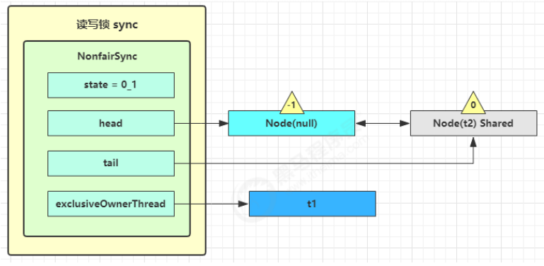

#### t3 r.lock，t4 w.lock 

这种状态下，假设又有 t3 加读锁和 t4 加写锁，这期间 t1 仍然持有锁，就变成了下面的样子

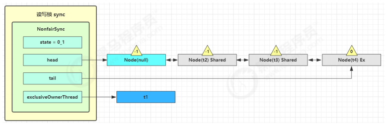

#### t1 w.unlock 

这时会走到写锁的 sync.release(1) 流程，调用 sync.tryRelease(1) 成功，变成下面的样子


接下来执行唤醒流程 sync.unparkSuccessor，即让老二恢复运行，这时 t2 在 doAcquireShared 内parkAndCheckInterrupt() 处恢复运行 

> t2需要判断他是不是老二节点，如果是，则可以尝试获取锁。

这回再来一次 for (;;) 执行 tryAcquireShared 成功则让读锁计数加一


这时 t2 已经恢复运行，接下来 t2 调用 setHeadAndPropagate(node, 1)，它原本所在节点被置为头节点


事情还没完，在 setHeadAndPropagate 方法内还会检查下一个节点是否是 shared，如果是则调用 

doReleaseShared() 将 head 的状态从 -1 改为 0 并唤醒老二，这时 t3 在 doAcquireShared 内parkAndCheckInterrupt() 处恢复运行


这回再来一次 for (;;) 执行 tryAcquireShared 成功则让读锁计数加一


这时 t3 已经恢复运行，接下来 t3 调用 setHeadAndPropagate(node, 1)，它原本所在节点被置为头节点

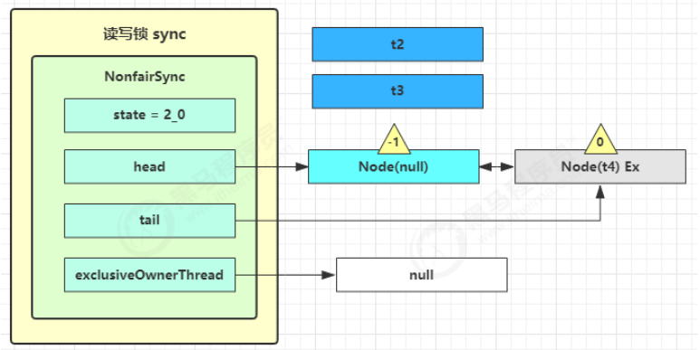

下一个节点不是 shared 了，因此不会继续唤醒 t4 所在节点 


#### t2 r.unlock，t3 r.unlock 

t2 进入 sync.releaseShared(1) 中，调用 tryReleaseShared(1) 让计数减一，但由于计数还不为零

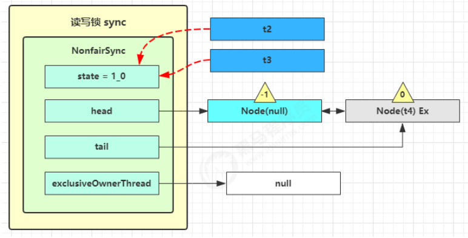

t3 进入 sync.releaseShared(1) 中，调用 tryReleaseShared(1) 让计数减一，这回计数为零了，进入 

doReleaseShared() 将头节点从 -1 改为 0 并唤醒老二，即

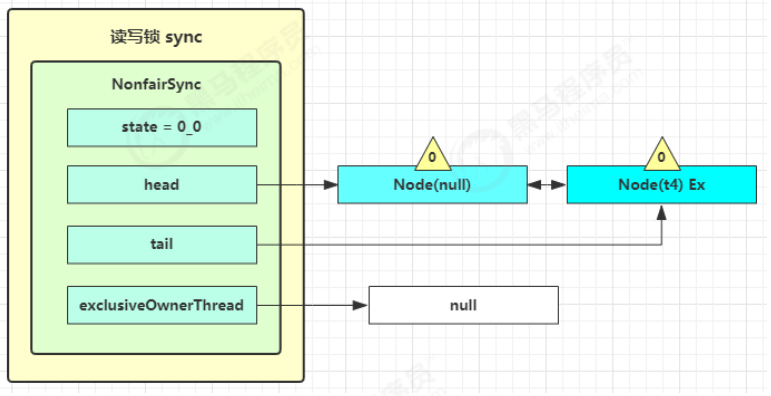

之后 t4 在 acquireQueued 中 parkAndCheckInterrupt 处恢复运行，再次 for (;;) 这次自己是老二，并且没有其他竞争，tryAcquire(1) 成功，修改头结点，流程结束


#### 2. 源码分析 

##### 写锁上锁流程

```java
static final class NonfairSync extends Sync {
    // ... 省略无关代码
    
    // 外部类 WriteLock 方法, 方便阅读, 放在此处
    public void lock() {
        sync.acquire(1);
    }
    
    // AQS 继承过来的方法, 方便阅读, 放在此处
    public final void acquire(int arg) {
        if (
            // 尝试获得写锁失败
            !tryAcquire(arg) &&
            // 将当前线程关联到一个 Node 对象上, 模式为独占模式
            // 进入 AQS 队列阻塞
            acquireQueued(addWaiter(Node.EXCLUSIVE), arg)
        ) {
            selfInterrupt();
        }
    }
    
    // Sync 继承过来的方法, 方便阅读, 放在此处
    protected final boolean tryAcquire(int acquires) {
        // 获得低 16 位, 代表写锁的 state 计数
        Thread current = Thread.currentThread();
        int c = getState();
        int w = exclusiveCount(c);
        
        if (c != 0) {
            if (
                // c != 0 and w == 0 表示有读锁, 或者
                w == 0 ||
                // 如果 exclusiveOwnerThread 不是自己
                current != getExclusiveOwnerThread()
            ) {
                // 获得锁失败
                return false;
            }
            // 写锁计数超过低 16 位, 报异常
            if (w + exclusiveCount(acquires) > MAX_COUNT)
                throw new Error("Maximum lock count exceeded");
            // 写锁重入, 获得锁成功
            setState(c + acquires);
            return true;
        } 
        if (
            // 判断写锁是否该阻塞, 或者
            writerShouldBlock() ||
            // 尝试更改计数失败
            !compareAndSetState(c, c + acquires)
        ) {
            // 获得锁失败
            return false;
        }
        // 获得锁成功
        setExclusiveOwnerThread(current);
        return true;
    }
    
    // 非公平锁 writerShouldBlock 总是返回 false, 无需阻塞
    final boolean writerShouldBlock() {
        return false;
    }
}
```

##### 写锁释放流程

```java
static final class NonfairSync extends Sync {
    // ... 省略无关代码
    
    // WriteLock 方法, 方便阅读, 放在此处
    public void unlock() {
        sync.release(1);
    }
    
    // AQS 继承过来的方法, 方便阅读, 放在此处
    public final boolean release(int arg) {
        // 尝试释放写锁成功
        if (tryRelease(arg)) {
            // unpark AQS 中等待的线程
            Node h = head;
            if (h != null && h.waitStatus != 0)
                unparkSuccessor(h);
            return true;
        }
        return false;
    }
    
    // Sync 继承过来的方法, 方便阅读, 放在此处
    protected final boolean tryRelease(int releases) {
        if (!isHeldExclusively())
            throw new IllegalMonitorStateException();
        int nextc = getState() - releases;
        // 因为可重入的原因, 写锁计数为 0, 才算释放成功
        boolean free = exclusiveCount(nextc) == 0;
        if (free) {
            setExclusiveOwnerThread(null);
        }
        setState(nextc);
        return free;
    }
}
```

##### 读锁上锁流程

```java
static final class NonfairSync extends Sync {
    
    // ReadLock 方法, 方便阅读, 放在此处
    public void lock() {
        sync.acquireShared(1);
    }
    
    // AQS 继承过来的方法, 方便阅读, 放在此处
    public final void acquireShared(int arg) {
        // tryAcquireShared 返回负数, 表示获取读锁失败
        if (tryAcquireShared(arg) < 0) {
            doAcquireShared(arg);
        }
    }
    
    // Sync 继承过来的方法, 方便阅读, 放在此处
    protected final int tryAcquireShared(int unused) {
        Thread current = Thread.currentThread();
        int c = getState();
        // 如果是其它线程持有写锁, 获取读锁失败
        if ( 
            exclusiveCount(c) != 0 &&
            getExclusiveOwnerThread() != current
        ) {
            return -1;
        }
        int r = sharedCount(c);
        if (
            // 读锁不该阻塞(如果老二是写锁，读锁该阻塞), 并且
            !readerShouldBlock() &&
            // 小于读锁计数, 并且
            r < MAX_COUNT &&
            // 尝试增加计数成功
            compareAndSetState(c, c + SHARED_UNIT)
        ) {
            // ... 省略不重要的代码
            return 1;
        }
        return fullTryAcquireShared(current);
    }
    
    // 非公平锁 readerShouldBlock 看 AQS 队列中第一个节点是否是写锁
    // true 则该阻塞, false 则不阻塞
    final boolean readerShouldBlock() {
        return apparentlyFirstQueuedIsExclusive();
    }
    
    // AQS 继承过来的方法, 方便阅读, 放在此处
    // 与 tryAcquireShared 功能类似, 但会不断尝试 for (;;) 获取读锁, 执行过程中无阻塞
    final int fullTryAcquireShared(Thread current) {
        HoldCounter rh = null;
        for (;;) {
            int c = getState();
            if (exclusiveCount(c) != 0) {
                if (getExclusiveOwnerThread() != current)
                    return -1;
            } else if (readerShouldBlock()) {
                // ... 省略不重要的代码
            }
            if (sharedCount(c) == MAX_COUNT)
                throw new Error("Maximum lock count exceeded");
            if (compareAndSetState(c, c + SHARED_UNIT)) {
                // ... 省略不重要的代码
                return 1;
            }
        }
    }
    
    // AQS 继承过来的方法, 方便阅读, 放在此处
    private void doAcquireShared(int arg) {
        // 将当前线程关联到一个 Node 对象上, 模式为共享模式
        final Node node = addWaiter(Node.SHARED);
        boolean failed = true;
        try {
            boolean interrupted = false;
            for (;;) {
                final Node p = node.predecessor();
                if (p == head) {
                    // 再一次尝试获取读锁
                    int r = tryAcquireShared(arg);
                    // 成功
                    if (r >= 0) {
                        // ㈠
                        // r 表示可用资源数, 在这里总是 1 允许传播
                        //（唤醒 AQS 中下一个 Share 节点）
                        setHeadAndPropagate(node, r);
                        p.next = null; // help GC
                        if (interrupted)
                            selfInterrupt();
                        failed = false;
                        return;
                    }
                }
                if (
                    // 是否在获取读锁失败时阻塞（前一个阶段 waitStatus == Node.SIGNAL）
                    shouldParkAfterFailedAcquire(p, node) &&
                    // park 当前线程
                    parkAndCheckInterrupt()
                ) {
                    interrupted = true;
                }
            }
        } finally {
            if (failed)
                cancelAcquire(node);
        }
    }
    
    // ㈠ AQS 继承过来的方法, 方便阅读, 放在此处
    private void setHeadAndPropagate(Node node, int propagate) {
        Node h = head; // Record old head for check below
        // 设置自己为 head
        setHead(node);
        
        // propagate 表示有共享资源（例如共享读锁或信号量）
        // 原 head waitStatus == Node.SIGNAL 或 Node.PROPAGATE
        // 现在 head waitStatus == Node.SIGNAL 或 Node.PROPAGATE
        if (propagate > 0 || h == null || h.waitStatus < 0 ||
            (h = head) == null || h.waitStatus < 0) {
            Node s = node.next;
            // 如果是最后一个节点或者是等待共享读锁的节点
            if (s == null || s.isShared()) {
                // 进入 ㈡
                doReleaseShared();
            }
        }
    }
    
    // ㈡ AQS 继承过来的方法, 方便阅读, 放在此处
    private void doReleaseShared() {
        // 如果 head.waitStatus == Node.SIGNAL ==> 0 成功, 下一个节点 unpark
        // 如果 head.waitStatus == 0 ==> Node.PROPAGATE, 为了解决 bug, 见后面分析
        for (;;) {
            Node h = head;
            // 队列还有节点
            if (h != null && h != tail) {
                int ws = h.waitStatus;
                if (ws == Node.SIGNAL) {
                    if (!compareAndSetWaitStatus(h, Node.SIGNAL, 0))
                        continue; // loop to recheck cases
                    // 下一个节点 unpark 如果成功获取读锁
                    // 并且下下个节点还是 shared, 继续 doReleaseShared
                    unparkSuccessor(h);
                }
                else if (ws == 0 &&
                         !compareAndSetWaitStatus(h, 0, Node.PROPAGATE))
                    continue; // loop on failed CAS
            }
            if (h == head) // loop if head changed
                break;
        }
    }
}
```

##### 读锁释放流程

```java
static final class NonfairSync extends Sync {
    
    // ReadLock 方法, 方便阅读, 放在此处
    public void unlock() {
        sync.releaseShared(1);
    }
    
    // AQS 继承过来的方法, 方便阅读, 放在此处
    public final boolean releaseShared(int arg) {
        if (tryReleaseShared(arg)) {
            doReleaseShared();
            return true;
        }
        return false;
    }
    
    // Sync 继承过来的方法, 方便阅读, 放在此处
    protected final boolean tryReleaseShared(int unused) {
        // ... 省略不重要的代码
        for (;;) {
            int c = getState();
            int nextc = c - SHARED_UNIT;
            if (compareAndSetState(c, nextc)) {
                // 读锁的计数不会影响其它获取读锁线程, 但会影响其它获取写锁线程
                // 计数为 0 才是真正释放
                return nextc == 0;
            }
        }
    }
    
    // AQS 继承过来的方法, 方便阅读, 放在此处
    private void doReleaseShared() {
        // 如果 head.waitStatus == Node.SIGNAL ==> 0 成功, 下一个节点 unpark
        // 如果 head.waitStatus == 0 ==> Node.PROPAGATE 
        for (;;) {
            Node h = head;
            if (h != null && h != tail) {
                int ws = h.waitStatus;
                // 如果有其它线程也在释放读锁，那么需要将 waitStatus 先改为 0
                // 防止 unparkSuccessor 被多次执行
                if (ws == Node.SIGNAL) {
                    if (!compareAndSetWaitStatus(h, Node.SIGNAL, 0))
                        continue; // loop to recheck cases
                    unparkSuccessor(h);
                }
                // 如果已经是 0 了，改为 -3，用来解决传播性，见后文信号量 bug 分析
                else if (ws == 0 &&
                         !compareAndSetWaitStatus(h, 0, Node.PROPAGATE))
                    continue; // loop on failed CAS
            }
            if (h == head) // loop if head changed
                break;
        }
    } 
}
```


## 3.2 StampedLock

### 使用读写锁时必须配合【戳】使用

该类自 JDK 8 加入，是为了进一步优化读性能，它的特点是在使用读锁、写锁时都必须配合【戳】使用加解读锁 

```java
long stamp = lock.readLock();
lock.unlockRead(stamp);
```

加解写锁

```java
long stamp = lock.writeLock();
lock.unlockWrite(stamp);
```


### 乐观读-锁升级

乐观读，StampedLock 支持 `tryOptimisticRead()` 方法（乐观读），读取完毕后需要做一次 `戳校验` 如果校验通过，表示这期间确实没有写操作，数据可以安全使用，如果校验没通过，需要重新获取读锁，保证数据安全。

```java
long stamp = lock.tryOptimisticRead();
// 验戳
if(!lock.validate(stamp)){
    // 锁升级
}
```


### 示例

提供一个 数据容器类 内部分别使用读锁保护数据的 `read()` 方法，写锁保护数据的 `write()` 方法

```java
class DataContainerStamped {
    
    private int data;
    private final StampedLock lock = new StampedLock();
    
    public DataContainerStamped(int data) {
        this.data = data;
    }
    
    public int read(int readTime) {
        long stamp = lock.tryOptimisticRead();
        log.debug("optimistic read locking...{}", stamp);
        sleep(readTime);
        if (lock.validate(stamp)) {
            log.debug("read finish...{}, data:{}", stamp, data);
            return data;
        }
        // 锁升级 - 读锁
        log.debug("updating to read lock... {}", stamp);
        try {
            stamp = lock.readLock();
            log.debug("read lock {}", stamp);
            sleep(readTime);
            log.debug("read finish...{}, data:{}", stamp, data);
            return data;
        } finally {
            log.debug("read unlock {}", stamp);
            lock.unlockRead(stamp);
        }
    }
    
    public void write(int newData) {
        long stamp = lock.writeLock();
        log.debug("write lock {}", stamp);
        try {
            sleep(2);
            this.data = newData;
        } finally {
            log.debug("write unlock {}", stamp);
            lock.unlockWrite(stamp);
        }
    }
    
}
```

测试 `读-读` 可以优化

```java
public static void main(String[] args) {
    DataContainerStamped dataContainer = new DataContainerStamped(1);
    new Thread(() -> {
        dataContainer.read(1);
    }, "t1").start();
    
    sleep(0.5);
    new Thread(() -> {
        dataContainer.read(0);
    }, "t2").start();
}
```

输出结果，可以看到实际没有加读锁

```java
15:58:50.217 c.DataContainerStamped [t1] - optimistic read locking...256 
15:58:50.717 c.DataContainerStamped [t2] - optimistic read locking...256 
15:58:50.717 c.DataContainerStamped [t2] - read finish...256, data:1 
15:58:51.220 c.DataContainerStamped [t1] - read finish...256, data:1
```

测试 `读-写` 时优化读补加读锁

```java
public static void main(String[] args) {
    DataContainerStamped dataContainer = new DataContainerStamped(1);
    
    new Thread(() -> {
        dataContainer.read(1);
    }, "t1").start();
    
    sleep(0.5);
    new Thread(() -> {
        dataContainer.write(100);
    }, "t2").start();
}
```

输出结果

```java
15:57:00.219 c.DataContainerStamped [t1] - optimistic read locking...256 
15:57:00.717 c.DataContainerStamped [t2] - write lock 384 
15:57:01.225 c.DataContainerStamped [t1] - updating to read lock... 256 
15:57:02.719 c.DataContainerStamped [t2] - write unlock 384 
15:57:02.719 c.DataContainerStamped [t1] - read lock 513 
15:57:03.719 c.DataContainerStamped [t1] - read finish...513, data:1000 
15:57:03.719 c.DataContainerStamped [t1] - read unlock 513
```

**注意** 

StampedLock 不支持条件变量 

StampedLock 不支持锁重入

# 4. Semaphore

## 基本使用

[ˈsɛməˌfɔr] 信号量，用来限制能同时访问共享资源的线程上限。

```java
public static void main(String[] args) {
    // 1. 创建 semaphore 对象
    Semaphore semaphore = new Semaphore(3);
    // 2. 10个线程同时运行
    for (int i = 0; i < 10; i++) {
        new Thread(() -> {
            // 3. 获取许可
            try {
                semaphore.acquire();
            } catch (InterruptedException e) {
                e.printStackTrace();
            }
            try {
                log.debug("running...");
                sleep(1);
                log.debug("end...");
            } finally {
                // 4. 释放许可
                semaphore.release();
            }
        }).start();
    }
 }
```

输出

```java
07:35:15.485 c.TestSemaphore [Thread-2] - running... 
07:35:15.485 c.TestSemaphore [Thread-1] - running... 
07:35:15.485 c.TestSemaphore [Thread-0] - running... 
07:35:16.490 c.TestSemaphore [Thread-2] - end... 
07:35:16.490 c.TestSemaphore [Thread-0] - end... 
07:35:16.490 c.TestSemaphore [Thread-1] - end... 
07:35:16.490 c.TestSemaphore [Thread-3] - running... 
07:35:16.490 c.TestSemaphore [Thread-5] - running... 
07:35:16.490 c.TestSemaphore [Thread-4] - running... 
07:35:17.490 c.TestSemaphore [Thread-5] - end... 
07:35:17.490 c.TestSemaphore [Thread-4] - end... 
07:35:17.490 c.TestSemaphore [Thread-3] - end... 
07:35:17.490 c.TestSemaphore [Thread-6] - running... 
07:35:17.490 c.TestSemaphore [Thread-7] - running... 
07:35:17.490 c.TestSemaphore [Thread-9] - running... 
07:35:18.491 c.TestSemaphore [Thread-6] - end... 
07:35:18.491 c.TestSemaphore [Thread-7] - end... 
07:35:18.491 c.TestSemaphore [Thread-9] - end... 
07:35:18.491 c.TestSemaphore [Thread-8] - running... 
07:35:19.492 c.TestSemaphore [Thread-8] - end...
```

## Semaphore 应用 (实现简单连接池)


- 使用 Semaphore 限流，在访问高峰期时，让请求线程阻塞，高峰期过去再释放许可，当然它只适合限制单机线程数量，并且仅是限制线程数，而不是限制资源数（例如连接数，请对比 Tomcat LimitLatch 的实现） 
- 用 Semaphore 实现简单连接池，对比『享元模式』下的实现（用wait notify），性能和可读性显然更好,注意下面的实现中线程数和数据库连接数是相等的

```java
@Slf4j(topic = "c.Pool")
class Pool {
    // 1. 连接池大小
    private final int poolSize;
    // 2. 连接对象数组
    private Connection[] connections;
    // 3. 连接状态数组 0 表示空闲， 1 表示繁忙
    private AtomicIntegerArray states;
    private Semaphore semaphore;
    // 4. 构造方法初始化
    public Pool(int poolSize) {
        this.poolSize = poolSize;
        // 让许可数与资源数一致
        this.semaphore = new Semaphore(poolSize);
        this.connections = new Connection[poolSize];
        this.states = new AtomicIntegerArray(new int[poolSize]);
        for (int i = 0; i < poolSize; i++) {
            connections[i] = new MockConnection("连接" + (i+1));
        }
    }
    // 5. 借连接
    public Connection borrow() {// t1, t2, t3
        // 获取许可
        try {
            semaphore.acquire(); // 没有许可的线程，在此等待
        } catch (InterruptedException e) {
            e.printStackTrace();
        }
        for (int i = 0; i < poolSize; i++) {
            // 获取空闲连接
            if(states.get(i) == 0) {
                if (states.compareAndSet(i, 0, 1)) {
                    log.debug("borrow {}", connections[i]);
                    return connections[i];
                }
            }
        }
        // 不会执行到这里
        return null;
    }
    // 6. 归还连接
    public void free(Connection conn) {
        for (int i = 0; i < poolSize; i++) {
            if (connections[i] == conn) {
                states.set(i, 0);
                log.debug("free {}", conn);
                semaphore.release();
                break;
            }
        }
    }
    
}
```


## Semaphore 原理


### 1. 加锁解锁流程 

Semaphore 有点像一个停车场，permits 就好像停车位数量，当线程获得了 permits 就像是获得了停车位，然后 停车场显示空余车位减一 


刚开始，permits（state）为 3，这时 5 个线程来获取资源


假设其中 Thread-1，Thread-2，Thread-4 cas 竞争成功，而 Thread-0 和 Thread-3 竞争失败，进入 AQS 队列 


park 阻塞

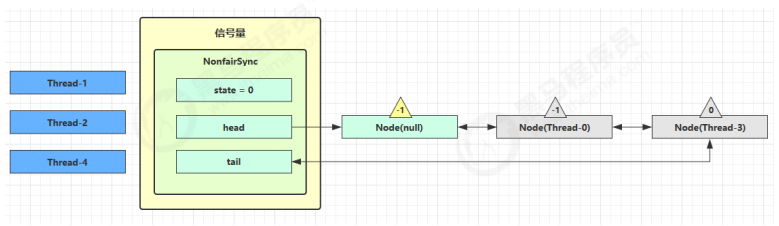

这时 Thread-4 释放了 permits，状态如下

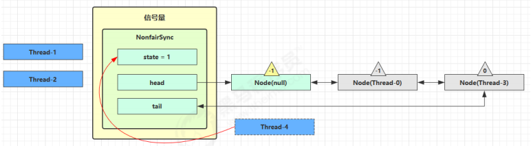

接下来 Thread-0 竞争成功，permits 再次设置为 0，设置自己为 head 节点，断开原来的 head 节点，unpark 接下来的 Thread-3 节点，但由于 permits 是 0，因此 Thread-3 在尝试不成功后再次进入 park 状态


### 2. 源码分析

```java
static final class NonfairSync extends Sync {
    private static final long serialVersionUID = -2694183684443567898L;
    NonfairSync(int permits) {
        // permits 即 state
        super(permits);
    }
    
    // Semaphore 方法, 方便阅读, 放在此处
    public void acquire() throws InterruptedException {
        sync.acquireSharedInterruptibly(1);
    }
    // AQS 继承过来的方法, 方便阅读, 放在此处
    public final void acquireSharedInterruptibly(int arg)
        throws InterruptedException {
        if (Thread.interrupted())
            throw new InterruptedException();
        if (tryAcquireShared(arg) < 0)
            doAcquireSharedInterruptibly(arg);
    }
    
    // 尝试获得共享锁
    protected int tryAcquireShared(int acquires) {
        return nonfairTryAcquireShared(acquires);
    }
    
    // Sync 继承过来的方法, 方便阅读, 放在此处
    final int nonfairTryAcquireShared(int acquires) {
        for (;;) {
            int available = getState();
            int remaining = available - acquires; 
            if (
                // 如果许可已经用完, 返回负数, 表示获取失败, 进入 doAcquireSharedInterruptibly
                remaining < 0 ||
                // 如果 cas 重试成功, 返回正数, 表示获取成功
                compareAndSetState(available, remaining)
            ) {
                return remaining;
            }
        }
    }
    
    // AQS 继承过来的方法, 方便阅读, 放在此处
    private void doAcquireSharedInterruptibly(int arg) throws InterruptedException {
        final Node node = addWaiter(Node.SHARED);
        boolean failed = true;
        try {
            for (;;) {
                final Node p = node.predecessor();
                if (p == head) {
                    // 再次尝试获取许可
                    int r = tryAcquireShared(arg);
                    if (r >= 0) {
                        // 成功后本线程出队（AQS）, 所在 Node设置为 head
                        // 如果 head.waitStatus == Node.SIGNAL ==> 0 成功, 下一个节点 unpark
                        // 如果 head.waitStatus == 0 ==> Node.PROPAGATE 
                        // r 表示可用资源数, 为 0 则不会继续传播
                        setHeadAndPropagate(node, r);
                        p.next = null; // help GC
                        failed = false;
                        return;
                    }
                }
                // 不成功, 设置上一个节点 waitStatus = Node.SIGNAL, 下轮进入 park 阻塞
                if (shouldParkAfterFailedAcquire(p, node) &&
                    parkAndCheckInterrupt())
                    throw new InterruptedException();
            }
        } finally {
            if (failed)
                cancelAcquire(node);
        }
    }
    
    // Semaphore 方法, 方便阅读, 放在此处
    public void release() {
        sync.releaseShared(1);
    }
    
    // AQS 继承过来的方法, 方便阅读, 放在此处
    public final boolean releaseShared(int arg) {
        if (tryReleaseShared(arg)) {
            doReleaseShared();
            return true;
        }
        return false;
    }
    
    // Sync 继承过来的方法, 方便阅读, 放在此处
    protected final boolean tryReleaseShared(int releases) {
        for (;;) {
            int current = getState();
            int next = current + releases;
            if (next < current) // overflow
                throw new Error("Maximum permit count exceeded");
            if (compareAndSetState(current, next))
                return true;
        }
    }
}
```


### 3. 为什么要有 PROPAGATE 

早期有 bug 

- releaseShared 方法

```java
public final boolean releaseShared(int arg) {
    if (tryReleaseShared(arg)) {
        Node h = head;
        if (h != null && h.waitStatus != 0)
            unparkSuccessor(h);
        return true;
    }
 return false; }
```

- doAcquireShared 方法

```java
private void doAcquireShared(int arg) {
    final Node node = addWaiter(Node.SHARED);
    boolean failed = true;
    try {
        boolean interrupted = false;
        for (;;) {
            final Node p = node.predecessor();
            if (p == head) {
                int r = tryAcquireShared(arg);
                if (r >= 0) {
                    // 这里会有空档
                    setHeadAndPropagate(node, r);
                    p.next = null; // help GC
                    if (interrupted)
                        selfInterrupt();
                    failed = false;
                    return;
                }
            }
            if (shouldParkAfterFailedAcquire(p, node) &&
                parkAndCheckInterrupt())
                interrupted = true;
        }
    } finally {
        if (failed)
            cancelAcquire(node);
    }
}
```

- setHeadAndPropagate 方法

```java
private void setHeadAndPropagate(Node node, int propagate) {
    setHead(node);
    // 有空闲资源
    if (propagate > 0 && node.waitStatus != 0) {
        Node s = node.next;
        // 下一个
        if (s == null || s.isShared())
            unparkSuccessor(node);
    }
}
```

- 假设存在某次循环中队列里排队的结点情况为`head(-1)->t1(-1)->t2(-1)` 
- 假设存在将要信号量释放的 T3 和 T4，释放顺序为先 T3 后 T4


#### 正常流程


#### 产生bug的情况

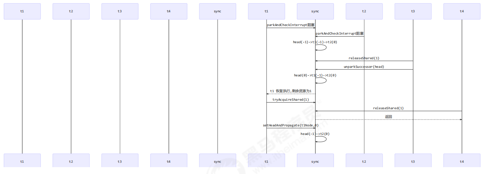

修复前版本执行流程 

- \1. T3 调用 releaseShared(1)，直接调用了 unparkSuccessor(head)，head 的等待状态从 -1 变为 0 
- \2. T1 由于 T3 释放信号量被唤醒，调用 tryAcquireShared，假设返回值为 0（获取锁成功，但没有剩余资源 量） 
- \3. T4 调用 releaseShared(1)，此时 head.waitStatus 为 0（此时读到的 head 和 1 中为同一个head），不满足条件，因此不调用 unparkSuccessor(head) 
- \4. T1 获取信号量成功，调用 setHeadAndPropagate 时，因为不满足 propagate > 0（2 的返回值也就是propagate（剩余资源量） == 0），从而不会唤醒后继结点， T2 线程得不到唤醒


#### bug 修复后

```java
private void setHeadAndPropagate(Node node, int propagate) {
    Node h = head; // Record old head for check below
    // 设置自己为 head
    setHead(node);
    // propagate 表示有共享资源（例如共享读锁或信号量）
    // 原 head waitStatus == Node.SIGNAL 或 Node.PROPAGATE
    // 现在 head waitStatus == Node.SIGNAL 或 Node.PROPAGATE
    if (propagate > 0 || h == null || h.waitStatus < 0 ||
        (h = head) == null || h.waitStatus < 0) {
        Node s = node.next;
        // 如果是最后一个节点或者是等待共享读锁的节点
        if (s == null || s.isShared()) {
            doReleaseShared();
        }
    }
}

private void doReleaseShared() {
    // 如果 head.waitStatus == Node.SIGNAL ==> 0 成功, 下一个节点 unpark
    // 如果 head.waitStatus == 0 ==> Node.PROPAGATE 
    for (;;) {
        Node h = head;
        if (h != null && h != tail) {
            int ws = h.waitStatus;
            if (ws == Node.SIGNAL) {
                if (!compareAndSetWaitStatus(h, Node.SIGNAL, 0))
                    continue; // loop to recheck cases
                unparkSuccessor(h);
            }
            else if (ws == 0 &&
                     !compareAndSetWaitStatus(h, 0, Node.PROPAGATE))
                continue; // loop on failed CAS
        }
        if (h == head) // loop if head changed
            break;
    }
}
```


- \1. T3 调用 releaseShared()，直接调用了 unparkSuccessor(head)，head 的等待状态从 -1 变为 0 
- \2. T1 由于 T3 释放信号量被唤醒，调用 tryAcquireShared，假设返回值为 0（获取锁成功，但没有剩余资源量） 
- \3. T4 调用 releaseShared()，此时 head.waitStatus 为 0（此时读到的 head 和 1 中为同一个 head），调用 doReleaseShared() 将等待状态置为 **PROPAGATE（-3）** 
- \4. T1 获取信号量成功，调用 setHeadAndPropagate 时，读到 h.waitStatus < 0，从而调用 doReleaseShared() 唤醒 T2

# 5. CountdownLatch 

用来进行线程同步协作，等待所有线程完成倒计时。 

其中构造参数用来初始化等待计数值，await() 用来等待计数归零，countDown() 用来让计数减一


## 示例1

```java
public static void main(String[] args) throws InterruptedException {
    CountDownLatch latch = new CountDownLatch(3);
    
    new Thread(() -> {
        log.debug("begin...");
        sleep(1);
        latch.countDown();
        log.debug("end...{}", latch.getCount());
    }).start();
    
    new Thread(() -> {
        log.debug("begin...");
        sleep(2);
        latch.countDown();
        log.debug("end...{}", latch.getCount());
    }).start();
    
    new Thread(() -> {
        log.debug("begin...");
        sleep(1.5);
        latch.countDown();
        log.debug("end...{}", latch.getCount());
    }).start();
    
    log.debug("waiting...");
    latch.await();
    log.debug("wait end...");
}
```

输出

```java
18:44:00.778 c.TestCountDownLatch [main] - waiting... 
18:44:00.778 c.TestCountDownLatch [Thread-2] - begin... 
18:44:00.778 c.TestCountDownLatch [Thread-0] - begin... 
18:44:00.778 c.TestCountDownLatch [Thread-1] - begin... 
18:44:01.782 c.TestCountDownLatch [Thread-0] - end...2 
18:44:02.283 c.TestCountDownLatch [Thread-2] - end...1 
18:44:02.782 c.TestCountDownLatch [Thread-1] - end...0 
18:44:02.782 c.TestCountDownLatch [main] - wait end...
```

可以配合线程池使用，改进如下

```java
public static void main(String[] args) throws InterruptedException {
    CountDownLatch latch = new CountDownLatch(3);
    ExecutorService service = Executors.newFixedThreadPool(4);
    
    service.submit(() -> {
        log.debug("begin...");
        sleep(1);
        latch.countDown();
        log.debug("end...{}", latch.getCount());
    });
    
    service.submit(() -> {
        log.debug("begin...");
        sleep(1.5);
        latch.countDown();
        log.debug("end...{}", latch.getCount());
    });
    
    service.submit(() -> {
        log.debug("begin...");
        sleep(2);
        latch.countDown();
        log.debug("end...{}", latch.getCount());
    });
    
    service.submit(()->{
        try {
            log.debug("waiting...");
            latch.await();
            log.debug("wait end...");
        } catch (InterruptedException e) {
            e.printStackTrace();
        }
    });
    
}
```

输出

```java
18:52:25.831 c.TestCountDownLatch [pool-1-thread-3] - begin... 
18:52:25.831 c.TestCountDownLatch [pool-1-thread-1] - begin... 
18:52:25.831 c.TestCountDownLatch [pool-1-thread-2] - begin... 
18:52:25.831 c.TestCountDownLatch [pool-1-thread-4] - waiting... 
18:52:26.835 c.TestCountDownLatch [pool-1-thread-1] - end...2 
18:52:27.335 c.TestCountDownLatch [pool-1-thread-2] - end...1 
18:52:27.835 c.TestCountDownLatch [pool-1-thread-3] - end...0 
18:52:27.835 c.TestCountDownLatch [pool-1-thread-4] - wait end...
```


## * 应用之同步等待多线程准备完毕


```java
AtomicInteger num = new AtomicInteger(0);

ExecutorService service = Executors.newFixedThreadPool(10, (r) -> {
    return new Thread(r, "t" + num.getAndIncrement());
});

CountDownLatch latch = new CountDownLatch(10);

String[] all = new String[10];
Random r = new Random();
for (int j = 0; j < 10; j++) {
    int x = j;
    service.submit(() -> {
        for (int i = 0; i <= 100; i++) {
            try {
                Thread.sleep(r.nextInt(100));
            } catch (InterruptedException e) {
            }
            all[x] = Thread.currentThread().getName() + "(" + (i + "%") + ")";
            System.out.print("\r" + Arrays.toString(all));
        }
        latch.countDown();
    });
}

latch.await();
System.out.println("\n游戏开始...");
service.shutdown();
```

中间输出

```
[t0(52%), t1(47%), t2(51%), t3(40%), t4(49%), t5(44%), t6(49%), t7(52%), t8(46%), t9(46%)] 
```

最后输出

```
[t0(100%), t1(100%), t2(100%), t3(100%), t4(100%), t5(100%), t6(100%), t7(100%), t8(100%), t9(100%)] 
游戏开始... 
```


## * 应用之同步等待多个远程调用结束


```java
@RestController
public class TestCountDownlatchController {
    @GetMapping("/order/{id}")
    public Map<String, Object> order(@PathVariable int id) {
        HashMap<String, Object> map = new HashMap<>();
        map.put("id", id);
        map.put("total", "2300.00");
        sleep(2000);
        return map;
    }
    
    @GetMapping("/product/{id}")
    public Map<String, Object> product(@PathVariable int id) {
        HashMap<String, Object> map = new HashMap<>();
        if (id == 1) {
            map.put("name", "小爱音箱");
            map.put("price", 300);
        } else if (id == 2) {
            map.put("name", "小米手机");
            map.put("price", 2000);
        }
        map.put("id", id);
        sleep(1000);
        return map;
    }
    
    @GetMapping("/logistics/{id}")
    public Map<String, Object> logistics(@PathVariable int id) {
        HashMap<String, Object> map = new HashMap<>();
        map.put("id", id);
        map.put("name", "中通快递");
        sleep(2500);
        return map;
    }
    
    private void sleep(int millis) {
        try {
            Thread.sleep(millis);
        } catch (InterruptedException e) {
            e.printStackTrace();
        }
    }
}
```

rest 远程调用

```java
RestTemplate restTemplate = new RestTemplate();
log.debug("begin");
ExecutorService service = Executors.newCachedThreadPool();
CountDownLatch latch = new CountDownLatch(4);
Future<Map<String,Object>> f1 = service.submit(() -> {
    Map<String, Object> r =
        restTemplate.getForObject("http://localhost:8080/order/{1}", Map.class, 1);
    return r;
});
Future<Map<String, Object>> f2 = service.submit(() -> {
    Map<String, Object> r =
        restTemplate.getForObject("http://localhost:8080/product/{1}", Map.class, 1);
    return r;
});
Future<Map<String, Object>> f3 = service.submit(() -> {
    Map<String, Object> r =
        restTemplate.getForObject("http://localhost:8080/product/{1}", Map.class, 2);
    return r;
});
Future<Map<String, Object>> f4 = service.submit(() -> {
    Map<String, Object> r =
        restTemplate.getForObject("http://localhost:8080/logistics/{1}", Map.class, 1);
    return r;
});
System.out.println(f1.get());
System.out.println(f2.get());
System.out.println(f3.get());
System.out.println(f4.get());
log.debug("执行完毕");
service.shutdown();
```

执行结果

```java
19:51:39.711 c.TestCountDownLatch [main] - begin 
{total=2300.00, id=1} 
{price=300, name=小爱音箱, id=1} 
{price=2000, name=小米手机, id=2} 
{name=中通快递, id=1} 
19:51:42.407 c.TestCountDownLatch [main] - 执行完毕
```

# 6. CyclicBarrier

[ˈsaɪklɪk ˈbæriɚ] 循环栅栏，用来进行线程协作，等待线程满足某个计数。构造时设置『计数个数』，每个线程执行到某个需要“同步”的时刻调用 await() 方法进行等待，当等待的线程数满足『计数个数』时，继续执行.

```java
CyclicBarrier cb = new CyclicBarrier(2); // 个数为2时才会继续执行

new Thread(()->{
    System.out.println("线程1开始.."+new Date());
    try {
        cb.await(); // 当个数不足时，等待
    } catch (InterruptedException | BrokenBarrierException e) {
        e.printStackTrace();
    }
    System.out.println("线程1继续向下运行..."+new Date());
}).start();

new Thread(()->{
    System.out.println("线程2开始.."+new Date());
    try { 
        Thread.sleep(2000); 
    } catch (InterruptedException e) {
    }
    try {
        cb.await(); // 2 秒后，线程个数够2，继续运行
    } catch (InterruptedException | BrokenBarrierException e) {
        e.printStackTrace();
    }
    System.out.println("线程2继续向下运行..."+new Date());
}).start();
```


**注意** CyclicBarrier 与 CountDownLatch 的主要区别在于 CyclicBarrier 是可以重用的 CyclicBarrier 可以被比喻为『人满发车』

# 7. 线程安全集合类概述

JUC集合类


线程安全集合类可以分为三大类： 

## 遗留的线程安全集合

- 遗留的线程安全集合如 Hashtable ， Vector 


## 使用 Collections 装饰的线程安全集合

- 使用 Collections 装饰的线程安全集合，如： 

- - Collections.synchronizedCollection 
  - Collections.synchronizedList 
  - Collections.synchronizedMap 
  - Collections.synchronizedSet 
  - Collections.synchronizedNavigableMap 
  - Collections.synchronizedNavigableSet
  - Collections.synchronizedSortedMap 
  - Collections.synchronizedSortedSet 

- java.util.concurrent.* 


## JUC下的安全集合: Blocking、CopyOnWrite、Concurrent 

重点介绍 java.util.concurrent.* 下的线程安全集合类，可以发现它们有规律，里面包含三类关键词： `Blocking、CopyOnWrite、Concurrent `

- Blocking 大部分实现基于锁，并提供用来阻塞的方法 
- CopyOnWrite 之类容器修改开销相对较重 
- Concurrent 类型的容器 

- - 内部很多操作使用 cas 优化，一般可以提供较高吞吐量 
  - 弱一致性 

- - - 遍历时弱一致性，例如，当利用迭代器遍历时，如果容器发生修改，迭代器仍然可以继续进行遍历，这时内容是旧的 
    - 求大小弱一致性，size 操作未必是 100% 准确 
    - 读取弱一致性 


遍历时如果发生了修改，对于非安全容器来讲，使用 **fail-fast** 机制也就是让遍历立刻失败，抛出ConcurrentModifificationException，不再继续遍历

# 8. ConcurrentHashMap

# 练习：单词计数 

生成测试数据

```java
static final String ALPHA = "abcedfghijklmnopqrstuvwxyz";

public static void main(String[] args) {
    int length = ALPHA.length();
    int count = 200;
    List<String> list = new ArrayList<>(length * count);
    
    for (int i = 0; i < length; i++) {
        char ch = ALPHA.charAt(i);
        for (int j = 0; j < count; j++) {
            list.add(String.valueOf(ch));
        }
    }
    
    Collections.shuffle(list);
    
    for (int i = 0; i < 26; i++) {
        try (PrintWriter out = new PrintWriter(
            new OutputStreamWriter(
                new FileOutputStream("tmp/" + (i+1) + ".txt")))) {
            String collect = list.subList(i * count, (i + 1) * count).stream()
                .collect(Collectors.joining("\n"));
            out.print(collect);
        } catch (IOException e) {
        }
    }
    
}
```

模版代码，模版代码中封装了多线程读取文件的代码

```java
private static <V> void demo(Supplier<Map<String,V>> supplier, 
                             BiConsumer<Map<String,V>,List<String>> consumer) {
    Map<String, V> counterMap = supplier.get();
    List<Thread> ts = new ArrayList<>();
    
    for (int i = 1; i <= 26; i++) {
        int idx = i;
        Thread thread = new Thread(() -> {
            List<String> words = readFromFile(idx);
            consumer.accept(counterMap, words);
        });
        ts.add(thread);
    }
    ts.forEach(t->t.start());
    
    ts.forEach(t-> {
        try {
            t.join();
        } catch (InterruptedException e) {
            e.printStackTrace();
        }
    });
    System.out.println(counterMap);
}

public static List<String> readFromFile(int i) {
    ArrayList<String> words = new ArrayList<>();
    try (BufferedReader in = new BufferedReader(new InputStreamReader(
        new FileInputStream("tmp/"+ i +".txt")))) {
        while(true) {
            String word = in.readLine();
            if(word == null) {
                break;
            }
            words.add(word);
        }
        return words;
    } catch (IOException e) {
        throw new RuntimeException(e);
    }
}
```

你要做的是实现两个参数 

- 一是提供一个 map 集合，用来存放每个单词的计数结果，key 为单词，value 为计数 
- 二是提供一组操作，保证计数的安全性，会传递 map 集合以及 单词 List 


正确结果输出应该是每个单词出现 200 次

```
{a=200, b=200, c=200, d=200, e=200, f=200, g=200, h=200, i=200, j=200, k=200, l=200, m=200, n=200, o=200, p=200, q=200, r=200, s=200, t=200, u=200, v=200, w=200, x=200, y=200, z=200} 
```


## 下面的实现为：

```java
demo(
    // 创建 map 集合
    // 创建 ConcurrentHashMap 对不对？
    () -> new HashMap<String, Integer>(),
    // 进行计数
    (map, words) -> {
        for (String word : words) {
            //这里的getter和setter无法保证原子性
            Integer counter = map.get(word);
            int newValue = counter == null ? 1 : counter + 1;
            map.put(word, newValue);
        }
    }
);
```

有没有问题？请改进

## 参考解答1

```java
demo(
    () -> new ConcurrentHashMap<String, LongAdder>(),
    (map, words) -> {
        for (String word : words) {
            // 注意不能使用 putIfAbsent，此方法返回的是上一次的 value，首次调用返回 null
            map.computeIfAbsent(word, (key) -> new LongAdder()).increment();
        }
    }
);
```

## 参考解答2

```java
demo(
    () -> new ConcurrentHashMap<String, Integer>(),
    (map, words) -> {
        for (String word : words) {
            // 函数式编程，无需原子变量
            map.merge(word, 1, Integer::sum);
        }
    }
);
```

# ConcurrentHashMap

## 练习：单词计数 

生成测试数据

```java
static final String ALPHA = "abcedfghijklmnopqrstuvwxyz";

public static void main(String[] args) {
    int length = ALPHA.length();
    int count = 200;
    List<String> list = new ArrayList<>(length * count);
    
    for (int i = 0; i < length; i++) {
        char ch = ALPHA.charAt(i);
        for (int j = 0; j < count; j++) {
            list.add(String.valueOf(ch));
        }
    }
    
    Collections.shuffle(list);
    
    for (int i = 0; i < 26; i++) {
        try (PrintWriter out = new PrintWriter(
            new OutputStreamWriter(
                new FileOutputStream("tmp/" + (i+1) + ".txt")))) {
            String collect = list.subList(i * count, (i + 1) * count).stream()
                .collect(Collectors.joining("\n"));
            out.print(collect);
        } catch (IOException e) {
        }
    }
    
}
```

模版代码，模版代码中封装了多线程读取文件的代码

```java
private static <V> void demo(Supplier<Map<String,V>> supplier, 
                             BiConsumer<Map<String,V>,List<String>> consumer) {
    Map<String, V> counterMap = supplier.get();
    List<Thread> ts = new ArrayList<>();
    
    for (int i = 1; i <= 26; i++) {
        int idx = i;
        Thread thread = new Thread(() -> {
            List<String> words = readFromFile(idx);
            consumer.accept(counterMap, words);
        });
        ts.add(thread);
    }
    ts.forEach(t->t.start());
    
    ts.forEach(t-> {
        try {
            t.join();
        } catch (InterruptedException e) {
            e.printStackTrace();
        }
    });
    System.out.println(counterMap);
}

public static List<String> readFromFile(int i) {
    ArrayList<String> words = new ArrayList<>();
    try (BufferedReader in = new BufferedReader(new InputStreamReader(
        new FileInputStream("tmp/"+ i +".txt")))) {
        while(true) {
            String word = in.readLine();
            if(word == null) {
                break;
            }
            words.add(word);
        }
        return words;
    } catch (IOException e) {
        throw new RuntimeException(e);
    }
}
```

你要做的是实现两个参数 

- 一是提供一个 map 集合，用来存放每个单词的计数结果，key 为单词，value 为计数 
- 二是提供一组操作，保证计数的安全性，会传递 map 集合以及 单词 List 


正确结果输出应该是每个单词出现 200 次

```
{a=200, b=200, c=200, d=200, e=200, f=200, g=200, h=200, i=200, j=200, k=200, l=200, m=200, n=200, o=200, p=200, q=200, r=200, s=200, t=200, u=200, v=200, w=200, x=200, y=200, z=200} 
```


## 下面的实现为：

```java
demo(
    // 创建 map 集合
    // 创建 ConcurrentHashMap 对不对？
    () -> new HashMap<String, Integer>(),
    // 进行计数
    (map, words) -> {
        for (String word : words) {
            //这里的getter和setter无法保证原子性
            Integer counter = map.get(word);
            int newValue = counter == null ? 1 : counter + 1;
            map.put(word, newValue);
        }
    }
);
```

有没有问题？请改进

## 参考解答1

```java
demo(
    () -> new ConcurrentHashMap<String, LongAdder>(),
    (map, words) -> {
        for (String word : words) {
            // 注意不能使用 putIfAbsent，此方法返回的是上一次的 value，首次调用返回 null
            map.computeIfAbsent(word, (key) -> new LongAdder()).increment();
        }
    }
);
```

## 参考解答2

```java
demo(
    () -> new ConcurrentHashMap<String, Integer>(),
    (map, words) -> {
        for (String word : words) {
            // 函数式编程，无需原子变量
            map.merge(word, 1, Integer::sum);
        }
    }
);
```


# * ConcurrentHashMap 原理

## 1. JDK 7 HashMap 并发死链 


### 测试代码 

注意 

- 要在 JDK 7 下运行，否则扩容机制和 hash 的计算方法都变了
- 以下测试代码是精心准备的，不要随便改动

```java
public static void main(String[] args) {
    // 测试 java 7 中哪些数字的 hash 结果相等
    System.out.println("长度为16时，桶下标为1的key");
    for (int i = 0; i < 64; i++) {
        if (hash(i) % 16 == 1) {
            System.out.println(i);
        }
    }
    System.out.println("长度为32时，桶下标为1的key");
    for (int i = 0; i < 64; i++) {
        if (hash(i) % 32 == 1) {
            System.out.println(i);
        }
    }
    // 1, 35, 16, 50 当大小为16时，它们在一个桶内
    final HashMap<Integer, Integer> map = new HashMap<Integer, Integer>();
    // 放 12 个元素
    map.put(2, null);
    map.put(3, null);
    map.put(4, null);
    map.put(5, null);
    map.put(6, null);
    map.put(7, null);
    map.put(8, null);
    map.put(9, null);
    map.put(10, null);
    map.put(16, null);
    map.put(35, null);
    map.put(1, null);
    System.out.println("扩容前大小[main]:"+map.size());
    new Thread() {
        @Override
        public void run() {
            // 放第 13 个元素, 发生扩容
            map.put(50, null);
            System.out.println("扩容后大小[Thread-0]:"+map.size());
        }
    }.start();
    new Thread() {
        @Override
        public void run() {
            // 放第 13 个元素, 发生扩容
            map.put(50, null);
            System.out.println("扩容后大小[Thread-1]:"+map.size());
        }
    }.start();
}
final static int hash(Object k) {
    int h = 0;
    if (0 != h && k instanceof String) {
        return sun.misc.Hashing.stringHash32((String) k);
    }
    h ^= k.hashCode();
    h ^= (h >>> 20) ^ (h >>> 12);
    return h ^ (h >>> 7) ^ (h >>> 4);
}
```

### 死链复现 

调试工具使用 idea 

在 HashMap 源码 590 行加断点

```
int newCapacity = newTable.length;
```

断点的条件如下，目的是让 HashMap 在扩容为 32 时，并且线程为 Thread-0 或 Thread-1 时停下来

```java
newTable.length==32 &&
 (
    Thread.currentThread().getName().equals("Thread-0")||
    Thread.currentThread().getName().equals("Thread-1")
 )
```

断点暂停方式选择 Thread，否则在调试 Thread-0 时，Thread-1 无法恢复运行 

运行代码，程序在预料的断点位置停了下来，输出

```java
长度为16时，桶下标为1的key 
1 
16 
35 
50 
长度为32时，桶下标为1的key 
1 
35 
扩容前大小[main]:12
```

接下来进入扩容流程调试 

在 HashMap 源码 594 行加断点

```java
Entry<K,V> next = e.next; // 593
if (rehash) // 594
// ...
```

这是为了观察 e 节点和 next 节点的状态，Thread-0 单步执行到 594 行，再 594 处再添加一个断点（条件Thread.currentThread().getName().equals("Thread-0")） 


这时可以在 Variables 面板观察到 e 和 next 变量，使用 `view as -> Object` 查看节点状态

```java
e       (1)->(35)->(16)->null 
next    (35)->(16)->null
```

在 Threads 面板选中 Thread-1 恢复运行，可以看到控制台输出新的内容如下，Thread-1 扩容已完成

```
newTable[1] (35)->(1)->null 
扩容后大小:13 
```

这时 Thread-0 还停在 594 处， Variables 面板变量的状态已经变化为

```java
e         (1)->null 
next      (35)->(1)->null
```

为什么呢，因为 Thread-1 扩容时链表也是后加入的元素放入链表头，因此链表就倒过来了，但 Thread-1 虽然结果正确，但它结束后 Thread-0 还要继续运行 

接下来就可以单步调试（F8）观察死链的产生了 

下一轮循环到 594，将 e 搬迁到 newTable 链表头

```java
newTable[1]          (1)->null 
e                    (35)->(1)->null 
next                 (1)->null
```

下一轮循环到 594，将 e 搬迁到 newTable 链表头

```java
newTable[1]          (35)->(1)->null 
e                     (1)->null 
next                  null
```

再看看源码

```java
e.next = newTable[1];
// 这时 e (1,35)
// 而 newTable[1] (35,1)->(1,35) 因为是同一个对象

newTable[1] = e; 
// 再尝试将 e 作为链表头, 死链已成

e = next;
// 虽然 next 是 null, 会进入下一个链表的复制, 但死链已经形成了
```

### 源码分析 

HashMap 的并发死链发生在扩容时

```java
// 将 table 迁移至 newTable
void transfer(Entry[] newTable, boolean rehash) { 
    int newCapacity = newTable.length;
    for (Entry<K,V> e : table) {
        while(null != e) {
            Entry<K,V> next = e.next;
            // 1 处
            if (rehash) {
                e.hash = null == e.key ? 0 : hash(e.key);
            }
            int i = indexFor(e.hash, newCapacity);
            // 2 处
            // 将新元素加入 newTable[i], 原 newTable[i] 作为新元素的 next
            e.next = newTable[i];
            newTable[i] = e;
            e = next;
        }
    }
}
```

假设 map 中初始元素是

```java
原始链表，格式：[下标] (key,next) 
[1] (1,35)->(35,16)->(16,null)

线程 a 执行到 1 处 ，此时局部变量 e 为 (1,35)，而局部变量 next 为 (35,16) 线程 a 挂起

线程 b 开始执行
第一次循环
[1] (1,null)

第二次循环
[1] (35,1)->(1,null)

第三次循环
[1] (35,1)->(1,null) 
[17] (16,null)

切换回线程 a，此时局部变量 e 和 next 被恢复，引用没变但内容变了：e 的内容被改为 (1,null)，而 next 的内
容被改为 (35,1) 并链向 (1,null)
第一次循环
[1] (1,null)

第二次循环，注意这时 e 是 (35,1) 并链向 (1,null) 所以 next 又是 (1,null) 
[1] (35,1)->(1,null)

第三次循环，e 是 (1,null)，而 next 是 null，但 e 被放入链表头，这样 e.next 变成了 35 （2 处）
[1] (1,35)->(35,1)->(1,35)

已经是死链了
```

### 小结

- 究其原因，是因为在多线程环境下使用了非线程安全的 map 集合 
- JDK 8 虽然将扩容算法做了调整，不再将元素加入链表头（而是保持与扩容前一样的顺序），但仍不意味着能够在多线程环境下能够安全扩容，还会出现其它问题（如扩容丢数据）


## 2. JDK 8 ConcurrentHashMap 

### 重要属性和内部类

```java
// 默认为 0
// 当初始化时, 为 -1
// 当扩容时, 为 -(1 + 扩容线程数)
// 当初始化或扩容完成后，为 下一次的扩容的阈值大小
private transient volatile int sizeCtl;

// 整个 ConcurrentHashMap 就是一个 Node[]
static class Node<K,V> implements Map.Entry<K,V> {}

// hash 表
transient volatile Node<K,V>[] table;

// 扩容时的 新 hash 表
private transient volatile Node<K,V>[] nextTable;

// 扩容时如果某个 bin 迁移完毕, 用 ForwardingNode 作为旧 table bin 的头结点
static final class ForwardingNode<K,V> extends Node<K,V> {}

// 用在 compute 以及 computeIfAbsent 时, 用来占位, 计算完成后替换为普通 Node
static final class ReservationNode<K,V> extends Node<K,V> {}

// 作为 treebin 的头节点, 存储 root 和 first
static final class TreeBin<K,V> extends Node<K,V> {}

// 作为 treebin 的节点, 存储 parent, left, right
static final class TreeNode<K,V> extends Node<K,V> {}
```

### 重要方法

```java
// 获取 Node[] 中第 i 个 Node
static final <K,V> Node<K,V> tabAt(Node<K,V>[] tab, int i)
 
// cas 修改 Node[] 中第 i 个 Node 的值, c 为旧值, v 为新值
static final <K,V> boolean casTabAt(Node<K,V>[] tab, int i, Node<K,V> c, Node<K,V> v)
 
// 直接修改 Node[] 中第 i 个 Node 的值, v 为新值
static final <K,V> void setTabAt(Node<K,V>[] tab, int i, Node<K,V> v)
```

### 构造器分析 

可以看到实现了**懒惰初始化**，在构造方法中仅仅计算了 table 的大小，以后在第一次使用时才会真正创建

```java
public ConcurrentHashMap(int initialCapacity, float loadFactor, int concurrencyLevel) {
    if (!(loadFactor > 0.0f) || initialCapacity < 0 || concurrencyLevel <= 0)
        throw new IllegalArgumentException();
    if (initialCapacity < concurrencyLevel) // Use at least as many bins
        initialCapacity = concurrencyLevel; // as estimated threads
    long size = (long)(1.0 + (long)initialCapacity / loadFactor);
    // tableSizeFor 仍然是保证计算的大小是 2^n, 即 16,32,64 ... 
    int cap = (size >= (long)MAXIMUM_CAPACITY) ?
        MAXIMUM_CAPACITY : tableSizeFor((int)size);
    this.sizeCtl = cap; 
}
```

### get 流程

```java
public V get(Object key) {
    Node<K,V>[] tab; Node<K,V> e, p; int n, eh; K ek;
    // spread 方法能确保返回结果是正数
    int h = spread(key.hashCode());
    if ((tab = table) != null && (n = tab.length) > 0 &&
        (e = tabAt(tab, (n - 1) & h)) != null) {
        // 如果头结点已经是要查找的 key
        if ((eh = e.hash) == h) {
            if ((ek = e.key) == key || (ek != null && key.equals(ek)))
                return e.val;
        }
        // hash 为负数表示该 bin 在扩容中或是 treebin, 这时调用 find 方法来查找
        else if (eh < 0)
            return (p = e.find(h, key)) != null ? p.val : null;
        // 正常遍历链表, 用 equals 比较
        while ((e = e.next) != null) {
            if (e.hash == h &&
                ((ek = e.key) == key || (ek != null && key.equals(ek))))
                return e.val;
        }
    }
    return null;
}
```

### put 流程 

以下数组简称（table），链表简称（bin）

```java
public V put(K key, V value) {
    return putVal(key, value, false);
}

final V putVal(K key, V value, boolean onlyIfAbsent) {
    if (key == null || value == null) throw new NullPointerException();
    // 其中 spread 方法会综合高位低位, 具有更好的 hash 性
    int hash = spread(key.hashCode());
    int binCount = 0;
    for (Node<K,V>[] tab = table;;) {
        // f 是链表头节点
        // fh 是链表头结点的 hash
        // i 是链表在 table 中的下标
        Node<K,V> f; int n, i, fh;
        // 要创建 table
        if (tab == null || (n = tab.length) == 0)
            // 初始化 table 使用了 cas, 无需 synchronized 创建成功, 进入下一轮循环
            tab = initTable();
        // 要创建链表头节点
        else if ((f = tabAt(tab, i = (n - 1) & hash)) == null) {
            // 添加链表头使用了 cas, 无需 synchronized
            if (casTabAt(tab, i, null,
                         new Node<K,V>(hash, key, value, null)))
                break;
        }
        // 帮忙扩容
        else if ((fh = f.hash) == MOVED)
            // 帮忙之后, 进入下一轮循环
            tab = helpTransfer(tab, f);
        else {
            V oldVal = null;
            // 锁住链表头节点
            synchronized (f) {
                // 再次确认链表头节点没有被移动
                if (tabAt(tab, i) == f) {
                    // 链表
                    if (fh >= 0) {
                        binCount = 1;
                        // 遍历链表
                        for (Node<K,V> e = f;; ++binCount) {
                            K ek;
                            // 找到相同的 key
                            if (e.hash == hash &&
                                ((ek = e.key) == key ||
                                 (ek != null && key.equals(ek)))) {
                                oldVal = e.val;
                                // 更新
                                if (!onlyIfAbsent)
                                    e.val = value;
                                break;
                            }
                            Node<K,V> pred = e;
                            // 已经是最后的节点了, 新增 Node, 追加至链表尾
                            if ((e = e.next) == null) {
                                pred.next = new Node<K,V>(hash, key,
                                                          value, null);
                                break;
                            }
                        }
                    }
                    // 红黑树
                    else if (f instanceof TreeBin) {
                        Node<K,V> p;
                        binCount = 2;
                        // putTreeVal 会看 key 是否已经在树中, 是, 则返回对应的 TreeNode
                        if ((p = ((TreeBin<K,V>)f).putTreeVal(hash, key,
                                                              value)) != null) {
                            oldVal = p.val;
                            if (!onlyIfAbsent)
                                p.val = value;
                        }
                    }
                }
                // 释放链表头节点的锁
            }
            
            if (binCount != 0) { 
                if (binCount >= TREEIFY_THRESHOLD)
                    // 如果链表长度 >= 树化阈值(8), 进行链表转为红黑树
                    treeifyBin(tab, i);
                if (oldVal != null)
                    return oldVal;
                break;
            }
        }
    }
    // 增加 size 计数
    addCount(1L, binCount);
    return null; 
}

private final Node<K,V>[] initTable() {
    Node<K,V>[] tab; int sc;
    while ((tab = table) == null || tab.length == 0) {
        if ((sc = sizeCtl) < 0)
            Thread.yield();
        // 尝试将 sizeCtl 设置为 -1（表示初始化 table）
        else if (U.compareAndSwapInt(this, SIZECTL, sc, -1)) {
            // 获得锁, 创建 table, 这时其它线程会在 while() 循环中 yield 直至 table 创建
            try {
                if ((tab = table) == null || tab.length == 0) {
                    int n = (sc > 0) ? sc : DEFAULT_CAPACITY;
                    Node<K,V>[] nt = (Node<K,V>[])new Node<?,?>[n];
                    table = tab = nt;
                    sc = n - (n >>> 2);
                }
            } finally {
                sizeCtl = sc;
            }
            break;
        }
    }
    return tab; 
}

// check 是之前 binCount 的个数
private final void addCount(long x, int check) {
    CounterCell[] as; long b, s;
    if (
        // 已经有了 counterCells, 向 cell 累加
        (as = counterCells) != null ||
        // 还没有, 向 baseCount 累加
        !U.compareAndSwapLong(this, BASECOUNT, b = baseCount, s = b + x)
    ) {
        CounterCell a; long v; int m;
        boolean uncontended = true;
        if (
            // 还没有 counterCells
            as == null || (m = as.length - 1) < 0 ||
            // 还没有 cell
            (a = as[ThreadLocalRandom.getProbe() & m]) == null ||
            // cell cas 增加计数失败
            !(uncontended = U.compareAndSwapLong(a, CELLVALUE, v = a.value, v + x))
        ) {
            // 创建累加单元数组和cell, 累加重试
            fullAddCount(x, uncontended);
            return;
        }
        if (check <= 1)
            return;
        // 获取元素个数
        s = sumCount();
    }
    if (check >= 0) {
        Node<K,V>[] tab, nt; int n, sc;
        while (s >= (long)(sc = sizeCtl) && (tab = table) != null &&
               (n = tab.length) < MAXIMUM_CAPACITY) {
            int rs = resizeStamp(n);
            if (sc < 0) {
                if ((sc >>> RESIZE_STAMP_SHIFT) != rs || sc == rs + 1 ||
                    sc == rs + MAX_RESIZERS || (nt = nextTable) == null ||
                    transferIndex <= 0)
                    break;
                // newtable 已经创建了，帮忙扩容
                if (U.compareAndSwapInt(this, SIZECTL, sc, sc + 1))
                    transfer(tab, nt);
            }
            // 需要扩容，这时 newtable 未创建
            else if (U.compareAndSwapInt(this, SIZECTL, sc,
                                         (rs << RESIZE_STAMP_SHIFT) + 2))
                transfer(tab, null);
            s = sumCount();
        }
    }
}


    
```


### size 计算流程 

size 计算实际发生在 put，remove 改变集合元素的操作之中 

- 没有竞争发生，向 baseCount 累加计数 
- 有竞争发生，新建 counterCells，向其中的一个 cell 累加计数 

- - counterCells 初始有两个 cell 
  - 如果计数竞争比较激烈，会创建新的 cell 来累加计数

```java
public int size() {
    long n = sumCount();
    return ((n < 0L) ? 0 :
            (n > (long)Integer.MAX_VALUE) ? Integer.MAX_VALUE :
            (int)n);
}

final long sumCount() {
    CounterCell[] as = counterCells; CounterCell a;
    // 将 baseCount 计数与所有 cell 计数累加
    long sum = baseCount;
    if (as != null) {
        for (int i = 0; i < as.length; ++i) {
            if ((a = as[i]) != null)
                sum += a.value;
        }
    }
    return sum;
}
```

**Java 8** 数组（Node） +（ 链表 Node | 红黑树 TreeNode ） 以下数组简称（table），链表简称（bin） 

- 初始化，使用 cas 来保证并发安全，懒惰初始化 table 
- 树化，当 table.length < 64 时，先尝试扩容，超过 64 时，并且 bin.length > 8 时，会将链表树化，树化过程会用 synchronized 锁住链表头 
- put，如果该 bin 尚未创建，只需要使用 cas 创建 bin；如果已经有了，锁住链表头进行后续 put 操作，元素添加至 bin 的尾部 
- get，无锁操作仅需要保证可见性，扩容过程中 get 操作拿到的是 ForwardingNode 它会让 get 操作在新 table 进行搜索 
- 扩容，扩容时以 bin 为单位进行，需要对 bin 进行 synchronized，但这时妙的是其它竞争线程也不是无事可做，它们会帮助把其它 bin 进行扩容，扩容时平均只有 1/6 的节点会把复制到新 table 中 
- size，元素个数保存在 baseCount 中，并发时的个数变动保存在 CounterCell[] 当中。最后统计数量时累加即可


**源码分析** http://www.importnew.com/28263.html

**其它实现** [Cliffff Click's high scale lib](https://github.com/boundary/high-scale-lib)


## 3. JDK 7 ConcurrentHashMap 

它维护了一个 segment 数组，每个 segment 对应一把锁 

- 优点：如果多个线程访问不同的 segment，实际是没有冲突的，这与 jdk8 中是类似的 
- 缺点：Segments 数组默认大小为16，这个容量初始化指定后就不能改变了，并且不是懒惰初始化 


### 构造器分析

```java
public ConcurrentHashMap(int initialCapacity, float loadFactor, int concurrencyLevel) {
    if (!(loadFactor > 0) || initialCapacity < 0 || concurrencyLevel <= 0)
        throw new IllegalArgumentException();
    if (concurrencyLevel > MAX_SEGMENTS)
        concurrencyLevel = MAX_SEGMENTS;
    // ssize 必须是 2^n, 即 2, 4, 8, 16 ... 表示了 segments 数组的大小
    int sshift = 0;
    int ssize = 1;
    while (ssize < concurrencyLevel) {
        ++sshift;
        ssize <<= 1;
    }
    // segmentShift 默认是 32 - 4 = 28
    this.segmentShift = 32 - sshift;
    // segmentMask 默认是 15 即 0000 0000 0000 1111
    this.segmentMask = ssize - 1;
    if (initialCapacity > MAXIMUM_CAPACITY)
        initialCapacity = MAXIMUM_CAPACITY;
    int c = initialCapacity / ssize;
    if (c * ssize < initialCapacity)
        ++c;
    int cap = MIN_SEGMENT_TABLE_CAPACITY;
    while (cap < c)
        cap <<= 1;
    // 创建 segments and segments[0]
    Segment<K,V> s0 =
        new Segment<K,V>(loadFactor, (int)(cap * loadFactor),
                         (HashEntry<K,V>[])new HashEntry[cap]);
    Segment<K,V>[] ss = (Segment<K,V>[])new Segment[ssize];
    UNSAFE.putOrderedObject(ss, SBASE, s0); // ordered write of segments[0]
    this.segments = ss; 
}
```

构造完成，如下图所示


可以看到 ConcurrentHashMap 没有实现懒惰初始化，空间占用不友好 

其中 this.segmentShift 和 this.segmentMask 的作用是决定将 key 的 hash 结果匹配到哪个 segment 

例如，根据某一 hash 值求 segment 位置，先将高位向低位移动 this.segmentShift 位


### put 流程

```java
public V put(K key, V value) {
    Segment<K,V> s;
    if (value == null)
        throw new NullPointerException();
    int hash = hash(key);
    // 计算出 segment 下标
    int j = (hash >>> segmentShift) & segmentMask;
    
    // 获得 segment 对象, 判断是否为 null, 是则创建该 segment
    if ((s = (Segment<K,V>)UNSAFE.getObject 
         (segments, (j << SSHIFT) + SBASE)) == null) {
        // 这时不能确定是否真的为 null, 因为其它线程也发现该 segment 为 null,
        // 因此在 ensureSegment 里用 cas 方式保证该 segment 安全性
        s = ensureSegment(j);
    }
    // 进入 segment 的put 流程
    return s.put(key, hash, value, false);
}
```

segment 继承了可重入锁（ReentrantLock），它的 put 方法为

```java
final V put(K key, int hash, V value, boolean onlyIfAbsent) {
    // 尝试加锁
    HashEntry<K,V> node = tryLock() ? null :
    // 如果不成功, 进入 scanAndLockForPut 流程
    // 如果是多核 cpu 最多 tryLock 64 次, 进入 lock 流程
    // 在尝试期间, 还可以顺便看该节点在链表中有没有, 如果没有顺便创建出来
    scanAndLockForPut(key, hash, value);
    
    // 执行到这里 segment 已经被成功加锁, 可以安全执行
    V oldValue;
    try {
        HashEntry<K,V>[] tab = table;
        int index = (tab.length - 1) & hash;
        HashEntry<K,V> first = entryAt(tab, index);
        for (HashEntry<K,V> e = first;;) {
            if (e != null) {
                // 更新
                K k;
                if ((k = e.key) == key ||
                    (e.hash == hash && key.equals(k))) { 
                    oldValue = e.value;
                    if (!onlyIfAbsent) {
                        e.value = value;
                        ++modCount;
                    }
                    break;
                }
                e = e.next;
            }
            else {
                // 新增
                // 1) 之前等待锁时, node 已经被创建, next 指向链表头
                if (node != null)
                    node.setNext(first);
                else
                    // 2) 创建新 node
                    node = new HashEntry<K,V>(hash, key, value, first);
                int c = count + 1; 
                // 3) 扩容
                if (c > threshold && tab.length < MAXIMUM_CAPACITY)
                    rehash(node);
                else
                    // 将 node 作为链表头
                    setEntryAt(tab, index, node);
                ++modCount;
                count = c;
                oldValue = null;
                break;
            }
        }
    } finally {
        unlock();
    }
    return oldValue; 
}
```

### rehash 流程 

发生在 put 中，因为此时已经获得了锁，因此 rehash 时不需要考虑线程安全

```java
private void rehash(HashEntry<K,V> node) {
    HashEntry<K,V>[] oldTable = table;
    int oldCapacity = oldTable.length;
    int newCapacity = oldCapacity << 1;
    threshold = (int)(newCapacity * loadFactor);
    HashEntry<K,V>[] newTable =
        (HashEntry<K,V>[]) new HashEntry[newCapacity];
    int sizeMask = newCapacity - 1;
    for (int i = 0; i < oldCapacity ; i++) {
        HashEntry<K,V> e = oldTable[i];
        if (e != null) {
            HashEntry<K,V> next = e.next;
            int idx = e.hash & sizeMask;
            if (next == null) // Single node on list
                newTable[idx] = e;
            else { // Reuse consecutive sequence at same slot
                HashEntry<K,V> lastRun = e;
                int lastIdx = idx;
                // 过一遍链表, 尽可能把 rehash 后 idx 不变的节点重用
                for (HashEntry<K,V> last = next;
                     last != null;
                     last = last.next) {
                    int k = last.hash & sizeMask;
                    if (k != lastIdx) {
                        lastIdx = k;
                        lastRun = last;
                    }
                }
                newTable[lastIdx] = lastRun;
                // 剩余节点需要新建
                for (HashEntry<K,V> p = e; p != lastRun; p = p.next) {
                    V v = p.value;
                    int h = p.hash;
                    int k = h & sizeMask;
                    HashEntry<K,V> n = newTable[k];
                    newTable[k] = new HashEntry<K,V>(h, p.key, v, n);
                }
            }
        }
    }
    // 扩容完成, 才加入新的节点
    int nodeIndex = node.hash & sizeMask; // add the new node
    node.setNext(newTable[nodeIndex]);
    newTable[nodeIndex] = node;
    
    // 替换为新的 HashEntry table
    table = newTable; 
}
```

附，调试代码

```java
public static void main(String[] args) {
    ConcurrentHashMap<Integer, String> map = new ConcurrentHashMap<>();
    for (int i = 0; i < 1000; i++) {
        int hash = hash(i);
        int segmentIndex = (hash >>> 28) & 15;
        if (segmentIndex == 4 && hash % 8 == 2) {
            System.out.println(i + "\t" + segmentIndex + "\t" + hash % 2 + "\t" + hash % 4 +
                               "\t" + hash % 8);
        }
    }
    map.put(1, "value");
    map.put(15, "value"); // 2 扩容为 4 15 的 hash%8 与其他不同
    map.put(169, "value");
    map.put(197, "value"); // 4 扩容为 8
    map.put(341, "value");
    map.put(484, "value");
    map.put(545, "value"); // 8 扩容为 16
    map.put(912, "value");
    map.put(941, "value");
    System.out.println("ok");
}
private static int hash(Object k) {
    int h = 0;
    if ((0 != h) && (k instanceof String)) {
        return sun.misc.Hashing.stringHash32((String) k);
    }
    h ^= k.hashCode();
    // Spread bits to regularize both segment and index locations,
    // using variant of single-word Wang/Jenkins hash.
    h += (h << 15) ^ 0xffffcd7d;
    h ^= (h >>> 10);
    h += (h << 3);
    h ^= (h >>> 6);
    h += (h << 2) + (h << 14);
    int v = h ^ (h >>> 16);
    return v; 
}
```

### get 流程 

get 时并未加锁，用了 UNSAFE 方法保证了可见性，扩容过程中，get 先发生就从旧表取内容，get 后发生就从新表取内容

```java
public V get(Object key) {
    Segment<K,V> s; // manually integrate access methods to reduce overhead
    HashEntry<K,V>[] tab;
    int h = hash(key);
    // u 为 segment 对象在数组中的偏移量
    long u = (((h >>> segmentShift) & segmentMask) << SSHIFT) + SBASE;
    // s 即为 segment
    if ((s = (Segment<K,V>)UNSAFE.getObjectVolatile(segments, u)) != null &&
        (tab = s.table) != null) {
        for (HashEntry<K,V> e = (HashEntry<K,V>) UNSAFE.getObjectVolatile
             (tab, ((long)(((tab.length - 1) & h)) << TSHIFT) + TBASE);
             e != null; e = e.next) {
            K k;
            if ((k = e.key) == key || (e.hash == h && key.equals(k)))
                return e.value;
        }
    }
    return null; 
}
```

### size 计算流程

- 计算元素个数前，先不加锁计算两次，如果前后两次结果如一样，认为个数正确返回 
- 如果不一样，进行重试，重试次数超过 3，将所有 segment 锁住，重新计算个数返回

```java
public int size() {
    // Try a few times to get accurate count. On failure due to
    // continuous async changes in table, resort to locking.
    final Segment<K,V>[] segments = this.segments;
    int size;
    boolean overflow; // true if size overflows 32 bits
    long sum; // sum of modCounts
    long last = 0L; // previous sum
    int retries = -1; // first iteration isn't retry
    try {
        for (;;) {
            if (retries++ == RETRIES_BEFORE_LOCK) {
                // 超过重试次数, 需要创建所有 segment 并加锁
                for (int j = 0; j < segments.length; ++j)
                    ensureSegment(j).lock(); // force creation
            }
            sum = 0L;
            size = 0;
            overflow = false;
            for (int j = 0; j < segments.length; ++j) {
                Segment<K,V> seg = segmentAt(segments, j);
                if (seg != null) {
                    sum += seg.modCount;
                    int c = seg.count;
                    if (c < 0 || (size += c) < 0)
                        overflow = true;
                }
            }
            if (sum == last)
                break;
            last = sum;
        }
    } finally {
        if (retries > RETRIES_BEFORE_LOCK) {
            for (int j = 0; j < segments.length; ++j)
                segmentAt(segments, j).unlock();
        }
    }
    return overflow ? Integer.MAX_VALUE : size; 
}
```

# 9. BlockingQueue 

## * (**Linked**)BlockingQueue 原理


## 1. 基本的入队出队

```java
public class LinkedBlockingQueue<E> extends AbstractQueue<E> implements BlockingQueue<E>, java.io.Serializable {
    static class Node<E> {
        E item;
        /**
        * 下列三种情况之一
        * - 真正的后继节点
        * - 自己, 发生在出队时
        * - null, 表示是没有后继节点, 是最后了
        */
        Node<E> next;
        Node(E x) { item = x; }
    }
}
```

初始化链表 `last = head = new Node<E>(null);` Dummy 节点用来占位，item 为 null

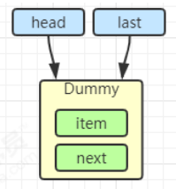

当一个节点入队` last = last.next = node;`


再来一个节点入队` last = last.next = node;`

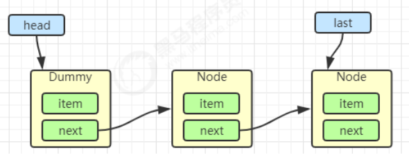

出队

```java
Node<E> h = head;
Node<E> first = h.next; 
h.next = h; // help GC
head = first; 
E x = first.item;
first.item = null;
return x;
h = head 
```


```
first = h.next
```

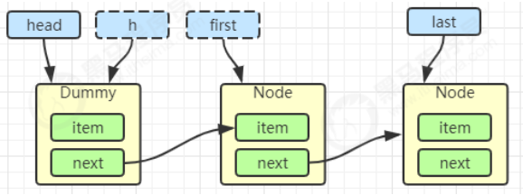

```
h.next = h
```


```
head = first
```


```java
E x = first.item;
first.item = null;
return x;
```


## 2. 加锁分析 

高明之处在于**用了两把锁和 dummy 节点** 

- 用一把锁，同一时刻，最多只允许有一个线程（生产者或消费者，二选一）执行 
- 用两把锁，同一时刻，可**以允许两个线程同时（一个生产者与一个消费者）执行** 

- - 消费者与消费者线程仍然串行 
  - 生产者与生产者线程仍然串行 


线程安全分析 

- 当节点总数大于 2 时（包括 dummy 节点），putLock 保证的是 last 节点的线程安全，takeLock 保证的是 head 节点的线程安全。两把锁保证了入队和出队没有竞争 
- 当节点总数等于 2 时（即一个 dummy 节点，一个正常节点）这时候，仍然是两把锁锁两个对象，不会竞争 
- 当节点总数等于 1 时（就一个 dummy 节点）这时 take 线程会被 notEmpty 条件阻塞，有竞争，会阻塞

```java
// 用于 put(阻塞) offer(非阻塞)
private final ReentrantLock putLock = new ReentrantLock();

// 用户 take(阻塞) poll(非阻塞)
private final ReentrantLock takeLock = new ReentrantLock();
```

### put 操作

```java
public void put(E e) throws InterruptedException {
    if (e == null) throw new NullPointerException();
    int c = -1;
    Node<E> node = new Node<E>(e);
    final ReentrantLock putLock = this.putLock;
    // count 用来维护元素计数
    final AtomicInteger count = this.count;
    putLock.lockInterruptibly();
    try {
        // 满了等待
        while (count.get() == capacity) {
            // 倒过来读就好: 等待 notFull
            notFull.await();
        }
        // 有空位, 入队且计数加一
        enqueue(node);
        c = count.getAndIncrement(); 
        // 除了自己 put 以外, 队列还有空位, 由自己叫醒其他 put 线程
        if (c + 1 < capacity)
            notFull.signal();
    } finally {
        putLock.unlock();
    }
    // 如果队列中有一个元素, 叫醒 take 线程
    if (c == 0)
        // 这里调用的是 notEmpty.signal() 而不是 notEmpty.signalAll() 是为了减少竞争
        signalNotEmpty();
}
```

### take 操作

```java
public E take() throws InterruptedException {
    E x;
    int c = -1;
    final AtomicInteger count = this.count;
    final ReentrantLock takeLock = this.takeLock;
    takeLock.lockInterruptibly();
    try {
        while (count.get() == 0) {
            notEmpty.await();
        }
        x = dequeue();
        c = count.getAndDecrement();
        if (c > 1)
            notEmpty.signal();
    } finally {
        takeLock.unlock();
    }
    // 如果队列中只有一个空位时, 叫醒 put 线程
    // 如果有多个线程进行出队, 第一个线程满足 c == capacity, 但后续线程 c < capacity
    if (c == capacity)
        // 这里调用的是 notFull.signal() 而不是 notFull.signalAll() 是为了减少竞争
        signalNotFull()
        return x; 
}
```

由 put 唤醒 put 是为了避免信号不足 


## 3. 性能比较 

主要列举 LinkedBlockingQueue 与 ArrayBlockingQueue 的性能比较 

- Linked 支持有界，Array 强制有界 
- Linked 实现是链表，Array 实现是数组 
- Linked 是懒惰的，而 Array 需要提前初始化 Node 数组 
- Linked 每次入队会生成新 Node，而 Array 的 Node 是提前创建好的 
- Linked 两把锁，Array 一把锁

# 10. ConcurrentLinkedQueue 

ConcurrentLinkedQueue 的设计与 LinkedBlockingQueue 非常像，也是 

- 两把【锁】，同一时刻，可以允许两个线程同时（一个生产者与一个消费者）执行 
- dummy 节点的引入让两把【锁】将来锁住的是不同对象，避免竞争 
- 只是这【锁】使用了 cas 来实现 


事实上，ConcurrentLinkedQueue 应用还是非常广泛的 


例如之前讲的 Tomcat 的 Connector 结构时，Acceptor 作为生产者向 Poller 消费者传递事件信息时，正是采用了ConcurrentLinkedQueue 将 SocketChannel 给 Poller 使用

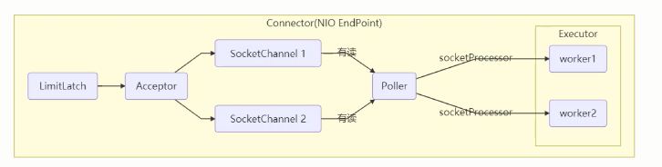


## ConcurrentLinkedQueue 原理


## 1. 模仿 ConcurrentLinkedQueue 

### 初始代码

```java
package cn.itcast.concurrent.thirdpart.test;
import java.util.Collection;
import java.util.Iterator;
import java.util.Queue;
import java.util.concurrent.atomic.AtomicReference;
public class Test3 {
    public static void main(String[] args) {
        MyQueue<String> queue = new MyQueue<>();
        queue.offer("1");
        queue.offer("2");
        queue.offer("3");
        System.out.println(queue);
    }
}
class MyQueue<E> implements Queue<E> {
    @Override
    public String toString() {
        StringBuilder sb = new StringBuilder();
        for (Node<E> p = head; p != null; p = p.next.get()) {
            E item = p.item;
            if (item != null) {
                sb.append(item).append("->");
            }
        }
        sb.append("null");
        return sb.toString();
    }
    @Override
    public int size() {
        return 0;
    }
    @Override
    public boolean isEmpty() {
        return false;
    }
    @Override
    public boolean contains(Object o) {
        return false;
    }
    @Override
    public Iterator<E> iterator() {
        return null;
    }
    @Override
    public Object[] toArray() {
        return new Object[0];
    }
    @Override
    public <T> T[] toArray(T[] a) {
        return null;
    }
    @Override
    public boolean add(E e) {
        return false;
    }
    @Override
    public boolean remove(Object o) {
        return false;
    }
    @Override
    public boolean containsAll(Collection<?> c) {
        return false;
    }
    @Override
    public boolean addAll(Collection<? extends E> c) {
        return false;
    }
    @Override
    public boolean removeAll(Collection<?> c) {
        return false;
    }
    @Override
    public boolean retainAll(Collection<?> c) {
        return false;
    }
    @Override
    public void clear() {
    }
    @Override
    public E remove() {
        return null;
    }
    @Override
    public E element() {
        return null;
    }
    @Override
    public E peek() {
        return null;
    }
    public MyQueue() {
        head = last = new Node<>(null, null);
    }
    private volatile Node<E> last;
    private volatile Node<E> head;
    private E dequeue() {
        /*Node<E> h = head;
        Node<E> first = h.next;
        h.next = h;
        head = first;
        E x = first.item;
        first.item = null;
        return x;*/
        return null;
    }
    @Override
    public E poll() {
        return null;
    }
    @Override
    public boolean offer(E e) {
        return true;
    }
    static class Node<E> {
        volatile E item;
        public Node(E item, Node<E> next) {
            this.item = item;
            this.next = new AtomicReference<>(next);
        }
        AtomicReference<Node<E>> next;
    }
}
```

### offer方法

```
public boolean offer(E e) {
    Node<E> n = new Node<>(e, null);
    while(true) {
        // 获取尾节点
        AtomicReference<Node<E>> next = last.next;
        // S1: 真正尾节点的 next 是 null, cas 从 null 到新节点
        if(next.compareAndSet(null, n)) {
            // 这时的 last 已经是倒数第二, next 不为空了, 其它线程的 cas 肯定失败
            // S2: 更新 last 为倒数第一的节点
            last = n;
            return true;
        }
    }
}
```


# 11. CopyOnWriteArrayList 

`CopyOnWriteArraySet` 是它的马甲 底层实现采用了 `写入时拷贝` 的思想，增删改操作会将底层数组拷贝一份，更改操作在新数组上执行，这时不影响其它线程的**并发读**，**读写分离**。 以新增为例：

```java
public boolean add(E e) {
    synchronized (lock) {
        // 获取旧的数组
        Object[] es = getArray();
        int len = es.length;
        // 拷贝新的数组（这里是比较耗时的操作，但不影响其它读线程）
        es = Arrays.copyOf(es, len + 1);
        // 添加新元素
        es[len] = e;
        // 替换旧的数组
        setArray(es);
        return true;
    }
}
```

这里的源码版本是 Java 11，在 Java 1.8 中使用的是可重入锁而不是 synchronized

其它读操作并未加锁，例如：

```java
public void forEach(Consumer<? super E> action) {
    Objects.requireNonNull(action);
    for (Object x : getArray()) {
        @SuppressWarnings("unchecked") E e = (E) x;
        action.accept(e);
    }
}
```

适合『读多写少』的应用场景 

## get 弱一致性

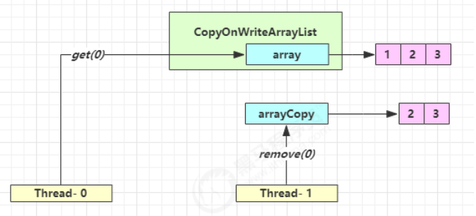


不容易测试，但问题确实存在


## 迭代器弱一致性

```java
CopyOnWriteArrayList<Integer> list = new CopyOnWriteArrayList<>();
list.add(1);
list.add(2);
list.add(3);
Iterator<Integer> iter = list.iterator();
new Thread(() -> {
    list.remove(0);
    System.out.println(list);
}).start();
sleep1s();
while (iter.hasNext()) {
    System.out.println(iter.next());
}
```


不要觉得弱一致性就不好 

- 数据库的 MVCC 都是弱一致性的表现 
- 并发高和一致性是矛盾的，需要权衡

# Reference

https://www.yuque.com/mo_ming/gl7b70/yuw120