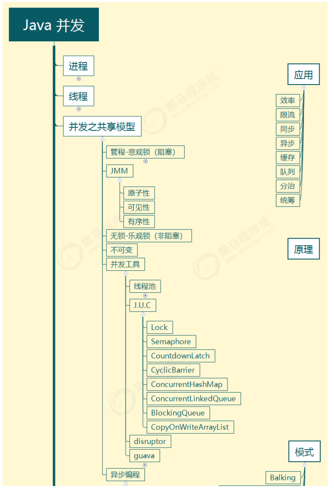
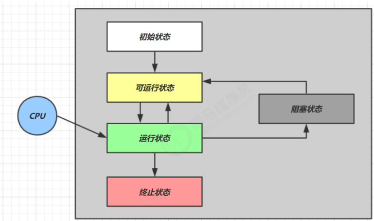
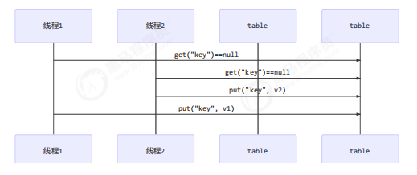
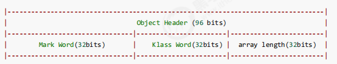
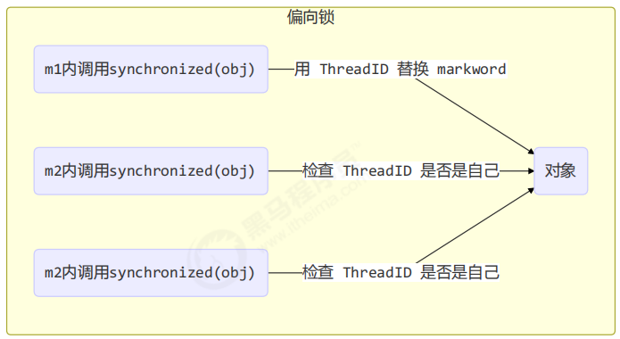
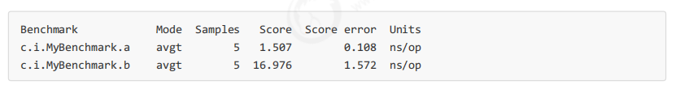
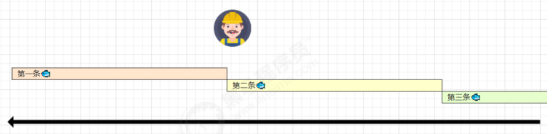
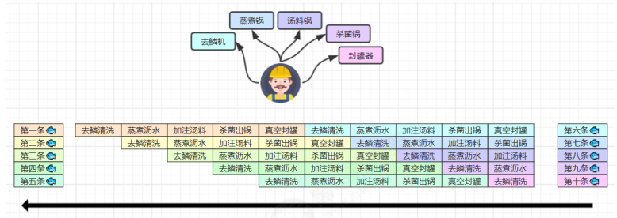
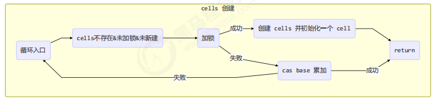

# Java-concurrent

## 概述




### pom.xml

```
<properties>
   <maven.compiler.source>1.8</maven.compiler.source>
   <maven.compiler.target>1.8</maven.compiler.target>
</properties>

<dependencies>
    <dependency>
       <groupId>org.projectlombok</groupId>
       <artifactId>lombok</artifactId>
       <version>1.18.10</version>
  	</dependency>
   <dependency>
     <groupId>ch.qos.logback</groupId>
     <artifactId>logback-classic</artifactId>
     <version>1.2.3</version>
   </dependency>
</dependencies>
```

### logback.xml 

```
<?xml version="1.0" encoding="UTF-8"?>
<configuration
        xmlns="http://ch.qos.logback/xml/ns/logback"
        xmlns:xsi="http://www.w3.org/2001/XMLSchema-instance"
        xsi:schemaLocation="http://ch.qos.logback/xml/ns/logback logback.xsd">
    <appender name="STDOUT" class="ch.qos.logback.core.ConsoleAppender">
        <encoder>
            <pattern>%date{HH:mm:ss} [%t] %logger - %m%n</pattern>
        </encoder>
    </appender>
    <logger name="c" level="debug" additivity="false">
        <appender-ref ref="STDOUT"/>
    </logger>
    <root level="ERROR">
        <appender-ref ref="STDOUT"/>
    </root>
</configuration>
```


# 进程和线程

### 概述

进程：程序是静止的，进程实体的运行过程就是进程，是系统进行**资源分配的基本单位**

进程的特征：并发性、异步性、动态性、独立性、结构性

**线程**：线程是属于进程的，是一个基本的 CPU 执行单元，是程序执行流的最小单元。线程是进程中的一个实体，是系统**独立调度的基本单位**，线程本身不拥有系统资源，只拥有一点在运行中必不可少的资源，与同属一个进程的其他线程共享进程所拥有的全部资源

关系：一个进程可以包含多个线程，这就是多线程，比如看视频是进程，图画、声音、广告等就是多个线程

线程的作用：使多道程序更好的并发执行，提高资源利用率和系统吞吐量，增强操作系统的并发性能

并发并行：

* 并行：在同一时刻，有多个指令在多个 CPU 上同时执行
* 并发：在同一时刻，有多个指令在单个 CPU 上交替执行

同步异步：

* 需要等待结果返回，才能继续运行就是同步
* 不需要等待结果返回，就能继续运行就是异步


***


### 对比

线程进程对比：

* 进程基本上相互独立的，而线程存在于进程内，是进程的一个子集

* 进程拥有共享的资源，如内存空间等，供其**内部的线程共享**

* 进程间通信较为复杂

  同一台计算机的进程通信称为 IPC（Inter-process communication）

  * 信号量：信号量是一个计数器，用于多进程对共享数据的访问，解决同步相关的问题并避免竞争条件
  * 共享存储：多个进程可以访问同一块内存空间，需要使用信号量用来同步对共享存储的访问
  * 管道通信：管道是用于连接一个读进程和一个写进程以实现它们之间通信的一个共享文件 pipe 文件，该文件同一时间只允许一个进程访问，所以只支持**半双工通信**
    * 匿名管道（Pipes）：用于具有亲缘关系的父子进程间或者兄弟进程之间的通信
    * 命名管道（Names Pipes）：以磁盘文件的方式存在，可以实现本机任意两个进程通信，遵循 FIFO
  * 消息队列：内核中存储消息的链表，由消息队列标识符标识，能在不同进程之间提供**全双工通信**，对比管道：
    * 匿名管道存在于内存中的文件；命名管道存在于实际的磁盘介质或者文件系统；消息队列存放在内核中，只有在内核重启（操作系统重启）或者显示地删除一个消息队列时，该消息队列才被真正删除
    * 读进程可以根据消息类型有选择地接收消息，而不像 FIFO 那样只能默认地接收

  不同计算机之间的**进程通信**，需要通过网络，并遵守共同的协议，例如 HTTP

  * 套接字：与其它通信机制不同的是，可用于不同机器间的互相通信

* 线程通信相对简单，因为线程之间共享进程内的内存，一个例子是多个线程可以访问同一个共享变量

  **Java 中的通信机制**：volatile、等待/通知机制、join 方式、InheritableThreadLocal、MappedByteBuffer

* 线程更轻量，线程上下文切换成本一般上要比进程上下文切换低


***


# Java线程

## 本章内容 

- 创建和运行线程 
- 查看线程 
- 线程 API 
- 线程状态 

## 创建线程

### Thread

Thread 创建线程方式：创建线程类，匿名内部类方式

* **start() 方法底层其实是给 CPU 注册当前线程，并且触发 run() 方法执行**
* 线程的启动必须调用 start() 方法，如果线程直接调用 run() 方法，相当于变成了普通类的执行，此时主线程将只有执行该线程
* 建议线程先创建子线程，主线程的任务放在之后，否则主线程（main）永远是先执行完

Thread 构造器：

* `public Thread()`
* `public Thread(String name)`

```java
public class ThreadDemo {
    public static void main(String[] args) {
        Thread t = new MyThread();
        t.start();
       	for(int i = 0 ; i < 100 ; i++ ){
            System.out.println("main线程" + i)
        }
        // main线程输出放在上面 就变成有先后顺序了，因为是 main 线程驱动的子线程运行
    }
}
class MyThread extends Thread {
    @Override
    public void run() {
        for(int i = 0 ; i < 100 ; i++ ) {
            System.out.println("子线程输出："+i)
        }
    }
}
```

继承 Thread 类的优缺点：

* 优点：编码简单
* 缺点：线程类已经继承了 Thread 类无法继承其他类了，功能不能通过继承拓展（单继承的局限性）


***


### Runnable

Runnable 创建线程方式：创建线程类，匿名内部类方式

Thread 的构造器：

* `public Thread(Runnable target)`
* `public Thread(Runnable target, String name)`

```java
public class ThreadDemo {
    public static void main(String[] args) {
        Runnable target = new MyRunnable();
        Thread t1 = new Thread(target,"1号线程");
		t1.start();
        Thread t2 = new Thread(target);//Thread-0
    }
}

public class MyRunnable implements Runnable{
    @Override
    public void run() {
        for(int i = 0 ; i < 10 ; i++ ){
            System.out.println(Thread.currentThread().getName() + "->" + i);
        }
    }
}
```

#### **原理之** **Thread** **与** **Runnable** **的关系** 

**Thread 类本身也是实现了 Runnable 接口**，Thread 类中持有 Runnable 的属性，执行线程 run 方法底层是调用 Runnable#run：

```java
public class Thread implements Runnable {
    private Runnable target;
    
    public void run() {
        if (target != null) {
          	// 底层调用的是 Runnable 的 run 方法
            target.run();
        }
    }
}
```

Runnable 方式的优缺点：

* 缺点：代码复杂一点。

* 优点：

  1. 线程任务类只是实现了 Runnable 接口，可以继续继承其他类，避免了单继承的局限性

  2. 同一个线程任务对象可以被包装成多个线程对象

  3. 适合多个多个线程去共享同一个资源

  4. 实现解耦操作，线程任务代码可以被多个线程共享，线程任务代码和线程独立

  5. 线程池可以放入实现 Runnable 或 Callable 线程任务对象

​     

****


### Callable

需要FutureTask 配合 Thread 来使用

实现 Callable 接口：

1. 定义一个线程任务类实现 Callable 接口，申明线程执行的结果类型
2. 重写线程任务类的 call 方法，这个方法可以直接返回执行的结果
3. 创建一个 Callable 的线程任务对象
4. 把 Callable 的线程任务对象**包装成一个未来任务对象FutureTask **
5. 把未来任务对象包装成线程对象Thread 
6. 调用线程的 start() 方法启动线程

`public FutureTask(Callable<V> callable)`：未来任务对象，在线程执行完后得到线程的执行结果

* FutureTask 就是 Runnable 对象，因为 **Thread 类只能执行 Runnable 实例的任务对象**，所以把 Callable 包装成未来任务对象
* 线程池部分详解了 FutureTask 的源码

`public V get()`：同步等待 task 执行完毕的结果，如果在线程中获取另一个线程执行结果，会阻塞等待，用于线程同步

* get() 线程会阻塞等待任务执行完成
* run() 执行完后会把结果设置到 FutureTask  的一个成员变量，get() 线程可以获取到该变量的值

优缺点：

* 优点：同 Runnable，并且能得到线程执行的结果
* 缺点：编码复杂

```java
public class ThreadDemo {
    public static void main(String[] args) {
        Callable call = new MyCallable();
        FutureTask<String> task = new FutureTask<>(call);
        Thread t = new Thread(task);
        t.start();
        try {
            String s = task.get(); // 获取call方法返回的结果（正常/异常结果）
            System.out.println(s);
        }  catch (Exception e) {
            e.printStackTrace();
        }
    }

public class MyCallable implements Callable<String> {
    @Override//重写线程任务类方法
    public String call() throws Exception {
        return Thread.currentThread().getName() + "->" + "Hello World";
    }
}
```


***


## 线程方法

#### API

Thread 类 API：

| 方法                                        | 说明                                                         |
| ------------------------------------------- | ------------------------------------------------------------ |
| public void start()                         | 启动一个新线程，Java虚拟机调用此线程的 run 方法              |
| public void run()                           | 线程启动后调用该方法                                         |
| public void setName(String name)            | 给当前线程取名字                                             |
| public void getName()                       | 获取当前线程的名字<br />线程存在默认名称：子线程是 Thread-索引，主线程是 main |
| public static Thread currentThread()        | 获取当前线程对象，代码在哪个线程中执行                       |
| public static void sleep(long time)         | 让当前线程休眠多少毫秒再继续执行<br />**Thread.sleep(0)** : 让操作系统立刻重新进行一次 CPU 竞争 |
| public static native void yield()           | 提示线程调度器让出当前线程对 CPU 的使用                      |
| public final int getPriority()              | 返回此线程的优先级                                           |
| public final void setPriority(int priority) | 更改此线程的优先级，常用 1 5 10                              |
| public void interrupt()                     | 中断这个线程，异常处理机制                                   |
| public static boolean interrupted()         | 判断当前线程是否被打断，清除打断标记                         |
| public boolean isInterrupted()              | 判断当前线程是否被打断，不清除打断标记                       |
| public final void join()                    | 等待这个线程结束                                             |
| public final void join(long millis)         | 等待这个线程死亡 millis 毫秒，0 意味着永远等待               |
| public final native boolean isAlive()       | 线程是否存活（还没有运行完毕）                               |
| public final void setDaemon(boolean on)     | 将此线程标记为守护线程或用户线程                             |

##### 注意：

- start：start 方法只是让线程进入就绪，里面代码不一定立刻
  运行（CPU 的时间片还没分给它）。每个线程对象的
  start方法只能调用一次，如果调用了多次会出现
  IllegalThreadStateException
- 如果在构造 Thread 对象时传递了 Runnable 参数，则
  线程启动后会调用 Runnable 中的 run 方法，否则默
  认不执行任何操作。但可以创建 Thread 的子类对象，
  来覆盖默认行为
- run()：setPriority(int)：java中规定线程优先级是1~10 的整数，较大的优先级
  能提高该线程被 CPU 调度的机率
- getState()：Java 中线程状态是用 6 个 enum 表示，分别为：
  NEW, RUNNABLE, BLOCKED, WAITING,
  TIMED_WAITING, TERMINATED
- isInterrupted()：，
  **不会清除 打断标记**
- interrupt() 打断线程
  如果被打断线程正在 sleep，wait，join 会导致被打断
  的线程抛出 InterruptedException，并清除打断标
  记；如果打断的正在运行的线程，则会设置 打断标
  记；park 的线程被打断，也会设置打断标记

- interrupted() static
  判断当前线程是
  否被打断
  会清除 打断标记

***


#### run start

run：称为线程体，包含了要执行的这个线程的内容，方法运行结束，此线程随即终止。直接调用 run 是在主线程中执行了 run，没有启动新的线程，需要顺序执行

start：使用 start 是启动新的线程，此线程处于就绪（可运行）状态，通过新的线程间接执行 run 中的代码

说明：**线程控制资源类**

run() 方法中的异常不能抛出，只能 try/catch

* 因为父类中没有抛出任何异常，子类不能比父类抛出更多的异常
* **异常不能跨线程传播回 main() 中**，因此必须在本地进行处理

##### 补充：

###### 调用 run

```java
public static void main(String[] args) {
    Thread t1 = new Thread("t1") {
        @Override
        public void run() {
            log.debug(Thread.currentThread().getName());
            FileReader.read(Constants.MP4_FULL_PATH);
        }
    };
    
    t1.run();
    log.debug("do other things ...");
}
```

输出

```plain
19:39:14 [main] c.TestStart - main
19:39:14 [main] c.FileReader - read [1.mp4] start ...
19:39:18 [main] c.FileReader - read [1.mp4] end ... cost: 4227 ms
19:39:18 [main] c.TestStart - do other things ...
```

程序仍在 main 线程运行， `FileReader.read()` 方法调用还是**同步**的.


###### 调用 start 

将上述代码的 `t1.run();` 改为 `t1.start();`

输出

```plain
19:41:30 [main] c.TestStart - do other things ...
19:41:30 [t1] c.TestStart - t1
19:41:30 [t1] c.FileReader - read [1.mp4] start ...
19:41:35 [t1] c.FileReader - read [1.mp4] end ... cost: 4542 ms
```

程序在 t1 线程运行， `FileReader.read()` 方法调用是**异步**的

***


#### sleep yield

sleep：

* 调用 sleep 会让当前线程从 `Running` 进入 `Timed Waiting` 状态（阻塞）
* sleep() 方法的过程中，**线程不会释放对象锁**
* 其它线程可以使用 interrupt 方法打断正在睡眠的线程，这时 sleep 方法会抛出 InterruptedException
* **睡眠结束后的线程未必会立刻得到执行，需要抢占 CPU**
* 建议用 TimeUnit 的 sleep 代替 Thread 的 sleep 来获得更好的可读性

yield：

* 调用 yield 会让当前线程从 Running 进入 Runnable 就绪状态，然后调度执行其它线程
  - 调用 yield 会让提示线程调度器让出当前线程对 CPU 的使用
* 具体的实现依赖于**操作系统的任务调度器**
* **会放弃 CPU 资源，锁资源不会释放**


***

#### 线程优先级 

- 线程优先级会提示（hint）调度器优先调度该线程，但它仅仅是一个提示，调度器可以忽略它 
- 如果 cpu 比较忙，那么优先级高的线程会获得更多的时间片，但 cpu 闲时，优先级几乎没作用

```java
Runnable task1 = () -> {
    int count = 0;
    for (;;) {
        System.out.println("---->1 " + count++);
    }
};
Runnable task2 = () -> {
    int count = 0;
    for (;;) {
        // Thread.yield();
        System.out.println(" ---->2 " + count++);
    }
};
Thread t1 = new Thread(task1, "t1");
Thread t2 = new Thread(task2, "t2");
// t1.setPriority(Thread.MIN_PRIORITY);
// t2.setPriority(Thread.MAX_PRIORITY);
t1.start();
t2.start();
```


#### join

public final void join()：等待这个线程结束

原理：调用者轮询检查线程 alive 状态，t1.join() 等价于：

```java
public final synchronized void join(long millis) throws InterruptedException {
    // 调用者线程进入 thread 的 waitSet 等待, 直到当前线程运行结束
    while (isAlive()) {
        wait(0);
    }
}
```

* join 方法是被 synchronized 修饰的，本质上是一个对象锁，其内部的 wait 方法调用也是释放锁的，但是**释放的是当前的线程对象锁，而不是外面的锁**

* 当调用某个线程（t1）的 join 方法后，该线程（t1）抢占到 CPU 资源，就不再释放，直到线程执行完毕

线程同步：

* join 实现线程同步，因为会阻塞等待另一个线程的结束，才能继续向下运行
  * 需要外部共享变量，不符合面向对象封装的思想
  * 必须等待线程结束，不能配合线程池使用
* Future 实现（同步）：get() 方法阻塞等待执行结果
  * main 线程接收结果
  * get 方法是让调用线程同步等待

```java
public class Test {
    static int r = 0;
    public static void main(String[] args) throws InterruptedException {
        test1();
    }
    private static void test1() throws InterruptedException {
        Thread t1 = new Thread(() -> {
            try {
                Thread.sleep(1000);
            } catch (InterruptedException e) {
                e.printStackTrace();
            }
            r = 10;
        });
        t1.start();
        t1.join();//不等待线程执行结束，输出的10
        System.out.println(r);
    }
}
```


***


#### interrupt

##### 打断线程

`public void interrupt()`：打断这个线程，异常处理机制

`public static boolean interrupted()`：判断当前线程是否被打断，打断返回 true，**清除打断标记**，连续调用两次一定返回 false

`public boolean isInterrupted()`：判断当前线程是否被打断，不清除打断标记

打断的线程会发生上下文切换，操作系统会保存线程信息，抢占到 CPU 后会从中断的地方接着运行（打断不是停止）

* sleep、wait、join 方法都会让线程进入阻塞状态，打断线程**会清空打断状态**（false）

  ```java
  public static void main(String[] args) throws InterruptedException {
      Thread t1 = new Thread(()->{
          try {
              Thread.sleep(1000);
          } catch (InterruptedException e) {
              e.printStackTrace();
          }
      }, "t1");
      t1.start();
      Thread.sleep(500);
      t1.interrupt();
      System.out.println(" 打断状态: {}" + t1.isInterrupted());// 打断状态: {}false
  }
  ```

* 打断正常运行的线程：**不会清空打断状态（true）**

  ```java
  public static void main(String[] args) throws Exception {
      Thread t2 = new Thread(()->{
          while(true) {
              Thread current = Thread.currentThread();
              boolean interrupted = current.isInterrupted();
              if(interrupted) {
                  System.out.println(" 打断状态: {}" + interrupted);//打断状态: {}true
                  break;
              }
          }
      }, "t2");
      t2.start();
      Thread.sleep(500);
      t2.interrupt();
  }
  ```


***


##### 打断 park

park 作用类似 sleep，打断 park 线程，不会清空打断状态（true）

```java
public static void main(String[] args) throws Exception {
    Thread t1 = new Thread(() -> {
        System.out.println("park...");
        LockSupport.park();
        System.out.println("unpark...");
        System.out.println("打断状态：" + Thread.currentThread().isInterrupted());//打断状态：true
    }, "t1");
    t1.start();
    Thread.sleep(2000);
    t1.interrupt();
}
```

如果打断标记已经是 true, 则 park 会失效

```java
LockSupport.park();
System.out.println("unpark...");
LockSupport.park();//失效，不会阻塞
System.out.println("unpark...");//和上一个unpark同时执行
```

可以修改获取打断状态方法，使用 `Thread.interrupted()`，清除打断标记

LockSupport 类在 同步 → park-un 详解


***


##### 打断 park 线程 

打断 park 线程, 不会清空打断状态

```java
private static void test3() throws InterruptedException {
    Thread t1 = new Thread(() -> {
        log.debug("park...");
        LockSupport.park();
        log.debug("unpark...");
        log.debug("打断状态：{}", Thread.currentThread().isInterrupted());
    }, "t1");
    t1.start();
    sleep(0.5);
    t1.interrupt();
}
```

输出

```java
21:11:52.795 [t1] c.TestInterrupt - park... 
21:11:53.295 [t1] c.TestInterrupt - unpark... 
21:11:53.295 [t1] c.TestInterrupt - 打断状态：true
```

如果打断标记已经是 true, 则 park 会失效

```java
private static void test4() {
    Thread t1 = new Thread(() -> {
        for (int i = 0; i < 5; i++) {
            log.debug("park...");
            LockSupport.park();
            log.debug("打断状态：{}", Thread.currentThread().isInterrupted());
        }
    });
    t1.start();
    sleep(1);
    t1.interrupt();
}
```

输出

```java
21:13:48.783 [Thread-0] c.TestInterrupt - park... 
21:13:49.809 [Thread-0] c.TestInterrupt - 打断状态：true 
21:13:49.812 [Thread-0] c.TestInterrupt - park... 
21:13:49.813 [Thread-0] c.TestInterrupt - 打断状态：true 
21:13:49.813 [Thread-0] c.TestInterrupt - park... 
21:13:49.813 [Thread-0] c.TestInterrupt - 打断状态：true 
21:13:49.813 [Thread-0] c.TestInterrupt - park... 
21:13:49.813 [Thread-0] c.TestInterrupt - 打断状态：true 
21:13:49.813 [Thread-0] c.TestInterrupt - park... 
21:13:49.813 [Thread-0] c.TestInterrupt - 打断状态：true
```

提示 

可以使用 Thread.interrupted() 清除打断状态

***


#### daemon

`public final void setDaemon(boolean on)`：如果是 true ，将此线程标记为守护线程 

线程**启动前**调用此方法：

```java
Thread t = new Thread() {
    @Override
    public void run() {
        System.out.println("running");
    }
};
// 设置该线程为守护线程
t.setDaemon(true);
t.start();
```

用户线程：平常创建的普通线程

守护线程：服务于用户线程，只要其它非守护线程运行结束了，即使守护线程代码没有执行完，也会强制结束。守护进程是**脱离于终端并且在后台运行的进程**，脱离终端是为了避免在执行的过程中的信息在终端上显示

说明：当运行的线程都是守护线程，Java 虚拟机将退出，因为普通线程执行完后，JVM 是守护线程，不会继续运行下去

常见的守护线程：

* 垃圾回收器线程就是一种守护线程
* Tomcat 中的 Acceptor 和 Poller 线程都是守护线程，所以 Tomcat 接收到 shutdown 命令后，不会等待它们处理完当前请求


***


#### 不推荐

不推荐使用的方法，这些方法已过时，**容易破坏同步代码块，造成线程死锁：**

* `public final void stop()`：停止线程运行

  废弃原因：方法粗暴，除非可能执行 finally 代码块以及释放 synchronized 外，线程将直接被终止，如果线程持有 JUC 的互斥锁可能导致锁来不及释放，造成其他线程永远等待的局面

* `public final void suspend()`：**挂起（暂停）线程运行**

  废弃原因：如果目标线程在暂停时对系统资源持有锁，则在目标线程恢复之前没有线程可以访问该资源，如果**恢复目标线程的线程**在调用 resume 之前会尝试访问此共享资源，则会导致死锁

* `public final void resume()`：恢复线程运行


***


## 线程运行原理

#### 运行机制

##### 栈和栈帧

**Java Virtual Machine Stacks（Java 虚拟机栈）**：每个线程启动后，虚拟机就会为其分配一块栈内存

* 每个栈由多个栈帧（Frame）组成，对应着每次方法调用时所占用的内存
  - 栈帧：**局部变量表，操作数栈，动态链接，方法返回地址**，一些附加信息
* 每个线程**只能有一个活动栈帧**，对应着当前正在执行的那个方法

##### 线程上下文切换

**线程上下文切换（Thread Context Switch）**：一些原因导致 CPU 不再执行当前线程，转而执行另一个线程：

* 线程的 CPU 时间片用完
* 垃圾回收
* 有更高优先级的线程需要运行
* 线程自己调用了 sleep、yield、wait、join、park、synchronized、lock  等方法
* 状态包括程序计数器、虚拟机栈中每个栈帧的信息，如局部变量、操作数栈、返回地址等 
* Context Switch 频繁发生会影响性能

当 Context Switch 发生时，需要由操作系统保存当前线程的状态（PCB 中），并恢复另一个线程的状态，包括程序计数器、虚拟机栈中每个栈帧的信息，如局部变量、操作数栈、返回地址等

**程序计数器（Program Counter Register）**：记住下一条 JVM 指令的执行地址，是线程私有的


JVM 规范并没有限定线程模型，以 HotSopot 为例：

* Java 的线程是内核级线程（1:1 线程模型），每个 Java 线程都映射到一个操作系统原生线程，需要消耗一定的内核资源（堆栈）
* **线程的调度是在内核态运行的，而线程中的代码是在用户态运行**，所以线程切换（状态改变）会导致用户与内核态转换进行系统调用，这是非常消耗性能

Java 中 main 方法启动的是一个进程也是一个主线程，main 方法里面的其他线程均为子线程，main 线程是这些线程的父线程


***


#### 线程调度

线程调度指系统为线程分配处理器使用权的过程，方式有两种：协同式线程调度、抢占式线程调度（Java 选择）

协同式线程调度：线程的执行时间由线程本身控制

* 优点：线程做完任务才通知系统切换到其他线程，相当于所有线程串行执行，不会出现线程同步问题
* 缺点：线程执行时间不可控，如果代码编写出现问题，可能导致程序一直阻塞，引起系统的奔溃

抢占式线程调度：线程的执行时间由系统分配

* 优点：线程执行时间可控，不会因为一个线程的问题而导致整体系统不可用
* 缺点：无法主动为某个线程多分配时间

Java 提供了线程优先级的机制，优先级会提示（hint）调度器优先调度该线程，但这仅仅是一个提示，调度器可以忽略它。在线程的就绪状态时，如果 CPU 比较忙，那么优先级高的线程会获得更多的时间片，但 CPU 闲时，优先级几乎没作用

说明：并不能通过优先级来判断线程执行的先后顺序


***


#### 未来优化

内核级线程调度的成本较大，所以引入了更轻量级的协程。用户线程的调度由用户自己实现（多对一的线程模型，多**个用户线程映射到一个内核级线程**），被设计为协同式调度，所以叫协程

* 有栈协程：协程会完整的做调用栈的保护、恢复工作，所以叫有栈协程
* 无栈协程：本质上是一种有限状态机，状态保存在闭包里，比有栈协程更轻量，但是功能有限

有栈协程中有一种特例叫纤程，在新并发模型中，一段纤程的代码被分为两部分，执行过程和调度器：

* 执行过程：用于维护执行现场，保护、恢复上下文状态
* 调度器：负责编排所有要执行的代码顺序


****


## 线程状态

进程的状态参考操作系统：创建态、就绪态、运行态、阻塞态、终止态

### 五种状态 ( **操作系统** 层面)

这是从 **操作系统** 层面来描述的



- 【初始状态】仅是在语言层面创建了线程对象，还未与操作系统线程关联 
- 【可运行状态】（就绪状态）指该线程已经被创建（与操作系统线程关联），可以由 CPU 调度执行 
- 【运行状态】指获取了 CPU 时间片运行中的状态 

- - 当 CPU 时间片用完，会从【运行状态】转换至【可运行状态】，会导致线程的上下文切换 

- 【阻塞状态】 

- - 如果调用了阻塞 API，如 BIO 读写文件，这时该线程实际不会用到 CPU，会导致线程上下文切换，进入【阻塞状态】 
  - 等 BIO 操作完毕，会由操作系统唤醒阻塞的线程，转换至【可运行状态】 
  - 与【可运行状态】的区别是，对【阻塞状态】的线程来说只要它们一直不唤醒，调度器就一直不会考虑调度它们 

- 【终止状态】表示线程已经执行完毕，生命周期已经结束，不会再转换为其它状态

### Java线程六种状态(Thread.State)

线程由生到死的完整过程（生命周期）：当线程被创建并启动以后，既不是一启动就进入了执行状态，也不是一直处于执行状态，在 API 中 `java.lang.Thread.State` 这个枚举中给出了六种线程状态：

| 线程状态                   | 导致状态发生条件                                             |
| -------------------------- | ------------------------------------------------------------ |
| NEW（新建）                | 线程刚被创建，但是并未启动，还没调用 start 方法，只有线程对象，没有线程特征 |
| Runnable（可运行）         | 线程可以在 Java 虚拟机中运行的状态，可能正在运行自己代码，也可能没有，这取决于操作系统处理器，调用了 t.start() 方法：就绪（经典叫法） |
| Blocked（阻塞）            | 当一个线程试图获取一个对象锁，而该对象锁被其他的线程持有，则该线程进入 Blocked 状态；当该线程持有锁时，该线程将变成 Runnable 状态 |
| Waiting（无限等待）        | 一个线程在等待另一个线程执行一个（唤醒）动作时，该线程进入 Waiting 状态，进入这个状态后不能自动唤醒，必须等待另一个线程调用 notify 或者 notifyAll 方法才能唤醒 |
| Timed Waiting （限期等待） | 有几个方法有超时参数，调用将进入 Timed Waiting 状态，这一状态将一直保持到超时期满或者接收到唤醒通知。带有超时参数的常用方法有 Thread.sleep 、Object.wait |
| Teminated（结束）          | run 方法正常退出而死亡，或者因为没有捕获的异常终止了 run 方法而死亡 |


* NEW → RUNNABLE：当调用 t.start() 方法时，由 NEW → RUNNABLE

* RUNNABLE <--> WAITING：

  * **t 线程**用 `synchronized(obj)` 获取了对象锁后,调用 obj.wait() 方法时

  * 调用 obj.notify()、obj.notifyAll()、t.interrupt()：

    * 竞争锁成功，t 线程从 WAITING → RUNNABLE
  * 竞争锁失败，t 线程从 WAITING → BLOCKED

  * 当前线程调用 t.join() 方法，注意是当前线程在 t 线程对象的监视器上等待

    - **当前线程**调用 t.join() 方法时，**当前线程**从 RUNNABLE --> WAITING 

    - - 注意是**当前线程**在**t 线程对象**的监视器上等待 

    - **t 线程**运行结束，或调用了**当前线程**的 interrupt() 时，**当前线程**从 WAITING --> RUNNABLE

  * 当前线程调用 LockSupport.park() 方法

    - 当前线程调用 LockSupport.park() 方法会让当前线程从 RUNNABLE --> WAITING 
    - 调用 LockSupport.unpark(目标线程) 或调用了线程 的 interrupt() ，会让目标线程从 WAITING -->RUNNABLE 

* RUNNABLE <--> TIMED_WAITING：调用 obj.wait(long n) 方法、当前线程调用 t.join(long n) 方法、当前线程调用 Thread.sleep(long n)

  - - 注意是**当前线程**在**t 线程对象**的监视器上等待 
    - **当前线程**调用 t.join(long n) 方法时，**当前线程**从 RUNNABLE --> TIMED_WAITING 

  - - - 注意是**当前线程**在**t 线程对象**的监视器上等待 

  - - **当前线程**等待时间超过了 n 毫秒，或**t 线程**运行结束，或调用了**当前线程**的 interrupt() 时，**当前线程**从 TIMED_WAITING --> RUNNABLE
    - 当前线程调用 Thread.sleep(long n) ，当前线程从 RUNNABLE --> TIMED_WAITING 
    - **当前线程**等待时间超过了 n 毫秒，**当前线程**从TIMED_WAITING --> RUNNABLE
    - 当前线程调用 LockSupport.parkNanos(long nanos) 或 LockSupport.parkUntil(long millis) 时，**当前线 程**从 RUNNABLE --> TIMED_WAITING 
    - 调用 LockSupport.unpark(目标线程) 或调用了线程 的 interrupt() ，或是等待超时，会让目标线程从 TIMED_WAITING--> RUNNABLE

* RUNNABLE <--> BLOCKED：t 线程用 synchronized(obj) 获取了对象锁时竞争失败

```java
@Slf4j(topic = "c.TestState")
public class TestState {
    public static void main(String[] args) throws IOException {
        Thread t1 = new Thread("t1") {
            @Override
            public void run() {
                log.debug("running...");
            }
        };

        Thread t2 = new Thread("t2") {
            @Override
            public void run() {
                while(true) { // runnable

                }
            }
        };
        t2.start();

        Thread t3 = new Thread("t3") {
            @Override
            public void run() {
                log.debug("running...");
            }
        };
        t3.start();

        Thread t4 = new Thread("t4") {
            @Override
            public void run() {
                synchronized (TestState.class) {
                    try {
                        Thread.sleep(1000000); // timed_waiting
                    } catch (InterruptedException e) {
                        e.printStackTrace();
                    }
                }
            }
        };
        t4.start();

        Thread t5 = new Thread("t5") {
            @Override
            public void run() {
                try {
                    t2.join(); // waiting
                } catch (InterruptedException e) {
                    e.printStackTrace();
                }
            }
        };
        t5.start();

        Thread t6 = new Thread("t6") {
            @Override
            public void run() {
                synchronized (TestState.class) { // blocked
                    try {
                        Thread.sleep(1000000);
                    } catch (InterruptedException e) {
                        e.printStackTrace();
                    }
                }
            }
        };
        t6.start();

        try {
            Thread.sleep(500);
        } catch (InterruptedException e) {
            e.printStackTrace();
        }
        log.debug("t1 state {}", t1.getState());
        log.debug("t2 state {}", t2.getState());
        log.debug("t3 state {}", t3.getState());
        log.debug("t4 state {}", t4.getState());
        log.debug("t5 state {}", t5.getState());
        log.debug("t6 state {}", t6.getState());
        System.in.read();
    }
}
```


***


## 查看线程的方法

> windows下出现异常(例如jps看不到,jconsole也没有可用pid),尝试管理员身份运行cmd
>
> cmd在 C:\Users\{用户名}\AppData\Roaming\Microsoft\Windows\Start Menu\Programs\System Tools


### Windows：

* 任务管理器可以查看进程和线程数，也可以用来杀死进程
* tasklist 查看进程
* taskkill 杀死进程

```
tasklist | findstr java
```

### Linux：

* ps -ef 查看所有进程
* ps -fT -p <PID> 查看某个进程（PID）的所有线程
* kill 杀死进程
* top 按大写 H **切换是否显示线程**
* top -H -p `<PID>` **查看某个进程（PID）的所有线程**

**top命令会动态的显示linux系统中进程占用的内存和cpu**

### Java：

* **jps 命令查看所有 Java 进程**
* jstack <PID> 查看某个 Java 进程（PID）的所有线程状态
* jconsole 来查看某个 Java 进程中线程的运行情况（图形界面）

#### jconsole 远程监控配置 

- 需要以如下方式运行你的 java 类

```shell
java -Djava.rmi.server.hostname=`ip地址` -Dcom.sun.management.jmxremote -
Dcom.sun.management.jmxremote.port=`连接端口` -Dcom.sun.management.jmxremote.ssl=是否安全连接 -
Dcom.sun.management.jmxremote.authenticate=是否认证 java类
```

- 修改 /etc/hosts 文件将 127.0.0.1 映射至主机名


如果要认证访问，还需要做如下步骤 

- 复制 jmxremote.password 文件 
- 修改 jmxremote.password 和 jmxremote.access 文件的权限为 600 即文件所有者可读写 
- 连接时填入 controlRole（用户名），R&D（密码）


#### 杀死一个java程序

```shell
C:\Users\nicolas>jps
28784 Jps
5108
6632 RemoteMavenServer36
14716 Test3
25772 Launcher

C:\Users\nicolas>taskkill -f -pid 14716
```


***


# 管程-悲观锁（阻塞）

## 本章内容 

- 共享问题 
- synchronized 
- 线程安全分析 
- Monitor 
- wait/notify 
- 线程状态转换 
- 活跃性 
- Lock 

Monitor 主要关注的是访问共享变量时，保证临界区代码的原子性.

## 临界区 

Critical Section 

临界资源：一次仅允许一个进程使用的资源成为临界资源

临界区：访问临界资源的代码块

竞态条件：多个线程在临界区内执行，由于代码的执行序列不同而导致结果无法预测，称之为发生了竞态条件

一个程序运行多个线程是没有问题，多个线程读共享资源也没有问题，在多个线程对共享资源读写操作时发生指令交错，就会出现问题

为了避免临界区的竞态条件发生（解决线程安全问题）：

* 阻塞式的解决方案：synchronized，lock
* 非阻塞式的解决方案：原子变量

管程（monitor）：由局部于自己的若干公共变量和所有访问这些公共变量的过程所组成的软件模块，保证同一时刻只有一个进程在管程内活动，即管程内定义的操作在同一时刻只被一个进程调用（由编译器实现）

**synchronized：对象锁，保证了临界区内代码的原子性**，采用互斥的方式让同一时刻至多只有一个线程能持有对象锁，其它线程获取这个对象锁时会阻塞，保证拥有锁的线程可以安全的执行临界区内的代码，不用担心线程上下文切换

互斥和同步都可以采用 synchronized 关键字来完成，区别：

* 互斥是保证临界区的竞态条件发生，同一时刻只能有一个线程执行临界区代码
* 同步是由于线程执行的先后、顺序不同、需要一个线程等待其它线程运行到某个点

性能：

* 线程安全，性能差
* 线程不安全性能好，假如开发中不会存在多线程安全问题，建议使用线程不安全的设计类

### 竞态条件 Race Condition 


多个线程在临界区内执行，由于代码的**执行序列不同**而导致结果无法预测，称之为发生了**竞态条件**

***


## synchronized

### 使用锁

#### 同步块

锁对象：理论上可以是**任意的唯一对象**

synchronized 是可重入、不公平的重量级锁

原则上：

* 锁对象建议使用共享资源
* 在实例方法中使用 this 作为锁对象，锁住的 this 正好是共享资源
* 在静态方法中使用类名 .class 字节码作为锁对象，因为静态成员属于类，被所有实例对象共享，所以需要锁住类

同步代码块格式：

```java
synchronized(锁对象){
	// 访问共享资源的核心代码
}
```

实例：

```java
public class demo {
    static int counter = 0;
    //static修饰，则元素是属于类本身的，不属于对象  ，与类一起加载一次，只有一个
    static final Object room = new Object();
    public static void main(String[] args) throws InterruptedException {
        Thread t1 = new Thread(() -> {
            for (int i = 0; i < 5000; i++) {
                synchronized (room) {
                    counter++;
                }
            }
        }, "t1");
        Thread t2 = new Thread(() -> {
            for (int i = 0; i < 5000; i++) {
                synchronized (room) {
                    counter--;
                }
            }
        }, "t2");
        t1.start();
        t2.start();
        t1.join();
        t2.join();
        System.out.println(counter);
    }
}
```

##### 总结

**通过时序图分析，多线程执行问题：**


synchronized 实际是用**对象锁**保证了**临界区内代码的原子性**，临界区内的代码对外是不可分割的，不会被线程切换所打断。 


***


#### 同步方法

把出现线程安全问题的核心方法锁起来，每次只能一个线程进入访问

synchronized 修饰的方法的不具备继承性，所以子类是线程不安全的，如果子类的方法也被 synchronized 修饰，两个锁对象其实是一把锁，而且是**子类对象作为锁**

用法：直接给方法加上一个修饰符 synchronized

```java
//同步方法
修饰符 synchronized 返回值类型 方法名(方法参数) { 
	方法体；
}
//同步静态方法
修饰符 static synchronized 返回值类型 方法名(方法参数) { 
	方法体；
}
```

同步方法底层也是有锁对象的：

* 如果方法是实例方法：同步方法默认用 this 作为的锁对象

  ```java
  public synchronized void test() {} //等价于
  public void test() {
      synchronized(this) {}
  }
  ```

* 如果方法是静态方法：同步方法默认用类名 .class 作为的锁对象

  ```java
  class Test{
  	public synchronized static void test() {}
  }
  //等价于
  class Test{
      public void test() {
          synchronized(Test.class) {}
  	}
  }
  ```


***


### 线程八锁

线程八锁就是考察 synchronized 锁住的是哪个对象，直接百度搜索相关的实例

说明：主要关注锁住的对象是不是同一个

* 锁住类对象，所有类的实例的方法都是安全的，类的所有实例都相当于同一把锁
* 锁住 this 对象，只有在当前实例对象的线程内是安全的，如果有多个实例就不安全

线程不安全：因为锁住的不是同一个对象，线程 1 调用 a 方法锁住的类对象，线程 2 调用 b 方法锁住的 n2 对象，不是同一个对象

```java
class Number{
    public static synchronized void a(){
		Thread.sleep(1000);
        System.out.println("1");
    }
    public synchronized void b() {
        System.out.println("2");
    }
}
public static void main(String[] args) {
    Number n1 = new Number();
    Number n2 = new Number();
    new Thread(()->{ n1.a(); }).start();
    new Thread(()->{ n2.b(); }).start();
}
```

线程安全：因为 n1 调用 a() 方法，锁住的是类对象，n2 调用 b() 方法，锁住的也是类对象，所以线程安全

```java
class Number{
    public static synchronized void a(){
		Thread.sleep(1000);
        System.out.println("1");
    }
    public static synchronized void b() {
        System.out.println("2");
    }
}
public static void main(String[] args) {
    Number n1 = new Number();
    Number n2 = new Number();
    new Thread(()->{ n1.a(); }).start();
    new Thread(()->{ n2.b(); }).start();
}
```


## 变量的线程安全分析 

**成员变量和静态变量是否线程安全？** 

- 如果它们没有共享，则线程安全 
- 如果它们被共享了，根据它们的状态是否能够改变，又分两种情况 

- - 如果只有读操作，则线程安全 
  - 如果有读写操作，则这段代码是临界区，需要考虑线程安全 


**局部变量是否线程安全？** 

- 局部变量是线程安全的 
- 但局部变量引用的对象则未必 

- - 如果该对象没有逃离方法的作用访问，它是线程安全的 
  - 如果该对象逃离方法的作用范围，需要考虑线程安全

方法访问修饰符带来的思考，如果把 method2 和 method3 的方法修改为 public 会不会出现线程安全问题？ 

- 情况1：有其它线程调用 method2 和 method3 
- 情况2：在 情况1 的基础上，**为 ThreadSafe 类添加子类，子类覆盖 method2 或 method3 方法**，即

```java
class ThreadSafe {
    public final void method1(int loopNumber) {
        ArrayList<String> list = new ArrayList<>();
        for (int i = 0; i < loopNumber; i++) {
            method2(list);
            method3(list);
        }
    }
    private void method2(ArrayList<String> list) {
        list.add("1");
    }
    private void method3(ArrayList<String> list) {
        list.remove(0);
    }
}

class ThreadSafeSubClass extends ThreadSafe{
    @Override
    public void method3(ArrayList<String> list) {
        new Thread(() -> {
            list.remove(0);
        }).start();
    }
}
```

从这个例子可以看出 private 或 final 提供【安全】的意义所在，请体会开闭原则中的【闭】

### 常见线程安全类

- String 
- Integer 
- StringBuffffer 
- Random 
- Vector 
- Hashtable 
- java.util.concurrent 包下的类

这里说它们是线程安全的是指，多个线程调用它们同一个实例的某个方法时，是线程安全的。也可以理解为

```java
Hashtable table = new Hashtable();

new Thread(()->{
    table.put("key", "value1");
}).start();

new Thread(()->{
    table.put("key", "value2");
}).start();
```

- 它们的每个方法是原子的 
- 但**注意**它们多个方法的组合不是原子的，见后面分析

### 线程安全类方法的组合 

分析下面代码是否线程安全？ 

```java
Hashtable table = new Hashtable();
// 线程1，线程2
if( table.get("key") == null) {
    table.put("key", value);
}
```




### 不可变类线程安全性 

String、Integer 等都是不可变类，因为其内部的状态不可以改变，因此它们的方法都是线程安全的 

有同学或许有疑问，String 有 replace，substring 等方法【可以】改变值啊，那么这些方法又是如何保证线程安全的呢？

```java
public class Immutable{
    private int value = 0;
    
    public Immutable(int value){
        this.value = value;
    }
    
    public int getValue(){
        return this.value;
    }
}
```

如果想增加一个增加的方法呢？

```java
public class Immutable{
    private int value = 0;
    
    public Immutable(int value){
        this.value = value;
    }
    
    public int getValue(){
        return this.value;
    }

    public Immutable add(int v){
        return new Immutable(this.value + v);
    }
}
```

### **实例分析**

例7

```java
public abstract class Test {

    public void bar() {
        // 是否安全
        SimpleDateFormat sdf = new SimpleDateFormat("yyyy-MM-dd HH:mm:ss");
        foo(sdf);
    }

    public abstract foo(SimpleDateFormat sdf);


    public static void main(String[] args) {
        new Test().bar();
    }
    
}
```

其中 foo 的行为是不确定的，可能导致不安全的发生，被称之为**外星方法**

```java
public void foo(SimpleDateFormat sdf) {
    String dateStr = "1999-10-11 00:00:00";
    for (int i = 0; i < 20; i++) {
        new Thread(() -> {
            try {
                sdf.parse(dateStr);
            } catch (ParseException e) {
                e.printStackTrace();
            }
        }).start();
    }
}
```

请比较 JDK 中 String 类的实现

#### 结论

结论：看共享变量有没有被多个线程同时读写

## synchronized锁原理

### Java 对象头

#### 什么是java对象头？

**对象头**：主要包含两个部分

- **运行时元数据（Mark Word）**：
  - **哈希值（HashCode）**
  - GC分代年龄
  - **锁状态标志**
  - **线程持有的锁**
  - 偏向线程ID
  - 偏向时间戳
- **类型指针**：**指向类元数据**InstanceKlass，确定该对象所属的类型。指向的其实是**方法区中存放的类元信息**
- 数组长度，如果是数组才有


---

以 32 位虚拟机为例


普通对象


Mark Word 主要用来存储对象自身的运行时数据

Klass Word 指向Class对象


数组对象

相对于普通对象多了记录数组长度



#### Mark Word 结构

* Mark Word 结构：最后两位是**锁标志位**

  

* 64 位虚拟机 Mark Word：

  

### Monitor（锁）

Monitor 被翻译为**监视器或管程**

每个 Java 对象都可以关联一个 Monitor 对象，Monitor 也是 class，其**实例存储在堆中**，如果使用 synchronized 给对象上锁（重量级）之后，该对象头的 运行时元数据Mark Word 中就被设置指向 Monitor 对象的指针，这就是重量级锁


工作流程：

* 开始时 Monitor 中 Owner 为 null
* 当 Thread-2 执行 synchronized(obj) 就会将 Monitor 的所有者 Owner 置为 Thread-2，Monitor 中只能有一个 Owner，**obj 对象的 Mark Word 指向 Monitor**，把**对象原有的 MarkWord 存入线程栈中的锁记录**中（轻量级锁部分详解）
  
* 在 Thread-2 上锁的过程，Thread-3、Thread-4、Thread-5 也执行 synchronized(obj)，就会进入 EntryList 阻塞 （BLOCKED）（双向链表）
* Thread-2 执行完同步代码块的内容，根据 obj 对象头中 Monitor 地址寻找，设置 Owner 为空，把线程栈的锁记录中的对象头的值设置回 MarkWord
* 唤醒 EntryList 中等待的线程来竞争锁，竞争是**非公平的**，如果这时有新的线程想要获取锁，可能直接就抢占到了，阻塞队列的线程就会继续阻塞
* **WaitSet** 中的 线程Thread-0，Thread-1 是**以前获得过锁，但条件不满足进入 WAITING 状态的线程**（wait-notify 机制）


注意：

* synchronized 必须是进入**同一个对象的 Monitor** 才有上述的效果
* 不加 synchronized 的对象不会关联监视器，不遵从以上规则


****


### synchronized原理

**字节码**

代码：

```java
public static void main(String[] args) {
    Object lock = new Object();
    synchronized (lock) {
        System.out.println("ok");
    }
}
```

```java
0: 	new				#2		// new Object
3: 	dup
4: 	invokespecial 	#1 		// invokespecial <init>:()V，非虚方法
7: 	astore_1 				// lock引用 -> lock
8: 	aload_1					// lock （synchronized开始）
9: 	dup						// 一份用来初始化，一份用来引用
10: astore_2 				// lock引用 -> slot 2
11: monitorenter 			// 【将 lock对象 MarkWord 置为 Monitor 指针】
12: getstatic 		#3		// System.out
15: ldc 			#4		// "ok"
17: invokevirtual 	#5 		// invokevirtual println:(Ljava/lang/String;)V
20: aload_2 				// slot 2(lock引用)
21: monitorexit 			// 【将 lock对象 MarkWord 重置, 唤醒 EntryList】
22: goto 30
25: astore_3 				// any -> slot 3
26: aload_2 				// slot 2(lock引用)
27: monitorexit 			// 【将 lock对象 MarkWord 重置, 唤醒 EntryList】
28: aload_3
29: athrow
30: return
Exception table:
    from to target type
      12 22 25 		any
      25 28 25 		any
LineNumberTable: ...
LocalVariableTable:
    Start Length Slot Name Signature
    	0 	31 		0 args [Ljava/lang/String;
    	8 	23 		1 lock Ljava/lang/Object;
```

说明：

* 通过异常 **try-catch 机制**，确保一定会被解锁
* 方法级别的 synchronized 不会在字节码指令中有所体现


> 字节码指令：
>
> aload是把局部变量表的值存储到操作数栈上

***


### synchronized原理进阶— 锁升级

#### synchronized 锁升级过程

**synchronized 是可重入、不公平的重量级锁**，所以可以对其进行优化

```java
无锁 -> 偏向锁 -> 轻量级锁 -> 重量级锁	// 随着竞争的增加，只能锁升级，不能降级
```


***


#### 偏向锁

**自JDK15起，偏向锁已被废弃，JDK20被移除，可以在JDK8中将其关闭以提高性能。**

偏向锁的思想是偏向于让第一个获取锁对象的线程，这个线程之后重新获取该锁不再需要同步操作：

* 当锁对象第一次被线程获得的时候进入偏向状态，标记为 101，同时**使用 CAS 操作将线程 ID 记录到 Mark Word**。如果 CAS 操作成功，这个线程以后进入这个锁相关的同步块，查看这个线程 ID 是自己的就表示没有竞争，就不需要再进行任何同步操作

* 当有另外一个线程去尝试获取这个锁对象时，偏向状态就宣告结束，此时撤销偏向（Revoke Bias）后恢复到未锁定或轻量级锁状态


一个对象创建时：

* 如果开启了**偏向锁（默认开启）**，那么对象创建后，MarkWord 值为 0x05 即最后 3 位为 101，thread、epoch、age 都为 0
* 偏向锁是**默认是延迟的**，不会在程序启动时立即生效，如果想避免延迟，可以加 VM 参数 `-XX:BiasedLockingStartupDelay=0` 来禁用延迟。JDK 8 延迟 4s 开启偏向锁原因：在刚开始执行代码时，会有好多线程来抢锁，如果开偏向锁效率反而降低
* **当一个对象已经计算过 hashCode，就再也无法进入偏向状态了**
  - **哈希码用的时候才产生，默认是0，只有第一次调用对象的hashcode**，对象的哈希码才会产生，才在对象头的markword里面填充哈希码
* 添加 VM 参数 `-XX:-UseBiasedLocking` 禁用偏向锁

撤销偏向锁的状态：

* 调用对象的 hashCode：偏向锁的对象 MarkWord 中存储的是线程 id，调用 hashCode 导致偏向锁被撤销
* 当有其它线程使用偏向锁对象时，会将偏向锁升级为轻量级锁
* 调用 wait/notify，需要申请 Monitor，进入 WaitSet

**批量撤销**：如果对象被多个线程访问，但没有竞争，这时偏向了线程 T1 的对象仍有机会重新偏向 T2，重偏向会重置对象的 Thread ID

* 批量重偏向：当撤销偏向锁阈值超过 20 次后，JVM 会觉得是不是偏向错了，于是在给这些对象加锁时重新偏向至加锁线程
* 批量撤销：当撤销偏向锁阈值超过 40 次后，JVM 会觉得自己确实偏向错了，根本就不该偏向，于是整个类的所有对象都会变为不可偏向的，新建的对象也是不可偏向的

##### 1） 测试延迟特性 

偏向锁是默认是延迟的，不会在程序启动时立即生效，如果想避免延迟，可以加 VM 参数 `-XX:BiasedLockingStartupDelay=0` 来`禁用延迟` 


##### 2） 测试偏向锁


```
class Dog {}
```


利用 jol 第三方工具来查看对象头信息（注意这里up主扩展了 jol 让它输出更为简洁）

这里视频里引入的依赖貌似是他自己做的jar包,代码我就没写了,

代码很简单,重在理解对象头MarkWord

```java
public static void main(String[] args) throws IOException {
    Dog d = new Dog();
    ClassLayout classLayout = ClassLayout.parseInstance(d);
    
    new Thread(() -> {
        log.debug("synchronized 前");
        System.out.println(classLayout.toPrintableSimple(true));
        synchronized (d) {
            log.debug("synchronized 中");
            System.out.println(classLayout.toPrintableSimple(true));
        }
        log.debug("synchronized 后");
        System.out.println(classLayout.toPrintableSimple(true));
    }, "t1").start();
}
```

输出

```java
11:08:58.117 c.TestBiased [t1] - synchronized 前
00000000 00000000 00000000 00000000 00000000 00000000 00000000 00000101 
11:08:58.121 c.TestBiased [t1] - synchronized 中
00000000 00000000 00000000 00000000 00011111 11101011 11010000 00000101 
11:08:58.121 c.TestBiased [t1] - synchronized 后
00000000 00000000 00000000 00000000 00011111 11101011 11010000 00000101
```

**注意** 

处于偏向锁的对象解锁后，线程 id 仍存储于对象头中

也就是偏(心)向某个线程了


##### 3）测试禁用 

在上面测试代码运行时在添加 VM 参数 `-XX:-UseBiasedLocking`` 禁用偏向锁` 


输出 

```java
11:13:10.018 c.TestBiased [t1] - synchronized 前
00000000 00000000 00000000 00000000 00000000 00000000 00000000 00000001 
11:13:10.021 c.TestBiased [t1] - synchronized 中
00000000 00000000 00000000 00000000 00100000 00010100 11110011 10001000 
11:13:10.021 c.TestBiased [t1] - synchronized 后
00000000 00000000 00000000 00000000 00000000 00000000 00000000 00000001
```

##### 4) 测试 hashCode 

在`Dog d = new Dog();`后加上一句 `d.hashCode();`


- 正常状态对象一开始是没有 hashCode 的，第一次调用才生成
- 调用了 hashCode() 后会撤销该对象的偏向锁


##### 撤销(偏向) - 调用对象 hashCode 

调用了对象的 hashCode，但偏向锁的对象 MarkWord 中存储的是线程 id，如果调用 hashCode 会导致偏向锁被撤销 

- 轻量级锁会在锁记录中记录 hashCode 
- 重量级锁会在 Monitor 中记录 hashCode 


记得去掉 `-XX:-UseBiasedLocking`

在调用 hashCode 后使用偏向锁，

 


输出

```java
11:22:10.386 c.TestBiased [main] - 调用 hashCode:1778535015 
11:22:10.391 c.TestBiased [t1] - synchronized 前
00000000 00000000 00000000 01101010 00000010 01001010 01100111 00000001 
11:22:10.393 c.TestBiased [t1] - synchronized 中
00000000 00000000 00000000 00000000 00100000 11000011 11110011 01101000 
11:22:10.393 c.TestBiased [t1] - synchronized 后
00000000 00000000 00000000 01101010 00000010 01001010 01100111 00000001
```


##### 撤销(偏向) - 其它线程(错开)使用对象 


当有其它线程使用偏向锁对象时，会将偏向锁升级为轻量级锁

```java
private static void test2() throws InterruptedException {
    
    Dog d = new Dog();
    
    Thread t1 = new Thread(() -> {
        
        log.debug(ClassLayout.parseInstance(d).toPrintableSimple(true));
        synchronized (d) {
            log.debug(ClassLayout.parseInstance(d).toPrintableSimple(true));
        }
        log.debug(ClassLayout.parseInstance(d).toPrintableSimple(true));
        
        synchronized (TestBiased.class) {
            TestBiased.class.notify();
        }
        // 如果不用 wait/notify 使用 join 必须打开下面的注释
        // 因为：t1 线程不能结束，否则底层线程可能被 jvm 重用作为 t2 线程，底层线程 id 是一样的
        /*try {
            System.in.read();
        } catch (IOException e) {
            e.printStackTrace();
        }*/
    }, "t1");
    t1.start();
    
    Thread t2 = new Thread(() -> {
        synchronized (TestBiased.class) {
            try {
                TestBiased.class.wait();
            } catch (InterruptedException e) {
                e.printStackTrace();
            }
        }
        
        log.debug(ClassLayout.parseInstance(d).toPrintableSimple(true));
        synchronized (d) {
            log.debug(ClassLayout.parseInstance(d).toPrintableSimple(true));
        }
        log.debug(ClassLayout.parseInstance(d).toPrintableSimple(true));
        
    }, "t2");
    t2.start();
}
```

输出


##### 撤销(偏向) - 调用 wait/notify

重量级锁才支持 wait/notify

```java
public static void main(String[] args) throws InterruptedException {
    Dog d = new Dog();
    
    Thread t1 = new Thread(() -> {
        log.debug(ClassLayout.parseInstance(d).toPrintableSimple(true));
        synchronized (d) {
            log.debug(ClassLayout.parseInstance(d).toPrintableSimple(true));
            try {
                d.wait();
            } catch (InterruptedException e) {
                e.printStackTrace();
            }
            log.debug(ClassLayout.parseInstance(d).toPrintableSimple(true));
        }
    }, "t1");
    t1.start();
    
    new Thread(() -> {
        try {
            Thread.sleep(6000);
        } catch (InterruptedException e) {
            e.printStackTrace();
        }
        synchronized (d) {
            log.debug("notify");
            d.notify();
        }
    }, "t2").start();
}
```

输出

```java
[t1] - 00000000 00000000 00000000 00000000 00000000 00000000 00000000 00000101 
[t1] - 00000000 00000000 00000000 00000000 00011111 10110011 11111000 00000101 
[t2] - notify 
[t1] - 00000000 00000000 00000000 00000000 00011100 11010100 00001101 11001010
```

##### 批量重偏向 


如果对象虽然被多个线程访问，但没有竞争，这时偏向了线程 T1 的对象仍有机会重新偏向 T2，重偏向会重置对象的 Thread ID 


当(某类型对象)撤销偏向锁阈值超过 20 次后，jvm 会这样觉得，我是不是偏向错了呢，于是会在给(所有这种类型的状态为偏向锁的)对象加锁时重新偏向至新的加锁线程

这里略有些不好用文字说明,看例子吧

注意t2-19处的变化: 发生了批量重偏向


```java
private static void test3() throws InterruptedException {
    
    Vector<Dog> list = new Vector<>();
    
    Thread t1 = new Thread(() -> {
        for (int i = 0; i < 30; i++) {
            Dog d = new Dog();
            list.add(d);
            synchronized (d) {
                log.debug(i + "\t" + ClassLayout.parseInstance(d).toPrintableSimple(true));
            }
        }
        synchronized (list) {
            list.notify();
        }
    }, "t1");
    t1.start();

    Thread t2 = new Thread(() -> {
        synchronized (list) {
            try {
                list.wait();
            } catch (InterruptedException e) {
                e.printStackTrace();
            }
        }
        log.debug("===============> ");
        for (int i = 0; i < 30; i++) {
            Dog d = list.get(i);
            log.debug(i + "\t" + ClassLayout.parseInstance(d).toPrintableSimple(true));
            synchronized (d) {
                log.debug(i + "\t" + ClassLayout.parseInstance(d).toPrintableSimple(true));
            }
            log.debug(i + "\t" + ClassLayout.parseInstance(d).toPrintableSimple(true));
        }
    }, "t2");
    t2.start();
}
```

输出

```java
[t1] - 0 00000000 00000000 00000000 00000000 00011111 11110011 11100000 00000101 
[t1] - 1 00000000 00000000 00000000 00000000 00011111 11110011 11100000 00000101 
[t1] - 2 00000000 00000000 00000000 00000000 00011111 11110011 11100000 00000101 
[t1] - 3 00000000 00000000 00000000 00000000 00011111 11110011 11100000 00000101 
[t1] - 4 00000000 00000000 00000000 00000000 00011111 11110011 11100000 00000101 
[t1] - 5 00000000 00000000 00000000 00000000 00011111 11110011 11100000 00000101 
[t1] - 6 00000000 00000000 00000000 00000000 00011111 11110011 11100000 00000101 
[t1] - 7 00000000 00000000 00000000 00000000 00011111 11110011 11100000 00000101 
[t1] - 8 00000000 00000000 00000000 00000000 00011111 11110011 11100000 00000101 
[t1] - 9 00000000 00000000 00000000 00000000 00011111 11110011 11100000 00000101 
[t1] - 10 00000000 00000000 00000000 00000000 00011111 11110011 11100000 00000101 
[t1] - 11 00000000 00000000 00000000 00000000 00011111 11110011 11100000 00000101 
[t1] - 12 00000000 00000000 00000000 00000000 00011111 11110011 11100000 00000101 
[t1] - 13 00000000 00000000 00000000 00000000 00011111 11110011 11100000 00000101 
[t1] - 14 00000000 00000000 00000000 00000000 00011111 11110011 11100000 00000101 
[t1] - 15 00000000 00000000 00000000 00000000 00011111 11110011 11100000 00000101 
[t1] - 16 00000000 00000000 00000000 00000000 00011111 11110011 11100000 00000101 
[t1] - 17 00000000 00000000 00000000 00000000 00011111 11110011 11100000 00000101 
[t1] - 18 00000000 00000000 00000000 00000000 00011111 11110011 11100000 00000101 
[t1] - 19 00000000 00000000 00000000 00000000 00011111 11110011 11100000 00000101 
[t1] - 20 00000000 00000000 00000000 00000000 00011111 11110011 11100000 00000101 
[t1] - 21 00000000 00000000 00000000 00000000 00011111 11110011 11100000 00000101 
[t1] - 22 00000000 00000000 00000000 00000000 00011111 11110011 11100000 00000101 
[t1] - 23 00000000 00000000 00000000 00000000 00011111 11110011 11100000 00000101 
[t1] - 24 00000000 00000000 00000000 00000000 00011111 11110011 11100000 00000101 
[t1] - 25 00000000 00000000 00000000 00000000 00011111 11110011 11100000 00000101 
[t1] - 26 00000000 00000000 00000000 00000000 00011111 11110011 11100000 00000101 
[t1] - 27 00000000 00000000 00000000 00000000 00011111 11110011 11100000 00000101 
[t1] - 28 00000000 00000000 00000000 00000000 00011111 11110011 11100000 00000101 
[t1] - 29 00000000 00000000 00000000 00000000 00011111 11110011 11100000 00000101 
[t2] - ===============> 
[t2] - 0 00000000 00000000 00000000 00000000 00011111 11110011 11100000 00000101 
[t2] - 0 00000000 00000000 00000000 00000000 00100000 01011000 11110111 00000000 
[t2] - 0 00000000 00000000 00000000 00000000 00000000 00000000 00000000 00000001 
[t2] - 1 00000000 00000000 00000000 00000000 00011111 11110011 11100000 00000101 
[t2] - 1 00000000 00000000 00000000 00000000 00100000 01011000 11110111 00000000 
[t2] - 1 00000000 00000000 00000000 00000000 00000000 00000000 00000000 00000001 
[t2] - 2 00000000 00000000 00000000 00000000 00011111 11110011 11100000 00000101 
[t2] - 2 00000000 00000000 00000000 00000000 00100000 01011000 11110111 00000000 
[t2] - 2 00000000 00000000 00000000 00000000 00000000 00000000 00000000 00000001 
[t2] - 3 00000000 00000000 00000000 00000000 00011111 11110011 11100000 00000101 
[t2] - 3 00000000 00000000 00000000 00000000 00100000 01011000 11110111 00000000 
[t2] - 3 00000000 00000000 00000000 00000000 00000000 00000000 00000000 00000001 
[t2] - 4 00000000 00000000 00000000 00000000 00011111 11110011 11100000 00000101 
[t2] - 4 00000000 00000000 00000000 00000000 00100000 01011000 11110111 00000000 
[t2] - 4 00000000 00000000 00000000 00000000 00000000 00000000 00000000 00000001 
[t2] - 5 00000000 00000000 00000000 00000000 00011111 11110011 11100000 00000101 
[t2] - 5 00000000 00000000 00000000 00000000 00100000 01011000 11110111 00000000 
[t2] - 5 00000000 00000000 00000000 00000000 00000000 00000000 00000000 00000001 
[t2] - 6 00000000 00000000 00000000 00000000 00011111 11110011 11100000 00000101 
[t2] - 6 00000000 00000000 00000000 00000000 00100000 01011000 11110111 00000000 
[t2] - 6 00000000 00000000 00000000 00000000 00000000 00000000 00000000 00000001 
[t2] - 7 00000000 00000000 00000000 00000000 00011111 11110011 11100000 00000101
[t2] - 7 00000000 00000000 00000000 00000000 00100000 01011000 11110111 00000000 
[t2] - 7 00000000 00000000 00000000 00000000 00000000 00000000 00000000 00000001 
[t2] - 8 00000000 00000000 00000000 00000000 00011111 11110011 11100000 00000101 
[t2] - 8 00000000 00000000 00000000 00000000 00100000 01011000 11110111 00000000 
[t2] - 8 00000000 00000000 00000000 00000000 00000000 00000000 00000000 00000001 
[t2] - 9 00000000 00000000 00000000 00000000 00011111 11110011 11100000 00000101 
[t2] - 9 00000000 00000000 00000000 00000000 00100000 01011000 11110111 00000000 
[t2] - 9 00000000 00000000 00000000 00000000 00000000 00000000 00000000 00000001 
[t2] - 10 00000000 00000000 00000000 00000000 00011111 11110011 11100000 00000101 
[t2] - 10 00000000 00000000 00000000 00000000 00100000 01011000 11110111 00000000 
[t2] - 10 00000000 00000000 00000000 00000000 00000000 00000000 00000000 00000001 
[t2] - 11 00000000 00000000 00000000 00000000 00011111 11110011 11100000 00000101 
[t2] - 11 00000000 00000000 00000000 00000000 00100000 01011000 11110111 00000000 
[t2] - 11 00000000 00000000 00000000 00000000 00000000 00000000 00000000 00000001 
[t2] - 12 00000000 00000000 00000000 00000000 00011111 11110011 11100000 00000101 
[t2] - 12 00000000 00000000 00000000 00000000 00100000 01011000 11110111 00000000 
[t2] - 12 00000000 00000000 00000000 00000000 00000000 00000000 00000000 00000001 
[t2] - 13 00000000 00000000 00000000 00000000 00011111 11110011 11100000 00000101 
[t2] - 13 00000000 00000000 00000000 00000000 00100000 01011000 11110111 00000000 
[t2] - 13 00000000 00000000 00000000 00000000 00000000 00000000 00000000 00000001 
[t2] - 14 00000000 00000000 00000000 00000000 00011111 11110011 11100000 00000101 
[t2] - 14 00000000 00000000 00000000 00000000 00100000 01011000 11110111 00000000 
[t2] - 14 00000000 00000000 00000000 00000000 00000000 00000000 00000000 00000001 
[t2] - 15 00000000 00000000 00000000 00000000 00011111 11110011 11100000 00000101 
[t2] - 15 00000000 00000000 00000000 00000000 00100000 01011000 11110111 00000000 
[t2] - 15 00000000 00000000 00000000 00000000 00000000 00000000 00000000 00000001 
[t2] - 16 00000000 00000000 00000000 00000000 00011111 11110011 11100000 00000101 
[t2] - 16 00000000 00000000 00000000 00000000 00100000 01011000 11110111 00000000 
[t2] - 16 00000000 00000000 00000000 00000000 00000000 00000000 00000000 00000001 
[t2] - 17 00000000 00000000 00000000 00000000 00011111 11110011 11100000 00000101 
[t2] - 17 00000000 00000000 00000000 00000000 00100000 01011000 11110111 00000000 
[t2] - 17 00000000 00000000 00000000 00000000 00000000 00000000 00000000 00000001 
[t2] - 18 00000000 00000000 00000000 00000000 00011111 11110011 11100000 00000101 
[t2] - 18 00000000 00000000 00000000 00000000 00100000 01011000 11110111 00000000 
[t2] - 18 00000000 00000000 00000000 00000000 00000000 00000000 00000000 00000001 
[t2] - 19 00000000 00000000 00000000 00000000 00011111 11110011 11100000 00000101 
[t2] - 19 00000000 00000000 00000000 00000000 00011111 11110011 11110001 00000101 
[t2] - 19 00000000 00000000 00000000 00000000 00011111 11110011 11110001 00000101 
[t2] - 20 00000000 00000000 00000000 00000000 00011111 11110011 11100000 00000101 
[t2] - 20 00000000 00000000 00000000 00000000 00011111 11110011 11110001 00000101 
[t2] - 20 00000000 00000000 00000000 00000000 00011111 11110011 11110001 00000101 
[t2] - 21 00000000 00000000 00000000 00000000 00011111 11110011 11100000 00000101 
[t2] - 21 00000000 00000000 00000000 00000000 00011111 11110011 11110001 00000101 
[t2] - 21 00000000 00000000 00000000 00000000 00011111 11110011 11110001 00000101 
[t2] - 22 00000000 00000000 00000000 00000000 00011111 11110011 11100000 00000101 
[t2] - 22 00000000 00000000 00000000 00000000 00011111 11110011 11110001 00000101 
[t2] - 22 00000000 00000000 00000000 00000000 00011111 11110011 11110001 00000101 
[t2] - 23 00000000 00000000 00000000 00000000 00011111 11110011 11100000 00000101 
[t2] - 23 00000000 00000000 00000000 00000000 00011111 11110011 11110001 00000101 
[t2] - 23 00000000 00000000 00000000 00000000 00011111 11110011 11110001 00000101 
[t2] - 24 00000000 00000000 00000000 00000000 00011111 11110011 11100000 00000101 
[t2] - 24 00000000 00000000 00000000 00000000 00011111 11110011 11110001 00000101 
[t2] - 24 00000000 00000000 00000000 00000000 00011111 11110011 11110001 00000101
[t2] - 25 00000000 00000000 00000000 00000000 00011111 11110011 11100000 00000101 
[t2] - 25 00000000 00000000 00000000 00000000 00011111 11110011 11110001 00000101 
[t2] - 25 00000000 00000000 00000000 00000000 00011111 11110011 11110001 00000101 
[t2] - 26 00000000 00000000 00000000 00000000 00011111 11110011 11100000 00000101 
[t2] - 26 00000000 00000000 00000000 00000000 00011111 11110011 11110001 00000101 
[t2] - 26 00000000 00000000 00000000 00000000 00011111 11110011 11110001 00000101 
[t2] - 27 00000000 00000000 00000000 00000000 00011111 11110011 11100000 00000101 
[t2] - 27 00000000 00000000 00000000 00000000 00011111 11110011 11110001 00000101 
[t2] - 27 00000000 00000000 00000000 00000000 00011111 11110011 11110001 00000101 
[t2] - 28 00000000 00000000 00000000 00000000 00011111 11110011 11100000 00000101 
[t2] - 28 00000000 00000000 00000000 00000000 00011111 11110011 11110001 00000101 
[t2] - 28 00000000 00000000 00000000 00000000 00011111 11110011 11110001 00000101 
[t2] - 29 00000000 00000000 00000000 00000000 00011111 11110011 11100000 00000101 
[t2] - 29 00000000 00000000 00000000 00000000 00011111 11110011 11110001 00000101 
[t2] - 29 00000000 00000000 00000000 00000000 00011111 11110011 11110001 00000101
```


##### 批量撤销(偏向) 


当撤销偏向锁阈值超过 40 次后，jvm 会这样觉得，自己确实偏向错了，根本就不该偏向。于是整个类的所有对象都会变为不可偏向的，新建的该类型对象也是不可偏向的 

```java
static Thread t1,t2,t3;
private static void test4() throws InterruptedException {
    Vector<Dog> list = new Vector<>();
    
    int loopNumber = 39;
    t1 = new Thread(() -> {
        for (int i = 0; i < loopNumber; i++) {
            Dog d = new Dog();
            list.add(d);
            synchronized (d) {
                log.debug(i + "\t" + ClassLayout.parseInstance(d).toPrintableSimple(true));
            }
        }
        LockSupport.unpark(t2);
    }, "t1");
    t1.start();
    
    t2 = new Thread(() -> {
        LockSupport.park();
        log.debug("===============> ");
        for (int i = 0; i < loopNumber; i++) {
            Dog d = list.get(i);
            log.debug(i + "\t" + ClassLayout.parseInstance(d).toPrintableSimple(true));
            synchronized (d) {
                log.debug(i + "\t" + ClassLayout.parseInstance(d).toPrintableSimple(true));
            }
            log.debug(i + "\t" + ClassLayout.parseInstance(d).toPrintableSimple(true));
        }
        LockSupport.unpark(t3);
    }, "t2");
    t2.start();
    
    t3 = new Thread(() -> {
        LockSupport.park();
        log.debug("===============> ");
        for (int i = 0; i < loopNumber; i++) {
            Dog d = list.get(i);
            log.debug(i + "\t" + ClassLayout.parseInstance(d).toPrintableSimple(true));
            synchronized (d) {
                log.debug(i + "\t" + ClassLayout.parseInstance(d).toPrintableSimple(true));
            }
            log.debug(i + "\t" + ClassLayout.parseInstance(d).toPrintableSimple(true));
        }
    }, "t3");
    t3.start();
    
    t3.join();
    log.debug(ClassLayout.parseInstance(new Dog()).toPrintableSimple(true));
}
```


**参考资料** 

https://github.com/farmerjohngit/myblog/issues/12


https://www.cnblogs.com/LemonFive/p/11246086.html


https://www.cnblogs.com/LemonFive/p/11248248.html


偏向锁论文:  https://www.oracle.com/technetwork/java/biasedlocking-oopsla2006-wp-149958.pdf

例如： 

```java
static final Object obj = new Object();

public static void m1() {
    synchronized( obj ) {
        // 同步块 A
        m2();
    }
}

public static void m2() {
    synchronized( obj ) {
        // 同步块 B
        m3();
    }
}

public static void m3() {
    synchronized( obj ) {
        // 同步块 C
    }
}
```





***


#### 轻量级锁

 **(不涉及Monitor的)轻量级锁** 

轻量级锁的使用场景：一个对象有多个线程要加锁，但加锁的时间是错开的（没有竞争），可以使用轻量级锁来优化，轻量级锁对使用者是**透明的（不可见）**，即语法仍然是 `synchronized` 

可重入锁：线程可以进入任何一个它已经拥有的锁所同步着的代码块，可重入锁最大的作用是**避免死锁**

轻量级锁在没有竞争时（锁重入时），每次重入仍然需要执行 CAS 操作，Java 6 才引入的偏向锁来优化

锁重入实例：

```java
static final Object obj = new Object();
public static void method1() {
    synchronized( obj ) {
        // 同步块 A
        method2();
    }
}
public static void method2() {
    synchronized( obj ) {
    	// 同步块 B
    }
}
```

##### 轻量级锁简洁版 √

核心： 用 **CAS** 替换**对象 Object 的 运行时元数据Mark Word**为**锁记录地址和轻量级锁的状态（ 00）**

###### 轻量级锁加锁

**当进入synchronized 代码块 时**，

- 创建一个**锁记录（Lock Record）对象**：每个线程的**栈帧**都会包含一个锁记录的结构，用于存储锁定对象的运行时元数据Mark Word

- **轻量级CAS加锁**：让**锁记录中对象引用 Object reference 指向锁住的对象**，并尝试**用 CAS 替换对象 Object 的 运行时元数据Mark Word为锁记录地址和轻量级锁的状态（ 00）**，将 运行时元数据Mark Word 的值存入锁记录

- **如果 CAS 替换成功**，**则对象头中存储了锁记录地址和轻量级锁的状态（ 00）** ，表示由该线程给对象加锁

- **如果 CAS 失败**，有两种情况：

  * 锁膨胀：如果是**其它线程**已经持有了该 Object 的轻量级锁，这时表明有**竞争**，**进入锁膨胀过程**
  * 轻量级锁重入：如果是**线程自己**执行了 synchronized 锁重入，**就添加一条锁记录Lock Record 作为重入的计数**

###### 轻量级锁解锁

  轻量级锁解锁：当退出 synchronized 代码块 时，

  * 如果**锁记录的值为 null** ，表示**有重入**，这时**重置锁记录**，表示**重入计数减 1**
  * 如果**锁记录的值不为 null**，这时使用 CAS **将 对象的运行时元数据Mark Word 的值恢复给对象头**
    * 成功，则解锁成功
    * 失败，说明轻量级锁进行了锁膨胀或已经升级为重量级锁，进入**重量级锁解锁流程**


---

* 创建**锁记录（Lock Record）对象**，每个线程的**栈帧**都会包含一个锁记录的结构，存储锁定对象的 运行时元数据Mark Word

  

* 让**锁记录中 Object reference 指向锁住的对象**，并尝试**用 CAS 替换 Object 的 运行时元数据Mark Word**，将 运行时元数据Mark Word 的值存入锁记录

* 如果 CAS 替换成功，**对象头中存储了锁记录地址和状态 00（轻量级锁）** ，表示由该线程给对象加锁
  

* 如果 CAS 失败，有两种情况：

  * 锁膨胀：如果是其它线程已经持有了该 Object 的轻量级锁，这时表明有竞争，**进入锁膨胀过程**
  * 轻量级锁重入：如果是线程自己执行了 synchronized 锁重入，**就添加一条 Lock Record 作为重入的计数**

  

* 当退出 synchronized 代码块（解锁时）

  * 如果有取值为 null 的锁记录，表示有重入，这时重置锁记录，表示重入计数减 1
  * 如果**锁记录的值不为 null**，这时使用 CAS **将 Mark Word 的值恢复给对象头**
    * 成功，则解锁成功
    * 失败，说明轻量级锁进行了锁膨胀或已经升级为重量级锁，进入重量级锁解锁流程


***


#### 锁膨胀

**(轻量级)锁膨胀(为重量级锁) ** 

```java
static Object obj = new Object();
public static void method1() {
    synchronized( obj ) {
        // 同步块
    }
}
```

##### synchronized锁膨胀简洁版

**锁膨胀:(轻量级)锁膨胀(为重量级锁)**  

在尝试加轻量级锁的过程中，**CAS 操作无法成功**，**可能**是其它线程为此对象加上了**轻量级锁（有竞争）**，这时需要进行锁膨胀，将轻量级锁变为**重量级锁**

- 当 一个线程Thread-1 进行轻量级加锁时，而**另一个线程Thread-0 已经对该对象加了轻量级锁**
- **线程Thread-1 加轻量级锁失败**，进入**锁膨胀流程**：
  - 为 Object 对象申请 监视器Monitor 锁，**通过 Object 对象头获取到持锁线程(轻量级锁加锁CAS交换过来的)**，将 **监视器Monitor 的 持有者Owner 置为 持锁线程Thread-0**，将 **对象Object 的对象头指向重量级锁Monitor地址，**
  - 然后**加锁失败的线程**会进入 **Monitor 的 EntryList阻塞**（ BLOCKED）

- 当 **持锁线程Thread-0 退出同步块解锁时**，使用 **CAS** 将运行时元数据 Mark Word 的值恢复给对象头**失败**，这时进入**重量级解锁流程**，
  - 即**按照 监视器Monitor 地址找到监视器 Monitor 对象，设置 持有者Owner 为 null，并唤醒 EntryList 中 阻塞的（BLOCKED ）线程**


---

在尝试加轻量级锁的过程中，CAS 操作无法成功，可能是其它线程为此对象加上了轻量级锁（有竞争），这时需要进行锁膨胀，将轻量级锁变为**重量级锁**

* 当 Thread-1 进行轻量级加锁时，Thread-0 已经对该对象加了轻量级锁

  

* 线程Thread-1 加轻量级锁失败，进入锁膨胀流程：

  - 为 Object 对象申请 监视器Monitor 锁，**通过 Object 对象头获取到持锁线程**，将 监视器Monitor 的 持有者Owner 置为 线程Thread-0，将 **对象Object 的对象头指向重量级锁地址，**
  - 然后加锁失败的线程自己进入 Monitor 的 EntryList阻塞 BLOCKED

  

* 当 Thread-0 退出同步块解锁时，使用 CAS 将运行时元数据 Mark Word 的值恢复给对象头失败，这时进入重量级解锁流程，即**按照 监视器Monitor 地址找到监视器 Monitor 对象，设置 持有者Owner 为 null，唤醒 EntryList 中 阻塞的（BLOCKED ）线程**


***


#### 锁优化

##### 自旋锁

###### synchronized自旋优化简洁版

**(竞争重量级锁时的)自旋优化** 

**重量级锁竞争时**，尝试获取锁的线程不会立即阻塞，可以使用**自旋（默认 10 次）来进行优化**，采用循环的方式去尝试获取锁

**Java中锁自旋优化是自适应的**，比如对象刚刚的一次自旋操作成功过，那么认为这次自旋成功的可能性会高，就多自旋几次；反之，就少自旋甚至不自旋，比较智能


注意：

* 自旋占用 CPU 时间，单核 CPU 自旋就是浪费时间，因为同一时刻只能运行一个线程，多核 CPU 自旋才能发挥优势
* 自旋失败的线程会进入阻塞状态

优点：不会进入阻塞状态，**减少线程上下文切换的消耗**

缺点：当自旋的线程越来越多时，会不断的消耗 CPU 资源


---

**(竞争重量级锁时的)自旋优化** 

**重量级锁竞争时**，尝试获取锁的线程不会立即阻塞，可以使用**自旋**（默认 10 次）来进行优化，采用循环的方式去尝试获取锁

注意：

* 自旋占用 CPU 时间，单核 CPU 自旋就是浪费时间，因为同一时刻只能运行一个线程，多核 CPU 自旋才能发挥优势
* 自旋失败的线程会进入阻塞状态

优点：不会进入阻塞状态，**减少线程上下文切换的消耗**

缺点：当自旋的线程越来越多时，会不断的消耗 CPU 资源

自旋锁情况：

* 自旋成功的情况：
      

* 自旋失败的情况：

  

自旋锁说明：

* 在 Java 6 之后**自旋锁是自适应的**，比如对象刚刚的一次自旋操作成功过，那么认为这次自旋成功的可能性会高，就多自旋几次；反之，就少自旋甚至不自旋，比较智能
* Java 7 之后不能控制是否开启自旋功能，由 JVM 控制

```java
//手写自旋锁
public class SpinLock {
    // 泛型装的是Thread，原子引用线程
    AtomicReference<Thread> atomicReference = new AtomicReference<>();

    public void lock() {
        Thread thread = Thread.currentThread();
        System.out.println(thread.getName() + " come in");

        //开始自旋，期望值为null，更新值是当前线程
        while (!atomicReference.compareAndSet(null, thread)) {
            Thread.sleep(1000);
            System.out.println(thread.getName() + " 正在自旋");
        }
        System.out.println(thread.getName() + " 自旋成功");
    }

    public void unlock() {
        Thread thread = Thread.currentThread();

        //线程使用完锁把引用变为null
		atomicReference.compareAndSet(thread, null);
        System.out.println(thread.getName() + " invoke unlock");
    }

    public static void main(String[] args) throws InterruptedException {
        SpinLock lock = new SpinLock();
        new Thread(() -> {
            //占有锁
            lock.lock();
            Thread.sleep(10000); 

            //释放锁
            lock.unlock();
        },"t1").start();

        // 让main线程暂停1秒，使得t1线程，先执行
        Thread.sleep(1000);

        new Thread(() -> {
            lock.lock();
            lock.unlock();
        },"t2").start();
    }
}
```


***


##### 锁消除

锁消除是指对于被检测出不可能存在竞争的共享数据的锁进行消除，这是 JVM **即时编译器 JIT的优化**

锁消除主要是通过**逃逸分析**来支持，如果**堆上的共享数据不可能逃逸出去被其它线程访问到**，那么就可以把它们当成私有数据对待，也就可以将它们**的锁进行消除（同步消除：JVM 逃逸分析）**


```java
@Fork(1)
@BenchmarkMode(Mode.AverageTime)
@Warmup(iterations=3)
@Measurement(iterations=5)
@OutputTimeUnit(TimeUnit.NANOSECONDS)
public class MyBenchmark {
    static int x = 0;
    @Benchmark
    public void a() throws Exception {
        x++;
    }
    @Benchmark
    public void b() throws Exception {
        //这里的o是局部变量,不会被共享,JIT做热点代码优化时会做锁消除
        Object o = new Object();
        synchronized (o) {
            x++;
        }
    }
}
java -jar benchmarks.jar
```

发现两部分的差别并不大,甚至b加了锁比a没加锁还快


```
java -XX:-EliminateLocks -jar benchmarks.jar
```

使用 `-XX:-EliminateLocks`禁用锁消除后就会发现 b性能比a差劲多了




锁粗化 (up没有找到真正能证明锁粗化的例子,所以没讲)


对相同对象多次加锁，导致线程发生多次重入，可以使用锁粗化方式来优化，这不同于之前讲的细分锁的粒度。

***


##### 锁粗化

对相同对象多次加锁，导致线程发生多次重入，频繁的加锁操作就会导致性能损耗，可以使用锁粗化方式优化

如果虚拟机探测到一串的操作都对同一个对象加锁，将会把加锁的范围扩展（粗化）到整个操作序列的外部

* 一些看起来没有加锁的代码，其实隐式的加了很多锁：

  ```java
  public static String concatString(String s1, String s2, String s3) {
      return s1 + s2 + s3;
  }
  ```

* String 是一个不可变的类，编译器会对 String 的拼接自动优化。在 JDK 1.5 之前，转化为 StringBuffer 对象的连续 append() 操作，每个 append() 方法中都有一个同步块

  ```java
  public static String concatString(String s1, String s2, String s3) {
      StringBuffer sb = new StringBuffer();
      sb.append(s1);
      sb.append(s2);
      sb.append(s3);
      return sb.toString();
  }
  ```

扩展到第一个 append() 操作之前直至最后一个 append() 操作之后，只需要加锁一次就可以


****


### 多把锁

多把不相干的锁：一间大屋子有两个功能睡觉、学习，互不相干。现在一人要学习，一人要睡觉，如果只用一间屋子（一个对象锁）的话，那么并发度很低

将锁的粒度细分：

* 好处，是可以增强并发度
* 坏处，如果一个线程需要同时获得多把锁，就容易发生死锁 

解决方法：准备多个对象锁

```java
public static void main(String[] args) {
    BigRoom bigRoom = new BigRoom();
    new Thread(() -> { bigRoom.study(); }).start();
    new Thread(() -> { bigRoom.sleep(); }).start();
}
class BigRoom {
    private final Object studyRoom = new Object();
    private final Object sleepRoom = new Object();

    public void sleep() throws InterruptedException {
        synchronized (sleepRoom) {
            System.out.println("sleeping 2 小时");
            Thread.sleep(2000);
        }
    }

    public void study() throws InterruptedException {
        synchronized (studyRoom) {
            System.out.println("study 1 小时");
            Thread.sleep(1000);
        }
    }
}
```


***


### 活跃性

#### 死锁

##### 形成

死锁：多个线程同时被阻塞，它们中的一个或者全部都在等待某个资源被释放，由于线程被无限期地阻塞，因此程序不可能正常终止

Java 死锁产生的四个必要条件：

1. 互斥条件，即当资源被一个线程使用（占有）时，别的线程不能使用
2. 不可剥夺条件，资源请求者不能强制从资源占有者手中夺取资源，资源只能由资源占有者主动释放
3. 请求和保持条件，即当资源请求者在请求其他的资源的同时保持对原有资源的占有
4. 循环等待条件，即存在一个等待循环队列：p1 要 p2 的资源，p2 要 p1 的资源，形成了一个等待环路

四个条件都成立的时候，便形成死锁。死锁情况下打破上述任何一个条件，便可让死锁消失

```java
public class Dead {
    public static Object resources1 = new Object();
    public static Object resources2 = new Object();
    public static void main(String[] args) {
        new Thread(() -> {
            // 线程1：占用资源1 ，请求资源2
            synchronized(resources1){
                System.out.println("线程1已经占用了资源1，开始请求资源2");
                Thread.sleep(2000);//休息两秒，防止线程1直接运行完成。
                //2秒内线程2肯定可以锁住资源2
                synchronized (resources2){
                    System.out.println("线程1已经占用了资源2");
                }
        }).start();
        new Thread(() -> {
            // 线程2：占用资源2 ，请求资源1
            synchronized(resources2){
                System.out.println("线程2已经占用了资源2，开始请求资源1");
                Thread.sleep(2000);
                synchronized (resources1){
                    System.out.println("线程2已经占用了资源1");
                }
            }}
        }).start();
    }
}
```


***


##### 定位

定位死锁的方法：

* 使用 jps 定位进程 id，再用 `jstack id` 定位死锁，找到死锁的线程去查看源码，解决优化

  ```sh
  "Thread-1" #12 prio=5 os_prio=0 tid=0x000000001eb69000 nid=0xd40 waiting formonitor entry [0x000000001f54f000]
  	java.lang.Thread.State: BLOCKED (on object monitor)
  #省略    
  "Thread-1" #12 prio=5 os_prio=0 tid=0x000000001eb69000 nid=0xd40 waiting for monitor entry [0x000000001f54f000]
  	java.lang.Thread.State: BLOCKED (on object monitor)
  #省略
  
  Found one Java-level deadlock:
  ===================================================
  "Thread-1":
      waiting to lock monitor 0x000000000361d378 (object 0x000000076b5bf1c0, a java.lang.Object),
      which is held by "Thread-0"
  "Thread-0":
      waiting to lock monitor 0x000000000361e768 (object 0x000000076b5bf1d0, a java.lang.Object),
      which is held by "Thread-1"
      
  Java stack information for the threads listed above:
  ===================================================
  "Thread-1":
      at thread.TestDeadLock.lambda$main$1(TestDeadLock.java:28)
      - waiting to lock <0x000000076b5bf1c0> (a java.lang.Object)
      - locked <0x000000076b5bf1d0> (a java.lang.Object)
      at thread.TestDeadLock$$Lambda$2/883049899.run(Unknown Source)
      at java.lang.Thread.run(Thread.java:745)
  "Thread-0":
      at thread.TestDeadLock.lambda$main$0(TestDeadLock.java:15)
      - waiting to lock <0x000000076b5bf1d0> (a java.lang.Object)
      - locked <0x000000076b5bf1c0> (a java.lang.Object)
      at thread.TestDeadLock$$Lambda$1/495053715
  ```

* Linux 下可以通过 top 先定位到 CPU 占用高的 Java 进程，再利用 `top -Hp 进程id` 来定位是哪个线程，最后再用 jstack <pid>的输出来看各个线程栈

* 避免死锁：避免死锁要注意加锁顺序

* 可以使用 jconsole 工具，在 `jdk\bin` 目录下


***


#### 活锁

活锁：指的是任务或者执行者没有被阻塞，**由于某些条件没有满足，**导致一直重复尝试—失败—尝试—失败的过程

**两个线程互相改变对方的结束条件**，最后谁也无法结束：

```java
class TestLiveLock {
    static volatile int count = 10;
    static final Object lock = new Object();
    public static void main(String[] args) {
        new Thread(() -> {
            // 期望减到 0 退出循环
            while (count > 0) {
                Thread.sleep(200);
                count--;
                System.out.println("线程一count:" + count);
            }
        }, "t1").start();
        new Thread(() -> {
            // 期望超过 20 退出循环
            while (count < 20) {
                Thread.sleep(200);
                count++;
                System.out.println("线程二count:"+ count);
            }
        }, "t2").start();
    }
}
```


***


#### 饥饿

饥饿：一个线程由于优先级太低，始终得不到 CPU 调度执行，也不能够结束

很多教程中把饥饿定义为，一个线程由于优先级太低，始终得不到 CPU 调度执行，也不能够结束，饥饿的情况不 

易演示，讲读写锁时会涉及饥饿问题 


下面我讲一下我遇到的一个线程饥饿的例子，

先来看看使用顺序加锁的方式解决之前的死锁问题


顺序加锁的解决方案


但顺序加锁容易产生饥饿问题

例如 哲学家就餐时

```java
new Philosopher("苏格拉底", c1, c2).start();
new Philosopher("柏拉图", c2, c3).start();
new Philosopher("亚里士多德", c3, c4).start();
new Philosopher("赫拉克利特", c4, c5).start();
// new Philosopher("阿基米德", c5, c1).start();
new Philosopher("阿基米德", c1, c5).start(); //线程饥饿
```


***


## wait-notify

#### 基本使用

需要获取对象锁后才可以调用 `锁对象.wait()`，notify 随机唤醒一个线程，notifyAll 唤醒所有线程去竞争 CPU

Object 类 API：

```java
public final void notify():唤醒正在等待对象监视器的单个线程。
public final void notifyAll():唤醒正在等待对象监视器的所有线程。
public final void wait():导致当前线程等待，直到另一个线程调用该对象的 notify() 方法或 notifyAll()方法。
public final native void wait(long timeout):有时限的等待, 到n毫秒后结束等待，或是被唤醒
```

说明：**wait 是挂起线程，需要唤醒的都是挂起操作**，阻塞线程可以自己去争抢锁，挂起的线程需要唤醒后去争抢锁。它们都是线程之间进行协作的手段，都属于 Object 对象的方法。**==必须获得此对象的锁，才能调用这几个方法==**

##### 对比 sleep()：

* 原理不同：sleep() 方法是属于 Thread 类，是线程用来控制自身流程的，使此线程暂停执行一段时间而把执行机会让给其他线程；wait() 方法属于 Object 类，用于线程间通信
* 对**锁的处理机制**不同：调用 sleep() 方法的过程中，线程不会释放对象锁，当调用 wait() 方法的时候，线程会放弃对象锁，进入等待此对象的等待锁定池（不释放锁其他线程怎么抢占到锁执行唤醒操作），但是都会释放 CPU
* 使用区域不同：wait() 方法必须放在**同步控制方法和同步代码块（先获取锁）**中使用，sleep() 方法则可以放在任何地方使用

底层原理：

* Owner 线程发现条件不满足，调用 wait 方法，即可进入 WaitSet 变为 WAITING 状态
* BLOCKED 和 WAITING 的线程都处于阻塞状态，不占用 CPU 时间片
* BLOCKED 线程会在 Owner 线程释放锁时唤醒
* WAITING 线程会在 Owner 线程调用 notify 或 notifyAll 时唤醒，唤醒后并不意味者立刻获得锁，**需要进入 EntryList 重新竞争**


***


#### 代码优化

**虚假唤醒**：notify 只能随机唤醒一个 WaitSet 中的线程，这时如果有其它线程也在等待，那么就可能唤醒不了正确的线程

解决方法：采用 notifyAll

notifyAll 仅解决某个线程的唤醒问题，使用 if + wait 判断仅有一次机会，一旦条件不成立，无法重新判断

解决方法：**用 while + wait，当条件不成立，再次 wait**

```java
synchronized(lock) {
    while(条件不成立) {
        lock.wait();
    }
    // 干活
}

//另一个线程
synchronized(lock) {
    lock.notifyAll();
}
```


```java
@Slf4j(topic = "c.demo")
public class demo {
    static final Object room = new Object();
    static boolean hasCigarette = false;    //有没有烟
    static boolean hasTakeout = false;

    public static void main(String[] args) throws InterruptedException {
        new Thread(() -> {
            synchronized (room) {
                log.debug("有烟没？[{}]", hasCigarette);
                while (!hasCigarette) {//while防止虚假唤醒
                    log.debug("没烟，先歇会！");
                    try {
                        room.wait();
                    } catch (InterruptedException e) {
                        e.printStackTrace();
                    }
                }
                log.debug("有烟没？[{}]", hasCigarette);
                if (hasCigarette) {
                    log.debug("可以开始干活了");
                } else {
                    log.debug("没干成活...");
                }
            }
        }, "小南").start();

        new Thread(() -> {
            synchronized (room) {
                Thread thread = Thread.currentThread();
                log.debug("外卖送到没？[{}]", hasTakeout);
                if (!hasTakeout) {
                    log.debug("没外卖，先歇会！");
                    try {
                        room.wait();
                    } catch (InterruptedException e) {
                        e.printStackTrace();
                    }
                }
                log.debug("外卖送到没？[{}]", hasTakeout);
                if (hasTakeout) {
                    log.debug("可以开始干活了");
                } else {
                    log.debug("没干成活...");
                }
            }
        }, "小女").start();


        Thread.sleep(1000);
        new Thread(() -> {
        // 这里能不能加 synchronized (room)？
            synchronized (room) {
                hasTakeout = true;
				//log.debug("烟到了噢！");
                log.debug("外卖到了噢！");
                room.notifyAll();
            }
        }, "送外卖的").start();
    }
}
```


****


## park-unpark

LockSupport 是用来创建锁和其他同步类的**线程原语**

LockSupport 类方法：

* `LockSupport.park()`：暂停当前线程，挂起原语
* `LockSupport.unpark(暂停的线程对象)`：恢复某个线程的运行

```java
public static void main(String[] args) {
    Thread t1 = new Thread(() -> {
        System.out.println("start...");	//1
		Thread.sleep(1000);// Thread.sleep(3000)
        // 先 park 再 unpark 和先 unpark 再 park 效果一样，都会直接恢复线程的运行
        System.out.println("park...");	//2
        LockSupport.park();
        System.out.println("resume...");//4
    },"t1");
    t1.start();
   	Thread.sleep(2000);
    System.out.println("unpark...");	//3
    LockSupport.unpark(t1);
}
```

LockSupport 出现就是为了增强 wait & notify 的功能：

* wait，notify 和 notifyAll 必须配合 Object Monitor 一起使用，而 park、unpark 不需要
* park & unpark **以线程为单位**来阻塞和唤醒线程，而 notify 只能随机唤醒一个等待线程，notifyAll 是唤醒所有等待线程
* park & unpark **可以先 unpark**，而 wait & notify 不能先 notify。类比生产消费，先消费发现有产品就消费，没有就等待；先生产就直接产生商品，然后线程直接消费
* wait 会释放锁资源进入等待队列，**park 不会释放锁资源**，只负责阻塞当前线程，会释放 CPU

### 原理之 park & unpark

每个线程都有自己的一个(C代码实现的) Parker 对象，由三部分组成 `_counter` ， `_cond` 和`_mutex` 

- `_counter` 计数只能为01

打个比喻 

- 线程就像一个旅人，Parker 就像他随身携带的背包，条件变量就好比背包中的帐篷。_counter 就好比背包中的备用干粮（0 为耗尽，1 为充足） 
- 调用 park 就是要看需不需要停下来歇息 

- - 如果备用干粮耗尽，那么钻进帐篷歇息 
  - 如果备用干粮充足，那么不需停留，继续前进 

- 调用 unpark，就好比令干粮充足 

- - 如果这时线程还在帐篷，就唤醒让他继续前进 
  - 如果这时线程还在运行，那么下次他调用 park 时，仅是消耗掉备用干粮，不需停留,继续前进 

- - - 因为背包空间有限，多次调用 unpark 仅会补充一份备用干粮,也就是多次unpark后只会让紧跟着的一次park失效

原理：类似生产者消费者

* 先调用park 再调用unpark：

  

  1. 当前线程调用 Unsafe.park() 方法 

  2. 检查 _counter ，本情况为 0，这时，获得 _mutex 互斥锁 

  3. 线程进入 _cond 条件变量阻塞 

  4. 设置 _counter = 0

  

  

  

  1. 调用 Unsafe.unpark(Thread_0) 方法，设置 _counter 为 1 

  2. 唤醒 _cond 条件变量中的 Thread_0 

  3. Thread_0 恢复运行 

  4. 设置 _counter 为 0

  

  先调用park 再调用unpark 补充：

  1. 当前线程调用 Unsafe.park() 方法
  2. 检查 _counter ，本情况为 0，这时获得 _mutex 互斥锁
  3. 线程进入 _cond 条件变量挂起
  4. 调用 Unsafe.unpark(Thread_0) 方法，设置 _counter 为 1
  5. 唤醒 _cond 条件变量中的 Thread_0，Thread_0 恢复运行，设置 _counter 为 0


* 先 unpark：

  1. 调用 Unsafe.unpark(Thread_0) 方法，设置 _counter 为 1
  2. 当前线程调用 Unsafe.park() 方法
  3. 检查 _counter ，本情况为 1，这时线程无需挂起，继续运行，设置 _counter 为 0

  


***


## 安全分析

成员变量和静态变量：

* 如果它们**没有共享，则线程安全**
* 如果它们被共享了，根据它们的状态是否能够改变，分两种情况：
  * 如果只有读操作，则线程安全
  * 如果有读写操作，则这段代码是临界区，需要考虑线程安全问题

局部变量：

* **局部变量是线程安全的**
* 局**部变量引用的对象不一定线程安全**（逃逸分析）：
  * 如果该对象没有逃离方法的作用访问，它是线程安全的（每一个方法有一个栈帧）
  * 如果该对象逃离方法的作用范围，需要考虑线程安全问题（暴露引用）

常见线程安全类：String、Integer、StringBuffer、Random、Vector、Hashtable、java.util.concurrent 包

* 线程安全的是指，多个线程调用它们同一个实例的某个方法时，是线程安全的

* **每个方法是原子的，但多个方法的组合不是原子的**，只能保证调用的方法内部安全：

  ```java
  Hashtable table = new Hashtable();
  // 线程1，线程2
  if(table.get("key") == null) {
  	table.put("key", value);
  }
  ```

无状态类线程安全，就是没有成员变量的类

不可变类线程安全：String、Integer 等都是不可变类，**内部的状态不可以改变**，所以方法是线程安全

* replace 等方法底层是新建一个对象，复制过去

  ```java
  Map<String,Object> map = new HashMap<>();	// 线程不安全
  String S1 = "...";							// 线程安全
  final String S2 = "...";					// 线程安全
  Date D1 = new Date();						// 线程不安全
  final Date D2 = new Date();					// 线程不安全，final让D2引用的对象不能变，但对象的内容可以变
  ```

抽象方法如果有参数，被重写后行为不确定可能造成线程不安全，被称之为外星方法：`public abstract foo(Student s);`


***

## **原理之 join**

原理和同步模式中的保护性暂停一样。

```java
public final synchronized void join(long millis)
    throws InterruptedException {
    long base = System.currentTimeMillis();
    long now = 0;

    if (millis < 0) {
        throw new IllegalArgumentException("timeout value is negative");
    }

    if (millis == 0) {
        while (isAlive()) {
            wait(0);
        }
    } else {
        while (isAlive()) {
            long delay = millis - now;
            if (delay <= 0) {
                break;
            }
            wait(delay);
            now = System.currentTimeMillis() - base;
        }
    }
}
```


****


# JUC-内存

深入学习共享变量在多线程间的【可见性】问题与多条指令执行时的【有序性】问题 

## JMM

### JMM内存模型

JMM 即 Java Memory Model，它定义了主存、工作内存抽象概念，底层对应着 CPU 寄存器、缓存、硬件内存、CPU 指令优化等。 


JMM 体现在以下几个方面 

- 原子性 - 保证指令不会受到线程上下文切换的影响 
- 可见性 - 保证指令不会受 cpu 缓存的影响 
- 有序性 - 保证指令不会受 cpu 指令并行优化的影响


Java 内存模型是 Java Memory Model（JMM），本身是一种**抽象的概念**，实际上并不存在，描述的是一组规则或规范，通过这组规范定义了程序中各个变量（包括实例字段，静态字段和构成数组对象的元素）的访问方式

JMM 作用：

* 屏蔽各种硬件和操作系统的内存访问差异，实现让 Java 程序在各种平台下都能达到一致的内存访问效果
* 规定了线程和内存之间的一些关系

根据 JMM 的设计，系统存在一个主内存（Main Memory），Java 中所有变量都存储在主存中，对于所有线程都是共享的；每条线程都有自己的工作内存（Working Memory），工作内存中保存的是主存中某些**变量的拷贝**，线程对所有变量的操作都是先对变量进行拷贝，然后在工作内存中进行，不能直接操作主内存中的变量；线程之间无法相互直接访问，线程间的通信（传递）必须通过主内存来完成


主内存和工作内存：

* 主内存：计算机的内存，也就是经常提到的 8G 内存，16G 内存，存储所有共享变量的值
* 工作内存：存储该线程使用到的共享变量在主内存的的值的副本拷贝

**JVM 和 JMM 之间的关系**：JMM 中的主内存、工作内存与 JVM 中的 Java 堆、栈、方法区等并不是同一个层次的内存划分，这两者基本上是没有关系的，如果两者一定要勉强对应起来：

* 主内存主要对应于 Java 堆中的对象实例数据部分，而工作内存则对应于虚拟机栈中的部分区域
* 从更低层次上说，主内存直接对应于物理硬件的内存，工作内存对应寄存器和高速缓存


***


### 内存交互

Java 内存模型定义了 8 个操作来完成主内存和工作内存的交互操作，每个操作都是**原子**的

非原子协定：没有被 volatile 修饰的 long、double 外，默认按照两次 32 位的操作


* lock：作用于主内存，将一个变量标识为被一个线程独占状态（对应 monitorenter）
* unclock：作用于主内存，将一个变量从独占状态释放出来，释放后的变量才可以被其他线程锁定（对应 monitorexit）
* read：作用于主内存，把一个变量的值从主内存传输到工作内存中
* load：作用于工作内存，在 read 之后执行，把 read 得到的值放入工作内存的变量副本中
* use：作用于工作内存，把工作内存中一个变量的值传递给**执行引擎**，每当遇到一个使用到变量的操作时都要使用该指令
* assign：作用于工作内存，把从执行引擎接收到的一个值赋给工作内存的变量
* store：作用于工作内存，把工作内存的一个变量的值传送到主内存中
* write：作用于主内存，在 store 之后执行，把 store 得到的值放入主内存的变量中


参考文章：https://github.com/CyC2018/CS-Notes/blob/master/notes/Java%20%E5%B9%B6%E5%8F%91.md


***


### 三大特性

#### 可见性

可见性：是指当多个线程访问同一个变量时，一个线程修改了这个变量的值，其他线程能够立即看得到修改的值

存在不可见问题的根本原因是由于缓存的存在，线程持有的是共享变量的副本，无法感知其他线程对于共享变量的更改，导致读取的值不是最新的。但是 final 修饰的变量是**不可变**的，就算有缓存，也不会存在不可见的问题

main 线程对 run 变量的修改对于 t 线程不可见，导致了 t 线程无法停止：

```java
static boolean run = true;	//添加volatile
public static void main(String[] args) throws InterruptedException {
    Thread t = new Thread(()->{
        while(run){
        // ....
        }
	});
    t.start();
    sleep(1);
    run = false; // 线程t不会如预想的停下来
}
```

原因：

* 初始状态， t 线程刚开始从主内存读取了 run 的值到工作内存
* 因为 t 线程要频繁从主内存中读取 run 的值，JIT 编译器会将 run 的值缓存至自己工作内存中的高速缓存中，减少对主存中 run 的访问，提高效率
* 1 秒之后，main 线程修改了 run 的值，并同步至主存，而 t 是从自己工作内存中的高速缓存中读取这个变量的值，结果永远是旧值


***


#### 原子性

原子性：不可分割，完整性，也就是说某个线程正在做某个具体业务时，中间不可以被分割，需要具体完成，要么同时成功，要么同时失败，保证指令不会受到线程上下文切换的影响 

定义原子操作的使用规则：

1. 不允许 read 和 load、store 和 write 操作之一单独出现，必须顺序执行，但是不要求连续
2. 不允许一个线程丢弃 assign 操作，必须同步回主存
3. 不允许一个线程无原因地（没有发生过任何 assign 操作）把数据从工作内存同步会主内存中
4. 一个新的变量只能在主内存中诞生，不允许在工作内存中直接使用一个未被初始化（assign 或者 load）的变量，即对一个变量实施 use 和 store 操作之前，必须先自行 assign 和 load 操作
5. 一个变量在同一时刻只允许一条线程对其进行 lock 操作，但 lock 操作可以被同一线程重复执行多次，多次执行 lock 后，只有**执行相同次数的 unlock** 操作，变量才会被解锁，**lock 和 unlock 必须成对出现**
6. 如果对一个变量执行 lock 操作，将会**清空工作内存中此变量的值**，在执行引擎使用这个变量之前需要重新从主存加载
7. 如果一个变量事先没有被 lock 操作锁定，则不允许执行 unlock 操作，也不允许去 unlock 一个被其他线程锁定的变量
8. 对一个变量执行 unlock 操作之前，必须**先把此变量同步到主内存**中（执行 store 和 write 操作）


在Java内存模型中，synchronized规定，线程在加锁时， 先清空工作内存→在主内存中拷贝最新变量的副本到工作内存 →执行完代码→将更改后的共享变量的值刷新到主内存中→释放互斥锁。

***


#### 有序性

有序性：在本线程内观察，所有操作都是有序的；在一个线程观察另一个线程，所有操作都是无序的，无序是因为发生了指令重排序

CPU 的基本工作是执行存储的指令序列，即程序，程序的执行过程实际上是不断地取出指令、分析指令、执行指令的过程，为了提高性能，编译器和处理器会对指令重排，一般分为以下三种：

```java
源代码 -> 编译器优化的重排 -> 指令并行的重排 -> 内存系统的重排 -> 最终执行指令
```

现代 CPU 支持多级指令流水线，几乎所有的冯•诺伊曼型计算机的 CPU，其工作都可以分为 5 个阶段：取指令、指令译码、执行指令、访存取数和结果写回，可以称之为**五级指令流水线**。CPU 可以在一个时钟周期内，同时运行五条指令的**不同阶段**（每个线程不同的阶段），本质上流水线技术并不能缩短单条指令的执行时间，但变相地提高了指令地吞吐率

处理器在进行重排序时，必须要考虑**指令之间的数据依赖性**

* 单线程环境也存在指令重排，由于存在依赖性，最终执行结果和代码顺序的结果一致
* 多线程环境中线程交替执行，由于编译器优化重排，会获取其他线程处在不同阶段的指令同时执行

补充知识：

* 指令周期是取出一条指令并执行这条指令的时间，一般由若干个机器周期组成
* 机器周期也称为 CPU 周期，一条指令的执行过程划分为若干个阶段（如取指、译码、执行等），每一阶段完成一个基本操作，完成一个基本操作所需要的时间称为机器周期
* 振荡周期指周期性信号作周期性重复变化的时间间隔

#### 可见性 vs 原子性 

前面例子体现的实际就是可见性，它保证的是在多个线程之间，一个线程对 volatile 变量的修改对另一个线程可见，不能保证原子性，仅用在一个写线程，多个读线程的情况： 

上例从字节码理解是这样的：


比较一下之前我们讲线程安全时举的例子：两个线程一个 i++ 一个 i-- ，只能保证看到最新值，不能解决指令交错


**注意**  

synchronized 语句块既可以保证代码块的原子性，也同时保证代码块内变量的可见性。但缺点是 

synchronized 是属于重量级操作，性能相对更低 


如果在前面示例的死循环中加入 System.out.println() 会发现即使不加 volatile 修饰符，线程 t 也能正确看到对 run 变量的修改了，想一想为什么？

因为其内部包含了synchronized 的使用


\* 原理之 CPU 缓存结构(文档上有这句,但视频里还没讲这个)

## 指令重排特性—指令级并行


JVM 会在不影响正确性的前提下，可以调整语句的执行顺序，

思考下面一段代码

```java
static int i;
static int j;

// 在某个线程内执行如下赋值操作
i = ...; 
j = ...;
```

可以看到，至于是先执行 i 还是 先执行 j ，对最终的结果不会产生影响。所以，上面代码真正执行时，既可以是

```java
i = ...; 
j = ...;
```

也可以是

```java
j = ...;
i = ...;
```

这种特性称之为『指令重排』，多线程下『指令重排』会影响正确性。

为什么要有重排指令这项优化呢？从 CPU 执行指令的原理来理解一下吧


#### * 原理之(CPU)指令级并行


### 1. 名词 


#### Clock Cycle Time  时钟周期时间

主频的概念大家接触的比较多，而 CPU 的 Clock Cycle Time（时钟周期时间），等于主频的倒数，意思是 CPU 能够识别的最小时间单位，比如说 4G 主频的 CPU 的 Clock Cycle Time 就是 0.25 ns，作为对比，我们墙上挂钟的Cycle Time 是 1s 


例如，运行一条加法指令一般需要一个时钟周期时间 


#### CPI 平均时钟周期数

有的指令需要更多的时钟周期时间，所以引出了 CPI （Cycles Per Instruction）指令平均时钟周期数 


#### IPC  即 CPI 的倒数

IPC（Instruction Per Clock Cycle）即 CPI 的倒数，表示每个时钟周期能够运行的指令数 


#### CPU 执行时间 

程序的 CPU 执行时间，即我们前面提到的 user + system 时间，可以用下面的公式来表示 

```
程序 CPU 执行时间 = 指令数 * CPI * Clock Cycle Time 
```


### 2. 鱼罐头的故事 

加工一条鱼需要 50 分钟，只能一条鱼、一条鱼顺序加工...



可以将每个鱼罐头的加工流程细分为 5 个步骤： 

- 去鳞清洗 10分钟 
- 蒸煮沥水 10分钟 
- 加注汤料 10分钟 
- 杀菌出锅 10分钟 
- 真空封罐 10分钟




即使只有一个工人，最理想的情况是：他能够在 10 分钟内同时做好这 5 件事，因为对第一条鱼的真空装罐，不会 

影响对第二条鱼的杀菌出锅...


### 3. 指令重排序优化


事实上，现代处理器会设计为一个时钟周期完成一条执行时间最长的 CPU 指令。为什么这么做呢？

可以想到指令还可以再划分成一个个更小的阶段，

例如，每条指令都可以分为： `取指令 - 指令译码 - 执行指令 - 内存访问 - 数据写回` 这 5 个阶段


**术语参考：** 

- instruction fetch (IF) 
- instruction decode (ID) 
- execute (EX) 
- memory access (MEM) 
- register write back (WB) 


在不改变程序结果的前提下，这些指令的各个阶段可以通过**重排序**和**组合**来实现**指令级并行**，这一技术在 80's 中叶到 90's 中叶占据了计算架构的重要地位。

**提示：** 

 分阶段，分工是提升效率的关键！

指令重排的前提是，重排指令不能影响结果，例如

```java
// 可以重排的例子
int a = 10; // 指令1
int b = 20; // 指令2
System.out.println( a + b );

// 不能重排的例子
int a = 10; // 指令1
int b = a - 5; // 指令2
```

**参考：** 

Scoreboarding and the Tomasulo algorithm (which is similar to scoreboarding but makes use of 

register renaming) are two of the most common techniques for implementing out-of-order execution 

and instruction-level parallelism.


### 4. 支持流水线的处理器 

现代 CPU 支持**多级指令流水线**，例如支持同时执行 `取指令 - 指令译码 - 执行指令 - 内存访问 - 数据写回` 的处理 

器，就可以称之为**五级指令流水线**。这时 CPU 可以在一个时钟周期内，同时运行五条指令的不同阶段（相当于一 

条执行时间最长的复杂指令），IPC = 1，本质上，流水线技术并不能缩短单条指令的执行时间，但它变相地提高了 

指令地吞吐率。 

**提示：** 

奔腾四（Pentium 4）支持高达 35 级流水线，但由于功耗太高被废弃


### 5. SuperScalar 处理器 

大多数处理器包含多个执行单元，并不是所有计算功能都集中在一起，可以再细分为整数运算单元、浮点数运算单 

元等，这样可以把多条指令也可以做到并行获取、译码等，CPU 可以在一个时钟周期内，执行多于一条指令，IPC> 1 


#### (指令重排序导致的)诡异的结果


```java
int num = 0;
boolean ready = false;

// 线程1 执行此方法
public void actor1(I_Result r) {
    if(ready) {
        r.r1 = num + num;
    } else {
        r.r1 = 1;
    }
}

// 线程2 执行此方法
public void actor2(I_Result r) { 
    //这里可能发生指令重排序
    num = 2;
    ready = true; 
}
```

I_Result 是一个对象，有一个属性 r1 用来保存结果，问，可能的结果有几种？ 


有同学这么分析 

情况1：线程1 先执行，这时 ready = false，所以进入 else 分支结果为 1 

情况2：线程2 先执行 num = 2，但没来得及执行 ready = true，线程1 执行，还是进入 else 分支,结果为1 

情况3：线程2 执行到 ready = true，线程1 执行，这回进入 if 分支，结果为 4（因为 num 已经执行过了） 


但我告诉你，结果还有可能是 0 😁😁😁，信不信吧！ 

这种情况下是：线程2 执行 ready = true，切换到线程1，进入 if 分支，相加为 0，再切回线程2 执行 num = 2 

相信很多人已经晕了 😵😵😵 


这种现象叫做指令重排，是 JIT 编译器在运行时的一些优化，这个现象需要通过大量测试才能复现： 

借助 java 并发压测工具 jcstress https://wiki.openjdk.java.net/display/CodeTools/jcstress

```java
mvn archetype:generate -DinteractiveMode=false -DarchetypeGroupId=org.openjdk.jcstress -DarchetypeArtifactId=jcstress-java-test-archetype -DarchetypeVersion=0.5 -DgroupId=cn.itcast -DartifactId=ordering -Dversion=1.0
```

创建 maven 项目，提供如下测试类

```java
@JCStressTest
@Outcome(id = {"1", "4"}, expect = Expect.ACCEPTABLE, desc = "ok")
@Outcome(id = "0", expect = Expect.ACCEPTABLE_INTERESTING, desc = "!!!!")
@State
public class ConcurrencyTest {
    
    int num = 0;
    boolean ready = false;
    
    @Actor
    public void actor1(I_Result r) {
        if(ready) {
            r.r1 = num + num;
        } else {
            r.r1 = 1;
        }
    }
    
    @Actor
    public void actor2(I_Result r) {
        num = 2;
        ready = true;
    }
    
}
```

执行 

```java
mvn clean install 
java -jar target/jcstress.jar
```

会输出我们感兴趣的结果，摘录其中一次结果：


可以看到，出现结果为 0 的情况有 638 次，虽然次数相对很少，但毕竟是出现了。


#### 解决方法 

volatile 修饰的变量，可以禁用指令重排

```java
@JCStressTest
@Outcome(id = {"1", "4"}, expect = Expect.ACCEPTABLE, desc = "ok")
@Outcome(id = "0", expect = Expect.ACCEPTABLE_INTERESTING, desc = "!!!!")
@State
public class ConcurrencyTest {
    
    int num = 0;
    volatile boolean ready = false;
    
    @Actor
    public void actor1(I_Result r) {
        if(ready) {
            r.r1 = num + num;
        } else {
            r.r1 = 1;
        }
    }
    
    @Actor
    public void actor2(I_Result r) {
        num = 2;
        ready = true;
    }
    
}
```

结果为


***


## cache

#### 缓存机制

##### 缓存结构

在计算机系统中，CPU 高速缓存（CPU Cache，简称缓存）是用于减少处理器访问内存所需平均时间的部件；在存储体系中位于自顶向下的第二层，仅次于 CPU 寄存器；其容量远小于内存，但速度却可以接近处理器的频率

CPU 处理器速度远远大于在主内存中的，为了解决速度差异，在它们之间架设了多级缓存，如 L1、L2、L3 级别的缓存，这些缓存离 CPU 越近就越快，将频繁操作的数据缓存到这里，加快访问速度


| 从 CPU 到 | 大约需要的时钟周期                |
| --------- | --------------------------------- |
| 寄存器    | 1 cycle (4GHz 的 CPU 约为 0.25ns) |
| L1        | 3~4 cycle                         |
| L2        | 10~20 cycle                       |
| L3        | 40~45 cycle                       |
| 内存      | 120~240 cycle                     |


##### 缓存使用

当处理器发出内存访问请求时，会先查看缓存内是否有请求数据，如果存在（命中），则不用访问内存直接返回该数据；如果不存在（失效），则要先把内存中的相应数据载入缓存，再将其返回处理器

缓存之所以有效，主要因为程序运行时对内存的访问呈现局部性（Locality）特征。既包括空间局部性（Spatial Locality），也包括时间局部性（Temporal Locality），有效利用这种局部性，缓存可以达到极高的命中率


***


#### 伪共享

**缓存以缓存行 cache line 为单位**，每个缓存行对应着一块内存，一般是 64 byte（8 个 long），在 CPU 从主存获取数据时，以 cache line 为单位加载，于是相邻的数据会一并加载到缓存中

缓存会造成数据副本的产生，即同一份数据会缓存在不同核心的缓存行中，CPU 要保证数据的一致性，需要做到某个 CPU 核心更改了数据，其它 CPU 核心对应的**整个缓存行必须失效**，这就是伪共享


解决方法：

* padding：通过填充，让数据落在不同的 cache line 中

* @Contended：原理参考 无锁 → Adder → 优化机制 → 伪共享

Linux 查看 CPU 缓存行：

* 命令：`cat /sys/devices/system/cpu/cpu0/cache/index0/coherency_line_size64`
* 内存地址格式：[高位组标记] [低位索引] [偏移量]


***


#### 缓存一致

缓存一致性：当多个处理器运算任务都涉及到同一块主内存区域的时候，将可能导致各自的缓存数据不一样


MESI（Modified Exclusive Shared Or Invalid）是一种广泛使用的**支持写回策略的缓存一致性协议**，CPU 中每个缓存行（caceh line）使用 4 种状态进行标记（使用额外的两位 bit 表示)：

* M：被修改（Modified）

  该缓存行只被缓存在该 CPU 的缓存中，并且是被修改过的，与主存中的数据不一致 (dirty)，该缓存行中的内存需要写回 (write back) 主存。该状态的数据再次被修改不会发送广播，因为其他核心的数据已经在第一次修改时失效一次

  当被写回主存之后，该缓存行的状态会变成独享 (exclusive) 状态

* E：独享的（Exclusive）

  该缓存行只被缓存在该 CPU 的缓存中，是未被修改过的 (clear)，与主存中数据一致，修改数据不需要通知其他 CPU 核心，该状态可以在任何时刻有其它 CPU 读取该内存时变成共享状态 (shared)

  当 CPU 修改该缓存行中内容时，该状态可以变成 Modified 状态

* S：共享的（Shared）

  该状态意味着该缓存行可能被多个 CPU 缓存，并且各个缓存中的数据与主存数据一致，当 CPU 修改该缓存行中，会向其它 CPU 核心广播一个请求，使该缓存行变成无效状态 (Invalid)，然后再更新当前 Cache 里的数据

* I：无效的（Invalid）

  该缓存是无效的，可能有其它 CPU 修改了该缓存行

解决方法：各个处理器访问缓存时都遵循一些协议，在读写时要根据协议进行操作，协议主要有 MSI、MESI 等


****


#### 处理机制

单核 CPU 处理器会自动保证基本内存操作的原子性

多核 CPU 处理器，每个 CPU 处理器内维护了一块内存，每个内核内部维护着一块缓存，当多线程并发读写时，就会出现缓存数据不一致的情况。处理器提供：

* 总线锁定：当处理器要操作共享变量时，在 BUS 总线上发出一个 LOCK 信号，其他处理器就无法操作这个共享变量，该操作会导致大量阻塞，从而增加系统的性能开销（**平台级别的加锁**）
* 缓存锁定：当处理器对缓存中的共享变量进行了操作，其他处理器有嗅探机制，将各自缓存中的该共享变量的失效，读取时会重新从主内存中读取最新的数据，基于 MESI 缓存一致性协议来实现

有如下两种情况处理器不会使用缓存锁定：

* 当操作的数据跨多个缓存行，或没被缓存在处理器内部，则处理器会使用总线锁定

* 有些处理器不支持缓存锁定，比如：Intel 486 和 Pentium 处理器也会调用总线锁定

总线机制：

* 总线嗅探：每个处理器通过嗅探在总线上传播的数据来检查自己缓存值是否过期了，当处理器发现自己的缓存对应的内存地址的数据被修改，就**将当前处理器的缓存行设置为无效状态**，当处理器对这个数据进行操作时，会重新从内存中把数据读取到处理器缓存中

* 总线风暴：当某个 CPU 核心更新了 Cache 中的数据，要把该事件广播通知到其他核心（**写传播**），CPU 需要每时每刻监听总线上的一切活动，但是不管别的核心的 Cache 是否缓存相同的数据，都需要发出一个广播事件，不断的从主内存嗅探和 CAS 循环，无效的交互会导致总线带宽达到峰值；因此不要大量使用 volatile 关键字，使用 volatile、syschonized 都需要根据实际场景


***


## volatile

### 同步机制

volatile 是 Java 虚拟机提供的**轻量级**的同步机制（三大特性）

- 保证可见性
- 不保证原子性
- 保证有序性（禁止指令重排）

性能：volatile 修饰的变量进行读操作与普通变量几乎没什么差别，但是写操作相对慢一些，因为需要在本地代码中插入很多内存屏障来保证指令不会发生乱序执行，但是开销比锁要小

synchronized 无法禁止指令重排和处理器优化，为什么可以保证有序性可见性

* 加了锁之后，只能有一个线程获得到了锁，获得不到锁的线程就要阻塞，所以同一时间只有一个线程执行，相当于单线程，由于数据依赖性的存在，单线程的指令重排是没有问题的
* 线程加锁前，将**清空工作内存**中共享变量的值，使用共享变量时需要从主内存中重新读取最新的值；线程解锁前，必须把共享变量的最新值**刷新到主内存**中（JMM 内存交互章节有讲）


***


### 指令重排

volatile 修饰的变量，可以禁用指令重排

指令重排实例：

* example 1：

  ```java
  public void mySort() {
  	int x = 11;	//语句1
  	int y = 12;	//语句2  谁先执行效果一样
  	x = x + 5;	//语句3
  	y = x * x;	//语句4
  }
  ```

  执行顺序是：1 2 3 4、2 1 3 4、1 3 2 4

  指令重排也有限制不会出现：4321，语句 4 需要依赖于 y 以及 x 的申明，因为存在数据依赖，无法首先执行

* example 2：

  ```java
  int num = 0;
  boolean ready = false;
  // 线程1 执行此方法
  public void actor1(I_Result r) {
      if(ready) {
      	r.r1 = num + num;
      } else {
      	r.r1 = 1;
      }
  }
  // 线程2 执行此方法
  public void actor2(I_Result r) {
  	num = 2;
  	ready = true;
  }
  ```

  情况一：线程 1 先执行，ready = false，结果为 r.r1 = 1

  情况二：线程 2 先执行 num = 2，但还没执行 ready = true，线程 1 执行，结果为 r.r1 = 1

  情况三：线程 2 先执行 ready = true，线程 1 执行，进入 if 分支结果为 r.r1 = 4

  情况四：线程 2 执行 ready = true，切换到线程 1，进入 if 分支为 r.r1 = 0，再切回线程 2 执行 num = 2，发生指令重排


****


### 底层原理

##### 缓存一致

使用 volatile 修饰的共享变量，底层通过汇编 lock 前缀指令进行缓存锁定，在线程修改完共享变量后写回主存，其他的 CPU 核心上运行的线程通过 CPU 总线嗅探机制会修改其共享变量为失效状态，读取时会重新从主内存中读取最新的数据

lock 前缀指令就相当于内存屏障，Memory Barrier（Memory Fence）

* 对 volatile 变量的写指令后会加入写屏障
* 对 volatile 变量的读指令前会加入读屏障

内存屏障有三个作用：

- 确保对内存的读-改-写操作原子执行
- 阻止屏障两侧的指令重排序
- 强制把缓存中的脏数据写回主内存，让缓存行中相应的数据失效


***


### 内存屏障

###### 保证**可见性**：

* 写屏障（sfence，Store Barrier）保证在该屏障之前的，对共享变量的改动，都同步到主存当中

  ```java
  public void actor2(I_Result r) {
      num = 2;
      ready = true; // ready 是 volatile 赋值带写屏障
      // 写屏障
  }
  ```

* 读屏障（lfence，Load Barrier）保证在该屏障之后的，对共享变量的读取，从主存刷新变量值，加载的是主存中最新数据

  ```java
  public void actor1(I_Result r) {
      // 读屏障
      // ready 是 volatile 读取值带读屏障
      if(ready) {
      	r.r1 = num + num;
      } else {
      	r.r1 = 1;
      }
  }
  ```

  

* 全能屏障：mfence（modify/mix Barrier），兼具 sfence 和 lfence 的功能

###### 保证**有序性**：

* 写屏障会确保指令重排序时，不会将写屏障之前的代码排在写屏障之后
* 读屏障会确保指令重排序时，不会将读屏障之后的代码排在读屏障之前

不能解决指令交错：

* 写屏障仅仅是保证之后的读能够读到最新的结果，但不能保证其他线程的读跑到写屏障之前

* 有序性的保证也只是保证了本线程内相关代码不被重排序

  ```java
  volatile i = 0;
  new Thread(() -> {i++});
  new Thread(() -> {i--});
  ```

  i++ 反编译后的指令：

  ```java
  0: iconst_1			// 当int取值 -1~5 时，JVM采用iconst指令将常量压入栈中
  1: istore_1			// 将操作数栈顶数据弹出，存入局部变量表的 slot 1
  2: iinc		1, 1	
  ```

  


****


### 交互规则

对于 volatile 修饰的变量：

* 线程对变量的 use 与 load、read 操作是相关联的，所以变量使用前必须先从主存加载
* 线程对变量的 assign 与 store、write 操作是相关联的，所以变量使用后必须同步至主存
* 线程 1 和线程 2 谁先对变量执行 read 操作，就会先进行 write 操作，防止指令重排


***


### 双端检锁

##### 检锁机制

**Double-Checked Locking：双端检锁机制**

DCL（双端检锁）机制不一定是线程安全的，原因是有指令重排的存在，加入 volatile 可以禁止指令重排

```java
public final class Singleton {
    private Singleton() { }
    private static Singleton INSTANCE = null;
    
    public static Singleton getInstance() {
        if(INSTANCE == null) { // t2，这里的判断不是线程安全的
            // 首次访问会同步，而之后的使用没有 synchronized
            synchronized(Singleton.class) {
                // 这里是线程安全的判断，防止其他线程在当前线程等待锁的期间完成了初始化
                if (INSTANCE == null) { 
                    INSTANCE = new Singleton();
                }
            }
        }
        return INSTANCE;
    }
}
```

不锁 INSTANCE 的原因：

* INSTANCE 要重新赋值
* INSTANCE 是 null，线程加锁之前需要获取对象的引用，设置对象头，null 没有引用

实现特点： 

* 懒惰初始化
* 首次使用 getInstance() 才使用 synchronized 加锁，后续使用时无需加锁
* 第一个 if 使用了 INSTANCE 变量，是在同步块之外，但在多线程环境下会产生问题


***


##### DCL问题

getInstance 方法对应的字节码为：

```java
0: 	getstatic 		#2 		// Field INSTANCE:Ltest/Singleton;
3: 	ifnonnull 		37
6: 	ldc 			#3 		// class test/Singleton
8: 	dup
9: 	astore_0
10: monitorenter
11: getstatic 		#2 		// Field INSTANCE:Ltest/Singleton;
14: ifnonnull 27
17: new 			#3 		// class test/Singleton
20: dup
21: invokespecial 	#4 		// Method "<init>":()V
24: putstatic 		#2 		// Field INSTANCE:Ltest/Singleton;
27: aload_0
28: monitorexit
29: goto 37
32: astore_1
33: aload_0
34: monitorexit
35: aload_1
36: athrow
37: getstatic 		#2 		// Field INSTANCE:Ltest/Singleton;
40: areturn
```

* 17 表示创建对象，将对象引用入栈 
* 20 表示复制一份对象引用，引用地址
* 21 表示利用一个对象引用，调用构造方法初始化对象
* 24 表示利用一个对象引用，赋值给 static INSTANCE

**步骤 21 和 24 之间不存在数据依赖关系**，而且无论重排前后，程序的执行结果在单线程中并没有改变，因此这种重排优化是允许的

* 关键在于 0:getstatic 这行代码在 monitor 控制之外，可以越过 monitor 读取 INSTANCE 变量的值
* 当其他线程访问 INSTANCE 不为 null 时，由于 INSTANCE 实例未必已初始化，那么 t2 拿到的是将是一个未初始化完毕的单例返回，这就造成了线程安全的问题


***


##### 解决方法

指令重排只会保证串行语义的执行一致性（单线程），但并不会关系多线程间的语义一致性

引入 volatile，来保证出现指令重排的问题，从而保证单例模式的线程安全性：

```java
private static volatile SingletonDemo INSTANCE = null;
```


***


## ha-be

happens-before 先行发生

Java 内存模型具备一些先天的“有序性”，即不需要通过任何同步手段（volatile、synchronized 等）就能够得到保证的安全，这个通常也称为 happens-before 原则，它是可见性与有序性的一套规则总结

不符合 happens-before 规则，JMM 并不能保证一个线程的可见性和有序性

1. 程序次序规则 (Program Order Rule)：一个线程内，逻辑上书写在前面的操作先行发生于书写在后面的操作 ，因为多个操作之间有先后依赖关系，则不允许对这些操作进行重排序

2. 锁定规则 (Monitor Lock Rule)：一个 unlock 操作先行发生于后面（时间的先后）对同一个锁的 lock 操作，所以线程解锁 m 之前对变量的写（解锁前会刷新到主内存中），对于接下来对 m 加锁的其它线程对该变量的读可见

3. **volatile 变量规则**  (Volatile Variable Rule)：对 volatile 变量的写操作先行发生于后面对这个变量的读

4. 传递规则 (Transitivity)：具有传递性，如果操作 A 先行发生于操作 B，而操作 B 又先行发生于操作 C，则可以得出操作 A 先行发生于操作 C

5. 线程启动规则 (Thread Start Rule)：Thread 对象的 start()方 法先行发生于此线程中的每一个操作

   ```java
   static int x = 10;//线程 start 前对变量的写，对该线程开始后对该变量的读可见
   new Thread(()->{	System.out.println(x);	},"t1").start();
   ```

6. 线程中断规则 (Thread Interruption Rule)：对线程 interrupt() 方法的调用先行发生于被中断线程的代码检测到中断事件的发生

7. 线程终止规则 (Thread Termination Rule)：线程中所有的操作都先行发生于线程的终止检测，可以通过 Thread.join() 方法结束、Thread.isAlive() 的返回值手段检测到线程已经终止执行

8. 对象终结规则（Finaizer Rule）：一个对象的初始化完成（构造函数执行结束）先行发生于它的 finalize() 方法的开始


***


## 设计模式

#### 终止模式

终止模式之两阶段终止模式：停止标记用 volatile 是为了保证该变量在多个线程之间的可见性

```java
class TwoPhaseTermination {
    // 监控线程
    private Thread monitor;
    // 停止标记
    private volatile boolean stop = false;;

    // 启动监控线程
    public void start() {
        monitor = new Thread(() -> {
            while (true) {
                Thread thread = Thread.currentThread();
                if (stop) {
                    System.out.println("后置处理");
                    break;
                }
                try {
                    Thread.sleep(1000);// 睡眠
                    System.out.println(thread.getName() + "执行监控记录");
                } catch (InterruptedException e) {
                   	System.out.println("被打断，退出睡眠");
                }
            }
        });
        monitor.start();
    }

    // 停止监控线程
    public void stop() {
        stop = true;
        monitor.interrupt();// 让线程尽快退出Timed Waiting
    }
}
// 测试
public static void main(String[] args) throws InterruptedException {
    TwoPhaseTermination tpt = new TwoPhaseTermination();
    tpt.start();
    Thread.sleep(3500);
    System.out.println("停止监控");
    tpt.stop();
}
```


****


#### Balking

Balking （犹豫）模式用在一个线程发现另一个线程或本线程已经做了某一件相同的事，那么本线程就无需再做了，直接结束返回

```java
public class MonitorService {
    // 用来表示是否已经有线程已经在执行启动了
    private volatile boolean starting = false;
    public void start() {
        System.out.println("尝试启动监控线程...");
        synchronized (this) {
            if (starting) {
            	return;
            }
            starting = true;
        }
        // 真正启动监控线程...
    }
}
```

对比保护性暂停模式：保护性暂停模式用在一个线程等待另一个线程的执行结果，当条件不满足时线程等待

例子：希望 doInit() 方法仅被调用一次，下面的实现出现的问题：

* 当 t1 线程进入 init() 准备 doInit()，t2 线程进来，initialized 还为f alse，则 t2 就又初始化一次
* volatile 适合一个线程写，其他线程读的情况，这个代码需要加锁

```java
public class TestVolatile {
    volatile boolean initialized = false;
    
    void init() {
        if (initialized) {
            return;
        }
    	doInit();
    	initialized = true;
    }
    private void doInit() {
    }
}
```


****


# 无锁

### CAS

#### 原理

无锁编程：Lock Free

CAS 的全称是 Compare-And-Swap，是 **CPU 并发原语**

* CAS 并发原语体现在 Java 语言中就是 sun.misc**.Unsafe 类的各个方法**，调用 UnSafe 类中的 CAS 方法，JVM 会实现出 CAS 汇编指令，这是一种完全依赖于硬件的功能，实现了原子操作
* CAS 是一种系统原语，原语属于操作系统范畴，是由若干条指令组成 ，用于完成某个功能的一个过程，并且原语的执行必须是连续的，执行过程中不允许被中断，所以 CAS 是一条 CPU 的原子指令，不会造成数据不一致的问题，是线程安全的

底层原理：CAS 的底层是 `lock cmpxchg` 指令（X86 架构），在单核和多核 CPU 下都能够保证比较交换的原子性

* 程序是在单核处理器上运行，会省略 lock 前缀，单处理器自身会维护处理器内的顺序一致性，不需要 lock 前缀的内存屏障效果

* 程序是在多核处理器上运行，会为 cmpxchg 指令加上 lock 前缀。当某个核执行到带 lock 的指令时，CPU 会执行**总线锁定或缓存锁定**，将修改的变量写入到主存，这个过程不会被线程的调度机制所打断，保证了多个线程对内存操作的原子性

作用：比较当前工作内存中的值和主物理内存中的值，如果相同则执行规定操作，否则继续比较直到主内存和工作内存的值一致为止

CAS 特点：

* CAS 体现的是**无锁并发、无阻塞并发**，线程不会陷入阻塞，线程不需要频繁切换状态（上下文切换，系统调用）
* CAS 是基于乐观锁的思想

CAS 缺点：

- 执行的是循环操作，如果比较不成功一直在循环，最差的情况某个线程一直取到的值和预期值都不一样，就会无限循环导致饥饿，**使用 CAS 线程数不要超过 CPU 的核心数**，采用分段 CAS 和自动迁移机制
- 只能保证一个共享变量的原子操作
  - 对于一个共享变量执行操作时，可以通过循环 CAS 的方式来保证原子操作
  - 对于多个共享变量操作时，循环 CAS 就无法保证操作的原子性，这个时候**只能用锁来保证原子性**
- 引出来 ABA 问题


***


#### 乐观锁

CAS 与 synchronized 总结：

* synchronized 是从悲观的角度出发：总是假设最坏的情况，每次去拿数据的时候都认为别人会修改，所以每次在拿数据的时候都会上锁，这样别人想拿这个数据就会阻塞（共享资源每次只给一个线程使用，其它线程阻塞，用完后再把资源转让给其它线程），因此 synchronized 也称之为悲观锁，ReentrantLock 也是一种悲观锁，性能较差
* CAS 是从乐观的角度出发：总是假设最好的情况，每次去拿数据的时候都认为别人不会修改，所以不会上锁，但是在更新的时候会判断一下在此期间别人有没有去更新这个数据。**如果别人修改过，则获取现在最新的值，如果别人没修改过，直接修改共享数据的值**，CAS 这种机制也称之为乐观锁，综合性能较好


***


### Atomic

#### 原子类常用API

常见原子类：AtomicInteger、AtomicBoolean、AtomicLong

构造方法：

* `public AtomicInteger()`：初始化一个默认值为 0 的原子型 Integer
* `public AtomicInteger(int initialValue)`：初始化一个指定值的原子型 Integer

常用API：

| 方法                                  | 作用                                                         |
| ------------------------------------- | ------------------------------------------------------------ |
| public final int get()                | 获取 AtomicInteger 的值                                      |
| public final int getAndIncrement()    | 以原子方式将当前值加 1，返回的是自增前的值                   |
| public final int incrementAndGet()    | 以原子方式将当前值加 1，返回的是自增后的值                   |
| public final int getAndSet(int value) | 以原子方式设置为 newValue 的值，返回旧值                     |
| public final int addAndGet(int data)  | 以原子方式将输入的数值与实例中的值相加并返回<br />实例：AtomicInteger 里的 value |


***


#### 原理分析

**AtomicInteger 原理**：自旋锁  + CAS 算法

CAS 算法：有 3 个操作数（内存值 V， 旧的预期值 A，要修改的值 B）

* 当旧的预期值 A == 内存值 V   此时可以修改，将 V 改为 B
* 当旧的预期值 A !=  内存值 V   此时不能修改，并重新获取现在的最新值，重新获取的动作就是自旋 

分析 getAndSet 方法：

* AtomicInteger：

  ```java
  public final int getAndSet(int newValue) {
      /**
      * this: 		当前对象
      * valueOffset:	内存偏移量，内存地址
      */
      return unsafe.getAndSetInt(this, valueOffset, newValue);
  }
  ```

  valueOffset：偏移量表示该变量值相对于当前对象地址的偏移，Unsafe 就是根据内存偏移地址获取数据

  ```java
  valueOffset = unsafe.objectFieldOffset
                  (AtomicInteger.class.getDeclaredField("value"));
  //调用本地方法   -->
  public native long objectFieldOffset(Field var1);
  ```

* unsafe 类：

  ```java
  // val1: AtomicInteger对象本身，var2: 该对象值得引用地址，var4: 需要变动的数
  public final int getAndSetInt(Object var1, long var2, int var4) {
      int var5;
      do {
          // var5: 用 var1 和 var2 找到的内存中的真实值
          var5 = this.getIntVolatile(var1, var2);
      } while(!this.compareAndSwapInt(var1, var2, var5, var4));
  
      return var5;
  }
  ```

  var5：从主内存中拷贝到工作内存中的值（每次都要从主内存拿到最新的值到本地内存），然后执行 `compareAndSwapInt()` 再和主内存的值进行比较，假设方法返回 false，那么就一直执行 while 方法，直到期望的值和真实值一样，修改数据

* 变量 value 用 volatile 修饰，保证了多线程之间的内存可见性，避免线程从工作缓存中获取失效的变量

  ```java
  private volatile int value
  ```

  **CAS 必须借助 volatile 才能读取到共享变量的最新值来实现比较并交换的效果**

分析 getAndUpdate 方法：

* getAndUpdate：

  ```java
  public final int getAndUpdate(IntUnaryOperator updateFunction) {
      int prev, next;
      do {
          prev = get();	//当前值，cas的期望值
          next = updateFunction.applyAsInt(prev);//期望值更新到该值
      } while (!compareAndSet(prev, next));//自旋
      return prev;
  }
  ```

  函数式接口：可以自定义操作逻辑

  ```java
  AtomicInteger a = new AtomicInteger();
  a.getAndUpdate(i -> i + 10);
  ```

* compareAndSet：

  ```java
  public final boolean compareAndSet(int expect, int update) {
      /**
      * this: 		当前对象
      * valueOffset:	内存偏移量，内存地址
      * expect:		期望的值
      * update: 		更新的值
      */
      return unsafe.compareAndSwapInt(this, valueOffset, expect, update);
  }
  ```


***


#### 原子引用

原子引用：对 Object 进行原子操作，提供一种读和写都是原子性的对象引用变量

原子引用类：AtomicReference、AtomicStampedReference、AtomicMarkableReference

AtomicReference 类：

* 构造方法：`AtomicReference<T> atomicReference = new AtomicReference<T>()`

* 常用 API：
  * `public final boolean compareAndSet(V expectedValue, V newValue)`：CAS 操作
  * `public final void set(V newValue)`：将值设置为 newValue 
  * `public final V get()`：返回当前值

```java
public class AtomicReferenceDemo {
    public static void main(String[] args) {
        Student s1 = new Student(33, "z3");
        
        // 创建原子引用包装类
        AtomicReference<Student> atomicReference = new AtomicReference<>();
        // 设置主内存共享变量为s1
        atomicReference.set(s1);

        // 比较并交换，如果现在主物理内存的值为 z3，那么交换成 l4
        while (true) {
            Student s2 = new Student(44, "l4");
            if (atomicReference.compareAndSet(s1, s2)) {
                break;
            }
        }
        System.out.println(atomicReference.get());
    }
}

class Student {
    private int id;
    private String name;
    //。。。。
}
```


***


#### 原子数组

原子数组类：AtomicIntegerArray、AtomicLongArray、AtomicReferenceArray

AtomicIntegerArray 类方法：

```java
/**
*   i		the index
* expect 	the expected value
* update 	the new value
*/
public final boolean compareAndSet(int i, int expect, int update) {
    return compareAndSetRaw(checkedByteOffset(i), expect, update);
}
```


***


#### 原子更新器

原子更新器类：AtomicReferenceFieldUpdater、AtomicIntegerFieldUpdater、AtomicLongFieldUpdater

利用字段更新器，可以针对对象的某个域（Field）进行原子操作，只能配合 volatile 修饰的字段使用，否则会出现异常 `IllegalArgumentException: Must be volatile type`

常用 API：

* `static <U> AtomicIntegerFieldUpdater<U> newUpdater(Class<U> c, String fieldName)`：构造方法
* `abstract boolean compareAndSet(T obj, int expect, int update)`：CAS

```java
public class UpdateDemo {
    private volatile int field;
    
    public static void main(String[] args) {
        AtomicIntegerFieldUpdater fieldUpdater = AtomicIntegerFieldUpdater
            		.newUpdater(UpdateDemo.class, "field");
        UpdateDemo updateDemo = new UpdateDemo();
        fieldUpdater.compareAndSet(updateDemo, 0, 10);
        System.out.println(updateDemo.field);//10
    }
}
```


***


#### 原子累加器

原子累加器类：LongAdder、DoubleAdder、LongAccumulator、DoubleAccumulator 

LongAdder 和 LongAccumulator 区别：

相同点：

* LongAddr 与 LongAccumulator 类都是使用非阻塞算法 CAS 实现的
* LongAddr 类是 LongAccumulator 类的一个特例，只是 LongAccumulator 提供了更强大的功能，可以自定义累加规则，当accumulatorFunction 为 null 时就等价于 LongAddr

不同点：

* 调用 casBase 时，LongAccumulator 使用 function.applyAsLong(b = base, x) 来计算，LongAddr 使用 casBase(b = base, b + x) 
* LongAccumulator 类功能更加强大，构造方法参数中

  * accumulatorFunction 是一个双目运算器接口，可以指定累加规则，比如累加或者相乘，其根据输入的两个参数返回一个计算值，LongAdder 内置累加规则
  * identity 则是 LongAccumulator 累加器的初始值，LongAccumulator 可以为累加器提供非0的初始值，而 LongAdder 只能提供默认的 0


***


### 累加器—Adder

#### 优化机制

LongAdder 是 Java8 提供的类，跟 AtomicLong 有相同的效果，但对 CAS 机制进行了优化，尝试使用分段 CAS 以及自动分段迁移的方式来大幅度提升多线程高并发执行 CAS 操作的性能

CAS 底层实现是在一个循环中不断地尝试修改目标值，直到修改成功。如果竞争不激烈修改成功率很高，否则失败率很高，失败后这些重复的原子性操作会耗费性能（导致大量线程**空循环，自旋转**）

优化核心思想：数据分离，将 AtomicLong 的**单点的更新压力分担到各个节点，空间换时间**，在低并发的时候直接更新，可以保障和 AtomicLong 的性能基本一致，而在高并发的时候通过分散减少竞争，提高了性能

**分段 CAS 机制**：

* 在发生竞争时，创建 Cell 数组用于将不同线程的操作离散（通过 hash 等算法映射）到不同的节点上
* 设置多个累加单元（会根据需要扩容，最大为 CPU 核数），Therad-0 累加 Cell[0]，而 Thread-1 累加 Cell[1] 等，最后将结果汇总
* 在累加时操作的不同的 Cell 变量，因此减少了 CAS 重试失败，从而提高性能

**自动分段迁移机制**：某个 Cell 的 value 执行 CAS 失败，就会自动寻找另一个 Cell 分段内的 value 值进行 CAS 操作


***


#### 伪共享

Cell 为累加单元：数组访问索引是通过 Thread 里的 threadLocalRandomProbe 域取模实现的，这个域是 ThreadLocalRandom 更新的

```java
// Striped64.Cell
@sun.misc.Contended static final class Cell {
    volatile long value;
    Cell(long x) { value = x; }
    // 用 cas 方式进行累加, prev 表示旧值, next 表示新值
    final boolean cas(long prev, long next) {
    	return UNSAFE.compareAndSwapLong(this, valueOffset, prev, next);
    }
    // 省略不重要代码
}
```

Cell 是数组形式，**在内存中是连续存储的**，64 位系统中，一个 Cell 为 24 字节（16 字节的对象头和 8 字节的 value），每一个 cache line 为 64 字节，因此缓存行可以存下 2 个的 Cell 对象，当 Core-0 要修改 Cell[0]、Core-1 要修改 Cell[1]，无论谁修改成功都会导致当前缓存行失效，从而导致对方的数据失效，需要重新去主存获取，影响效率


@sun.misc.Contended：防止缓存行伪共享，在使用此注解的对象或字段的前后各增加 128 字节大小的 padding，使用 2 倍于大多数硬件缓存行让 CPU 将对象预读至缓存时**占用不同的缓存行**，这样就不会造成对方缓存行的失效


***


#### LongAdder源码解析

Striped64 类成员属性：

```java
// 表示当前计算机CPU数量
static final int NCPU = Runtime.getRuntime().availableProcessors()
// 累加单元数组, 懒惰初始化
transient volatile Cell[] cells;
// 基础值, 如果没有竞争, 则用 cas 累加这个域，当 cells 扩容时，也会将数据写到 base 中
transient volatile long base;
// 在 cells 初始化或扩容时只能有一个线程执行, 通过 CAS 更新 cellsBusy 置为 1 来实现一个锁
transient volatile int cellsBusy;
```

工作流程：

* cells 占用内存是相对比较大的，是惰性加载的，在无竞争或者其他线程正在初始化 cells 数组的情况下，直接更新 base 域

* 在第一次发生竞争时（casBase 失败）会创建一个大小为 2 的 cells 数组，将当前累加的值包装为 Cell 对象，放入映射的槽位上
* 分段累加的过程中，如果当前线程对应的 cells 槽位为空，就会新建 Cell 填充，如果出现竞争，就会重新计算线程对应的槽位，继续自旋尝试修改
* 分段迁移后还出现竞争就会扩容 cells 数组长度为原来的两倍，然后 rehash，**数组长度总是 2 的 n 次幂**，默认最大为 CPU 核数，但是可以超过，如果核数是 6 核，数组最长是 8 

##### 方法分析：

##### LongAdder#add：累加方法

```java
public void add(long x) {
    // as 为累加单元数组的引用，b 为基础值，v 表示期望值
    // m 表示 cells 数组的长度 - 1，a 表示当前线程命中的 cell 单元格
    Cell[] as; long b, v; int m; Cell a;
    
    // cells 不为空说明 cells 已经被初始化，线程发生了竞争，去更新对应的 cell 槽位
    // 进入 || 后的逻辑去更新 base 域，更新失败表示发生竞争进入条件
    if ((as = cells) != null || !casBase(b = base, b + x)) {
        // uncontended 为 true 表示 cell 没有竞争
        boolean uncontended = true;
        
        // 条件一: true 说明 cells 未初始化，多线程写 base 发生竞争需要进行初始化 cells 数组
        //		  fasle 说明 cells 已经初始化，进行下一个条件寻找自己的 cell 去累加
        // 条件二: getProbe() 获取 hash 值，& m 的逻辑和 HashMap 的逻辑相同，保证散列的均匀性
        // 		  true 说明当前线程对应下标的 cell 为空，需要创建 cell
        //        false 说明当前线程对应的 cell 不为空，进行下一个条件【将 x 值累加到对应的 cell 中】
        // 条件三: 有取反符号，false 说明 cas 成功，直接返回，true 说明失败，当前线程对应的 cell 有竞争
        if (as == null || (m = as.length - 1) < 0 ||
            (a = as[getProbe() & m]) == null ||
            !(uncontended = a.cas(v = a.value, v + x)))
            longAccumulate(x, null, uncontended);
        	// 【uncontended 在对应的 cell 上累加失败的时候才为 false，其余情况均为 true】
    }
}
```

add 流程图


##### Striped64#longAccumulate：cell 数组创建

```java
							// x  			null 			false | true
final void longAccumulate(long x, LongBinaryOperator fn, boolean wasUncontended) {
    int h;
    // 当前线程还没有对应的 cell, 需要随机生成一个 hash 值用来将当前线程绑定到 cell
    if ((h = getProbe()) == 0) {
        // 初始化 probe，获取 hash 值
        ThreadLocalRandom.current(); 
        h = getProbe();	
        // 默认情况下 当前线程肯定是写入到了 cells[0] 位置，不把它当做一次真正的竞争
        wasUncontended = true;
    }
    // 表示【扩容意向】，false 一定不会扩容，true 可能会扩容
    boolean collide = false; 
    //自旋
    for (;;) {
        // as 表示cells引用，a 表示当前线程命中的 cell，n 表示 cells 数组长度，v 表示 期望值
        Cell[] as; Cell a; int n; long v;
        // 【CASE1】: 表示 cells 已经初始化了，当前线程应该将数据写入到对应的 cell 中
        if ((as = cells) != null && (n = as.length) > 0) {
            // CASE1.1: true 表示当前线程对应的索引下标的 Cell 为 null，需要创建 new Cell
            if ((a = as[(n - 1) & h]) == null) {
                // 判断 cellsBusy 是否被锁
                if (cellsBusy == 0) {   
                    // 创建 cell, 初始累加值为 x
                    Cell r = new Cell(x);  
                    // 加锁
                    if (cellsBusy == 0 && casCellsBusy()) {
                        // 创建成功标记，进入【创建 cell 逻辑】
                        boolean created = false;	
                        try {
                            Cell[] rs; int m, j;
                            // 把当前 cells 数组赋值给 rs，并且不为 null
                            if ((rs = cells) != null &&
                                (m = rs.length) > 0 &&
                                // 再次判断防止其它线程初始化过该位置，当前线程再次初始化该位置会造成数据丢失
                                // 因为这里是线程安全的判断，进行的逻辑不会被其他线程影响
                                rs[j = (m - 1) & h] == null) {
                                // 把新创建的 cell 填充至当前位置
                                rs[j] = r;
                                created = true;	// 表示创建完成
                            }
                        } finally {
                            cellsBusy = 0;		// 解锁
                        }
                        if (created)			// true 表示创建完成，可以推出循环了
                            break;
                        continue;
                    }
                }
                collide = false;
            }
            // CASE1.2: 条件成立说明线程对应的 cell 有竞争, 改变线程对应的 cell 来重试 cas
            else if (!wasUncontended)
                wasUncontended = true;
            // CASE 1.3: 当前线程 rehash 过，如果新命中的 cell 不为空，就尝试累加，false 说明新命中也有竞争
            else if (a.cas(v = a.value, ((fn == null) ? v + x : fn.applyAsLong(v, x))))
                break;
            // CASE 1.4: cells 长度已经超过了最大长度 CPU 内核的数量或者已经扩容
            else if (n >= NCPU || cells != as)
                collide = false; 		// 扩容意向改为false，【表示不能扩容了】
            // CASE 1.5: 更改扩容意向，如果 n >= NCPU，这里就永远不会执行到，case1.4 永远先于 1.5 执行
            else if (!collide)
                collide = true;
            // CASE 1.6: 【扩容逻辑】，进行加锁
            else if (cellsBusy == 0 && casCellsBusy()) {
                try {
                    // 线程安全的检查，防止期间被其他线程扩容了
                    if (cells == as) {     
                        // 扩容为以前的 2 倍
                        Cell[] rs = new Cell[n << 1];
                        // 遍历移动值
                        for (int i = 0; i < n; ++i)
                            rs[i] = as[i];
                        // 把扩容后的引用给 cells
                        cells = rs;
                    }
                } finally {
                    cellsBusy = 0;	// 解锁
                }
                collide = false;	// 扩容意向改为 false，表示不扩容了
                continue;
            }
            // 重置当前线程 Hash 值，这就是【分段迁移机制】
            h = advanceProbe(h);
        }

        // 【CASE2】: 运行到这说明 cells 还未初始化，as 为null
        // 判断是否没有加锁，没有加锁就用 CAS 加锁
        // 条件二判断是否其它线程在当前线程给 as 赋值之后修改了 cells，这里不是线程安全的判断
        else if (cellsBusy == 0 && cells == as && casCellsBusy()) {
            // 初始化标志，开始 【初始化 cells 数组】
            boolean init = false;
            try { 
               	// 再次判断 cells == as 防止其它线程已经提前初始化了，当前线程再次初始化导致丢失数据
                // 因为这里是【线程安全的，重新检查，经典 DCL】
                if (cells == as) {
                    Cell[] rs = new Cell[2];	// 初始化数组大小为2
                    rs[h & 1] = new Cell(x);	// 填充线程对应的cell
                    cells = rs;
                    init = true;				// 初始化成功，标记置为 true
                }
            } finally {
                cellsBusy = 0;					// 解锁啊
            }
            if (init)
                break;							// 初始化成功直接跳出自旋
        }
        // 【CASE3】: 运行到这说明其他线程在初始化 cells，当前线程将值累加到 base，累加成功直接结束自旋
        else if (casBase(v = base, ((fn == null) ? v + x :
                                    fn.applyAsLong(v, x))))
            break; 
    }
}
```

###### longAccumulate 流程图




每个线程刚进入 longAccumulate 时，会尝试对应一个 cell 对象（找到一个坑位）


#### sum方法

sum：获取最终结果通过 sum 整合，**保证最终一致性，不保证强一致性**

```java
public long sum() {
    Cell[] as = cells; Cell a;
    long sum = base;
    if (as != null) {
        // 遍历 累加
        for (int i = 0; i < as.length; ++i) {
            if ((a = as[i]) != null)
                sum += a.value;
        }
    }
    return sum;
}
```


***


### ABA

ABA 问题：当进行获取主内存值时，该内存值在写入主内存时已经被修改了 N 次，但是最终又改成原来的值

其他线程先把 A 改成 B 又改回 A，主线程**仅能判断出共享变量的值与最初值 A 是否相同**，不能感知到这种从 A 改为 B 又 改回 A 的情况，这时 CAS 虽然成功，但是过程存在问题

* 构造方法：
  * `public AtomicStampedReference(V initialRef, int initialStamp)`：初始值和初始版本号

* 常用API：
  * ` public boolean compareAndSet(V expectedReference, V newReference, int expectedStamp, int newStamp)`：**期望引用和期望版本号都一致**才进行 CAS 修改数据
  * `public void set(V newReference, int newStamp)`：设置值和版本号
  * `public V getReference()`：返回引用的值
  * `public int getStamp()`：返回当前版本号

```java
public static void main(String[] args) {
    AtomicStampedReference<Integer> atomicReference = new AtomicStampedReference<>(100,1);
    int startStamp = atomicReference.getStamp();
    new Thread(() ->{
        int stamp = atomicReference.getStamp();
        atomicReference.compareAndSet(100, 101, stamp, stamp + 1);
        stamp = atomicReference.getStamp();
        atomicReference.compareAndSet(101, 100, stamp, stamp + 1);
    },"t1").start();

    new Thread(() ->{
        try {
            Thread.sleep(1000);
        } catch (InterruptedException e) {
            e.printStackTrace();
        }
        if (!atomicReference.compareAndSet(100, 200, startStamp, startStamp + 1)) {
            System.out.println(atomicReference.getReference());//100
            System.out.println(Thread.currentThread().getName() + "线程修改失败");
        }
    },"t2").start();
}
```


***


### Unsafe

Unsafe 是 CAS 的核心类，由于 Java 无法直接访问底层系统，需要通过本地（Native）方法来访问

Unsafe 类存在 sun.misc 包，其中所有方法都是 native 修饰的，都是直接调用**操作系统底层资源**执行相应的任务，基于该类可以直接操作特定的内存数据，其内部方法操作类似 C 的指针

模拟实现原子整数：

```java
public static void main(String[] args) {
    MyAtomicInteger atomicInteger = new MyAtomicInteger(10);
    if (atomicInteger.compareAndSwap(20)) {
        System.out.println(atomicInteger.getValue());
    }
}

class MyAtomicInteger {
    private static final Unsafe UNSAFE;
    private static final long VALUE_OFFSET;
    private volatile int value;

    static {
        try {
            //Unsafe unsafe = Unsafe.getUnsafe()这样会报错，需要反射获取
            Field theUnsafe = Unsafe.class.getDeclaredField("theUnsafe");
            theUnsafe.setAccessible(true);
            UNSAFE = (Unsafe) theUnsafe.get(null);
            // 获取 value 属性的内存地址，value 属性指向该地址，直接设置该地址的值可以修改 value 的值
            VALUE_OFFSET = UNSAFE.objectFieldOffset(
                		   MyAtomicInteger.class.getDeclaredField("value"));
        } catch (NoSuchFieldException | IllegalAccessException e) {
            e.printStackTrace();
            throw new RuntimeException();
        }
    }

    public MyAtomicInteger(int value) {
        this.value = value;
    }
    public int getValue() {
        return value;
    }

    public boolean compareAndSwap(int update) {
        while (true) {
            int prev = this.value;
            int next = update;
            //							当前对象  内存偏移量    期望值 更新值
            if (UNSAFE.compareAndSwapInt(this, VALUE_OFFSET, prev, update)) {
                System.out.println("CAS成功");
                return true;
            }
        }
    }
}
```


***


### final

#### 原理

```java
public class TestFinal {
	final int a = 20;
}
```

字节码：

```java
0: aload_0
1: invokespecial #1 // Method java/lang/Object."<init>":()V
4: aload_0
5: bipush 20		// 将值直接放入栈中
7: putfield #2 		// Field a:I
<-- 写屏障
10: return
```

final 变量的赋值通过 putfield 指令来完成，在这条指令之后也会加入写屏障，保证在其它线程读到它的值时不会出现为 0 的情况

其他线程访问 final 修饰的变量

* **复制一份放入栈中**直接访问，效率高
* 大于 short 最大值会将其复制到类的常量池，访问时从常量池获取


***


#### 不可变

不可变：如果一个对象不能够修改其内部状态（属性），那么就是不可变对象

不可变对象线程安全的，不存在并发修改和可见性问题，是另一种避免竞争的方式

String 类也是不可变的，该类和类中所有属性都是 final 的

* 类用 final 修饰保证了该类中的方法不能被覆盖，防止子类无意间破坏不可变性

* 无写入方法（set）确保外部不能对内部属性进行修改

* 属性用 final 修饰保证了该属性是只读的，不能修改

  ```java
  public final class String
      implements java.io.Serializable, Comparable<String>, CharSequence {
      /** The value is used for character storage. */
      private final char value[];
      //....
  }
  ```

* 更改 String 类数据时，会构造新字符串对象，生成新的 char[] value，通过**创建副本对象来避免共享的方式称之为保护性拷贝**

  


***


### State—无状态  即无成员变量

无状态：成员变量保存的数据也可以称为状态信息，**无状态就是没有成员变量**

Servlet 为了保证其线程安全，一般不为 Servlet 设置成员变量，这种没有任何成员变量的类是线程安全的


***


### ThreadLocal 

#### 基本介绍

ThreadLocal 类用来提供线程内部的局部变量，这种变量在多线程环境下访问（通过 get 和 set 方法访问）时能保证各个线程的变量相对独立于其他线程内的变量，分配在堆内的 **TLAB** 中

ThreadLocal 实例通常来说都是 `private static` 类型的，属于一个线程的本地变量，用于关联线程和线程上下文。每个线程都会在 ThreadLocal 中保存一份该线程独有的数据，所以是线程安全的

ThreadLocal 作用：

* 线程并发：应用在多线程并发的场景下

* 传递数据：通过 ThreadLocal 实现在同一线程不同函数或组件中传递公共变量，减少传递复杂度

* 线程隔离：每个线程的变量都是独立的，不会互相影响

对比 synchronized：

|        | synchronized                                                 | ThreadLocal                                                  |
| ------ | ------------------------------------------------------------ | ------------------------------------------------------------ |
| 原理   | 同步机制采用**以时间换空间**的方式，只提供了一份变量，让不同的线程排队访问 | ThreadLocal 采用**以空间换时间**的方式，为每个线程都提供了一份变量的副本，从而实现同时访问而相不干扰 |
| 侧重点 | 多个线程之间访问资源的同步                                   | 多线程中让每个线程之间的数据相互隔离                         |


***


#### 基本使用

##### 常用方法

| 方法                       | 描述                         |
| -------------------------- | ---------------------------- |
| ThreadLocal<>()            | 创建 ThreadLocal 对象        |
| protected T initialValue() | 返回当前线程局部变量的初始值 |
| public void set( T value)  | 设置当前线程绑定的局部变量   |
| public T get()             | 获取当前线程绑定的局部变量   |
| public void remove()       | 移除当前线程绑定的局部变量   |

```java
public class MyDemo {

    private static ThreadLocal<String> tl = new ThreadLocal<>();

    private String content;

    private String getContent() {
        // 获取当前线程绑定的变量
        return tl.get();
    }

    private void setContent(String content) {
        // 变量content绑定到当前线程
        tl.set(content);
    }

    public static void main(String[] args) {
        MyDemo demo = new MyDemo();
        for (int i = 0; i < 5; i++) {
            Thread thread = new Thread(new Runnable() {
                @Override
                public void run() {
                    // 设置数据
                    demo.setContent(Thread.currentThread().getName() + "的数据");
                    System.out.println("-----------------------");
                    System.out.println(Thread.currentThread().getName() + "--->" + demo.getContent());
                }
            });
            thread.setName("线程" + i);
            thread.start();
        }
    }
}
```


***


##### 应用场景

ThreadLocal 适用于下面两种场景：

- 每个线程需要有自己单独的实例
- 实例需要在多个方法中共享，但不希望被多线程共享

ThreadLocal 方案有两个突出的优势： 

1. 传递数据：保存每个线程绑定的数据，在需要的地方可以直接获取，避免参数直接传递带来的代码耦合问题
2. 线程隔离：各线程之间的数据相互隔离却又具备并发性，避免同步方式带来的性能损失

ThreadLocal 用于数据连接的事务管理：

```java
public class JdbcUtils {
    // ThreadLocal对象，将connection绑定在当前线程中
    private static final ThreadLocal<Connection> tl = new ThreadLocal();
    // c3p0 数据库连接池对象属性
    private static final ComboPooledDataSource ds = new ComboPooledDataSource();
    // 获取连接
    public static Connection getConnection() throws SQLException {
        //取出当前线程绑定的connection对象
        Connection conn = tl.get();
        if (conn == null) {
            //如果没有，则从连接池中取出
            conn = ds.getConnection();
            //再将connection对象绑定到当前线程中，非常重要的操作
            tl.set(conn);
        }
        return conn;
    }
	// ...
}
```

用 ThreadLocal 使 SimpleDateFormat 从独享变量变成单个线程变量：

```java
public class ThreadLocalDateUtil {
    private static ThreadLocal<DateFormat> threadLocal = new ThreadLocal<DateFormat>() {
        @Override
        protected DateFormat initialValue() {
            return new SimpleDateFormat("yyyy-MM-dd HH:mm:ss");
        }
    };

    public static Date parse(String dateStr) throws ParseException {
        return threadLocal.get().parse(dateStr);
    }

    public static String format(Date date) {
        return threadLocal.get().format(date);
    }
}
```


****


#### 实现原理

##### 底层结构

JDK8 以前：每个 ThreadLocal 都创建一个 Map，然后用线程作为 Map 的 key，要存储的局部变量作为 Map 的 value，达到各个线程的局部变量隔离的效果。这种结构会造成 Map 结构过大和内存泄露，因为 Thread 停止后无法通过 key 删除对应的数据


JDK8 以后：每个 Thread 维护一个 ThreadLocalMap，这个 Map 的 key 是 ThreadLocal 实例本身，value 是真正要存储的值

* **每个 Thread 线程内部都有一个 Map (ThreadLocalMap)**
* Map 里面存储 ThreadLocal 对象（key）和线程的私有变量（value）
* Thread 内部的 Map 是由 ThreadLocal 维护的，由 ThreadLocal 负责向 map 获取和设置线程的变量值
* 对于不同的线程，每次获取副本值时，别的线程并不能获取到当前线程的副本值，形成副本的隔离，互不干扰


JDK8 前后对比：

* 每个 Map 存储的 Entry 数量会变少，因为之前的存储数量由 Thread 的数量决定，现在由 ThreadLocal 的数量决定，在实际编程当中，往往 ThreadLocal 的数量要少于 Thread 的数量
* 当 Thread 销毁之后，对应的 ThreadLocalMap 也会随之销毁，能减少内存的使用，**防止内存泄露**


***


##### 成员变量

* Thread 类的相关属性：**每一个线程持有一个 ThreadLocalMap 对象**，存放由 ThreadLocal 和数据组成的 Entry 键值对

  ```java
  ThreadLocal.ThreadLocalMap threadLocals = null
  ```

* 计算 ThreadLocal 对象的哈希值：

  ```java
  private final int threadLocalHashCode = nextHashCode()
  ```

  使用 `threadLocalHashCode & (table.length - 1)` 计算当前 entry 需要存放的位置

* 每创建一个 ThreadLocal 对象就会使用 nextHashCode 分配一个 hash 值给这个对象：

  ```java
  private static AtomicInteger nextHashCode = new AtomicInteger()
  ```

* 斐波那契数也叫黄金分割数，hash 的**增量**就是这个数字，带来的好处是 hash 分布非常均匀：

  ```java
  private static final int HASH_INCREMENT = 0x61c88647
  ```


***


##### 成员方法

方法都是线程安全的，因为 ThreadLocal 属于一个线程的，ThreadLocal 中的方法，逻辑都是获取当前线程维护的 ThreadLocalMap 对象，然后进行数据的增删改查，没有指定初始值的 threadlcoal 对象默认赋值为 null

* initialValue()：返回该线程局部变量的初始值

  * 延迟调用的方法，在执行 get 方法时才执行
  * 该方法缺省（默认）实现直接返回一个 null
  * 如果想要一个初始值，可以重写此方法， 该方法是一个 `protected` 的方法，为了让子类覆盖而设计的

  ```java
  protected T initialValue() {
      return null;
  }
  ```

* nextHashCode()：计算哈希值，ThreadLocal 的散列方式称之为**斐波那契散列**，每次获取哈希值都会加上 HASH_INCREMENT，这样做可以尽量避免 hash 冲突，让哈希值能均匀的分布在 2 的 n 次方的数组中

  ```java
  private static int nextHashCode() {
      // 哈希值自增一个 HASH_INCREMENT 数值
      return nextHashCode.getAndAdd(HASH_INCREMENT);
  }
  ```

* set()：修改当前线程与当前 threadlocal 对象相关联的线程局部变量

  ```java
  public void set(T value) {
      // 获取当前线程对象
      Thread t = Thread.currentThread();
      // 获取此线程对象中维护的 ThreadLocalMap 对象
      ThreadLocalMap map = getMap(t);
      // 判断 map 是否存在
      if (map != null)
          // 调用 threadLocalMap.set 方法进行重写或者添加
          map.set(this, value);
      else
          // map 为空，调用 createMap 进行 ThreadLocalMap 对象的初始化。参数1是当前线程，参数2是局部变量
          createMap(t, value);
  }
  ```

  ```java
  // 获取当前线程 Thread 对应维护的 ThreadLocalMap 
  ThreadLocalMap getMap(Thread t) {
      return t.threadLocals;
  }
  // 创建当前线程Thread对应维护的ThreadLocalMap 
  void createMap(Thread t, T firstValue) {
      // 【这里的 this 是调用此方法的 threadLocal】，创建一个新的 Map 并设置第一个数据
      t.threadLocals = new ThreadLocalMap(this, firstValue);
  }
  ```

* get()：获取当前线程与当前 ThreadLocal 对象相关联的线程局部变量

  ```java
  public T get() {
      Thread t = Thread.currentThread();
      ThreadLocalMap map = getMap(t);
      // 如果此map存在
      if (map != null) {
          // 以当前的 ThreadLocal 为 key，调用 getEntry 获取对应的存储实体 e
          ThreadLocalMap.Entry e = map.getEntry(this);
          // 对 e 进行判空 
          if (e != null) {
              // 获取存储实体 e 对应的 value值
              T result = (T)e.value;
              return result;
          }
      }
      /*有两种情况有执行当前代码
        第一种情况: map 不存在，表示此线程没有维护的 ThreadLocalMap 对象
        第二种情况: map 存在, 但是【没有与当前 ThreadLocal 关联的 entry】，就会设置为默认值 */
      // 初始化当前线程与当前 threadLocal 对象相关联的 value
      return setInitialValue();
  }
  ```

  ```java
  private T setInitialValue() {
      // 调用initialValue获取初始化的值，此方法可以被子类重写, 如果不重写默认返回 null
      T value = initialValue();
      Thread t = Thread.currentThread();
      ThreadLocalMap map = getMap(t);
      // 判断 map 是否初始化过
      if (map != null)
          // 存在则调用 map.set 设置此实体 entry，value 是默认的值
          map.set(this, value);
      else
          // 调用 createMap 进行 ThreadLocalMap 对象的初始化中
          createMap(t, value);
      // 返回线程与当前 threadLocal 关联的局部变量
      return value;
  }
  ```

* remove()：移除当前线程与当前 threadLocal 对象相关联的线程局部变量

  ```java
  public void remove() {
      // 获取当前线程对象中维护的 ThreadLocalMap 对象
      ThreadLocalMap m = getMap(Thread.currentThread());
      if (m != null)
          // map 存在则调用 map.remove，this时当前ThreadLocal，以this为key删除对应的实体
          m.remove(this);
  }
  ```


***


#### LocalMap

##### 成员属性

ThreadLocalMap 是 ThreadLocal 的内部类，没有实现 Map 接口，用独立的方式实现了 Map 的功能，其内部 Entry 也是独立实现

```java
// 初始化当前 map 内部散列表数组的初始长度 16
private static final int INITIAL_CAPACITY = 16;

// 存放数据的table，数组长度必须是2的整次幂。
private Entry[] table;

// 数组里面 entrys 的个数，可以用于判断 table 当前使用量是否超过阈值
private int size = 0;

// 进行扩容的阈值，表使用量大于它的时候进行扩容。
private int threshold;
```

存储结构 Entry：

* Entry 继承 WeakReference，key 是弱引用，目的是将 ThreadLocal 对象的生命周期和线程生命周期解绑
* Entry 限制只能用 ThreadLocal 作为 key，key 为 null (entry.get() == null) 意味着 key 不再被引用，entry 也可以从 table 中清除

```java
static class Entry extends WeakReference<ThreadLocal<?>> {
    Object value;
    Entry(ThreadLocal<?> k, Object v) {
        // this.referent = referent = key;
        super(k);
        value = v;
    }
}
```

构造方法：延迟初始化的，线程第一次存储 threadLocal - value 时才会创建 threadLocalMap 对象

```java
ThreadLocalMap(ThreadLocal<?> firstKey, Object firstValue) {
    // 初始化table，创建一个长度为16的Entry数组
    table = new Entry[INITIAL_CAPACITY];
    // 【寻址算法】计算索引
    int i = firstKey.threadLocalHashCode & (INITIAL_CAPACITY - 1);
    // 创建 entry 对象，存放到指定位置的 slot 中
    table[i] = new Entry(firstKey, firstValue);
    // 数据总量是 1
    size = 1;
    // 将阈值设置为 （当前数组长度 * 2）/ 3。
    setThreshold(INITIAL_CAPACITY);
}
```


***


##### 成员方法

* set()：添加数据，ThreadLocalMap 使用**线性探测法来解决哈希冲突**

  * 该方法会一直探测下一个地址，直到有空的地址后插入，若插入后 Map 数量超过阈值，数组会扩容为原来的 2 倍

    假设当前 table 长度为16，计算出来 key 的 hash 值为 14，如果 table[14] 上已经有值，并且其 key 与当前 key 不一致，那么就发生了 hash 冲突，这个时候将 14 加 1 得到 15，取 table[15] 进行判断，如果还是冲突会回到 0，取 table[0]，以此类推，直到可以插入，可以把 Entry[]  table 看成一个**环形数组**

  * 线性探测法会出现**堆积问题**，可以采取平方探测法解决

  * 在探测过程中 ThreadLocal 会复用 key 为 null 的脏 Entry 对象，并进行垃圾清理，防止出现内存泄漏

  ```java
  private void set(ThreadLocal<?> key, Object value) {
      // 获取散列表
      ThreadLocal.ThreadLocalMap.Entry[] tab = table;
      int len = tab.length;
      // 哈希寻址
      int i = key.threadLocalHashCode & (len-1);
      // 使用线性探测法向后查找元素，碰到 entry 为空时停止探测
      for (ThreadLocal.ThreadLocalMap.Entry e = tab[i]; e != null; e = tab[i = nextIndex(i, len)]) {
          // 获取当前元素 key
          ThreadLocal<?> k = e.get();
          // ThreadLocal 对应的 key 存在，【直接覆盖之前的值】
          if (k == key) {
              e.value = value;
              return;
          }
          // 【这两个条件谁先成立不一定，所以 replaceStaleEntry 中还需要判断 k == key 的情况】
          
          // key 为 null，但是值不为 null，说明之前的 ThreadLocal 对象已经被回收了，当前是【过期数据】
          if (k == null) {
              // 【碰到一个过期的 slot，当前数据复用该槽位，替换过期数据】
              // 这个方法还进行了垃圾清理动作，防止内存泄漏
              replaceStaleEntry(key, value, i);
              return;
          }
      }
  	// 逻辑到这说明碰到 slot == null 的位置，则在空元素的位置创建一个新的 Entry
      tab[i] = new Entry(key, value);
      // 数量 + 1
      int sz = ++size;
      
      // 【做一次启发式清理】，如果没有清除任何 entry 并且【当前使用量达到了负载因子所定义，那么进行 rehash
      if (!cleanSomeSlots(i, sz) && sz >= threshold)
          // 扩容
          rehash();
  }
  ```

  ```java
  // 获取【环形数组】的下一个索引
  private static int nextIndex(int i, int len) {
      // 索引越界后从 0 开始继续获取
      return ((i + 1 < len) ? i + 1 : 0);
  }
  ```

  ```java
  // 在指定位置插入指定的数据
  private void replaceStaleEntry(ThreadLocal<?> key, Object value, int staleSlot) {
      // 获取散列表
      Entry[] tab = table;
      int len = tab.length;
      Entry e;
  	// 探测式清理的开始下标，默认从当前 staleSlot 开始
      int slotToExpunge = staleSlot;
      // 以当前 staleSlot 开始【向前迭代查找】，找到索引靠前过期数据，找到以后替换 slotToExpunge 值
      // 【保证在一个区间段内，从最前面的过期数据开始清理】
      for (int i = prevIndex(staleSlot, len); (e = tab[i]) != null; i = prevIndex(i, len))
          if (e.get() == null)
              slotToExpunge = i;
  
  	// 以 staleSlot 【向后去查找】，直到碰到 null 为止，还是线性探测
      for (int i = nextIndex(staleSlot, len); (e = tab[i]) != null; i = nextIndex(i, len)) {
          // 获取当前节点的 key
          ThreadLocal<?> k = e.get();
  		// 条件成立说明是【替换逻辑】
          if (k == key) {
              e.value = value;
              // 因为本来要在 staleSlot 索引处插入该数据，现在找到了i索引处的key与数据一致
              // 但是 i 位置距离正确的位置更远，因为是向后查找，所以还是要在 staleSlot 位置插入当前 entry
              // 然后将 table[staleSlot] 这个过期数据放到当前循环到的 table[i] 这个位置，
              tab[i] = tab[staleSlot];
              tab[staleSlot] = e;
  			
              // 条件成立说明向前查找过期数据并未找到过期的 entry，但 staleSlot 位置已经不是过期数据了，i 位置才是
              if (slotToExpunge == staleSlot)
                  slotToExpunge = i;
              
              // 【清理过期数据，expungeStaleEntry 探测式清理，cleanSomeSlots 启发式清理】
              cleanSomeSlots(expungeStaleEntry(slotToExpunge), len);
              return;
          }
  		// 条件成立说明当前遍历的 entry 是一个过期数据，并且该位置前面也没有过期数据
          if (k == null && slotToExpunge == staleSlot)
              // 探测式清理过期数据的开始下标修改为当前循环的 index，因为 staleSlot 会放入要添加的数据
              slotToExpunge = i;
      }
  	// 向后查找过程中并未发现 k == key 的 entry，说明当前是一个【取代过期数据逻辑】
      // 删除原有的数据引用，防止内存泄露
      tab[staleSlot].value = null;
      // staleSlot 位置添加数据，【上面的所有逻辑都不会更改 staleSlot 的值】
      tab[staleSlot] = new Entry(key, value);
  
      // 条件成立说明除了 staleSlot 以外，还发现其它的过期 slot，所以要【开启清理数据的逻辑】
      if (slotToExpunge != staleSlot)
          cleanSomeSlots(expungeStaleEntry(slotToExpunge), len);
  }
  ```

  

  ```java
  private static int prevIndex(int i, int len) {
      // 形成一个环绕式的访问，头索引越界后置为尾索引
      return ((i - 1 >= 0) ? i - 1 : len - 1);
  }
  ```

* getEntry()：ThreadLocal 的 get 方法以当前的 ThreadLocal 为 key，调用 getEntry 获取对应的存储实体 e

  ```java
  private Entry getEntry(ThreadLocal<?> key) {
      // 哈希寻址
      int i = key.threadLocalHashCode & (table.length - 1);
      // 访问散列表中指定指定位置的 slot 
      Entry e = table[i];
      // 条件成立，说明 slot 有值并且 key 就是要寻找的 key，直接返回
      if (e != null && e.get() == key)
          return e;
      else
          // 进行线性探测
          return getEntryAfterMiss(key, i, e);
  }
  // 线性探测寻址
  private Entry getEntryAfterMiss(ThreadLocal<?> key, int i, Entry e) {
      // 获取散列表
      Entry[] tab = table;
      int len = tab.length;
  
      // 开始遍历，碰到 slot == null 的情况，搜索结束
      while (e != null) {
  		// 获取当前 slot 中 entry 对象的 key
          ThreadLocal<?> k = e.get();
          // 条件成立说明找到了，直接返回
          if (k == key)
              return e;
          if (k == null)
               // 过期数据，【探测式过期数据回收】
              expungeStaleEntry(i);
          else
              // 更新 index 继续向后走
              i = nextIndex(i, len);
          // 获取下一个槽位中的 entry
          e = tab[i];
      }
      // 说明当前区段没有找到相应数据
      // 【因为存放数据是线性的向后寻找槽位，都是紧挨着的，不可能越过一个 空槽位 在后面放】，可以减少遍历的次数
      return null;
  }
  ```

* rehash()：触发一次全量清理，如果数组长度大于等于长度的 `2/3 * 3/4 = 1/2`，则进行 resize

  ```java
  private void rehash() {
      // 清楚当前散列表内的【所有】过期的数据
      expungeStaleEntries();
      
      // threshold = len * 2 / 3，就是 2/3 * (1 - 1/4)
      if (size >= threshold - threshold / 4)
          resize();
  }
  ```

  ```java
  private void expungeStaleEntries() {
      Entry[] tab = table;
      int len = tab.length;
      // 【遍历所有的槽位，清理过期数据】
      for (int j = 0; j < len; j++) {
          Entry e = tab[j];
          if (e != null && e.get() == null)
              expungeStaleEntry(j);
      }
  }
  ```

  Entry **数组为扩容为原来的 2 倍** ，重新计算 key 的散列值，如果遇到 key 为 null 的情况，会将其 value 也置为 null，帮助 GC

  ```java
  private void resize() {
      Entry[] oldTab = table;
      int oldLen = oldTab.length;
      // 新数组的长度是老数组的二倍
      int newLen = oldLen * 2;
      Entry[] newTab = new Entry[newLen];
      // 统计新table中的entry数量
      int count = 0;
  	// 遍历老表，进行【数据迁移】
      for (int j = 0; j < oldLen; ++j) {
          // 访问老表的指定位置的 entry
          Entry e = oldTab[j];
          // 条件成立说明老表中该位置有数据，可能是过期数据也可能不是
          if (e != null) {
              ThreadLocal<?> k = e.get();
              // 过期数据
              if (k == null) {
                  e.value = null; // Help the GC
              } else {
                  // 非过期数据，在新表中进行哈希寻址
                  int h = k.threadLocalHashCode & (newLen - 1);
                  // 【线程探测】
                  while (newTab[h] != null)
                      h = nextIndex(h, newLen);
                  // 将数据存放到新表合适的 slot 中
                  newTab[h] = e;
                  count++;
              }
          }
      }
  	// 设置下一次触发扩容的指标：threshold = len * 2 / 3;
      setThreshold(newLen);
      size = count;
      // 将扩容后的新表赋值给 threadLocalMap 内部散列表数组引用
      table = newTab;
  }
  ```

* remove()：删除 Entry

  ```java
  private void remove(ThreadLocal<?> key) {
      Entry[] tab = table;
      int len = tab.length;
      // 哈希寻址
      int i = key.threadLocalHashCode & (len-1);
      for (Entry e = tab[i]; e != null; e = tab[i = nextIndex(i, len)]) {
          // 找到了对应的 key
          if (e.get() == key) {
              // 设置 key 为 null
              e.clear();
              // 探测式清理
              expungeStaleEntry(i);
              return;
          }
      }
  }
  ```


***


##### 清理方法

* 探测式清理：沿着开始位置向后探测清理过期数据，沿途中碰到未过期数据则将此数据 rehash 在 table 数组中的定位，重定位后的元素理论上更接近 `i = entry.key & (table.length - 1)`，让**数据的排列更紧凑**，会优化整个散列表查询性能

  ```java
  // table[staleSlot] 是一个过期数据，以这个位置开始继续向后查找过期数据
  private int expungeStaleEntry(int staleSlot) {
      // 获取散列表和数组长度
      Entry[] tab = table;
      int len = tab.length;
  
      // help gc，先把当前过期的 entry 置空，在取消对 entry 的引用
      tab[staleSlot].value = null;
      tab[staleSlot] = null;
      // 数量-1
      size--;
  
      Entry e;
      int i;
      // 从 staleSlot 开始向后遍历，直到碰到 slot == null 结束，【区间内清理过期数据】
      for (i = nextIndex(staleSlot, len); (e = tab[i]) != null; i = nextIndex(i, len)) {
          ThreadLocal<?> k = e.get();
          // 当前 entry 是过期数据
          if (k == null) {
              // help gc
              e.value = null;
              tab[i] = null;
              size--;
          } else {
              // 当前 entry 不是过期数据的逻辑，【rehash】
              // 重新计算当前 entry 对应的 index
              int h = k.threadLocalHashCode & (len - 1);
              // 条件成立说明当前 entry 存储时发生过 hash 冲突，向后偏移过了
              if (h != i) {
                  // 当前位置置空
                  tab[i] = null;
                  // 以正确位置 h 开始，向后查找第一个可以存放 entry 的位置
                  while (tab[h] != null)
                      h = nextIndex(h, len);
                  // 将当前元素放入到【距离正确位置更近的位置，有可能就是正确位置】
                  tab[h] = e;
              }
          }
      }
      // 返回 slot = null 的槽位索引，图例是 7，这个索引代表【索引前面的区间已经清理完成垃圾了】
      return i;
  }
  ```

  

  

* 启发式清理：向后循环扫描过期数据，发现过期数据调用探测式清理方法，如果连续几次的循环都没有发现过期数据，就停止扫描

  ```java
  //  i 表示启发式清理工作开始位置，一般是空 slot，n 一般传递的是 table.length 
  private boolean cleanSomeSlots(int i, int n) {
      // 表示启发式清理工作是否清除了过期数据
      boolean removed = false;
      // 获取当前 map 的散列表引用
      Entry[] tab = table;
      int len = tab.length;
      do {
          // 获取下一个索引，因为探测式返回的 slot 为 null
          i = nextIndex(i, len);
          Entry e = tab[i];
          // 条件成立说明是过期的数据，key 被 gc 了
          if (e != null && e.get() == null) {
              // 【发现过期数据重置 n 为数组的长度】
              n = len;
              // 表示清理过过期数据
              removed = true;
              // 以当前过期的 slot 为开始节点 做一次探测式清理工作
              i = expungeStaleEntry(i);
          }
          // 假设 table 长度为 16
          // 16 >>> 1 ==> 8，8 >>> 1 ==> 4，4 >>> 1 ==> 2，2 >>> 1 ==> 1，1 >>> 1 ==> 0
          // 连续经过这么多次循环【没有扫描到过期数据】，就停止循环，扫描到空 slot 不算，因为不是过期数据
      } while ((n >>>= 1) != 0);
      
      // 返回清除标记
      return removed;
  }
  ```

  


参考视频：https://space.bilibili.com/457326371/


***


#### 内存泄漏

Memory leak：内存泄漏是指程序中动态分配的堆内存由于某种原因未释放或无法释放，造成系统内存的浪费，导致程序运行速度减慢甚至系统崩溃等严重后果，内存泄漏的堆积终将导致内存溢出

* 如果 key 使用强引用：使用完 ThreadLocal ，threadLocal Ref 被回收，但是 threadLocalMap 的 Entry 强引用了 threadLocal，造成 threadLocal 无法被回收，无法完全避免内存泄漏

  

* 如果 key 使用弱引用：使用完 ThreadLocal ，threadLocal Ref 被回收，ThreadLocalMap 只持有 ThreadLocal 的弱引用，所以threadlocal 也可以被回收，此时 Entry 中的 key = null。但没有手动删除这个 Entry 或者 CurrentThread 依然运行，依然存在强引用链，value 不会被回收，而这块 value 永远不会被访问到，也会导致 value 内存泄漏

  

* 两个主要原因：

  * 没有手动删除这个 Entry
  * CurrentThread 依然运行

根本原因：ThreadLocalMap 是 Thread的一个属性，**生命周期跟 Thread 一样长**，如果没有手动删除对应 Entry 就会导致内存泄漏

解决方法：使用完 ThreadLocal 中存储的内容后将它 remove 掉就可以

ThreadLocal 内部解决方法：在 ThreadLocalMap 中的 set/getEntry 方法中，通过线性探测法对 key 进行判断，如果 key 为 null（ThreadLocal 为 null）会对 Entry 进行垃圾回收。所以**使用弱引用比强引用多一层保障**，就算不调用 remove，也有机会进行 GC


***


#### 变量传递

##### 基本使用

父子线程：创建子线程的线程是父线程，比如实例中的 main 线程就是父线程

ThreadLocal 中存储的是线程的局部变量，如果想**实现线程间局部变量传递**可以使用 InheritableThreadLocal 类

```java
public static void main(String[] args) {
    ThreadLocal<String> threadLocal = new InheritableThreadLocal<>();
    threadLocal.set("父线程设置的值");

    new Thread(() -> System.out.println("子线程输出：" + threadLocal.get())).start();
}
// 子线程输出：父线程设置的值
```


***


##### 实现原理

InheritableThreadLocal 源码：

```java
public class InheritableThreadLocal<T> extends ThreadLocal<T> {
    protected T childValue(T parentValue) {
        return parentValue;
    }
    ThreadLocalMap getMap(Thread t) {
       return t.inheritableThreadLocals;
    }
    void createMap(Thread t, T firstValue) {
        t.inheritableThreadLocals = new ThreadLocalMap(this, firstValue);
    }
}
```

实现父子线程间的局部变量共享需要追溯到 Thread 对象的构造方法：

```java
private void init(ThreadGroup g, Runnable target, String name, long stackSize, AccessControlContext acc,
                  // 该参数默认是 true
                  boolean inheritThreadLocals) {
  	// ...
    Thread parent = currentThread();

    // 判断父线程（创建子线程的线程）的 inheritableThreadLocals 属性不为 null
    if (inheritThreadLocals && parent.inheritableThreadLocals != null) {
        // 复制父线程的 inheritableThreadLocals 属性，实现父子线程局部变量共享
        this.inheritableThreadLocals = ThreadLocal.createInheritedMap(parent.inheritableThreadLocals); 
    }
    // ..
}
// 【本质上还是创建 ThreadLocalMap，只是把父类中的可继承数据设置进去了】
static ThreadLocalMap createInheritedMap(ThreadLocalMap parentMap) {
    return new ThreadLocalMap(parentMap);
}
```

```java
private ThreadLocalMap(ThreadLocalMap parentMap) {
    // 获取父线程的哈希表
    Entry[] parentTable = parentMap.table;
    int len = parentTable.length;
    setThreshold(len);
    table = new Entry[len];
	// 【逐个复制父线程 ThreadLocalMap 中的数据】
    for (int j = 0; j < len; j++) {
        Entry e = parentTable[j];
        if (e != null) {
            ThreadLocal<Object> key = (ThreadLocal<Object>) e.get();
            if (key != null) {
                // 调用的是 InheritableThreadLocal#childValue(T parentValue)
                Object value = key.childValue(e.value);
                Entry c = new Entry(key, value);
                int h = key.threadLocalHashCode & (len - 1);
                // 线性探测
                while (table[h] != null)
                    h = nextIndex(h, len);
                table[h] = c;
                size++;
            }
        }
    }
}
```


参考文章：https://blog.csdn.net/feichitianxia/article/details/110495764


***

# 并发工具

## 线程池

详见 线程池.md

## JUC

[JUC.md](./JUC.md)

# 同步器

## AQS

### 核心思想

AQS 用状态state属性来表示资源的状态（分**独占模式和共享模式**），子类需要定义如何维护这个状态，控制如何获取锁和释放锁

* 独占模式是只有一个线程能够访问资源，如 ReentrantLock

* 共享模式允许多个线程访问资源，如 Semaphore，ReentrantReadWriteLock 是组合式

  - - getState - 获取 state 状态 
    - setState - 设置 state 状态 

AQS 核心思想：

* 如果被请求的共享资源空闲，则将当前请求资源的线程设置为有效的工作线程，并将共享资源设置锁定状态

* 请求的共享资源被占用，AQS 用队列实现线程阻塞等待以及被唤醒时锁分配的机制，将暂时获取不到锁的线程加入到队列中

  CLH 是一种基于单向链表的**高性能、公平的自旋锁**，AQS 是将每条请求共享资源的线程封装成一个 CLH 锁队列的一个结点（Node）来实现锁的分配

  


***


### 设计原理—特点

#### 设计原理：

* 获取锁：

  ```java
  while(state 状态不允许获取) {	// tryAcquire(arg)
      if(队列中还没有此线程) {
          入队并阻塞 park
      }
  }
  当前线程出队
  ```

* 释放锁：

  ```java
  if(state 状态允许了) {	// tryRelease(arg)
  	恢复阻塞的线程(s) unpark
  }
  ```

#### state 设计

* state 使用了 32bit int 来维护同步状态，独占模式 0 表示未加锁状态，大于 0 表示已经加锁状态

  ```java
  private volatile int state;
  ```

* state **使用 volatile 修饰配合 cas** 保证其修改时的原子性

* state 表示**线程重入的次数（独占模式）或者剩余许可数（共享模式）**

* state API：

  * `protected final int getState()`：获取 state 状态
  * `protected final void setState(int newState)`：设置 state 状态
  * `protected final boolean compareAndSetState(int expect,int update)`：**CAS** 安全设置 state

#### 封装线程的 Node 节点中 waitstate 设计：

* 使用 **volatile 修饰配合 CAS** 保证其修改时的原子性

* 表示 Node 节点的状态，有以下几种状态：

  ```java
  // 默认为 0
  volatile int waitStatus;
  // 由于超时或中断，此节点被取消，不会再改变状态
  static final int CANCELLED =  1;
  // 此节点后面的节点已（或即将）被阻止（通过park），【当前节点在释放或取消时必须唤醒后面的节点】
  static final int SIGNAL    = -1;
  // 此节点当前在条件队列中
  static final int CONDITION = -2;
  // 将releaseShared传播到其他节点
  static final int PROPAGATE = -3;
  ```

#### 阻塞恢复设计：

* 使用 park & unpark 来实现线程的暂停和恢复，因为命令的先后顺序不影响结果
* **park & unpark 是针对线程的**，而不是针对同步器的，因此控制粒度更为精细
* park 线程可以通过 interrupt 打断

#### 等待队列设计

* 使用了 FIFO 先入先出的等待队列，并不支持优先级队列，**同步队列是双向链表，便于出队入队**，类似于 Monitor 的 EntryList 

  ```java
  // 头结点，指向哑元节点
  private transient volatile Node head;
  // 阻塞队列的尾节点，阻塞队列不包含头结点，从 head.next → tail 认为是阻塞队列
  private transient volatile Node tail;
  
  static final class Node {
      // 枚举：共享模式
      static final Node SHARED = new Node();
      // 枚举：独占模式
      static final Node EXCLUSIVE = null;
      // node 需要构建成 FIFO 队列，prev 指向前继节点
      volatile Node prev;
      // next 指向后继节点
      volatile Node next;
      // 当前 node 封装的线程
      volatile Thread thread;
      // 条件队列是单向链表，只有后继指针，条件队列使用该属性
      Node nextWaiter;
  }
  ```

  

#### 条件变量和条件队列

  条件变量来实现等待、唤醒机制，支持多个条件变量，类似于 Monitor 的 WaitSet，**条件队列是单向链表**

  ````java
   public class ConditionObject implements Condition, java.io.Serializable {
       // 指向条件队列的第一个 node 节点
       private transient Node firstWaiter;
       // 指向条件队列的最后一个 node 节点
       private transient Node lastWaiter;
   }
  ````

  


***


### 模板对象

同步器的设计是**基于模板方法模式**，该模式是基于继承的，主要是为了在不改变模板结构的前提下在子类中重新定义模板中的内容以实现复用代码

* 使用者继承 `AbstractQueuedSynchronizer` 并重写指定的方法
* 将 AQS 组合在自定义同步组件的实现中，并调用其模板方法，这些模板方法会调用使用者重写的方法

#### 需要子类实现的方法

AQS 使用了模板方法模式，自定义同步器时需要重写下面几个 AQS 提供的模板方法：

```java
isHeldExclusively()		//该线程是否正在独占资源。只有用到condition才需要去实现它
tryAcquire(int)			//独占方式。尝试获取资源，成功则返回true，失败则返回false
tryRelease(int)			//独占方式。尝试释放资源，成功则返回true，失败则返回false
tryAcquireShared(int)	//共享方式。尝试获取资源。负数表示失败；0表示成功但没有剩余可用资源；正数表示成功且有剩余资源
tryReleaseShared(int)	//共享方式。尝试释放资源，成功则返回true，失败则返回false
```

* 默认情况下，每个方法都抛出 `UnsupportedOperationException`
* 这些方法的实现必须是内部线程安全的
* AQS 类中的其他方法都是 final ，所以无法被其他类使用，只有这几个方法可以被其他类使用

#### 获取锁的姿势

```java
// 如果获取锁失败
if (!tryAcquire(arg)) {
     // 入队, 可以选择阻塞当前线程 park unpark
}
```

#### 释放锁的姿势

```java
// 如果释放锁成功
if (tryRelease(arg)) {
   // 让阻塞线程恢复运行
}
```


***


### 自定义—实现不可重入锁 

自定义一个不可重入锁：

```java
class MyLock implements Lock {
    //独占锁 不可重入
    class MySync extends AbstractQueuedSynchronizer {
        @Override
        protected boolean tryAcquire(int arg) {
            if (compareAndSetState(0, 1)) {
                // 加上锁 设置 owner 为当前线程
                setExclusiveOwnerThread(Thread.currentThread());
                return true;
            }
            return false;
        }
        @Override   //解锁
        protected boolean tryRelease(int arg) {
            setExclusiveOwnerThread(null);
            setState(0);//volatile 修饰的变量放在后面，防止指令重排
            return true;
        }
        @Override   //是否持有独占锁
        protected boolean isHeldExclusively() {
            return getState() == 1;
        }
        public Condition newCondition() {
            return new ConditionObject();
        }
    }

    private MySync sync = new MySync();

    @Override   //加锁（不成功进入等待队列等待）
    public void lock() {
        sync.acquire(1);
    }

    @Override   //加锁 不成功进入等待队列等待,可打断
    public void lockInterruptibly() throws InterruptedException {
        sync.acquireInterruptibly(1);
    }

    @Override   //尝试加锁，不成功返回，不进入队列
    public boolean tryLock() {
        return sync.tryAcquire(1);
    }

    @Override   //尝试，不成功，进入等待队列，有时限
    public boolean tryLock(long time, TimeUnit unit) throws InterruptedException {
        return sync.tryAcquireNanos(1, unit.toNanos(time));
    }
    
    @Override   //解锁
    public void unlock() {
        sync.release(1);
    }
    
    @Override   //条件变量
    public Condition newCondition() {
        return sync.newCondition();
    }
}
```

测试一下

```java
MyLock lock = new MyLock();

new Thread(() -> {
    lock.lock();
    try {
        log.debug("locking...");
        sleep(1);
    } finally {
        log.debug("unlocking...");
        lock.unlock();
    }
},"t1").start();

new Thread(() -> {
    lock.lock();
    try {
        log.debug("locking...");
    } finally {
        log.debug("unlocking...");
        lock.unlock();
    }
},"t2").start();
```

输出

```java
22:29:28.727 c.TestAqs [t1] - locking... 
22:29:29.732 c.TestAqs [t1] - unlocking... 
22:29:29.732 c.TestAqs [t2] - locking... 
22:29:29.732 c.TestAqs [t2] - unlocking...
```

不可重入测试 

如果改为下面代码，会发现自己也会被挡住（只会打印一次 locking）

```java
lock.lock();
log.debug("locking...");
lock.lock();
log.debug("locking...");
```


***


## ReadWrite

#### 读写锁

独占锁：指该锁一次只能被一个线程所持有，对 ReentrantLock 和 Synchronized 而言都是独占锁

共享锁：指该锁可以被多个线程锁持有

ReentrantReadWriteLock 其**读锁是共享锁，写锁是独占锁**

作用：多个线程同时读一个资源类没有任何问题，为了满足并发量，读取共享资源应该同时进行，但是如果一个线程想去写共享资源，就不应该再有其它线程可以对该资源进行读或写

使用规则：

* 加锁解锁格式：

  ```java
  r.lock();
  try {
      // 临界区
  } finally {
  	r.unlock();
  }
  ```

* 读-读能共存、读-写不能共存、写-写不能共存

* 读锁不支持条件变量

* **重入时升级不支持**：持有读锁的情况下去获取写锁会导致获取写锁永久等待，需要先释放读，再去获得写

* **重入时降级支持**：持有写锁的情况下去获取读锁，造成只有当前线程会持有读锁，因为写锁会互斥其他的锁

  ```java
  w.lock();
  try {
      r.lock();// 降级为读锁, 释放写锁, 这样能够让其它线程读取缓存
      try {
          // ...
      } finally{
      	w.unlock();// 要在写锁释放之前获取读锁
      }
  } finally{
  	r.unlock();
  }
  ```

构造方法：

* `public ReentrantReadWriteLock()`：默认构造方法，非公平锁
* `public ReentrantReadWriteLock(boolean fair)`：true 为公平锁

常用API：

* `public ReentrantReadWriteLock.ReadLock readLock()`：返回读锁
* `public ReentrantReadWriteLock.WriteLock writeLock()`：返回写锁
* `public void lock()`：加锁
* `public void unlock()`：解锁
* `public boolean tryLock()`：尝试获取锁

读读并发：

```java
public static void main(String[] args) {
    ReentrantReadWriteLock rw = new ReentrantReadWriteLock();
    ReentrantReadWriteLock.ReadLock r = rw.readLock();
    ReentrantReadWriteLock.WriteLock w = rw.writeLock();

    new Thread(() -> {
        r.lock();
        try {
            Thread.sleep(2000);
            System.out.println("Thread 1 running " + new Date());
        } finally {
            r.unlock();
        }
    },"t1").start();
    new Thread(() -> {
        r.lock();
        try {
            Thread.sleep(2000);
            System.out.println("Thread 2 running " + new Date());
        } finally {
            r.unlock();
        }
    },"t2").start();
}
```


***


#### 缓存应用

缓存更新时，是先清缓存还是先更新数据库

* 先清缓存：可能造成刚清理缓存还没有更新数据库，线程直接查询了数据库更新过期数据到缓存

* 先更新据库：可能造成刚更新数据库，还没清空缓存就有线程从缓存拿到了旧数据

* 补充情况：查询线程 A 查询数据时恰好缓存数据由于时间到期失效，或是第一次查询

  

可以使用读写锁进行操作


***


#### 实现原理

##### 成员属性

读写锁用的是同一个 Sycn 同步器，因此等待队列、state 等也是同一个，原理与 ReentrantLock 加锁相比没有特殊之处，不同是**写锁状态占了 state 的低 16 位，而读锁使用的是 state 的高 16 位**

* 读写锁：

  ```java
  private final ReentrantReadWriteLock.ReadLock readerLock;		
  private final ReentrantReadWriteLock.WriteLock writerLock;
  ```

* 构造方法：默认是非公平锁，可以指定参数创建公平锁

  ```java
  public ReentrantReadWriteLock(boolean fair) {
      // true 为公平锁
      sync = fair ? new FairSync() : new NonfairSync();
      // 这两个 lock 共享同一个 sync 实例，都是由 ReentrantReadWriteLock 的 sync 提供同步实现
      readerLock = new ReadLock(this);
      writerLock = new WriteLock(this);
  }
  ```

Sync 类的属性：

* 统计变量：

  ```java
  // 用来移位
  static final int SHARED_SHIFT   = 16;
  // 高16位的1
  static final int SHARED_UNIT    = (1 << SHARED_SHIFT);
  // 65535，16个1，代表写锁的最大重入次数
  static final int MAX_COUNT      = (1 << SHARED_SHIFT) - 1;
  // 低16位掩码：0b 1111 1111 1111 1111，用来获取写锁重入的次数
  static final int EXCLUSIVE_MASK = (1 << SHARED_SHIFT) - 1;
  ```

* 获取读写锁的次数：

  ```java
  // 获取读写锁的读锁分配的总次数
  static int sharedCount(int c)    { return c >>> SHARED_SHIFT; }
  // 写锁（独占）锁的重入次数
  static int exclusiveCount(int c) { return c & EXCLUSIVE_MASK; }
  ```

* 内部类：

  ```java
  // 记录读锁线程自己的持有读锁的数量（重入次数），因为 state 高16位记录的是全局范围内所有的读线程获取读锁的总量
  static final class HoldCounter {
      int count = 0;
      // Use id, not reference, to avoid garbage retention
      final long tid = getThreadId(Thread.currentThread());
  }
  // 线程安全的存放线程各自的 HoldCounter 对象
  static final class ThreadLocalHoldCounter extends ThreadLocal<HoldCounter> {
      public HoldCounter initialValue() {
          return new HoldCounter();
      }
  }
  ```

* 内部类实例：

  ```java
  // 当前线程持有的可重入读锁的数量，计数为 0 时删除
  private transient ThreadLocalHoldCounter readHolds;
  // 记录最后一个获取【读锁】线程的 HoldCounter 对象
  private transient HoldCounter cachedHoldCounter;
  ```

* 首次获取锁：

  ```java
  // 第一个获取读锁的线程
  private transient Thread firstReader = null;
  // 记录该线程持有的读锁次数（读锁重入次数）
  private transient int firstReaderHoldCount;
  ```

* Sync 构造方法：

  ```java
  Sync() {
      readHolds = new ThreadLocalHoldCounter();
      // 确保其他线程的数据可见性，state 是 volatile 修饰的变量，重写该值会将线程本地缓存数据【同步至主存】
      setState(getState()); 
  }
  ```


***


##### 加锁原理

* t1 线程：w.lock（**写锁**），成功上锁 state = 0_1

  ```java
  // lock()  -> sync.acquire(1);
  public void lock() {
      sync.acquire(1);
  }
  public final void acquire(int arg) {
      // 尝试获得写锁，获得写锁失败，将当前线程关联到一个 Node 对象上, 模式为独占模式 
      if (!tryAcquire(arg) && acquireQueued(addWaiter(Node.EXCLUSIVE), arg))
          selfInterrupt();
  }
  ```

  ```java
  protected final boolean tryAcquire(int acquires) {
      Thread current = Thread.currentThread();
      int c = getState();
      // 获得低 16 位, 代表写锁的 state 计数
      int w = exclusiveCount(c);
      // 说明有读锁或者写锁
      if (c != 0) {
          // c != 0 and w == 0 表示有读锁，【读锁不能升级】，直接返回 false
          // w != 0 说明有写锁，写锁的拥有者不是自己，获取失败
          if (w == 0 || current != getExclusiveOwnerThread())
              return false;
          
          // 执行到这里只有一种情况：【写锁重入】，所以下面几行代码不存在并发
          if (w + exclusiveCount(acquires) > MAX_COUNT)
              throw new Error("Maximum lock count exceeded");
          // 写锁重入, 获得锁成功，没有并发，所以不使用 CAS
          setState(c + acquires);
          return true;
      }
      
      // c == 0，说明没有任何锁，判断写锁是否该阻塞，是 false 就尝试获取锁，失败返回 false
      if (writerShouldBlock() || !compareAndSetState(c, c + acquires))
          return false;
      // 获得锁成功，设置锁的持有线程为当前线程
      setExclusiveOwnerThread(current);
      return true;
  }
  // 非公平锁 writerShouldBlock 总是返回 false, 无需阻塞
  final boolean writerShouldBlock() {
      return false; 
  }
  // 公平锁会检查 AQS 队列中是否有前驱节点, 没有(false)才去竞争
  final boolean writerShouldBlock() {
      return hasQueuedPredecessors();
  }
  ```

* t2 r.lock（**读锁**），进入 tryAcquireShared 流程：

  * 返回 -1 表示失败
  * 如果返回 0 表示成功
  * 返回正数表示还有多少后继节点支持共享模式，读写锁返回 1

  ```java
  public void lock() {
      sync.acquireShared(1);
  }
  public final void acquireShared(int arg) {
      // tryAcquireShared 返回负数, 表示获取读锁失败
      if (tryAcquireShared(arg) < 0)
          doAcquireShared(arg);
  }
  ```

  ```java
  // 尝试以共享模式获取
  protected final int tryAcquireShared(int unused) {
      Thread current = Thread.currentThread();
      int c = getState();
      // exclusiveCount(c) 代表低 16 位, 写锁的 state，成立说明有线程持有写锁
      // 写锁的持有者不是当前线程，则获取读锁失败，【写锁允许降级】
      if (exclusiveCount(c) != 0 && getExclusiveOwnerThread() != current)
          return -1;
      
      // 高 16 位，代表读锁的 state，共享锁分配出去的总次数
      int r = sharedCount(c);
      // 读锁是否应该阻塞
      if (!readerShouldBlock() &&	r < MAX_COUNT &&
          compareAndSetState(c, c + SHARED_UNIT)) {	// 尝试增加读锁计数
          // 加锁成功
          // 加锁之前读锁为 0，说明当前线程是第一个读锁线程
          if (r == 0) {
              firstReader = current;
              firstReaderHoldCount = 1;
          // 第一个读锁线程是自己就发生了读锁重入
          } else if (firstReader == current) {
              firstReaderHoldCount++;
          } else {
              // cachedHoldCounter 设置为当前线程的 holdCounter 对象，即最后一个获取读锁的线程
              HoldCounter rh = cachedHoldCounter;
              // 说明还没设置 rh
              if (rh == null || rh.tid != getThreadId(current))
                  // 获取当前线程的锁重入的对象，赋值给 cachedHoldCounter
                  cachedHoldCounter = rh = readHolds.get();
              // 还没重入
              else if (rh.count == 0)
                  readHolds.set(rh);
              // 重入 + 1
              rh.count++;
          }
          // 读锁加锁成功
          return 1;
      }
      // 逻辑到这 应该阻塞，或者 cas 加锁失败
      // 会不断尝试 for (;;) 获取读锁, 执行过程中无阻塞
      return fullTryAcquireShared(current);
  }
  // 非公平锁 readerShouldBlock 偏向写锁一些，看 AQS 阻塞队列中第一个节点是否是写锁，是则阻塞，反之不阻塞
  // 防止一直有读锁线程，导致写锁线程饥饿
  // true 则该阻塞, false 则不阻塞
  final boolean readerShouldBlock() {
      return apparentlyFirstQueuedIsExclusive();
  }
  final boolean readerShouldBlock() {
      return hasQueuedPredecessors();
  }
  ```

  ```java
  final int fullTryAcquireShared(Thread current) {
      // 当前读锁线程持有的读锁次数对象
      HoldCounter rh = null;
      for (;;) {
          int c = getState();
          // 说明有线程持有写锁
          if (exclusiveCount(c) != 0) {
              // 写锁不是自己则获取锁失败
              if (getExclusiveOwnerThread() != current)
                  return -1;
          } else if (readerShouldBlock()) {
              // 条件成立说明当前线程是 firstReader，当前锁是读忙碌状态，而且当前线程也是读锁重入
              if (firstReader == current) {
                  // assert firstReaderHoldCount > 0;
              } else {
                  if (rh == null) {
                      // 最后一个读锁的 HoldCounter
                      rh = cachedHoldCounter;
                      // 说明当前线程也不是最后一个读锁
                      if (rh == null || rh.tid != getThreadId(current)) {
                          // 获取当前线程的 HoldCounter
                          rh = readHolds.get();
                          // 条件成立说明 HoldCounter 对象是上一步代码新建的
                          // 当前线程不是锁重入，在 readerShouldBlock() 返回 true 时需要去排队
                          if (rh.count == 0)
                              // 防止内存泄漏
                              readHolds.remove();
                      }
                  }
                  if (rh.count == 0)
                      return -1;
              }
          }
          // 越界判断
          if (sharedCount(c) == MAX_COUNT)
              throw new Error("Maximum lock count exceeded");
          // 读锁加锁，条件内的逻辑与 tryAcquireShared 相同
          if (compareAndSetState(c, c + SHARED_UNIT)) {
              if (sharedCount(c) == 0) {
                  firstReader = current;
                  firstReaderHoldCount = 1;
              } else if (firstReader == current) {
                  firstReaderHoldCount++;
              } else {
                  if (rh == null)
                      rh = cachedHoldCounter;
                  if (rh == null || rh.tid != getThreadId(current))
                      rh = readHolds.get();
                  else if (rh.count == 0)
                      readHolds.set(rh);
                  rh.count++;
                  cachedHoldCounter = rh; // cache for release
              }
              return 1;
          }
      }
  }
  ```

* 获取读锁失败，进入 sync.doAcquireShared(1) 流程开始阻塞，首先也是调用 addWaiter 添加节点，不同之处在于节点被设置为 Node.SHARED 模式而非 Node.EXCLUSIVE 模式，注意此时 t2 仍处于活跃状态

  ```java
  private void doAcquireShared(int arg) {
      // 将当前线程关联到一个 Node 对象上, 模式为共享模式
      final Node node = addWaiter(Node.SHARED);
      boolean failed = true;
      try {
          boolean interrupted = false;
          for (;;) {
              // 获取前驱节点
              final Node p = node.predecessor();
              // 如果前驱节点就头节点就去尝试获取锁
              if (p == head) {
                  // 再一次尝试获取读锁
                  int r = tryAcquireShared(arg);
                  // r >= 0 表示获取成功
                  if (r >= 0) {
                      //【这里会设置自己为头节点，唤醒相连的后序的共享节点】
                      setHeadAndPropagate(node, r);
                      p.next = null; // help GC
                      if (interrupted)
                          selfInterrupt();
                      failed = false;
                      return;
                  }
              }
              // 是否在获取读锁失败时阻塞      					 park 当前线程
              if (shouldParkAfterFailedAcquire(p, node) && parkAndCheckInterrupt())
                  interrupted = true;
          }
      } finally {
          if (failed)
              cancelAcquire(node);
      }
  }
  ```

  如果没有成功，在 doAcquireShared 内 for (;;) 循环一次，shouldParkAfterFailedAcquire 内把前驱节点的 waitStatus 改为 -1，再 for (;;) 循环一次尝试 tryAcquireShared，不成功在 parkAndCheckInterrupt() 处 park

  

* 这种状态下，假设又有 t3 r.lock，t4 w.lock，这期间 t1 仍然持有锁，就变成了下面的样子

  


***


##### 解锁原理

* t1 w.unlock， 写锁解锁

  ```java
  public void unlock() {
      // 释放锁
      sync.release(1);
  }
  public final boolean release(int arg) {
      // 尝试释放锁
      if (tryRelease(arg)) {
          Node h = head;
          // 头节点不为空并且不是等待状态不是 0，唤醒后继的非取消节点
          if (h != null && h.waitStatus != 0)
              unparkSuccessor(h);
          return true;
      }
      return false;
  }
  protected final boolean tryRelease(int releases) {
      if (!isHeldExclusively())
          throw new IllegalMonitorStateException();
      int nextc = getState() - releases;
      // 因为可重入的原因, 写锁计数为 0, 才算释放成功
      boolean free = exclusiveCount(nextc) == 0;
      if (free)
          setExclusiveOwnerThread(null);
      setState(nextc);
      return free;
  }
  ```

* 唤醒流程 sync.unparkSuccessor，这时 t2 在 doAcquireShared 的 parkAndCheckInterrupt() 处恢复运行，继续循环，执行 tryAcquireShared 成功则让读锁计数加一

* 接下来 t2 调用 setHeadAndPropagate(node, 1)，它原本所在节点被置为头节点；还会检查下一个节点是否是 shared，如果是则调用 doReleaseShared() 将 head 的状态从 -1 改为 0 并唤醒下一个节点，这时 t3 在 doAcquireShared 内 parkAndCheckInterrupt() 处恢复运行，**唤醒连续的所有的共享节点**

  ```java
  private void setHeadAndPropagate(Node node, int propagate) {
      Node h = head; 
      // 设置自己为 head 节点
      setHead(node);
      // propagate 表示有共享资源（例如共享读锁或信号量），为 0 就没有资源
      if (propagate > 0 || h == null || h.waitStatus < 0 ||
          (h = head) == null || h.waitStatus < 0) {
          // 获取下一个节点
          Node s = node.next;
          // 如果当前是最后一个节点，或者下一个节点是【等待共享读锁的节点】
          if (s == null || s.isShared())
              // 唤醒后继节点
              doReleaseShared();
      }
  }
  ```

  ```java
  private void doReleaseShared() {
      // 如果 head.waitStatus == Node.SIGNAL ==> 0 成功, 下一个节点 unpark
  	// 如果 head.waitStatus == 0 ==> Node.PROPAGATE
      for (;;) {
          Node h = head;
          if (h != null && h != tail) {
              int ws = h.waitStatus;
              // SIGNAL 唤醒后继
              if (ws == Node.SIGNAL) {
                  // 因为读锁共享，如果其它线程也在释放读锁，那么需要将 waitStatus 先改为 0
              	// 防止 unparkSuccessor 被多次执行
                  if (!compareAndSetWaitStatus(h, Node.SIGNAL, 0))
                      continue;  
                  // 唤醒后继节点
                  unparkSuccessor(h);
              }
              // 如果已经是 0 了，改为 -3，用来解决传播性
              else if (ws == 0 && !compareAndSetWaitStatus(h, 0, Node.PROPAGATE))
                  continue;                
          }
          // 条件不成立说明被唤醒的节点非常积极，直接将自己设置为了新的 head，
          // 此时唤醒它的节点（前驱）执行 h == head 不成立，所以不会跳出循环，会继续唤醒新的 head 节点的后继节点
          if (h == head)                   
              break;
      }
  }
  ```

  

* 下一个节点不是 shared 了，因此不会继续唤醒 t4 所在节点

* t2 读锁解锁，进入 sync.releaseShared(1) 中，调用 tryReleaseShared(1) 让计数减一，但计数还不为零，t3 同样让计数减一，计数为零，进入doReleaseShared() 将头节点从 -1 改为 0 并唤醒下一个节点

  ```java
  public void unlock() {
      sync.releaseShared(1);
  }
  public final boolean releaseShared(int arg) {
      if (tryReleaseShared(arg)) {
          doReleaseShared();
          return true;
      }
      return false;
  }
  ```

  ```java
  protected final boolean tryReleaseShared(int unused) {
  
      for (;;) {
          int c = getState();
          int nextc = c - SHARED_UNIT;
          // 读锁的计数不会影响其它获取读锁线程, 但会影响其它获取写锁线程，计数为 0 才是真正释放
          if (compareAndSetState(c, nextc))
              // 返回是否已经完全释放了 
              return nextc == 0;
      }
  }
  ```

* t4 在 acquireQueued 中 parkAndCheckInterrupt 处恢复运行，再次 for (;;) 这次自己是头节点的临节点，并且没有其他节点竞争，tryAcquire(1) 成功，修改头结点，流程结束

  


***


#### Stamped

StampedLock：读写锁，该类自 JDK 8 加入，是为了进一步优化读性能

特点：

* 在使用读锁、写锁时都必须配合戳使用

* StampedLock 不支持条件变量
* StampedLock **不支持重入**

基本用法

* 加解读锁：

  ```java
  long stamp = lock.readLock();
  lock.unlockRead(stamp);			// 类似于 unpark，解指定的锁
  ```

* 加解写锁：

  ```java
  long stamp = lock.writeLock();
  lock.unlockWrite(stamp);
  ```

* 乐观读，StampedLock 支持 `tryOptimisticRead()` 方法，读取完毕后做一次**戳校验**，如果校验通过，表示这期间没有其他线程的写操作，数据可以安全使用，如果校验没通过，需要重新获取读锁，保证数据一致性

  ```java
  long stamp = lock.tryOptimisticRead();
  // 验戳
  if(!lock.validate(stamp)){
  	// 锁升级
  }
  ```

提供一个数据容器类内部分别使用读锁保护数据的 read() 方法，写锁保护数据的 write() 方法：

* 读-读可以优化
* 读-写优化读，补加读锁

```java
public static void main(String[] args) throws InterruptedException {
    DataContainerStamped dataContainer = new DataContainerStamped(1);
    new Thread(() -> {
    	dataContainer.read(1000);
    },"t1").start();
    Thread.sleep(500);
    
    new Thread(() -> {
        dataContainer.write(1000);
    },"t2").start();
}

class DataContainerStamped {
    private int data;
    private final StampedLock lock = new StampedLock();

    public int read(int readTime) throws InterruptedException {
        long stamp = lock.tryOptimisticRead();
        System.out.println(new Date() + " optimistic read locking" + stamp);
        Thread.sleep(readTime);
        // 戳有效，直接返回数据
        if (lock.validate(stamp)) {
            Sout(new Date() + " optimistic read finish..." + stamp);
            return data;
        }

        // 说明其他线程更改了戳，需要锁升级了，从乐观读升级到读锁
        System.out.println(new Date() + " updating to read lock" + stamp);
        try {
            stamp = lock.readLock();
            System.out.println(new Date() + " read lock" + stamp);
            Thread.sleep(readTime);
            System.out.println(new Date() + " read finish..." + stamp);
            return data;
        } finally {
            System.out.println(new Date() + " read unlock " +  stamp);
            lock.unlockRead(stamp);
        }
    }

    public void write(int newData) {
        long stamp = lock.writeLock();
        System.out.println(new Date() + " write lock " + stamp);
        try {
            Thread.sleep(2000);
            this.data = newData;
        } catch (InterruptedException e) {
            e.printStackTrace();
        } finally {
            System.out.println(new Date() + " write unlock " + stamp);
            lock.unlockWrite(stamp);
        }
    }
}
```


***


## CountDown

#### 基本使用

CountDownLatch：计数器，用来进行线程同步协作，**等待所有线程完成**

构造器：

* `public CountDownLatch(int count)`：初始化唤醒需要的 down 几步

常用API：

* `public void await() `：让当前线程等待，必须 down 完初始化的数字才可以被唤醒，否则进入无限等待
* `public void countDown()`：计数器进行减 1（down 1）

应用：同步等待多个 Rest 远程调用结束

```java
// LOL 10人进入游戏倒计时
public static void main(String[] args) throws InterruptedException {
    CountDownLatch latch = new CountDownLatch(10);
    ExecutorService service = Executors.newFixedThreadPool(10);
    String[] all = new String[10];
    Random random = new Random();

    for (int j = 0; j < 10; j++) {
        int finalJ = j;//常量
        service.submit(() -> {
            for (int i = 0; i <= 100; i++) {
                Thread.sleep(random.nextInt(100));	//随机休眠
                all[finalJ] = i + "%";
                System.out.print("\r" + Arrays.toString(all));	// \r代表覆盖
            }
            latch.countDown();
        });
    }
    latch.await();
    System.out.println("\n游戏开始");
    service.shutdown();
}
/*
[100%, 100%, 100%, 100%, 100%, 100%, 100%, 100%, 100%, 100%]
游戏开始
```


***


#### 实现原理

阻塞等待：

* 线程调用 await() 等待其他线程完成任务：支持打断

  ```java
  public void await() throws InterruptedException {
      sync.acquireSharedInterruptibly(1);
  }
  // AbstractQueuedSynchronizer#acquireSharedInterruptibly
  public final void acquireSharedInterruptibly(int arg) throws InterruptedException {
      // 判断线程是否被打断，抛出打断异常
      if (Thread.interrupted())
          throw new InterruptedException();
      // 尝试获取共享锁，条件成立说明 state > 0，此时线程入队阻塞等待，等待其他线程获取共享资源
      // 条件不成立说明 state = 0，此时不需要阻塞线程，直接结束函数调用
      if (tryAcquireShared(arg) < 0)
          doAcquireSharedInterruptibly(arg);
  }
  // CountDownLatch.Sync#tryAcquireShared
  protected int tryAcquireShared(int acquires) {
      return (getState() == 0) ? 1 : -1;
  }
  ```

* 线程进入 AbstractQueuedSynchronizer#doAcquireSharedInterruptibly 函数阻塞挂起，等待 latch 变为 0：

  ```java
  private void doAcquireSharedInterruptibly(int arg) throws InterruptedException {
      // 将调用latch.await()方法的线程 包装成 SHARED 类型的 node 加入到 AQS 的阻塞队列中
      final Node node = addWaiter(Node.SHARED);
      boolean failed = true;
      try {
          for (;;) {
              // 获取当前节点的前驱节点
              final Node p = node.predecessor();
              // 前驱节点时头节点就可以尝试获取锁
              if (p == head) {
                  // 再次尝试获取锁，获取成功返回 1
                  int r = tryAcquireShared(arg);
                  if (r >= 0) {
                      // 获取锁成功，设置当前节点为 head 节点，并且向后传播
                      setHeadAndPropagate(node, r);
                      p.next = null; // help GC
                      failed = false;
                      return;
                  }
              }
              // 阻塞在这里
              if (shouldParkAfterFailedAcquire(p, node) && parkAndCheckInterrupt())
                  throw new InterruptedException();
          }
      } finally {
          // 阻塞线程被中断后抛出异常，进入取消节点的逻辑
          if (failed)
              cancelAcquire(node);
      }
  }
  ```

* 获取共享锁成功，进入唤醒阻塞队列中与头节点相连的 SHARED 模式的节点：

  ```java
  private void setHeadAndPropagate(Node node, int propagate) {
      Node h = head;
      // 将当前节点设置为新的 head 节点，前驱节点和持有线程置为 null
      setHead(node);
  	// propagate = 1，条件一成立
      if (propagate > 0 || h == null || h.waitStatus < 0 || (h = head) == null || h.waitStatus < 0) {
          // 获取当前节点的后继节点
          Node s = node.next;
          // 当前节点是尾节点时 next 为 null，或者后继节点是 SHARED 共享模式
          if (s == null || s.isShared())
              // 唤醒所有的等待共享锁的节点
              doReleaseShared();
      }
  }
  ```

  

计数减一：

* 线程进入 countDown() 完成计数器减一（释放锁）的操作

  ```java
  public void countDown() {
      sync.releaseShared(1);
  }
  public final boolean releaseShared(int arg) {
      // 尝试释放共享锁
      if (tryReleaseShared(arg)) {
          // 释放锁成功开始唤醒阻塞节点
          doReleaseShared();
          return true;
      }
      return false;
  }
  ```

* 更新 state 值，每调用一次，state 值减一，当 state -1 正好为 0 时，返回 true

  ```java
  protected boolean tryReleaseShared(int releases) {
      for (;;) {
          int c = getState();
          // 条件成立说明前面【已经有线程触发唤醒操作】了，这里返回 false
          if (c == 0)
              return false;
          // 计数器减一
          int nextc = c-1;
          if (compareAndSetState(c, nextc))
              // 计数器为 0 时返回 true
              return nextc == 0;
      }
  }
  ```

* state = 0 时，当前线程需要执行**唤醒阻塞节点的任务**

  ```java
  private void doReleaseShared() {
      for (;;) {
          Node h = head;
          // 判断队列是否是空队列
          if (h != null && h != tail) {
              int ws = h.waitStatus;
              // 头节点的状态为 signal，说明后继节点没有被唤醒过
              if (ws == Node.SIGNAL) {
                  // cas 设置头节点的状态为 0，设置失败继续自旋
                  if (!compareAndSetWaitStatus(h, Node.SIGNAL, 0))
                      continue;
                  // 唤醒后继节点
                  unparkSuccessor(h);
              }
              // 如果有其他线程已经设置了头节点的状态，重新设置为 PROPAGATE 传播属性
              else if (ws == 0 && !compareAndSetWaitStatus(h, 0, Node.PROPAGATE))
                  continue;
          }
          // 条件不成立说明被唤醒的节点非常积极，直接将自己设置为了新的head，
          // 此时唤醒它的节点（前驱）执行 h == head 不成立，所以不会跳出循环，会继续唤醒新的 head 节点的后继节点
          if (h == head)
              break;
      }
  }
  ```

  


***


## CyclicBarrier

#### 基本使用

CyclicBarrier：循环屏障，用来进行线程协作，等待线程满足某个计数，才能触发自己执行

常用方法：

* `public CyclicBarrier(int parties, Runnable barrierAction)`：用于在线程到达屏障 parties 时，执行 barrierAction
  * parties：代表多少个线程到达屏障开始触发线程任务
  * barrierAction：线程任务
* `public int await()`：线程调用 await 方法通知 CyclicBarrier 本线程已经到达屏障

与 CountDownLatch 的区别：CyclicBarrier 是可以重用的

应用：可以实现多线程中，某个任务在等待其他线程执行完毕以后触发

```java
public static void main(String[] args) {
    ExecutorService service = Executors.newFixedThreadPool(2);
    CyclicBarrier barrier = new CyclicBarrier(2, () -> {
        System.out.println("task1 task2 finish...");
    });

    for (int i = 0; i < 3; i++) { // 循环重用
        service.submit(() -> {
            System.out.println("task1 begin...");
            try {
                Thread.sleep(1000);
                barrier.await();    // 2 - 1 = 1
            } catch (InterruptedException | BrokenBarrierException e) {
                e.printStackTrace();
            }
        });

        service.submit(() -> {
            System.out.println("task2 begin...");
            try {
                Thread.sleep(2000);
                barrier.await();    // 1 - 1 = 0
            } catch (InterruptedException | BrokenBarrierException e) {
                e.printStackTrace();
            }
        });
    }
    service.shutdown();
}
```


***


#### 实现原理

##### 成员属性

* 全局锁：利用可重入锁实现的工具类

  ```java
  // barrier 实现是依赖于Condition条件队列，condition 条件队列必须依赖lock才能使用
  private final ReentrantLock lock = new ReentrantLock();
  // 线程挂起实现使用的 condition 队列，当前代所有线程到位，这个条件队列内的线程才会被唤醒
  private final Condition trip = lock.newCondition();
  ```

* 线程数量：

  ```java
  private final int parties;	// 代表多少个线程到达屏障开始触发线程任务
  private int count;			// 表示当前“代”还有多少个线程未到位，初始值为 parties
  ```

* 当前代中最后一个线程到位后要执行的事件：

  ```java
  private final Runnable barrierCommand;
  ```

* 代：

  ```java
  // 表示 barrier 对象当前 代
  private Generation generation = new Generation();
  private static class Generation {
      // 表示当前“代”是否被打破，如果被打破再来到这一代的线程 就会直接抛出 BrokenException 异常
      // 且在这一代挂起的线程都会被唤醒，然后抛出 BrokerException 异常。
      boolean broken = false;
  }
  ```

* 构造方法：

  ```java
  public CyclicBarrie(int parties, Runnable barrierAction) {
      // 因为小于等于 0 的 barrier 没有任何意义
      if (parties <= 0) throw new IllegalArgumentException();
  
      this.parties = parties;
      this.count = parties;
      // 可以为 null
      this.barrierCommand = barrierAction;
  }
  ```


***


##### 成员方法

* await()：阻塞等待所有线程到位

  ```java
  public int await() throws InterruptedException, BrokenBarrierException {
      try {
          return dowait(false, 0L);
      } catch (TimeoutException toe) {
          throw new Error(toe); // cannot happen
      }
  }
  ```

  ```java
  // timed：表示当前调用await方法的线程是否指定了超时时长，如果 true 表示线程是响应超时的
  // nanos：线程等待超时时长，单位是纳秒
  private int dowait(boolean timed, long nanos) {
      final ReentrantLock lock = this.lock;
      // 加锁
      lock.lock();
      try {
          // 获取当前代
          final Generation g = generation;
  
          // 【如果当前代是已经被打破状态，则当前调用await方法的线程，直接抛出Broken异常】
          if (g.broken)
              throw new BrokenBarrierException();
  		// 如果当前线程被中断了，则打破当前代，然后当前线程抛出中断异常
          if (Thread.interrupted()) {
              // 设置当前代的状态为 broken 状态，唤醒在 trip 条件队列内的线程
              breakBarrier();
              throw new InterruptedException();
          }
  
          // 逻辑到这说明，当前线程中断状态是 false， 当前代的 broken 为 false（未打破状态）
          
          // 假设 parties 给的是 5，那么index对应的值为 4,3,2,1,0
          int index = --count;
          // 条件成立说明当前线程是最后一个到达 barrier 的线程，【需要开启新代，唤醒阻塞线程】
          if (index == 0) {
              // 栅栏任务启动标记
              boolean ranAction = false;
              try {
                  final Runnable command = barrierCommand;
                  if (command != null)
                      // 启动触发的任务
                      command.run();
                  // run()未抛出异常的话，启动标记设置为 true
                  ranAction = true;
                  // 开启新的一代，这里会【唤醒所有的阻塞队列】
                  nextGeneration();
                  // 返回 0 因为当前线程是此代最后一个到达的线程，index == 0
                  return 0;
              } finally {
                  // 如果 command.run() 执行抛出异常的话，会进入到这里
                  if (!ranAction)
                      breakBarrier();
              }
          }
  
          // 自旋，一直到条件满足、当前代被打破、线程被中断，等待超时
          for (;;) {
              try {
                  // 根据是否需要超时等待选择阻塞方法
                  if (!timed)
                      // 当前线程释放掉 lock，【进入到 trip 条件队列的尾部挂起自己】，等待被唤醒
                      trip.await();
                  else if (nanos > 0L)
                      nanos = trip.awaitNanos(nanos);
              } catch (InterruptedException ie) {
                  // 被中断后来到这里的逻辑
                  
                  // 当前代没有变化并且没有被打破
                  if (g == generation && !g.broken) {
                      // 打破屏障
                      breakBarrier();
                      // node 节点在【条件队列】内收到中断信号时 会抛出中断异常
                      throw ie;
                  } else {
                      // 等待过程中代变化了，完成一次自我打断
                      Thread.currentThread().interrupt();
                  }
              }
  			// 唤醒后的线程，【判断当前代已经被打破，线程唤醒后依次抛出 BrokenBarrier 异常】
              if (g.broken)
                  throw new BrokenBarrierException();
  
              // 当前线程挂起期间，最后一个线程到位了，然后触发了开启新的一代的逻辑
              if (g != generation)
                  return index;
  			// 当前线程 trip 中等待超时，然后主动转移到阻塞队列
              if (timed && nanos <= 0L) {
                  breakBarrier();
                  // 抛出超时异常
                  throw new TimeoutException();
              }
          }
      } finally {
          // 解锁
          lock.unlock();
      }
  }
  ```

* breakBarrier()：打破 Barrier 屏障

  ```java
  private void breakBarrier() {
      // 将代中的 broken 设置为 true，表示这一代是被打破了，再来到这一代的线程，直接抛出异常
      generation.broken = true;
      // 重置 count 为 parties
      count = parties;
      // 将在trip条件队列内挂起的线程全部唤醒，唤醒后的线程会检查当前是否是打破的，然后抛出异常
      trip.signalAll();
  }
  ```

* nextGeneration()：开启新的下一代 

  ```java
  private void nextGeneration() {
      // 将在 trip 条件队列内挂起的线程全部唤醒
      trip.signalAll();
      // 重置 count 为 parties
      count = parties;
  
      // 开启新的一代，使用一个新的generation对象，表示新的一代，新的一代和上一代【没有任何关系】
      generation = new Generation();
  }
  ```

  

参考视频：https://space.bilibili.com/457326371/


****


## Semaphore

#### 基本使用

synchronized 可以起到锁的作用，但某个时间段内，只能有一个线程允许执行

Semaphore（信号量）用来限制能同时访问共享资源的线程上限，非重入锁

构造方法：

* `public Semaphore(int permits)`：permits 表示许可线程的数量（state）
* `public Semaphore(int permits, boolean fair)`：fair 表示公平性，如果设为 true，下次执行的线程会是等待最久的线程

常用API：

* `public void acquire()`：表示获取许可
* `public void release()`：表示释放许可，acquire() 和 release() 方法之间的代码为同步代码

```java
public static void main(String[] args) {
    // 1.创建Semaphore对象
    Semaphore semaphore = new Semaphore(3);

    // 2. 10个线程同时运行
    for (int i = 0; i < 10; i++) {
        new Thread(() -> {
            try {
                // 3. 获取许可
                semaphore.acquire();
                sout(Thread.currentThread().getName() + " running...");
                Thread.sleep(1000);
                sout(Thread.currentThread().getName() + " end...");
            } catch (InterruptedException e) {
                e.printStackTrace();
            } finally {
                // 4. 释放许可
                semaphore.release();
            }
        }).start();
    }
}
```


***


#### 实现原理

加锁流程：

* Semaphore 的 permits（state）为 3，这时 5 个线程来获取资源

  ```java
  Sync(int permits) {
      setState(permits);
  }
  ```

  假设其中 Thread-1，Thread-2，Thread-4 CAS 竞争成功，permits 变为 0，而 Thread-0 和 Thread-3 竞争失败，进入 AQS 队列park 阻塞

  ```java
  // acquire() -> sync.acquireSharedInterruptibly(1)，可中断
  public final void acquireSharedInterruptibly(int arg) {
      if (Thread.interrupted())
          throw new InterruptedException();
      // 尝试获取通行证，获取成功返回 >= 0的值
      if (tryAcquireShared(arg) < 0)
          // 获取许可证失败，进入阻塞
          doAcquireSharedInterruptibly(arg);
  }
  
  // tryAcquireShared() -> nonfairTryAcquireShared()
  // 非公平，公平锁会在循环内 hasQueuedPredecessors()方法判断阻塞队列是否有临头节点(第二个节点)
  final int nonfairTryAcquireShared(int acquires) {
      for (;;) {
          // 获取 state ，state 这里【表示通行证】
          int available = getState();
          // 计算当前线程获取通行证完成之后，通行证还剩余数量
          int remaining = available - acquires;
          // 如果许可已经用完, 返回负数, 表示获取失败,
          if (remaining < 0 ||
              // 许可证足够分配的，如果 cas 重试成功, 返回正数, 表示获取成功
              compareAndSetState(available, remaining))
              return remaining;
      }
  }
  ```

  ```java
  private void doAcquireSharedInterruptibly(int arg) {
      // 将调用 Semaphore.aquire 方法的线程，包装成 node 加入到 AQS 的阻塞队列中
      final Node node = addWaiter(Node.SHARED);
      // 获取标记
      boolean failed = true;
      try {
          for (;;) {
              final Node p = node.predecessor();
              // 前驱节点是头节点可以再次获取许可
              if (p == head) {
                  // 再次尝试获取许可，【返回剩余的许可证数量】
                  int r = tryAcquireShared(arg);
                  if (r >= 0) {
                      // 成功后本线程出队（AQS）, 所在 Node设置为 head
                      // r 表示【可用资源数】, 为 0 则不会继续传播
                      setHeadAndPropagate(node, r); 
                      p.next = null; // help GC
                      failed = false;
                      return;
                  }
              }
              // 不成功, 设置上一个节点 waitStatus = Node.SIGNAL, 下轮进入 park 阻塞
              if (shouldParkAfterFailedAcquire(p, node) && parkAndCheckInterrupt())
                  throw new InterruptedException();
          }
      } finally {
          // 被打断后进入该逻辑
          if (failed)
              cancelAcquire(node);
      }
  }
  ```

  ```java
  private void setHeadAndPropagate(Node node, int propagate) {    
      Node h = head;
      // 设置自己为 head 节点
      setHead(node);
      // propagate 表示有【共享资源】（例如共享读锁或信号量）
      // head waitStatus == Node.SIGNAL 或 Node.PROPAGATE，doReleaseShared 函数中设置的
      if (propagate > 0 || h == null || h.waitStatus < 0 ||
          (h = head) == null || h.waitStatus < 0) {
          Node s = node.next;
          // 如果是最后一个节点或者是等待共享读锁的节点，做一次唤醒
          if (s == null || s.isShared())
              doReleaseShared();
      }
  }
  ```

  

* 这时 Thread-4 释放了 permits，状态如下

  ```java
  // release() -> releaseShared()
  public final boolean releaseShared(int arg) {
      // 尝试释放锁
      if (tryReleaseShared(arg)) {
          doReleaseShared();
          return true;
      }    
      return false;
  }
  protected final boolean tryReleaseShared(int releases) {    
      for (;;) {
          // 获取当前锁资源的可用许可证数量
          int current = getState();
          int next = current + releases;
          // 索引越界判断
          if (next < current)            
              throw new Error("Maximum permit count exceeded");        
          // 释放锁
          if (compareAndSetState(current, next))            
              return true;    
      }
  }
  private void doReleaseShared() {    
      // PROPAGATE 详解    
      // 如果 head.waitStatus == Node.SIGNAL ==> 0 成功, 下一个节点 unpark	
      // 如果 head.waitStatus == 0 ==> Node.PROPAGATE
  }
  ```

  

* 接下来 Thread-0 竞争成功，permits 再次设置为 0，设置自己为 head 节点，并且 unpark 接下来的共享状态的 Thread-3 节点，但由于 permits 是 0，因此 Thread-3 在尝试不成功后再次进入 park 状态


****


#### PROPAGATE

假设存在某次循环中队列里排队的结点情况为 `head(-1) → t1(-1) → t2(0)`，存在将要释放信号量的 T3 和 T4，释放顺序为先 T3 后 T4

```java
// 老版本代码
private void setHeadAndPropagate(Node node, int propagate) {    
    setHead(node);    
    // 有空闲资源    
    if (propagate > 0 && node.waitStatus != 0) {    	
        Node s = node.next;        
        // 下一个        
        if (s == null || s.isShared())            
            unparkSuccessor(node);        
    }
}
```

正常流程：

* T3 调用 releaseShared(1)，直接调用了 unparkSuccessor(head)，head.waitStatus 从 -1 变为 0
* T1 由于 T3 释放信号量被唤醒，然后 T4 释放，唤醒 T2

BUG 流程：

* T3 调用 releaseShared(1)，直接调用了 unparkSuccessor(head)，head.waitStatus 从 -1 变为 0
* T1 由于 T3 释放信号量被唤醒，调用 tryAcquireShared，返回值为 0（获取锁成功，但没有剩余资源量）
* T1 还没调用 setHeadAndPropagate 方法，T4 调用 releaseShared(1)，此时 head.waitStatus 为 0（此时读到的 head 和 1 中为同一个 head），不满足条件，因此不调用 unparkSuccessor(head)
* T1 获取信号量成功，调用 setHeadAndPropagate(t1.node, 0) 时，因为不满足 propagate > 0（剩余资源量 == 0），从而不会唤醒后继结点， **T2 线程得不到唤醒**


更新后流程：

* T3 调用 releaseShared(1)，直接调用了 unparkSuccessor(head)，head.waitStatus 从 -1 变为 0
* T1 由于 T3 释放信号量被唤醒，调用 tryAcquireShared，返回值为 0（获取锁成功，但没有剩余资源量）

* T1 还没调用 setHeadAndPropagate 方法，T4 调用 releaseShared()，此时 head.waitStatus 为 0（此时读到的 head 和 1 中为同一个 head），调用 doReleaseShared() 将等待状态置为 **PROPAGATE（-3）**
* T1 获取信号量成功，调用 setHeadAndPropagate 时，读到 h.waitStatus < 0，从而调用 doReleaseShared() 唤醒 T2

```java
private void setHeadAndPropagate(Node node, int propagate) {    
    Node h = head;
    // 设置自己为 head 节点
    setHead(node);
    // propagate 表示有共享资源（例如共享读锁或信号量）
    // head waitStatus == Node.SIGNAL 或 Node.PROPAGATE
    if (propagate > 0 || h == null || h.waitStatus < 0 ||
        (h = head) == null || h.waitStatus < 0) {
        Node s = node.next;
        // 如果是最后一个节点或者是等待共享读锁的节点，做一次唤醒
        if (s == null || s.isShared())
            doReleaseShared();
    }
}
```

```java
// 唤醒
private void doReleaseShared() {
    // 如果 head.waitStatus == Node.SIGNAL ==> 0 成功, 下一个节点 unpark	
    // 如果 head.waitStatus == 0 ==> Node.PROPAGATE    
    for (;;) {
        Node h = head;
        if (h != null && h != tail) {
            int ws = h.waitStatus;
            if (ws == Node.SIGNAL) {
                // 防止 unparkSuccessor 被多次执行
                if (!compareAndSetWaitStatus(h, Node.SIGNAL, 0))
                    continue;
                // 唤醒后继节点
                unparkSuccessor(h);
            }
            // 如果已经是 0 了，改为 -3，用来解决传播性
            else if (ws == 0 && !compareAndSetWaitStatus(h, 0, Node.PROPAGATE))
                continue;
        }
        if (h == head)
            break;
    }
}
```


***


## Exchanger

Exchanger：交换器，是一个用于线程间协作的工具类，用于进行线程间的数据交换

工作流程：两个线程通过 exchange 方法交换数据，如果第一个线程先执行 exchange() 方法，它会一直等待第二个线程也执行 exchange 方法，当两个线程都到达同步点时，这两个线程就可以交换数据

常用方法：

* `public Exchanger()`：创建一个新的交换器
* `public V exchange(V x)`：等待另一个线程到达此交换点
* `public V exchange(V x, long timeout, TimeUnit unit)`：等待一定的时间

```java
public class ExchangerDemo {
    public static void main(String[] args) {
        // 创建交换对象（信使）
        Exchanger<String> exchanger = new Exchanger<>();
        new ThreadA(exchanger).start();
        new ThreadB(exchanger).start();
    } 
}
class ThreadA extends Thread{
    private Exchanger<String> exchanger();
    
    public ThreadA(Exchanger<String> exchanger){
        this.exchanger = exchanger;
    }
    
    @Override
    public void run() {
        try{
            sout("线程A，做好了礼物A，等待线程B送来的礼物B");
            //如果等待了5s还没有交换就死亡（抛出异常）！
            String s = exchanger.exchange("礼物A",5,TimeUnit.SECONDS);
            sout("线程A收到线程B的礼物：" + s);
        } catch (Exception e) {
            System.out.println("线程A等待了5s，没有收到礼物,最终就执行结束了!");
        }
    }
}
class ThreadB extends Thread{
    private Exchanger<String> exchanger;
    
    public ThreadB(Exchanger<String> exchanger) {
        this.exchanger = exchanger;
    }
    
    @Override
    public void run() {
        try {
            sout("线程B,做好了礼物B,等待线程A送来的礼物A.....");
            // 开始交换礼物。参数是送给其他线程的礼物!
            sout("线程B收到线程A的礼物：" + exchanger.exchange("礼物B"));
        } catch (Exception e) {
            e.printStackTrace();
        }
    }
}
```


***


# 并发包

### ConHashMap

#### 并发集合

##### 集合对比

三种集合：

* HashMap 是线程不安全的，性能好
* Hashtable 线程安全基于 synchronized，综合性能差，已经被淘汰
* ConcurrentHashMap 保证了线程安全，综合性能较好，不止线程安全，而且效率高，性能好

集合对比：

1. Hashtable 继承 Dictionary 类，HashMap、ConcurrentHashMap 继承 AbstractMap，均实现 Map 接口
2. Hashtable 底层是数组 + 链表，JDK8 以后 HashMap 和 ConcurrentHashMap 底层是数组 + 链表 + 红黑树
3. HashMap 线程非安全，Hashtable 线程安全，Hashtable 的方法都加了 synchronized 关来确保线程同步
4. ConcurrentHashMap、Hashtable **不允许 null 值**，HashMap 允许 null 值
5. ConcurrentHashMap、HashMap 的初始容量为 16，Hashtable 初始容量为11，填充因子默认都是 0.75，两种 Map 扩容是当前容量翻倍：capacity * 2，Hashtable 扩容时是容量翻倍 + 1：capacity*2 + 1


工作步骤：

1. 初始化，使用 cas 来保证并发安全，懒惰初始化 table

2. 树化，当 table.length < 64 时，先尝试扩容，超过 64 时，并且 bin.length > 8 时，会将**链表树化**，树化过程会用 synchronized 锁住链表头

   说明：锁住某个槽位的对象头，是一种很好的**细粒度的加锁**方式，类似 MySQL 中的行锁

3. put，如果该 bin 尚未创建，只需要使用 cas 创建 bin；如果已经有了，锁住链表头进行后续 put 操作，元素添加至 bin 的尾部

4. get，无锁操作仅需要保证可见性，扩容过程中 get 操作拿到的是 ForwardingNode 会让 get 操作在新 table 进行搜索

5. 扩容，扩容时以 bin 为单位进行，需要对 bin 进行 synchronized，但这时其它竞争线程也不是无事可做，它们会帮助把其它 bin 进行扩容

6. size，元素个数保存在 baseCount 中，并发时的个数变动保存在 CounterCell[] 当中，最后统计数量时累加

```java
//需求：多个线程同时往HashMap容器中存入数据会出现安全问题
public class ConcurrentHashMapDemo{
    public static Map<String,String> map = new ConcurrentHashMap();
    
    public static void main(String[] args){
        new AddMapDataThread().start();
        new AddMapDataThread().start();
        
        Thread.sleep(1000 * 5);//休息5秒，确保两个线程执行完毕
        System.out.println("Map大小：" + map.size());//20万
    }
}

public class AddMapDataThread extends Thread{
    @Override
    public void run() {
        for(int i = 0 ; i < 1000000 ; i++ ){
            ConcurrentHashMapDemo.map.put("键："+i , "值"+i);
        }
    }
}
```


****


##### 并发死链

JDK1.7 的 HashMap 采用的头插法（拉链法）进行节点的添加，HashMap 的扩容长度为原来的 2 倍

resize() 中节点（Entry）转移的源代码：

```java
void transfer(Entry[] newTable, boolean rehash) {
    int newCapacity = newTable.length;//得到新数组的长度   
    // 遍历整个数组对应下标下的链表，e代表一个节点
    for (Entry<K,V> e : table) {   
        // 当e == null时，则该链表遍历完了，继续遍历下一数组下标的链表 
        while(null != e) { 
            // 先把e节点的下一节点存起来
            Entry<K,V> next = e.next; 
            if (rehash) {              //得到新的hash值
                e.hash = null == e.key ? 0 : hash(e.key);  
            }
            // 在新数组下得到新的数组下标
            int i = indexFor(e.hash, newCapacity);  
             // 将e的next指针指向新数组下标的位置
            e.next = newTable[i];   
            // 将该数组下标的节点变为e节点
            newTable[i] = e; 
            // 遍历链表的下一节点
            e = next;                                   
        }
    }
}
```

JDK 8 虽然将扩容算法做了调整，改用了尾插法，但仍不意味着能够在多线程环境下能够安全扩容，还会出现其它问题（如扩容丢数据）


B站视频解析：https://www.bilibili.com/video/BV1n541177Ea


***


#### 成员属性

##### 变量

* 存储数组：

  ```java
  transient volatile Node<K,V>[] table;
  ```

* 散列表的长度：

  ```java
  private static final int MAXIMUM_CAPACITY = 1 << 30;	// 最大长度
  private static final int DEFAULT_CAPACITY = 16;			// 默认长度
  ```

* 并发级别，JDK7 遗留下来，1.8 中不代表并发级别：

  ```java
  private static final int DEFAULT_CONCURRENCY_LEVEL = 16;
  ```

* 负载因子，JDK1.8 的 ConcurrentHashMap 中是固定值：

  ```java
  private static final float LOAD_FACTOR = 0.75f;
  ```

* 阈值：

  ```java
  static final int TREEIFY_THRESHOLD = 8;		// 链表树化的阈值
  static final int UNTREEIFY_THRESHOLD = 6;	// 红黑树转化为链表的阈值
  static final int MIN_TREEIFY_CAPACITY = 64;	// 当数组长度达到64且某个桶位中的链表长度超过8，才会真正树化
  ```

* 扩容相关：

  ```java
  private static final int MIN_TRANSFER_STRIDE = 16;	// 线程迁移数据【最小步长】，控制线程迁移任务的最小区间
  private static int RESIZE_STAMP_BITS = 16;			// 用来计算扩容时生成的【标识戳】
  private static final int MAX_RESIZERS = (1 << (32 - RESIZE_STAMP_BITS)) - 1;// 65535-1并发扩容最多线程数
  private static final int RESIZE_STAMP_SHIFT = 32 - RESIZE_STAMP_BITS;		// 扩容时使用
  ```

* 节点哈希值：

  ```java
  static final int MOVED     = -1; 			// 表示当前节点是 FWD 节点
  static final int TREEBIN   = -2; 			// 表示当前节点已经树化，且当前节点为 TreeBin 对象
  static final int RESERVED  = -3; 			// 表示节点时临时节点
  static final int HASH_BITS = 0x7fffffff; 	// 正常节点的哈希值的可用的位数
  ```

* 扩容过程：volatile 修饰保证多线程的可见性

  ```java
  // 扩容过程中，会将扩容中的新 table 赋值给 nextTable 保持引用，扩容结束之后，这里会被设置为 null
  private transient volatile Node<K,V>[] nextTable;
  // 记录扩容进度，所有线程都要从 0 - transferIndex 中分配区间任务，简单说就是老表转移到哪了，索引从高到低转移
  private transient volatile int transferIndex;
  ```

* 累加统计：

  ```java
  // LongAdder 中的 baseCount 未发生竞争时或者当前LongAdder处于加锁状态时，增量累到到 baseCount 中
  private transient volatile long baseCount;
  // LongAdder 中的 cellsBuzy，0 表示当前 LongAdder 对象无锁状态，1 表示当前 LongAdder 对象加锁状态
  private transient volatile int cellsBusy;
  // LongAdder 中的 cells 数组，
  private transient volatile CounterCell[] counterCells;
  ```

* 控制变量：

  **sizeCtl** < 0：

  * -1 表示当前 table 正在初始化（有线程在创建 table 数组），当前线程需要自旋等待

  * 其他负数表示当前 map 的 table 数组正在进行扩容，高 16 位表示扩容的标识戳；低 16 位表示 (1 + nThread) 当前参与并发扩容的线程数量 + 1

  sizeCtl = 0，表示创建 table 数组时使用 DEFAULT_CAPACITY 为数组大小

  sizeCtl > 0：

  * 如果 table 未初始化，表示初始化大小
  * 如果 table 已经初始化，表示下次扩容时的触发条件（阈值，元素个数，不是数组的长度）

  ```java
  private transient volatile int sizeCtl;		// volatile 保持可见性
  ```


***


##### 内部类

* Node 节点：

  ```java
  static class Node<K,V> implements Entry<K,V> {
      // 节点哈希值
      final int hash;
      final K key;
      volatile V val;
      // 单向链表
      volatile Node<K,V> next;
  }
  ```

* TreeBin 节点：

  ```java
   static final class TreeBin<K,V> extends Node<K,V> {
       // 红黑树根节点
       TreeNode<K,V> root;
       // 链表的头节点
       volatile TreeNode<K,V> first;
       // 等待者线程
       volatile Thread waiter;
  
       volatile int lockState;
       // 写锁状态 写锁是独占状态，以散列表来看，真正进入到 TreeBin 中的写线程同一时刻只有一个线程
       static final int WRITER = 1;
       // 等待者状态（写线程在等待），当 TreeBin 中有读线程目前正在读取数据时，写线程无法修改数据
       static final int WAITER = 2;
       // 读锁状态是共享，同一时刻可以有多个线程 同时进入到 TreeBi 对象中获取数据，每一个线程都给 lockState + 4
       static final int READER = 4;
   }
  ```

* TreeNode 节点：

  ```java
  static final class TreeNode<K,V> extends Node<K,V> {
      TreeNode<K,V> parent;  // red-black tree links
      TreeNode<K,V> left;
      TreeNode<K,V> right;
      TreeNode<K,V> prev;   //双向链表
      boolean red;
  }
  ```

* ForwardingNode 节点：转移节点

  ```java
   static final class ForwardingNode<K,V> extends Node<K,V> {
       // 持有扩容后新的哈希表的引用
       final Node<K,V>[] nextTable;
       ForwardingNode(Node<K,V>[] tab) {
           // ForwardingNode 节点的 hash 值设为 -1
           super(MOVED, null, null, null);
           this.nextTable = tab;
       }
   }
  ```


***


##### 代码块

* 变量：

  ```java
  // 表示sizeCtl属性在 ConcurrentHashMap 中内存偏移地址
  private static final long SIZECTL;
  // 表示transferIndex属性在 ConcurrentHashMap 中内存偏移地址
  private static final long TRANSFERINDEX;
  // 表示baseCount属性在 ConcurrentHashMap 中内存偏移地址
  private static final long BASECOUNT;
  // 表示cellsBusy属性在 ConcurrentHashMap 中内存偏移地址
  private static final long CELLSBUSY;
  // 表示cellValue属性在 CounterCell 中内存偏移地址
  private static final long CELLVALUE;
  // 表示数组第一个元素的偏移地址
  private static final long ABASE;
  // 用位移运算替代乘法
  private static final int ASHIFT;
  ```

* 赋值方法：

  ```java
  // 表示数组单元所占用空间大小，scale 表示 Node[] 数组中每一个单元所占用空间大小，int 是 4 字节
  int scale = U.arrayIndexScale(ak);
  // 判断一个数是不是 2 的 n 次幂，比如 8：1000 & 0111 = 0000
  if ((scale & (scale - 1)) != 0)
      throw new Error("data type scale not a power of two");
  
  // numberOfLeadingZeros(n)：返回当前数值转换为二进制后，从高位到低位开始统计，看有多少个0连续在一起
  // 8 → 1000 numberOfLeadingZeros(8) = 28
  // 4 → 100 numberOfLeadingZeros(4) = 29   int 值就是占4个字节
  ASHIFT = 31 - Integer.numberOfLeadingZeros(scale);
  
  // ASHIFT = 31 - 29 = 2 ，int 的大小就是 2 的 2 次方，获取次方数
  // ABASE + （5 << ASHIFT） 用位移运算替代了乘法，获取 arr[5] 的值
  ```


***


#### 构造方法

* 无参构造， 散列表结构延迟初始化，默认的数组大小是 16：

  ```java
  public ConcurrentHashMap() {
  }
  ```

* 有参构造：

  ```java
  public ConcurrentHashMap(int initialCapacity) {
      // 指定容量初始化
      if (initialCapacity < 0) throw new IllegalArgumentException();
      int cap = ((initialCapacity >= (MAXIMUM_CAPACITY >>> 1)) ?
                 MAXIMUM_CAPACITY :
                 // 假如传入的参数是 16，16 + 8 + 1 ，最后得到 32
                 // 传入 12， 12 + 6 + 1 = 19，最后得到 32，尽可能的大，与 HashMap不一样
                 tableSizeFor(initialCapacity + (initialCapacity >>> 1) + 1));
      // sizeCtl > 0，当目前 table 未初始化时，sizeCtl 表示初始化容量
      this.sizeCtl = cap;
  }
  ```

  ```java
  private static final int tableSizeFor(int c) {
      int n = c - 1;
      n |= n >>> 1;
      n |= n >>> 2;
      n |= n >>> 4;
      n |= n >>> 8;
      n |= n >>> 16;
      return (n < 0) ? 1 : (n >= MAXIMUM_CAPACITY) ? MAXIMUM_CAPACITY : n + 1;
  }
  ```

  HashMap 部分详解了该函数，核心思想就是**把最高位是 1 的位以及右边的位全部置 1**，结果加 1 后就是 2 的 n 次幂

* 多个参数构造方法：

  ```java
  public ConcurrentHashMap(int initialCapacity, float loadFactor, int concurrencyLevel) {
      if (!(loadFactor > 0.0f) || initialCapacity < 0 || concurrencyLevel <= 0)
          throw new IllegalArgumentException();
      // 初始容量小于并发级别
      if (initialCapacity < concurrencyLevel)  
          // 把并发级别赋值给初始容量
          initialCapacity = concurrencyLevel; 
  	// loadFactor 默认是 0.75
      long size = (long)(1.0 + (long)initialCapacity / loadFactor);
      int cap = (size >= (long)MAXIMUM_CAPACITY) ?
          MAXIMUM_CAPACITY : tableSizeFor((int)size);
      // sizeCtl > 0，当目前 table 未初始化时，sizeCtl 表示初始化容量
      this.sizeCtl = cap;
  }
  ```

* 集合构造方法：

  ```java
  public ConcurrentHashMap(Map<? extends K, ? extends V> m) {
      this.sizeCtl = DEFAULT_CAPACITY;	// 默认16
      putAll(m);
  }
  public void putAll(Map<? extends K, ? extends V> m) {
      // 尝试触发扩容
      tryPresize(m.size());
      for (Entry<? extends K, ? extends V> e : m.entrySet())
          putVal(e.getKey(), e.getValue(), false);
  }
  ```

  ```java
  private final void tryPresize(int size) {
      // 扩容为大于 2 倍的最小的 2 的 n 次幂
      int c = (size >= (MAXIMUM_CAPACITY >>> 1)) ? MAXIMUM_CAPACITY :
      	tableSizeFor(size + (size >>> 1) + 1);
      int sc;
      while ((sc = sizeCtl) >= 0) {
          Node<K,V>[] tab = table; int n;
          // 数组还未初始化，【一般是调用集合构造方法才会成立，put 后调用该方法都是不成立的】
          if (tab == null || (n = tab.length) == 0) {
              n = (sc > c) ? sc : c;
              if (U.compareAndSwapInt(this, SIZECTL, sc, -1)) {
                  try {
                      if (table == tab) {
                          Node<K,V>[] nt = (Node<K,V>[])new Node<?,?>[n];
                          table = nt;
                          sc = n - (n >>> 2);// 扩容阈值：n - 1/4 n
                      }
                  } finally {
                      sizeCtl = sc;	// 扩容阈值赋值给sizeCtl
                  }
              }
          }
          // 未达到扩容阈值或者数组长度已经大于最大长度
          else if (c <= sc || n >= MAXIMUM_CAPACITY)
              break;
          // 与 addCount 逻辑相同
          else if (tab == table) {
             
          }
      }
  }
  ```

  


***


#### 成员方法

##### 数据访存

* tabAt()：获取数组某个槽位的**头节点**，类似于数组中的直接寻址 arr[i]

  ```java
  // i 是数组索引
  static final <K,V> Node<K,V> tabAt(Node<K,V>[] tab, int i) {
      // (i << ASHIFT) + ABASE == ABASE + i * 4 （一个 int 占 4 个字节），这就相当于寻址，替代了乘法
      return (Node<K,V>)U.getObjectVolatile(tab, ((long)i << ASHIFT) + ABASE);
  }
  ```

* casTabAt()：指定数组索引位置修改原值为指定的值

  ```java
  static final <K,V> boolean casTabAt(Node<K,V>[] tab, int i, Node<K,V> c, Node<K,V> v) {
      return U.compareAndSwapObject(tab, ((long)i << ASHIFT) + ABASE, c, v);
  }
  ```

* setTabAt()：指定数组索引位置设置值

  ```java
  static final <K,V> void setTabAt(Node<K,V>[] tab, int i, Node<K,V> v) {
      U.putObjectVolatile(tab, ((long)i << ASHIFT) + ABASE, v);
  }
  ```

  


***


##### 添加方法

```java
public V put(K key, V value) {
    // 第三个参数 onlyIfAbsent 为 false 表示哈希表中存在相同的 key 时【用当前数据覆盖旧数据】
    return putVal(key, value, false);
}
```

* putVal()

  ```java
  final V putVal(K key, V value, boolean onlyIfAbsent) {
      // 【ConcurrentHashMap 不能存放 null 值】
      if (key == null || value == null) throw new NullPointerException();
      // 扰动运算，高低位都参与寻址运算
      int hash = spread(key.hashCode());
      // 表示当前 k-v 封装成 node 后插入到指定桶位后，在桶位中的所属链表的下标位置
      int binCount = 0;
      // tab 引用当前 map 的数组 table，开始自旋
      for (Node<K,V>[] tab = table;;) {
          // f 表示桶位的头节点，n 表示哈希表数组的长度
          // i 表示 key 通过寻址计算后得到的桶位下标，fh 表示桶位头结点的 hash 值
          Node<K,V> f; int n, i, fh;
          
          // 【CASE1】：表示当前 map 中的 table 尚未初始化
          if (tab == null || (n = tab.length) == 0)
              //【延迟初始化】
              tab = initTable();
          
          // 【CASE2】：i 表示 key 使用【寻址算法】得到 key 对应数组的下标位置，tabAt 获取指定桶位的头结点f
          else if ((f = tabAt(tab, i = (n - 1) & hash)) == null) {
              // 对应的数组为 null 说明没有哈希冲突，直接新建节点添加到表中
              if (casTabAt(tab, i, null, new Node<K,V>(hash, key, value, null)))
                  break;
          }
          // 【CASE3】：逻辑说明数组已经被初始化，并且当前 key 对应的位置不为 null
          // 条件成立表示当前桶位的头结点为 FWD 结点，表示目前 map 正处于扩容过程中
          else if ((fh = f.hash) == MOVED)
              // 当前线程【需要去帮助哈希表完成扩容】
              tab = helpTransfer(tab, f);
          
          // 【CASE4】：哈希表没有在扩容，当前桶位可能是链表也可能是红黑树
          else {
              // 当插入 key 存在时，会将旧值赋值给 oldVal 返回
              V oldVal = null;
              // 【锁住当前 key 寻址的桶位的头节点】
              synchronized (f) {
                  // 这里重新获取一下桶的头节点有没有被修改，因为可能被其他线程修改过，这里是线程安全的获取
                  if (tabAt(tab, i) == f) {
                      // 【头节点的哈希值大于 0 说明当前桶位是普通的链表节点】
                      if (fh >= 0) {
                          // 当前的插入操作没出现重复的 key，追加到链表的末尾，binCount表示链表长度 -1
                          // 插入的key与链表中的某个元素的 key 一致，变成替换操作，binCount 表示第几个节点冲突
                          binCount = 1;
                          // 迭代循环当前桶位的链表，e 是每次循环处理节点，e 初始是头节点
                          for (Node<K,V> e = f;; ++binCount) {
                              // 当前循环节点 key
                              K ek;
                              // key 的哈希值与当前节点的哈希一致，并且 key 的值也相同
                              if (e.hash == hash &&
                                  ((ek = e.key) == key ||
                                   (ek != null && key.equals(ek)))) {
                                  // 把当前节点的 value 赋值给 oldVal
                                  oldVal = e.val;
                                  // 允许覆盖
                                  if (!onlyIfAbsent)
                                      // 新数据覆盖旧数据
                                      e.val = value;
                                  // 跳出循环
                                  break;
                              }
                              Node<K,V> pred = e;
                              // 如果下一个节点为空，把数据封装成节点插入链表尾部，【binCount 代表长度 - 1】
                              if ((e = e.next) == null) {
                                  pred.next = new Node<K,V>(hash, key,
                                                            value, null);
                                  break;
                              }
                          }
                      }
                      // 当前桶位头节点是红黑树
                      else if (f instanceof TreeBin) {
                          Node<K,V> p;
                          binCount = 2;
                          if ((p = ((TreeBin<K,V>)f).putTreeVal(hash, key,
                                                                value)) != null) {
                              oldVal = p.val;
                              if (!onlyIfAbsent)
                                  p.val = value;
                          }
                      }
                  }
              }
              
              // 条件成立说明当前是链表或者红黑树
              if (binCount != 0) {
                  // 如果 binCount >= 8 表示处理的桶位一定是链表，说明长度是 9
                  if (binCount >= TREEIFY_THRESHOLD)
                      // 树化
                      treeifyBin(tab, i);
                  if (oldVal != null)
                      return oldVal;
                  break;
              }
          }
      }
      // 统计当前 table 一共有多少数据，判断是否达到扩容阈值标准，触发扩容
      // binCount = 0 表示当前桶位为 null，node 可以直接放入，2 表示当前桶位已经是红黑树
      addCount(1L, binCount);
      return null;
  }
  ```

* spread()：扰动函数

  将 hashCode 无符号右移 16 位，高 16bit 和低 16bit 做异或，最后与 HASH_BITS 相与变成正数，**与树化节点和转移节点区分**，把高低位都利用起来减少哈希冲突，保证散列的均匀性

  ```java
  static final int spread(int h) {
      return (h ^ (h >>> 16)) & HASH_BITS; // 0111 1111 1111 1111 1111 1111 1111 1111
  }
  ```

* initTable()：初始化数组，延迟初始化

  ```java
  private final Node<K,V>[] initTable() {
      // tab 引用 map.table，sc 引用 sizeCtl
      Node<K,V>[] tab; int sc;
      // table 尚未初始化，开始自旋
      while ((tab = table) == null || tab.length == 0) {
          // sc < 0 说明 table 正在初始化或者正在扩容，当前线程可以释放 CPU 资源
          if ((sc = sizeCtl) < 0)
              Thread.yield();
          // sizeCtl 设置为 -1，相当于加锁，【设置的是 SIZECTL 位置的数据】，
          // 因为是 sizeCtl 是基本类型，不是引用类型，所以 sc 保存的是数据的副本
          else if (U.compareAndSwapInt(this, SIZECTL, sc, -1)) {
              try {
                  // 线程安全的逻辑，再进行一次判断
                  if ((tab = table) == null || tab.length == 0) {
                      // sc > 0 创建 table 时使用 sc 为指定大小，否则使用 16 默认值
                      int n = (sc > 0) ? sc : DEFAULT_CAPACITY;
                      // 创建哈希表数组
                      Node<K,V>[] nt = (Node<K,V>[])new Node<?,?>[n];
                      table = tab = nt;
                      // 扩容阈值，n >>> 2  => 等于 1/4 n ，n - (1/4)n = 3/4 n => 0.75 * n
                      sc = n - (n >>> 2);
                  }
              } finally {
                  // 解锁，把下一次扩容的阈值赋值给 sizeCtl
                  sizeCtl = sc;
              }
              break;
          }
      }
      return tab;
  }
  ```

* treeifyBin()：树化方法

  ```java
  private final void treeifyBin(Node<K,V>[] tab, int index) {
      Node<K,V> b; int n, sc;
      if (tab != null) {
          // 条件成立：【说明当前 table 数组长度未达到 64，此时不进行树化操作，进行扩容操作】
          if ((n = tab.length) < MIN_TREEIFY_CAPACITY)
              // 当前容量的 2 倍
              tryPresize(n << 1);
  
          // 条件成立：说明当前桶位有数据，且是普通 node 数据。
          else if ((b = tabAt(tab, index)) != null && b.hash >= 0) {
              // 【树化加锁】
              synchronized (b) {
                  // 条件成立：表示加锁没问题。
                  if (tabAt(tab, index) == b) {
                      TreeNode<K,V> hd = null, tl = null;
                      for (Node<K,V> e = b; e != null; e = e.next) {
                          TreeNode<K,V> p = new TreeNode<K,V>(e.hash, e.key, e.val,null, null);
                          if ((p.prev = tl) == null)
                              hd = p;
                          else
                              tl.next = p;
                          tl = p;
                      }
                      setTabAt(tab, index, new TreeBin<K,V>(hd));
                  }
              }
          }
      }
  }
  ```

* addCount()：添加计数，**代表哈希表中的数据总量**

  ```java
  private final void addCount(long x, int check) {
      // 【上面这部分的逻辑就是 LongAdder 的累加逻辑】
      CounterCell[] as; long b, s;
      // 判断累加数组 cells 是否初始化，没有就去累加 base 域，累加失败进入条件内逻辑
      if ((as = counterCells) != null ||
          !U.compareAndSwapLong(this, BASECOUNT, b = baseCount, s = b + x)) {
          CounterCell a; long v; int m;
          // true 未竞争，false 发生竞争
          boolean uncontended = true;
          // 判断 cells 是否被其他线程初始化
          if (as == null || (m = as.length - 1) < 0 ||
              // 前面的条件为 fasle 说明 cells 被其他线程初始化，通过 hash 寻址对应的槽位
              (a = as[ThreadLocalRandom.getProbe() & m]) == null ||
              // 尝试去对应的槽位累加，累加失败进入 fullAddCount 进行重试或者扩容
              !(uncontended = U.compareAndSwapLong(a, CELLVALUE, v = a.value, v + x))) {
              // 与 Striped64#longAccumulate 方法相同
              fullAddCount(x, uncontended);
              return;
          }
          // 表示当前桶位是 null，或者一个链表节点
          if (check <= 1)	
              return;
      	// 【获取当前散列表元素个数】，这是一个期望值
          s = sumCount();
      }
      
      // 表示一定 【是一个 put 操作调用的 addCount】
      if (check >= 0) {
          Node<K,V>[] tab, nt; int n, sc;
          
          // 条件一：true 说明当前 sizeCtl 可能为一个负数表示正在扩容中，或者 sizeCtl 是一个正数，表示扩容阈值
          //        false 表示哈希表的数据的数量没达到扩容条件
          // 然后判断当前 table 数组是否初始化了，当前 table 长度是否小于最大值限制，就可以进行扩容
          while (s >= (long)(sc = sizeCtl) && (tab = table) != null &&
                 (n = tab.length) < MAXIMUM_CAPACITY) {
              // 16 -> 32 扩容 标识为：1000 0000 0001 1011，【负数，扩容批次唯一标识戳】
              int rs = resizeStamp(n);
              
              // 表示当前 table，【正在扩容】，sc 高 16 位是扩容标识戳，低 16 位是线程数 + 1
              if (sc < 0) {
                  // 条件一：判断扩容标识戳是否一样，fasle 代表一样
                  // 勘误两个条件：
                  // 条件二是：sc == (rs << 16 ) + 1，true 代表扩容完成，因为低16位是1代表没有线程扩容了
                  // 条件三是：sc == (rs << 16) + MAX_RESIZERS，判断是否已经超过最大允许的并发扩容线程数
                  // 条件四：判断新表的引用是否是 null，代表扩容完成
                  // 条件五：【扩容是从高位到低位转移】，transferIndex < 0 说明没有区间需要扩容了
                  if ((sc >>> RESIZE_STAMP_SHIFT) != rs || sc == rs + 1 ||
                      sc == rs + MAX_RESIZERS || (nt = nextTable) == null ||
                      transferIndex <= 0)
                      break;
                  
                  // 设置当前线程参与到扩容任务中，将 sc 低 16 位值加 1，表示多一个线程参与扩容
                  // 设置失败其他线程或者 transfer 内部修改了 sizeCtl 值
                  if (U.compareAndSwapInt(this, SIZECTL, sc, sc + 1))
                      //【协助扩容线程】，持有nextTable参数
                      transfer(tab, nt);
              }
              // 逻辑到这说明当前线程是触发扩容的第一个线程，线程数量 + 2
              // 1000 0000 0001 1011 0000 0000 0000 0000 +2 => 1000 0000 0001 1011 0000 0000 0000 0010
              else if (U.compareAndSwapInt(this, SIZECTL, sc,(rs << RESIZE_STAMP_SHIFT) + 2))
                  //【触发扩容条件的线程】，不持有 nextTable，初始线程会新建 nextTable
                  transfer(tab, null);
              s = sumCount();
          }
      }
  }
  ```

* resizeStamp()：扩容标识符，**每次扩容都会产生一个，不是每个线程都产生**，16 扩容到 32 产生一个，32 扩容到 64 产生一个

  ```java
  /**
   * 扩容的标识符
   * 16 -> 32 从16扩容到32
   * numberOfLeadingZeros(16) => 1 0000 => 32 - 5 = 27 => 0000 0000 0001 1011
   * (1 << (RESIZE_STAMP_BITS - 1)) => 1000 0000 0000 0000 => 32768
   * ---------------------------------------------------------------
   * 0000 0000 0001 1011
   * 1000 0000 0000 0000
   * 1000 0000 0001 1011
   * 永远是负数
   */
  static final int resizeStamp(int n) {
      // 或运算
      return Integer.numberOfLeadingZeros(n) | (1 << (RESIZE_STAMP_BITS - 1)); // (16 -1 = 15)
  }
  ```


***


##### 扩容方法

扩容机制：

* 当链表中元素个数超过 8 个，数组的大小还未超过 64 时，此时进行数组的扩容，如果超过则将链表转化成红黑树
* put 数据后调用 addCount() 方法，判断当前哈希表的容量超过阈值 sizeCtl，超过进行扩容
* 增删改线程发现其他线程正在扩容，帮其扩容

常见方法：

* transfer()：数据转移到新表中，完成扩容

  ```java
  private final void transfer(Node<K,V>[] tab, Node<K,V>[] nextTab) {
      // n 表示扩容之前 table 数组的长度
      int n = tab.length, stride;
      // stride 表示分配给线程任务的步长，默认就是 16 
      if ((stride = (NCPU > 1) ? (n >>> 3) / NCPU : n) < MIN_TRANSFER_STRIDE)
          stride = MIN_TRANSFER_STRIDE;
      // 如果当前线程为触发本次扩容的线程，需要做一些扩容准备工作，【协助线程不做这一步】
      if (nextTab == null) {
          try {
              // 创建一个容量是之前【二倍的 table 数组】
              Node<K,V>[] nt = (Node<K,V>[])new Node<?,?>[n << 1];
              nextTab = nt;
          } catch (Throwable ex) {
              sizeCtl = Integer.MAX_VALUE;
              return;
          }
          // 把新表赋值给对象属性 nextTable，方便其他线程获取新表
          nextTable = nextTab;
          // 记录迁移数据整体位置的一个标记，transferIndex 计数从1开始不是 0，所以这里是长度，不是长度-1
          transferIndex = n;
      }
      // 新数组的长度
      int nextn = nextTab.length;
      // 当某个桶位数据处理完毕后，将此桶位设置为 fwd 节点，其它写线程或读线程看到后，可以从中获取到新表
      ForwardingNode<K,V> fwd = new ForwardingNode<K,V>(nextTab);
      // 推进标记
      boolean advance = true;
      // 完成标记
      boolean finishing = false;
      
      // i 表示分配给当前线程任务，执行到的桶位
      // bound 表示分配给当前线程任务的下界限制，因为是倒序迁移，16 迁移完 迁移 15，15完成去迁移14
      for (int i = 0, bound = 0;;) {
          Node<K,V> f; int fh;
          
          // 给当前线程【分配任务区间】
          while (advance) {
              // 分配任务的开始下标，分配任务的结束下标
              int nextIndex, nextBound;
           
              // --i 让当前线程处理下一个索引，true说明当前的迁移任务尚未完成，false说明线程已经完成或者还未分配
              if (--i >= bound || finishing)
                  advance = false;
              // 迁移的开始下标，小于0说明没有区间需要迁移了，设置当前线程的 i 变量为 -1 跳出循环
              else if ((nextIndex = transferIndex) <= 0) {
                  i = -1;
                  advance = false;
              }
              // 逻辑到这说明还有区间需要分配，然后给当前线程分配任务，
              else if (U.compareAndSwapInt(this, TRANSFERINDEX, nextIndex,
                        // 判断区间是否还够一个步长，不够就全部分配
                        nextBound = (nextIndex > stride ? nextIndex - stride : 0))) {
                  // 当前线程的结束下标
                  bound = nextBound;
                  // 当前线程的开始下标，上一个线程结束的下标的下一个索引就是这个线程开始的下标
                  i = nextIndex - 1;
                  // 任务分配结束，跳出循环执行迁移操作
                  advance = false;
              }
          }
          
          // 【分配完成，开始数据迁移操作】
          // 【CASE1】：i < 0 成立表示当前线程未分配到任务，或者任务执行完了
          if (i < 0 || i >= n || i + n >= nextn) {
              int sc;
              // 如果迁移完成
              if (finishing) {
                  nextTable = null;	// help GC
                  table = nextTab;	// 新表赋值给当前对象
                  sizeCtl = (n << 1) - (n >>> 1);// 扩容阈值为 2n - n/2 = 3n/2 = 0.75*(2n)
                  return;
              }
              // 当前线程完成了分配的任务区间，可以退出，先把 sizeCtl 赋值给 sc 保留
              if (U.compareAndSwapInt(this, SIZECTL, sc = sizeCtl, sc - 1)) {
                  // 判断当前线程是不是最后一个线程，不是的话直接 return，
                  if ((sc - 2) != resizeStamp(n) << RESIZE_STAMP_SHIFT)
                      return;
                  // 所以最后一个线程退出的时候，sizeCtl 的低 16 位为 1
                  finishing = advance = true;
                  // 【这里表示最后一个线程需要重新检查一遍是否有漏掉的区间】
                  i = n;
              }
          }
          
          // 【CASE2】：当前桶位未存放数据，只需要将此处设置为 fwd 节点即可。
          else if ((f = tabAt(tab, i)) == null)
              advance = casTabAt(tab, i, null, fwd);
          // 【CASE3】：说明当前桶位已经迁移过了，当前线程不用再处理了，直接处理下一个桶位即可
          else if ((fh = f.hash) == MOVED)
              advance = true; 
          // 【CASE4】：当前桶位有数据，而且 node 节点不是 fwd 节点，说明这些数据需要迁移
          else {
              // 【锁住头节点】
              synchronized (f) {
                  // 二次检查，防止头节点已经被修改了，因为这里才是线程安全的访问
                  if (tabAt(tab, i) == f) {
                      // 【迁移数据的逻辑，和 HashMap 相似】
                          
                      // ln 表示低位链表引用
                      // hn 表示高位链表引用
                      Node<K,V> ln, hn;
                      // 哈希 > 0 表示当前桶位是链表桶位
                      if (fh >= 0) {
                          // 和 HashMap 的处理方式一致，与老数组长度相与，16 是 10000
                          // 判断对应的 1 的位置上是 0 或 1 分成高低位链表
                          int runBit = fh & n;
                          Node<K,V> lastRun = f;
                          // 遍历链表，寻找【逆序看】最长的对应位相同的链表，看下面的图更好的理解
                          for (Node<K,V> p = f.next; p != null; p = p.next) {
                              // 将当前节点的哈希 与 n
                              int b = p.hash & n;
                              // 如果当前值与前面节点的值 对应位 不同，则修改 runBit，把 lastRun 指向当前节点
                              if (b != runBit) {
                                  runBit = b;
                                  lastRun = p;
                              }
                          }
                          // 判断筛选出的链表是低位的还是高位的
                          if (runBit == 0) {
                              ln = lastRun;	// ln 指向该链表
                              hn = null;		// hn 为 null
                          }
                          // 说明 lastRun 引用的链表为高位链表，就让 hn 指向高位链表头节点
                          else {
                              hn = lastRun;
                              ln = null;
                          }
                          // 从头开始遍历所有的链表节点，迭代到 p == lastRun 节点跳出循环
                          for (Node<K,V> p = f; p != lastRun; p = p.next) {
                              int ph = p.hash; K pk = p.key; V pv = p.val;
                              if ((ph & n) == 0)
                                  // 【头插法】，从右往左看，首先 ln 指向的是上一个节点，
                                  // 所以这次新建的节点的 next 指向上一个节点，然后更新 ln 的引用
                                  ln = new Node<K,V>(ph, pk, pv, ln);
                              else
                                  hn = new Node<K,V>(ph, pk, pv, hn);
                          }
                          // 高低位链设置到新表中的指定位置
                          setTabAt(nextTab, i, ln);
                          setTabAt(nextTab, i + n, hn);
                          // 老表中的该桶位设置为 fwd 节点
                          setTabAt(tab, i, fwd);
                          advance = true;
                      }
                      // 条件成立：表示当前桶位是 红黑树结点
                      else if (f instanceof TreeBin) {
                          TreeBin<K,V> t = (TreeBin<K,V>)f;
                          TreeNode<K,V> lo = null, loTail = null;
                          TreeNode<K,V> hi = null, hiTail = null;
                          int lc = 0, hc = 0;
                          // 迭代 TreeBin 中的双向链表，从头结点至尾节点
                          for (Node<K,V> e = t.first; e != null; e = e.next) {
                              // 迭代的当前元素的 hash
                              int h = e.hash;
                              TreeNode<K,V> p = new TreeNode<K,V>
                                  (h, e.key, e.val, null, null);
                              // 条件成立表示当前循环节点属于低位链节点
                              if ((h & n) == 0) {
                                  if ((p.prev = loTail) == null)
                                      lo = p;
                                  else
                                      //【尾插法】
                                      loTail.next = p;
                                  // loTail 指向尾节点
                                  loTail = p;
                                  ++lc;
                              }
                              else {
                                  if ((p.prev = hiTail) == null)
                                      hi = p;
                                  else
                                      hiTail.next = p;
                                  hiTail = p;
                                  ++hc;
                              }
                          }
                          // 拆成的高位低位两个链，【判断是否需要需要转化为链表】，反之保持树化
                          ln = (lc <= UNTREEIFY_THRESHOLD) ? untreeify(lo) :
                          (hc != 0) ? new TreeBin<K,V>(lo) : t;
                          hn = (hc <= UNTREEIFY_THRESHOLD) ? untreeify(hi) :
                          (lc != 0) ? new TreeBin<K,V>(hi) : t;
                          setTabAt(nextTab, i, ln);
                          setTabAt(nextTab, i + n, hn);
                          setTabAt(tab, i, fwd);
                          advance = true;
                      }
                  }
              }
          }
      }
  }
  ```

  链表处理的 LastRun 机制，**可以减少节点的创建**

  

* helpTransfer()：帮助扩容机制

  ```java
  final Node<K,V>[] helpTransfer(Node<K,V>[] tab, Node<K,V> f) {
      Node<K,V>[] nextTab; int sc;
      // 数组不为空，节点是转发节点，获取转发节点指向的新表开始协助主线程扩容
      if (tab != null && (f instanceof ForwardingNode) &&
          (nextTab = ((ForwardingNode<K,V>)f).nextTable) != null) {
          // 扩容标识戳
          int rs = resizeStamp(tab.length);
          // 判断数据迁移是否完成，迁移完成会把 新表赋值给 nextTable 属性
          while (nextTab == nextTable && table == tab && (sc = sizeCtl) < 0) {
              if ((sc >>> RESIZE_STAMP_SHIFT) != rs || sc == rs + 1 ||
                  sc == rs + MAX_RESIZERS || transferIndex <= 0)
                  break;
              // 设置扩容线程数量 + 1
              if (U.compareAndSwapInt(this, SIZECTL, sc, sc + 1)) {
                  // 协助扩容
                  transfer(tab, nextTab);
                  break;
              }
          }
          return nextTab;
      }
      return table;
  }
  ```

  


***


##### 获取方法

ConcurrentHashMap 使用 get()  方法获取指定 key 的数据

* get()：获取指定数据的方法

  ```java
  public V get(Object key) {
      Node<K,V>[] tab; Node<K,V> e, p; int n, eh; K ek;
      // 扰动运算，获取 key 的哈希值
      int h = spread(key.hashCode());
      // 判断当前哈希表的数组是否初始化
      if ((tab = table) != null && (n = tab.length) > 0 &&
          // 如果 table 已经初始化，进行【哈希寻址】，映射到数组对应索引处，获取该索引处的头节点
          (e = tabAt(tab, (n - 1) & h)) != null) {
          // 对比头结点 hash 与查询 key 的 hash 是否一致
          if ((eh = e.hash) == h) {
              // 进行值的判断，如果成功就说明当前节点就是要查询的节点，直接返回
              if ((ek = e.key) == key || (ek != null && key.equals(ek)))
                  return e.val;
          }
          // 当前槽位的【哈希值小于0】说明是红黑树节点或者是正在扩容的 fwd 节点
          else if (eh < 0)
              return (p = e.find(h, key)) != null ? p.val : null;
          // 当前桶位是【链表】，循环遍历查找
          while ((e = e.next) != null) {
              if (e.hash == h &&
                  ((ek = e.key) == key || (ek != null && key.equals(ek))))
                  return e.val;
          }
      }
      return null;
  }
  ```

* ForwardingNode#find：转移节点的查找方法

  ```java
  Node<K,V> find(int h, Object k) {
      // 获取新表的引用
      outer: for (Node<K,V>[] tab = nextTable;;)  {
          // e 表示在扩容而创建新表使用寻址算法得到的桶位头结点，n 表示为扩容而创建的新表的长度
          Node<K,V> e; int n;
   
          if (k == null || tab == null || (n = tab.length) == 0 ||
              // 在新表中重新定位 hash 对应的头结点，表示在 oldTable 中对应的桶位在迁移之前就是 null
              (e = tabAt(tab, (n - 1) & h)) == null)
              return null;
  
          for (;;) {
              int eh; K ek;
              // 【哈希相同值也相同】，表示新表当前命中桶位中的数据，即为查询想要数据
              if ((eh = e.hash) == h && ((ek = e.key) == k || (ek != null && k.equals(ek))))
                  return e;
  
              // eh < 0 说明当前新表中该索引的头节点是 TreeBin 类型，或者是 FWD 类型
              if (eh < 0) {
                  // 在并发很大的情况下新扩容的表还没完成可能【再次扩容】，在此方法处再次拿到 FWD 类型
                  if (e instanceof ForwardingNode) {
                      // 继续获取新的 fwd 指向的新数组的地址，递归了
                      tab = ((ForwardingNode<K,V>)e).nextTable;
                      continue outer;
                  }
                  else
                      // 说明此桶位为 TreeBin 节点，使用TreeBin.find 查找红黑树中相应节点。
                      return e.find(h, k);
              }
  
              // 逻辑到这说明当前桶位是链表，将当前元素指向链表的下一个元素，判断当前元素的下一个位置是否为空
              if ((e = e.next) == null)
                  // 条件成立说明迭代到链表末尾，【未找到对应的数据，返回 null】
                  return null;
          }
      }
  }
  ```

  


****


##### 删除方法

* remove()：删除指定元素

  ```java
  public V remove(Object key) {
      return replaceNode(key, null, null);
  }
  ```

* replaceNode()：替代指定的元素，会协助扩容，**增删改（写）都会协助扩容，查询（读）操作不会**，因为读操作不涉及加锁

  ```java
  final V replaceNode(Object key, V value, Object cv) {
      // 计算 key 扰动运算后的 hash
      int hash = spread(key.hashCode());
      // 开始自旋
      for (Node<K,V>[] tab = table;;) {
          Node<K,V> f; int n, i, fh;
          
          // 【CASE1】：table 还未初始化或者哈希寻址的数组索引处为 null，直接结束自旋，返回 null
          if (tab == null || (n = tab.length) == 0 || (f = tabAt(tab, i = (n - 1) & hash)) == null)
              break;
          // 【CASE2】：条件成立说明当前 table 正在扩容，【当前是个写操作，所以当前线程需要协助 table 完成扩容】
          else if ((fh = f.hash) == MOVED)
              tab = helpTransfer(tab, f);
          // 【CASE3】：当前桶位可能是 链表 也可能是 红黑树 
          else {
              // 保留替换之前数据引用
              V oldVal = null;
              // 校验标记
              boolean validated = false;
              // 【加锁当前桶位头结点】，加锁成功之后会进入代码块
              synchronized (f) {
                  // 双重检查
                  if (tabAt(tab, i) == f) {
                      // 说明当前节点是链表节点
                      if (fh >= 0) {
                          validated = true;
                          //遍历所有的节点
                          for (Node<K,V> e = f, pred = null;;) {
                              K ek;
                              // hash 和值都相同，定位到了具体的节点
                              if (e.hash == hash &&
                                  ((ek = e.key) == key ||
                                   (ek != null && key.equals(ek)))) {
                                  // 当前节点的value
                                  V ev = e.val;
                                  if (cv == null || cv == ev ||
                                      (ev != null && cv.equals(ev))) {
                                      // 将当前节点的值 赋值给 oldVal 后续返回会用到
                                      oldVal = ev;
                                      if (value != null)		// 条件成立说明是替换操作
                                          e.val = value;	
                                      else if (pred != null)	// 非头节点删除操作，断开链表
                                          pred.next = e.next;	
                                      else
                                          // 说明当前节点即为头结点，将桶位头节点设置为以前头节点的下一个节点
                                          setTabAt(tab, i, e.next);
                                  }
                                  break;
                              }
                              pred = e;
                              if ((e = e.next) == null)
                                  break;
                          }
                      }
                      // 说明是红黑树节点
                      else if (f instanceof TreeBin) {
                          validated = true;
                          TreeBin<K,V> t = (TreeBin<K,V>)f;
                          TreeNode<K,V> r, p;
                          if ((r = t.root) != null &&
                              (p = r.findTreeNode(hash, key, null)) != null) {
                              V pv = p.val;
                              if (cv == null || cv == pv ||
                                  (pv != null && cv.equals(pv))) {
                                  oldVal = pv;
                                  // 条件成立说明替换操作
                                  if (value != null)
                                      p.val = value;
                                  // 删除操作
                                  else if (t.removeTreeNode(p))
                                      setTabAt(tab, i, untreeify(t.first));
                              }
                          }
                      }
                  }
              }
              // 其他线程修改过桶位头结点时，当前线程 sync 头结点锁错对象，validated 为 false，会进入下次 for 自旋
              if (validated) {
                  if (oldVal != null) {
                      // 替换的值为 null，【说明当前是一次删除操作，更新当前元素个数计数器】
                      if (value == null)
                          addCount(-1L, -1);
                      return oldVal;
                  }
                  break;
              }
          }
      }
      return null;
  }
  ```

  

参考视频：https://space.bilibili.com/457326371/


***


#### JDK7原理

ConcurrentHashMap 对锁粒度进行了优化，**分段锁技术**，将整张表分成了多个数组（Segment），每个数组又是一个类似 HashMap 数组的结构。允许多个修改操作并发进行，Segment 是一种可重入锁，继承 ReentrantLock，并发时锁住的是每个 Segment，其他 Segment 还是可以操作的，这样不同 Segment 之间就可以实现并发，大大提高效率。

底层结构： **Segment 数组 + HashEntry 数组 + 链表**（数组 + 链表是 HashMap 的结构）

* 优点：如果多个线程访问不同的 segment，实际是没有冲突的，这与 JDK8 中是类似的

* 缺点：Segments 数组默认大小为16，这个容量初始化指定后就不能改变了，并且不是懒惰初始化

  


***


### CopyOnWrite

#### 原理分析

CopyOnWriteArrayList 采用了**写入时拷贝**的思想，增删改操作会将底层数组拷贝一份，在新数组上执行操作，不影响其它线程的**并发读，读写分离**

CopyOnWriteArraySet 底层对 CopyOnWriteArrayList 进行了包装，装饰器模式

```java
public CopyOnWriteArraySet() {
    al = new CopyOnWriteArrayList<E>();
}
```

* 存储结构：

  ```java
  private transient volatile Object[] array;	// volatile 保证了读写线程之间的可见性
  ```

* 全局锁：保证线程的执行安全

  ```java
  final transient ReentrantLock lock = new ReentrantLock();
  ```

* 新增数据：需要加锁，**创建新的数组操作**

  ```java
  public boolean add(E e) {
      final ReentrantLock lock = this.lock;
      // 加锁，保证线程安全
      lock.lock();
      try {
          // 获取旧的数组
          Object[] elements = getArray();
          int len = elements.length;
          // 【拷贝新的数组（这里是比较耗时的操作，但不影响其它读线程）】
          Object[] newElements = Arrays.copyOf(elements, len + 1);
          // 添加新元素
          newElements[len] = e;
          // 替换旧的数组，【这个操作以后，其他线程获取数组就是获取的新数组了】
          setArray(newElements);
          return true;
      } finally {
          lock.unlock();
      }
  }
  ```

* 读操作：不加锁，**在原数组上操作**

  ```java
  public E get(int index) {
      return get(getArray(), index);
  }
  private E get(Object[] a, int index) {
      return (E) a[index];
  }
  ```

  适合读多写少的应用场景

* 迭代器：CopyOnWriteArrayList 在返回迭代器时，**创建一个内部数组当前的快照（引用）**，即使其他线程替换了原始数组，迭代器遍历的快照依然引用的是创建快照时的数组，所以这种实现方式也存在一定的数据延迟性，对其他线程并行添加的数据不可见

  ```java
  public Iterator<E> iterator() {
      // 获取到数组引用，整个遍历的过程该数组都不会变，一直引用的都是老数组，
      return new COWIterator<E>(getArray(), 0);
  }
  
  // 迭代器会创建一个底层array的快照，故主类的修改不影响该快照
  static final class COWIterator<E> implements ListIterator<E> {
      // 内部数组快照
      private final Object[] snapshot;
  
      private COWIterator(Object[] elements, int initialCursor) {
          cursor = initialCursor;
          // 数组的引用在迭代过程不会改变
          snapshot = elements;
      }
      // 【不支持写操作】，因为是在快照上操作，无法同步回去
      public void remove() {
          throw new UnsupportedOperationException();
      } 
  }
  ```

  

***


#### 弱一致性

数据一致性就是读到最新更新的数据：

* 强一致性：当更新操作完成之后，任何多个后续进程或者线程的访问都会返回最新的更新过的值

* 弱一致性：系统并不保证进程或者线程的访问都会返回最新的更新过的值，也不会承诺多久之后可以读到


| 时间点 | 操作                         |
| ------ | ---------------------------- |
| 1      | Thread-0 getArray()          |
| 2      | Thread-1 getArray()          |
| 3      | Thread-1 setArray(arrayCopy) |
| 4      | Thread-0 array[index]        |

Thread-0 读到了脏数据

不一定弱一致性就不好

* 数据库的**事务隔离级别**就是弱一致性的表现
* 并发高和一致性是矛盾的，需要权衡


***


#### 安全失败

在 java.util 包的集合类就都是快速失败的，而 java.util.concurrent 包下的类都是安全失败

* 快速失败：在 A 线程使用**迭代器**对集合进行遍历的过程中，此时 B 线程对集合进行修改（增删改），或者 A 线程在遍历过程中对集合进行修改，都会导致 A 线程抛出 ConcurrentModificationException 异常

  * AbstractList 类中的成员变量 modCount，用来记录 List 结构发生变化的次数，**结构发生变化**是指添加或者删除至少一个元素的操作，或者是调整内部数组的大小，仅仅设置元素的值不算结构发生变化
  * 在进行序列化或者迭代等操作时，需要比较操作前后 modCount 是否改变，如果改变了抛出 CME 异常

* 安全失败：采用安全失败机制的集合容器，在**迭代器**遍历时直接在原集合数组内容上访问，但其他线程的增删改都会新建数组进行修改，就算修改了集合底层的数组容器，迭代器依然引用着以前的数组（**快照思想**），所以不会出现异常

  ConcurrentHashMap 不会出现并发时的迭代异常，因为在迭代过程中 CHM 的迭代器并没有判断结构的变化，迭代器还可以根据迭代的节点状态去寻找并发扩容时的新表进行迭代

  ```java
  ConcurrentHashMap map = new ConcurrentHashMap();
  // KeyIterator
  Iterator iterator = map.keySet().iterator();
  ```

  ```java
   Traverser(Node<K,V>[] tab, int size, int index, int limit) {
       // 引用还是原来集合的 Node 数组，所以其他线程对数据的修改是可见的
       this.tab = tab;
       this.baseSize = size;
       this.baseIndex = this.index = index;
       this.baseLimit = limit;
       this.next = null;
   }
  ```

  ```java
  public final boolean hasNext() { return next != null; }
  public final K next() {
      Node<K,V> p;
      if ((p = next) == null)
          throw new NoSuchElementException();
      K k = p.key;
      lastReturned = p;
      // 在方法中进行下一个节点的获取，会进行槽位头节点的状态判断
      advance();
      return k;
  }
  ```

  


***


### Collections

Collections类是用来操作集合的工具类，提供了集合转换成线程安全的方法：

```java
 public static <T> Collection<T> synchronizedCollection(Collection<T> c) {
     return new SynchronizedCollection<>(c);
 }
public static <K,V> Map<K,V> synchronizedMap(Map<K,V> m) {
    return new SynchronizedMap<>(m);
}
```

源码：底层也是对方法进行加锁

```java
public boolean add(E e) {
    synchronized (mutex) {return c.add(e);}
}
```


***


### SkipListMap

#### 底层结构

跳表 SkipList 是一个**有序的链表**，默认升序，底层是链表加多级索引的结构。跳表可以对元素进行快速查询，类似于平衡树，是一种利用空间换时间的算法

对于单链表，即使链表是有序的，如果查找数据也只能从头到尾遍历链表，所以采用链表上建索引的方式提高效率，跳表的查询时间复杂度是 **O(logn)**，空间复杂度 O(n)

ConcurrentSkipListMap 提供了一种线程安全的并发访问的排序映射表，内部是跳表结构实现，通过 CAS + volatile 保证线程安全

平衡树和跳表的区别：

* 对平衡树的插入和删除往往很可能导致平衡树进行一次全局的调整；而对跳表的插入和删除，**只需要对整个结构的局部进行操作**
* 在高并发的情况下，保证整个平衡树的线程安全需要一个全局锁；对于跳表则只需要部分锁，拥有更好的性能


BaseHeader 存储数据，headIndex 存储索引，纵向上**所有索引都指向链表最下面的节点**


***


#### 成员变量

* 标识索引头节点位置

  ```java
  private static final Object BASE_HEADER = new Object();
  ```

* 跳表的顶层索引

  ```java
  private transient volatile HeadIndex<K,V> head;
  ```

* 比较器，为 null 则使用自然排序

  ```java
  final Comparator<? super K> comparator;
  ```

* Node 节点

  ```java
  static final class Node<K, V>{
      final K key;  				// key 是 final 的, 说明节点一旦定下来, 除了删除, 一般不会改动 key
      volatile Object value; 		// 对应的 value
      volatile Node<K, V> next; 	// 下一个节点，单向链表
  }
  ```

* 索引节点 Index，只有向下和向右的指针

  ```java
  static class Index<K, V>{
      final Node<K, V> node; 		// 索引指向的节点，每个都会指向数据节点
      final Index<K, V> down; 	// 下边level层的Index，分层索引
      volatile Index<K, V> right; // 右边的Index，单向
  
      // 在 index 本身和 succ 之间插入一个新的节点 newSucc
      final boolean link(Index<K, V> succ, Index<K, V> newSucc){
          Node<K, V> n = node;
          newSucc.right = succ;
          // 把当前节点的右指针从 succ 改为 newSucc
          return n.value != null && casRight(succ, newSucc);
      }
  
      // 断开当前节点和 succ 节点，将当前的节点 index 设置其的 right 为 succ.right，就是把 succ 删除
      final boolean unlink(Index<K, V> succ){
          return node.value != null && casRight(succ, succ.right);
      }
  }
  ```

* 头索引节点 HeadIndex

  ```java
  static final class HeadIndex<K,V> extends Index<K,V> {
      final int level;	// 表示索引层级，所有的 HeadIndex 都指向同一个 Base_header 节点
      HeadIndex(Node<K,V> node, Index<K,V> down, Index<K,V> right, int level) {
          super(node, down, right);
          this.level = level;
      }
  }
  ```


***


#### 成员方法

##### 其他方法

* 构造方法：

  ```java
  public ConcurrentSkipListMap() {
      this.comparator = null;	// comparator 为 null，使用 key 的自然序，如字典序
      initialize();
  }
  ```

  ```java
  private void initialize() {
      keySet = null;
      entrySet = null;
      values = null;
      descendingMap = null;
      // 初始化索引头节点，Node 的 key 为 null，value 为 BASE_HEADER 对象，下一个节点为 null
      // head 的分层索引 down 为 null，链表的后续索引 right 为 null，层级 level 为第 1 层
      head = new HeadIndex<K,V>(new Node<K,V>(null, BASE_HEADER, null), null, null, 1);
  }
  ```

* cpr：排序

  ```java
  //　x 是比较者，y 是被比较者，比较者大于被比较者 返回正数，小于返回负数，相等返回 0
  static final int cpr(Comparator c, Object x, Object y) {
      return (c != null) ? c.compare(x, y) : ((Comparable)x).compareTo(y);
  }
  ```


***


##### 添加方法

* findPredecessor()：寻找前置节点

  从最上层的头索引开始向右查找（链表的后续索引），如果后续索引的节点的 key 大于要查找的 key，则头索引移到下层链表，在下层链表查找，以此反复，一直查找到没有下层的分层索引为止，返回该索引的节点。如果后续索引的节点的 key 小于要查找的 key，则在该层链表中向后查找。由于查找的 key 可能永远大于索引节点的 key，所以只能找到目标的前置索引节点。如果遇到空值索引的存在，通过 CAS 来断开索引

  ```java
  private Node<K,V> findPredecessor(Object key, Comparator<? super K> cmp) {
      if (key == null)
          throw new NullPointerException(); // don't postpone errors
      for (;;) {
          // 1.初始数据 q 是 head，r 是最顶层 h 的右 Index 节点
          for (Index<K,V> q = head, r = q.right, d;;) {
              // 2.右索引节点不为空，则进行向下查找
              if (r != null) {
                  Node<K,V> n = r.node;
                  K k = n.key;
                  // 3.n.value 为 null 说明节点 n 正在删除的过程中，此时【当前线程帮其删除索引】
                  if (n.value == null) {
                      // 在 index 层直接删除 r 索引节点
                      if (!q.unlink(r))
                          // 删除失败重新从 head 节点开始查找，break 一个 for 到步骤 1，又从初始值开始
                          break;
                      
                      // 删除节点 r 成功，获取新的 r 节点,
                      r = q.right;
                      // 回到步骤 2，还是从这层索引开始向右遍历
                      continue;
                  }
                  // 4.若参数 key > r.node.key，则继续向右遍历, continue 到步骤 2 处获取右节点
                  //   若参数 key < r.node.key，说明需要进入下层索引，到步骤 5
                  if (cpr(cmp, key, k) > 0) {
                      q = r;
                      r = r.right;
                      continue;
                  }
              }
              // 5.先让 d 指向 q 的下一层，判断是否是 null，是则说明已经到了数据层，也就是第一层
              if ((d = q.down) == null) 
                  return q.node;
              // 6.未到数据层, 进行重新赋值向下扫描
              q = d;		// q 指向 d
              r = d.right;// r 指向 q 的后续索引节点，此时(q.key < key < r.key)
          }
      }
  }
  ```

  

* put()：添加数据

  ```java
  public V put(K key, V value) {
      // 非空判断，value不能为空
      if (value == null)
          throw new NullPointerException();
      return doPut(key, value, false);
  }
  ```

  ```java
  private V doPut(K key, V value, boolean onlyIfAbsent) {
      Node<K,V> z;
      // 非空判断，key 不能为空
      if (key == null)
          throw new NullPointerException();
      Comparator<? super K> cmp = comparator;
      // outer 循环，【把待插入数据插入到数据层的合适的位置，并在扫描过程中处理已删除(value = null)的数据】
      outer: for (;;) {
          //0.for (;;)
          //1.将 key 对应的前继节点找到, b 为前继节点，是数据层的, n 是前继节点的 next, 
  		//  若没发生条件竞争，最终 key 在 b 与 n 之间 (找到的 b 在 base_level 上)
          for (Node<K,V> b = findPredecessor(key, cmp), n = b.next;;) {
              // 2.n 不为 null 说明 b 不是链表的最后一个节点
              if (n != null) {
                  Object v; int c;
                  // 3.获取 n 的右节点
                  Node<K,V> f = n.next;
                  // 4.条件竞争，并发下其他线程在 b 之后插入节点或直接删除节点 n, break 到步骤 0
                  if (n != b.next)              
                      break;
                  //  若节点 n 已经删除, 则调用 helpDelete 进行【帮助删除节点】
                  if ((v = n.value) == null) {
                      n.helpDelete(b, f);
                      break;
                  }
                  // 5.节点 b 被删除中，则 break 到步骤 0,
  				//  【调用findPredecessor帮助删除index层的数据, node层的数据会通过helpDelete方法进行删除】
                  if (b.value == null || v == n) 
                      break;
                  // 6.若 key > n.key，则进行向后扫描
                  //   若 key < n.key，则证明 key 应该存储在 b 和 n 之间
                  if ((c = cpr(cmp, key, n.key)) > 0) {
                      b = n;
                      n = f;
                      continue;
                  }
                  // 7.key 的值和 n.key 相等，则可以直接覆盖赋值
                  if (c == 0) {
                      // onlyIfAbsent 默认 false，
                      if (onlyIfAbsent || n.casValue(v, value)) {
                          @SuppressWarnings("unchecked") V vv = (V)v;
                          // 返回被覆盖的值
                          return vv;
                      }
                      // cas失败，break 一层循环，返回 0 重试
                      break;
                  }
                  // else c < 0; fall through
              }
              // 8.此时的情况 b.key < key < n.key，对应流程图1中的7，创建z节点指向n
              z = new Node<K,V>(key, value, n);
              // 9.尝试把 b.next 从 n 设置成 z
              if (!b.casNext(n, z))
                  // cas失败，返回到步骤0，重试
                  break;
              // 10.break outer 后, 上面的 for 循环不会再执行, 而后执行下面的代码
              break outer;
          }
      }
  	// 【以上插入节点已经完成，剩下的任务要根据随机数的值来表示是否向上增加层数与上层索引】
      
      // 随机数
      int rnd = ThreadLocalRandom.nextSecondarySeed();
      
      // 如果随机数的二进制与 10000000000000000000000000000001 进行与运算为 0
      // 即随机数的二进制最高位与最末尾必须为 0，其他位无所谓，就进入该循环
      // 如果随机数的二进制最高位与最末位不为 0，不增加新节点的层数
      
      // 11.判断是否需要添加 level，32 位
      if ((rnd & 0x80000001) == 0) {
          // 索引层 level，从 1 开始，就是最底层
          int level = 1, max;
          // 12.判断最低位前面有几个 1，有几个leve就加几：0..0 0001 1110，这是4个，则1+4=5
          //    【最大有30个就是 1 + 30 = 31
          while (((rnd >>>= 1) & 1) != 0)
              ++level;
          // 最终会指向 z 节点，就是添加的节点 
          Index<K,V> idx = null;
          // 指向头索引节点
          HeadIndex<K,V> h = head;
          
          // 13.判断level是否比当前最高索引小，图中 max 为 3
          if (level <= (max = h.level)) {
              for (int i = 1; i <= level; ++i)
                  // 根据层数level不断创建新增节点的上层索引，索引的后继索引留空
                  // 第一次idx为null，也就是下层索引为空，第二次把上次的索引作为下层索引，【类似头插法】
                  idx = new Index<K,V>(z, idx, null);
              // 循环以后的索引结构
              // index-3	← idx
              //   ↓
              // index-2
              //   ↓
              // index-1
              //   ↓
              //  z-node
          }
          // 14.若 level > max，则【只增加一层 index 索引层】，3 + 1 = 4
          else { 
              level = max + 1;
              //创建一个 index 数组，长度是 level+1，假设 level 是 4，创建的数组长度为 5
              Index<K,V>[] idxs = (Index<K,V>[])new Index<?,?>[level+1];
              // index[0]的数组 slot 并没有使用，只使用 [1,level] 这些数组的 slot
              for (int i = 1; i <= level; ++i)
                  idxs[i] = idx = new Index<K,V>(z, idx, null);
                		// index-4   ← idx
                      //   ↓
                    	// ......
                      //   ↓
                      // index-1
                      //   ↓
                      //  z-node
              
              for (;;) {
                  h = head;
                  // 获取头索引的层数，3
                  int oldLevel = h.level;
                  // 如果 level <= oldLevel，说明其他线程进行了 index 层增加操作，退出循环
                  if (level <= oldLevel)
                      break;
                  // 定义一个新的头索引节点
                  HeadIndex<K,V> newh = h;
                  // 获取头索引的节点，就是 BASE_HEADER
                  Node<K,V> oldbase = h.node;
                  // 升级 baseHeader 索引，升高一级，并发下可能升高多级
                  for (int j = oldLevel + 1; j <= level; ++j)
                      // 参数1：底层node，参数二：down，为以前的头节点，参数三：right，新建
                      newh = new HeadIndex<K,V>(oldbase, newh, idxs[j], j);
                  // 执行完for循环之后，baseHeader 索引长这个样子，这里只升高一级
                  // index-4             →             index-4	← idx
                  //   ↓                                  ↓
                  // index-3                           index-3     
                  //   ↓                                  ↓
                  // index-2                           index-2
                  //   ↓                                  ↓
                  // index-1                           index-1
                  //   ↓                                  ↓
                  // baseHeader    →    ....      →     z-node
                  
                  // cas 成功后，head 字段指向最新的 headIndex，baseHeader 的 index-4
                  if (casHead(h, newh)) {
                      // h 指向最新的 index-4 节点
                      h = newh;
                      // 让 idx 指向 z-node 的 index-3 节点，
  					// 因为从 index-3 - index-1 的这些 z-node 索引节点 都没有插入到索引链表
                      idx = idxs[level = oldLevel];
                      break;
                  }
              }
          }
          // 15.【把新加的索引插入索引链表中】，有上述两种情况，一种索引高度不变，另一种是高度加 1
          // 要插入的是第几层的索引
          splice: for (int insertionLevel = level;;) {
              // 获取头索引的层数，情况 1 是 3，情况 2 是 4
              int j = h.level;
              // 【遍历 insertionLevel 层的索引，找到合适的插入位置】
              for (Index<K,V> q = h, r = q.right, t = idx;;) {
                  // 如果头索引为 null 或者新增节点索引为 null，退出插入索引的总循环
                  if (q == null || t == null)
                      // 此处表示有其他线程删除了头索引或者新增节点的索引
                      break splice;
                  // 头索引的链表后续索引存在，如果是新层则为新节点索引，如果是老层则为原索引
                  if (r != null) {
                      // 获取r的节点
                      Node<K,V> n = r.node;
                      // 插入的key和n.key的比较值
                      int c = cpr(cmp, key, n.key);
                      // 【删除空值索引】
                      if (n.value == null) {
                          if (!q.unlink(r))
                              break;
                          r = q.right;
                          continue;
                      }
                      // key > r.node.key，向右扫描
                      if (c > 0) {
                          q = r;
                          r = r.right;
                          continue;
                      }
                  }
                  // 执行到这里，说明 key < r.node.key，判断是否是第 j 层插入新增节点的前置索引
                  if (j == insertionLevel) {
                      // 【将新索引节点 t 插入 q r 之间】
                      if (!q.link(r, t))
                          break; 
                      // 如果新增节点的值为 null，表示该节点已经被其他线程删除
                      if (t.node.value == null) {
                          // 找到该节点
                          findNode(key);
                          break splice;
                      }
                      // 插入层逐层自减，当为最底层时退出循环
                      if (--insertionLevel == 0)
                          break splice;
                  }
  				// 其他节点随着插入节点的层数下移而下移
                  if (--j >= insertionLevel && j < level)
                      t = t.down;
                  q = q.down;
                  r = q.right;
              }
          }
      }
      return null;
  }
  ```

* findNode()

  ```java
  private Node<K,V> findNode(Object key) {
      // 原理与doGet相同，无非是 findNode 返回节点，doGet 返回 value
      if ((c = cpr(cmp, key, n.key)) == 0)
          return n;
  }
  ```


***


##### 获取方法

* get(key)：获取对应的数据

  ```java
  public V get(Object key) {
      return doGet(key);
  }
  ```

* doGet()：扫描过程会对已 value = null 的元素进行删除处理

  ```java
  private V doGet(Object key) {
      if (key == null)
          throw new NullPointerException();
      Comparator<? super K> cmp = comparator;
      outer: for (;;) {
          // 1.找到最底层节点的前置节点
          for (Node<K,V> b = findPredecessor(key, cmp), n = b.next;;) {
              Object v; int c;
              // 2.【如果该前置节点的链表后续节点为 null，说明不存在该节点】
              if (n == null)
                  break outer;
              // b → n → f
              Node<K,V> f = n.next;
              // 3.如果n不为前置节点的后续节点，表示已经有其他线程删除了该节点
              if (n != b.next) 
                  break;
              // 4.如果后续节点的值为null，【需要帮助删除该节点】
              if ((v = n.value) == null) {
                  n.helpDelete(b, f);
                  break;
              }
              // 5.如果前置节点已被其他线程删除，重新循环
              if (b.value == null || v == n)
                  break;
               // 6.如果要获取的key与后续节点的key相等，返回节点的value
              if ((c = cpr(cmp, key, n.key)) == 0) {
                  @SuppressWarnings("unchecked") V vv = (V)v;
                  return vv;
              }
              // 7.key < n.key，因位 key > b.key，b 和 n 相连，说明不存在该节点或者被其他线程删除了
              if (c < 0)
                  break outer;
              b = n;
              n = f;
          }
      }
      return null;
  }
  ```

  

****


##### 删除方法

* remove()

  ```java
  public V remove(Object key) {
      return doRemove(key, null);
  }
  final V doRemove(Object key, Object value) {
      if (key == null)
          throw new NullPointerException();
      Comparator<? super K> cmp = comparator;
      outer: for (;;) {
          // 1.找到最底层目标节点的前置节点，b.key < key
          for (Node<K,V> b = findPredecessor(key, cmp), n = b.next;;) {
              Object v; int c;
              // 2.如果该前置节点的链表后续节点为 null，退出循环，说明不存在这个元素
              if (n == null)
                  break outer;
              // b → n → f
              Node<K,V> f = n.next;
              if (n != b.next)                    // inconsistent read
                  break;
              if ((v = n.value) == null) {        // n is deleted
                  n.helpDelete(b, f);
                  break;
              }
              if (b.value == null || v == n)      // b is deleted
                  break;
              //3.key < n.key，说明被其他线程删除了，或者不存在该节点
              if ((c = cpr(cmp, key, n.key)) < 0)
                  break outer;
              //4.key > n.key，继续向后扫描
              if (c > 0) {
                  b = n;
                  n = f;
                  continue;
              }
              //5.到这里是 key = n.key，value 不为空的情况下判断 value 和 n.value 是否相等
              if (value != null && !value.equals(v))
                  break outer;
              //6.【把 n 节点的 value 置空】
              if (!n.casValue(v, null))
                  break;
              //7.【给 n 添加一个删除标志 mark】，mark.next = f，然后把 b.next 设置为 f，成功后n出队
              if (!n.appendMarker(f) || !b.casNext(n, f))
                  // 对 key 对应的 index 进行删除，调用了 findPredecessor 方法
                  findNode(key);
              else {
                  // 进行操作失败后通过 findPredecessor 中进行 index 的删除
                  findPredecessor(key, cmp);
                  if (head.right == null)
                      // 进行headIndex 对应的index 层的删除
                      tryReduceLevel();
              }
              @SuppressWarnings("unchecked") V vv = (V)v;
              return vv;
          }
      }
      return null;
  }
  ```

  经过 findPredecessor() 中的 unlink() 后索引已经被删除

  

* appendMarker()：添加删除标记节点

  ```java
  boolean appendMarker(Node<K,V> f) {
      // 通过 CAS 让 n.next 指向一个 key 为 null，value 为 this，next 为 f 的标记节点
      return casNext(f, new Node<K,V>(f));
  }
  ```

* helpDelete()：将添加了删除标记的节点清除，参数是该节点的前驱和后继节点

  ```java
  void helpDelete(Node<K,V> b, Node<K,V> f) {
      // this 节点的后续节点为 f，且本身为 b 的后续节点，一般都是正确的，除非被别的线程删除
      if (f == next && this == b.next) {
          // 如果 n 还还没有被标记
          if (f == null || f.value != f) 
              casNext(f, new Node<K,V>(f));
          else
              // 通过 CAS，将 b 的下一个节点 n 变成 f.next，即成为图中的样式
              b.casNext(this, f.next);
      }
  }
  ```

* tryReduceLevel()：删除索引

  ```java
  private void tryReduceLevel() {
      HeadIndex<K,V> h = head;
      HeadIndex<K,V> d;
      HeadIndex<K,V> e;
      if (h.level > 3 &&
          (d = (HeadIndex<K,V>)h.down) != null &&
          (e = (HeadIndex<K,V>)d.down) != null &&
          e.right == null &&
          d.right == null &&
          h.right == null &&
          // 设置头索引
          casHead(h, d) && 
          // 重新检查
          h.right != null) 
          // 重新检查返回true，说明其他线程增加了索引层级，把索引头节点设置回来
          casHead(d, h);   
  }
  ```


参考文章：https://my.oschina.net/u/3768341/blog/3135659

参考视频：https://www.bilibili.com/video/BV1Er4y1P7k1


***


### NoBlocking

#### 非阻塞队列

并发编程中，需要用到安全的队列，实现安全队列可以使用 2 种方式：

* 加锁，这种实现方式是阻塞队列
* 使用循环 CAS 算法实现，这种方式是非阻塞队列

ConcurrentLinkedQueue 是一个基于链接节点的无界线程安全队列，采用先进先出的规则对节点进行排序，当添加一个元素时，会添加到队列的尾部，当获取一个元素时，会返回队列头部的元素

补充：ConcurrentLinkedDeque 是双向链表结构的无界并发队列

ConcurrentLinkedQueue 使用约定：

1. 不允许 null 入列
2. 队列中所有未删除的节点的 item 都不能为 null 且都能从 head 节点遍历到
3. 删除节点是将 item 设置为 null，队列迭代时跳过 item 为 null 节点
4. head 节点跟 tail 不一定指向头节点或尾节点，可能**存在滞后性**

ConcurrentLinkedQueue 由 head 节点和 tail 节点组成，每个节点由节点元素和指向下一个节点的引用组成，组成一张链表结构的队列

```java
private transient volatile Node<E> head;
private transient volatile Node<E> tail;

private static class Node<E> {
    volatile E item;
    volatile Node<E> next;
    //.....
}
```


***


#### 构造方法

* 无参构造方法：

  ```java
  public ConcurrentLinkedQueue() {
      // 默认情况下 head 节点存储的元素为空，dummy 节点，tail 节点等于 head 节点
      head = tail = new Node<E>(null);
  }
  ```

* 有参构造方法

  ```java
  public ConcurrentLinkedQueue(Collection<? extends E> c) {
      Node<E> h = null, t = null;
      // 遍历节点
      for (E e : c) {
          checkNotNull(e);
          Node<E> newNode = new Node<E>(e);
          if (h == null)
              h = t = newNode;
          else {
              // 单向链表
              t.lazySetNext(newNode);
              t = newNode;
          }
      }
      if (h == null)
          h = t = new Node<E>(null);
      head = h;
      tail = t;
  }
  ```


***


#### 入队方法

与传统的链表不同，单线程入队的工作流程：

* 将入队节点设置成当前队列尾节点的下一个节点
* 更新 tail 节点，如果 tail 节点的 next 节点不为空，则将入队节点设置成 tail 节点；如果 tail 节点的 next 节点为空，则将入队节点设置成 tail 的 next 节点，所以 tail 节点不总是尾节点，**存在滞后性**

```java
public boolean offer(E e) {
    checkNotNull(e);
    // 创建入队节点
    final Node<E> newNode = new Node<E>(e);
	
    // 循环 CAS 直到入队成功
    for (Node<E> t = tail, p = t;;) {
        // p 用来表示队列的尾节点，初始情况下等于 tail 节点，q 是 p 的 next 节点
        Node<E> q = p.next;
        // 条件成立说明 p 是尾节点
        if (q == null) {
            // p 是尾节点，设置 p 节点的下一个节点为新节点
            // 设置成功则 casNext 返回 true，否则返回 false，说明有其他线程更新过尾节点，继续寻找尾节点，继续 CAS
            if (p.casNext(null, newNode)) {
                // 首次添加时，p 等于 t，不进行尾节点更新，所以尾节点存在滞后性
                if (p != t)
                    // 将 tail 设置成新入队的节点，设置失败表示其他线程更新了 tail 节点
                    casTail(t, newNode); 
                return true;
            }
        }
        else if (p == q)
            // 当 tail 不指向最后节点时，如果执行出列操作，可能将 tail 也移除，tail 不在链表中 
        	// 此时需要对 tail 节点进行复位，复位到 head 节点
            p = (t != (t = tail)) ? t : head;
        else
            // 推动 tail 尾节点往队尾移动
            p = (p != t && t != (t = tail)) ? t : q;
    }
}
```

图解入队：


当 tail 节点和尾节点的距离**大于等于 1** 时（每入队两次）更新 tail，可以减少 CAS 更新 tail 节点的次数，提高入队效率

线程安全问题：

* 线程 1 线程 2 同时入队，无论从哪个位置开始并发入队，都可以循环 CAS，直到入队成功，线程安全
* 线程 1 遍历，线程 2 入队，所以造成 ConcurrentLinkedQueue 的 size 是变化，需要加锁保证安全
* 线程 1 线程 2 同时出列，线程也是安全的


***


#### 出队方法

出队列的就是从队列里返回一个节点元素，并清空该节点对元素的引用，并不是每次出队都更新 head 节点

* 当 head 节点里有元素时，直接弹出 head 节点里的元素，而不会更新 head 节点
* 当 head 节点里没有元素时，出队操作才会更新 head 节点

**批处理方式**可以减少使用 CAS 更新 head 节点的消耗，从而提高出队效率

```java
public E poll() {
    restartFromHead:
    for (;;) {
        // p 节点表示首节点，即需要出队的节点，FIFO
        for (Node<E> h = head, p = h, q;;) {
            E item = p.item;
			// 如果 p 节点的元素不为 null，则通过 CAS 来设置 p 节点引用元素为 null，成功返回 item
            if (item != null && p.casItem(item, null)) {
                if (p != h)	
                   	// 对 head 进行移动
                    updateHead(h, ((q = p.next) != null) ? q : p);
                return item;
            }
           	// 逻辑到这说明头节点的元素为空或头节点发生了变化，头节点被另外一个线程修改了
            // 那么获取 p 节点的下一个节点，如果 p 节点的下一节点也为 null，则表明队列已经空了
            else if ((q = p.next) == null) {
                updateHead(h, p);
                return null;
            }
      		// 第一轮操作失败，下一轮继续，调回到循环前
            else if (p == q)
                continue restartFromHead;
            // 如果下一个元素不为空，则将头节点的下一个节点设置成头节点
            else
                p = q;
        }
    }
}
final void updateHead(Node<E> h, Node<E> p) {
    if (h != p && casHead(h, p))
        // 将旧结点 h 的 next 域指向为 h，help gc
        h.lazySetNext(h);
}
```

在更新完 head 之后，会将旧的头结点 h 的 next 域指向为 h，图中所示的虚线也就表示这个节点的自引用，被移动的节点（item 为 null 的节点）会被 GC 回收


如果这时，有一个线程来添加元素，通过 tail 获取的 next 节点则仍然是它本身，这就出现了p == q 的情况，出现该种情况之后，则会触发执行 head 的更新，将 p 节点重新指向为 head


参考文章：https://www.jianshu.com/p/231caf90f30b


***


#### 成员方法

* peek()：会改变 head 指向，执行 peek() 方法后 head 会指向第一个具有非空元素的节点

  ```java
  // 获取链表的首部元素，只读取而不移除
  public E peek() {
      restartFromHead:
      for (;;) {
          for (Node<E> h = head, p = h, q;;) {
              E item = p.item;
              if (item != null || (q = p.next) == null) {
                  // 更改h的位置为非空元素节点
                  updateHead(h, p);
                  return item;
              }
              else if (p == q)
                  continue restartFromHead;
              else
                  p = q;
          }
      }
  }
  ```

* size()：用来获取当前队列的元素个数，因为整个过程都没有加锁，在并发环境中从调用 size 方法到返回结果期间有可能增删元素，导致统计的元素个数不精确

  ```java
  public int size() {
      int count = 0;
      // first() 获取第一个具有非空元素的节点，若不存在，返回 null
      // succ(p) 方法获取 p 的后继节点，若 p == p.next，则返回 head
      // 类似遍历链表
      for (Node<E> p = first(); p != null; p = succ(p))
          if (p.item != null)
              // 最大返回Integer.MAX_VALUE
              if (++count == Integer.MAX_VALUE)
                  break;
      return count;
  }
  ```

* remove()：移除元素

  ```java
  public boolean remove(Object o) {
      // 删除的元素不能为null
      if (o != null) {
          Node<E> next, pred = null;
          for (Node<E> p = first(); p != null; pred = p, p = next) {
              boolean removed = false;
              E item = p.item;
              // 节点元素不为null
              if (item != null) {
                  // 若不匹配，则获取next节点继续匹配
                  if (!o.equals(item)) {
                      next = succ(p);
                      continue;
                  }
                  // 若匹配，则通过 CAS 操作将对应节点元素置为 null
                  removed = p.casItem(item, null);
              }
              // 获取删除节点的后继节点
              next = succ(p);
              // 将被删除的节点移除队列
              if (pred != null && next != null) // unlink
                  pred.casNext(p, next);
              if (removed)
                  return true;
          }
      }
      return false;
  }
  ```

# JUC 编程模式

## 同步模式

#### 保护性暂停

##### 单任务版

Guarded Suspension，用在一个线程等待另一个线程的执行结果

* 有一个结果需要从一个线程传递到另一个线程，让它们关联同一个 GuardedObject
* 如果有结果不断从一个线程到另一个线程那么可以使用消息队列（见生产者/消费者）
* JDK 中，join 的实现、Future 的实现，采用的就是此模式


```java
public static void main(String[] args) {
    GuardedObject object = new GuardedObjectV2();
    new Thread(() -> {
        sleep(1);
        object.complete(Arrays.asList("a", "b", "c"));
    }).start();
    
    Object response = object.get(2500);
    if (response != null) {
        log.debug("get response: [{}] lines", ((List<String>) response).size());
    } else {
        log.debug("can't get response");
    }
}

class GuardedObject {
    private Object response;
    private final Object lock = new Object();

    //获取结果
    //timeout :最大等待时间
    public Object get(long millis) {
        synchronized (lock) {
            // 1) 记录最初时间
            long begin = System.currentTimeMillis();
            // 2) 已经经历的时间
            long timePassed = 0;
            while (response == null) {
                // 4) 假设 millis 是 1000，结果在 400 时唤醒了，那么还有 600 要等
                long waitTime = millis - timePassed;
                log.debug("waitTime: {}", waitTime);
                //经历时间超过最大等待时间退出循环
                if (waitTime <= 0) {
                    log.debug("break...");
                    break;
                }
                try {
                    lock.wait(waitTime);
                } catch (InterruptedException e) {
                    e.printStackTrace();
                }
                // 3) 如果提前被唤醒，这时已经经历的时间假设为 400
                timePassed = System.currentTimeMillis() - begin;
                log.debug("timePassed: {}, object is null {}",
                        timePassed, response == null);
            }
            return response;
        }
    }

    //产生结果
    public void complete(Object response) {
        synchronized (lock) {
            // 条件满足，通知等待线程
            this.response = response;
            log.debug("notify...");
            lock.notifyAll();
        }
    }
}
```


##### 多任务版

多任务版保护性暂停：


```java
public static void main(String[] args) throws InterruptedException {
    for (int i = 0; i < 3; i++) {
        new People().start();
    }
    Thread.sleep(1000);
    for (Integer id : Mailboxes.getIds()) {
        new Postman(id, id + "号快递到了").start();
    }
}

@Slf4j(topic = "c.People")
class People extends Thread{
    @Override
    public void run() {
        // 收信
        GuardedObject guardedObject = Mailboxes.createGuardedObject();
        log.debug("开始收信i d:{}", guardedObject.getId());
        Object mail = guardedObject.get(5000);
        log.debug("收到信id:{}，内容:{}", guardedObject.getId(),mail);
    }
}

class Postman extends Thread{
    private int id;
    private String mail;
    //构造方法
    @Override
    public void run() {
        GuardedObject guardedObject = Mailboxes.getGuardedObject(id);
        log.debug("开始送信i d:{}，内容:{}", guardedObject.getId(),mail);
        guardedObject.complete(mail);
    }
}

class  Mailboxes {
    private static Map<Integer, GuardedObject> boxes = new Hashtable<>();
    private static int id = 1;

    //产生唯一的id
    private static synchronized int generateId() {
        return id++;
    }

    public static GuardedObject getGuardedObject(int id) {
        return boxes.remove(id);
    }

    public static GuardedObject createGuardedObject() {
        GuardedObject go = new GuardedObject(generateId());
        boxes.put(go.getId(), go);
        return go;
    }

    public static Set<Integer> getIds() {
        return boxes.keySet();
    }
}
class GuardedObject {
    //标识，Guarded Object
    private int id;//添加get set方法
}
```


****


#### 顺序输出

顺序输出 2  1 

```java
public static void main(String[] args) throws InterruptedException {
    Thread t1 = new Thread(() -> {
        while (true) {
            //try { Thread.sleep(1000); } catch (InterruptedException e) { }
            // 当没有许可时，当前线程暂停运行；有许可时，用掉这个许可，当前线程恢复运行
            LockSupport.park();
            System.out.println("1");
        }
    });
    Thread t2 = new Thread(() -> {
        while (true) {
            System.out.println("2");
            // 给线程 t1 发放『许可』（多次连续调用 unpark 只会发放一个『许可』）
            LockSupport.unpark(t1);
            try { Thread.sleep(500); } catch (InterruptedException e) { }
        }
    });
    t1.start();
    t2.start();
}
```


***


#### 交替输出

连续输出 5 次 abc

```java
public class day2_14 {
    public static void main(String[] args) throws InterruptedException {
        AwaitSignal awaitSignal = new AwaitSignal(5);
        Condition a = awaitSignal.newCondition();
        Condition b = awaitSignal.newCondition();
        Condition c = awaitSignal.newCondition();
        new Thread(() -> {
            awaitSignal.print("a", a, b);
        }).start();
        new Thread(() -> {
            awaitSignal.print("b", b, c);
        }).start();
        new Thread(() -> {
            awaitSignal.print("c", c, a);
        }).start();

        Thread.sleep(1000);
        awaitSignal.lock();
        try {
            a.signal();
        } finally {
            awaitSignal.unlock();
        }
    }
}

class AwaitSignal extends ReentrantLock {
    private int loopNumber;

    public AwaitSignal(int loopNumber) {
        this.loopNumber = loopNumber;
    }
    //参数1：打印内容  参数二：条件变量  参数二：唤醒下一个
    public void print(String str, Condition condition, Condition next) {
        for (int i = 0; i < loopNumber; i++) {
            lock();
            try {
                condition.await();
                System.out.print(str);
                next.signal();
            } catch (InterruptedException e) {
                e.printStackTrace();
            } finally {
                unlock();
            }
        }
    }
}
```

线程 1 输出 a 5 次，线程 2 输出 b 5 次，线程 3 输出 c 5 次。现在要求输出 abcabcabcabcabc 怎么实现 


##### wait notify 版


```java
class SyncWaitNotify {
    private int flag;
    private int loopNumber;
    
    public SyncWaitNotify(int flag, int loopNumber) {
        this.flag = flag;
        this.loopNumber = loopNumber;
    }
    
    public void print(int waitFlag, int nextFlag, String str) {
        for (int i = 0; i < loopNumber; i++) {
            synchronized (this) {
                while (this.flag != waitFlag) {
                    try {
                        this.wait();
                    } catch (InterruptedException e) {
                        e.printStackTrace();
                    }
                }
                
                System.out.print(str);
                flag = nextFlag;
                this.notifyAll();
            }
        }
    }
}
SyncWaitNotify syncWaitNotify = new SyncWaitNotify(1, 5);

new Thread(() -> {
    syncWaitNotify.print(1, 2, "a");
}).start();

new Thread(() -> {
    syncWaitNotify.print(2, 3, "b");
}).start();

new Thread(() -> {
    syncWaitNotify.print(3, 1, "c");
}).start();
```


##### Lock 条件变量版

```java
class AwaitSignal extends ReentrantLock{
    private int loopNumber;

    public AwaitSignal(int loopNumber) {
        this.loopNumber = loopNumber;
    }

    //            参数1 打印内容， 参数2 进入哪一间休息室, 参数3 下一间休息室
    public void print(String str, Condition current, Condition next) {
        for (int i = 0; i < loopNumber; i++) {
            lock();
            try {
                current.await();
                System.out.print(str);
                next.signal();
            } catch (InterruptedException e) {
                e.printStackTrace();
            } finally {
                unlock();
            }
        }
    }
}
public static void main(String[] args) throws InterruptedException {
    
    AwaitSignal awaitSignal = new AwaitSignal(5);
    Condition a = awaitSignal.newCondition();
    Condition b = awaitSignal.newCondition();
    Condition c = awaitSignal.newCondition();
    
    new Thread(() -> {
        awaitSignal.print("a", a, b);
    }).start();
    
    new Thread(() -> {
        awaitSignal.print("b", b, c);
    }).start();
    
    new Thread(() -> {
        awaitSignal.print("c", c, a);
    }).start();
    
    Thread.sleep(1000);
    
    awaitSignal.lock();
    try {
        System.out.println("开始...");
        a.signal();
    } finally {
        awaitSignal.unlock();
    }
    
}
```

**注意**

该实现没有考虑 a，b，c 线程都就绪再开始

(我按照视频里的改为有考虑的了)


##### Park Unpark 

```java
package com.tobestronger.n4._4_13.JiaoTiShuChu;


import lombok.extern.slf4j.Slf4j;

import java.util.concurrent.locks.LockSupport;

@Slf4j(topic = "c.JiaoTiShuChuParkUnpark")
public class JiaoTiShuChuParkUnpark {

    static Thread t1;
    static Thread t2;
    static Thread t3;

    public static void main(String[] args) {
        ParkUnpark pu = new ParkUnpark(5);

        t1 = new Thread(() -> {
            pu.print("a", t2);
        });
        t2 = new Thread(() -> {
            pu.print("b", t3);
        });
        t3 = new Thread(() -> {
            pu.print("c", t1);
        });
        t1.start();
        t2.start();
        t3.start();

        LockSupport.unpark(t1);
    }
}

class ParkUnpark {

    private int loopNumber;

    public ParkUnpark(int loopNumber) {
        this.loopNumber = loopNumber;
    }

    public void print(String str, Thread next) {
        for (int i = 0; i < loopNumber; i++) {
            LockSupport.park();
            System.out.print(str);
            LockSupport.unpark(next);
        }
    }

}
```


###  (同步)模式之 Balking(犹豫) 


#### 1. 定义 

Balking （犹豫）模式用在一个线程发现另一个线程或本线程已经做了某一件相同的事，那么本线程就无需再做了，直接结束返回 


#### 2. 实现 

例如：

```java
public class MonitorService {
    
    // 用来表示是否已经有线程已经在执行启动了
    private volatile boolean starting;
    
    public void start() {
        log.info("尝试启动监控线程...");
        synchronized (this) {
            if (starting) {
                return;
            }
            starting = true;
        }
        
        // 真正启动监控线程...
    }
}
```

当前端页面多次点击按钮调用 start 时 

输出

```java
[http-nio-8080-exec-1] cn.itcast.monitor.service.MonitorService - 该监控线程已启动?(false)
[http-nio-8080-exec-1] cn.itcast.monitor.service.MonitorService - 监控线程已启动...
[http-nio-8080-exec-2] cn.itcast.monitor.service.MonitorService - 该监控线程已启动?(true)
[http-nio-8080-exec-3] cn.itcast.monitor.service.MonitorService - 该监控线程已启动?(true)
[http-nio-8080-exec-4] cn.itcast.monitor.service.MonitorService - 该监控线程已启动?(true)
```

它还经常用来实现线程安全的单例

```java
public final class Singleton {
    
    private Singleton() { }
    
    private static Singleton INSTANCE = null;
    public static synchronized Singleton getInstance() {
        if (INSTANCE != null) {
            return INSTANCE;
        }
        
        INSTANCE = new Singleton();
        return INSTANCE;
    }
}
```

对比一下保护性暂停模式：保护性暂停模式用在一个线程等待另一个线程的执行结果，当条件不满足时线程等待。

***


## 异步模式

### 传统版

异步模式之生产者/消费者：

```java
class ShareData {
    private int number = 0;
    private Lock lock = new ReentrantLock();
    private Condition condition = lock.newCondition();

    public void increment() throws Exception{
        // 同步代码块，加锁
        lock.lock();
        try {
            // 判断  防止虚假唤醒
            while(number != 0) {
                // 等待不能生产
                condition.await();
            }
            // 干活
            number++;
            System.out.println(Thread.currentThread().getName() + "\t " + number);
            // 通知 唤醒
            condition.signalAll();
        } catch (Exception e) {
            e.printStackTrace();
        } finally {
            lock.unlock();
        }
    }

    public void decrement() throws Exception{
        // 同步代码块，加锁
        lock.lock();
        try {
            // 判断 防止虚假唤醒
            while(number == 0) {
                // 等待不能消费
                condition.await();
            }
            // 干活
            number--;
            System.out.println(Thread.currentThread().getName() + "\t " + number);
            // 通知 唤醒
            condition.signalAll();
        } catch (Exception e) {
            e.printStackTrace();
        } finally {
            lock.unlock();
        }
    }
}

public class TraditionalProducerConsumer {
	public static void main(String[] args) {
        ShareData shareData = new ShareData();
        // t1线程，生产
        new Thread(() -> {
            for (int i = 0; i < 5; i++) {
            	shareData.increment();
            }
        }, "t1").start();

        // t2线程，消费
        new Thread(() -> {
            for (int i = 0; i < 5; i++) {
				shareData.decrement();
            }
        }, "t2").start(); 
    }
}
```


### 改进版—生产者/消费者

异步模式之生产者/消费者：

* 消费队列可以用来平衡生产和消费的线程资源，不需要产生结果和消费结果的线程一一对应
* 生产者仅负责产生结果数据，不关心数据该如何处理，而消费者专心处理结果数据
* 消息队列是有容量限制的，满时不会再加入数据，空时不会再消耗数据
* JDK 中各种阻塞队列，采用的就是这种模式


```java
public class demo {
    public static void main(String[] args) {
        MessageQueue queue = new MessageQueue(2);
        for (int i = 0; i < 3; i++) {
            int id = i;
            new Thread(() -> {
                queue.put(new Message(id,"值"+id));
            }, "生产者" + i).start();
        }
        
        new Thread(() -> {
            while (true) {
                try {
                    Thread.sleep(1000);
                    Message message = queue.take();
                } catch (InterruptedException e) {
                    e.printStackTrace();
                }
            }
        },"消费者").start();
    }
}

//消息队列类，Java间线程之间通信
class MessageQueue {
    private LinkedList<Message> list = new LinkedList<>();//消息的队列集合
    private int capacity;//队列容量
    public MessageQueue(int capacity) {
        this.capacity = capacity;
    }

    //获取消息
    public Message take() {
        //检查队列是否为空
        synchronized (list) {
            while (list.isEmpty()) {
                try {
                    sout(Thread.currentThread().getName() + ":队列为空，消费者线程等待");
                    list.wait();
                } catch (InterruptedException e) {
                    e.printStackTrace();
                }
            }
            //从队列的头部获取消息返回
            Message message = list.removeFirst();
            sout(Thread.currentThread().getName() + "：已消费消息--" + message);
            list.notifyAll();
            return message;
        }
    }

    //存入消息
    public void put(Message message) {
        synchronized (list) {
            //检查队列是否满
            while (list.size() == capacity) {
                try {
                    sout(Thread.currentThread().getName()+":队列为已满，生产者线程等待");
                    list.wait();
                } catch (InterruptedException e) {
                    e.printStackTrace();
                }
            }
            //将消息加入队列尾部
            list.addLast(message);
            sout(Thread.currentThread().getName() + ":已生产消息--" + message);
            list.notifyAll();
        }
    }
}

final class Message {
    private int id;
    private Object value;
	//get set
}
```


***


### 阻塞队列

```java
public static void main(String[] args) {
    ExecutorService consumer = Executors.newFixedThreadPool(1);
    ExecutorService producer = Executors.newFixedThreadPool(1);
    BlockingQueue<Integer> queue = new SynchronousQueue<>();
    producer.submit(() -> {
        try {
            System.out.println("生产...");
            Thread.sleep(1000);
            queue.put(10);
        } catch (InterruptedException e) {
            e.printStackTrace();
        }
    });
    consumer.submit(() -> {
        try {
            System.out.println("等待消费...");
            Integer result = queue.take();
            System.out.println("结果为:" + result);
        } catch (InterruptedException e) {
            e.printStackTrace();
        }
    });
}
```

## 终止模式之两阶段终止模式

Two Phase Termination 

在一个线程 T1 中如何“优雅”终止线程 T2？这里的【优雅】指的是给 T2 一个料理后事的机会。 

### 1. 错误思路 

- 使用线程对象的 stop() 方法停止线程 

- - stop 方法会真正杀死线程，如果这时线程锁住了共享资源，那么当它被杀死后就再也没有机会释放锁，其它线程将永远无法获取锁 

- 使用 System.exit(int) 方法停止线程 

- - 目的仅是停止一个线程，但这种做法会让整个程序都停止


#### 2.1 利用 isInterrupted 

interrupt 可以打断正在执行的线程，无论这个线程是在 sleep，wait，还是正常运行

```java
class TPTInterrupt {
    private Thread thread;
    public void start(){
        thread = new Thread(() -> {
            while(true) {
                Thread current = Thread.currentThread();
                if(current.isInterrupted()) {
                    log.debug("料理后事");
                    break;
                }
                try {
                    Thread.sleep(1000);
                    log.debug("将结果保存");
                } catch (InterruptedException e) {
                    current.interrupt();
                }
                // 执行监控操作 
            }
        },"监控线程");
        thread.start();
    }
    public void stop() {
        thread.interrupt();
    }
}
```

调用

```java
TPTInterrupt t = new TPTInterrupt();
t.start();

Thread.sleep(3500);
log.debug("stop");
t.stop();
```

结果

```java
11:49:42.915 c.TwoPhaseTermination [监控线程] - 将结果保存
11:49:43.919 c.TwoPhaseTermination [监控线程] - 将结果保存
11:49:44.919 c.TwoPhaseTermination [监控线程] - 将结果保存
11:49:45.413 c.TestTwoPhaseTermination [main] - stop 
11:49:45.413 c.TwoPhaseTermination [监控线程] - 料理后事
```


#### **2.2 利用停止标记**

```java
// 停止标记用 volatile 是为了保证该变量在多个线程之间的可见性
// 我们的例子中，即主线程把它修改为 true 对 t1 线程可见
class TPTVolatile {
    private Thread thread;
    private volatile boolean stop = false;
    
    public void start(){
        thread = new Thread(() -> {
            while(true) {
                //Thread current = Thread.currentThread();
                if(stop) {
                    log.debug("料理后事");
                    break;
                }
                try {
                    Thread.sleep(1000);
                    log.debug("将结果保存");
                } catch (InterruptedException e) {

                }
                // 执行监控操作
            }
        },"监控线程");
        thread.start();
    }
    
    public void stop() {
        stop = true;
        thread.interrupt();
    }
}
```

调用 

```java
TPTVolatile t = new TPTVolatile();
t.start();

Thread.sleep(3500);
log.debug("stop");
t.stop();
```

结果

```java
11:54:52.003 c.TPTVolatile [监控线程] - 将结果保存
11:54:53.006 c.TPTVolatile [监控线程] - 将结果保存
11:54:54.007 c.TPTVolatile [监控线程] - 将结果保存
11:54:54.502 c.TestTwoPhaseTermination [main] - stop 
11:54:54.502 c.TPTVolatile [监控线程] - 料理后事
```

## 线程安全单例


单例模式有很多实现方法，饿汉、懒汉、静态内部类、枚举类，试分析每种实现下获取单例对象（即调用getInstance）时的线程安全，并思考注释中的问题 

饿汉式：类加载就会导致该单实例对象被创建 

懒汉式：类加载不会导致该单实例对象被创建，而是首次使用该对象时才会创建 


实现1：

```java
// 问题1：为什么加 final
// 问题2：如果实现了序列化接口, 还要做什么来防止反序列化破坏单例
public final class Singleton implements Serializable {
    // 问题3：为什么设置为私有? 是否能防止反射创建新的实例?
    private Singleton() {}
    // 问题4：这样初始化是否能保证单例对象创建时的线程安全?
    private static final Singleton INSTANCE = new Singleton();
    // 问题5：为什么提供静态方法而不是直接将 INSTANCE 设置为 public, 说出你知道的理由
    public static Singleton getInstance() {
        return INSTANCE;
    }
    public Object readResolve() {
        return INSTANCE;
    }
}
```

实现2：

```java
// 问题1：枚举单例是如何限制实例个数的
// 问题2：枚举单例在创建时是否有并发问题
// 问题3：枚举单例能否被反射破坏单例
// 问题4：枚举单例能否被反序列化破坏单例
// 问题5：枚举单例属于懒汉式还是饿汉式
// 问题6：枚举单例如果希望加入一些单例创建时的初始化逻辑该如何做
enum Singleton { 
    INSTANCE; 
}
```

实现3：

```java
public final class Singleton {
    private Singleton() { }
    private static Singleton INSTANCE = null;
    // 分析这里的线程安全, 并说明有什么缺点
    public static synchronized Singleton getInstance() {
        if( INSTANCE != null ){
            return INSTANCE;
        } 
        INSTANCE = new Singleton();
        return INSTANCE;
    }
}
```

实现4：DCL

```java
public final class Singleton {
    private Singleton() { }
    
    // 问题1：解释为什么要加 volatile ?
    private static volatile Singleton INSTANCE = null;
    
    // 问题2：对比实现3, 说出这样做的意义 
    public static Singleton getInstance() {
        if (INSTANCE != null) { 
            return INSTANCE;
        }
        synchronized (Singleton.class) { 
            // 问题3：为什么还要在这里加为空判断, 之前不是判断过了吗
            if (INSTANCE != null) { // t2 
                return INSTANCE;
            }
            INSTANCE = new Singleton(); 
            return INSTANCE;
        } 
    }
}
```

(推荐的)实现5：

```java
public final class Singleton {
    private Singleton() { }
    // 问题1：属于懒汉式还是饿汉式  懒汉式
    private static class LazyHolder {
        static final Singleton INSTANCE = new Singleton();
    }
    // 问题2：在创建时是否有并发问题   JVM保证其安全性
    public static Singleton getInstance() {
        return LazyHolder.INSTANCE;
    }
}
```

## 模式之享元 (池)


### 1. 简介 

**定义** 英文名称：Flyweight pattern. 当需要重用数量有限的同一类对象时 .

wikipedia： A flyweight is an object that minimizes memory usage by sharing as much data as possible with other similar objects 

flyweight是一种通过与其他类似对象共享尽可能多的数据来最小化内存使用的对象

**出自** "Gang of Four" design patterns 

**归类** Structual patterns 


### 2. 体现 

#### 2.1 包装类 

在JDK中 Boolean，Byte，Short，Integer，Long，Character 等包装类**提供了 valueOf 方法**，例如 Long 的valueOf 会**缓存 -128~127 之间的 Long 对象，在这个范围之间会重用对象**，大于这个范围，才会新建 Long 对象：

```java
public static Long valueOf(long l) {
    final int offset = 128;
    if (l >= -128 && l <= 127) { // will cache
        return LongCache.cache[(int)l + offset];
    }
    return new Long(l);
}
```

> **注意：** 
>
> - Byte, Short, Long 缓存的范围都是 -128~127 
> - Character 缓存的范围是 **0~127** 
> - Integer的默认范围是 -128~127 
>
> - - 最小值不能变 
>   - 但**最大值可以通过调整**虚拟机参数 `-Djava.lang.Integer.IntegerCache.high` 来改变 
>
> - Boolean 缓存了 TRUE 和 FALSE 
>
> 

#### 2.2 String 串池 

参见jvm课程


#### 2.3 BigDecimal BigInteger 

参见源码


这些类的**单个方法是线程安全的**,但**多个方法的组合**使用如果也要保证线程安全就需要使用锁来保护了


### 3. DIY 自定义数据库连接池

例如：一个线上商城应用，QPS 达到数千，如果每次都重新创建和关闭数据库连接，性能会受到极大影响。 

这时预先创建好一批连接，放入连接池。一次请求到达后，从连接池获取连接，使用完毕后再还回连接池，

这样既节约了连接的创建和关闭时间，也实现了连接的重用，不至于让庞大的连接数压垮数据库。

```java
class Pool {
    
    // 1. 连接池大小
    private final int poolSize;
    
    // 2. 连接对象数组
    private Connection[] connections;
    
    // 3. 连接状态数组 0 表示空闲， 1 表示繁忙
    private AtomicIntegerArray states;
    
    // 4. 构造方法初始化
    public Pool(int poolSize) {
        this.poolSize = poolSize;
        this.connections = new Connection[poolSize];
        this.states = new AtomicIntegerArray(new int[poolSize]);
        for (int i = 0; i < poolSize; i++) {
            connections[i] = new MockConnection("连接" + (i+1));
        }
    }
    
    // 5. 借连接
    public Connection borrow() {
        while(true) {
            for (int i = 0; i < poolSize; i++) {
                // 获取空闲连接
                if(states.get(i) == 0) {
                    if (states.compareAndSet(i, 0, 1)) {
                        log.debug("borrow {}", connections[i]);
                        return connections[i];
                    }
                }
            }
            // 如果没有空闲连接，当前线程进入等待
            synchronized (this) {
                try {
                    log.debug("wait...");
                    this.wait();
                } catch (InterruptedException e) {
                    e.printStackTrace();
                }
            }
        }
    }
    
    // 6. 归还连接
    public void free(Connection conn) {
        for (int i = 0; i < poolSize; i++) {
            if (connections[i] == conn) {
                states.set(i, 0);
                synchronized (this) {
                    log.debug("free {}", conn);
                    this.notifyAll();
                }
                break;
            }
        }
    }
    
}

class MockConnection implements Connection {
    // 实现略
}
```

使用连接池：

```java
public static void main(String[] args) {
    Pool pool = new Pool(2);
    for (int i = 0; i < 5; i++) {
        new Thread(() -> {
            Connection con = pool.borrow();
            try {
                Thread.sleep(new Random().nextInt(1000));
            } catch (InterruptedException e) {
                e.printStackTrace();
            }
            pool.free(con);
        }).start();
    }
}
```

以上实现没有考虑： 

- 连接的动态增长与收缩 
- 连接保活（可用性检测） 
- 等待超时处理 
- 分布式 hash 


对于关系型数据库，有比较成熟的连接池实现，例如c3p0, druid等 

对于更通用的对象池，可以考虑使用apache commons pool，例如redis连接池可以参考jedis中关于连接池的实现

## 享元模式--补充

享元模式（Flyweight pattern）： 用于减少创建对象的数量，以减少内存占用和提高性能，这种类型的设计模式属于结构型模式，它提供了减少对象数量从而改善应用所需的对象结构的方式

异步模式：让有限的工作线程（Worker Thread）来轮流异步处理无限多的任务，也可将其归类为分工模式，典型实现就是线程池

工作机制：享元模式尝试重用现有的同类对象，如果未找到匹配的对象，则创建新对象

## * (异步)模式之(工作线程) Worker Thread 


### 1. 定义 

让有限的工作线程（Worker Thread）来轮流异步处理无限多的任务。也可以将其归类为分工模式，它的典型实现 

就是线程池，也体现了经典设计模式中的享元模式。


例如，海底捞的服务员（线程），轮流处理每位客人的点餐（任务），如果为每位客人都配一名专属的服务员，那么成本就太高了（对比另一种多线程设计模式：Thread-Per-Message） 


注意，不同任务类型应该使用不同的线程池，这样能够避免饥饿，并能提升效率 


例如，如果一个餐馆的工人既要招呼客人（任务类型A），又要到后厨做菜（任务类型B）显然效率不咋地，分成 

服务员（线程池A）与厨师（线程池B）更为合理，当然你能想到更细致的分工


### 2. 饥饿 

固定大小线程池会有饥饿现象 

- 两个工人是同一个线程池中的两个线程 
- 他们要做的事情是：为客人点餐和到后厨做菜，这是两个阶段的工作 

- - 客人点餐：必须先点完餐，等菜做好，上菜，在此期间处理点餐的工人必须等待 
  - 后厨做菜：没啥说的，做就是了 

- 比如工人A 处理了点餐任务，接下来它要等着 工人B 把菜做好，然后上菜，他俩也配合的蛮好 
- 但现在同时来了两个客人，这个时候工人A 和工人B 都去处理点餐了，这时没人做饭了，饥饿

```java
public class TestStarvation {
    
    static final List<String> MENU = Arrays.asList("地三鲜", "宫保鸡丁", "辣子鸡丁", "烤鸡翅");
    static Random RANDOM = new Random();
    
    static String cooking() {
        return MENU.get(RANDOM.nextInt(MENU.size()));
    }
    
    public static void main(String[] args) {
        ExecutorService executorService = Executors.newFixedThreadPool(2);
        
        executorService.execute(() -> {
            log.debug("处理点餐...");
            Future<String> f = executorService.submit(() -> {
                log.debug("做菜");
                return cooking();
            });
            try {
                log.debug("上菜: {}", f.get());
            } catch (InterruptedException | ExecutionException e) {
                e.printStackTrace();
            }
        });
        /*
        executorService.execute(() -> {
            log.debug("处理点餐...");
            Future<String> f = executorService.submit(() -> {
                log.debug("做菜");
                return cooking();
            });
            try {
                log.debug("上菜: {}", f.get());
            } catch (InterruptedException | ExecutionException e) {
                e.printStackTrace();
            }
        });
        */
    }
}
```

输出

```java
17:21:27.883 c.TestDeadLock [pool-1-thread-1] - 处理点餐...
17:21:27.891 c.TestDeadLock [pool-1-thread-2] - 做菜
17:21:27.891 c.TestDeadLock [pool-1-thread-1] - 上菜: 烤鸡翅
```

当注释取消后，可能的输出

```java
17:08:41.339 c.TestDeadLock [pool-1-thread-2] - 处理点餐... 
17:08:41.339 c.TestDeadLock [pool-1-thread-1] - 处理点餐...
```

解决方法可以增加线程池的大小，不过不是根本解决方案，还是前面提到的，不同的任务类型，采用不同的线程 

池，例如：

```java
public class TestStarvation {
    
    static final List<String> MENU = Arrays.asList("地三鲜", "宫保鸡丁", "辣子鸡丁", "烤鸡翅");
    static Random RANDOM = new Random();
    
    static String cooking() {
        return MENU.get(RANDOM.nextInt(MENU.size()));
    }
    
    public static void main(String[] args) {
        ExecutorService waiterPool = Executors.newFixedThreadPool(1);
        ExecutorService cookPool = Executors.newFixedThreadPool(1);
        
        waiterPool.execute(() -> {
            log.debug("处理点餐...");
            Future<String> f = cookPool.submit(() -> {
                log.debug("做菜");
                return cooking();
            });
            try {
                log.debug("上菜: {}", f.get());
            } catch (InterruptedException | ExecutionException e) {
                e.printStackTrace();
            }
        });
        
        waiterPool.execute(() -> {
            log.debug("处理点餐...");
            Future<String> f = cookPool.submit(() -> {
                log.debug("做菜");
                return cooking();
            });
            try {
                log.debug("上菜: {}", f.get());
            } catch (InterruptedException | ExecutionException e) {
                e.printStackTrace();
            }
        });
        
    }
}
```

输出

```java
17:25:14.626 c.TestDeadLock [pool-1-thread-1] - 处理点餐... 
17:25:14.630 c.TestDeadLock [pool-2-thread-1] - 做菜
17:25:14.631 c.TestDeadLock [pool-1-thread-1] - 上菜: 地三鲜
17:25:14.632 c.TestDeadLock [pool-1-thread-1] - 处理点餐... 
17:25:14.632 c.TestDeadLock [pool-2-thread-1] - 做菜
17:25:14.632 c.TestDeadLock [pool-1-thread-1] - 上菜: 辣子鸡丁
```

### 3. 创建多少线程池合适 

- 过小会导致程序不能充分地利用系统资源、容易导致饥饿 
- 过大会导致更多的线程上下文切换，占用更多内存 


#### 3.1 CPU 密集型运算 

通常采用 `cpu 核数 + 1` 能够实现最优的 CPU 利用率，+1 是保证当线程由于页缺失故障（操作系统）或其它原因 

导致暂停时，额外的这个线程就能顶上去，保证 CPU 时钟周期不被浪费 


#### 3.2 I/O 密集型运算 

CPU 不总是处于繁忙状态，例如，当你执行业务计算时，这时候会使用 CPU 资源，但当你执行 I/O 操作时、远程 

RPC 调用时，包括进行数据库操作时，这时候 CPU 就闲下来了，你可以利用多线程提高它的利用率。 


经验公式如下 

```
线程数 = 核数 * 期望 CPU 利用率 * 总时间(CPU计算时间+等待时间) / CPU 计算时间
```


例如 4 核 CPU 计算时间是 50% ，其它等待时间是 50%，期望 cpu 被 100% 利用，套用公式 

```
4 * 100% * 100% / 50% = 8 
```

例如 4 核 CPU 计算时间是 10% ，其它等待时间是 90%，期望 cpu 被 100% 利用，套用公式 

```
4 * 100% * 100% / 10% = 40 
```


# Reference

- 原文：https://github.com/Seazean/JavaNote/blob/main/Prog.md
- 参考文献：https://www.yuque.com/mo_ming/gl7b70/gw2xt5
- 参考视频：https://www.bilibili.com/video/BV16J411h7Rd
- 本地代码：D:\Codes\java\java-concurrent
- 远程仓库代码：https://github.com/limingzhong61/java-concurrent-learning

****


