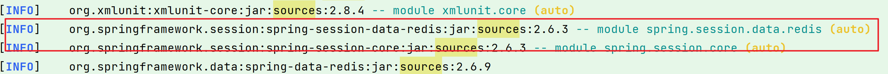

# idea cannot download sources

Sources not found for: org.springframework.session:spring-session-data-redis:2.6.3


场景：
IDEA 在使用某些类方法想看下源码具体是啥时，由于只有 class 反编译的类文件，没有原始 Java 文件，因此想要将源码下载下来，却报了一个错误 Cannot download sources Sources not found for:XXX


解决方法：
可以在 terminal 运行 mvn dependency:resolve -Dclassifier=sources 命令解决

```
mvn dependency:resolve -Dclassifier=sources
```




但是没有用

## 问题所在-maven配置问题

maven镜像配置错误，下列配置需要被注掉

```xml
<!-- <mirror>
      <id>maven-default-http-blocker</id>
      <mirrorOf>external:http:*</mirrorOf>
      <name>Pseudo repository to mirror external repositories initially using HTTP.</name>
      <url>http://0.0.0.0/</url>
      <blocked>true</blocked>
    </mirror> -->
```


```xml
<mirrors>
    
    <!-- <mirror>
      <id>maven-default-http-blocker</id>
      <mirrorOf>external:http:*</mirrorOf>
      <name>Pseudo repository to mirror external repositories initially using HTTP.</name>
      <url>http://0.0.0.0/</url>
      <blocked>true</blocked>
    </mirror> -->
    <mirror>
      <id>alimaven</id>
      <name>aliyun maven</name>
      <url>http://maven.aliyun.com/nexus/content/groups/public</url>
      <mirrorOf>central</mirrorOf>
    </mirror>
  </mirrors>
```

# Maven 中跳过单元测试方法

```shell
mvn clean install -DskipTests
mvn clean install -Dmaven.test.skip=true
```

简介
Maven 构建生命周期为我们提供了对项目执行各种操作，例如验证，清理、打包、测试和部署项目。

而有时候我们需要跳过单元测试，例如，在处理新模块时，还有未通过的单元测试时。在这些情况下，我们可以在打包时跳过测试以避免编译和运行测试时发生的时间。

跳过单元测试的几种方法
通过在 maven 命令中使用 -DskipTests 参数跳过测试的执行。
通过在 maven 命令以执行阶段时使用 maven.test.skip 属性跳过测试的编译。
通过在 pom.xml 中设置 true 跳过测试元素属性。
通过在 pom.xml 中使用 surefire 时，通过在 pom.xml 的插件标签中使用 exclude 元素和要排除的类的名称来排除一些测试类。
1. DskipTests 参数
执行编译测试类，但是跳过执行测试过程。

mvn clean package -DskipTests
1
2. maven.test.skip 属性
完全跳过测试编译，可以在 maven 命令中使用 maven-test-skip 属性。

mvn package -Dmaven.test.skip=true
1
3. 跳过pom中的测试元素
如果您希望跳过某个项目的测试，您可以通过以下方式在项目的 pom.xml 文件的插件标记中将 skipTests 属性指定为 true。

<plugin>
    <groupId>org.apache.maven.plugins</groupId>
    <artifactId>maven-surefire-plugin</artifactId>
    <version>3.0.0-M4</version>
    <configuration>
        <!--跳过测试-->
        <skipTests>true</skipTests>
    </configuration>
</plugin>

4. 默认跳过，然后在必要时覆盖它
在 pom.xml 文件中定义一个属性变量并 初始化为 true , 并在跳过测试元素的节点上指定这个变量。
当需要执行测试时，在命令行中为 maven 执行的命令中指定属性值来覆盖此属性的值。那么，当有必要测试项目，可以这样做，只需在我的命令中通过以下方式将属性 defaultValueOfSkip 的值设置为 false。


```
4. <project>
     <properties>
    <defaultValueOfSkip>true</defaultValueOfSkip>
     </properties>

  <build>
    <plugins>
      <plugin>
        <groupId>org.apache.maven.plugins</groupId>
        <artifactId>maven-surefire-plugin</artifactId>
        <version>3.0.0-M4</version>
        <configuration>
          <skipTests>${defaultValueOfSkip}</skipTests>
        </configuration>
      </plugin>
    </plugins>
  </build>
</project>


```

那么，当有必要测试项目，可以这样做，只需在我的命令中通过以下方式将属性 defaultValueOfSkip 的值设置为 false。

```
mvn package -DdefaultValueOfSkip=false
```


————————————————
原文链接：https://blog.csdn.net/demo_yo/article/details/125592073