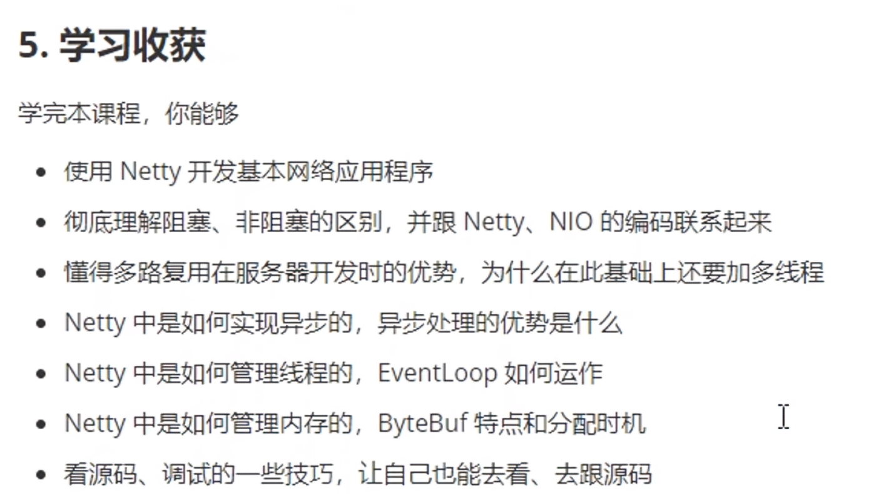

# NIO 基础

non-blocking io 非阻塞 IO

# 1. 三大组件

### 1.1 Channel & Buffer

Java NIO系统的**核心**在于：**通道(Channel)和缓冲区(Buffer)**。通道Channel表示打开到 IO 设备(例如：文件、套接字)的连接。若需要使用 NIO 系统，需要获取用于**连接 IO 设备的通道**以及用于**容纳数据的缓冲区**。然后操作缓冲区，对数据进行处理

简而言之，**通道负责传输，缓冲区负责存储**


channel 有一点类似于 stream，它就是读写数据的**双向通道**，可以从 channel 将数据读入 buffer，也可以将 buffer 的数据写入 channel，而之前的 stream 要么是输入，要么是输出，channel 比 stream 更为底层


**常见的Channel有以下四种**，其中FileChannel主要用于文件传输，其余三种用于网络通信

- FileChannel
- DatagramChannel
- SocketChannel
- ServerSocketChannel

#### buffer

buffer 则用来缓冲读写数据，常见的 buffer 有

**Buffer有以下几种**，其中使用较多的是ByteBuffer

- **ByteBuffer**
  - MappedByteBuffer
  - DirectByteBuffer
  - HeapByteBuffer
- ShortBuffer
- IntBuffer
- LongBuffer
- FloatBuffer
- DoubleBuffer
- CharBuffer

[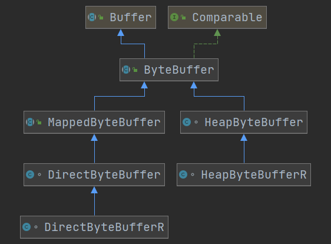](https://nyimapicture.oss-cn-beijing.aliyuncs.com/img/20210412135510.png)


### 2 Selector

selector 单从字面意思不好理解，需要结合服务器的设计演化来理解它的用途

在使用Selector之前，处理socket连接还有以下两种方法

#### 使用多线程技术

为每个连接分别开辟一个线程，分别去处理对应的socke连接

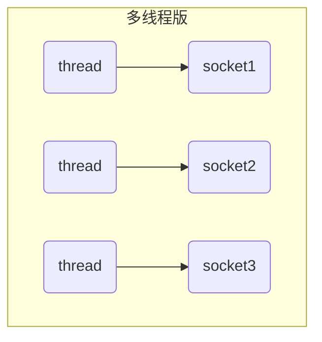
##### ⚠️ 多线程版缺点

这种方法存在以下几个问题

- 内存占用高
  - 每个线程都需要占用一定的内存，当连接较多时，会开辟大量线程，导致占用大量内存
- 线程上下文切换成本高
- 只适合连接数少的场景
  - 连接数过多，会导致创建很多线程，从而出现问题


#### 线程池版设计

使用线程池，让线程池中的线程去处理连接

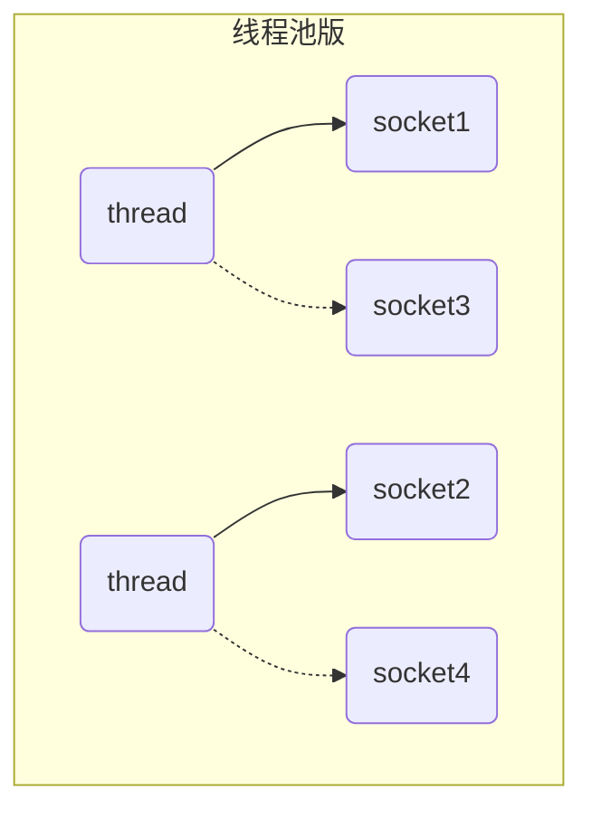
##### ⚠️ 线程池版缺点

这种方法存在以下几个问题

- 阻塞模式下，线程仅能处理一个连接
  - 线程池中的线程获取任务（task）后，**只有当其执行完任务之后（断开连接后），才会去获取并执行下一个任务**
  - 若socke连接一直未断开，则其对应的线程无法处理其他socke连接
- 仅适合**短连接**场景
  - 短连接即建立连接发送请求并响应后就立即断开，使得线程池中的线程可以快速处理其他连接

#### selector 版设计

selector 的作用就是配合**一个线程来管理多个 channel **（fileChannel因为是阻塞式的，所以无法使用selector）**，获取这些 channel 上发生的事件**，这些 channel 工作在**非阻塞模式**下，当一个channel中没有执行任务时，可以去执行其他channel中的任务，不会让线程吊死在一个 channel 上。**适合连接数特别多，但流量低的场景**（low traffic）

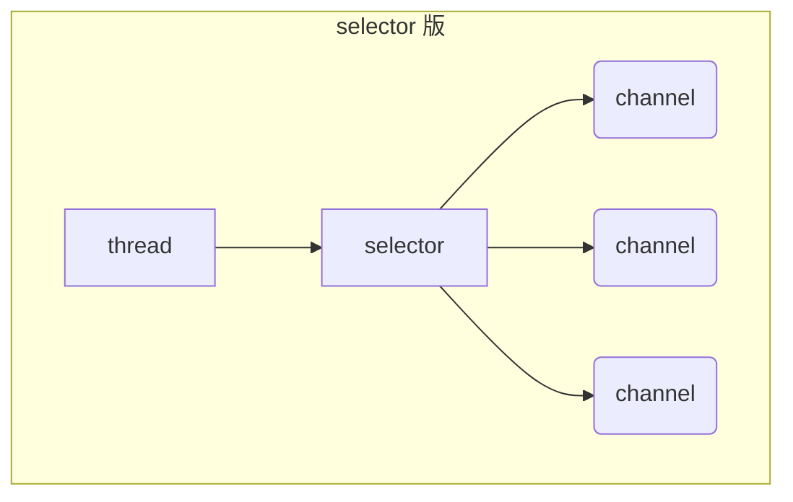


若事件未就绪，调用 selector 的 select() 方法会阻塞线程，直到 channel 发生了读写就绪事件。这些事件就绪后，select 方法就会返回这些事件交给 thread 来处理


## 2、ByteBuffer

### ByteBuffer 正确使用方式

- 向 buffer 写入数据，例如调用 channel.read(buffer)

- 调用 flip() 切换至

  读模式

  - **flip会使得buffer中的limit变为position，position变为0**

- 从 buffer 读取数据，例如调用 buffer.get()

- 调用 clear() 或者compact()切换至

  写模式

  - 调用clear()方法时**position=0，limit变为capacity**
  - 调用compact()方法时，**会将缓冲区中的未读数据压缩到缓冲区前面**

- 重复以上步骤

### 使用案例

**使用ByteBuffer读取文件中的内容**

有一普通文本文件 data.txt，内容为

```
1234567890abcd
```

```java
public class TestByteBuffer {
    public static void main(String[] args) {
        // 获得FileChannel
        try (FileChannel channel = new FileInputStream("stu.txt").getChannel()) {
            // 获得缓冲区
            ByteBuffer buffer = ByteBuffer.allocate(10);
            int hasNext = 0;
            StringBuilder builder = new StringBuilder();
            while((hasNext = channel.read(buffer)) > 0) {
                // 切换模式 limit=position, position=0
                buffer.flip();
                // 当buffer中还有数据时，获取其中的数据
                while(buffer.hasRemaining()) {
                    builder.append((char)buffer.get());
                }
                // 切换模式 position=0, limit=capacity
                buffer.clear();
            }
            System.out.println(builder.toString());
        } catch (IOException e) {
        }
    }
}
```

打印结果

```java
1234567890abcd
```

### 核心属性

字节缓冲区的父类Buffer中有几个核心属性，如下

```java
// Invariants: mark <= position <= limit <= capacity
private int mark = -1;
private int position = 0;
private int limit;
private int capacity;
```

- **capacity**：缓冲区的容量。通过构造函数赋予，一旦设置，无法更改
- **limit**：缓冲区的界限。位于limit 后的数据不可读写。缓冲区的限制不能为负，并且**不能大于其容量**
- **position**：**下一个**读写位置的索引（类似PC）。缓冲区的位置不能为负，并且**不能大于limit**
- **mark**：记录当前position的值。**position被改变后，可以通过调用reset() 方法恢复到mark的位置。**

以上四个属性必须满足以下要求

**mark <= position <= limit <= capacity**

一开始


写模式下，position 是写入位置，limit 等于容量，下图表示写入了 4 个字节后的状态


flip 动作发生后，position 切换为读取位置，limit 切换为读取限制


读取 4 个字节后，状态


clear 动作发生后，状态


compact 方法，是把未读完的部分向前压缩，然后切换至写模式


### ByteBuffer 常见方法

#### 分配空间

可以使用 allocate 方法为 ByteBuffer 分配空间，其它 buffer 类也有该方法

```java
Bytebuffer buf = ByteBuffer.allocate(16);
```


#### 向 buffer 写入数据

有两种办法

* 调用 channel 的 read 方法
* 调用 buffer 自己的 put 方法

```java
int readBytes = channel.read(buf);
```

和

```java
buf.put((byte)127);
```


#### 从 buffer 读取数据

同样有两种办法

* 调用 channel 的 write 方法
* 调用 buffer 自己的 get 方法

```java
int writeBytes = channel.write(buf);
```

和

```java
byte b = buf.get();
```

get 方法会让 position 读指针向后走，如果想重复读取数据

* 可以**调用 rewind 方法将 position 重新置为 0**
* 或者调用 get(int i) 方法获取索引 i 的内容，它不会移动读指针


#### mark 和 reset

mark 是在读取时，做一个标记，即使 position 改变，只要**调用 reset 就能回到 mark 的位置**

> **注意**
>
> **rewind 和 flip 都会清除 mark 位置**


### 核心方法


#### put()方法

- put()方法可以将一个数据放入到缓冲区中。
- 进行该操作后，postition的值会+1，指向下一个可以放入的位置。capacity = limit ，为缓冲区容量的值。

[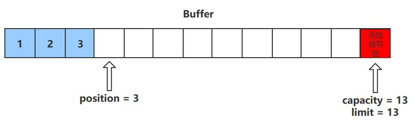](https://nyimapicture.oss-cn-beijing.aliyuncs.com/img/20201109145709.png)

#### flip()方法

- flip()方法会**切换对缓冲区的操作模式**，由写->读 / 读->写
- 进行该操作后
  - 如果是写模式->读模式，position = 0 ， limit 指向最后一个元素的下一个位置，capacity不变
  - 如果是读->写，则恢复为put()方法中的值

[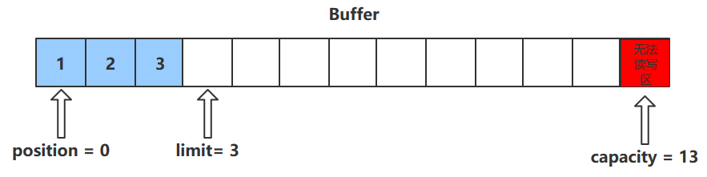](https://nyimapicture.oss-cn-beijing.aliyuncs.com/img/20201109145753.png)

#### get()方法

- get()方法会读取缓冲区中的一个值
- 进行该操作后，position会+1，如果超过了limit则会抛出异常
- **注意：get(i)方法不会改变position的值**

[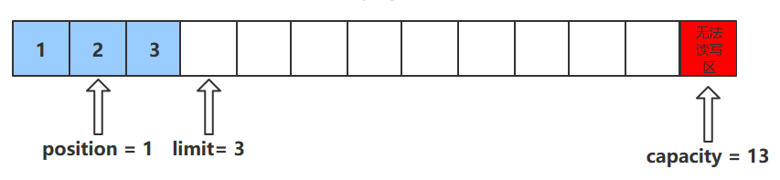](https://nyimapicture.oss-cn-beijing.aliyuncs.com/img/20201109145822.png)

#### rewind()方法

- 该方法**只能在读模式下使用**
- rewind()方法后，会恢复position、limit和capacity的值，变为进行get()前的值

[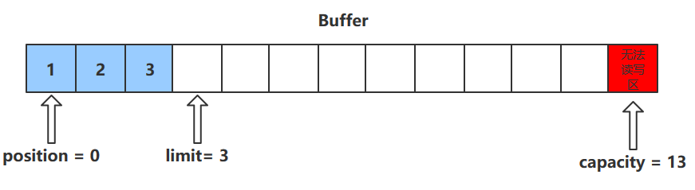](https://nyimapicture.oss-cn-beijing.aliyuncs.com/img/20201109145852.png)

#### clean()方法

- clean()方法会将缓冲区中的各个属性恢复为最初的状态，position = 0, capacity = limit
- **此时缓冲区的数据依然存在**，处于“被遗忘”状态，下次进行写操作时会覆盖这些数据

[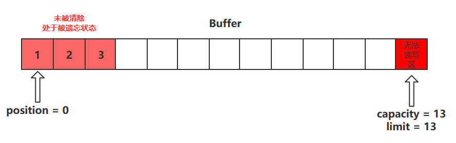](https://nyimapicture.oss-cn-beijing.aliyuncs.com/img/20201109145905.png)

#### mark()和reset()方法

- mark()方法会将postion的值保存到mark属性中
- reset()方法会将position的值改为mark中保存的值

#### compact()方法

**此方法为ByteBuffer的方法，而不是Buffer的方法**

- compact会把未读完的数据向前压缩，然后切换到写模式
- 数据前移后，原位置的值并未清零，写时会**覆盖**之前的值

[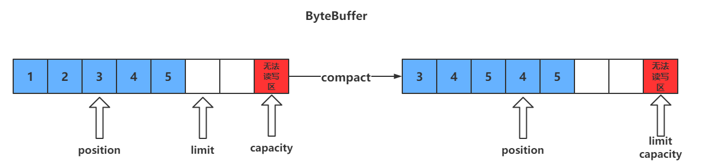](https://nyimapicture.oss-cn-beijing.aliyuncs.com/img/20210412155726.png)

#### clear() VS compact()

clear只是对position、limit、mark进行重置，而compact在对position进行设置，以及limit、mark进行重置的同时，还涉及到数据在内存中拷贝（会调用arraycopy）。**所以compact比clear更耗性能。**但compact能保存你未读取的数据，将新数据追加到为读取的数据之后；而clear则不行，若你调用了clear，则未读取的数据就无法再读取到了

**所以需要根据情况来判断使用哪种方法进行模式切换**

### 方法调用及演示

#### ByteBuffer调试工具类

需要先导入netty依赖

```java
<dependency>
  <groupId>io.netty</groupId>
  <artifactId>netty-all</artifactId>
  <version>4.1.51.Final</version>
</dependency>
```


```java

import java.nio.ByteBuffer;

import io.netty.util.internal.MathUtil;
import io.netty.util.internal.StringUtil;
import io.netty.util.internal.MathUtil.*;


/**
 * @author Panwen Chen
 * @date 2021/4/12 15:59
 */
public class ByteBufferUtil {
    private static final char[] BYTE2CHAR = new char[256];
    private static final char[] HEXDUMP_TABLE = new char[256 * 4];
    private static final String[] HEXPADDING = new String[16];
    private static final String[] HEXDUMP_ROWPREFIXES = new String[65536 >>> 4];
    private static final String[] BYTE2HEX = new String[256];
    private static final String[] BYTEPADDING = new String[16];

    static {
        final char[] DIGITS = "0123456789abcdef".toCharArray();
        for (int i = 0; i < 256; i++) {
            HEXDUMP_TABLE[i << 1] = DIGITS[i >>> 4 & 0x0F];
            HEXDUMP_TABLE[(i << 1) + 1] = DIGITS[i & 0x0F];
        }

        int i;

        // Generate the lookup table for hex dump paddings
        for (i = 0; i < HEXPADDING.length; i++) {
            int padding = HEXPADDING.length - i;
            StringBuilder buf = new StringBuilder(padding * 3);
            for (int j = 0; j < padding; j++) {
                buf.append("   ");
            }
            HEXPADDING[i] = buf.toString();
        }

        // Generate the lookup table for the start-offset header in each row (up to 64KiB).
        for (i = 0; i < HEXDUMP_ROWPREFIXES.length; i++) {
            StringBuilder buf = new StringBuilder(12);
            buf.append(StringUtil.NEWLINE);
            buf.append(Long.toHexString(i << 4 & 0xFFFFFFFFL | 0x100000000L));
            buf.setCharAt(buf.length() - 9, '|');
            buf.append('|');
            HEXDUMP_ROWPREFIXES[i] = buf.toString();
        }

        // Generate the lookup table for byte-to-hex-dump conversion
        for (i = 0; i < BYTE2HEX.length; i++) {
            BYTE2HEX[i] = ' ' + StringUtil.byteToHexStringPadded(i);
        }

        // Generate the lookup table for byte dump paddings
        for (i = 0; i < BYTEPADDING.length; i++) {
            int padding = BYTEPADDING.length - i;
            StringBuilder buf = new StringBuilder(padding);
            for (int j = 0; j < padding; j++) {
                buf.append(' ');
            }
            BYTEPADDING[i] = buf.toString();
        }

        // Generate the lookup table for byte-to-char conversion
        for (i = 0; i < BYTE2CHAR.length; i++) {
            if (i <= 0x1f || i >= 0x7f) {
                BYTE2CHAR[i] = '.';
            } else {
                BYTE2CHAR[i] = (char) i;
            }
        }
    }

    /**
     * 打印所有内容
     * @param buffer
     */
    public static void debugAll(ByteBuffer buffer) {
        int oldlimit = buffer.limit();
        buffer.limit(buffer.capacity());
        StringBuilder origin = new StringBuilder(256);
        appendPrettyHexDump(origin, buffer, 0, buffer.capacity());
        System.out.println("+--------+-------------------- all ------------------------+----------------+");
        System.out.printf("position: [%d], limit: [%d]\n", buffer.position(), oldlimit);
        System.out.println(origin);
        buffer.limit(oldlimit);
    }

    /**
     * 打印可读取内容
     * @param buffer
     */
    public static void debugRead(ByteBuffer buffer) {
        StringBuilder builder = new StringBuilder(256);
        appendPrettyHexDump(builder, buffer, buffer.position(), buffer.limit() - buffer.position());
        System.out.println("+--------+-------------------- read -----------------------+----------------+");
        System.out.printf("position: [%d], limit: [%d]\n", buffer.position(), buffer.limit());
        System.out.println(builder);
    }

    private static void appendPrettyHexDump(StringBuilder dump, ByteBuffer buf, int offset, int length) {
        if (MathUtil.isOutOfBounds(offset, length, buf.capacity())) {
            throw new IndexOutOfBoundsException(
                    "expected: " + "0 <= offset(" + offset + ") <= offset + length(" + length
                            + ") <= " + "buf.capacity(" + buf.capacity() + ')');
        }
        if (length == 0) {
            return;
        }
        dump.append(
                "         +-------------------------------------------------+" +
                        StringUtil.NEWLINE + "         |  0  1  2  3  4  5  6  7  8  9  a  b  c  d  e  f |" +
                        StringUtil.NEWLINE + "+--------+-------------------------------------------------+----------------+");

        final int startIndex = offset;
        final int fullRows = length >>> 4;
        final int remainder = length & 0xF;

        // Dump the rows which have 16 bytes.
        for (int row = 0; row < fullRows; row++) {
            int rowStartIndex = (row << 4) + startIndex;

            // Per-row prefix.
            appendHexDumpRowPrefix(dump, row, rowStartIndex);

            // Hex dump
            int rowEndIndex = rowStartIndex + 16;
            for (int j = rowStartIndex; j < rowEndIndex; j++) {
                dump.append(BYTE2HEX[getUnsignedByte(buf, j)]);
            }
            dump.append(" |");

            // ASCII dump
            for (int j = rowStartIndex; j < rowEndIndex; j++) {
                dump.append(BYTE2CHAR[getUnsignedByte(buf, j)]);
            }
            dump.append('|');
        }

        // Dump the last row which has less than 16 bytes.
        if (remainder != 0) {
            int rowStartIndex = (fullRows << 4) + startIndex;
            appendHexDumpRowPrefix(dump, fullRows, rowStartIndex);

            // Hex dump
            int rowEndIndex = rowStartIndex + remainder;
            for (int j = rowStartIndex; j < rowEndIndex; j++) {
                dump.append(BYTE2HEX[getUnsignedByte(buf, j)]);
            }
            dump.append(HEXPADDING[remainder]);
            dump.append(" |");

            // Ascii dump
            for (int j = rowStartIndex; j < rowEndIndex; j++) {
                dump.append(BYTE2CHAR[getUnsignedByte(buf, j)]);
            }
            dump.append(BYTEPADDING[remainder]);
            dump.append('|');
        }

        dump.append(StringUtil.NEWLINE +
                "+--------+-------------------------------------------------+----------------+");
    }

    private static void appendHexDumpRowPrefix(StringBuilder dump, int row, int rowStartIndex) {
        if (row < HEXDUMP_ROWPREFIXES.length) {
            dump.append(HEXDUMP_ROWPREFIXES[row]);
        } else {
            dump.append(StringUtil.NEWLINE);
            dump.append(Long.toHexString(rowStartIndex & 0xFFFFFFFFL | 0x100000000L));
            dump.setCharAt(dump.length() - 9, '|');
            dump.append('|');
        }
    }

    public static short getUnsignedByte(ByteBuffer buffer, int index) {
        return (short) (buffer.get(index) & 0xFF);
    }
}
```

#### 调用ByteBuffer的方法

```java
public class TestByteBuffer {
    public static void main(String[] args) {
        ByteBuffer buffer = ByteBuffer.allocate(10);
        // 向buffer中写入1个字节的数据
        buffer.put((byte)97);
        // 使用工具类，查看buffer状态
        ByteBufferUtil.debugAll(buffer);

        // 向buffer中写入4个字节的数据
        buffer.put(new byte[]{98, 99, 100, 101});
        ByteBufferUtil.debugAll(buffer);

        // 获取数据
        buffer.flip();
        ByteBufferUtil.debugAll(buffer);
        System.out.println(buffer.get());
        System.out.println(buffer.get());
        ByteBufferUtil.debugAll(buffer);

        // 使用compact切换模式
        buffer.compact();
        ByteBufferUtil.debugAll(buffer);

        // 再次写入
        buffer.put((byte)102);
        buffer.put((byte)103);
        ByteBufferUtil.debugAll(buffer);
    }
}Copy
```

运行结果

```
// 向缓冲区写入了一个字节的数据，此时postition为1
+--------+-------------------- all ------------------------+----------------+
position: [1], limit: [10]
         +-------------------------------------------------+
         |  0  1  2  3  4  5  6  7  8  9  a  b  c  d  e  f |
+--------+-------------------------------------------------+----------------+
|00000000| 61 00 00 00 00 00 00 00 00 00                   |a.........      |
+--------+-------------------------------------------------+----------------+

// 向缓冲区写入四个字节的数据，此时position为5
+--------+-------------------- all ------------------------+----------------+
position: [5], limit: [10]
         +-------------------------------------------------+
         |  0  1  2  3  4  5  6  7  8  9  a  b  c  d  e  f |
+--------+-------------------------------------------------+----------------+
|00000000| 61 62 63 64 65 00 00 00 00 00                   |abcde.....      |
+--------+-------------------------------------------------+----------------+

// 调用flip切换模式，此时position为0，表示从第0个数据开始读取
+--------+-------------------- all ------------------------+----------------+
position: [0], limit: [5]
         +-------------------------------------------------+
         |  0  1  2  3  4  5  6  7  8  9  a  b  c  d  e  f |
+--------+-------------------------------------------------+----------------+
|00000000| 61 62 63 64 65 00 00 00 00 00                   |abcde.....      |
+--------+-------------------------------------------------+----------------+
// 读取两个字节的数据             
97
98
            
// position变为2             
+--------+-------------------- all ------------------------+----------------+
position: [2], limit: [5]
         +-------------------------------------------------+
         |  0  1  2  3  4  5  6  7  8  9  a  b  c  d  e  f |
+--------+-------------------------------------------------+----------------+
|00000000| 61 62 63 64 65 00 00 00 00 00                   |abcde.....      |
+--------+-------------------------------------------------+----------------+
             
// 调用compact切换模式，此时position及其后面的数据被压缩到ByteBuffer前面去了
// 此时position为3，会覆盖之前的数据             
+--------+-------------------- all ------------------------+----------------+
position: [3], limit: [10]
         +-------------------------------------------------+
         |  0  1  2  3  4  5  6  7  8  9  a  b  c  d  e  f |
+--------+-------------------------------------------------+----------------+
|00000000| 63 64 65 64 65 00 00 00 00 00                   |cdede.....      |
+--------+-------------------------------------------------+----------------+
             
// 再次写入两个字节的数据，之前的 0x64 0x65 被覆盖         
+--------+-------------------- all ------------------------+----------------+
position: [5], limit: [10]
         +-------------------------------------------------+
         |  0  1  2  3  4  5  6  7  8  9  a  b  c  d  e  f |
+--------+-------------------------------------------------+----------------+
|00000000| 63 64 65 66 67 00 00 00 00 00                   |cdefg.....      |
+--------+-------------------------------------------------+----------------+Copy
```

### **字符串与ByteBuffer的互转**

#### 方法一

**编码**：字符串调用getByte方法获得byte数组，将byte数组放入ByteBuffer中

**解码**：**先调用ByteBuffer的flip方法，然后通过StandardCharsets的decoder方法解码**

```java
public class Translate {
    public static void main(String[] args) {
        // 准备两个字符串
        String str1 = "hello";
        String str2 = "";


        ByteBuffer buffer1 = ByteBuffer.allocate(16);
        // 通过字符串的getByte方法获得字节数组，放入缓冲区中
        buffer1.put(str1.getBytes());
        ByteBufferUtil.debugAll(buffer1);

        // 将缓冲区中的数据转化为字符串
        // 切换模式
        buffer1.flip();
        
        // 通过StandardCharsets解码，获得CharBuffer，再通过toString获得字符串
        str2 = StandardCharsets.UTF_8.decode(buffer1).toString();
        System.out.println(str2);
        ByteBufferUtil.debugAll(buffer1);
    }
}
```

运行结果

```
+--------+-------------------- all ------------------------+----------------+
position: [5], limit: [16]
         +-------------------------------------------------+
         |  0  1  2  3  4  5  6  7  8  9  a  b  c  d  e  f |
+--------+-------------------------------------------------+----------------+
|00000000| 68 65 6c 6c 6f 00 00 00 00 00 00 00 00 00 00 00 |hello...........|
+--------+-------------------------------------------------+----------------+
hello
+--------+-------------------- all ------------------------+----------------+
position: [5], limit: [5]
         +-------------------------------------------------+
         |  0  1  2  3  4  5  6  7  8  9  a  b  c  d  e  f |
+--------+-------------------------------------------------+----------------+
|00000000| 68 65 6c 6c 6f 00 00 00 00 00 00 00 00 00 00 00 |hello...........|
+--------+-------------------------------------------------+----------------+Copy
```

#### 方法二

**编码**：通过StandardCharsets的encode方法获得ByteBuffer，此时获得的ByteBuffer为读模式，无需通过flip切换模式

**解码**：通过StandardCharsets的decoder方法解码

```java
public class Translate {
    public static void main(String[] args) {
        // 准备两个字符串
        String str1 = "hello";
        String str2 = "";

        // 通过StandardCharsets的encode方法获得ByteBuffer
        // 此时获得的ByteBuffer为读模式，无需通过flip切换模式
        ByteBuffer buffer1 = StandardCharsets.UTF_8.encode(str1);
        ByteBufferUtil.debugAll(buffer1);

        // 将缓冲区中的数据转化为字符串
        // 通过StandardCharsets解码，获得CharBuffer，再通过toString获得字符串
        str2 = StandardCharsets.UTF_8.decode(buffer1).toString();
        System.out.println(str2);
        ByteBufferUtil.debugAll(buffer1);
    }
}
```

运行结果

```
+--------+-------------------- all ------------------------+----------------+
position: [0], limit: [5]
         +-------------------------------------------------+
         |  0  1  2  3  4  5  6  7  8  9  a  b  c  d  e  f |
+--------+-------------------------------------------------+----------------+
|00000000| 68 65 6c 6c 6f                                  |hello           |
+--------+-------------------------------------------------+----------------+
hello
+--------+-------------------- all ------------------------+----------------+
position: [5], limit: [5]
         +-------------------------------------------------+
         |  0  1  2  3  4  5  6  7  8  9  a  b  c  d  e  f |
+--------+-------------------------------------------------+----------------+
|00000000| 68 65 6c 6c 6f                                  |hello           |
+--------+-------------------------------------------------+----------------+Copy
```

#### **方法三**

**编码**：字符串调用getByte()方法获得字节数组，将字节数组传给**ByteBuffer的wrap()方法**，通过该方法获得ByteBuffer。**同样无需调用flip方法切换为读模式**

**解码**：通过StandardCharsets的decoder方法解码

```java
public class Translate {
    public static void main(String[] args) {
        // 准备两个字符串
        String str1 = "hello";
        String str2 = "";

        // 通过StandardCharsets的encode方法获得ByteBuffer
        // 此时获得的ByteBuffer为读模式，无需通过flip切换模式
        ByteBuffer buffer1 = ByteBuffer.wrap(str1.getBytes());
        ByteBufferUtil.debugAll(buffer1);

        // 将缓冲区中的数据转化为字符串
        // 通过StandardCharsets解码，获得CharBuffer，再通过toString获得字符串
        str2 = StandardCharsets.UTF_8.decode(buffer1).toString();
        System.out.println(str2);
        ByteBufferUtil.debugAll(buffer1);
    }
}Copy
```

运行结果

```
+--------+-------------------- all ------------------------+----------------+
position: [0], limit: [5]
         +-------------------------------------------------+
         |  0  1  2  3  4  5  6  7  8  9  a  b  c  d  e  f |
+--------+-------------------------------------------------+----------------+
|00000000| 68 65 6c 6c 6f                                  |hello           |
+--------+-------------------------------------------------+----------------+
hello
+--------+-------------------- all ------------------------+----------------+
position: [5], limit: [5]
         +-------------------------------------------------+
         |  0  1  2  3  4  5  6  7  8  9  a  b  c  d  e  f |
+--------+-------------------------------------------------+----------------+
|00000000| 68 65 6c 6c 6f                                  |hello           |
+--------+-------------------------------------------------+----------------+Copy
```


### ⚠️ Buffer 的线程安全

> Buffer 是**非线程安全的**


### 2.4 Scattering Reads

分散读取，有一个文本文件 words.txt

```
onetwothree
```

使用如下方式读取，可以将数据填充至多个 buffer

```java
public class TestScatteringReads {
    public static void main(String[] args) {
        try (FileChannel channel = new RandomAccessFile("words.txt", "r").getChannel()) {
            ByteBuffer b1 = ByteBuffer.allocate(3);
            ByteBuffer b2 = ByteBuffer.allocate(3);
            ByteBuffer b3 = ByteBuffer.allocate(5);
            channel.read(new ByteBuffer[]{b1, b2, b3});
            b1.flip();
            b2.flip();
            b3.flip();
            debugAll(b1);
            debugAll(b2);
            debugAll(b3);
        } catch (IOException e) {
        }
    }
}
```

结果

```
+--------+-------------------- all ------------------------+----------------+
position: [0], limit: [3]
         +-------------------------------------------------+
         |  0  1  2  3  4  5  6  7  8  9  a  b  c  d  e  f |
+--------+-------------------------------------------------+----------------+
|00000000| 6f 6e 65                                        |one             |
+--------+-------------------------------------------------+----------------+
+--------+-------------------- all ------------------------+----------------+
position: [0], limit: [3]
         +-------------------------------------------------+
         |  0  1  2  3  4  5  6  7  8  9  a  b  c  d  e  f |
+--------+-------------------------------------------------+----------------+
|00000000| 74 77 6f                                        |two             |
+--------+-------------------------------------------------+----------------+
+--------+-------------------- all ------------------------+----------------+
position: [0], limit: [5]
         +-------------------------------------------------+
         |  0  1  2  3  4  5  6  7  8  9  a  b  c  d  e  f |
+--------+-------------------------------------------------+----------------+
|00000000| 74 68 72 65 65                                  |three           |
+--------+-------------------------------------------------+----------------+

Process finished with exit code 0

```


### 2.5 Gathering Writes

使用如下方式写入，可以将多个 buffer 的数据填充至 channel

```java
public class TestGatheringWrites {
    public static void main(String[] args) {
        ByteBuffer b1 = StandardCharsets.UTF_8.encode("hello");
        ByteBuffer b2 = StandardCharsets.UTF_8.encode("world");
        ByteBuffer b3 = StandardCharsets.UTF_8.encode("你好");

        try (FileChannel channel = new RandomAccessFile("words2.txt", "rw").getChannel()) {
            channel.write(new ByteBuffer[]{b1, b2, b3});
        } catch (IOException e) {
        }
    }
}
```

文件内容

```
helloworld你好
```


### 练习——粘包与半包

#### 现象

网络上有多条数据发送给服务端，数据之间使用 \n 进行分隔
但由于某种原因这些数据在接收时，被进行了重新组合，例如原始数据有3条为

- Hello,world\n
- I’m Nyima\n
- How are you?\n

变成了下面的两个 byteBuffer (粘包，半包)

- Hello,world\nI’m Nyima\nHo
- w are you?\n

#### 出现原因

**粘包**

发送方在发送数据时，并不是一条一条地发送数据，而是**将数据整合在一起**，当数据达到一定的数量后再一起发送。这就会导致多条信息被放在一个缓冲区中被一起发送出去

**半包**

接收方的缓冲区的大小是有限的，当接收方的缓冲区满了以后，就需要**将信息截断**，等缓冲区空了以后再继续放入数据。这就会发生一段完整的数据最后被截断的现象

#### 解决办法

- 通过get(index)方法遍历ByteBuffer，遇到分隔符时进行处理。

  注意

  ：get(index)不会改变position的值

  - 记录该段数据长度，以便于申请对应大小的缓冲区
  - 将缓冲区的数据通过get()方法写入到target中

- 调用**compact方法**切换模式，因为缓冲区中可能还有未读的数据

```java
public class ByteBufferDemo {
    public static void main(String[] args) {
        ByteBuffer buffer = ByteBuffer.allocate(32);
        // 模拟粘包+半包
        buffer.put("Hello,world\nI'm Nyima\nHo".getBytes());
        // 调用split函数处理
        split(buffer);
        buffer.put("w are you?\n".getBytes());
        split(buffer);
    }

    private static void split(ByteBuffer buffer) {
        // 切换为读模式
        buffer.flip();
        for(int i = 0; i < buffer.limit(); i++) {

            // 遍历寻找分隔符
            // get(i)不会移动position
            if (buffer.get(i) == '\n') {
                // 缓冲区长度
                int length = i+1-buffer.position();
                ByteBuffer target = ByteBuffer.allocate(length);
                // 将前面的内容写入target缓冲区
                for(int j = 0; j < length; j++) {
                    // 将buffer中的数据写入target中
                    target.put(buffer.get());
                }
                // 打印查看结果
                ByteBufferUtil.debugAll(target);
            }
        }
        // 切换为写模式，但是缓冲区可能未读完，这里需要使用compact
        buffer.compact();
    }
}
```

运行结果

```
+--------+-------------------- all ------------------------+----------------+
position: [12], limit: [12]
         +-------------------------------------------------+
         |  0  1  2  3  4  5  6  7  8  9  a  b  c  d  e  f |
+--------+-------------------------------------------------+----------------+
|00000000| 48 65 6c 6c 6f 2c 77 6f 72 6c 64 0a             |Hello,world.    |
+--------+-------------------------------------------------+----------------+
+--------+-------------------- all ------------------------+----------------+
position: [10], limit: [10]
         +-------------------------------------------------+
         |  0  1  2  3  4  5  6  7  8  9  a  b  c  d  e  f |
+--------+-------------------------------------------------+----------------+
|00000000| 49 27 6d 20 4e 79 69 6d 61 0a                   |I'm Nyima.      |
+--------+-------------------------------------------------+----------------+
+--------+-------------------- all ------------------------+----------------+
position: [13], limit: [13]
         +-------------------------------------------------+
         |  0  1  2  3  4  5  6  7  8  9  a  b  c  d  e  f |
+--------+-------------------------------------------------+----------------+
|00000000| 48 6f 77 20 61 72 65 20 79 6f 75 3f 0a          |How are you?.   |
+--------+-------------------------------------------------+----------------+Copy
```


# 二、文件编程

## 1、FileChannel

### FileChannel工作模式

FileChannel**只能在阻塞模式下工作**，所以无法搭配Selector

### 获取

不能直接打开 FileChannel，**必须**通过 FileInputStream、FileOutputStream 或者 RandomAccessFile 来获取 FileChannel，它们都有 getChannel 方法

- 通过 FileInputStream 获取的 channel **只能读**
- 通过 FileOutputStream 获取的 channel **只能写**
- 通过 RandomAccessFile 是否能读写**根据构造 RandomAccessFile 时的读写模式决定**

### 读取

通过 FileInputStream 获取channel，通过read方法将数据写入到ByteBuffer中

read方法的返回值表示读到了多少字节，若读到了文件末尾则返回-1

```java
int readBytes = channel.read(buffer);
```

**可根据返回值判断是否读取完毕**

```java
while(channel.read(buffer) > 0) {
    // 进行对应操作
    ...
}
```

### 写入

因为channel也是有大小的，所以 write 方法并不能保证一次将 buffer 中的内容全部写入 channel。必须**需要按照以下规则进行写入**

```java
ByteBuffer buffer = ...;
buffer.put(...); // 存入数据
buffer.flip();   // 切换读模式

// 通过hasRemaining()方法查看缓冲区中是否还有数据未写入到通道中
while(buffer.hasRemaining()) {
	channel.write(buffer);
}Copy
```

### 关闭

通道需要close，一般情况通过try-with-resource进行关闭，**最好使用以下方法获取strea以及channel，避免某些原因使得资源未被关闭**

channel 必须关闭，不过调用了 FileInputStream、FileOutputStream 或者 RandomAccessFile 的 close 方法会间接地调用 channel 的 close 方法

```java
public class TestChannel {
    public static void main(String[] args) throws IOException {
        try (FileInputStream fis = new FileInputStream("stu.txt");
             FileOutputStream fos = new FileOutputStream("student.txt");
             FileChannel inputChannel = fis.getChannel();
             FileChannel outputChannel = fos.getChannel()) {
            
            // 执行对应操作
            ...
                
        }
    }
}
```

### 位置

**position**

channel也拥有一个保存读取数据位置的属性，即position

```java
long pos = channel.position();
```

可以通过position(int pos)设置channel中position的值

```java
long newPos = ...;
channel.position(newPos);
```

设置当前位置时，如果设置为文件的末尾

- 这时读取会返回 -1
- 这时写入，会追加内容，但要注意如果 position 超过了文件末尾，再写入时在新内容和原末尾之间会有空洞（00）

#### 大小

使用 size 方法获取文件的大小

### 强制写入

操作系统出于性能的考虑，会将数据缓存，不是立刻写入磁盘，而是等到缓存满了以后将所有数据一次性的写入磁盘。可以调用 **force(true)** 方法将文件内容和元数据（文件的权限等信息）立刻写入磁盘

## 2、两个Channel传输数据

### transferTo方法

使用transferTo方法可以快速、高效地将一个channel中的数据传输到另一个channel中，但**一次只能传输2G的内容**

transferTo底层使用了零拷贝技术

```java
public class TestChannel {
    public static void main(String[] args){
        try (FileInputStream fis = new FileInputStream("stu.txt");
             FileOutputStream fos = new FileOutputStream("student.txt");
             FileChannel inputChannel = fis.getChannel();
             FileChannel outputChannel = fos.getChannel()) {
            // 参数：inputChannel的起始位置，传输数据的大小，目的channel
            // 返回值为传输的数据的字节数
            // transferTo一次只能传输2G的数据
            inputChannel.transferTo(0, inputChannel.size(), outputChannel);
        } catch (IOException e) {
            e.printStackTrace();
        }
    }
}
```

当传输的文件**大于2G**时，需要使用以下方法进行多次传输

```java
public class TestChannel {
    public static void main(String[] args){
        try (FileInputStream fis = new FileInputStream("stu.txt");
             FileOutputStream fos = new FileOutputStream("student.txt");
             FileChannel inputChannel = fis.getChannel();
             FileChannel outputChannel = fos.getChannel()) {
            long size = inputChannel.size();
            long capacity = inputChannel.size();
            // 分多次传输
            while (capacity > 0) {
                // transferTo返回值为传输了的字节数
                capacity -= inputChannel.transferTo(size-capacity, capacity, outputChannel);
            }
        } catch (IOException e) {
            e.printStackTrace();
        }
    }
}
```

## 3、Path与Paths

- Path 用来表示文件路径
- Paths 是工具类，用来获取 Path 实例

```java
Path source = Paths.get("1.txt"); // 相对路径 不带盘符 使用 user.dir 环境变量来定位 1.txt

Path source = Paths.get("d:\\1.txt"); // 绝对路径 代表了  d:\1.txt 反斜杠需要转义

Path source = Paths.get("d:/1.txt"); // 绝对路径 同样代表了  d:\1.txt

Path projects = Paths.get("d:\\data", "projects"); // 代表了  d:\data\projects
```

- `.` 代表了当前路径
- `..` 代表了上一级路径

例如目录结构如下

```java
d:
	|- data
		|- projects
			|- a
			|- b
```

代码

```java
Path path = Paths.get("d:\\data\\projects\\a\\..\\b");
System.out.println(path);
System.out.println(path.normalize()); // 正常化路径 会去除 . 以及 ..
```

输出结果为

```java
d:\data\projects\a\..\b
d:\data\projects\b
```

## 4、Files

### 查找

检查文件是否存在

```java
Path path = Paths.get("helloword/data.txt");
System.out.println(Files.exists(path));
```

### 创建

创建**一级目录**

```java
Path path = Paths.get("helloword/d1");
Files.createDirectory(path);
```

- 如果目录已存在，会抛异常 FileAlreadyExistsException
- 不能一次创建多级目录，否则会抛异常 NoSuchFileException

创建**多级目录用**

```java
Path path = Paths.get("helloword/d1/d2");
Files.createDirectories(path);
```

### 拷贝及移动

#### **拷贝文件**

```
Path source = Paths.get("helloword/data.txt");
Path target = Paths.get("helloword/target.txt");

Files.copy(source, target);
```

- 如果文件已存在，会抛异常 FileAlreadyExistsException

如果希望用 source **覆盖**掉 target，需要用 StandardCopyOption 来控制

```java
Files.copy(source, target, StandardCopyOption.REPLACE_EXISTING);
```

#### 移动文件

```java
Path source = Paths.get("helloword/data.txt");
Path target = Paths.get("helloword/data.txt");

Files.move(source, target, StandardCopyOption.ATOMIC_MOVE);
```

- **StandardCopyOption.ATOMIC_MOVE 保证文件移动的原子性**

### 删除

删除文件

```java
Path target = Paths.get("helloword/target.txt");

Files.delete(target);
```

- 如果文件不存在，会抛异常 NoSuchFileException

删除目录

```java
Path target = Paths.get("helloword/d1");

Files.delete(target);
```

- 如果**目录还有内容**，会抛异常 DirectoryNotEmptyException

### 遍历

可以**使用Files工具类中的walkFileTree(Path, FileVisitor)方法**，其中需要传入两个参数

- Path：文件起始路径

- FileVisitor：文件访问器，

  使用访问者模式

  - 接口的实现类

    SimpleFileVisitor

    有四个方法

    - preVisitDirectory：访问目录前的操作
    - visitFile：访问文件的操作
    - visitFileFailed：访问文件失败时的操作
    - postVisitDirectory：访问目录后的操作

```java
public class TestWalkFileTree {
    public static void main(String[] args) throws IOException {
        Path path = Paths.get("F:\\JDK 8");
        // 文件目录数目
        AtomicInteger dirCount = new AtomicInteger();
        // 文件数目
        AtomicInteger fileCount = new AtomicInteger();
        Files.walkFileTree(path, new SimpleFileVisitor<Path>(){
            @Override
            public FileVisitResult preVisitDirectory(Path dir, BasicFileAttributes attrs) throws IOException {
                System.out.println("===>"+dir);
                // 增加文件目录数
                dirCount.incrementAndGet();
                return super.preVisitDirectory(dir, attrs);
            }

            @Override
            public FileVisitResult visitFile(Path file, BasicFileAttributes attrs) throws IOException {
                System.out.println(file);
                // 增加文件数
                fileCount.incrementAndGet();
                return super.visitFile(file, attrs);
            }
        });
        // 打印数目
        System.out.println("文件目录数:"+dirCount.get());
        System.out.println("文件数:"+fileCount.get());
    }
}
```

运行结果如下

```java
...
===>F:\JDK 8\lib\security\policy\unlimited
F:\JDK 8\lib\security\policy\unlimited\local_policy.jar
F:\JDK 8\lib\security\policy\unlimited\US_export_policy.jar
F:\JDK 8\lib\security\trusted.libraries
F:\JDK 8\lib\sound.properties
F:\JDK 8\lib\tzdb.dat
F:\JDK 8\lib\tzmappings
F:\JDK 8\LICENSE
F:\JDK 8\README.txt
F:\JDK 8\release
F:\JDK 8\THIRDPARTYLICENSEREADME-JAVAFX.txt
F:\JDK 8\THIRDPARTYLICENSEREADME.txt
F:\JDK 8\Welcome.html
文件目录数:23
文件数:279
```

### 删除多级目录

```java
Path path = Paths.get("d:\\a");
Files.walkFileTree(path, new SimpleFileVisitor<Path>(){
    @Override
    public FileVisitResult visitFile(Path file, BasicFileAttributes attrs) 
        throws IOException {
        Files.delete(file);
        return super.visitFile(file, attrs);
    }

    @Override
    public FileVisitResult postVisitDirectory(Path dir, IOException exc) 
        throws IOException {
        Files.delete(dir);
        return super.postVisitDirectory(dir, exc);
    }
});
```


##### ⚠️ 删除很危险

> 删除是危险操作，确保要递归删除的文件夹没有重要内容


### 拷贝多级目录

```java
long start = System.currentTimeMillis();
String source = "D:\\Snipaste-1.16.2-x64";
String target = "D:\\Snipaste-1.16.2-x64aaa";

Files.walk(Paths.get(source)).forEach(path -> {
    try {
        String targetName = path.toString().replace(source, target);
        // 是目录
        if (Files.isDirectory(path)) {
            Files.createDirectory(Paths.get(targetName));
        }
        // 是普通文件
        else if (Files.isRegularFile(path)) {
            Files.copy(path, Paths.get(targetName));
        }
    } catch (IOException e) {
        e.printStackTrace();
    }
});
long end = System.currentTimeMillis();
System.out.println(end - start);
```

# 三、网络编程

## 1、阻塞

- 阻塞模式下，相关方法都会导致线程暂停
  - ServerSocketChannel.accept 会在**没有连接建立时**让线程暂停
  - SocketChannel.read 会在**通道中没有数据可读时**让线程暂停
  - 阻塞的表现其实就是线程暂停了，暂停期间不会占用 cpu，但线程相当于闲置
- 单线程下，阻塞方法之间相互影响，几乎不能正常工作，需要多线程支持
- 但多线程下，有新的问题，体现在以下方面
  - 32 位 jvm 一个线程 320k，64 位 jvm 一个线程 1024k，如果连接数过多，必然导致 OOM，并且线程太多，反而会因为频繁上下文切换导致性能降低
  - 可以采用线程池技术来减少线程数和线程上下文切换，但治标不治本，如果有很多连接建立，但长时间 inactive，会阻塞线程池中所有线程，因此不适合长连接，只适合短连接

**服务端代码**

```java
public class Server {
    public static void main(String[] args) {
        // 创建缓冲区
        ByteBuffer buffer = ByteBuffer.allocate(16);
        // 获得服务器通道
        try(ServerSocketChannel server = ServerSocketChannel.open()) {
            // 为服务器通道绑定端口
            server.bind(new InetSocketAddress(8080));
            // 用户存放连接的集合
            ArrayList<SocketChannel> channels = new ArrayList<>();
            // 循环接收连接
            while (true) {
                System.out.println("before connecting...");
                // 没有连接时，会阻塞线程
                SocketChannel socketChannel = server.accept();
                System.out.println("after connecting...");
                channels.add(socketChannel);
                // 循环遍历集合中的连接
                for(SocketChannel channel : channels) {
                    System.out.println("before reading");
                    // 处理通道中的数据
                    // 当通道中没有数据可读时，会阻塞线程
                    channel.read(buffer);
                    buffer.flip();
                    ByteBufferUtil.debugRead(buffer);
                    buffer.clear();
                    System.out.println("after reading");
                }
            }
        } catch (IOException e) {
            e.printStackTrace();
        }
    }
}
```

客户端代码

```java
public class Client {
    public static void main(String[] args) {
        try (SocketChannel socketChannel = SocketChannel.open()) {
            // 建立连接
            socketChannel.connect(new InetSocketAddress("localhost", 8080));
            System.out.println("waiting...");
        } catch (IOException e) {
            e.printStackTrace();
        }
    }
}
```

运行结果

- 客户端-服务器建立连接前：服务器端因accept阻塞

[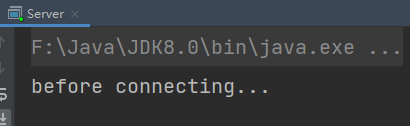](https://nyimapicture.oss-cn-beijing.aliyuncs.com/img/20210413213318.png)

- 客户端-服务器建立连接后，客户端发送消息前：服务器端因通道为空被阻塞

[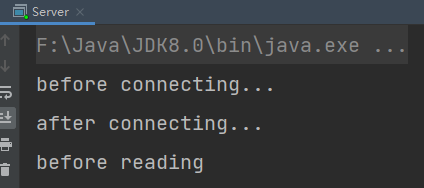](https://nyimapicture.oss-cn-beijing.aliyuncs.com/img/20210413213446.png)

- 客户端发送数据后，服务器处理通道中的数据。再次进入循环时，再次被accept阻塞

[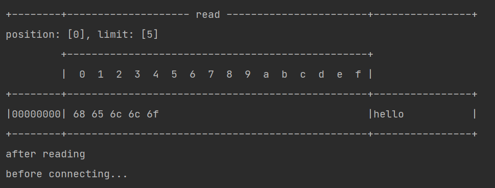](https://nyimapicture.oss-cn-beijing.aliyuncs.com/img/20210413214109.png)

- 之前的客户端再次发送消息**，服务器端因为被accept阻塞**，无法处理之前客户端发送到通道中的信息

[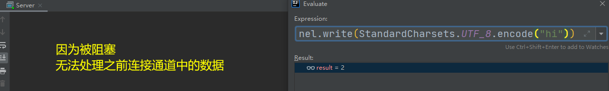](https://nyimapicture.oss-cn-beijing.aliyuncs.com/img/20210413214505.png)

## 2、非阻塞

* 非阻塞模式下，相关方法都会不会让线程暂停
  * 在 ServerSocketChannel.accept 在没有连接建立时，会返回 null，继续运行
  * SocketChannel.read 在没有数据可读时，会返回 0，但线程不必阻塞，可以去执行其它 SocketChannel 的 read 或是去执行 ServerSocketChannel.accept 
  * 写数据时，线程只是等待数据写入 Channel 即可，无需等 Channel 通过网络把数据发送出去
* 但非阻塞模式下，即使没有连接建立，和可读数据，线程仍然在不断运行，白白浪费了 cpu
* 数据复制过程中，线程实际还是阻塞的（AIO 改进的地方）

**设置非阻塞**

- 可以通过ServerSocketChannel的configureBlocking(**false**)方法将**获得连接设置为非阻塞的**。此时若没有连接，accept会返回null
- 可以通过SocketChannel的configureBlocking(**false**)方法将从通道中**读取数据设置为非阻塞的**。若此时通道中没有数据可读，read会返回-1

服务器代码如下

> 服务器端，客户端代码不变

```java
// 使用 nio 来理解非阻塞模式, 单线程
public class Server {
    public static void main(String[] args) {
        // 0. 创建缓冲区 ByteBuffer
        ByteBuffer buffer = ByteBuffer.allocate(16);
        // 1. 创建了服务器 获得服务器通道
        try(ServerSocketChannel server = ServerSocketChannel.open()) {
            // 设置为非阻塞模式，没有连接时返回null，不会阻塞线程
            server.configureBlocking(false);
            //2. 为服务器通道绑定端口
            server.bind(new InetSocketAddress(8080));
            // 3. 连接集合   用户存放连接的集合
            ArrayList<SocketChannel> channels = new ArrayList<>();
            // 循环接收连接
            while (true) {
                // 4. accept 建立与客户端连接， SocketChannel 用来与客户端之间通信
                //非阻塞，线程还会继续运行，如果没有连接建立，但sc是null
                SocketChannel socketChannel = server.accept();
                // 通道不为空时才将连接放入到集合中
                if (socketChannel != null) {
                    System.out.println("after connecting...");
                    // 设置为非阻塞模式，若通道中没有数据，会返回0，不会阻塞线程
                    channel.configureBlocking(false);
                    channels.add(socketChannel);
                }
                // 循环遍历集合中的连接
                for(SocketChannel channel : channels) {
                    //  5. 接收客户端发送的数据 处理通道中的数据
                    
                    int read = channel.read(buffer);// 非阻塞，线程仍然会继续运行，如果没有读到数据，read 返回 0
                    if(read > 0) {
                        buffer.flip();
                        ByteBufferUtil.debugRead(buffer);
                        buffer.clear();
                        System.out.println("after reading");
                    }
                }
            }
        } catch (IOException e) {
            e.printStackTrace();
        }
    }
}
```

这样写存在一个问题，因为设置为了非阻塞，会**一直执行while(true)中的代码，CPU一直处于忙碌状态**，会使得性能变低，所以实际情况中不使用这种方法处理请求

## 3、Selector

### 多路复用

单线程可以**配合 Selector 完成对多个 Channel 可读写事件的监控**，这称之为多路复用

- **多路复用仅针对网络 IO**，普通文件 IO **无法**利用多路复用
- 如果不用 Selector 的非阻塞模式，线程大部分时间都在做无用功，而 Selector 能够保证
  - 有可连接事件时才去连接
  - 有可读事件才去读取
  - 有可写事件才去写入
    - 限于网络传输能力，Channel 未必时时可写，一旦 Channel 可写，会触发 Selector 的可写事件


好处

* 一个线程配合 selector 就可以监控多个 channel 的事件，事件发生线程才去处理。避免非阻塞模式下所做无用功
* 让这个线程能够被充分利用
* 节约了线程的数量
* 减少了线程上下文切换

### 创建

```java
Selector selector = Selector.open();
```


### 绑定 Channel 事件

也称之为**注册事件**，绑定的事件 selector 才会关心 

```java
channel.configureBlocking(false);
SelectionKey key = channel.register(selector, 绑定事件);
```

* channel 必须工作在非阻塞模式
* FileChannel 没有非阻塞模式，因此不能配合 selector 一起使用
* 绑定的事件类型可以有
  * connect - 客户端连接成功时触发
  * accept - 服务器端成功接受连接时触发
  * read - **数据可读**入时触发，有因为接收能力弱，数据暂不能读入的情况
  * write - **数据可写**出时触发，有因为发送能力弱，数据暂不能写出的情况


### 监听 Channel 事件

可以通过下面三种方法来监听是否有事件发生，方法的返回值代表有多少 channel 发生了事件

方法1，阻塞直到绑定事件发生

```java
int count = selector.select();
```


方法2，阻塞直到绑定事件发生，或是超时（时间单位为 ms）

```java
int count = selector.select(long timeout);
```


方法3，不会阻塞，也就是不管有没有事件，立刻返回，自己根据返回值检查是否有事件

```java
int count = selector.selectNow();
```


### 💡 select 何时不阻塞

> * 事件发生时
>   * 客户端发起连接请求，会触发 accept 事件
>   * 客户端发送数据过来，客户端正常、异常关闭时，都会触发 read 事件，另外如果发送的数据大于 buffer 缓冲区，会触发多次读取事件
>   * channel 可写，会触发 write 事件
>   * 在 linux 下 nio bug 发生时
> * 调用 selector.wakeup()
> * 调用 selector.close()
> * selector 所在线程 interrupt

```
 select 在事件未处理时，它不会阻塞, 事件发生后要么处理，要么取消，不能置之不理
```


## 4、处理 accept 事件


客户端代码为

```java
public class Client {
    public static void main(String[] args) {
        try (Socket socket = new Socket("localhost", 8080)) {
            System.out.println(socket);
            socket.getOutputStream().write("world".getBytes());
            System.in.read();
        } catch (IOException e) {
            e.printStackTrace();
        }
    }
}
```

要使用Selector实现多路复用，服务端代码如下改进

```java
public class SelectServer {
    public static void main(String[] args) {
        ByteBuffer buffer = ByteBuffer.allocate(16);
        // 获得服务器通道
        try(ServerSocketChannel server = ServerSocketChannel.open()) {
            server.bind(new InetSocketAddress(8080));
            // 创建选择器
            Selector selector = Selector.open();
            
            // 通道必须设置为非阻塞模式
            server.configureBlocking(false);
            // 将通道注册到选择器中，并设置感兴趣的事件
            server.register(selector, SelectionKey.OP_ACCEPT);
            while (true) {
                // 若没有事件就绪，线程会被阻塞，反之不会被阻塞。从而避免了CPU空转
                // 返回值为就绪的事件个数
                int ready = selector.select();
                System.out.println("selector ready counts : " + ready);
                
                // 获取所有事件
                Set<SelectionKey> selectionKeys = selector.selectedKeys();
                
                // 使用迭代器遍历事件
                Iterator<SelectionKey> iterator = selectionKeys.iterator();
                while (iterator.hasNext()) {
                    SelectionKey key = iterator.next();
                    
                    // 判断key的类型
                    if(key.isAcceptable()) {
                        // 获得key对应的channel
                        ServerSocketChannel channel = (ServerSocketChannel) key.channel();
                        System.out.println("before accepting...");
                        
        				// 获取连接并处理，而且是必须处理，否则需要取消
                        SocketChannel socketChannel = channel.accept();
                        System.out.println("after accepting...");
                        
                        // 处理完毕后移除
                        iterator.remove();
                    }
                }
            }
        } catch (IOException e) {
            e.printStackTrace();
        }
    }
}
```

#### 为什么要移除事件

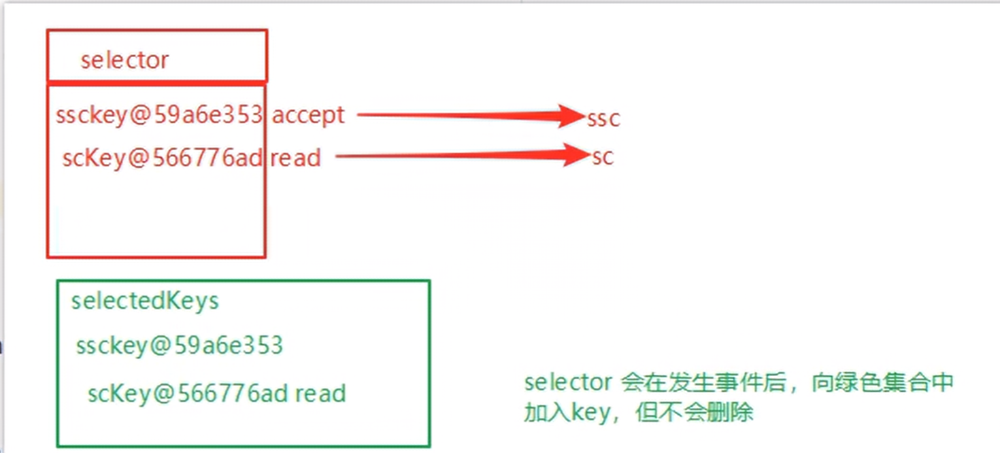

#### 💡 事件发生后能否不处理

> 事件发生后，要么处理，要么取消（cancel），不能什么都不做，否则下次该事件仍会触发，这是因为 nio 底层使用的是水平触发


**步骤解析**

- 获得选择器Selector

```
Selector selector = Selector.open();
```

- 将通道设置为非阻塞模式，并注册到选择器中，并设置感兴趣的事件

  - channel 必须工作在非阻塞模式

  - FileChannel 没有非阻塞模式，因此不能配合 selector 一起使用

  - 绑定的事件类型可以有

    - connect - 客户端连接成功时触发
- accept - 服务器端成功接受连接时触发
    - read - 数据可读入时触发，有因为接收能力弱，数据暂不能读入的情况
- write - 数据可写出时触发，有因为发送能力弱，数据暂不能写出的情况

```java
// 通道必须设置为非阻塞模式
server.configureBlocking(false);
// 将通道注册到选择器中，并设置感兴趣的事件
server.register(selector, SelectionKey.OP_ACCEPT);
```

- 通过Selector监听事件，并获得就绪的通道个数，若没有通道就绪，线程会被阻塞

  - 阻塞直到绑定事件发生

    ```java
    int count = selector.select();
    ```

  - 阻塞直到绑定事件发生，**或是超时**（时间单位为 ms）

    ```java
    int count = selector.select(long timeout);
    ```

  - **不会阻塞**，也就是不管有没有事件，立刻返回，自己根据返回值检查是否有事件

    ```java
    int count = selector.selectNow();
    ```

- 获取就绪事件并**得到对应的通道**，然后进行处理

```java
// 获取所有事件
Set<SelectionKey> selectionKeys = selector.selectedKeys();
                
// 使用迭代器遍历事件
Iterator<SelectionKey> iterator = selectionKeys.iterator();

while (iterator.hasNext()) {
	SelectionKey key = iterator.next();
                    
	// 判断key的类型，此处为Accept类型
	if(key.isAcceptable()) {
        // 获得key对应的channel
        ServerSocketChannel channel = (ServerSocketChannel) key.channel();

        // 获取连接并处理，而且是必须处理，否则需要取消
        SocketChannel socketChannel = channel.accept();

        // 处理完毕后移除
        iterator.remove();
	}
}
```

**事件发生后能否不处理**

事件发生后，**要么处理，要么取消（cancel）**，不能什么都不做，**否则下次该事件仍会触发**，这是因为 nio 底层使用的是水平触发

## 5、Read事件

- 在Accept事件中，若有客户端与服务器端建立了连接，**需要将其对应的SocketChannel设置为非阻塞，并注册到选择其中**
- 添加Read事件，触发后进行读取操作

```java
public class SelectServer {
    public static void main(String[] args) {
        ByteBuffer buffer = ByteBuffer.allocate(16);
        // 获得服务器通道
        try(ServerSocketChannel server = ServerSocketChannel.open()) {
            server.bind(new InetSocketAddress(8080));
            // 创建选择器
            Selector selector = Selector.open();
            // 通道必须设置为非阻塞模式
            server.configureBlocking(false);
            // 将通道注册到选择器中，并设置感兴趣的实践
            server.register(selector, SelectionKey.OP_ACCEPT);
            // 为serverKey设置感兴趣的事件
            while (true) {
                // 若没有事件就绪，线程会被阻塞，反之不会被阻塞。从而避免了CPU空转
                // 返回值为就绪的事件个数
                int ready = selector.select();
                System.out.println("selector ready counts : " + ready);
                // 获取所有事件
                Set<SelectionKey> selectionKeys = selector.selectedKeys();
                // 使用迭代器遍历事件
                Iterator<SelectionKey> iterator = selectionKeys.iterator();
                while (iterator.hasNext()) {
                    SelectionKey key = iterator.next();
                    // 判断key的类型，判断事件类型
                    if(key.isAcceptable()) {
                        // 获得key对应的channel
                        ServerSocketChannel channel = (ServerSocketChannel) key.channel();
                        System.out.println("before accepting...");
                        // 获取连接
                        SocketChannel socketChannel = channel.accept();
                        System.out.println("after accepting...");
                        // 设置为非阻塞模式，同时将连接的通道也注册到选择其中
                        socketChannel.configureBlocking(false);
                        socketChannel.register(selector, SelectionKey.OP_READ);
                        log.debug("连接已建立: {}", socketChannel);
                        // 处理完毕后移除
                        iterator.remove();
                    } else if (key.isReadable()) {
                        SocketChannel channel = (SocketChannel) key.channel();
                        System.out.println("before reading...");
                        channel.read(buffer);
                        System.out.println("after reading...");
                        buffer.flip();
                        ByteBufferUtil.debugRead(buffer);
                        buffer.clear();
                        // 处理完毕后移除
                        iterator.remove();
                    }
                }
            }
        } catch (IOException e) {
            e.printStackTrace();
        }
    }
}
```


开启两个客户端，修改一下发送文字，输出

```
sun.nio.ch.ServerSocketChannelImpl[/0:0:0:0:0:0:0:0:8080]
21:16:39 [DEBUG] [main] c.i.n.ChannelDemo6 - select count: 1
21:16:39 [DEBUG] [main] c.i.n.ChannelDemo6 - 连接已建立: java.nio.channels.SocketChannel[connected local=/127.0.0.1:8080 remote=/127.0.0.1:60367]
21:16:39 [DEBUG] [main] c.i.n.ChannelDemo6 - select count: 1
         +-------------------------------------------------+
         |  0  1  2  3  4  5  6  7  8  9  a  b  c  d  e  f |
+--------+-------------------------------------------------+----------------+
|00000000| 68 65 6c 6c 6f                                  |hello           |
+--------+-------------------------------------------------+----------------+
21:16:59 [DEBUG] [main] c.i.n.ChannelDemo6 - select count: 1
21:16:59 [DEBUG] [main] c.i.n.ChannelDemo6 - 连接已建立: java.nio.channels.SocketChannel[connected local=/127.0.0.1:8080 remote=/127.0.0.1:60378]
21:16:59 [DEBUG] [main] c.i.n.ChannelDemo6 - select count: 1
         +-------------------------------------------------+
         |  0  1  2  3  4  5  6  7  8  9  a  b  c  d  e  f |
+--------+-------------------------------------------------+----------------+
|00000000| 77 6f 72 6c 64                                  |world           |
+--------+-------------------------------------------------+----------------+
```


### **删除事件**

#### 💡 为何要 iter.remove()


> 因为 select 在事件发生后，就会将相关的 key 放入 selectedKeys 集合，但不会在处理完后从 selectedKeys 集合中移除，需要我们自己编码删除。例如
>
> * 第一次触发了 ssckey 上的 accept 事件，没有移除 ssckey 
> * 第二次触发了 sckey 上的 read 事件，但这时 selectedKeys 中还有上次的 ssckey ，在处理时因为没有真正的 serverSocket 连上了，就会导致空指针异常


**当处理完一个事件后，一定要调用迭代器的remove方法移除对应事件，否则会出现错误**。原因如下

以我们上面的 **Read事件** 的代码为例

- 当调用了 server.register(selector, SelectionKey.OP_ACCEPT)后，Selector中维护了一个集合，**用于存放SelectionKey以及其对应的通道**

  ```java
  // WindowsSelectorImpl 中的 SelectionKeyImpl数组
  private SelectionKeyImpl[] channelArray = new SelectionKeyImpl[8];
  ```

  ```java
  public class SelectionKeyImpl extends AbstractSelectionKey {
      // Key对应的通道
      final SelChImpl channel;
      ...
  }
  ```

  [](https://nyimapicture.oss-cn-beijing.aliyuncs.com/img/20210414192429.png)

- 当**选择器中的通道对应的事件发生后**，selecionKey会被放到另一个集合中，但是**selecionKey不会自动移除**，所以需要我们在处理完一个事件后，通过迭代器手动移除其中的selecionKey。否则会导致已被处理过的事件再次被处理，就会引发错误[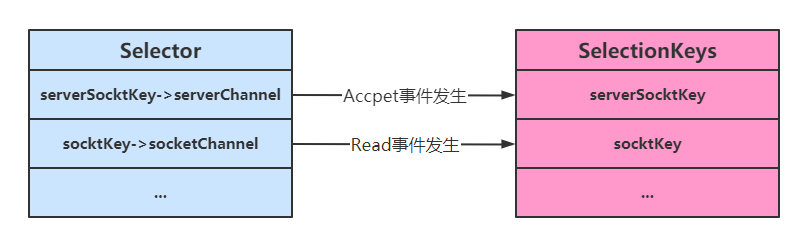](https://nyimapicture.oss-cn-beijing.aliyuncs.com/img/20210414193143.png)

### 断开处理

#### 💡 cancel 的作用

> cancel 会取消注册在 selector 上的 channel，并从 keys 集合中删除 key 后续不会再监听事件


当客户端与服务器之间的连接**断开时，会给服务器端发送一个读事件**，对异常断开和正常断开需要加以不同的方式进行处理

- **正常断开**

  - 正常断开时，服务器端的channel.read(buffer)方法的返回值为-1，**所以当结束到返回值为-1时，需要调用key的cancel方法取消此事件，并在取消后移除该事件**

    ```java
    int read = channel.read(buffer);
    // 断开连接时，客户端会向服务器发送一个写事件，此时read的返回值为-1
    if(read == -1) {
        // 取消该事件的处理
    	key.cancel();
        channel.close();
    } else {
        ...
    }
    // 取消或者处理，都需要移除key
    iterator.remove();
    ```

- 异常断开

  - 异常断开时，会抛出IOException异常， 在try-catch的**catch块中捕获异常并调用key的cancel方法即可**

### 消息边界

**不处理消息边界存在的问题**

以前有同学写过这样的代码，思考注释中两个问题，以 bio 为例，其实 nio 道理是一样的

```java
public class Server {
    public static void main(String[] args) throws IOException {
        ServerSocket ss=new ServerSocket(9000);
        while (true) {
            Socket s = ss.accept();
            InputStream in = s.getInputStream();
            // 这里这么写，有没有问题
            byte[] arr = new byte[4];
            while(true) {
                int read = in.read(arr);
                // 这里这么写，有没有问题
                if(read == -1) {
                    break;
                }
                System.out.println(new String(arr, 0, read));
            }
        }
    }
}
```

客户端

```java
public class Client {
    public static void main(String[] args) throws IOException {
        Socket max = new Socket("localhost", 9000);
        OutputStream out = max.getOutputStream();
        out.write("hello".getBytes());
        out.write("world".getBytes());
        out.write("你好".getBytes());
        max.close();
    }
}
```

输出

```
hell
owor
ld�
�好

```

为什么？

---

将缓冲区的大小设置为4个字节，发送2个汉字（你好），通过decode解码并打印时，会出现乱码

```
ByteBuffer buffer = ByteBuffer.allocate(4);
// 解码并打印
System.out.println(StandardCharsets.UTF_8.decode(buffer));
你�
��
```

这是因为UTF-8字符集下，1个汉字占用3个字节，此时缓冲区大小为4个字节，**一次读时间无法处理完通道中的所有数据，所以一共会触发两次读事件**。这就导致 `你好` 的 `好` 字被拆分为了前半部分和后半部分发送，解码时就会出现问题

---

#### **处理消息边界**

传输的文本可能有以下三种情况

- 文本大于缓冲区大小
  - 此时需要将缓冲区进行扩容
- 发生半包现象
- 发生粘包现象

[](https://nyimapicture.oss-cn-beijing.aliyuncs.com/img/20210415103442.png)

解决思路大致有以下三种

- **固定消息长度**，数据包大小一样，服务器按预定长度读取，当发送的数据较少时，需要将数据进行填充，直到长度与消息规定长度一致。缺点是**浪费带宽**

- 另一种思路是**按分隔符拆分**，缺点是**效率低**，需要一个一个字符地去匹配分隔符

- TLV 格式，即 **Type 类型、Length 长度、Value 数据**（也就是在消息开头

  用一些空间存放后面数据的长度），如HTTP请求头中的Content-Type与

  Content-Length。**类型和长度已知的情况下，就可以方便获取消息大小**，分配合适的 buffer，缺点是 buffer 需要提前分配，如果内容过大，则影响 server 吞吐量

  - Http 1.1 是 TLV 格式
- Http 2.0 是 LTV 格式
  - 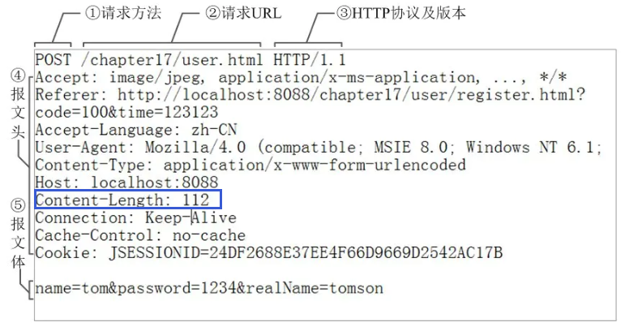

> content-type content-length

#### 按分隔符拆分——实践

下文的消息边界处理方式为**第二种：按分隔符拆分**

**附件与扩容**

Channel的register方法还有**第三个参数**：`附件`，可以向其中放入一个Object类型的对象，该对象会与登记的Channel以及其对应的SelectionKey绑定，可以从SelectionKey获取到对应通道的附件

```
public final SelectionKey register(Selector sel, int ops, Object att)
```

可通过SelectionKey的**attachment()方法获得附件**

```
ByteBuffer buffer = (ByteBuffer) key.attachment();
```

我们需要在Accept事件发生后，将通道注册到Selector中时，**对每个通道添加一个ByteBuffer附件**，让每个通道发生读事件时都使用自己的通道，避免与其他通道发生冲突而导致问题

```
// 设置为非阻塞模式，同时将连接的通道也注册到选择其中，同时设置附件
socketChannel.configureBlocking(false);
ByteBuffer buffer = ByteBuffer.allocate(16);
// 添加通道对应的Buffer附件
socketChannel.register(selector, SelectionKey.OP_READ, buffer);
```

当Channel中的数据大于缓冲区时，需要对缓冲区进行**扩容**操作。此代码中的扩容的判定方法：**Channel调用compact方法后，的position与limit相等，说明缓冲区中的数据并未被读取（容量太小），此时创建新的缓冲区，其大小扩大为两倍。同时还要将旧缓冲区中的数据拷贝到新的缓冲区中，同时调用SelectionKey的attach方法将新的缓冲区作为新的附件放入SelectionKey中**

```
// 如果缓冲区太小，就进行扩容
if (buffer.position() == buffer.limit()) {
    ByteBuffer newBuffer = ByteBuffer.allocate(buffer.capacity()*2);
    // 将旧buffer中的内容放入新的buffer中
    ewBuffer.put(buffer);
    // 将新buffer作为附件放到key中
    key.attach(newBuffer);
}
```


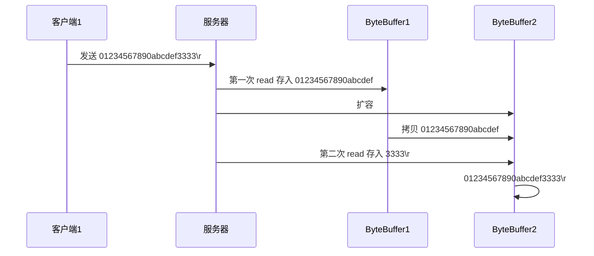


**改造后的服务器代码如下**

```java
public class SelectServer {
    private static void split(ByteBuffer buffer) {
        buffer.flip();
        for(int i = 0; i < buffer.limit(); i++) {
            // 遍历寻找分隔符，找到一条完整消息
            // get(i)不会移动position
            if (buffer.get(i) == '\n') {
                // 缓冲区长度
                int length = i+1-buffer.position();
                // 把这条完整消息存入新的 ByteBuffer
                ByteBuffer target = ByteBuffer.allocate(length);
                // 将前面的内容写入target缓冲区
                for(int j = 0; j < length; j++) {
                    // 将buffer中的数据写入target中
                    target.put(buffer.get());
                }
                // 打印结果
                ByteBufferUtil.debugAll(target);
            }
        }
        // 切换为写模式，但是缓冲区可能未读完，这里需要使用compact
        buffer.compact();
    }
    
    public static void main(String[] args) {
        // 获得服务器通道
        try(ServerSocketChannel server = ServerSocketChannel.open()) {
            server.bind(new InetSocketAddress(8080));
            // 创建选择器
            // 1. 创建 selector, 管理多个 channel
            Selector selector = Selector.open();
            // 通道必须设置为非阻塞模式
            server.configureBlocking(false);
            // 将通道注册到选择器中，并设置感兴趣的事件         
            server.register(selector, SelectionKey.OP_ACCEPT);
            // 为serverKey设置感兴趣的事件
            while (true) {
                // 若没有事件就绪，线程会被阻塞，反之不会被阻塞。从而避免了CPU空转
                // 返回值为就绪的事件个数
                 // 3. select 方法, 没有事件发生，线程阻塞，有事件，线程才会恢复运行
        // select 在事件未处理时，它不会阻塞, 事件发生后要么处理，要么取消，不能置之不理
                int ready = selector.select();
                System.out.println("selector ready counts : " + ready);
                // 获取所有事件
                Set<SelectionKey> selectionKeys = selector.selectedKeys();
                 // 4. 处理事件, selectedKeys 内部包含了所有发生的事件
                // 使用迭代器遍历事件
                Iterator<SelectionKey> iterator = selectionKeys.iterator();
                while (iterator.hasNext()) {
                    SelectionKey key = iterator.next();
                                // 处理key 时，要从 selectedKeys 集合中删除，否则下次处理就会有问题
                    iterator.remove();
                    // 判断key的类型
                    // 5. 区分事件类型
                    if(key.isAcceptable()) {// 如果是 accept
                        // 获得key对应的channel
                        ServerSocketChannel channel = (ServerSocketChannel) key.channel();
                        System.out.println("before accepting...");
                        // 获取连接
                        SocketChannel socketChannel = channel.accept();
                        System.out.println("after accepting...");
                        // 设置为非阻塞模式，同时将连接的通道也注册到选择其中，同时设置附件
                        socketChannel.configureBlocking(false);
                        ByteBuffer buffer = ByteBuffer.allocate(16);// attachment
                        // 将一个 byteBuffer 作为附件关联到 selectionKey 上
                        socketChannel.register(selector, SelectionKey.OP_READ, buffer);
                    } else if (key.isReadable()) {	// 如果是 read
                        SocketChannel channel = (SocketChannel) key.channel();// 拿到触发事件的channel
                        System.out.println("before reading...");
                        // 通过key获得附件（buffer）
                        // 获取 selectionKey 上关联的附件
                        ByteBuffer buffer = (ByteBuffer) key.attachment();
                        int read = channel.read(buffer);// 如果是正常断开，read 的方法的返回值是 -1
                        if(read == -1) {
                            key.cancel();
                            channel.close();
                        } else {
                            // 通过分隔符来分隔buffer中的数据
                            split(buffer);
                            // 如果缓冲区太小，就进行扩容
                            if (buffer.position() == buffer.limit()) {
                                ByteBuffer newBuffer = ByteBuffer.allocate(buffer.capacity()*2);
                                // 将旧buffer中的内容放入新的buffer中
                                buffer.flip();
                                newBuffer.put(buffer);
                                // 将新buffer放到key中作为附件
                                key.attach(newBuffer);
                            }
                        }
                        System.out.println("after reading...");
                        // 处理完毕后移除
                        iterator.remove();
                    }
                }
            }
        } catch (IOException e) {
            e.printStackTrace();
            key.cancel();  // 因为客户端断开了,因此需要将 key 取消（从 selector 的 keys 集合中真正删除 key）
        }
    }


}
```


客户端

```java
SocketChannel sc = SocketChannel.open();
sc.connect(new InetSocketAddress("localhost", 8080));
SocketAddress address = sc.getLocalAddress();
// sc.write(Charset.defaultCharset().encode("hello\nworld\n"));
sc.write(Charset.defaultCharset().encode("0123\n456789abcdef"));
sc.write(Charset.defaultCharset().encode("0123456789abcdef3333\n"));
System.in.read();
```


### ByteBuffer的大小分配

- 每个 channel 都需要记录可能被切分的消息，因为 **ByteBuffer 不能被多个 channel 共同使用**，因此需要为每个 channel 维护一个独立的 ByteBuffer
- ByteBuffer 不能太大，比如一个 ByteBuffer 1Mb 的话，要支持百万连接就要 1Tb 内存，因此需要设计大小可变的 ByteBuffer
- 分配思路可以参考
  - 一种思路是首先分配一个较小的 buffer，例如 4k，如果发现数据不够，再分配 8k 的 buffer，将 4k buffer 内容拷贝至 8k buffer，优点是消息连续容易处理，缺点是数据拷贝耗费性能
    - 参考实现 http://tutorials.jenkov.com/java-performance/resizable-array.html
  - 另一种思路是用多个数组组成 buffer，一个数组不够，把多出来的内容写入新的数组，与前面的区别是消息存储不连续解析复杂，优点是避免了拷贝引起的性能损耗

## 6、Write事件

服务器通过Buffer向通道中写入数据时，**可能因为通道容量小于Buffer中的数据大小，导致无法一次性将Buffer中的数据全部写入到Channel中，这时便需要分多次写入**，具体步骤如下

- 执行一次写操作，向将buffer中的内容写入到SocketChannel中，然后判断Buffer中是否还有数据

- 若Buffer中还有数据，则**需要将SockerChannel注册到Seletor中，并关注写事件，同时将未写完的Buffer作为附件一起放入到SelectionKey中**

  ```java
   int write = socket.write(buffer);
  // 通道中可能无法放入缓冲区中的所有数据
  if (buffer.hasRemaining()) {
      // 注册到Selector中，关注可写事件，并将buffer添加到key的附件中
      socket.configureBlocking(false);
      socket.register(selector, SelectionKey.OP_WRITE, buffer);
  }
  ```

- 添加写事件的相关操作`key.isWritable()`，对Buffer再次进行写操作

  - 每次写后需要判断Buffer中是否还有数据（是否写完）。**若写完，需要移除SelecionKey中的Buffer附件，避免其占用过多内存，同时还需移除对写事件的关注**

  ```java
  SocketChannel socket = (SocketChannel) key.channel();
  // 获得buffer
  ByteBuffer buffer = (ByteBuffer) key.attachment();
  // 执行写操作
  int write = socket.write(buffer);
  System.out.println(write);
  // 如果已经完成了写操作，需要移除key中的附件，同时不再对写事件感兴趣
  if (!buffer.hasRemaining()) {
      key.attach(null);
      key.interestOps(0);
  }
  ```

**整体代码如下**

```java
public class WriteServer {
    public static void main(String[] args) {
        try(ServerSocketChannel server = ServerSocketChannel.open()) {
            server.bind(new InetSocketAddress(8080));
            server.configureBlocking(false);
            Selector selector = Selector.open();
            server.register(selector, SelectionKey.OP_ACCEPT);
            while (true) {
                selector.select();
                Set<SelectionKey> selectionKeys = selector.selectedKeys();
                Iterator<SelectionKey> iterator = selectionKeys.iterator();
                while (iterator.hasNext()) {
                    SelectionKey key = iterator.next();
                    // 处理后就移除事件
                    iterator.remove();
                    if (key.isAcceptable()) {
                        // 获得客户端的通道
                        SocketChannel socket = server.accept();
                        // 写入数据
                        // 1. 向客户端发送内容
                        StringBuilder builder = new StringBuilder();
                        for(int i = 0; i < 500000000; i++) {
                            builder.append("a");
                        }
                        ByteBuffer buffer = StandardCharsets.UTF_8.encode(builder.toString());
                        // 先执行一次Buffer->Channel的写入，如果未写完，就添加一个可写事件
                        int write = socket.write(buffer);
                         // 3. write 表示实际写了多少字节
                    System.out.println("实际写入字节:" + write);
                        // 通道中可能无法放入缓冲区中的所有数据
                        // 4. 如果有剩余未读字节，才需要关注写事件
                        if (buffer.hasRemaining()) {
                            // 注册到Selector中，关注可写事件，并将buffer添加到key的附件中
                            socket.configureBlocking(false);
                            socket.register(selector, SelectionKey.OP_WRITE, buffer);
                        }
                    } else if (key.isWritable()) {
                        SocketChannel socket = (SocketChannel) key.channel();
                        // 获得buffer
                        ByteBuffer buffer = (ByteBuffer) key.attachment();
                        // 执行写操作
                        int write = socket.write(buffer);
                        System.out.println("实际写入字节:" + write);
                        // 如果已经完成了写操作，需要移除key中的附件，同时不再对写事件感兴趣
                        if (!buffer.hasRemaining()) {
                            key.attach(null);
                            //key.interestOps(key.interestOps() - SelectionKey.OP_WRITE);
                            key.interestOps(0);
                        }
                    }
                }
            }
        } catch (IOException e) {
            e.printStackTrace();
        }
    }
}
```

客户端

```java
public class WriteClient {
    public static void main(String[] args) throws IOException {
        Selector selector = Selector.open();
        SocketChannel sc = SocketChannel.open();
        sc.configureBlocking(false);
        sc.register(selector, SelectionKey.OP_CONNECT | SelectionKey.OP_READ);
        sc.connect(new InetSocketAddress("localhost", 8080));
        int count = 0;
        while (true) {
            selector.select();
            Iterator<SelectionKey> iter = selector.selectedKeys().iterator();
            while (iter.hasNext()) {
                SelectionKey key = iter.next();
                iter.remove();
                if (key.isConnectable()) {
                    System.out.println(sc.finishConnect());
                } else if (key.isReadable()) {
                    ByteBuffer buffer = ByteBuffer.allocate(1024 * 1024);
                    count += sc.read(buffer);
                    buffer.clear();
                    System.out.println(count);
                }
            }
        }
    }
}
```


#### 💡 write 为何要取消

只要向 channel 发送数据时，socket 缓冲可写，这个事件会频繁触发，因此应当只在 socket 缓冲区写不下时再关注可写事件，数据写完之后再取消关注

## 7、优化

### 多线程优化

> 现在都是多核 cpu，设计时要充分考虑别让 cpu 的力量被白白浪费

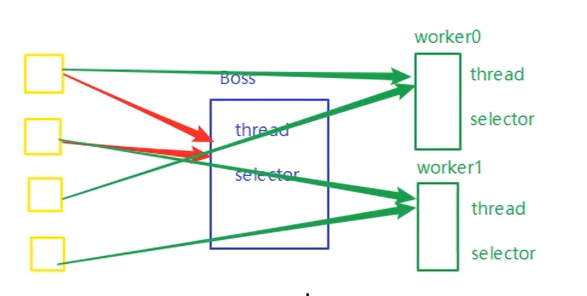


充分利用多核CPU，分两组选择器

- 单线程配一个选择器（Boss），**专门处理 accept 事件**
- 创建 cpu 核心数的线程（Worker），**每个线程配一个选择器，轮流处理 read 事件**

#### 实现思路

- 创建**一个**负责处理Accept事件的Boss线程，与**多个**负责处理Read事件的Worker线程

- **Boss线程**执行的操作

  - 接受并处理Accepet事件，当Accept事件发生后，调用Worker的register(SocketChannel socket)方法，让Worker去处理Read事件，其中需要**根据标识robin去判断将任务分配给哪个Worker**

    ```java
    // 创建固定数量的Worker
    Worker[] workers = new Worker[4];
    // 用于负载均衡的原子整数
    AtomicInteger robin = new AtomicInteger(0);
    // 负载均衡，轮询分配Worker
    workers[robin.getAndIncrement()% workers.length].register(socket);
    ```

  - register(SocketChannel socket)方法会**通过同步队列完成Boss线程与Worker线程之间的通信**，让SocketChannel的注册任务被Worker线程执行。添加任务后需要调用selector.wakeup()来唤醒被阻塞的Selector

    ```
    public void register(final SocketChannel socket) throws IOException {
        // 只启动一次
        if (!started) {
           // 初始化操作
        }
        // 向同步队列中添加SocketChannel的注册事件
        // 在Worker线程中执行注册事件
        queue.add(new Runnable() {
            @Override
            public void run() {
                try {
                    socket.register(selector, SelectionKey.OP_READ);
                } catch (IOException e) {
                    e.printStackTrace();
                }
            }
        });
        // 唤醒被阻塞的Selector
        // select类似LockSupport中的park，wakeup的原理类似LockSupport中的unpark
        selector.wakeup();
    }
    ```

- **Worker线程执行**的操作
  
  - **从同步队列中获取注册任务，并处理Read事件**

#### 实现代码

```
public class ThreadsServer {
    public static void main(String[] args) {
        try (ServerSocketChannel server = ServerSocketChannel.open()) {
            // 当前线程为Boss线程
            Thread.currentThread().setName("Boss");
            server.bind(new InetSocketAddress(8080));
            // 负责轮询Accept事件的Selector
            Selector boss = Selector.open();
            server.configureBlocking(false);
            server.register(boss, SelectionKey.OP_ACCEPT);
            // 创建固定数量的Worker
            Worker[] workers = new Worker[4];
            // 用于负载均衡的原子整数
            AtomicInteger robin = new AtomicInteger(0);
            for(int i = 0; i < workers.length; i++) {
                workers[i] = new Worker("worker-"+i);
            }
            while (true) {
                boss.select();
                Set<SelectionKey> selectionKeys = boss.selectedKeys();
                Iterator<SelectionKey> iterator = selectionKeys.iterator();
                while (iterator.hasNext()) {
                    SelectionKey key = iterator.next();
                    iterator.remove();
                    // BossSelector负责Accept事件
                    if (key.isAcceptable()) {
                        // 建立连接
                        SocketChannel socket = server.accept();
                        System.out.println("connected...");
                        socket.configureBlocking(false);
                        // socket注册到Worker的Selector中
                        System.out.println("before read...");
                        // 负载均衡，轮询分配Worker
                        workers[robin.getAndIncrement()% workers.length].register(socket);
                        System.out.println("after read...");
                    }
                }
            }
        } catch (IOException e) {
            e.printStackTrace();
        }
    }

    static class Worker implements Runnable {
        private Thread thread;
        private volatile Selector selector;
        private String name;
        private volatile boolean started = false;
        /**
         * 同步队列，用于Boss线程与Worker线程之间的通信
         */
        private ConcurrentLinkedQueue<Runnable> queue;

        public Worker(String name) {
            this.name = name;
        }

        public void register(final SocketChannel socket) throws IOException {
            // 只启动一次
            if (!started) {
                thread = new Thread(this, name);
                selector = Selector.open();
                queue = new ConcurrentLinkedQueue<>();
                thread.start();
                started = true;
            }
            
            // 向同步队列中添加SocketChannel的注册事件
            // 在Worker线程中执行注册事件
            queue.add(new Runnable() {
                @Override
                public void run() {
                    try {
                        socket.register(selector, SelectionKey.OP_READ);
                    } catch (IOException e) {
                        e.printStackTrace();
                    }
                }
            });
            // 唤醒被阻塞的Selector
            // select类似LockSupport中的park，wakeup的原理类似LockSupport中的unpark
            selector.wakeup();
        }

        @Override
        public void run() {
            while (true) {
                try {
                    selector.select();
                    // 通过同步队列获得任务并运行
                    Runnable task = queue.poll();
                    if (task != null) {
                        // 获得任务，执行注册操作
                        task.run();
                    }
                    Set<SelectionKey> selectionKeys = selector.selectedKeys();
                    Iterator<SelectionKey> iterator = selectionKeys.iterator();
                    while(iterator.hasNext()) {
                        SelectionKey key = iterator.next();
                        iterator.remove();
                        // Worker只负责Read事件
                        if (key.isReadable()) {
                            // 简化处理，省略细节
                            SocketChannel socket = (SocketChannel) key.channel();
                            ByteBuffer buffer = ByteBuffer.allocate(16);
                            socket.read(buffer);
                            buffer.flip();
                            ByteBufferUtil.debugAll(buffer);
                        }
                    }
                } catch (IOException e) {
                    e.printStackTrace();
                }
            }
        }
    }
}
```

#### 💡 如何拿到 cpu 个数

> * Runtime.getRuntime().availableProcessors() 如果工**作在 docker 容器下，因为容器不是物理隔离的，会拿到物理 cpu 个数，而不是容器申请时的个数**
> * 这个问题**直到 jdk 10 才修复**，使用 jvm 参数 UseContainerSupport 配置， 默认开启


## UDP

* UDP 是无连接的，client 发送数据不会管 server 是否开启
* server 这边的 receive 方法会将接收到的数据存入 byte buffer，但如果数据报文超过 buffer 大小，多出来的数据会被默默抛弃

首先启动服务器端

```java
public class UdpServer {
    public static void main(String[] args) {
        try (DatagramChannel channel = DatagramChannel.open()) {
            channel.socket().bind(new InetSocketAddress(9999));
            System.out.println("waiting...");
            ByteBuffer buffer = ByteBuffer.allocate(32);
            channel.receive(buffer);
            buffer.flip();
            debug(buffer);
        } catch (IOException e) {
            e.printStackTrace();
        }
    }
}
```

输出

```
waiting...
```


运行客户端

```java
public class UdpClient {
    public static void main(String[] args) {
        try (DatagramChannel channel = DatagramChannel.open()) {
            ByteBuffer buffer = StandardCharsets.UTF_8.encode("hello");
            InetSocketAddress address = new InetSocketAddress("localhost", 9999);
            channel.send(buffer, address);
        } catch (Exception e) {
            e.printStackTrace();
        }
    }
}
```

接下来服务器端输出

```
         +-------------------------------------------------+
         |  0  1  2  3  4  5  6  7  8  9  a  b  c  d  e  f |
+--------+-------------------------------------------------+----------------+
|00000000| 68 65 6c 6c 6f                                  |hello           |
+--------+-------------------------------------------------+----------------+
```


# 四、NIO与BIO

## 1、Stream与Channel

- **stream 不会自动缓冲数据**，channel 会利用系统提供的发送缓冲区、接收缓冲区（更为底层）
- stream 仅支持阻塞 API，channel 同时支持阻塞、非阻塞 API，**网络 channel 可配合 selector 实现多路复用**
- 二者均为全双工，即读写可以同时进行
  - 虽然Stream是单向流动的，但是它也是全双工的

## 2、IO模型

同步阻塞、同步非阻塞、同步多路复用、异步阻塞（没有此情况）、异步非阻塞

- 同步：线程自己去获取结果（一个线程）

  - 例如：线程调用一个方法后，需要等待方法返回结果

- 异步

  ：线程自己不去获取结果，而是由其它线程返回结果（至少两个线程）

  - 例如：线程A调用一个方法后，继续向下运行，运行结果由线程B返回

当调用一次 channel.**read** 或 stream.**read** 后，会由用户态切换至操作系统内核态来完成真正数据读取，而读取又分为两个阶段，分别为：

- 等待数据阶段

- 复制数据阶段

  [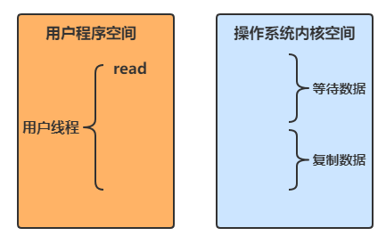](https://nyimapicture.oss-cn-beijing.aliyuncs.com/img/20210418151243.png)

根据UNIX 网络编程 - 卷 I，IO模型主要有以下几种

### 阻塞IO

[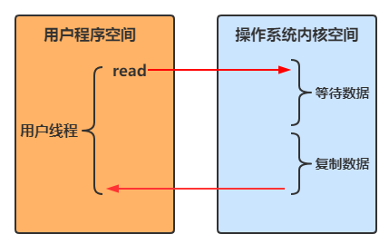](https://nyimapicture.oss-cn-beijing.aliyuncs.com/img/20210418151605.png)

- 用户线程进行read操作时，**需要等待操作系统执行实际的read操作**，此期间用户线程是被阻塞的，无法执行其他操作

### 非阻塞IO

[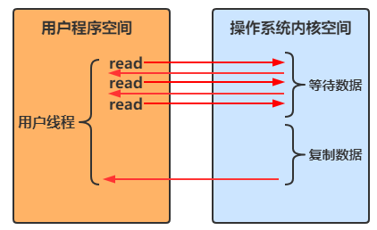](https://nyimapicture.oss-cn-beijing.aliyuncs.com/img/20210418152137.png)

- 用户线程在一个循环中一直调用read方法，若内核空间中还没有数据可读，立即返回
  - **只是在等待阶段非阻塞**
- 用户线程发现内核空间中有数据后，等待内核空间执行复制数据，待复制结束后返回结果

### 多路复用

[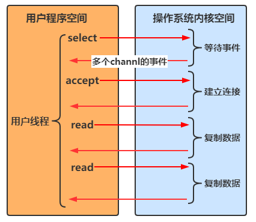](https://nyimapicture.oss-cn-beijing.aliyuncs.com/img/20210418154208.png)

**Java中通过Selector实现多路复用**

- 当没有事件时，调用select方法会被阻塞住
- 一旦有一个或多个事件发生后，就会处理对应的事件，从而实现多路复用

**多路复用与阻塞IO的区别**

- 阻塞IO模式下，**若线程因accept事件被阻塞，发生read事件后，仍需等待accept事件执行完成后**，才能去处理read事件
- 多路复用模式下，一个事件发生后，若另一个事件处于阻塞状态，不会影响该事件的执行

### 异步IO

[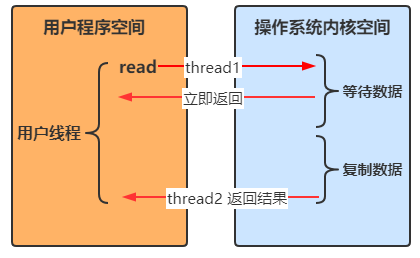](https://nyimapicture.oss-cn-beijing.aliyuncs.com/img/20210418160106.png)

- 线程1调用方法后立即返回，**不会被阻塞也不需要立即获取结果**
- 当方法的运行结果出来以后，由线程2将结果返回给线程1

### 阻塞 IO vs 多路复用

一个是具体的事件阻塞，一个是select阻塞，select可以响应多种事件

调用epoll_wait方法，在内核空间将三个事件用红黑树监听，事件一旦资源准备完成，会存入到一个链表,完成之后判断n是否>0,是的话，继续以上方式，然后把就绪资源通过链表发送到用户程序空间

多路复用不一定是事件驱动，只有epoll是事件驱动

多路复用有三种：selector，poll，epoll


#### 🔖 参考

UNIX 网络编程 - 卷 I

## 3、零拷贝

**零拷贝指的是数据无需拷贝到 JVM 内存中**，同时具有以下三个优点

- 更少的用户态与内核态的切换
- 不利用 cpu 计算，减少 cpu 缓存伪共享
- 零拷贝适合小文件传输

### 传统 IO 问题

传统的 IO 将一个文件通过 socket 写出

```java
File f = new File("helloword/data.txt");
RandomAccessFile file = new RandomAccessFile(file, "r");

byte[] buf = new byte[(int)f.length()];
file.read(buf);

Socket socket = ...;
socket.getOutputStream().write(buf);Copy
```

**内部工作流如下**

[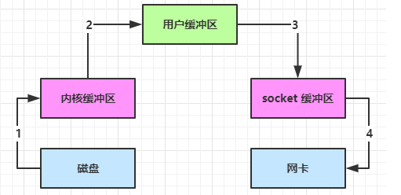](https://nyimapicture.oss-cn-beijing.aliyuncs.com/img/20210418162306.png)

- Java 本身并不具备 IO 读写能力，因此 read 方法调用后，要从 Java 程序的**用户态切换至内核态**，去调用操作系统（Kernel）的读能力，将数据读入**内核缓冲区**。这期间用户线程阻塞，操作系统使用 DMA（Direct Memory Access）来实现文件读，其间也不会使用 CPU

  `DMA 也可以理解为硬件单元，用来解放 cpu 完成文件 IO`

- 从**内核态**切换回**用户态**，将数据从**内核缓冲区**读入**用户缓冲区**（即 byte[] buf），这期间 **CPU 会参与拷贝**，无法利用 DMA

- 调用 write 方法，这时将数据从**用户缓冲区**（byte[] buf）写入 **socket 缓冲区，CPU 会参与拷贝**

- 接下来要向网卡写数据，这项能力 Java 又不具备，因此又得从**用户态**切换至**内核态**，调用操作系统的写能力，使用 DMA 将 **socket 缓冲区**的数据写入网卡，不会使用 CPU

可以看到中间环节较多，java 的 IO 实际不是物理设备级别的读写，而是缓存的复制，底层的真正读写是操作系统来完成的

- 用户态与内核态的切换发生了 3 次，这个操作比较重量级
- 数据拷贝了共 4 次

### NIO 优化

通过 **DirectByteBuf**

- ByteBuffer.allocate(10)
  - 底层对应 HeapByteBuffer，使用的还是 Java 内存
- ByteBuffer.allocateDirect(10)
  - 底层对应DirectByteBuffer，**使用的是操作系统内存**

[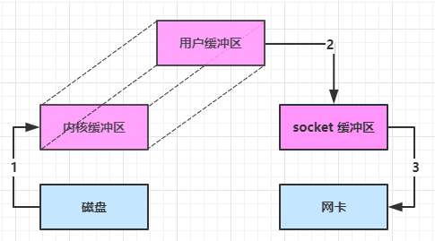](https://nyimapicture.oss-cn-beijing.aliyuncs.com/img/20210418162410.png)

大部分步骤与优化前相同，唯有一点：**Java 可以使用 DirectByteBuffer 将堆外内存映射到 JVM 内存中来直接访问使用**

- 这块内存不受 JVM 垃圾回收的影响，因此内存地址固定，有助于 IO 读写
- Java 中的 DirectByteBuf 对象仅维护了此内存的虚引用，内存回收分成两步
  - DirectByteBuffer 对象被垃圾回收，将虚引用加入引用队列
    - 当引用的对象ByteBuffer被垃圾回收以后，虚引用对象Cleaner就会被放入引用队列中，然后调用Cleaner的clean方法来释放直接内存
    - DirectByteBuffer 的释放底层调用的是 Unsafe 的 freeMemory 方法
  - 通过专门线程访问引用队列，根据虚引用释放堆外内存
- **减少了一次数据拷贝，用户态与内核态的切换次数没有减少**

### 进一步优化1

**以下两种方式都是零拷贝**，即无需将数据拷贝到用户缓冲区中（JVM内存中）

底层采用了 **linux 2.1** 后提供的 **sendFile** 方法，Java 中对应着两个 channel 调用 **transferTo/transferFrom** 方法拷贝数据

[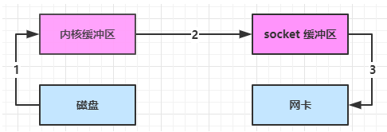](https://nyimapicture.oss-cn-beijing.aliyuncs.com/img/20210418162750.png)

- Java 调用 transferTo 方法后，要从 Java 程序的**用户态**切换至**内核态**，使用 DMA将数据读入**内核缓冲区**，不会使用 CPU
- 数据从**内核缓冲区**传输到 **socket 缓冲区**，CPU 会参与拷贝
- 最后使用 DMA 将 **socket 缓冲区**的数据写入网卡，不会使用 CPU

这种方法下

- 只发生了1次用户态与内核态的切换
- 数据拷贝了 3 次

### 进一步优化2

**linux 2.4** 对上述方法再次进行了优化

[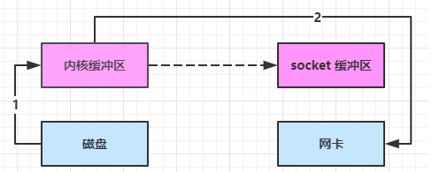](https://nyimapicture.oss-cn-beijing.aliyuncs.com/img/20210418163033.png)

- Java 调用 transferTo 方法后，要从 Java 程序的**用户态**切换至**内核态**，使用 DMA将数据读入**内核缓冲区**，不会使用 CPU
- 只会将一些 offset 和 length 信息拷入 **socket 缓冲区**，几乎无消耗
- 使用 DMA 将 **内核缓冲区**的数据写入网卡，不会使用 CPU

**整个过程仅只发生了1次用户态与内核态的切换，数据拷贝了 2 次**.所谓的【零拷贝】，并不是真正无拷贝，而是在不会拷贝重复数据到 jvm 内存中，零拷贝的优点有

* 更少的用户态与内核态的切换
* 不利用 cpu 计算，减少 cpu 缓存伪共享
* 零拷贝适合小文件传输

## 4、AIO

AIO 用来解决数据复制阶段的阻塞问题

- 同步意味着，在进行读写操作时，线程需要等待结果，还是相当于闲置
- 异步意味着，在进行读写操作时，线程不必等待结果，而是将来由操作系统来通过回调方式由另外的线程来获得结果

> 异步模型需要底层操作系统（Kernel）提供支持
>
> - Windows 系统通过 IOCP **实现了真正的异步 IO**
> - Linux 系统异步 IO 在 2.6 版本引入，但其**底层实现还是用多路复用模拟了异步 IO，性能没有优势**

------

#### 文件 AIO

先来看看 AsynchronousFileChannel

```java
@Slf4j
public class AioDemo1 {
    public static void main(String[] args) throws IOException {
        try{
            AsynchronousFileChannel s = 
                AsynchronousFileChannel.open(
                	Paths.get("1.txt"), StandardOpenOption.READ);
            ByteBuffer buffer = ByteBuffer.allocate(2);
            log.debug("begin...");
            s.read(buffer, 0, null, new CompletionHandler<Integer, ByteBuffer>() {
                @Override
                public void completed(Integer result, ByteBuffer attachment) {
                    log.debug("read completed...{}", result);
                    buffer.flip();
                    debug(buffer);
                }

                @Override
                public void failed(Throwable exc, ByteBuffer attachment) {
                    log.debug("read failed...");
                }
            });

        } catch (IOException e) {
            e.printStackTrace();
        }
        log.debug("do other things...");
        System.in.read();
    }
}
```

输出

```
13:44:56 [DEBUG] [main] c.i.aio.AioDemo1 - begin...
13:44:56 [DEBUG] [main] c.i.aio.AioDemo1 - do other things...
13:44:56 [DEBUG] [Thread-5] c.i.aio.AioDemo1 - read completed...2
         +-------------------------------------------------+
         |  0  1  2  3  4  5  6  7  8  9  a  b  c  d  e  f |
+--------+-------------------------------------------------+----------------+
|00000000| 61 0d                                           |a.              |
+--------+-------------------------------------------------+----------------+
```

可以看到

* 响应文件读取成功的是另一个线程 Thread-5
* 主线程并没有 IO 操作阻塞


#### 💡 守护线程

默认文件 AIO 使用的线程都是守护线程，所以最后要执行 `System.in.read()` 以避免守护线程意外结束


#### 网络 AIO

```java
public class AioServer {
    public static void main(String[] args) throws IOException {
        AsynchronousServerSocketChannel ssc = AsynchronousServerSocketChannel.open();
        ssc.bind(new InetSocketAddress(8080));
        ssc.accept(null, new AcceptHandler(ssc));
        System.in.read();
    }

    private static void closeChannel(AsynchronousSocketChannel sc) {
        try {
            System.out.printf("[%s] %s close\n", Thread.currentThread().getName(), sc.getRemoteAddress());
            sc.close();
        } catch (IOException e) {
            e.printStackTrace();
        }
    }

    private static class ReadHandler implements CompletionHandler<Integer, ByteBuffer> {
        private final AsynchronousSocketChannel sc;

        public ReadHandler(AsynchronousSocketChannel sc) {
            this.sc = sc;
        }

        @Override
        public void completed(Integer result, ByteBuffer attachment) {
            try {
                if (result == -1) {
                    closeChannel(sc);
                    return;
                }
                System.out.printf("[%s] %s read\n", Thread.currentThread().getName(), sc.getRemoteAddress());
                attachment.flip();
                System.out.println(Charset.defaultCharset().decode(attachment));
                attachment.clear();
                // 处理完第一个 read 时，需要再次调用 read 方法来处理下一个 read 事件
                sc.read(attachment, attachment, this);
            } catch (IOException e) {
                e.printStackTrace();
            }
        }

        @Override
        public void failed(Throwable exc, ByteBuffer attachment) {
            closeChannel(sc);
            exc.printStackTrace();
        }
    }

    private static class WriteHandler implements CompletionHandler<Integer, ByteBuffer> {
        private final AsynchronousSocketChannel sc;

        private WriteHandler(AsynchronousSocketChannel sc) {
            this.sc = sc;
        }

        @Override
        public void completed(Integer result, ByteBuffer attachment) {
            // 如果作为附件的 buffer 还有内容，需要再次 write 写出剩余内容
            if (attachment.hasRemaining()) {
                sc.write(attachment);
            }
        }

        @Override
        public void failed(Throwable exc, ByteBuffer attachment) {
            exc.printStackTrace();
            closeChannel(sc);
        }
    }

    private static class AcceptHandler implements CompletionHandler<AsynchronousSocketChannel, Object> {
        private final AsynchronousServerSocketChannel ssc;

        public AcceptHandler(AsynchronousServerSocketChannel ssc) {
            this.ssc = ssc;
        }

        @Override
        public void completed(AsynchronousSocketChannel sc, Object attachment) {
            try {
                System.out.printf("[%s] %s connected\n", Thread.currentThread().getName(), sc.getRemoteAddress());
            } catch (IOException e) {
                e.printStackTrace();
            }
            ByteBuffer buffer = ByteBuffer.allocate(16);
            // 读事件由 ReadHandler 处理
            sc.read(buffer, buffer, new ReadHandler(sc));
            // 写事件由 WriteHandler 处理
            sc.write(Charset.defaultCharset().encode("server hello!"), ByteBuffer.allocate(16), new WriteHandler(sc));
            // 处理完第一个 accpet 时，需要再次调用 accept 方法来处理下一个 accept 事件
            ssc.accept(null, this);
        }

        @Override
        public void failed(Throwable exc, Object attachment) {
            exc.printStackTrace();
        }
    }
}
```


# 5. NIO vs BIO

### 5.1 stream vs channel

* **stream 不会自动缓冲数据**，channel 会利用系统提供的发送缓冲区、接收缓冲区（更为底层）
* stream 仅支持阻塞 API，channel 同时支持阻塞、非阻塞 API，**网络 channel 可配合 selector 实现多路复用**
* 二者均为全双工，即读写可以同时进行


### 5.2 IO 模型

同步阻塞、同步非阻塞、同步多路复用、异步阻塞（没有此情况）、异步非阻塞

* 同步：线程自己去获取结果（一个线程）
* 异步：线程自己不去获取结果，而是由其它线程送结果（至少两个线程）


当调用一次 channel.read 或 stream.read 后，会切换至操作系统内核态来完成真正数据读取，而读取又分为两个阶段，分别为：

* 等待数据阶段
* 复制数据阶段


* 阻塞 IO

  

* 非阻塞  IO

  

* 多路复用

  

* 信号驱动

* 异步 IO

  

* 阻塞 IO vs 多路复用

  一个是具体的事件阻塞，一个是select阻塞，select可以响应多种事件

  调用epoll_wait方法，在内核空间将三个事件用红黑树监听，事件一旦资源准备完成，会存入到一个链表,完成之后判断n是否>0,是的话，继续以上方式，然后把就绪资源通过链表发送到用户程序空间
  
  多路复用不一定是事件驱动，只有epoll是事件驱动
  
  多路复用有三种：selector，poll，epoll
  
  
  
  

#### 🔖 参考

UNIX 网络编程 - 卷 I


### 5.3 零拷贝

零拷贝是指  用户空间和内核空间没有拷贝操作

#### 传统 IO 问题

传统的 IO 将一个文件通过 socket 写出

```java
File f = new File("helloword/data.txt");
RandomAccessFile file = new RandomAccessFile(file, "r");

byte[] buf = new byte[(int)f.length()];
file.read(buf);

Socket socket = ...;
socket.getOutputStream().write(buf);
```

内部工作流程是这样的：


1. java 本身并不具备 IO 读写能力，因此 read 方法调用后，要从 java 程序的**用户态**切换至**内核态**，去调用操作系统（Kernel）的读能力，将数据读入**内核缓冲区**。这期间用户线程阻塞，操作系统使用 DMA（Direct Memory Access）来实现文件读，其间也不会使用 cpu

   > DMA 也可以理解为硬件单元，用来解放 cpu 完成文件 IO

2. 从**内核态**切换回**用户态**，将数据从**内核缓冲区**读入**用户缓冲区**（即 byte[] buf），这期间 cpu 会参与拷贝，无法利用 DMA

3. 调用 write 方法，这时将数据从**用户缓冲区**（byte[] buf）写入 **socket 缓冲区**，cpu 会参与拷贝

4. 接下来要向网卡写数据，这项能力 java 又不具备，因此又得从**用户态**切换至**内核态**，调用操作系统的写能力，使用 DMA 将 **socket 缓冲区**的数据写入网卡，不会使用 cpu


可以看到中间环节较多，java 的 IO 实际不是物理设备级别的读写，而是缓存的复制，底层的真正读写是操作系统来完成的

* 用户态与内核态的切换发生了 3 次，这个操作比较重量级
* 数据拷贝了共 4 次


#### NIO 优化

通过 DirectByteBuf 

* ByteBuffer.allocate(10)  HeapByteBuffer **使用的还是 java 内存**
* ByteBuffer.allocateDirect(10)  DirectByteBuffer **使用的是操作系统内存**


大部分步骤与优化前相同，不再赘述。唯有一点：java 可以使用 DirectByteBuf 将堆外内存映射到 jvm 内存中来直接访问使用

* 这块内存不受 jvm 垃圾回收的影响，因此内存地址固定，有助于 IO 读写
* java 中的 DirectByteBuf 对象仅维护了此内存的虚引用，内存回收分成两步
  * DirectByteBuf 对象被垃圾回收，将虚引用加入引用队列
  * 通过专门线程访问引用队列，根据虚引用释放堆外内存
* 减少了一次数据拷贝，用户态与内核态的切换次数没有减少


进一步优化（底层采用了 linux 2.1 后提供的 sendFile 方法），java 中对应着两个 channel 调用 transferTo/transferFrom 方法拷贝数据


1. java 调用 transferTo 方法后，要从 java 程序的**用户态**切换至**内核态**，使用 DMA将数据读入**内核缓冲区**，不会使用 cpu
2. 数据从**内核缓冲区**传输到 **socket 缓冲区**，cpu 会参与拷贝
3. 最后使用 DMA 将 **socket 缓冲区**的数据写入网卡，不会使用 cpu

可以看到

* 只发生了一次用户态与内核态的切换
* 数据拷贝了 3 次


进一步优化（linux 2.4）


1. java 调用 transferTo 方法后，要从 java 程序的**用户态**切换至**内核态**，使用 DMA将数据读入**内核缓冲区**，不会使用 cpu
2. 只会将一些 offset 和 length 信息拷入 **socket 缓冲区**，几乎无消耗
3. 使用 DMA 将 **内核缓冲区**的数据写入网卡，不会使用 cpu

整个过程仅只发生了一次用户态与内核态的切换，数据拷贝了 2 次。所谓的【零拷贝】，并不是真正无拷贝，而是在不会拷贝重复数据到 jvm 内存中，零拷贝的优点有

* 更少的用户态与内核态的切换
* 不利用 cpu 计算，减少 cpu 缓存伪共享
* 零拷贝适合小文件传输


### 5.3 AIO

AIO 用来解决数据复制阶段的阻塞问题

* 同步意味着，在进行读写操作时，线程需要等待结果，还是相当于闲置
* 异步意味着，在进行读写操作时，线程不必等待结果，而是将来由操作系统来通过回调方式由另外的线程来获得结果

> 异步模型需要底层操作系统（Kernel）提供支持
>
> * Windows 系统通过 IOCP 实现了真正的异步 IO
> * Linux 系统异步 IO 在 2.6 版本引入，但其底层实现还是用多路复用模拟了异步 IO，性能没有优势


#### 文件 AIO

先来看看 AsynchronousFileChannel

```java
@Slf4j
public class AioDemo1 {
    public static void main(String[] args) throws IOException {
        try{
            AsynchronousFileChannel s = 
                AsynchronousFileChannel.open(
                	Paths.get("1.txt"), StandardOpenOption.READ);
            ByteBuffer buffer = ByteBuffer.allocate(2);
            log.debug("begin...");
            s.read(buffer, 0, null, new CompletionHandler<Integer, ByteBuffer>() {
                @Override
                public void completed(Integer result, ByteBuffer attachment) {
                    log.debug("read completed...{}", result);
                    buffer.flip();
                    debug(buffer);
                }

                @Override
                public void failed(Throwable exc, ByteBuffer attachment) {
                    log.debug("read failed...");
                }
            });

        } catch (IOException e) {
            e.printStackTrace();
        }
        log.debug("do other things...");
        System.in.read();
    }
}
```

输出

```
13:44:56 [DEBUG] [main] c.i.aio.AioDemo1 - begin...
13:44:56 [DEBUG] [main] c.i.aio.AioDemo1 - do other things...
13:44:56 [DEBUG] [Thread-5] c.i.aio.AioDemo1 - read completed...2
         +-------------------------------------------------+
         |  0  1  2  3  4  5  6  7  8  9  a  b  c  d  e  f |
+--------+-------------------------------------------------+----------------+
|00000000| 61 0d                                           |a.              |
+--------+-------------------------------------------------+----------------+
```

可以看到

* 响应文件读取成功的是另一个线程 Thread-5
* 主线程并没有 IO 操作阻塞


#### 💡 守护线程

默认文件 AIO 使用的线程都是守护线程，所以最后要执行 `System.in.read()` 以避免守护线程意外结束


#### 网络 AIO

```java
public class AioServer {
    public static void main(String[] args) throws IOException {
        AsynchronousServerSocketChannel ssc = AsynchronousServerSocketChannel.open();
        ssc.bind(new InetSocketAddress(8080));
        ssc.accept(null, new AcceptHandler(ssc));
        System.in.read();
    }

    private static void closeChannel(AsynchronousSocketChannel sc) {
        try {
            System.out.printf("[%s] %s close\n", Thread.currentThread().getName(), sc.getRemoteAddress());
            sc.close();
        } catch (IOException e) {
            e.printStackTrace();
        }
    }

    private static class ReadHandler implements CompletionHandler<Integer, ByteBuffer> {
        private final AsynchronousSocketChannel sc;

        public ReadHandler(AsynchronousSocketChannel sc) {
            this.sc = sc;
        }

        @Override
        public void completed(Integer result, ByteBuffer attachment) {
            try {
                if (result == -1) {
                    closeChannel(sc);
                    return;
                }
                System.out.printf("[%s] %s read\n", Thread.currentThread().getName(), sc.getRemoteAddress());
                attachment.flip();
                System.out.println(Charset.defaultCharset().decode(attachment));
                attachment.clear();
                // 处理完第一个 read 时，需要再次调用 read 方法来处理下一个 read 事件
                sc.read(attachment, attachment, this);
            } catch (IOException e) {
                e.printStackTrace();
            }
        }

        @Override
        public void failed(Throwable exc, ByteBuffer attachment) {
            closeChannel(sc);
            exc.printStackTrace();
        }
    }

    private static class WriteHandler implements CompletionHandler<Integer, ByteBuffer> {
        private final AsynchronousSocketChannel sc;

        private WriteHandler(AsynchronousSocketChannel sc) {
            this.sc = sc;
        }

        @Override
        public void completed(Integer result, ByteBuffer attachment) {
            // 如果作为附件的 buffer 还有内容，需要再次 write 写出剩余内容
            if (attachment.hasRemaining()) {
                sc.write(attachment);
            }
        }

        @Override
        public void failed(Throwable exc, ByteBuffer attachment) {
            exc.printStackTrace();
            closeChannel(sc);
        }
    }

    private static class AcceptHandler implements CompletionHandler<AsynchronousSocketChannel, Object> {
        private final AsynchronousServerSocketChannel ssc;

        public AcceptHandler(AsynchronousServerSocketChannel ssc) {
            this.ssc = ssc;
        }

        @Override
        public void completed(AsynchronousSocketChannel sc, Object attachment) {
            try {
                System.out.printf("[%s] %s connected\n", Thread.currentThread().getName(), sc.getRemoteAddress());
            } catch (IOException e) {
                e.printStackTrace();
            }
            ByteBuffer buffer = ByteBuffer.allocate(16);
            // 读事件由 ReadHandler 处理
            sc.read(buffer, buffer, new ReadHandler(sc));
            // 写事件由 WriteHandler 处理
            sc.write(Charset.defaultCharset().encode("server hello!"), ByteBuffer.allocate(16), new WriteHandler(sc));
            // 处理完第一个 accpet 时，需要再次调用 accept 方法来处理下一个 accept 事件
            ssc.accept(null, this);
        }

        @Override
        public void failed(Throwable exc, Object attachment) {
            exc.printStackTrace();
        }
    }
}
```


