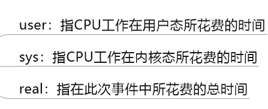

# 5. 分析 GC 日志

GC日志参数，详见上一章JVM参数

[4-JVM运行时参数.md](./4-JVM运行时参数.md)

## 5.1. GC 分类

针对 HotSpot VM 的实现，它里面的 GC 按照回收区域又分为两大种类型：一种是部分收集（Partial GC），一种是整堆收集（Full GC）

- 部分收集（Partial GC）：不是完整收集整个 Java 堆的垃圾收集。其中又分为：

  - 新生代收集（Minor GC / Young GC）：只是新生代（Eden / S0, S1）的垃圾收集
  - 老年代收集（Major GC / Old GC）：只是老年代的垃圾收集。目前，只有 CMS GC 会有单独收集老年代的行为。<mark>注意，很多时候 Major GC 会和 Full GC 混淆使用，需要具体分辨是老年代回收还是整堆回收。</mark>
- 混合收集（Mixed GC）：收集整个新生代以及部分老年代的垃圾收集。目前，只有 G1 GC 会有这种行为
- 整堆收集（Full GC）：收集整个 java 堆和方法区的垃圾收集。

**新生代收集：**当Eden区满的时候就会进行新生代收集，所以新生代收集和S0区域和S1区域无关
        **老年代收集和新生代收集的关系：**进行老年代收集之前会先进行一次年轻代的垃圾收集，原因如下：一个比较大的对象无法放入新生代，那它自然会往老年代去放，如果老年代也放不下，那会先进行一次新生代的垃圾收集，之后尝试往新生代放，如果还是放不下，才会进行老年代的垃圾收集，之后在往老年代去放，这是一个过程，我来说明一下为什么需要往老年代放，但是放不下，而进行新生代垃圾收集的原因，这是因为新生代垃圾收集比老年代垃圾收集更加简单，这样做可以节省性能
       **进行垃圾收集的时候，堆包含新生代、老年代、元空间/永久代：**可以看出Heap后面包含着新生代、老年代、元空间，但是我们设置堆空间大小的时候设置的只是新生代、老年代而已，元空间是分开设置的

**哪些情况会触发Full GC：**老年代空间不足、方法区空间不足、显示调用System.gc()、Minior GC进入老年代的数据的平均大小 大于 老年代的可用内存、大对象直接进入老年代，而老年代的可用空间不足

### 不同GC分类的GC细节

```
/**
 *  -XX:+PrintCommandLineFlags
 *
 *  -XX:+UseSerialGC:表明新生代使用Serial GC ，同时老年代使用Serial Old GC
 *
 *  -XX:+UseParNewGC：标明新生代使用ParNew GC
 *
 *  -XX:+UseParallelGC:表明新生代使用Parallel GC
 *  -XX:+UseParallelOldGC : 表明老年代使用 Parallel Old GC
 *  说明：二者可以相互激活
 *
 *  -XX:+UseConcMarkSweepGC：表明老年代使用CMS GC。同时，年轻代会触发对ParNew 的使用
 * @author shkstart
 * @create 17:19
 */
public class GCUseTest {
    public static void main(String[] args) {
        ArrayList<byte[]> list = new ArrayList<>();

        while(true){
            byte[] arr = new byte[1024 * 10];//10kb
            list.add(arr);
//            try {
//                Thread.sleep(5);
//            } catch (InterruptedException e) {
//                e.printStackTrace();
//            }
        }
    }
} 
```


## 5.2. GC 日志分类

**MinorGC**

MinorGC（或 young GC 或 YGC）日志：

```java
[GC (Allocation Failure) [PSYoungGen: 31744K->2192K (36864K) ] 31744K->2200K (121856K), 0.0139308 secs] [Times: user=0.05 sys=0.01, real=0.01 secs]
```


**FullGC**

```java
[Full GC (Metadata GC Threshold) [PSYoungGen: 5104K->0K (132096K) ] [Par01dGen: 416K->5453K (50176K) ]5520K->5453K (182272K), [Metaspace: 20637K->20637K (1067008K) ], 0.0245883 secs] [Times: user=0.06 sys=0.00, real=0.02 secs]
```


## 5.3. GC 日志格式

### GC 日志结构剖析

#### 垃圾收集器

**透过日志看垃圾收集器**

- Serial 收集器：新生代显示 "[DefNew"，即 Default New Generation
- ParNew 收集器：新生代显示 "[ParNew"，即 Parallel New Generation
- Parallel Scavenge 收集器：新生代显示"[PSYoungGen"，JDK1.7 使用的即 PSYoungGen
- Parallel Old 收集器：老年代显示"[ParoldGen"
- G1 收集器：显示”garbage-first heap“


**透过日志看 GC 原因**

- Allocation Failure：表明本次引起 GC 的原因是因为新生代中没有足够的区域存放需要分配的数据
- Metadata GCThreshold：Metaspace 区不够用了
- FErgonomics：JVM 自适应调整导致的 GC
- System：调用了 System.gc()方法

#### GC前后情况

**透过日志看 GC 前后情况**

通过图示，我们可以发现 GC 日志格式的规律一般都是：GC 前内存占用-＞ GC 后内存占用（该区域内存总大小）

```java
[PSYoungGen: 5986K->696K (8704K) ] 5986K->704K (9216K)
```

- 中括号内：GC 回收前年轻代堆大小，回收后大小，（年轻代堆总大小）

- 括号外：GC 回收前年轻代和老年代大小，回收后大小，（年轻代和老年代总大小）

<mark>注意</mark>：Minor GC 堆内存总容量 = 9/10 年轻代 + 老年代。原因是 Survivor 区只计算 from 部分，而 JVM 默认年轻代中 Eden 区和 Survivor 区的比例关系，Eden:S0:S1=8:1:1。

#### GC时间

**透过日志看 GC 时间**

GC 日志中有三个时间：user，sys 和 real

- user：进程执行用户态代码（核心之外）所使用的时间。**这是执行此进程所使用的实际 CPU 时间**，其他进程和此进程阻塞的时间并不包括在内。在垃圾收集的情况下，表示 GC 线程执行所使用的 CPU 总时间。
- sys：进程在内核态消耗的 CPU 时间，即**在内核执行系统调用或等待系统事件所使用的 CPU 时间**
- real：程序从开始到结束所用的时钟时间。这个时间包括其他进程使用的时间片和进程阻塞的时间（比如等待 I/O 完成）。对于并行 gc，这个数字应该接近（用户时间＋系统时间）除以垃圾收集器使用的线程数。

由于多核的原因，一般的 GC 事件中，real time 是小于 sys time ＋ user time 的，因为一般是多个线程并发的去做 GC，所以 real time 是要小于 sys ＋ user time 的。如果 real ＞ sys ＋ user 的话，则你的应用可能存在下列问题：IO 负载非常重或 CPU 不够用。

### Minor GC 日志解析


```
2020-11-20T17:19:43.265-0800 日志打印时间 日期格式（添加-XX:+PrintGCDateStamps参数）
0.822:（添加-XX:+PrintGCTimeStamps该参数）gc发生时，Java虚拟机启动以来经过的秒数
[GC(Allocation Failure) 发生了一次垃圾回收，这是一次Minior GC。它不区分新生代还是老年代GC，括号里的内容是gc发生的原因，这里的Allocation Failure的原因是新生代中没有足够区域能够存放需要分配的数据而失败
[PSYoungGen:76800K->8433K(89600K) 
PSYoungGen：表示GC发生的区域，区域名称与使用的GC收集器是密切相关的
```


```
76800K->8433K(89600K)：GC前该内存区域已使用容量->GC后盖区域容量(该区域总容量)
如果是新生代，总容量则会显示整个新生代内存的9/10，即eden+from/to区
如果是老年代，总容量则是全身内存大小，无变化
```

76800K->8449K(294400K)

虽然本次是Minor GC，只会进行新生代的垃圾收集，但是也肯定会打印堆中总容量相关信息

在显示完区域容量GC的情况之后，会接着显示整个堆内存区域的GC情况：GC前堆内存已使用容量->GC后堆内存容量（堆内存总容量），并且堆内存总容量 = 9/10 新生代 + 老年代，然后堆内存总容量肯定小于初始化的内存大小

,0.0088371

整个GC所花费的时间，单位是秒

[Times：user=0.02 sys=0.01,real=0.01 secs]



### Full GC 日志解析

Full GC(Metadata GCThreshold)

括号中是gc发生的原因，原因：Metaspace区不够用了。
除此之外，还有另外两种情况会引起Full GC，如下：
1、Full GC(FErgonomics)
原因：JVM自适应调整导致的GC
2、Full GC（System）
原因：调用了System.gc()方法

[Meatspace:20158K->20156K(1067008K)],

metaspace GC 回收2K空间

## 5.4. GC 日志分析工具

**GCEasy**

GCEasy 是一款在线的 GC 日志分析器，可以通过 GC 日志分析进行内存泄露检测、GC 暂停原因分析、JVM 配置建议优化等功能，大多数功能是免费的。

官网地址：[https://gceasy.io/](https://gceasy.io/)

**GCViewer**

GCViewer 是一款离线的 GC 日志分析器，用于可视化 Java VM 选项 -verbose:gc 和 .NET 生成的数据 -Xloggc:&lt;file&gt;。还可以计算与垃圾回收相关的性能指标（吞吐量、累积的暂停、最长的暂停等）。当通过更改世代大小或设置初始堆大小来调整特定应用程序的垃圾回收时，此功能非常有用。

源码下载：[https://github.com/chewiebug/GCViewer](https://github.com/chewiebug/GCViewer)

运行版本下载：[https://github.com/chewiebug/GCViewer/wiki/Changelog](https://github.com/chewiebug/GCViewer/wiki/Changelog)

**GChisto**

- 官网上没有下载的地方，需要自己从 SVN 上拉下来编译
- 不过这个工具似乎没怎么维护了，存在不少 bug

**HPjmeter**

- 工具很强大，但是只能打开由以下参数生成的 GC log，-verbose:gc -Xloggc:gc.log。添加其他参数生成的 gc.log 无法打开
- HPjmeter 集成了以前的 HPjtune 功能，可以分析在 HP 机器上产生的垃圾回收日志文件

## 几点感悟

延迟满足

遵守时间的价值

保有好奇心

## 06+++++++++++

后序课程需要再尚硅谷购买


