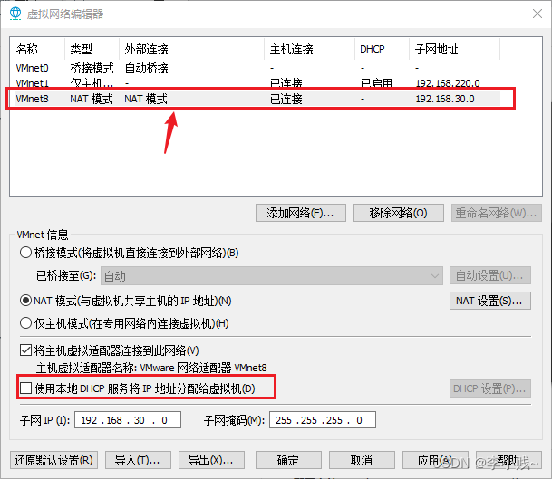
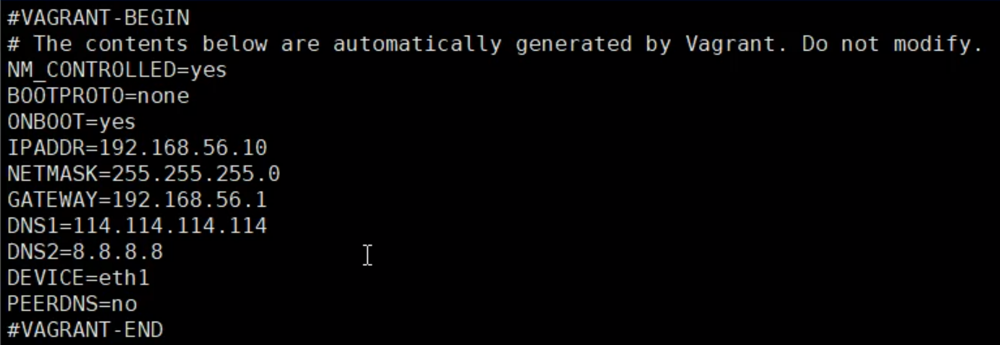
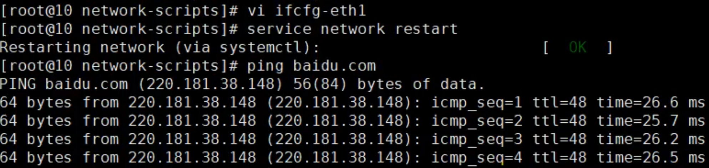
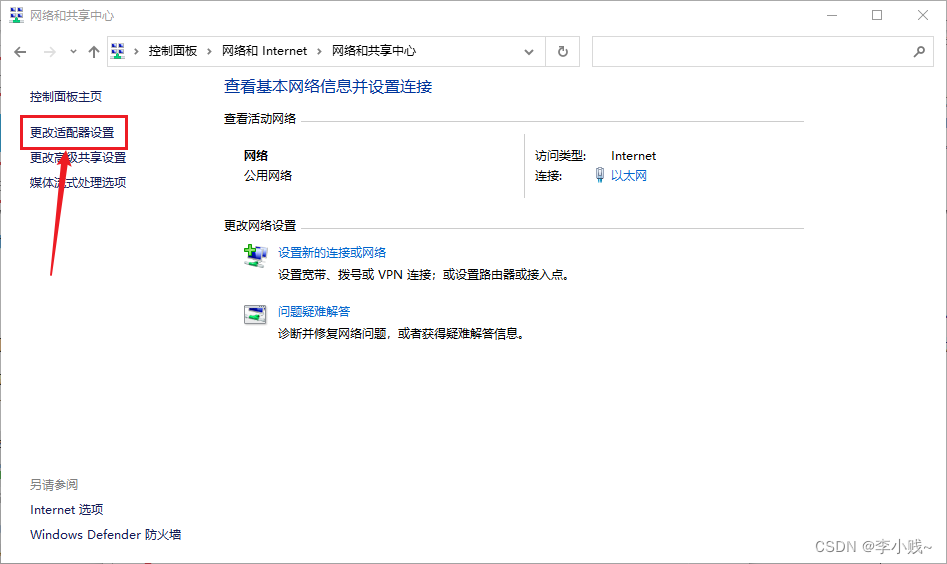
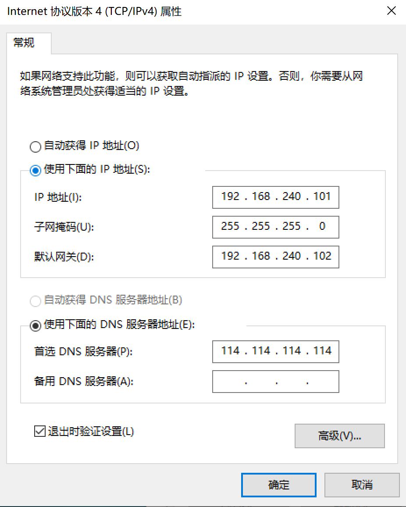
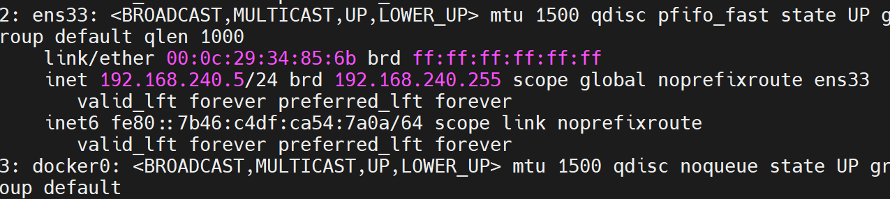

# 在VMware中安装CentOS7（超详细的图文教程）

## 注：内有固定ip地址的方法

https://blog.csdn.net/LiCJ1113538586/article/details/124578639

### 固定获取IP

#### ①、点击“编辑”里面的“虚拟网络编辑器”,取消勾选DHCP服务将IP地址分配给虚拟机。

==**注意：设置的ip地址要和VMnet8的网段相同：即如下配置为：`192.168.30.X`**==



```
192.168.142.0
192.168.142.5
D:\Users\Lenovo\Downloads\application\coder\CentOS-7-x86_64-DVD-2009.iso
```


```
IPADDR=192.168.30.100 设置IP地址
NETMASK=255.255.255.0 子网掩码
GATEWAY=192.168.30.2 设置网关

IPADDR=192.168.137.1
NETMASK=255.255.255.0
GATEWAY=192.168.30.5

```

修改网卡配置：雷神课程上的配置





## 修改网络适配器选项

①、仅仅安装了Xshell工具也还是不能连上CentOS7的，对电脑还需要一些配置（是不是非常麻烦，哈哈，程序员要有耐心，不然以后怎么找女朋友呀！）。
我们在电脑上打开：控制面板—>网络和 Internet—>网络和共享中心—>更改适配器—>找到MVnet8—>右键属性—>双击Internet协议版本4。

在前面的设置中，我本机IP和网关的网段是在192.168.30.0~255之间的。CentOS7静态获取的地址是192.168.30.100，这个我记得很清楚。



所以我的配置如下，你自己根据你的网段来设置，但**注意别和虚拟机的IP和网关相同就是了。**


原文链接：https://blog.csdn.net/LiCJ1113538586/article/details/124578639

# vmtools的安装和使用

现在会自动安装了






