# 消息队列的流派

### 什么是 MQ

Message Queue（MQ），消息队列中间件。很多人都说：MQ 通过将消息的发送和接收分离来实现应用程序的异步和解偶，这个给人的直觉是——MQ 是异步的，用来解耦的，但是这个只是 MQ 的效果而不是目的。**MQ 真正的目的是为了通讯**，屏蔽底层复杂的通讯协议，定义了一套应用层的、更加简单的通讯协议。一个分布式系统中两个模块之间通讯要么是HTTP，要么是自己开发的（rpc） TCP，但是这两种协议其实都是原始的协议。HTTP 协议很难实现两端通讯——模块 A 可以调用 B，B 也可以主动调用 A，如果要做到这个两端都要背上WebServer，而且还不支持⻓连接（HTTP 2.0 的库根本找不到）。TCP 就更加原始了，粘包、心跳、私有的协议，想一想头皮就发麻。MQ 所要做的就是在这些协议之上构建一个简单的“协议”——**生产者/消费者模型**。MQ 带给我的“协议”不是具体的通讯协议，而是更高层次通讯模型。它定义了两个对象——发送数据的叫生产者；接收数据的叫消费者， 提供一个SDK 让我们可以定义自己的生产者和消费者实现消息通讯而无视底层通讯协议

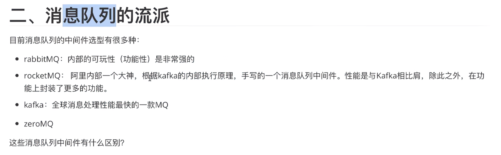

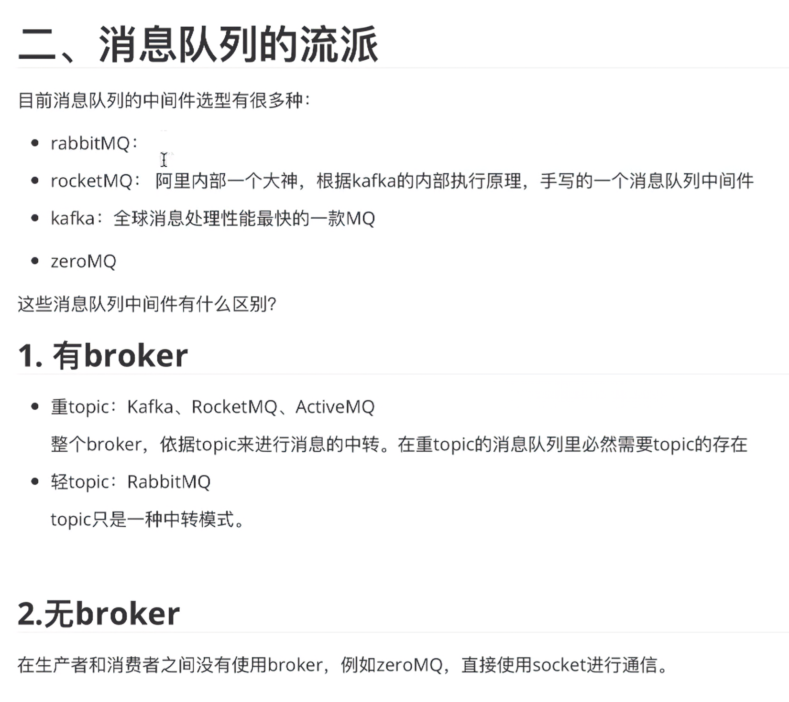

### 有 Broker 的 MQ

>这个流派通常有一台服务器作为 Broker，所有的消息都通过它中转。生产者把消息发送给它就结束自己的任务了，Broker 则把消息主动推送给消费者（或者消费者主动轮询）

#### 重 Topic

>kafka、JMS（ActiveMQ）就属于这个流派，生产者会发送 key 和数据到 Broker，由 Broker比较 key 之后决定给哪个消费者。这种模式是我们最常⻅的模式，是我们对 MQ 最多的印象。在这种模式下一个 topic 往往是一个比较大的概念，甚至一个系统中就可能只有一个topic，topic 某种意义上就是 queue，生产者发送 key 相当于说：“hi，把数据放到 key 的队列中”

>如上图所示，Broker 定义了三个队列，key1，key2，key3，生产者发送数据的时候会发送key1 和 data，Broker 在推送数据的时候则推送 data（也可能把 key 带上）。

>虽然架构一样但是 kafka 的性能要比 jms 的性能不知道高到多少倍，所以基本这种类型的MQ 只有 kafka 一种备选方案。如果你需要一条暴力的数据流（在乎性能而非灵活性）那么kafka 是最好的选择

#### 轻 Topic

>这种的代表是 RabbitMQ（或者说是 AMQP）。生产者发送 key 和数据，消费者定义订阅的队列，Broker 收到数据之后会通过一定的逻辑计算出 key 对应的队列，然后把数据交给队列

>这种模式下解耦了 key 和 queue，在这种架构中 queue 是非常轻量级的（在 RabbitMQ 中它的上限取决于你的内存），消费者关心的只是自己的 queue；生产者不必关心数据最终给谁只要指定 key 就行了，中间的那层映射在 AMQP 中叫 exchange（交换机）。

AMQP 中有四种 exchange

* Direct exchange：key 就等于 queue
* Fanout exchange：无视 key，给所有的 queue 都来一份
* Topic exchange：key 可以用“宽字符”模糊匹配 queue
* Headers exchange：无视 key，通过查看消息的头部元数据来决定发给那个
* queue（AMQP 头部元数据非常丰富而且可以自定义）

这种结构的架构给通讯带来了很大的灵活性，我们能想到的通讯方式都可以用这四种exchange 表达出来。如果你需要一个企业数据总线（在乎灵活性）那么 RabbitMQ 绝对的值得一用

### 无 Broker 的 MQ

>无 Broker 的 MQ 的代表是 ZeroMQ。该作者非常睿智，他非常敏锐的意识到——MQ 是更高级的 Socket，它是解决通讯问题的。所以 ZeroMQ 被设计成了一个“库”而不是一个中间件，这种实现也可以达到——没有 Broker 的目的

>节点之间通讯的消息都是发送到彼此的队列中，每个节点都既是生产者又是消费者。ZeroMQ做的事情就是封装出一套类似于 Socket 的 API 可以完成发送数据，读取数据

>ZeroMQ 其实就是一个跨语言的、重量级的 Actor 模型邮箱库。你可以把自己的程序想象成一个 Actor，ZeroMQ 就是提供邮箱功能的库；ZeroMQ 可以实现同一台机器的 RPC 通讯也可以实现不同机器的 TCP、UDP 通讯，如果你需要一个强大的、灵活、野蛮的通讯能力，别犹豫 ZeroMQ

# 为什么要使用消息队列

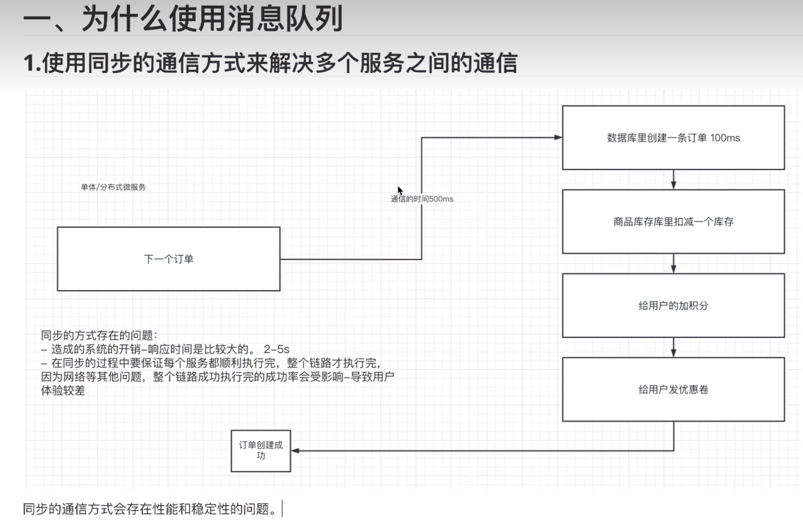

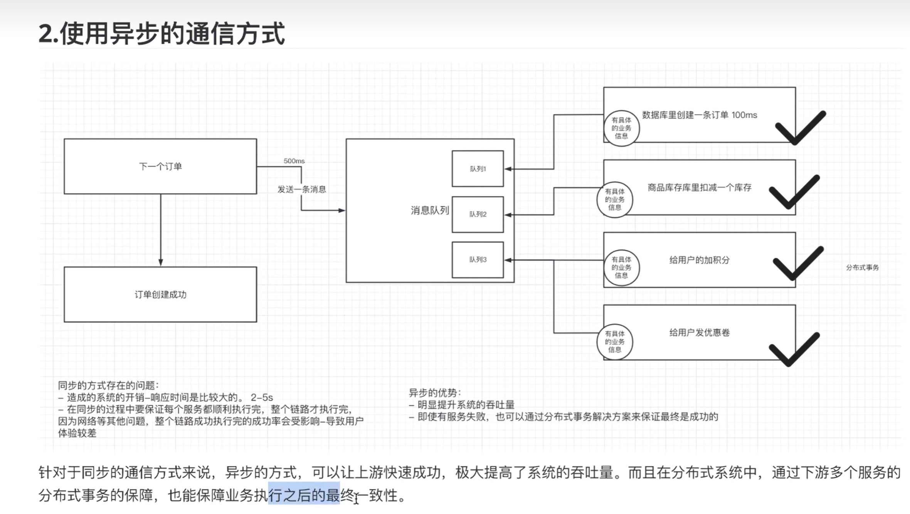


# 一、Kafka介绍

>Kafka是最初由Linkedin公司开发，是一个分布式、支持分区的（partition）、多副本的
（replica），基于zookeeper协调的分布式消息系统，它的最大的特性就是可以实时的处理
大量数据以满足各种需求场景：比如基于hadoop的批处理系统、低延迟的实时系统、
Storm/Spark流式处理引擎，web/nginx日志、访问日志，消息服务等等，用scala语言编
写，Linkedin于 2010 年贡献给了Apache基金会并成为顶级开源 项目。

## 1.Kafka的使用场景

日志收集：一个公司可以用Kafka收集各种服务的log，通过kafka以统一接口服务的方式
开放给各种consumer，例如hadoop、Hbase、Solr等。
消息系统：解耦和生产者和消费者、缓存消息等。
用户活动跟踪：Kafka经常被用来记录web用户或者app用户的各种活动，如浏览网⻚、
搜索、点击等活动，这些活动信息被各个服务器发布到kafka的topic中，然后订阅者通过
订阅这些topic来做实时的监控分析，或者装载到hadoop、数据仓库中做离线分析和挖
掘。
运营指标：Kafka也经常用来记录运营监控数据。包括收集各种分布式应用的数据，生产
各种操作的集中反馈，比如报警和报告。

## 2.Kafka基本概念

kafka是一个分布式的，分区的消息(官方称之为commit log)服务。它提供一个消息系统应该
具备的功能，但是确有着独特的设计。可以这样来说，Kafka借鉴了JMS规范的思想，但是确
并 `没有完全遵循JMS规范。`

首先，让我们来看一下基础的消息(Message)相关术语：


名称|解释
--|:--:
Broker|消息中间件处理节点，⼀个Kafka节点就是⼀个broker，⼀个或者多个Broker可以组成⼀个Kafka集群
Topic|Kafka根据topic对消息进⾏归类，发布到Kafka集群的每条消息都需要指定⼀个topic
Producer|消息⽣产者，向Broker发送消息的客户端
Consumer|消息消费者，从Broker读取消息的客户端
ConsumerGroup|每个Consumer属于⼀个特定的Consumer Group，⼀条消息可以被多个不同的Consumer Group消费，但是⼀个Consumer Group中只能有⼀个Consumer能够消费该消息
Partition|物理上的概念，⼀个topic可以分为多个partition，每个partition内部消息是有序的

因此，从一个较高的层面上来看，producer通过网络发送消息到Kafka集群，然后consumer
来进行消费，如下图：
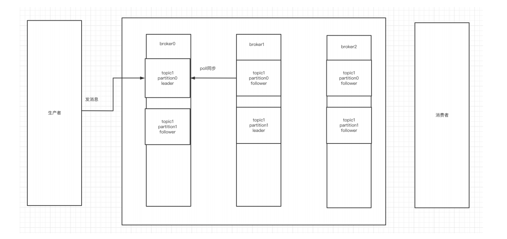

服务端(brokers)和客户端(producer、consumer)之间通信通过 **TCP协议** 来完成。

# 二、kafka基本使用

## 1.安装前的环境准备

* 安装jdk
* 安装zk： 详见zookeeper.md
* 官网下载kafka的压缩包:http://kafka.apache.org/downloads
* 解压缩至如下路径`/usr/local/kafka/`
```shell
cd /usr/local/kafka/

tar -zxvf kafka_2.11-2.4.1.tgz
```

* 修改配置文件：/usr/local/kafka/kafka_2.11-2.4.1/config/server.properties
```shell
#broker.id属性在kafka集群中必须要是唯一
broker.id= 0
#kafka部署的机器ip和提供服务的端口号，允许外部端口连接
listeners=PLAINTEXT://192.168.142.128:9092
# 外部代理地址
advertised.listeners=PLAINTEXT://192.168.38.22:9092

#kafka的消息存储文件
log.dir=/usr/local/data/kafka-logs
#kafka连接zookeeper的地址
zookeeper.connect= 192.168.142.128:2181
```
## 2.启动kafka服务器

进入到bin目录下。使用命令来启动

```
/usr/local/kafka/kafka_2.11-2.4.1/bin
```


```shell
./kafka-server-start.sh -daemon ../config/server.properties
```
验证是否启动成功：

```
ps -aux | grep server.properties
```

进入到zk中的节点看id是 0 的broker有没有存在（上线）

```shell
ls /brokers/ids
```
**server.properties核心配置详解：**

Property|Default|Description
--|:--|:--
broker.id|0|每个broker都可以⽤⼀个唯⼀的⾮负整数id进⾏标识；这个id可以作为broker的“名字”，你可以选择任意你喜欢的数字作为id，只要id是唯⼀的即可。
log.dirs|/tmp/kafka-logs|kafka存放数据的路径。这个路径并不是唯⼀的，可以是多个，路径之间只需要使⽤逗号分隔即可；每当创建新partition时，都会选择在包含最少partitions的路径下进⾏。
listeners|PLAINTEXT://192.168.142.128:9092|server接受客户端连接的端⼝，ip配置kafka本机ip即可
zookeeper.connect|localhost:2181|zooKeeper连接字符串的格式为：hostname:port，此处hostname和port分别是ZooKeeper集群中某个节点的host和port；zookeeper如果是集群，连接⽅式为hostname1:port1, hostname2:port2,hostname3:port3
log.retention.hours|168|每个⽇志⽂件删除之前保存的时间。默认数据保存时间对所有topic都⼀样。
num.partitions|1|创建topic的默认分区数
default.replication.factor|1|⾃动创建topic的默认副本数量，建议设置为⼤于等于2
min.insync.replicas|1|当producer设置acks为-1时，min.insync.replicas指定replicas的最⼩数⽬（必须确认每⼀个repica的写数据都是成功的），如果这个数⽬没有达到，producer发送消息会产⽣异常
delete.topic.enable|false|是否允许删除主题

## 3.创建主题topic

>topic是什么概念？topic可以实现消息的分类，不同消费者订阅不同的topic。

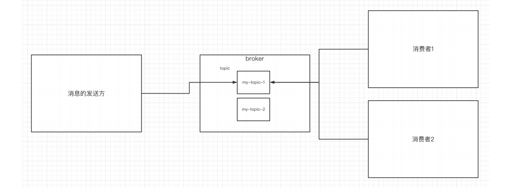

执行以下命令创建名为“test”的topic，这个topic只有一个partition，并且备份因子也设置为1
```shell
./kafka-topics.sh --create --zookeeper 192.168.142.128:2181 --replication-factor 1 --partitions 1 --topic test
```
查看当前kafka内有哪些topic
```shell
./kafka-topics.sh --list --zookeeper 192.168.142.128:2181
```
## 4.发送消息

kafka自带了一个producer命令客户端，可以从本地文件中读取内容，或者我们也可以以命令行中直接输入内容，并将这些内容以消息的形式发送到kafka集群中。在默认情况下，每一个行会被当做成一个独立的消息。使用**kafka的发送消息的客户端**，指定发送到的kafka服务器地址和topic

```shell
./kafka-console-producer.sh --broker-list 192.168.142.128:9092 --topic test
```
## 5.消费消息

对于consumer，kafka同样也携带了一个命令行客户端，会将获取到内容在命令中进行输
出， **默认是消费最新的消息** 。使用kafka的消费者消息的客户端，从指定kafka服务器的指定
topic中消费消息

方式一：从最后一条消息的偏移量+1开始消费，默认的方式
```shell
./kafka-console-consumer.sh --bootstrap-server 192.168.142.128:9092 --topic test
```
方式二：从头开始消费
```shell
./kafka-console-consumer.sh --bootstrap-server 192.168.142.128:9092 --from-beginning --topic test
```

### 几个注意点：

* **消息会被存储**
* **消息是顺序存储**
* **消息是有偏移量的**
* **消费时可以指明偏移量进行消费**

# 三、Kafka中的关键细节

## 1.消息的顺序存储

消息的发送方会把消息发送到broker中，broker会存储消息，消息是按照发送的顺序进行存储。因此消费者在消费消息时可以指明主题中消息的偏移量。默认情况下，是从最后一个消息的下一个偏移量开始消费。

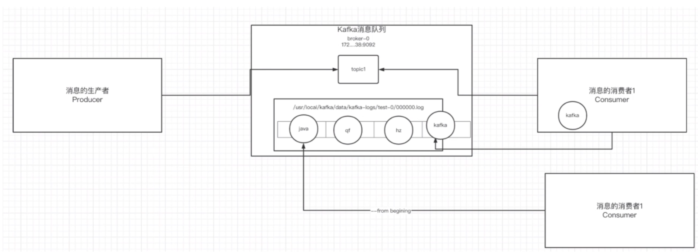


- 生产者将消息发送给broker，broker会将消息保存在本地的日志文件中

  ```
  /usr / local/kafka/ data/kafka-logs/主题-分区/00000000.log
  ```

- 消息的保存是有序的，通过offset偏移量来描述消息的有序性

- 消费者消费消息时也是通过**offset来描述当前要消费的那条消息的位置**


## 2. 单播消息的实现

单播消息：**一个消费组里 只会有一个消费者能消费到某一个topic中的消息**。于是可以创**建多个消费者，这些消费者在同一个消费组**中。

```shell
./kafka-console-consumer.sh --bootstrap-server 192.168.142.128:9092 --consumer-property group.id=testGroup --topic test
```
## 3.多播消息的实现

在一些业务场景中需要让一条消息被多个消费者消费，那么就可以使用多播模式。

kafka实现多播，只需要让**不同的消费者处于不同的消费组即可**。

```
--consumer-property group.id=testGroup1
```

```shell
./kafka-console-consumer.sh --bootstrap-server 192.168.142.128:9092 --consumer-property group.id=testGroup1 --topic test

./kafka-console-consumer.sh --bootstrap-server 192.168.142.128:9092 --consumer-property group.id=testGroup2 --topic test
```
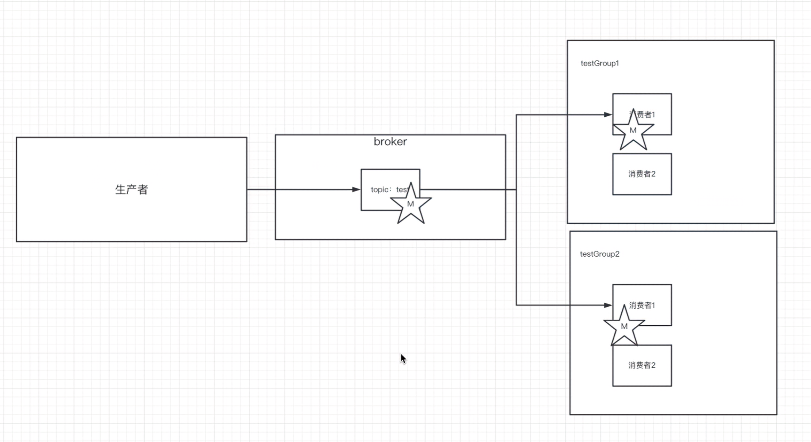

## 4.查看消费组及信息

``` shell
# 查看当前主题下有哪些消费组
./kafka-consumer-groups.sh --bootstrap-server 192.168.142.128:9092 --list
# 查看消费组中的具体信息：比如当前偏移量、最后一条消息的偏移量、堆积的消息数量
./kafka-consumer-groups.sh --bootstrap-server 192.168.142.128:9092 --describe --group testGroup
```


* **Currennt-offset: 当前消费组的已消费偏移量**
* Log-end-offset: 主题对应分区消息的结束偏移量(HW)
* **Lag: 当前消费组未消费的消息数**

# 四、主题、分区的概念

## 1.主题Topic

**主题Topic可以理解成是一个类别的名称。**

主题-topic在kafka中是一个逻辑的概念，kafka通过topic将消息进行分类。不同的topic会被订阅该topic的消费者消费。

但是有一个问题，如果说这个topic中的消息非常非常多，多到需要几T来存，因为消息是会被保存到log日志文件中的。为了解决这个文件过大的问题，kafka提出了Partition分区的概念


## 2.partition分区

一个主题中的消息量是非常大的，因此可以通过分区的设置，来分布式存储这些消息。比如一个topic创建了 3 个分区。那么topic中的消息就会分别存放在这三个分区中。

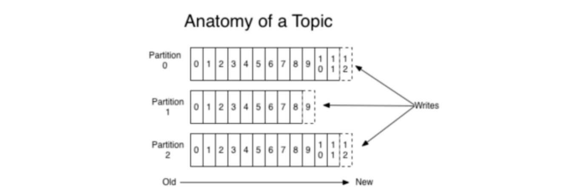


**通过partition将一个topic中的消息分区来存储**。这样的好处有多个:

- **分区存储**，可以解决**统一存储文件过大的问题**
- 提供了读写的吞吐量:**读和写可以同时在多个分区中进行**


### 为一个主题创建多个分区
```shell
./kafka-topics.sh --create --zookeeper localhost:2181 --replication-factor 1 --partitions 2 --topic test1
```
**可以通过这样的命令查看topic的分区信息**
```shell
./kafka-topics.sh --describe --zookeeper localhost:2181 --topic test1
```
### 分区的作用：

* 可以分布式存储
* 可以并行写

实际上是存在data/kafka-logs/test-0 和 test-1中的0000000.log文件中

### 分区中的文件

小细节：

- 定期将自己消费分区的offset提交给kafka内部topic：`__consumer_offsets`，提交过去的时候，**key是consumerGroupId+topic+分区号**，**value就是当前offset的值**，kafka会定期清理topic里的消息，最后就保留最新的那条数据
- 因为`__consumer_offsets`可能会**接收高并发的请求**，kafka默认给其分配 50 个分区(可以通过offsets.topic.num.partitions设置)，这样可以通过加机器的方式抗大并发。
  通过如下公式可以选出consumer消费的offset要提交到`__consumer_offsets`的哪个分区
  公式：**hash(consumerGroupId) % `__consumer_offsets`主题的分区数**

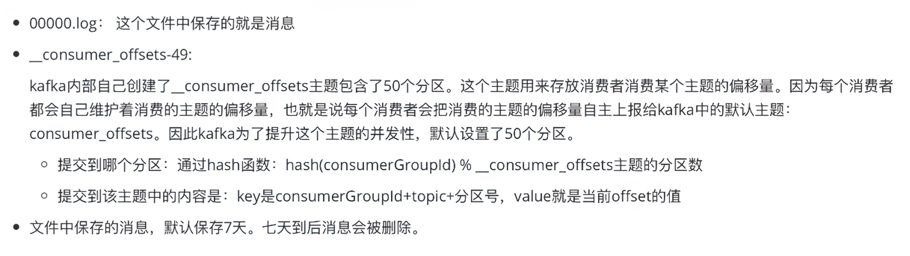

# 五、Kafka集群及副本的概念

## 1.搭建kafka集群， 3 个broker

准备 3 个server.properties文件

```
cp server.properties server1.properties
cp server.properties server2.properties
vim server1.properties
```

每个文件中的这些内容要调整

* server.properties
```shell
broker.id= 0
listeners=PLAINTEXT://192.168.142.128:9092
log.dir=/usr/local/data/kafka-logs
```
* server1.properties，server2.properties
```shell
# 1,2
broker.id= 1
# 9093,9094
listeners=PLAINTEXT://192.168.142.128:9093
#kafka-logs-1,-2
log.dir=/usr/local/data/kafka-logs-1
```


### 使用如下命令来启动 3 台服务器

先启动zookeeper

```shell
cd /usr/local/zookeeper/apache-zookeeper-3.7.1-bin/bin/
./zkServer.sh start ../conf/zoo.cfg
```


```
cd /usr/local/kafka/kafka_2.11-2.4.1/bin
```


```shell
./kafka-server-start.sh -daemon ../config/server.properties
./kafka-server-start.sh -daemon ../config/server1.properties
./kafka-server-start.sh -daemon ../config/server2.properties
```

停止脚本

```
./kafka-server-stop.sh
```

搭建完后通过查看zk中的/brokers/ids 看是否启动成功

```shell
cd /usr/local/zookeeper/apache-zookeeper-3.7.1-bin/bin/
./zkServer.sh ../con
./zkCli.sh

ls /brokers/ids
[0, 1, 2]
```


## 2.副本的概念

**副本是对分区的备份**。在集群中，不同的副本会被部署在不同的broker上。下面例子：创建 1个主题， 2 个分区、 3 个副本。

副本是为了为主题中的分区创建多个备份，多个副本在kafka集群的多个broker中，会有一个副本作为leader，其他是follower。


```shell
./kafka-topics.sh --create --zookeeper 192.168.142.128:2181 --replication-factor 3 --partitions 2 --topic my-replicated-topic
```
- default.replication.factor=3可以设置存放偏移量的topic副本数量

```shell
# 查看topic情况
./kafka-topics.sh --describe --zookeeper 192.168.142.128:2181 --topic my-replicated-topic
```

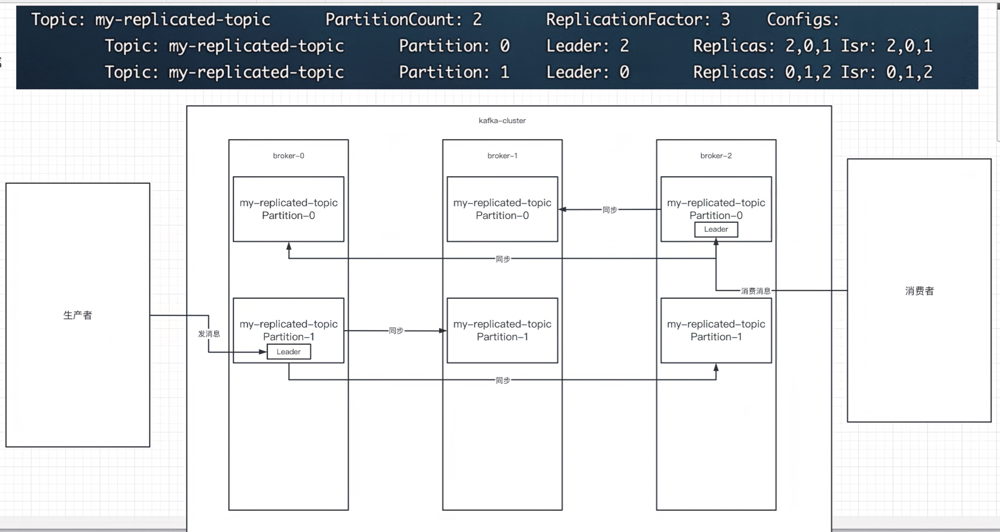


- leader:
  kafka的写和读的操作，都发生在leader上。leader负责把数据同步给follower。当leader挂了，经过主从选举，从多个follower中选举产生一个新的leader
- follower
  接收leader的同步的数据
-  isr:
  可以同步和泡同步的节点会被存入到isr集合中。这里有一个细节:如果isr中的节点性能较差，会被提出isr集合。


通过查看主题信息，其中的关键数据：

* replicas：当前副本存在的broker节点
* leader：副本里的概念
    * 每个partition都有一个broker作为leader。
    * 消息发送方要把消息发给哪个broker？就看副本的leader是在哪个broker上面。副本里的leader专⻔用来接收消息。
    * 接收到消息，其他follower通过poll的方式来同步数据。
* follower：leader处理所有针对这个partition的读写请求，而follower被动复制leader，不提供读写（主要是为了保证多副本数据与消费的一致性），如果leader所在的broker挂掉，那么就会进行新leader的选举，至于怎么选，在之后的controller的概念中介绍。
* isr：可以同步的broker节点和已同步的broker节点，存放在isr集合中。isr只是具备了候选能力，经过选举可称为leader

通过kill掉leader后再查看主题情况

```shell
# kill掉leader
ps -aux | grep server.properties
kill 17631
# 查看topic情况
./kafka-topics.sh --describe --zookeeper 192.168.142.128:2181 --topic my-replicated-topic
```


## 3.broker、主题、分区、副本

(重点～!）此时,broker、主题、分区、副本这些概念就全部展现了，大家需要把这些概念梳理清楚:
**集群中有多个broker，创建主题时可以指明主题有多个分区（把消息拆分到不同的分区中存储)，可以为分区创建多个副本，不同的副本存放在不同的bloker里。**


* kafka集群中由多个broker组成
* **一个broker中存放一个topic的不同partition——副本**

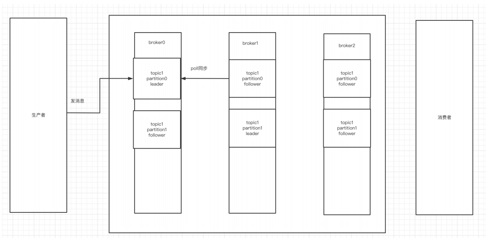

## 4.kafka集群消息的发送
```shell
./kafka-console-producer.sh --broker-list 192.168.142.128:9092,192.168.142.128:9093,192.168.142.128:9094 --topic my-replicated-topic
```

## 5.kafka集群消息的消费
```shell
./kafka-console-consumer.sh --bootstrap-server 192.168.142.128:9092,192.168.142.128:9093,192.168.142.128:9094 --from-beginning --topic my-replicated-topic
```


```shell
./kafka-console-consumer.sh --bootstrap-server 192.168.142.128:9092,192.168.142.128:9093,192.168.142.128:9094 --consumer-property group.id=testGroup1 --from-beginning --topic my-replicated-topic
```


## 6.关于分区消费组消费者的细节

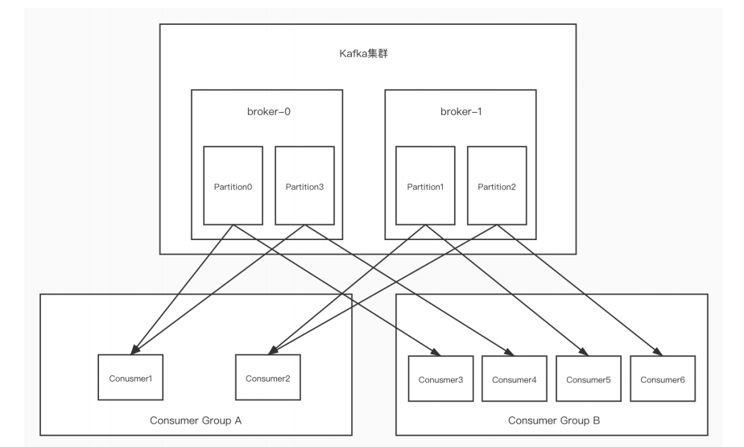

图中Kafka集群有两个broker，每个broker中有多个partition。**一个partition只能被一个消费组里的某一个消费者消费**，从而保证消费顺序。**Kafka只在partition的范围内保证消息消费的局部顺序性**，不能在同一个topic中的多个partition中保证总的消费顺序性。一个消费者可以消费多个partition。

`消费组中消费者的数量不能比一个topic中的partition数量多，否则多出来的消费者消费不到消息。`

> 之前说的一个topic只能被一个消费组中的一个消费者消费是因为还没引出partition概念，现在有了之后就应该是每个partition只能被消费组中的一个消费者消费

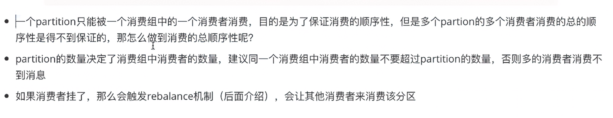

# 六、Kafka的Java客户端-生产者

## 1.引入依赖

kafka依赖的版本注意和使用的kafka保持一致

```xml
<dependency>
    <groupId>org.apache.kafka</groupId>
    <artifactId>kafka-clients</artifactId>
    <version>2.4.1</version>
</dependency>
```
## 2.生产者发送消息的基本实现

```java
//消息的发送⽅
public class MyProducer {
    private final static String TOPIC_NAME = "my-replicated-topic";


    public static void main(String[] args) throws ExecutionException,
            InterruptedException {
        //1.设置参数
        Properties props = new Properties();
        props.put(ProducerConfig.BOOTSTRAP_SERVERS_CONFIG,
                "192.168.142.128:9092,192.168.142.128:9093,192.168.142.128:9094");


        //把发送的key从字符串序列化为字节数组
        props.put(ProducerConfig.KEY_SERIALIZER_CLASS_CONFIG,
                StringSerializer.class.getName());
        //把发送消息value从字符串序列化为字节数组
        props.put(ProducerConfig.VALUE_SERIALIZER_CLASS_CONFIG,
                StringSerializer.class.getName());

        //2.创建生成消息的客服端,传入参数
        Producer<String, String> producer = new KafkaProducer<String,
                String>(props);
        //3.创建消息
        // key: 作用是决定了往那个分区上发，value：具体要发送的消息
        ProducerRecord<String, String> producerRecord = new
                ProducerRecord<String, String>(TOPIC_NAME
                , "mykey","hello,kafka");
        //4.发送消息，得到消息发送的元数据 ；         等待消息发送成功的同步阻塞⽅法
        RecordMetadata metadata = producer.send(producerRecord).get();
        //=====阻塞=======
        System.out.println("同步⽅式发送消息结果：" + "topic-" +
                metadata.topic() + "|partition-"
                + metadata.partition() + "|offset-" +
                metadata.offset());

    }
}
```

## 3.发送消息到指定分区上
```java
ProducerRecord<String, String> producerRecord = new ProducerRecord<String, String>(TOPIC_NAME, 0 , order.getOrderId().toString(), JSON.toJSONString(order));
```
## 4.未指定分区，则会通过业务key的hash运算，算出消息往哪个分区上发
```java
//未指定发送分区，具体发送的分区计算公式：hash(key)%partitionNum
ProducerRecord<String, String> producerRecord = new ProducerRecord<String, String>(TOPIC_NAME, order.getOrderId().toString(), JSON.toJSONString(order));
```
#### 源码

```java
//org.apache.kafka.clients.producer.internals.DefaultPartitioner#partition
public int partition(String topic, Object key, byte[] keyBytes, Object value, byte[] valueBytes, Cluster cluster) {
    if (keyBytes == null) {
        return stickyPartitionCache.partition(topic, cluster);
    } 
    List<PartitionInfo> partitions = cluster.partitionsForTopic(topic);
    int numPartitions = partitions.size();
    // hash the keyBytes to choose a partition
    return Utils.toPositive(Utils.murmur2(keyBytes)) % numPartitions;
}
```


## 5.生产者同步发送

生产者同步发消息，在收到kafka的ack告知发送成功之前一直处于阻塞状态


```java
//等待消息发送成功的同步阻塞方法
RecordMetadata metadata = producer.send(producerRecord).get();
System.out.println("同步方式发送消息结果：" + "topic-" +metadata.topic() + "|partition-"+ metadata.partition() + "|offset-" +metadata.offset());
```
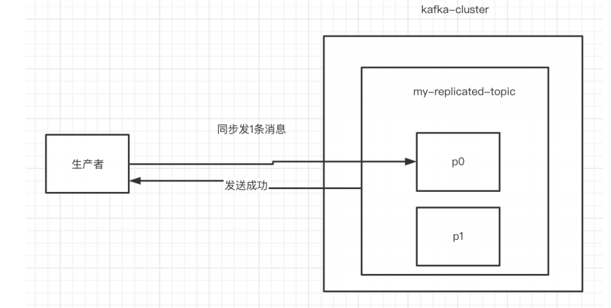


## 6.生成者异步发消息

生产者发消息，发送完后不用等待broker给回复，直接执行下面的业务逻辑。可以提供callback，让broker异步的调用callback，告知生产者，消息发送的结果

```java
//要发送 5 条消息
Order order = new Order((long) i, i);
//指定发送分区
ProducerRecord<String, String> producerRecord = new ProducerRecord<String, String>(TOPIC_NAME, 0 , order.getOrderId().toString(),JSON.toJSONString(order));
//异步回调方式发送消息
producer.send(producerRecord, new Callback() {
public void onCompletion(RecordMetadata metadata, Exception exception) {
if (exception != null) {
    System.err.println("发送消息失败：" +
    exception.getStackTrace());
}
if (metadata != null) {
System.out.println("异步方式发送消息结果：" + "topic-" +metadata.topic() + "|partition-"+ metadata.partition() + "|offset-" + metadata.offset());
         }
    }
});
```


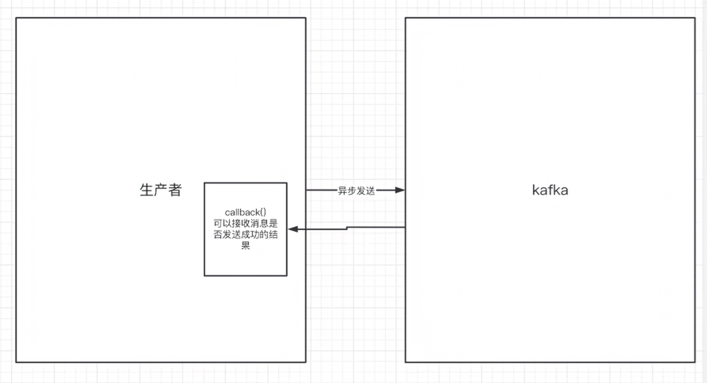

## 7.关于生产者的ack参数配置

### 在同步发消息的场景下：生产者发动broker上后，ack会有 3 种不同的选择：
* （ 1 ）acks=0： 表示producer不需要等待任何broker确认收到消息的回复，就可以继续发送下一条消息。性能最高，但是最容易丢消息。
* （ 2 ）acks=1： 至少要等待leader已经成功将数据写入本地log，但是不需要等待所有follower是否成功写入。就可以继续发送下一条消息。这种情况下，如果follower没有成功备份数据，而此时leader又挂掉，则消息会丢失。
* （ 3 ）acks=-1或all： 需要等待 min.insync.replicas(默认为 1 ，推荐配置大于等于2) 这个参数配置的副本个数都成功写入日志，这种策略会保证只要有一个备份存活就不会丢失数据。这是最强的数据保证。一般除非是金融级别，或跟钱打交道的场景才会使用这种配置。

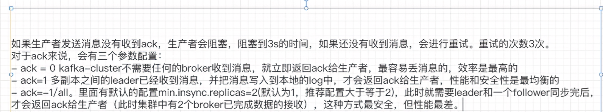

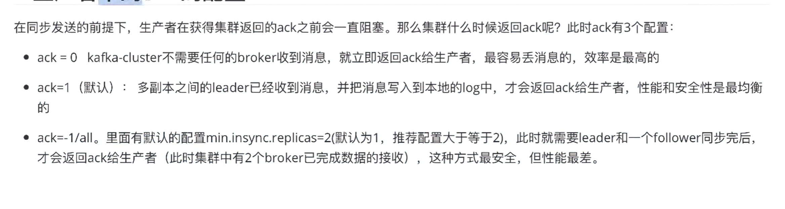

```java
/**
         * 发送消息需要到达何种持久化机制后，kafka才发送ack给生产者
         */
props.put(ProducerConfig.ACKS_CONFIG,"1");
```
### ack和重试的其他一些细节

* 发送会默认会重试 3 次，每次间隔100ms
* 发送的消息会先进入到本地缓冲区（32mb），kakfa会跑一个线程，该线程去缓冲区中取16k的数据，发送到kafka，如果到 10 毫秒数据没取满16k，也会发送一次。

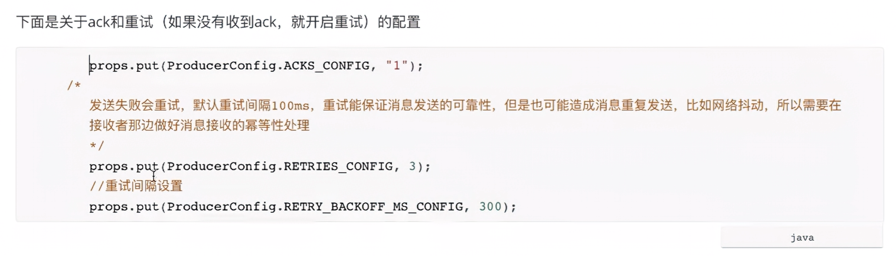

## 其他生产者配置

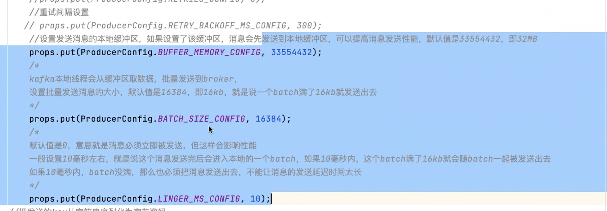

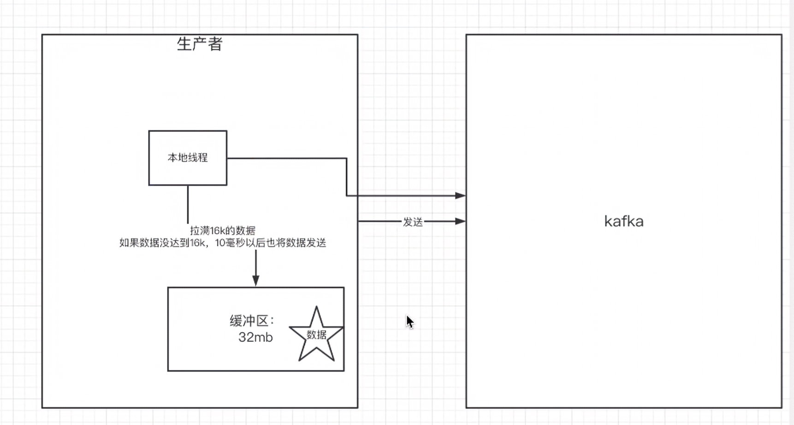

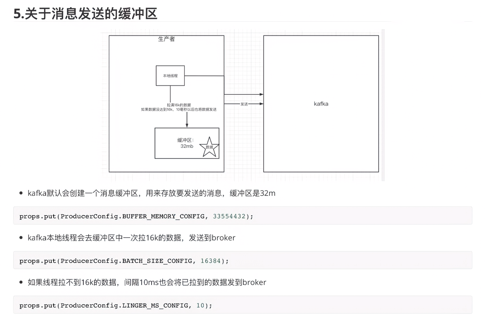


### Kafka Producer发送消息及分区策略

1、Producer代码实现 

ps:不建议使用自定义序列化和反序列化，他们会把生产者和消费者耦合在一起，且容易出错

```
// 同步发送消息、// 异步发送消息
public class KafkaProducerDemo {
    private static Properties prop;
    private static KafkaProducer<String, String> producer;

    private static final String TOPIC_NAME = "topic-07";
     
    static {
        // 具体的参数名可以从CommonClientConfigs、ProducerConfig获取
        prop = new Properties();
        prop.put("bootstrap.servers", "192.168.111.129:9092,192.168.111.129:9093,192.168.111.129:9094");
        prop.put("key.serializer", "org.apache.kafka.common.serialization.StringSerializer");
        prop.put("value.serializer", "org.apache.kafka.common.serialization.StringSerializer");
        prop.put("acks", "-1");// acks=0 表示不关系是否发送成功；acks=1表示leader写入成功；acks=-1或acks=all表示所有副本写入成功
        prop.put("retries", 0);
        prop.put("batch.size", 16384);// 消息发送批次大小，16KB，消息大小超过这个大小了，就发送
        prop.put("linger.ms", 1);// 消息发送间隔时间，1ms，等待时间到了，不管消息大小是否满足，就发送
        prop.put("buffer.memory", 33554432);
        producer = new KafkaProducer<>(prop);
    }
     
    public static void main(String[] args) {
        for (int i = 0; i < 10; i++) {
            syncSendMessage(i+"");
        }
        //asyncSendMessage();
    }
    /**
     * 异步发送消息
     **/
    private static void asyncSendMessage() {
        ProducerRecord<String, String> record = new roducerRecord<>(TOPIC_NAME, "kafka third message");
        try {
            Future<RecordMetadata> result = producer.send(record, new Callback() {
                @Override
                public void onCompletion(RecordMetadata metadata, exception exception) {
                    if (exception != null) {
                        exception.printStackTrace();
                    }
                }
            });
            System.out.println("分区：" + result.get().partition() + ", offset:" + result.get().offset());
        } catch (Exception e) {
            e.printStackTrace();
        }
    }
    /**
     * 同步发送消息
     **/
    private static void syncSendMessage(String content) {
        ProducerRecord<String, String> record = new ProducerRecord<>(TOPIC_NAME, content, "kafka second message");
        try {
            RecordMetadata result = producer.send(record).get();
            System.out.println("分区：" + result.partition() + ", offset:" + result.offset());
        } catch (Exception e) {
            e.printStackTrace();
        }
    }

}
```


#### 2、分区器

**客户端可以控制将消息发送到哪个分区**

**Kafka默认分区机制**（org.apache.kafka.clients.producer.internals.DefaultPartitioner）：

- **如果记录中指定了分区，则直接使用**
- **如果未指定分区，但指定了key值，则根据key的hash值选择一个分区**（相同的key所发送到的Partition是同一个，可用来保证消息的局部有序性）
- **如果未指定分区，也未指定key值，则以 '黏性分区' 策略（2.4版本以前使用轮询策略）选择一个分区**

##### 分区策略

- 轮询策略（org.apache.kafka.clients.producer.RoundRobinPartitioner）:如果key值为null，并且使用了默认的分区器，Kafka会根据轮训（Random Robin）策略将消息均匀地分布到各个分区上。
- 散列策略（Utils.toPositive(Utils.murmur2(keyBytes)) % numPartitions）:如果键值不为null，并且使用了默认的分区器，Kafka会对键进行散列，然后根据散列值把消息映射到对应的分区上
- **黏性分区策略**（org.apache.kafka.clients.producer.UniformStickyPartitioner）
  - 很多时候消息是没有指定Key的。而Kafka 2.4之前的策略是轮询策略，这种策略在使用中性能比较低。所以2.4中版本加入了黏性分区策略（Sticky Partitioning Strategy）。
  - 黏性分区器（Sticky Partitioner）主要思路是选择单个分区发送所有无Key的消息。一旦这个分区的batch已满或处于“已完成”状态，黏性分区器会随机地选择另一个分区并会尽可能地坚持使用该分区——象黏住这个分区一样

- 自定义策略
  - 默认分区器是使用次数最多的分区器。除了散列分区之外，用户可以根据需要对数据使用不一样的分区策略
  - 实现org.apache.kafka.clients.producer.Partitioner接口，在配置中设置实现的类prop.put("partitioner.class", 实现类);

原文链接：https://blog.csdn.net/qq_31473465/article/details/108080116

# 七、Java客户端-消费者

## 1.消费者消费消息的基本实现
```java
public class MyConsumer {
    private final static String TOPIC_NAME = "my-replicated-topic";
    private final static String CONSUMER_GROUP_NAME = "testGroup";

    public static void main(String[] args) {
        Properties props = new Properties();
        props.put(ConsumerConfig.BOOTSTRAP_SERVERS_CONFIG,"192.168.142.128:9092,192.168.142.128:9093,192.168.142.128:9094");
        // 消费分组名
        props.put(ConsumerConfig.GROUP_ID_CONFIG, CONSUMER_GROUP_NAME);
        props.put(ConsumerConfig.KEY_DESERIALIZER_CLASS_CONFIG,StringDeserializer.class.getName());
        props.put(ConsumerConfig.VALUE_DESERIALIZER_CLASS_CONFIG,StringDeserializer.class.getName());
        //创建一个消费者的客户端
        KafkaConsumer<String, String> consumer = new KafkaConsumer<String,String>(props);
        // 消费者订阅主题列表
        consumer.subscribe(Arrays.asList(TOPIC_NAME));

        while (true) {
            /*
* poll() API 是拉取消息的⻓轮询
*/
            ConsumerRecords<String, String> records =consumer.poll(Duration.ofMillis( 1000 ));
            for (ConsumerRecord<String, String> record : records) {
                System.out.printf("收到消息：partition = %d,offset = %d, key =%s, value = %s%n", record.partition(),record.offset(), record.key(), record.value());
            }
        }
    }
}
```

## 消费者自动提交和手动提交offset

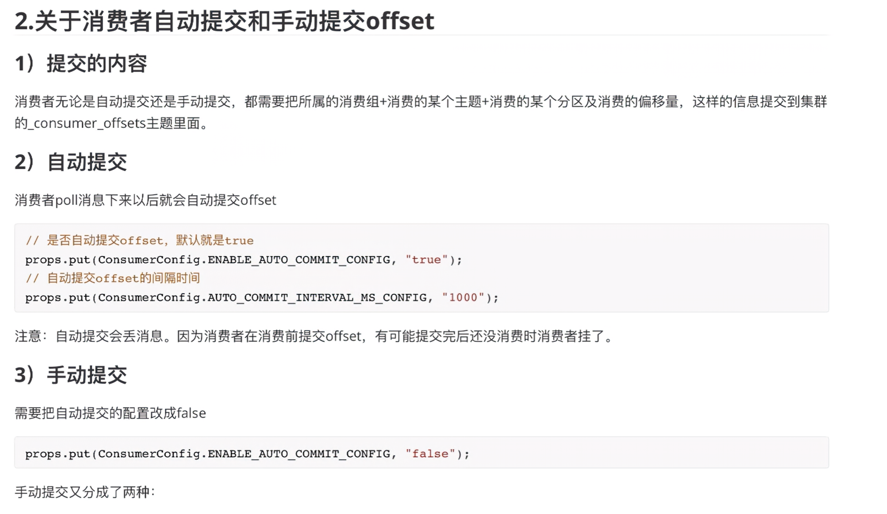

### 2.自动提交offset

* 设置自动提交参数 - 默认

```java
// 是否自动提交offset，默认就是true
props.put(ConsumerConfig.ENABLE_AUTO_COMMIT_CONFIG, "true");
// 自动提交offset的间隔时间
props.put(ConsumerConfig.AUTO_COMMIT_INTERVAL_MS_CONFIG, "1000");
```

消费者poll到消息后默认情况下，会自动向broker的_consumer_offsets主题提交当前主题-分区消费的偏移量。

自动提交会丢消息： 因为如果消费者还没消费完poll下来的消息就自动提交了偏移量，那么此 时消费者挂了，于是下一个消费者会从已提交的offset的下一个位置开始消费消息。之前未被消费的消息就丢失掉了。

### 3.手动提交offset

* 设置手动提交参数

```java
props.put(ConsumerConfig.ENABLE_AUTO_COMMIT_CONFIG, "false");
```
### 在消费完消息后进行手动提交

* 手动同步提交
```java

while (true) {
    /*
             * poll() API 是拉取消息的⻓轮询
             */
    ConsumerRecords<String, String> records = consumer.poll(Duration.ofMillis(1000));
    for (ConsumerRecord<String, String> record : records) {
        System.out.printf("收到消息：partition = %d,offset = %d, key =%s, value = %s%n", record.partition(), record.offset(), record.key(), record.value());
    }

    if (records.count() > 0 ) {
        // 手动同步提交offset，当前线程会阻塞直到offset提交成功
        // 一般使用同步提交，因为提交之后一般也没有什么逻辑代码了
        consumer.commitSync();
    }
}
```
* 手动异步提交
```java
while (true) {
    /*
             * poll() API 是拉取消息的⻓轮询
             */
    ConsumerRecords<String, String> records = consumer.poll(Duration.ofMillis(1000));
    for (ConsumerRecord<String, String> record : records) {
        System.out.printf("收到消息：partition = %d,offset = %d, key =%s, value = %s%n", record.partition(), record.offset(), record.key(), record.value());
    }

    // 所有的消息已经消费完
    if (records.count() > 0) {  // 有消息
        // 手动异步提交offset，当前线程提交offset不会阻塞，可以继续处理后面的程序逻辑
        consumer.commitAsync(new OffsetCommitCallback() {
            @Override
            public void onComplete(Map<TopicPartition, OffsetAndMetadata> offsets, Exception exception) {
                if (exception != null) {
                    System.err.println("Commit failed for " + offsets);
                    System.err.println("Commit failed exception: " + exception.getStackTrace());
                }
            }
        });
    }
}
```

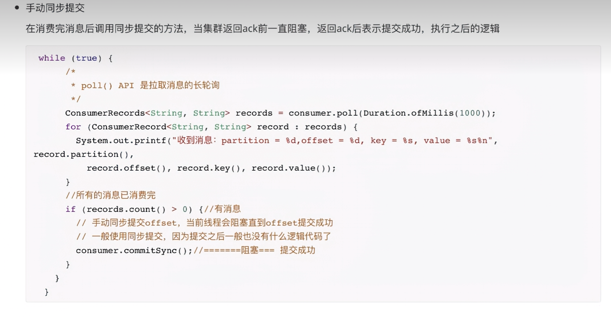

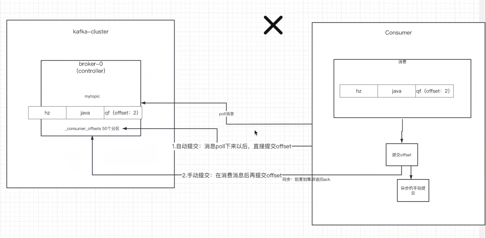


## 4.消费者poll消息的过程

* 消费者建立了与broker之间的⻓连接，开始poll消息。
* **默认一次poll 500条消息**


```java
props.put(ConsumerConfig.MAX_POLL_RECORDS_CONFIG, 500 );
```

可以根据消费速度的快慢来设置，因为如果两次poll的时间如果超出了30s的时间间隔，kafka会认为其消费能力过弱，将其踢出消费组。将分区分配给其他消费者。

可以通过这个值进行设置：
```java
props.put(ConsumerConfig.MAX_POLL_INTERVAL_MS_CONFIG, 30 * 1000 );
```

如果**每隔1s内没有poll到任何消息**，则继续去poll消息，循环往复，直到poll到消息。**如果超出了1s，则此次⻓轮询结束。**

> 这个地方恐怕讲的是错的，这里应该类似servlet3.0的长轮询，也就是1秒内没有达到500条记录时会等待1秒再返回

```java
ConsumerRecords<String, String> records =consumer.poll(Duration.ofMillis( 1000 ));
```
消费者发送心跳的时间间隔

```java
props.put(ConsumerConfig.HEARTBEAT_INTERVAL_MS_CONFIG, 1000 );
```

kafka如果超过 10 秒没有收到消费者的心跳，则会把消费者踢出消费组，进行rebalance，把分区分配给其他消费者。

```java
props.put(ConsumerConfig.SESSION_TIMEOUT_MS_CONFIG, 10 * 1000 );
```
## 长轮询poll消息

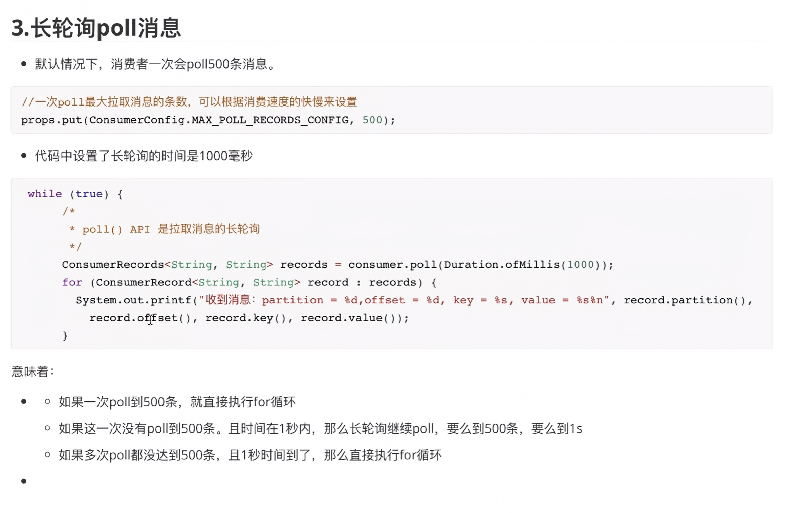

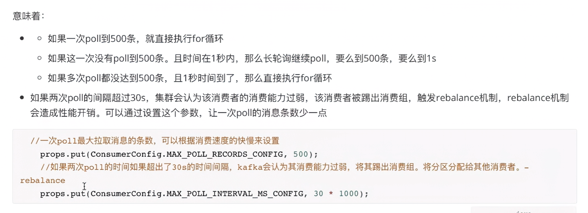

## 消费者的健康状态检查

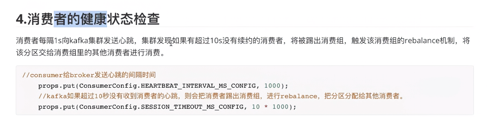

## 指定分区、偏移量、时间消费

```java
//创建一个消费者的客户端
KafkaConsumer<String, String> consumer = new KafkaConsumer<String, String>(props);
```


### 指定分区消费

```java
consumer.assign(Arrays.asList(new TopicPartition(TOPIC_NAME, 0 )));
```
### 消息从头消费
```java
//消息回溯消费
consumer.assign(Arrays.asList(new TopicPartition(TOPIC_NAME, 0 )));
consumer.seekToBeginning(Arrays.asList(new TopicPartition(TOPIC_NAME,0 )));
```
### 指定offset消费
```java
//指定offset消费
consumer.assign(Arrays.asList(new TopicPartition(TOPIC_NAME, 0 )));
consumer.seek(new TopicPartition(TOPIC_NAME, 0 ), 10 );
```
### 8.从指定时间点消费

```java
//从指定时间点消费
List<PartitionInfo> topicPartitions =consumer.partitionsFor(TOPIC_NAME);
//从 1 小时前开始消费
long fetchDataTime = new Date().getTime() - 1000 * 60 * 60 ;
Map<TopicPartition, Long> map = new HashMap<>();
for (PartitionInfo par : topicPartitions) {
    map.put(new TopicPartition(TOPIC_NAME, par.partition()),fetchDataTime);
}
Map<TopicPartition, OffsetAndTimestamp> parMap =consumer.offsetsForTimes(map);
for (Map.Entry<TopicPartition, OffsetAndTimestamp> entry :parMap.entrySet()) {
    TopicPartition key = entry.getKey();
    OffsetAndTimestamp value = entry.getValue();
    if (key == null || value == null) continue;
    Long offset = value.offset();
    System.out.println("partition-" + key.partition() +"|offset-" + offset);
    System.out.println();
    //根据消费里的timestamp确定offset
    if (value != null) {
        consumer.assign(Arrays.asList(key));
        consumer.seek(key, offset);
    }
}
```

## 9.新消费组的消费偏移量offset规则


当**消费主题的是一个新的消费组**，或者指定offset的消费方式，offset不存在，那么应该如何消费?

* latest(默认) ：只消费自己启动之后发送到主题的消息
* earliest：第一次从头开始消费，以后按照消费offset记录继续消费，这个需要区别于consumer.seekToBeginning(每次都从头开始消费)


```java
//新消费组的消费偏移量offset规则
props.put(ConsumerConfig.AUTO_OFFSET_RESET_CONFIG, "earliest");
```


> ```
> Properties props = new Properties();
> props.put(ConsumerConfig.BOOTSTRAP_SERVERS_CONFIG, "192.168.142.128:9092,192.168.142.128:9093,192.168.142.128:9094");
> // 消费分组名
> props.put(ConsumerConfig.GROUP_ID_CONFIG, CONSUMER_GROUP_NAME);
> props.put(ConsumerConfig.KEY_DESERIALIZER_CLASS_CONFIG, StringDeserializer.class.getName());
> props.put(ConsumerConfig.VALUE_DESERIALIZER_CLASS_CONFIG, StringDeserializer.class.getName());
> ```

# 八 、Springboot中使用Kafka

## 1.引入依赖
```xml
<dependency>
    <groupId>org.springframework.kafka</groupId>
    <artifactId>spring-kafka</artifactId>
</dependency>
```

## 2.配置文件

```yml
server:
    port: 8080
spring:
    kafka:
        bootstrap-servers: 172.16.253.21: 9093
        producer: # 生产者
            retries: 3 # 设置大于 0 的值，则客户端会将发送失败的记录重新发送
            batch-size: 16384
            buffer-memory: 33554432
            acks: 1
            # 指定消息key和消息体的编解码方式
            key-serializer: org.apache.kafka.common.serialization.StringSerializer
            value-serializer: org.apache.kafka.common.serialization.StringSerializer
        consumer:
            group-id: default-group
            enable-auto-commit: false
            auto-offset-reset: earliest
            key-deserializer: org.apache.kafka.common.serialization.StringDeserializer
            value-deserializer: org.apache.kafka.common.serialization.StringDeserializer
            max-poll-records: 500
        listener:
        # 当每一条记录被消费者监听器（ListenerConsumer）处理之后提交
        # RECORD
        # 当每一批poll()的数据被消费者监听器（ListenerConsumer）处理之后提交
        # BATCH
        # 当每一批poll()的数据被消费者监听器（ListenerConsumer）处理之后，距离上次提交时间大于TIME时提交
        # TIME
        # 当每一批poll()的数据被消费者监听器（ListenerConsumer）处理之后，被处理record数量大于等于COUNT时提交
        # COUNT
        # TIME | COUNT　有一个条件满足时提交
        # COUNT_TIME
        # 当每一批poll()的数据被消费者监听器（ListenerConsumer）处理之后, 手动调用Acknowledgment.acknowledge()后提交
        # MANUAL
        # 手动调用Acknowledgment.acknowledge()后立即提交，一般使用这种
        # MANUAL_IMMEDIATE
            ack-mode: MANUAL_IMMEDIATE
    redis:
        host: 172.16.253.21
```

## 3.消息生产者
* 发送消息到指定topic

```java
@RestController
public class KafkaController {
    private final static String TOPIC_NAME = "my-replicated-topic";
    @Autowired
    private KafkaTemplate<String, String> kafkaTemplate;
    @RequestMapping("/send")
    public void send() {
        kafkaTemplate.send(TOPIC_NAME, 0 , "key", "this is a msg");
    }
}
```

## 4.消息消费者
* 设置消费组，消费指定topic
```java
@Component
public class MyConsumer {
    @KafkaListener(topics = "my-replicated-topic",groupId = "MyGroup1")
    public void listenGroup(ConsumerRecord<String, String> record,Acknowledgment ack) {
        String value = record.value();
        System.out.println(value);
        System.out.println(record);
        //手动提交offset
        ack.acknowledge();
    }
}
```

* 设置消费组、多topic、指定分区、指定偏移量消费及设置消费者个数。

```java
@KafkaListener(groupId = "testGroup", topicPartitions = {
@TopicPartition(topic = "topic1", partitions = {"0", "1"}),
@TopicPartition(topic = "topic2", partitions = "0",partitionOffsets = @PartitionOffset(partition = "1",initialOffset = "100"))}
,concurrency = "3")//concurrency就是同组下的消费者个数，就是并发消费数，建议小于等于分区总数
public void listenGroup(ConsumerRecord<String, String> record,Acknowledgment ack) {
    String value = record.value();
    System.out.println(value);
    System.out.println(record);
    //手动提交offset
    ack.acknowledge();
}
```

# 九、Kafka集群Controller、Rebalance和HW

## 1.Controller

* Kafka集群中的broker在zk中创建临时序号节点，**序号最小的节点（最先创建的节点）将作为集群的controller**，负责管理整个集群中的所有分区和副本的状态：
    - 当集群中有一个副本的leader挂掉，需要在集群中选举出一个新的leader，选举的规则是从isr集合中最左边获得。
    - 当集群中有broker新增或减少，controller会同步信息给其他broker
    - 当集群中有分区新增或减少，controller会同步信息给其他broker

## 2.Rebalance机制

- **前提是：消费者没有指明分区消费**。
- **触发条件：**当**消费组里消费者和分区的关系发生变化**，那么就会触发rebalance机制。
- 这个机制会**重新调整消费者消费哪个分区。**

**分区分配的策略**：在触发rebalance机制之前，消费者消费哪个分区有三种策略：

* range：通过公式来计算某个消费者消费哪个分区
  - n = 分区数/消费者数量；  m = 分区数%消费者数量；  前m个消费者每个分配n+1个分区，后面的 （消费者数量-m）个消费者每个分配n个分区
* 轮询：消费者轮着消费所有的分区（consumer1->partition0,consumer2->partition1,...）
* sticky:粘合策略，如果需要rebalance，会**在之前已分配的基础上调整，不会改变之前的分配情况**。如果这个策略没有开，那么就要进行全部的重新分配。**建议开启。**


## 3.HW和LEO

- ISR，In-Sync Replicas： 能够和 leader 保持同步的 follower + leader本身 组成的集合
- LEO是某个副本最后消息的消息位置(log-end-offset)

HW俗称高水位，HighWatermark的缩写，**取一个partition对应的ISR（In-Sync Replicas）中最小的LEO(log-end-offset)作为HW**，**consumer最多只能消费到HW所在的位置**。另外每个replica都有HW,leader和follower各自负责更新自己的HW的状态。对于leader新写入的消息，consumer不能立刻消费，leader会等待该消息被所有ISR中的replicas同步后更新HW，此时消息才能被consumer消费。这样就保证了如果leader所在的broker失效，该消息仍然可以从新选举的leader中获取。

HW是已完成同步的位置。消息在写入broker时，且每个broker完成这条消息的同步后， hw才会变化。在这之前消费者是消费不到这条消息的。在同步完成之后，HW更新之后，消费者才能消费到这条消息，这样的目的是**防止消息的丢失。**


也就是保证同步到副本之后才能够开始消费


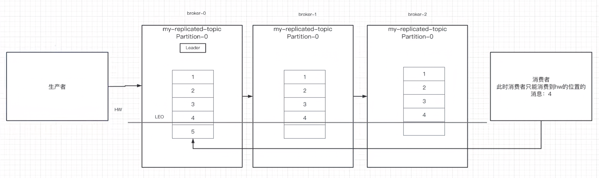


# 十、Kafka线上问题优化

## 1.如何防止消息丢失

* 生产者： ack是 1 或者-1/all 可以防止消息丢失，如果要做到99.9999%，ack设成all，把min.insync.replicas配置成分区备份数
* 消费方：**把自动提交改为手动提交。**

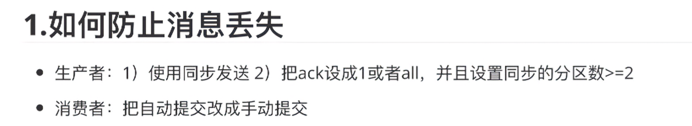

## 2.如何防止消息的重复消费

一条消息被消费者消费多次。如果为了消息的不重复消费，而把生产端的重试机制关闭、消费端的手动提交改成自动提交，这样反而会出现消息丢失，那么可以直接在防治消息丢失的手段上再加上消费消息时的幂等性保证，就能解决消息的重复消费问题。

### 幂等性如何保证：

* mysql 插入业务id作为主键，主键是唯一的，所以一次只能插入一条
* 使用redis或zk的分布式锁（主流的方案）


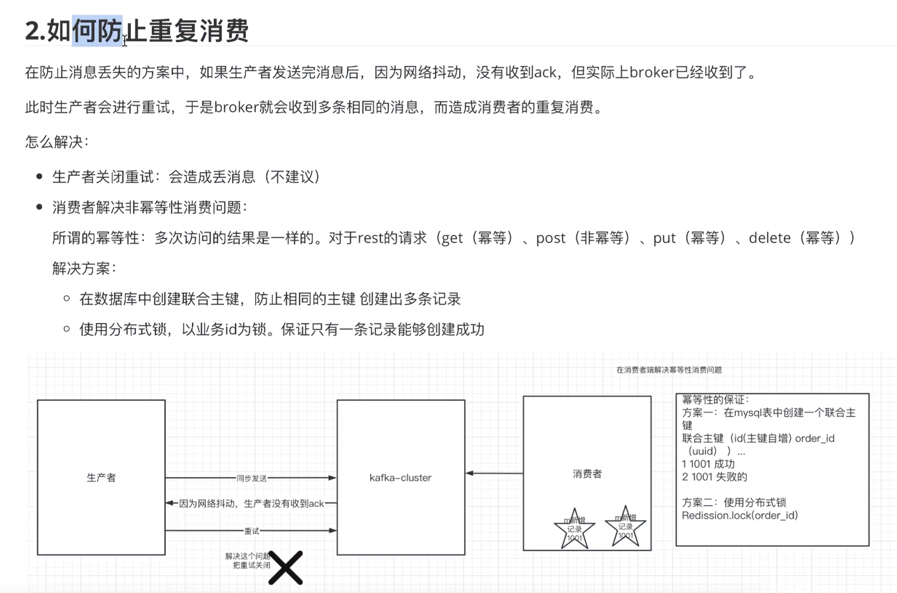

## 3.如何做到顺序消费RocketMQ

* 发送方：在发送时将ack不能设置 0 ，关闭重试，**使用同步发送，等到发送成功再发送下一条。确保消息是顺序发送的。**
* 接收方：消息是发送到一个分区中，只能有一个消费组的消费者来接收消息。因此，kafka的顺序消费会牺牲掉性能。

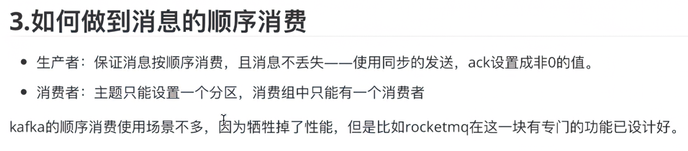

## 4.解决消息积压问题

>消息积压会导致很多问题，比如磁盘被打满、生产端发消息导致kafka性能过慢，就容易出现服务雪崩，就需要有相应的手段：

* 方案一：在一个消费者中启动多个线程，让多个线程同时消费。——提升一个消费者的消费能力（增加分区增加消费者）。
* 方案二：如果方案一还不够的话，这个时候可以启动多个消费者，多个消费者部署在不同的服务器上。其实多个消费者部署在同一服务器上也可以提高消费能力——充分利用服务器的cpu资源。
* 方案三：让一个消费者去把收到的消息往另外一个topic上发，另一个topic设置多个分区和多个消费者 ，进行具体的业务消费。

## 5.延迟队列

延迟队列的应用场景：在订单创建成功后如果超过 30 分钟没有付款，则需要取消订单，此时可用延时队列来实现

* 创建多个topic，每个topic表示延时的间隔
    * topic_5s: 延时5s执行的队列
    * topic_1m: 延时 1 分钟执行的队列
    * topic_30m: 延时 30 分钟执行的队列

* 消息发送者发送消息到相应的topic，并带上消息的发送时间
* 消费者订阅相应的topic，消费时轮询消费整个topic中的消息
    * 如果消息的发送时间，和消费的当前时间超过预设的值，比如 30 分钟
    * 如果消息的发送时间，和消费的当前时间没有超过预设的值，则不消费当前的offset及之后的offset的所有消息都消费
    * 下次继续消费该offset处的消息，判断时间是否已满足预设值

> 没到时间不提交offset不可以么

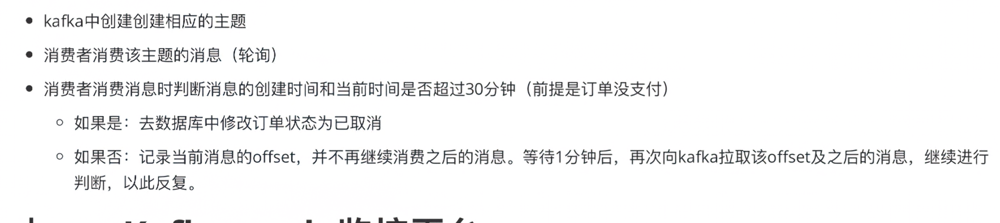

# 十一、Kafka-eagle监控平台

## 安装Kafka-eagle

### 官网下载压缩包

http://www.kafka-eagle.org/

* 安装jdk
* 解压缩后修改配置文件 system-config.properties

```shell
# 配置zk  去掉cluster2
efak.zk.cluster.alias=cluster1
cluster1.zk.list=192.168.142.128:2181
# cluster2.zk.list=xdn10:2181,xdn11:2181,xdn12:2181

# 配置mysql
kafka.eagle.driver=com.mysql.cj.jdbc.Driver
kafka.eagle.url=jdbc:mysql://192.168.52.1:3306/ke?useUnicode=true&characterEncoding=UTF-8&zeroDateTimeBehavior=convertToNull
kafka.eagle.username=root
kafka.eagle.password= 123456
```

* 修改/etc/profile
```
/usr/local/kafka-eagle/kafka-eagle-bin-3.0.1/efak-web-3.0.1/
```


```shell
export  JAVA_HOME=/usr/lib/jvm/java-17-openjdk-amd64
CLASSPATH=.:$JAVA_HOME/lib/tools.jar:$JAVA_HOME/lib/dt.jar

export KE_HOME=/usr/local/kafka-eagle/kafka-eagle-bin-3.0.1/efak-web-3.0.1/
export PATH=$PATH:$KE_HOME/bin:$JAVA_HOME/bin
```

* 刷新配置
```
source /etc/profile
```

* 进入到bin目录，为ke.sh增加可执行的权限

```shell
chmod +x ke.sh
```

* 启动kafka-eagle
```
./ke.sh start
```

输入网址查看：

192.168.142.128:8048/ke

# Reference

- 参考链接地址：https://bright-boy.gitee.io/technical-notes/#/kafka/kafka
- 本地代码地址：

# spring boot 的配置不生效的问题

结论：检查一下项目的打包方式是否是pom，如果是则改成jar或者去掉`<packaging>`标签(默认就是jar包的方式打包)

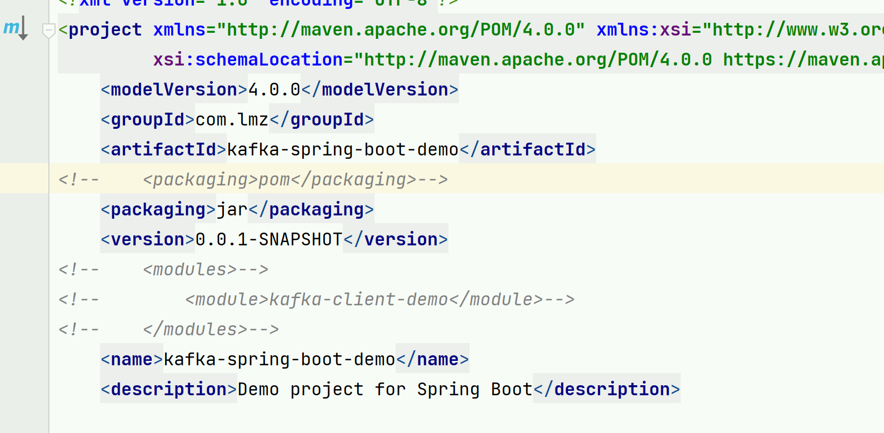

## 发送原因：

**自己在springboot下创建了一个子module**，导致idea**自动将该springboot变为了该子module的父模块**，然后直接修改了该springboot项目的pom文件的packaging类型