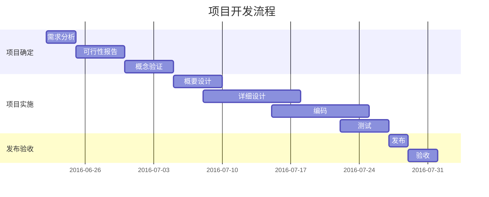
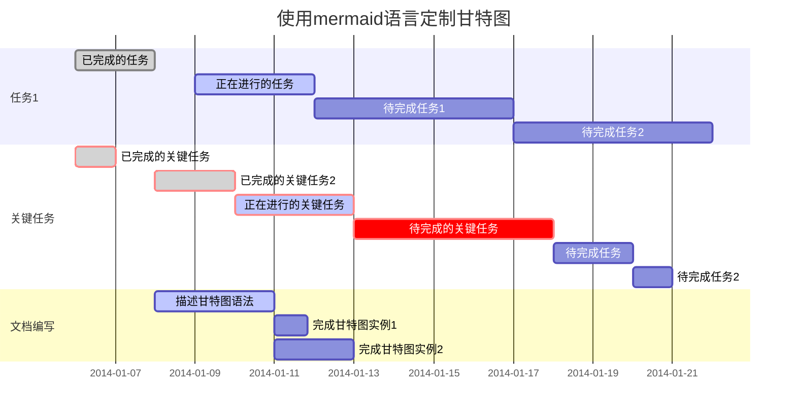
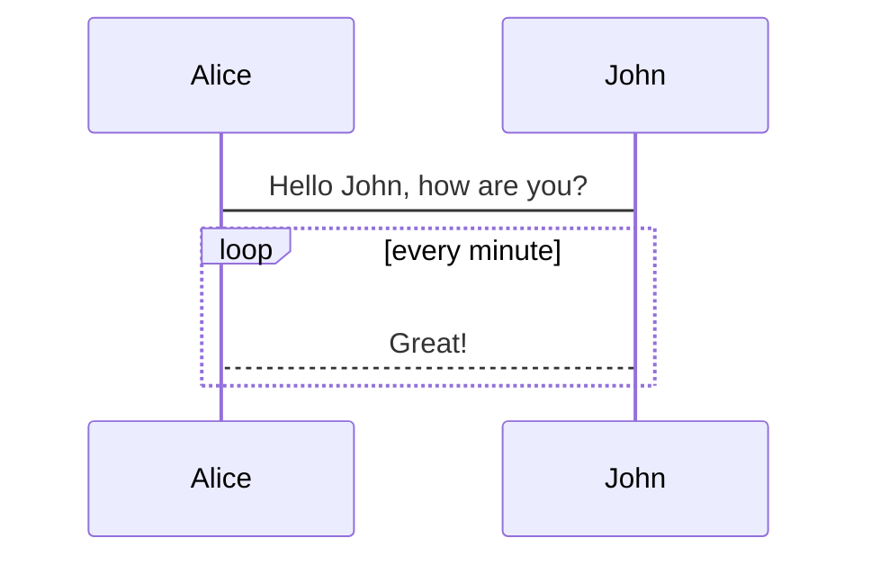
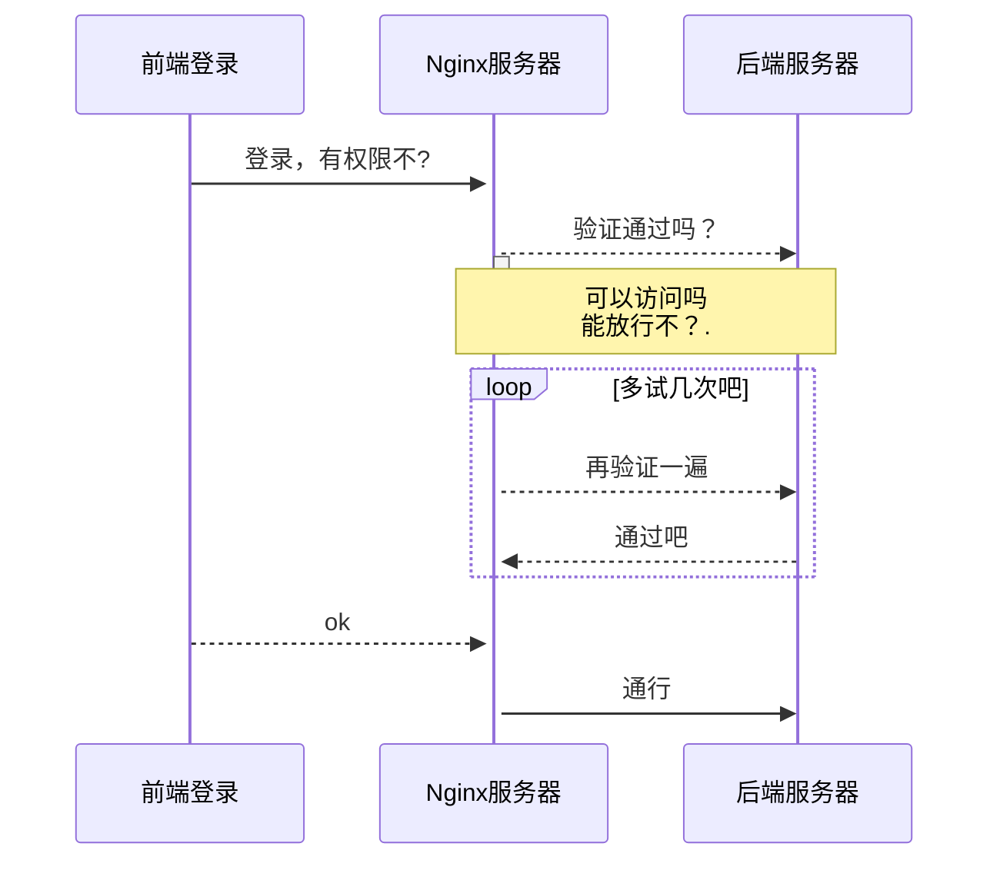

[[TOC]]  

# Markdown 

## Markdown 基本语法

标签： Markdown 

[Markdown 官方教程](https://markdown.com.cn/)

[Markdown 菜鸟教程](http://it028.com/md-tutorial.html)

[**Markdown 基本语法**](https://markdown.com.cn/basic-syntax/)

---

### 文本编辑

#### 1. 斜体和粗体

使用 * 和**表示斜体和粗体。

```markdown
*斜体文本*
**粗体文本**
***粗斜体文本***
```

效果如下：
*斜体文本*
**粗体文本**
***粗斜体文本***

#### 2. 删除线

使用 ~~ 表示删除线。

~~这是一段错误的文本。~~

#### 3.分隔线

你可以在一行中用三个以上的星号、减号、底线来建立一个分隔线，行内不能有其他东西。你也可以在星号或是减号中间插入空格。下面每种写法都可以建立分隔线：

```markdown
***

---

___
```

效果如下：
***

---

___

#### 4. 文字引用

使用 > 表示文字引用。

示例：

> 野火烧不尽，春风吹又生。

#### 5. 分级标题

使用 === 表示一级标题，使用 --- 表示二级标题。

示例：

```markdown
这是一个一级标题
============================

这是一个二级标题
--------------------------------------------------

#### 这是一个三级标题
```

你也可以选择在行首加井号表示不同级别的标题 (H1-H6)，例如：## H1, ### H2, #### H3，##### H4。

#### 使用 Emoji 表情

有两种方法可以将表情符号添加到Markdown文件中：将表情符号复制并粘贴到Markdown格式的文本中，或者键入*emoji shortcodes*。

##### [#](https://markdown.com.cn/extended-syntax/emoji.html#复制和粘贴表情符号)复制和粘贴表情符号

在大多数情况下，您可以简单地从[Emojipedia](https://emojipedia.org/) 等来源复制表情符号并将其粘贴到文档中。许多Markdown应用程序会自动以Markdown格式的文本显示表情符号。从Markdown应用程序导出的HTML和PDF文件应显示表情符号。

**Tip:** 如果您使用的是静态网站生成器，请确保将HTML页面编码为UTF-8。.

##### [#](https://markdown.com.cn/extended-syntax/emoji.html#使用表情符号简码)使用表情符号简码

一些Markdown应用程序允许您通过键入表情符号短代码来插入表情符号。这些以冒号开头和结尾，并包含表情符号的名称。

```text
去露营了！ :tent: 很快回来。

真好笑！ :joy:
```

呈现的输出如下所示：

去露营了！⛺很快回来。

真好笑！😂

**Note:** 注意：您可以使用此[表情符号简码列表](https://gist.github.com/rxaviers/7360908)，但请记住，表情符号简码因应用程序而异。有关更多信息，请参阅Markdown应用程序的文档。

###  链接语法

链接文本放在中括号内，链接地址放在后面的括号中，链接title可选。

超链接Markdown语法代码：`[超链接显示名](超链接地址 "超链接title")`

示例：

这是去往 [本人博客](https://codeofli.github.io/ "本人博客") 的链接。

> 注：**链接 和html一样能使用相对路径**

[Git.md](../Git/Git.md "Git笔记")

```markdown
[Git.md](../Git/Git.md)
[百度](www.baidu.com)
[本人博客](https://codeofli.github.io/) 
```

#### md页面内跳转

```objectivec
[超链接显示名](#标题名 "超链接title")
```

**说明：**

- `标题` 是可选的，可以用单引号 或 双引号；
- 文件内标题名：#+标题号

**转换成HTML后，会生成如下标签：**

```xml
<a href="#标题名" title="超链接title">内容</a>
```

如：

[md页面内跳转](#链接语法 "跳转到链接语法")

### 列表

#### 4. 无序列表

使用- 表示无序列表。

```markdown
- 无序列表项
```
示例：
- 无序列表项 
#### 5. 有序列表

使用数字和点表示有序列表。

示例：

1. 有序列表项 一
2. 有序列表项 二
3. 有序列表项 三


### 插入图像

要添加图像，请使用感叹号 (`!`), 然后在方括号增加替代文本，图片链接放在圆括号里，括号里的链接后可以增加一个可选的图片标题文本。

插入图片Markdown语法代码：``。

示例：


### 代码

#### 1. 行内代码块

使用 `` `表示行内代码块。

```markdown
让我们聊聊 `html`。
```

示例：

让我们聊聊 `html`。

#### 2.  代码块

使用 四个缩进空格 和```+type 表示代码块。

示例：


    这是一个代码块，此行左侧有四个不可见的空格。

```markdown
​```
这是一个代码块，此行左侧有四个不可见的空格。
​```
```

#### 3. 加强的代码块

支持四十一种编程语言的语法高亮的显示，行号显示。

非代码示例：

```
$ sudo apt-get install vim-gnome
```

Python 示例：

```python
@requires_authorization
def somefunc(param1='', param2=0):
    '''A docstring'''
    if param1 > param2: ## interesting
        print 'Greater'
    return (param2 - param1 + 1) or None

class SomeClass:
    pass

>>> message = '''interpreter
... prompt'''
```

JavaScript 示例：

``` javascript
/**
* nth element in the fibonacci series.
* @param n >= 0
* @return the nth element, >= 0.
*/
function fib(n) {
  var a = 1, b = 1;
  var tmp;
  while (--n >= 0) {
    tmp = a;
    a += b;
    b = tmp;
  }
  return a;
}

document.write(fib(10));
```

## Markdown 高阶语法

### 内容目录

在段落中填写 `[TOC]` 以显示全文内容的目录结构。

TOC,**table of contents,内容列表,目录**

[TOC]

### 2. ~~标签分类~~

在编辑区任意行的列首位置输入以下代码给文稿标签：

标签： 数学 英语 Markdown

或者

Tags： 数学 英语 Markdown


### 注脚

使用 [^keyword] 表示注脚。

这是一个注脚[^footnote]的样例。

这是第二个注脚[^footnote2]的样例。

### 画图支持

#### 7. 流程图

##### 示例

```flow
st=>start: Start:>https://www.zybuluo.com
io=>inputoutput: verification
op=>operation: Your Operation
cond=>condition: Yes or No?
sub=>subroutine: Your Subroutine
e=>end

st->io->op->cond
cond(yes)->e
cond(no)->sub->io
```

##### 更多语法参考：[流程图语法参考](http://adrai.github.io/flowchart.js/)

#### 8. 序列图

##### 示例 1

```seq
Alice->Bob: Hello Bob, how are you?
Note right of Bob: Bob thinks
Bob-->Alice: I am good thanks!
```

##### 示例 2

```seq
Title: Here is a title
A->B: Normal line
B-->C: Dashed line
C->>D: Open arrow
D-->>A: Dashed open arrow
```

##### 更多语法参考：[序列图语法参考](http://bramp.github.io/js-sequence-diagrams/)

#### 9. 甘特图

甘特图内在思想简单。基本是一条线条图，横轴表示时间，纵轴表示活动（项目），线条表示在整个期间上计划和实际的活动完成情况。它直观地表明任务计划在什么时候进行，及实际进展与计划要求的对比。





##### 更多语法参考：[甘特图语法参考](https://mermaid-js.github.io/mermaid/#/gantt)

#### 10. Mermaid 流程图

```graphLR
    A[Hard edge] -->|Link text| B(Round edge)
    B --> C{Decision}
    C -->|One| D[Result one]
    C -->|Two| E[Result two]
```

##### 更多语法参考：[Mermaid 流程图语法参考](https://knsv.github.io/mermaid/#flowcharts-basic-syntax)

> [参考博客](https://www.jianshu.com/p/a0dabf0b6815)

#### 11. Mermaid 序列图



示例



##### 更多语法参考：[Mermaid 序列图语法参考](https://knsv.github.io/mermaid/#sequence-diagrams)

> [参考博客](https://blog.csdn.net/googgirl/article/details/108336025)

12. 表格支持

| 项目   |   价格 | 数量 |
| ------ | -----: | :--: |
| 计算机 | \$1600 |  5   |
| 手机   |   \$12 |  12  |
| 管线   |    \$1 | 234  |


#### ~~13. 定义型列表~~

名词 1
:    定义 1（左侧有一个可见的冒号和四个不可见的空格）

代码块 2
:    这是代码块的定义（左侧有一个可见的冒号和四个不可见的空格）

        代码块（左侧有八个不可见的空格）

#### 14. Html 标签

本站支持在 Markdown 语法中嵌套 Html 标签，譬如，你可以用 Html 写一个纵跨两行的表格：

    <table>
        <tr>
            <th rowspan="2">值班人员</th>
            <th>星期一</th>
            <th>星期二</th>
            <th>星期三</th>
        </tr>
        <tr>
            <td>李强</td>
            <td>张明</td>
            <td>王平</td>
        </tr>
    </table>


<table>
    <tr>
        <th rowspan="2">值班人员</th>
        <th>星期一</th>
        <th>星期二</th>
        <th>星期三</th>
    </tr>
    <tr>
        <td>李强</td>
        <td>张明</td>
        <td>王平</td>
    </tr>
</table>

#### ~~15. 内嵌图标~~

本站的图标系统对外开放，在文档中输入

    <i class="icon-weibo"></i>

即显示微博的图标： <i class="icon-weibo icon-2x"></i>

替换 上述 `i 标签` 内的 `icon-weibo` 以显示不同的图标，例如：

    <i class="icon-renren"></i>

即显示人人的图标： <i class="icon-renren icon-2x"></i>

更多的图标和玩法可以参看 [font-awesome](http://fortawesome.github.io/Font-Awesome/3.2.1/icons/) 官方网站。

### 16. 待办事宜 Todo 列表

使用带有 [ ] 或 [x] （未完成或已完成）项的列表语法撰写一个待办事宜列表，并且支持子列表嵌套以及混用Markdown语法，例如：

```markdown
- [ ] **Cmd Markdown 开发**
    - [ ] 改进 Cmd 渲染算法，使用局部渲染技术提高渲染效率
    - [ ] 支持以 PDF 格式导出文稿
    - [x] 新增Todo列表功能 [语法参考](https://github.com/blog/1375-task-lists-in-gfm-issues-pulls-comments)
    - [x] 改进 LaTex 功能
        - [x] 修复 LaTex 公式渲染问题
        - [x] 新增 LaTex 公式编号功能 [语法参考](http://docs.mathjax.org/en/latest/tex.html#tex-eq-numbers)
- [ ] **七月旅行准备**
    - [ ] 准备邮轮上需要携带的物品
    - [ ] 浏览日本免税店的物品
    - [x] 购买蓝宝石公主号七月一日的船票
```

对应显示如下待办事宜 Todo 列表：
        
- [ ] **Cmd Markdown 开发**
    - [ ] 改进 Cmd 渲染算法，使用局部渲染技术提高渲染效率
    - [ ] 支持以 PDF 格式导出文稿
    - [x] 新增Todo列表功能 [语法参考](https://github.com/blog/1375-task-lists-in-gfm-issues-pulls-comments)
    - [x] 改进 LaTex 功能
        - [x] 修复 LaTex 公式渲染问题
        - [x] 新增 LaTex 公式编号功能 [语法参考](http://docs.mathjax.org/en/latest/tex.html#tex-eq-numbers)
- [ ] **七月旅行准备**
    - [ ] 准备邮轮上需要携带的物品
    - [ ] 浏览日本免税店的物品
    - [x] 购买蓝宝石公主号七月一日的船票
      
        
[^footnote]: 这是一个 *注脚* 的 **文本**。

[^footnote2]: 这是另一个 *注脚* 的 **文本**。


### 跳转到文本内的指定位置

知道用的是`typora`就好办了，有官方的说明：

[https://support.typora.io/Lin...](https://support.typora.io/Links/#faq)

如果要跳转到`## title`

```
[link](#title) jump to title
```

注：要按住`ctrl`点击那个`link`

[markdown如何跳转到文本内的指定位置](#markdown如何跳转到文本内的指定位置)


例

也可参考
[Typora中实现内部跳转](#页面内跳转)

## LaTeX数学公式

**在Markdown文档中是能使用LaTeX数学公式的**

[LaTex官方文档](https://www.latex-project.org/help/documentation/)感觉写的不好

$ 表示行内公式： 

质能守恒方程可以用一个很简洁的方程式 $E=mc^2$ 来表达。

$$ 表示整行公式：

$$\sum_{i=1}^n a_i=0$$

$$f(x_1,x_x,\ldots,x_n) = x_1^2 + x_2^2 + \cdots + x_n^2 $$

$$\sum^{j-1}_{k=0}{\widehat{\gamma}_{kj} z_k}$$

访问 [MathJax](http://meta.math.stackexchange.com/questions/5020/mathjax-basic-tutorial-and-quick-reference) 参考更多使用方法。

### 常用的数学符号

##### 希腊字母

###### 1、小写希腊字母

下面的都要上面这个案例一样才有用。两边只写了一个\$的可以插在文本中，而两边写两个连续的$则会单独占一行，并且会居中而且还要大一些。

####### 2、大写希腊字母

 大写希腊字母只需要将小写希腊字母的**第一个英文字母大写即可**。但是需要注意的是，有些小写希腊字母的大写可以直接通过键盘输入，也就是说和英文大写是相同的。

| 希腊字母           | 英语             | 希腊字母           | 英语             |
| ------------------ | ---------------- | ------------------ | ---------------- |
| α                  | \alpha           | $\nu$              | \nu              |
| β                  | \beta            | $\Xi$$\xi$         | \Xi\|\xi         |
| $\Gamma$γ          | \Gamma\|\gamma   | $o$                | \o               |
| $\Delta$δ          | \Delta\|\delta   | $\Pi\pi$           | \Pi\pi           |
| $\Epsilon\epsilon$ | \epsilon         | $\rho$             | \rho             |
| $\Zeta\zeta$       | \zeta            | $\Sigma$$\sigma$   | \Sigma\sigma     |
| η                  | \eta             | $\tau$             | \tau             |
| $\Theta\theta$     | \Theta\theta     | $\Upsilon\upsilon$ | \Upsilon\upsilon |
| ι                  | \iota            | $\Phi$$\phi$       | \Phi\phi         |
| κ                  | \kappa           | $\chi$             | \chi             |
| $\Lambda$λ         | \Lambda\|\lambda | $\Psi\psi$         | \Psi\psi         |
| μ                  | \mu              | $\Omega$$\omega$   | \Omega\omega     |

##### 运算符

 对于加减除，对应键盘上便可打出来，但是对于乘法，键盘上没有这个符号，所以我们应该输入 \times 来显示一个 $\times $号。

  普通字符在数学公式中含义一样，除了 ## $ % & ~ _ ^ \ { } 若要在数学环境中表示这些符号## $ % & _ { }，需要分别表示为## $ % & _ { }，即在个字符前加上\ 。

##### 集合符号

##### 集合符号

一些特殊的集合符号，使用 \mathbb 命令：

 

| 集合符号             | 编码                    |
| -------------------- | ----------------------- |
| $实数集合\mathbb{R}$ | \mathbb{R} 或 \mathbb R |
| $\mathbb{z}$         | \mathbb{z}              |
| $\mathbb{N}$         | \mathbb{N}              |

集合关系符号

| 符号           | 英语   |
| -------------- | ------ |
| 属于$\in$      | \in    |
| 不属于$\notin$ | \notin |
|                |        |

#### LaTeX 中的特殊符号

[参考博文](https://blog.csdn.net/chen134225/article/details/78793622)


### 格式

#### 简单格式

####### 1、上下标

 上标：表示$ f(x) = x^ 2 $

```latex
`$ f(x) = x^ 2 $` 或者 `$ f(x) = {x}^ {2} $` 均可
```

 下标：表示$ f(x) = x_2 $

```latex
$ f(x) = x_2 $ 或者 $ f(x) = {x}_{2} $ 均可
```

 上下标可以级联：$ f(x) = x_1^2 + {x}_{2}^{2} $

```latex
$ f(x) = x_1^2 + {x}_{2}^{2} $
```

####### 2、加粗和倾斜

 加粗：$ f(x) = \textbf{x}^2 $ 均可表示

```latex
$ f(x) = \textbf{x}^2 $
```

 文本：$ f(x) = x^2 \mbox{abcd} $ 均可表示

```latex
$ f(x) = x^2 \mbox{abcd} $
```

 倾斜：$ f(x) = x^2 \mbox{\emph{abcd} defg} $

```latex
$ f(x) = x^2 \mbox{\emph{abcd} defg} $
```

####### 3、分数

```latex
$ f(x,y) = \frac{x^2}{y^3} $
```

$ f(x,y) = \frac{x^2}{y^3} $

####### 4、开根号

```latex
$ f(x,y) = \sqrt[n]{{x^2}{y^3}} $
```
```
$ f(x,y) = \sqrt[n]{{x^2}{y^3}} $
```
####### 5、省略号

```latex
$ f(x_1, x_2, \ldots, x_n) = x_1 + x_2 + \cdots + x_n $
```

$ f(x_1, x_2, \ldots, x_n) = x_1 + x_2 + \cdots + x_n $


####### 6、括号和分隔符

 公式高度比较低的话直接从键盘输入括号即可，但是对于公式高度比较高的情形，需要特殊的运算。

```latex
$ {f}'(x) = (\frac{df}{dx}) $
```

$ {f}'(x) = (\frac{df}{dx}) $

```latex
$ {f}'(x) = \left( \frac{df}{dx} \right) $
```

$$ {f}'(x) = \left( \frac{df}{dx} \right) $$
可以看出，通过将 **\left( 和 \right) 结合使用**，可以将括号大小随着其内容变化。[ ] 和 { } 同理。

```latex
$ {f}'(0) =  \left. \frac{df}{dx} \right|_{x=0} $
```

$ {f}'(0) =  \left. \frac{df}{dx} \right|_{x=0} $

##### 字母上面加符号

加^号 $\hat{a},\widehat{A}$

```latex
$\hat{a},\widehat{A}$
```

加横线 输入 \overline

加波浪线 输入 \widetilde

加一个点 \dot{要加点的字母}

加两个点\ddot{要加点的字母}

加箭头 输入\vec

  

### 三、矩阵和行列式

```latex
$ A=\left[ \begin{matrix}
   a & b  \\
   c & d  \\
\end{matrix} \right] $
```

$ A=\left[ \begin{matrix}
   a & b  \\
   c & d  \\
\end{matrix} \right] $


```latex
$ \chi (\lambda)=\left| \begin{matrix}
   \lambda - a & -b  \\
   -c & \lambda - d  \\
\end{matrix} \right| $
```

$ \chi (\lambda)=\left| \begin{matrix}
   \lambda - a & -b  \\
   -c & \lambda - d  \\
\end{matrix} \right| $

#### 四、求和与连乘

```latex
$ \sum_{k=1}^n k^2 = \frac{1}{2} n (n+1) $
12
```

$ \sum_{k=1}^n k^2 = \frac{1}{2} n (n+1) $

```latex
$ \prod_{k=1}^n k = n! $
```

$ \prod_{k=1}^n k = n! $

#### 五、导数、极限、积分

####### 1、导数

 导数的表示用一对花括号将被导函数括起来，然后加上一个英文的引号即可。

```latex
$ {f}'(x) = x^2 + x $
```

$ {f}'(x) = x^2 + x $

####### 2、极限

```latex
$ \lim_{x \to 0} \frac{3x^2 +7x^3}{x^2 +5x^4} = 3 $
```

$$ \lim_{x \to 0} \frac{3x^2 +7x^3}{x^2 +5x^4} = 3 $$

####### 3、积分

 积分中，需要注意的是，在多重积分内 dx 和 dy 之间 使用一个斜杠加一个逗号 , 来增大稍许间距。同样，在两个积分号之间使用一个斜杠加一个感叹号 ! 来减小稍许间距。使之更美观。

```latex
$ \int_a^b f(x)\,dx $
```

$ \int_a^b f(x)\,dx $

```latex
$ \int_0^{+\infty} x^n e^{-x} \,dx = n! $
```

$ \int_0^{+\infty} x^n e^{-x} \,dx = n! $

```latex
$ \int_{x^2 + y^2 \leq R^2} f(x,y)\,dx\,dy = 
\int_{\theta=0}^{2\pi} \int_{r=0}^R 
f(r\cos\theta,r\sin\theta) r\,dr\,d\theta $
```

$ \int_{x^2 + y^2 \leq R^2} f(x,y)\,dx\,dy = 
\int_{\theta=0}^{2\pi} \int_{r=0}^R 
f(r\cos\theta,r\sin\theta) r\,dr\,d\theta $

```latex
$ \int \!\!\! \int_D f(x,y)\,dx\,dy
\int \int_D f(x,y)\,dx\,dy $
```

$ \int \!\!\! \int_D f(x,y)\,dx\,dy
\int \int_D f(x,y)\,dx\,dy $
 在加入了 ! 之后，距离的改变还是很明显的。

```latex
$ i\hbar\frac{\partial \psi}{\partial {t}} = \frac{-\hbar^2}{2m} 
\left( \frac{\partial^2}{\partial x^2} + \frac{\partial^2}{\partial y^2} + 
\frac{\partial^2}{\partial z^2} \right) \psi + V \psi $
```

$ i\hbar\frac{\partial \psi}{\partial {t}} = \frac{-\hbar^2}{2m} 
\left( \frac{\partial^2}{\partial x^2} + \frac{\partial^2}{\partial y^2} + 
\frac{\partial^2}{\partial z^2} \right) \psi + V \psi $

```latex
$ \frac{d}{dt} \int \!\!\! \int \!\!\! \int_{\textbf{R}^3} \left
| \psi(\mathbf{r},t) \right|^2\,dx\,dy\,dz = 0 $
```

$$ \frac{d}{dt} \int \!\!\! \int \!\!\! \int_{\textbf{R}^3} \left
| \psi(\mathbf{r},t) \right|^2\,dx\,dy\,dz = 0 $$

------

附：

####### 关于如何在Word中插入LaTeX公式：

链接：[撒哈拉之心23的博文](https://blog.csdn.net/huilingwu/article/details/52425402)
该种方法若公式显示不完整，需调整段落行距为最小值：[百度链接](https://jingyan.baidu.com/article/656db9182f26d0e380249c44.html)

[参考博文](https://blog.csdn.net/weixin_42373330/article/details/89785443)

##### 用其他软件编写

使用word写LaTex公式，能直接选择相应结构。如果自己实在不会写，**可以用word写成公式，然后转成LaTex编码格式。**


### 

## Markdown使用

### 使用notepad++增加markdown换行

typora产生的markdown文件通常没有换行`  `,及两个空格，

可以使用notepad++或者word、进行替换，将`\r\n`替换为`  两个空格+\r\n`

https://www.jianshu.com/p/c4d28c3f69ac)

### Typora

使用Typora时，注意**开启Markdown扩展功能**


> 注：LaTeX数学公式**显示太小了**，用其他编辑器查看更好（VSCode）

### VSCode

#### 安装插件

****VSCode编辑md文件流程图flow在预览：**

- Markdown Preview Enhanced 

- Markdown PDF

### markdown转pdf

VSCode安装Markdown PDF插件，右键Export即可


### pdf转markdown

pdf转markdown地址:https://pdf2md.morethan.io/

上述网址，只能转换相应文本为markdown，不能处理图片。而且对应一些代码块也不能正确处理。