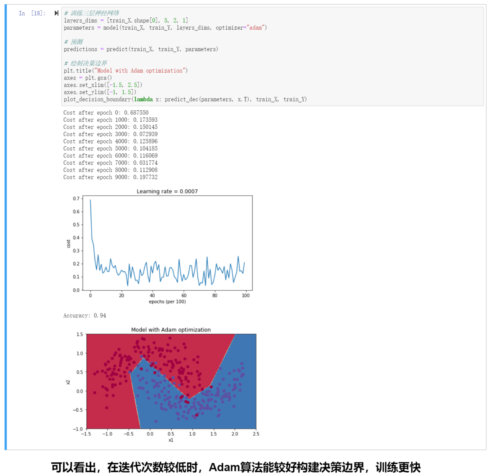
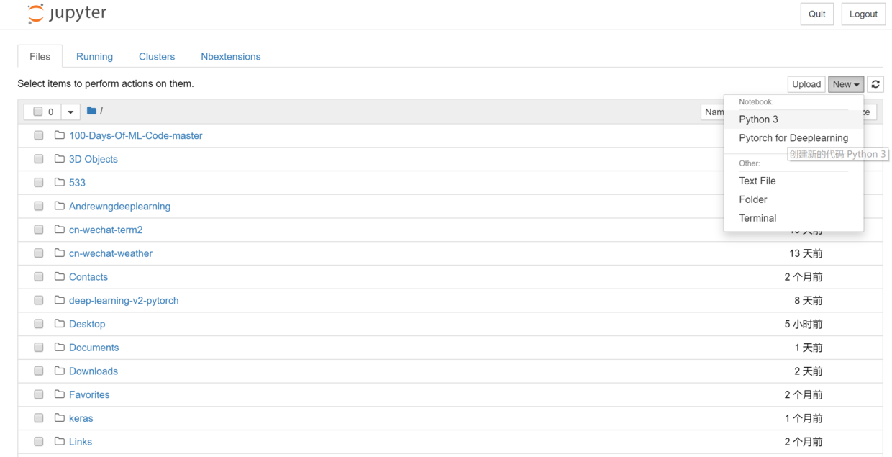
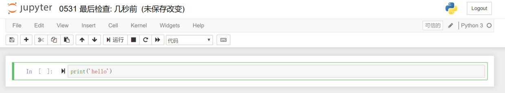
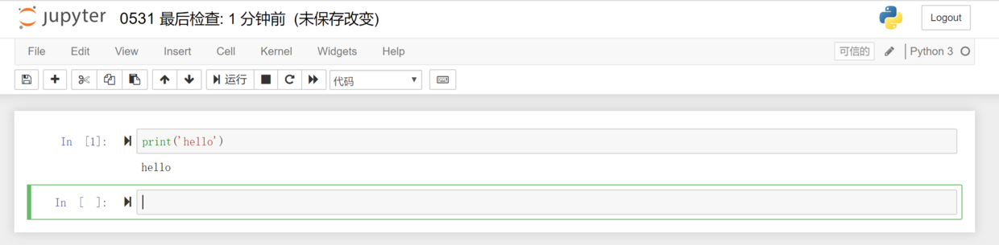

# Jupyter notebook快速上手

[TOC]

# 为什么学Jupyter notebook？


能够编写、运行python文件的程序很多，比如python安装自带的IDLE、程序员喜爱的pycharm、数据科学全家桶Anaconda，还有Spyder、Thonny等。

Jupyter notebook是用python进行数据科学、机器学习的必备工具。

突出优点：

- 学习Jupyter notebook非常容易。

- 能够独立运行一个、几个或全部python代码块，更容易看到中间变量的值，从而进行调试
- 可以插入Markdown说明文字和Latex数学公式，让枯燥的代码充满颜值，可读性爆表
- 能够调用Ipython丰富的“魔法函数”，比如程序计时、重复运行、显示图片等
- 写好的代码和文档能够以网页和ppt的形式在线分享。[在线看Jupyter notebook文件](<https://nbviewer.jupyter.org/>)<br>
- 可以在云端远程服务器运行，不需本地安装配置各种环境。[体验一下](<https://jupyter.org/try>)<br>

比如下图，包含了Markdown说明文档、代码块、代码运行结果、图片嵌入等元素，特别适合Python数据科学和机器学习撰写文档。



吴恩达的《深度学习》慕课的课后编程作业、大数据竞赛网站Kaggle上的代码文档、美国大学的数据科学课程的课后资料及编程作业，都是以jupyter notebook文件的形式给出的，也就是`.ipynb`文件。

> 其实Jupyter notebook不止可以运行python，还可以运行julia、R、Javascript等语言，这也是`jupyter`这个名字的由来。[Jupyter notebook支持的编程语言](<https://github.com/jupyter/jupyter/wiki/Jupyter-kernels>)<br>
>
> Jupyter notebook集编程和写作于一身，这就叫做“文学编程”。

# Jupyter notebook—在浏览器网页中运行python

## Ipython内核——更高级的python解释器

Jupyter notebook是基于Ipython内核的，在浏览器中以网页形式运行Python代码的工具，十分方便。

> Ipython是啥？
>
> Ipython可以理解成更高级的python解释器，相比原生的python交互式命令行，Ipython有更强大的命令计数、自动补全等交互功能。
>
> Spyder和Jupyter notebook都是以Ipython为内核的。


## 安装Jupyter notebook

如果你安装了python数据科学全家桶Anaconda，那么其中自带了Jupyter notebook。

如果你没安装Anaconda，可以直接在命令行里运行这行命令

```shell
pip install jupyter -i https://pypi.tuna.tsinghua.edu.cn/simple
```

## 运行Jupyter notebook

打开命令行，输入`jupyter notebook`，回车。稍等片刻即可跳出浏览器网页。

```
jupyter notebook
```



点击右边的New-Python3即可创建python文档。

点击New-Folder可以创建新文件夹。

点击New-Text File可以创建空的`.txt`文件。

点击New-Terminal可以打开操作系统命令行，你可以使用操作系统对应的命令行进行目录切换、解压文件等操作。

勾选文件夹，点击rename即可重命名


最常用的是点击右边的New-Python3，创建python文档。

# 用Jupyter notebook写python代码

## 写下并运行python代码

点击左上角`Untitled`给新建的python文档文件重新命名。


在代码框中输入第一行python代码，shift+回车运行






## 蓝绿两模式：命令模式、编辑模式

Jupyter notebook中，代码和文档都存在于一个个单元格中，每个单元格都有蓝色和绿色两种状态。

- 命令模式（蓝色）：用于执行键盘输入的快捷命令（新增单元格、剪切、复制等等）。通过 `Esc` 键从绿色的编辑模式切换到蓝色的命令模式，此时单元左侧显示蓝色竖线。

- 编辑模式（绿色）：编辑文本和代码。选中单元并按 `Enter` 键进入编辑模式，此时单元左侧显示绿色竖线。

> 命令模式和编辑模式，其实是源自于著名的vim编辑器，vim编辑器以特别难学和学成之后可以超神而闻名于世。

## 两种单元格：代码单元格和Markdown单元格

Jupyter notebook中，有两种单元格：代码单元格和Markdown单元格。

- 代码单元格：这里是你编写代码的地方，通过按 `Shift + Enter` 运行代码，其结果显示在本单元下方。代码单元左边有 `In [1]:` 这样的序列标记，方便人们查看代码的执行次序。在蓝色命令模式下，按`y`键可以将Markdown单元格转换为代码单元格。
- Markdown 单元格：在这里对文本进行编辑，采用 markdown 的语法规范，可以设置文本格式、插入链接、图片甚至数学公式。同样使用 `Shift + Enter` 运行 markdown 单元来显示渲染后的文本。在蓝色命令模式下按`m`键可以将代码单元格转换为Markdown单元格。

> Markdown是程序员通用的撰写文档的语法，可以轻松实现标题、引用、链接、图片等，非常简洁易学，Github代码托管网站、有道云笔记、简书、知乎、CSDN论坛、电子邮件等都支持Markdown语法。
>
> Markdown使用，详见Markdown.md笔记

编辑Markdown单元格，输入以下内容：

```markdown
# 我是Markdown一号标题
## 我是Markdown二号标题
### 我是Markdown三号标题
>我是引用，我这行开头有一个灰色竖杠

[我是外部链接，点我上百度](www.baidu.com)

```


然后按`shift`+`Enter`运行该单元格。


# Jupyter notebook快捷键

下面介绍Jupyter notebook快捷键，掌握这些快捷键之后，你将彻底解放你拿鼠标的那只手，更专注、高效地敲代码了。

## 最常用快捷键（必会）

h 查看所有快捷键

Enter 从命令模式进入编辑模式

Esc 从编辑模式退回到命令模式

m 将代码单元格转换为Markdown单元格

y 将Markdown单元格转换为代码单元格

shift+Enter 运行本单元格，选择下面的代码块

**ctrl+Enter 运行本单元格**

alt+Enter 运行本单元格，在下方新建一个单元格

a 在上方新建一个单元格（above）

b 在下方新建一个单元格（below）

**d 删除选中的单元格（delete）**

x 剪切本单元格

c 复制本单元格

shift v 粘贴到上面

v 粘贴到下面

l 显示代码行号


## 所有快捷键

h 查看所有快捷键


## 在Markdown单元格中输入数学公式

**主要就是latex的语法，详见latex笔记**

分别在两个Markdown单元格内输入以下内容：

```latex
这是爱因斯坦的质能转换方程$E=mc^2$，揭示了质量和能量之间的关系
```

```latex
这是一元二次方程求解公式
$$x = \frac{-b\pm \sqrt{b^2-4ac}}{2a}$$
初中数学内容
```


按`shift`+`Enter`渲染运行：


# 在jupyter notebook中显示目录


1. 首先，安装插件。

```
pip install jupyter_contrib_nbextensions
```

2. 然后，配置nbextension，运行代码：jupyter contrib nbextension install --user。

```
jupyter contrib nbextension install --user
```

3. 最后启动jupyter notebook，选择 Nbextensions，勾选 Table of Contents。

   ```
   jupyter notebook
   ```
   
   在该位置可以为目录插件进行配置


运行效果如下


# Markdown和JupyterNotebook的相互转换

把Markdown转成JupyterNotebook，一般情况下很少用到。
李沐还专门改写了一个对中文支持更好的版本notedown，https://github.com/mli/notedown

这个版本的原版本是https://github.com/aaren/notedown

下面简单介绍一下使用方法（假设你已经安装好了JupyterNotebook)。

 用Jupyter记事本读写GitHub源文件，根据http://zh.gluon.ai/chapter_appendix/jupyter.html描述，下面安装notedown插件，运行Jupyter记事本并加载插件。
```bash
pip install https://github.com/mli/notedown/tarball/master
jupyter notebook --NotebookApp.contents_manager_class='notedown.NotedownContentsManager'
```
如果想每次运行Jupyter记事本时默认开启notedown插件，可以参考下面的步骤。

首先，执行下面的命令生成Jupyter记事本配置文件（如果已经生成，可以跳过）：

```
jupyter notebook --generate-config
```


然后，将下面这一行加入到Jupyter记事本配置文件（一般在用户主目录下的隐藏文件夹.jupyter中的jupyter_notebook_config.py）的末尾：

```
c.NotebookApp.contents_manager_class = 'notedown.NotedownContentsManager'
```


之后，只需要运行jupyter notebook命令即可默认开启notedown插件。

 

用notedown把markdown转换成JupyterNotebook
在命令窗口下，输入以下简单命令即可，
```
notedown input.md > output.ipynb
```

用notedown把JupyterNotebook转成markdown
当然，把Jupyter转成markdown也很简单，参考github上aaren的说明原文贴在下面

```
Convert a notebook into markdown, stripping all outputs:

notedown input.ipynb --to markdown --strip > output.md
Convert a notebook into markdown, with output JSON intact:

notedown input.ipynb --to markdown > output_with_outputs.md
Strip the output cells from markdown:

notedown with_output_cells.md --to markdown --strip > no_output_cells.md
```

相关链接：https://blog.csdn.net/tanmx219/article/details/107052515

## 用Jupyter notebook制作ppt并在线分享


# 相关链接

[左手代码，右手写作：你必须会的Jupyter Notebook](<https://www.jianshu.com/p/86117613b7a6>)<br>

[二十分钟精通排版神器Markdown，从此word和秀米是路人](<https://www.jianshu.com/p/4475b9d8810f>)<br>

[Bilibili视频：二十分钟精通排版神器Markdown](<https://www.bilibili.com/video/av35579542>)<br>

[python数据分析神器Jupyter notebook快速入门](https://www.bilibili.com/video/BV1Q4411H7fJ?spm_id_from=333.337.search-card.all.click)

