# MySQL
## 目录

[MySQL-2.md](./MySQL-2.md)

## 0.写在前面

### 一、MySQL数据库基础篇大纲

------

**MySQL数据库基础篇分为 5 个篇章：**

### 1. 数据库概述与MySQL安装篇

- 第 01 章：数据库概述
- 第 02 章：MySQL环境搭建

### 2. SQL之SELECT使用篇

- 第 03 章：基本的SELECT语句
- 第 04 章：运算符
- 第 05 章：排序与分页
- 第 06 章：多表查询
- 第 07 章：单行函数
- 第 08 章：聚合函数
- 第 09 章：子查询

### 3. SQL之DDL、DML、DCL使用篇

- 第 10 章：创建和管理表
- 第 11 章：数据处理之增删改
- 第 12 章：MySQL数据类型精讲
- 第 13 章：约束

### 4. 其它数据库对象篇

- 第 14 章：视图
- 第 15 章：存储过程与函数
- 第 16 章：变量、流程控制与游标
- 第 17 章：触发器

### 5. MySQL 8 新特性篇

- 第 18 章：MySQL 8 其它新特性

------

### 二、MySQL高级特性篇大纲

------

**MySQL高级特性分为 4 个篇章：**

### 1. MySQL架构篇

- 第 01 章：Linux下MySQL的安装与使用
- 第 02 章：MySQL的数据目录
- 第 03 章：用户与权限管理
- 第 04 章：逻辑架构
- 第 05 章：存储引擎
- 第 06 章：InnoDB数据页结构

### 2. 索引及调优篇

- 第 07 章：索引
- 第 08 章：性能分析工具的使用
- 第 09 章：索引优化与SQL优化
- 第 10 章：数据库的设计规范
- 第 11 章：数据库其他调优策略

### 3. 事务篇

- 第 12 章：事务基础知识
- 第 13 章：MySQL事务日志
- 第 14 章：锁
- 第 15 章：多版本并发控制(MVCC)

### 4. 日志与备份篇

- 第 16 章：其它数据库日志
- 第 17 章：主从复制
- 第 18 章：数据库备份与恢复

------

### 三、MySQL高手是怎样炼成的

------

> 针对开发工程师、DBA、运维

- mysql服务器的安装配置
- SQL编程(自定义函数、存储过程、触发器、定时任务)
- 数据库索引建立
- SQL语句优化
- 数据库内部结构和原理
- 数据库的性能监控分析与系统优化
- 各种参数常量设定
- 数据库建模优化
- 主从复制
- 分布式架构搭建、垂直切割和水平切割
- MyCat
- 数据迁移
- 容灾备份和恢复
- 对开源数据库进行二次开发

> **数据库就像一棵常青的技能树** ，不管是普通开发还是首席架构、CTO 都能够从中汲取足够的技术养料。
>
> **普通开发** 往往积累单点技术、比如 CRUD、锁类型、索引的数据结构…而对于 **技术骨干、架构师** 则往往需要对底层原理吃透，数据库事务 ACID 是如何实现的？何时命中索引、何时不能，为什么？分布式场景下数据库怎么优化才能保持高性能？
>
> 说白了，知道怎么用是一方面，知道为什么则是更为 **稀缺的能力** 。

很多技术专家在总结程序员核心能力的时候都会提到至关重要的一点： **精通数据库。精通意味着：**

- 第一形成知识网，更灵活地应对突发问题；
- 第二底层原理要懂，懂了才能更自由地应对复杂多变的业务场景。

------

### 四、本套课程适合人群

------

1. MySQL数据库初学者。建议按照顺序从套课程的“基础篇”开始学习。
2. 从事后台开发(Java、Python、GO、PHP等)、MySQL开发 1~3 年的开发人员和运维人员。建议选择“基础篇”部分内容学习，或者跳过“基础篇”，直接从“高级特性篇”开始学习。
3. 有资历的MySQL DBA。本课程可以作为“案头书”。在解决问题时，如果记不清某些概念或者细节比较模糊，则可以拿来参考。

------

### 五、希望你能获取的

------

先说一个笑话。这个笑话是我从万维钢的专栏里看到的。

三个逻辑学家走进酒吧，酒保问他们，三位都喝啤酒吗？ 第一个逻辑学家说，我不知道。 第二个逻辑学家说，我不知道。 第三个逻辑学家说，是的。

对于知识，是需要`认真`和`讲究逻辑`的。希望这份认真、严谨你在课程的每个细节都能体会到。希望通过这套课程的系统性训练，你也能感受到这种思维方式的美，最终也能获得这种思维方式。

`具备优秀的思维能力`才是在未来可以迁移的能力，如果只是学习一些命令，则很快会过时，`思维能力`和`学习能力`的提升才是不会变的东西。

## 1数据库概述

### 1. 为什么要使用数据库

------

- 持久化（persistence）：**把数据保存到可掉电式存储设备中以供之后使用**。
- 持久化的主要作用是**将内存中的数据存储在关系型数据库中**，当然也可以存储在磁盘文件、XML数据文件中。
  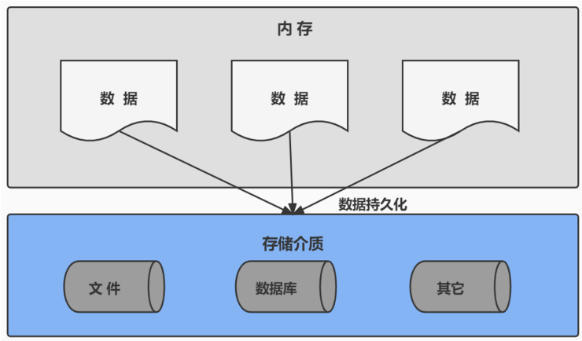

------

### 2. 数据库与数据库管理系统

------

#### 2.1 数据库的相关概念

| DB：数据库（Database）                                       |
| ------------------------------------------------------------ |
| 即存储数据的“仓库”，其本质是一个文件系统。它保存了一系列有组织的数据。 |
| **DBMS：数据库管理系统（Database Management System）**       |
| 是一种操纵和管理数据库的大型软件，用于建立、使用和维护数据库，对数据库进行统一管理和 控制。用户通过数据库管理系统访问数据库中表内的数据。 |
| **SQL：结构化查询语言（Structured Query Language）**         |
| 专门用来与数据库通信的语言。                                 |

#### 2.2 数据库与数据库管理系统的关系

数据库管理系统（DBMS）可以管理多个数据库，一般开发人员会针对每一个应用创建一个数据库。为保存应用中实体的数据，一般会在数据库创建多个表，以保存程序中实体用户的数据。

数据库管理系统、数据库和表的关系如图所示：


#### 2.3 常见的数据库管理系统排名（DBMS）

目前互联网上常见的数据库管理软件有 Oracle、MySQL、MS SQL Server、DB2、PostgreSQL、Access、SyBase、Informix这几种。以下是2021年*DB-Engines Ranking对各数据库受欢迎程度进行调查后的统计结果：（查看数据库最新排名：https://db-engines.com/en/ranking）


#### 2.4 常见的数据库介绍

**Oracle**

1979年，Oracle 2诞生，它是第一个商用的RDBMS（关系型数据库管理系统）。随着Oracle软件的名气越来越大，公司也改名叫Oracle公司。

2007年，总计85亿美金收购BEA System。

2009年，总计74亿美金收购SUN。此前的2008年，SUN以10亿美金收购MySQL。意味着Oracle同时拥有了MySQL的管理权，至此Oracle在数据库领域中成为绝对的领导者。

2013年，甲骨文超越IBM，成为继Microsoft后全球第二大软件公司。

如今Oracle的年收入达到了400亿美金，足以证明商用（收费）数据库软件的价值。

**SQL Server**

SQL Server是微软开发的大型商业数据库，诞生于1989年。C#、.net等语言常使用，与WinNT完全集成，也可以很好地与Microsoft BackOffice产品集成。

**DB2**

IBM公司的数据库产品，收费的。常应用在银行系统中。

**PostgreSQL**

PostgreSQL的稳定性极强，最符合SQL标准，开放源码，具备商业级DBMS质量。PG对数据量大的文本以及SQL处理较快。

**SyBase**

已经淡出历史舞台。提供了一个非常专业数据建模的工具PowerDesigner。

**SQLite**

嵌入式的小型数据库，应用在手机端。零配置，SQLite3不用安装，不用配置，不用启动、关闭或者配置数据库实例。当系统崩溃后不用做任何恢复操作，再下次使用数据库的时候自恢复。

**Informix**

IBM公司出品，取自Information和Unix的结合，它是第一个被移植到Linux上的商业数据库产品。仅运行与Unix/Linux平台，命令行操作。性能较高，支持集群 ，适应与安全性要求极高的系统，尤其是银行，证券系统的应用。

### 3. MySQL介绍


#### 3.1 概述

- MySQL是一个`开放源码的关系型数据库管理系统`，由瑞典 MySQL AB（创始人Michael Widenius）公司1995年开发，迅速成为开源数据库的No.1。
- 2008年被`Sun`收购（10亿美金），2009年Sun被`Oracle`收购。`MariaDB`应运而生。（MySQL的创造者担心MySQL有闭源的风险，因此创建了MySQL的分支项目MariaDB）
- MySQL6.x版本之后分为`社区版`和`商业版`。
- MySQL是一种关联数据库管理系统，将数据保存在不同的表中，而不是将所有数据放在一个大仓库内，这样就增加了速度并提高了灵活性。
- MySQL是开源的，所以你不需要支付额外的费用。
- MySQL是可以定制的，采用了`GPL（GUN General Public License）`协议，你可以需改源码来开发自己的MySQL系统。
- MySQL支持大型的数据库。可以处理拥有上千万条记录的大型数据库。
- MySQL支持大型数据库，支持5000万条记录的数据仓库 ，32位系统表文件最大可支持`4GB`，64位系统支持最大的表文件为`8TB`。
- MySQL使用`标准的SQL数据语言`形式。
- MySQL可以允许运行于多个系统上，并且支持多种语言。这些编程语言包括C、C++、Python、Java、Perl、PHP、和Ruby等。

#### 3.2 MySQL发展史重大事件

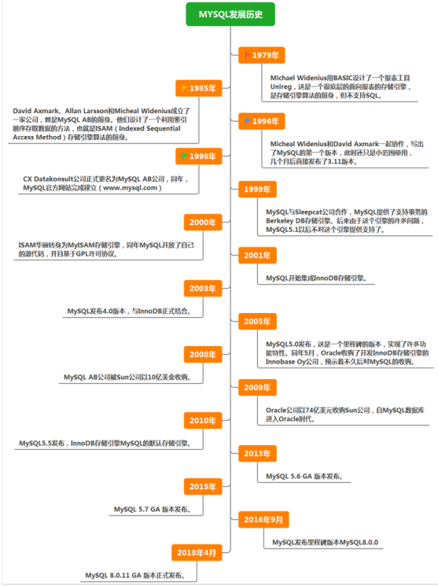

------

### 4.RDBMS与非RDBMS

------

从排名中我们能看出来，关系型数据库绝对是DBMS的主流，其中使用最多的DBMS分贝是Oracle、MySQL和SQL Server。这些都是关系型数据库（RDBMS）。

#### 4.1 关系型数据库（RDBMS）

##### 4.1.1 实质

- 这种类型的数据库是`最古老`的数据库类型，关系型数据库模型是把复杂的数据结构归结为简单的`二元关系`（即二维表格形式）。

  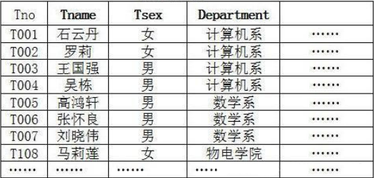

- 关系型数据库以`行（row）`和`列（column）`的形式存储数据，以便于用户理解。这一系列的行和列被称为`表（table）`，一组表组成了一个`库（database）`。

- 表与表之间的数据记录有关系（relationship）。现实世界中的各种实体以及实体之间的各种联系均用`关系模型`来表示。关系型数据库就是建立在`关系模型`基础上的数据库。

- SQL就是关系型数据库的查询语言。
  

##### 4.1.2 优势

- **复杂查询**可以用SQL语句方便的在一个表以及多个表之间做非常复杂的数据查询。
- **事务支持**使得对于安全性能很高的数据访问要求得以实现。

#### 4.2 非关系型数据库（非RDBMS）

##### 4.2.1 介绍

**非关系型数据库**，可看成传统关系型数据库的功能`阉割版本`，基于键值对存储数据，不需要经过SQL层的解析，`性能非常高`。同时通过减少不常用的功能，进一步提高性能。

目前基本上大部分主流的非关系型数据库都是免费的。

##### 4.2.2 有哪些非关系型数据库

相比于SQL，NoSQL泛指非关系型数据库，包括了榜单上的键值型数据库、文档型数据库、搜索引擎和列存储等，除此以外还包括图形数据库。也只有用NoSQL一词才能将这些技术囊括进来。

**键值型数据库**

键值型数据库通过Key-Value键值的方式来存储数据，其中Key和Value可以是简单的对象，也可以是复杂的对象，Key作为唯一的标识符，优点是查找速度快，在这方面明显优于关系型数据库，缺点是无法像关系型数据库一样使用条件过滤（比如WHERE），如果你不知道去哪里找数据，就要遍历所有的键，这就会消耗大量的计算。

键值型数据库典型的使用场景是作为`内存缓存`。`Redis`是最流行的键值型数据库。


**文档型数据库**

此类型数据库可存放并获取文档，可以是XML、JSON等格式。在数据库中文档作为处理信息的基本单位，一个文档就相当于一条记录。文档数据库所存放的文档，就相当于键值数据库所存放的“值”。MongoDB是最流行的文档型数据库。此外，还有CouchDB等。

**搜索引擎数据库**

虽然关系型数据库采用了索引提升检索效率，但是针对全文索引效率却较低。搜索引擎数据库是应用在搜索引擎领域的数据存储形式，由于搜索引擎会爬取大量的数据，并以特定的格式进行存储，这样在检索的时候才能保证性能最优。核心原理是“倒排索引”。

典型产品：Solr、Elasticsearch、Splunk等。

**列式数据库**

列式数据库是相对于行式存储的数据库，Oracle、MySQL、SQL Server等数据库都是采用的行式存储（Row-based），而列式数据库是将数据按照列存储到数据库中，这样做的好处是可以大量降低系统的I/O，适合于分布式文件系统，不足在于功能相对有限。典型产品：HBase等。

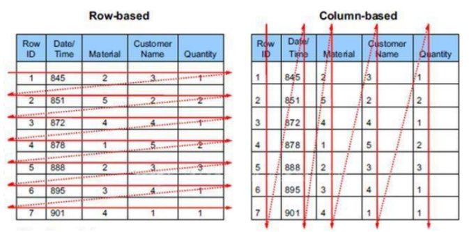

**图形数据库**

图形数据库，利用了图这种数据结构存储了实体（对象）之间的关系。图形数据库最典型的例子就是社交网络中人与人的关系，数据模型主要是以节点和边（关系）来实现，特点在于能高效的解决复杂的关系问题。典型产品：Neo4J、InfoGrid等。


#### 4.3 小结

NoSQL的分类很多，即便如此，在DBMS排名中，还是SQL阵营的比重更大，影响力前五的DBMS中有4个是关系型数据库，而排名前二十的DBMS中也有12个是关系型数据库。所以说，掌握SQL是非常有必要的。

------

### 5. 关系型数据库设计规则

------

- 关系型数据库的典型数据结构就是`数据表`，这些数据表的组成都是结构化的（Structured）。
- 将数据放到表中，再放到库中。
- 一个数据库中可以有多个表，每个表都有一个名字，用来标识自己。表名具有唯一性。
- 表具有一些特性，这些特性定义了数据在表中如何存储，类似Java和Python中“类”的设计。

#### 5.1 表、记录、字段

- E-R（entity-relationship，实体-联系）模型中有三个主要概念是：`实体集`、`属性`、`联系集`。
- 一个实体集（class）对应于数据库中的一个表（table），一个实体（instance）则对应于数据库表中的一行（row），也称为一条记录（record）。一个属性（attribute）对应于数据库表中的一列（column），也成为一个字段（field）。


```
ORM思想（Object Relational Mapping）体现：
	数据库中的一个表  <--->  Java或Python中的一个类
	表中的一条数据    <--->  类中的一个对象（或实体）
	表中的一个列      <--->  类中的一个字段、属性（field)
```

#### 5.2 表的关联关系

- 表与表之间的数据记录有关系（relationship）。现实世界中的各种实体以及实体之间的各种联系均用关系模型来表示。
- 四种：一对一关联、一对多关联、多对多关联、自我引用

##### 5.2.1 一对一关系（one-to-one）

- 在实际的开发中应用不多，因为一对一可以创建成一张表。

- 举例：设计

  ```
  学生表
  ```

  ：学号、姓名、手机号码、班级、系别、身份证号码、家庭住址、籍贯、紧急联系人……

  - 拆分为两个表：两个表的记录是一一对应关系
  - `基础信息表`（常用信息）：学号、姓名、手机号码、班级、系别
  - `档案信息表`（不常用信息）：学号、身份证号码、家庭住址、籍贯、紧急联系人……

- 两种建表原则：

  - 外键唯一：主表的主键和从表的外键（唯一），形成主外键关系，外键唯一。
  - 外键是主键：主表的主键和从表的主键，形成主外键关系。

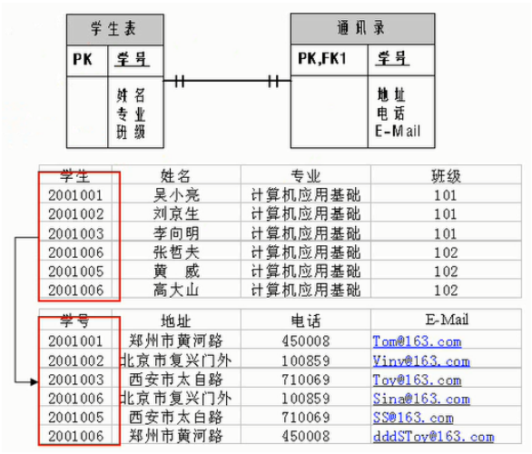

##### 5.2.2 一对多关系（one-to-many）

- 常见实例场景：`客户表和订单表`，`分类表和商品表`，`部门表和员工表`。
- 举例：
  - 员工表：编号、姓名、……、所属部门
  - 部门表：编号、名称、简介
- 一对多建表原则：在从表（多方）创建一个字段，字段作为外键指向主表（一方）的主键
  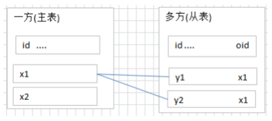


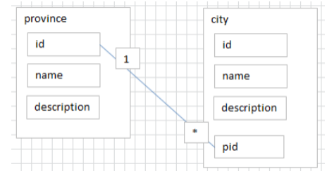

##### 5.2.3 多对多关系（many-to-many）

要表示多对多关系必须创建第三个表，该表通常称为`联接表`，它将多对多关系划分为两个一对多关系。将这两个表的主键都插入到第三个表中。


- **举例1：学生-课程**

  - `学生信息表`：一行代表一个学生的信息（学号、姓名、手机号码、班级、系别 ……）
  - `课程信息表`：一行代表一个课程的信息（课程编号、授课老师、简介 ……）
  - `选课信息表`：一个学生可以选多门课，一门课可以被多个学生选择

  ```
  学号      课程编号
  1         1001
  2         1001
  1         1002
  ```

- **举例2：产品-订单**
  “订单 ”表和“产品”表有一种多对多的关系，这种关系是通过与“订单明细”表建立两个一对多关系来定义的。一个订单可以有多个产品，每个产品可以出现在多个订单中。

  - `产品表`：产品表中的每条记录表示一个产品。
  - `订单表`：订单表中的每条记录表示一个订单。
  - `订单明细表`：每个产品可以与订单表中的多条记录对应，即出现在多个订单中。一个订单可以与产品表中的多条记录对应，即包含多个产品。

  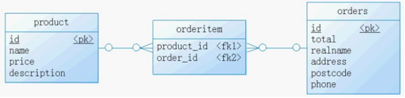

##### 5.3.4 自我引用（Self reference）

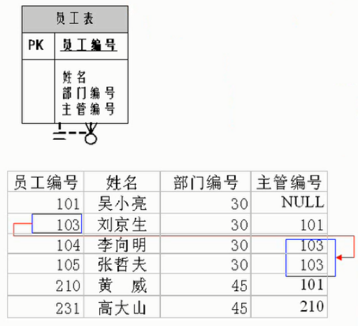

- 在实际的开发中应用不多，因为一对一可以创建成一张表。
- 举例：设计`学生表`：学号、姓名、手机号码、班级、系别、身份证号码、家庭住址、籍贯、紧急联系人、……

## 2MySQL环境搭建

### 1. MySQL的卸载

------

#### 步骤 1 ：停止MySQL服务

在卸载之前，先停止MySQL8.0的服务。按键盘上的“Ctrl + Alt + Delete”组合键，打开“任务管理器”对话框，可以在“服务”列表找到“MySQL8.0”的服务，如果现在“正在运行”状态，可以右键单击服务，选择“停止”选项停止MySQL8.0的服务，如图所示。


#### 步骤 2 ：软件的卸载

**方式 1 ：通过控制面板方式**

卸载MySQL8.0的程序可以和其他桌面应用程序一样直接在“控制面板”选择“卸载程序”，并在程序列表中找到MySQL8.0服务器程序，直接双击卸载即可，如图所示。这种方式删除，数据目录下的数据不会跟着删除。


**方式 2 ：通过 360 或电脑管家等软件卸载**

**方式 3 ：通过安装包提供的卸载功能卸载**

你也可以通过安装向导程序进行MySQL8.0服务器程序的卸载。

① 再次双击下载的mysql-installer-community-8.0.26.0.msi文件，打开安装向导。安装向导会自动检测已安装的MySQL服务器程序。

② 选择要卸载的MySQL服务器程序，单击“Remove”（移除），即可进行卸载。


③ 单击“Next”（下一步）按钮，确认卸载。

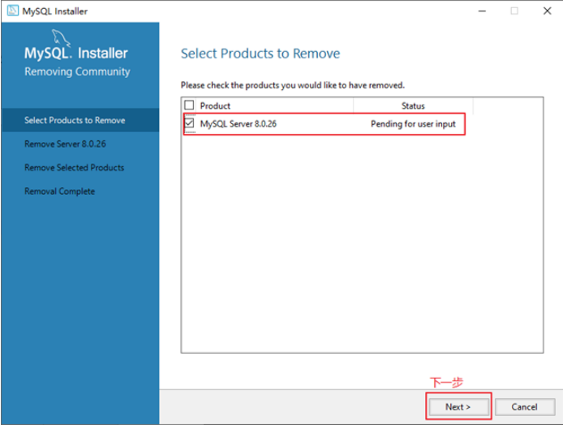

④ 弹出是否同时移除数据目录选择窗口。如果想要同时删除MySQL服务器中的数据，则勾选“Remove the data directory”，如图所示。


⑤ 执行卸载。单击“Execute”（执行）按钮进行卸载。

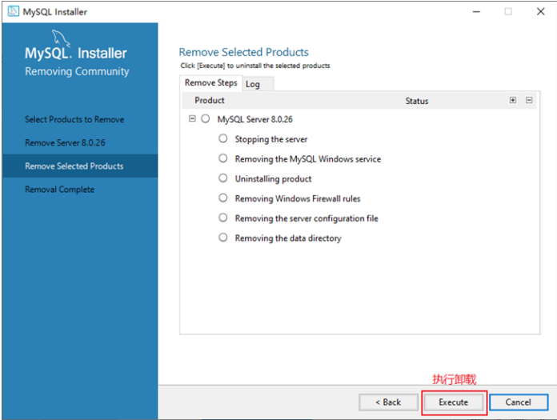

⑥ 完成卸载。单击“Finish”（完成）按钮即可。如果想要同时卸载MySQL8.0的安装向导程序，勾选“Yes，Uninstall MySQL Installer”即可，如图所示。


#### 步骤 3 ：残余文件的清理

如果再次安装不成功，可以卸载后对残余文件进行清理后再安装。

- 服务目录：mysql服务的安装目录
- 数据目录：默认在C:\ProgramData\MySQL

如果自己单独指定过数据目录，就找到自己的数据目录进行删除即可。

**注意：请在卸载前做好数据备份**
在操作完以后，需要重启计算机，然后进行安装即可。**如果仍然安装失败，需要继续操作如下步骤 4**

#### 步骤 4 ：清理注册表（选做）

如果前几步做了，再次安装还是失败，那么可以清理注册表。

如何打开注册表编辑器：在系统的搜索框中输入`regedit`

```
HKEY_LOCAL_MACHINE\SYSTEM\ControlSet001\Services\Eventlog\Application\MySQL服务 目录删除
HKEY_LOCAL_MACHINE\SYSTEM\ControlSet001\Services\MySQL服务 目录删除
HKEY_LOCAL_MACHINE\SYSTEM\ControlSet002\Services\Eventlog\Application\MySQL服务 目录删除
HKEY_LOCAL_MACHINE\SYSTEM\ControlSet002\Services\MySQL服务 目录删除
HKEY_LOCAL_MACHINE\SYSTEM\CurrentControlSet\Services\Eventlog\Application\MySQL服务 目录删除
HKEY_LOCAL_MACHINE\SYSTEM\CurrentControlSet\Services\MySQL服务删除
注册表中的ControlSet001,ControlSet002,不一定是 001 和002,可能是ControlSet005、 006之类
```

#### 步骤 5 ：删除环境变量配置

找到path环境变量，将其中关于mysql的环境变量删除， **切记不要全部删除。**

例如：删除 D:\develop_tools\mysql\MySQLServer8.0.26\bin 这个部分


------

### 2. MySQL的下载、安装、配置

------

#### 2. 1 MySQL的 4 大版本

- **MySQL Community Server 社区版本** ，开源免费，自由下载，但不提供官方技术支持，适用于大多数普通用户。
- **MySQL Enterprise Edition 企业版本** ，需付费，不能在线下载，可以试用 30 天。提供了更多的功能和更完备的技术支持，更适合于对数据库的功能和可靠性要求较高的企业客户。
- **MySQL Cluster 集群版** ，开源免费。用于架设集群服务器，可将几个MySQL Server封装成一个Server。需要在社区版或企业版的基础上使用。
- **MySQL Cluster CGE 高级集群版** ，需付费。

目前最新版本为`8.0.27`，发布时间 `2021 年 10 月`。此前，8.0.0 在 2016.9.12日就发布了。

此外，官方还提供了`MySQL Workbench`（GUITOOL）一款专为MySQL设计的`图形界面管理工具`。MySQLWorkbench又分为两个版本，分别是`社区版`（MySQL Workbench OSS）、`商用版`（MySQLWorkbenchSE）。

#### 2. 2 软件的下载

**1. 下载地址**

官网： [https://www.mysql.com](https://www.mysql.com/)

**2. 打开官网，点击DOWNLOADS**

然后，点击`MySQL Community(GPL) Downloads`

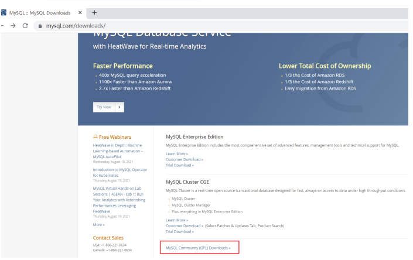

**3. 点击 MySQL Community Server**


**4. 在General Availability(GA) Releases中选择适合的版本**

Windows平台下提供两种安装文件：MySQL二进制分发版（.msi安装文件）和免安装版（.zip压缩文件）。一般来讲，应当使用二进制分发版，因为该版本提供了图形化的安装向导过程，比其他的分发版使用起来要简单，不再需要其他工具启动就可以运行MySQL。

- 这里在Windows 系统下推荐下载`MSI安装程序`；点击`Go to Download Page`进行下载即可

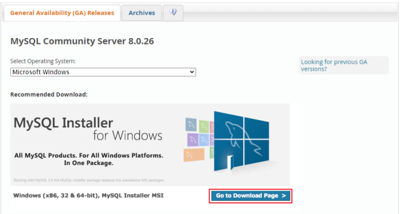

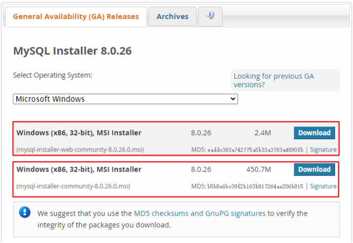

- Windows下的MySQL 8. 0 安装有两种安装程序

  - `mysql-installer-web-community-8.0.26.0.msi` 下载程序大小： 2. 4 M；安装时需要联网安装组件。
  - `mysql-installer-community-8.0.26.0.msi` 下载程序大小： 450. 7 M；安装时离线安装即
    可。 **推荐**。

- 如果安装MySQL 5. 7 版本的话，选择`Archives`，接着选择MySQL 5. 7 的相应版本即可。这里下载最近期的MySQL 5. 7. 34 版本。

  

  

#### 2. 3 MySQL 8. 0 版本的安装

MySQL下载完成后，找到下载文件，双击进行安装，具体操作步骤如下。

##### 步骤 1

双击下载的mysql-installer-community-8.0.26.0.msi文件，打开安装向导。

##### 步骤 2

打开“Choosing a Setup Type”（选择安装类型）窗口，在其中列出了 5 种安装类型，分别是Developer Default（默认安装类型）、Server only（仅作为服务器）、Client only（仅作为客户端）、Full（完全安装）、Custom（自定义安装）。这里选择“Custom（自定义安装）”类型按钮，单击“Next(下一步)”按钮。


##### 步骤 3

打开“Select Products” （选择产品）窗口，可以定制需要安装的产品清单。例如，选择“MySQL Server 8.0.26-X64”后，单击“→”添加按钮，即可选择安装MySQL服务器，如图所示。采用通用的方法，可以添加其他你需要安装的产品。

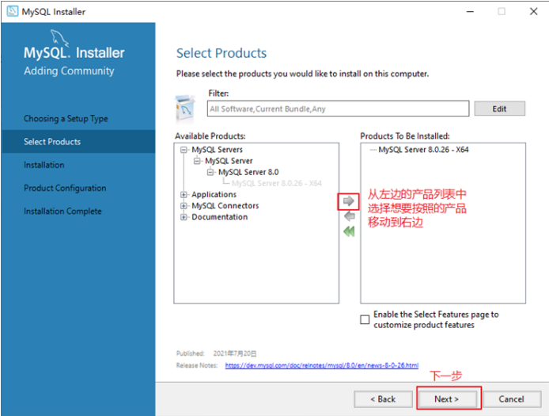

此时如果直接“Next”（下一步），则产品的安装路径是默认的。如果想要自定义安装目录，则可以选中对应的产品，然后在下面会出现“Advanced Options”（高级选项）的超链接。

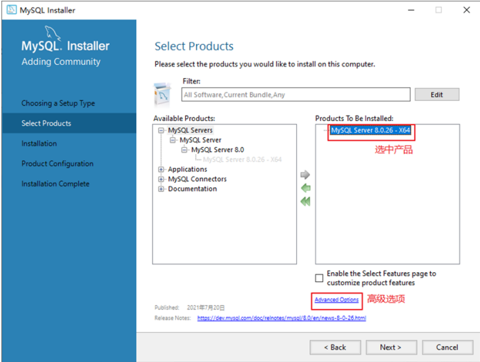

单击“Advanced Options”（高级选项）则会弹出安装目录的选择窗口，如图所示，此时你可以分别设置MySQL的服务程序安装目录和数据存储目录。如果不设置，默认分别在C盘的Program Files目录和ProgramData目录（这是一个隐藏目录）。如果自定义安装目录，请避免“中文”目录。另外，建议服务目录和数据目录分开存放。


##### 步骤 4

在上一步选择好要安装的产品之后，单击“Next”（下一步）进入确认窗口，如图所示。单击
“Execute”（执行）按钮开始安装。

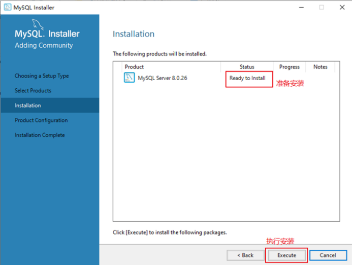

##### 步骤 5

安装完成后在“Status”（状态）列表下将显示“Complete”（安装完成），如图所示。


#### 2. 4 配置MySQL 8. 0

MySQL安装之后，需要对服务器进行配置。具体的配置步骤如下。

##### 步骤 1

在上一个小节的最后一步，单击“Next”（下一步）按钮，就可以进入产品配置窗口。

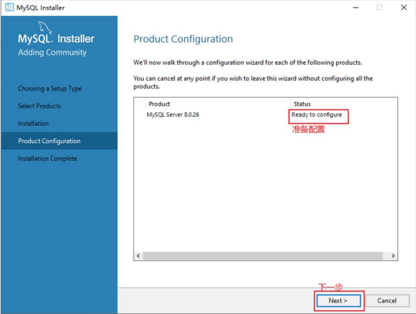

##### 步骤 2

单击“Next”（下一步）按钮，进入MySQL服务器类型配置窗口，如图所示。端口号一般选择默认
端口号 3306 。


其中，“Config Type”选项用于设置服务器的类型。单击该选项右侧的下三角按钮，即可查看 3 个选项，如图所示。


- `Development Machine（开发机器）`：该选项代表典型个人用桌面工作站。此时机器上需要运行多个应用程序，那么MySQL服务器将占用最少的系统资源。
- `Server Machine（服务器）`：该选项代表服务器，MySQL服务器可以同其他服务器应用程序一起运行，例如Web服务器等。MySQL服务器配置成适当比例的系统资源。
- `Dedicated Machine（专用服务器）`：该选项代表只运行MySQL服务的服务器。MySQL服务器配置成使用所有可用系统资源。

##### 步骤 3

单击“Next”（下一步）按钮，打开设置授权方式窗口。其中，上面的选项是MySQL8.0提供的新的授权方式，采用SHA256基础的密码加密方法；下面的选项是传统授权方法（保留5.x版本兼容性）。


##### 步骤 4

单击“Next”（下一步）按钮，打开设置服务器root超级管理员的密码窗口，如图所示，需要输入两次同样的登录密码。也可以通过“Add User”添加其他用户，添加其他用户时，需要指定用户名、允许该用户名在哪台/哪些主机上登录，还可以指定用户角色等。此处暂不添加用户，用户管理在MySQL高级特性篇中讲解。

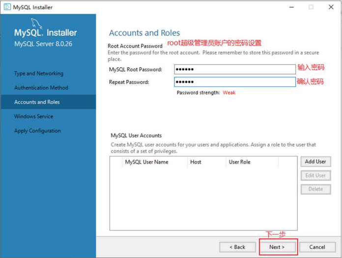

##### 步骤 5

单击“Next”（下一步）按钮，打开设置服务器名称窗口，如图所示。该服务名会出现在Windows服务列表中，也可以在命令行窗口中使用该服务名进行启动和停止服务。本书将服务名设置为“MySQL80”。如果希望开机自启动服务，也可以勾选“Start the MySQL Server at System Startup”选项（推荐）。

下面是选择以什么方式运行服务？可以选择“Standard System Account”(标准系统用户)或者“Custom User”(自定义用户)中的一个。这里推荐前者。


##### 步骤 6

单击“Next”（下一步）按钮，打开确认设置服务器窗口，单击“Execute”（执行）按钮。

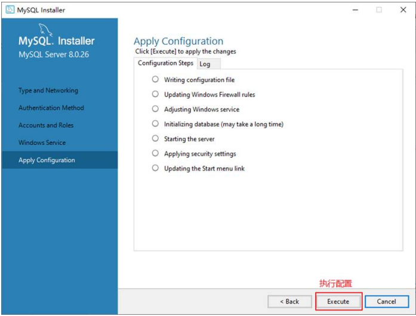

##### 步骤 7

完成配置，如图所示。单击“Finish”（完成）按钮，即可完成服务器的配置。


##### 步骤 8

如果还有其他产品需要配置，可以选择其他产品，然后继续配置。如果没有，直接选择“Next”（下一步），直接完成整个安装和配置过程。

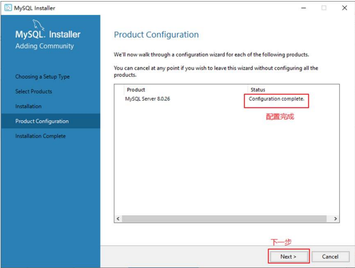

##### 步骤 9

结束安装和配置。

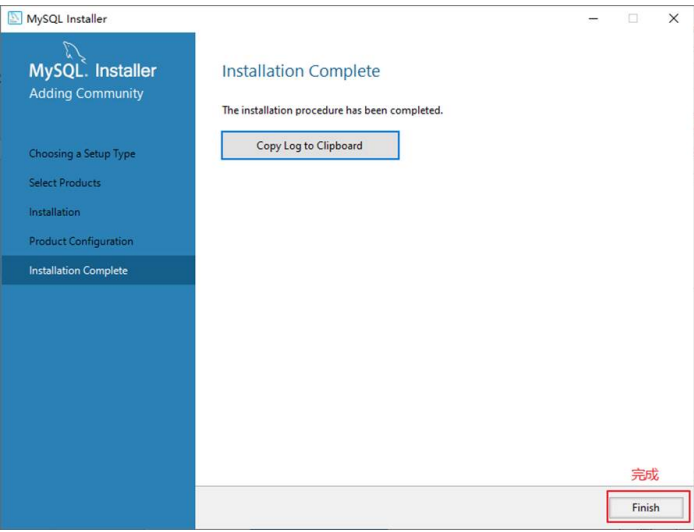

#### 2. 5 配置MySQL 8. 0 环境变量

如果不配置MySQL环境变量，就不能在命令行直接输入MySQL登录命令。下面说如何配置MySQL的环境变量：

- 步骤 1 ：在桌面上右击【此电脑】图标，在弹出的快捷菜单中选择【属性】菜单命令。
- 步骤 2 ：打开【系统】窗口，单击【高级系统设置】链接。
- 步骤 3 ：打开【系统属性】对话框，选择【高级】选项卡，然后单击【环境变量】按钮。
- 步骤 4 ：打开【环境变量】对话框，在系统变量列表中选择path变量。
- 步骤5 ：单击【编辑】按钮，在【编辑环境变量】对话框中，将MySQL应用程序的bin目录（C:\ProgramFiles\MySQL\MySQL Server 8.0\bin）添加到变量值中，用分号将其与其他路径分隔开。
- 步骤 6 ：添加完成之后，单击【确定】按钮，这样就完成了配置path变量的操作，然后就可以直接输入MySQL命令来登录数据库了。

------

### 3. MySQL的登录

------

#### 1 服务的启动与停止

MySQL安装完毕之后，需要启动服务器进程，不然客户端无法连接数据库。

在前面的配置过程中，已经将MySQL安装为Windows服务，并且勾选当Windows启动、停止时，MySQL也自动启动、停止。

##### 方式 1 ：使用图形界面工具

- 步骤 1 ：打开windows服务

  - 方式 1 ：计算机（点击鼠标右键）→ 管理（点击）→ 服务和应用程序（点击）→ 服务（点击）
  - 方式 2 ：控制面板（点击）→ 系统和安全（点击）→ 管理工具（点击）→ 服务（点击）
  - 方式 3 ：任务栏（点击鼠标右键）→ 启动任务管理器（点击）→ 服务（点击）
  - 方式 4 ：单击【开始】菜单，在搜索框中输入“services.msc”，按Enter键确认

- 步骤 2 ：找到MySQL80（点击鼠标右键）→ 启动或停止（点击）

  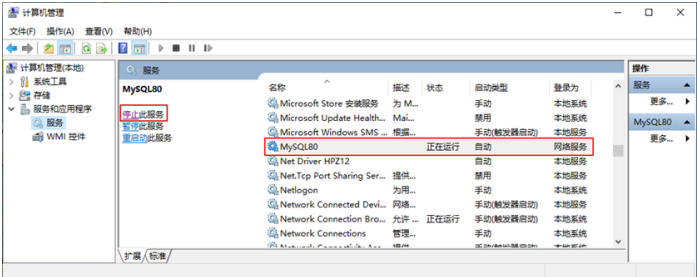

##### 方式 2 ：使用命令行工具

```
## 启动　MySQL　服务命令
net　start　MySQL服务名

## 停止　MySQL　服务命令
net　stop　MySQL服务名
```

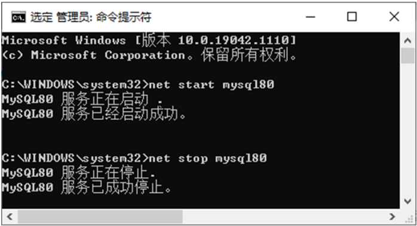

###### 说明：

- start和stop后面的服务名应与之前配置时指定的服务名一致。
- 如果当你输入命令后，提示“拒绝服务”，请以`系统管理员身份`打开命令提示符界面重新尝试。

#### 2 自带客户端的登录与退出

当MySQL服务启动完成后，便可以通过客户端来登录MySQL数据库。注意：确认服务是开启的。

##### 登录方式 1 ：MySQL自带客户端

开始菜单 → 所有程序 → MySQL → MySQL 8.0 Command Line Client

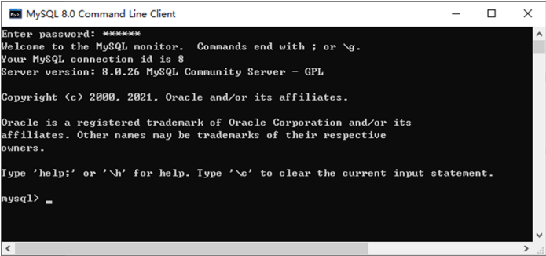

- 说明：仅限于root用户

##### 登录方式 2 ：windows命令行

- 格式：

  ```
  mysql -h 主机名 -P 端口号 -u 用户名 -p密码
  ```

- 举例：

  ```
  mysql -h localhost -P 3306 -u root -pabc123  ## 这里我设置的root用户的密码是abc123
  ```

  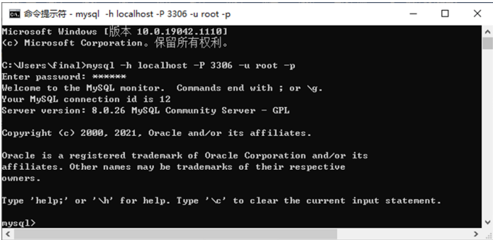

- 注意：
  1．-p与密码之间不能有空格，其他参数名与参数值之间可以有空格也可以没有空格。如：

  ```
  mysql -hlocalhost -P3306 -uroot -pabc123
  ```

  ２．密码建议在下一行输入，保证安全

  ```
  mysql -h localhost -P 3306 -u root -p
  Enter password:****
  ```

  3．客户端和服务器在同一台机器上，所以输入localhost或者IP地址127.0.0.1。同时，因为是连接本机： **-h localhost就可以省略**，如果**端口号没有修改：-P3306也可以省略**

  简写成：

  ```
  mysql -u root -p
  Enter password:****
  ```

  连接成功后，有关于MySQL Server服务版本的信息，还有第几次连接的id标识。

  也可以在命令行通过以下方式获取MySQL Server服务版本的信息：

  ```
  c:\> mysql -V
  ```

  ```
  c:\> mysql --version
  ```

  或**登录**后，通过以下方式查看当前版本信息：

  ```
  mysql> select version();
  ```

##### 退出登录

```
exit
或
quit
```

------

#### 设置远程访问MySQL

```mysql
grant all privileges on *.* to 'root'@'%' identified by 'root' with grant option;
flush privileges;
```

需要先关闭防火墙

```
service iptables stop 
```

如果设置了还不能成功访问，**可以逐个重启mysql容器，docker，和linux**

### 4. MySQL演示使用

------

#### 1-MySQL的使用演示

##### 1 .查看所有的数据库

```mysql
show databases;
+--------------------+
| Database           |
+--------------------+
| information_schema |
| mysql              |
| performance_schema |
| sql_test           |
| sys                |
| test               |
| yoj                |
+--------------------+
```

- “information_schema”是 MySQL 系统自带的数据库，主要保存 MySQL 数据库服务器的系统信息，比如数据库的名称、数据表的名称、字段名称、存取权限、数据文件 所在的文件夹和系统使用的文件夹，等等。
- “performance_schema”是 MySQL 系统自带的数据库，可以用来监控 MySQL 的各类性能指标。
- “sys”数据库是 MySQL 系统自带的数据库，主要作用是以一种更容易被理解的方式展示 MySQL 数据库服务器的各类性能指标，帮助系统管理员和开发人员监控 MySQL 的技术性能。
- “mysql”数据库保存了 MySQL 数据库服务器运行时需要的系统信息，比如数据文件夹、当前使用的字符集、约束检查信息，等等。

为什么 Workbench 里面我们只能看到“demo”和“sys”这 2 个数据库呢？

这是因为，Workbench 是图形化的管理工具，主要面向开发人 员，“demo”和“sys”这 2 个数据库已经够用了。如果有特殊需求，比如，需要监控 MySQL 数据库各项性能指标、直接操作 MySQL 数据库系统文件等，可以由 DBA 通过 SQL 语句，查看其它的系统数据库。

##### 2 、创建自己的数据库

```mysql
create database 数据库名;

#创建atguigudb数据库，该名称不能与已经存在的数据库重名。
create database atguigudb;
```

##### 3 、使用自己的数据库

```
use 数据库名;

#使用atguigudb数据库
use atguigudb;
```

说明：如果没有使用use语句，后面针对数据库的操作也没有加“数据名”的限定，那么会报“ERROR 1046(3D000): No database selected”（没有选择数据库）

使用完use语句之后，如果接下来的SQL都是针对一个数据库操作的，那就不用重复use了，如果要针对另一个数据库操作，那么要重新use。

##### 4 、查看某个库的所有表格

```
show tables;  #要求前面有use语句

show tables from 数据库名;
```

##### 5 、创建新的表格

```
create table 表名称(
字段名 数据类型,
字段名 数据类型
);
```

说明：如果是最后一个字段，后面就用加逗号，因为逗号的作用是分割每个字段。

```
#创建学生表
create table student(
id int,
name varchar( 20 )  #说名字最长不超过 20 个字符
);
```

##### 6 、查看一个表的数据

```
select * from 数据库表名称;

#查看学生表的数据
select * from student;
```

##### 7 、添加一条记录

```
insert into 表名称 values(值列表);

#添加两条记录到student表中
insert into student values( 1 ,'张三');
insert into student values( 2 ,'李四');
```

报错：

```
mysql> insert into student values( 1 ,'张三');
ERROR 1366 (HY000): Incorrect string value: '\xD5\xC5\xC8\xFD' for column 'name' at　row 1
mysql> insert into student values( 2 ,'李四');
ERROR 1366 (HY000): Incorrect string value: '\xC0\xEE\xCB\xC4' for column 'name' at　row 1
mysql> show create table student;
```

字符集的问题。

##### 8 、查看表的创建信息

```
show create table 表名称\G

#查看student表的详细创建信息
show create table student\G
#结果如下
*************************** 1. row ***************************
Table: student
Create Table: CREATE TABLE `student` (
`id` int( 11 ) DEFAULT NULL,
`name` varchar( 20 ) DEFAULT NULL
) ENGINE=InnoDB DEFAULT CHARSET=latin1
1 row in set (0.00 sec)
```

上面的结果显示student的表格的默认字符集是“latin1”不支持中文。

##### 9 、查看数据库的创建信息

```
show create database 数据库名\G

#查看atguigudb数据库的详细创建信息
show create database atguigudb\G
```

上面的结果显示atguigudb数据库也不支持中文，字符集默认是latin1。

##### 10 、删除表格

```mysql
drop table 表名称;

#删除学生表
drop table student;
```

##### 11 、删除数据库

```mysql
drop database 数据库名;

#删除atguigudb数据库
drop database atguigudb;
```

#### 2-MySQL的编码设置

**MySQL 8. 0 中**

在MySQL 8.0版本之前，默认字符集为latin1，utf8字符集指向的是utf8mb3。网站开发人员在数据库设计的时候往往会将编码修改为utf8字符集。如果遗忘修改默认的编码，就会出现乱码的问题。从**MySQL 8.0开始，数据库的默认编码改为`utf8mb4`**，从而避免了上述的乱码问题。

------

### 5. MySQL图形化管理工具

------

MySQL图形化管理工具极大地方便了数据库的操作与管理，常用的图形化管理工具有：MySQL
Workbench、phpMyAdmin、Navicat Preminum、MySQLDumper、SQLyog、dbeaver、MySQL ODBCConnector。

#### Navicat

Navicat MySQL是一个强大的MySQL数据库服务器管理和开发工具。它可以与任何3.21或以上版本的MySQL一起工作，支持触发器、存储过程、函数、事件、视图、管理用户等，对新手来说易学易用。其精心设计的图形用户界面可以让用户用一种安全简便的方式来快速方便地创建、组织、访问和共享信息。Navicat支持中文，有免费版本提供。下载地址：**http://www.navicat.com/** 。


#### 可能出现连接问题

有些图形界面工具，特别是旧版本的图形界面工具，在连接MySQL8时出现“Authentication plugin ‘caching_sha2_password’ cannot be loaded”错误。

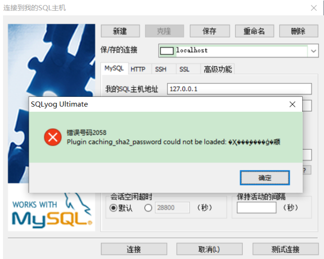

出现这个原因是MySQL8之前的版本中加密规则是mysql_native_password，而在MySQL8之后，加密规则是caching_sha2_password。解决问题方法有两种，第一种是升级图形界面工具版本，第二种是把MySQL8用户登录密码加密规则还原成mysql_native_password。

第二种解决方案如下，用命令行登录MySQL数据库之后，执行如下命令修改用户密码加密规则并更新用户密码，这里修改用户名为“root@localhost”的用户密码规则为“mysql_native_password”，密码值为“123456”，如图所示。

```
#使用mysql数据库
USE mysql;

#修改'root'@'localhost'用户的密码规则和密码
ALTER USER 'root'@'localhost' IDENTIFIED WITH mysql_native_password BY 'abc123';

#刷新权限
FLUSH PRIVILEGES;
```


------

### 6. MySQL目录结构与源码

------

#### 6. 1 主要目录结构

| MySQL的目录结构                             | 说明                                 |
| ------------------------------------------- | ------------------------------------ |
| bin目录                                     | 所有MySQL的可执行文件。如：mysql.exe |
| MySQLInstanceConfig.exe                     | 数据库的配置向导，在安装时出现的内容 |
| data目录                                    | 系统数据库所在的目录                 |
| my.ini文件                                  | MySQL的主要配置文件                  |
| c:\ProgramData\MySQL\MySQL Server 8.0\data\ | 用户创建的数据库所在的目录           |

#### 6. 2 MySQL 源代码获取

首先，你要进入 MySQL下载界面。 这里你不要选择用默认的“Microsoft Windows”，而是要通过下拉栏，找到“Source Code”，在下面的操作系统版本里面， 选择 Windows（Architecture Independent），然后点击下载。

接下来，把下载下来的压缩文件解压，我们就得到了 MySQL 的源代码。

MySQL 是用 C++ 开发而成的，我简单介绍一下源代码的组成。

mysql-8.0.22 目录下的各个子目录，包含了 MySQL 各部分组件的源代码：


- sql 子目录是 MySQL 核心代码；
- libmysql 子目录是客户端程序 API；
- mysql-test 子目录是测试工具；
- mysys 子目录是操作系统相关函数和辅助函数；

源代码可以用记事本打开查看，如果你有 C++ 的开发环境，也可以在开发环境中打开查看。


如上图所示，源代码并不神秘，就是普通的 C++ 代码，跟你熟悉的一样，而且有很多注释，可以帮助你理解。阅读源代码就像在跟 MySQL 的开发人员对话一样，十分有趣。

------

### 7. 常见问题的解决(课外内容)

------

#### 问题 1 ：root用户密码忘记，重置的操作

1. 通过任务管理器或者服务管理，关掉mysqld(服务进程)
2. 通过命令行+特殊参数开启mysqld mysqld – defaults-file=”D:\ProgramFiles\mysql\MySQLServer5.7Data\my.ini” –skip-grant-tables
3. 此时，mysqld服务进程已经打开。并且不需要权限检查
4. mysql -uroot 无密码登陆服务器。另启动一个客户端进行
5. 修改权限表 （ 1 ） use mysql; （ 2 ）update user set authentication_string=password(‘新密码’) where user=’root’ and Host=’localhost’; （ 3 ）flush privileges;
6. 通过任务管理器，关掉mysqld服务进程。
7. 再次通过服务管理，打开mysql服务。
8. 即可用修改后的新密码登陆。

#### 问题 2 ：mysql命令报“不是内部或外部命令”

如果输入mysql命令报“不是内部或外部命令”，把mysql安装目录的bin目录配置到环境变量path中。如下：


#### 问题 3 ：错误ERROR ：没有选择数据库就操作表格和数据

| ERROR 1046 (3D000): No database selected                     |
| ------------------------------------------------------------ |
| 解决方案一：就是使用“USE 数据库名;”语句，这样接下来的语句就默认针对这个数据库进行操作 |
| 解决方案二：就是所有的表对象前面都加上“数据库.”              |

#### 问题 4 ：命令行客户端的字符集问题

```
mysql> INSERT INTO t_stu VALUES( 1 ,'张三','男');
ERROR 1366 (HY000): Incorrect string value: '\xD5\xC5\xC8\xFD' for column 'sname' at row 1
```

原因：服务器端认为你的客户端的字符集是utf- 8 ，而实际上你的客户端的字符集是GBK。


查看所有字符集： **SHOW VARIABLES LIKE ‘character_set_%’;**


解决方案，设置当前连接的客户端字符集 **“SET NAMES GBK;”**


#### 问题 5 ：修改数据库和表的字符编码

修改编码：

1. 先停止服务
2. 修改my.ini文件
3. 重新启动服务

说明：

如果是在修改my.ini之前建的库和表，那么库和表的编码还是原来的Latin1，要么删了重建，要么使用alter语句修改编码。

```mysql
mysql> create database 0728 db charset Latin1;
Query OK, 1 row affected (0.00 sec)
mysql> use 0728db;
Database changed

mysql> create table student (id int , name varchar( 20 )) charset Latin1;
Query OK, 0 rows affected (0.02 sec)

mysql> show create table student\G
*************************** 1. row ***************************
Table: student
Create Table: CREATE TABLE `student` (
`id` int( 11 ) NOT NULL,
`name` varchar( 20 ) DEFAULT NULL,
PRIMARY KEY (`id`)
) ENGINE=InnoDB DEFAULT CHARSET=latin1
1 row in set (0.00 sec)

mysql> alter table student charset utf8; #修改表字符编码为UTF8
Query OK, 0 rows affected (0.01 sec)
Records: 0 Duplicates: 0 Warnings: 0

mysql> show create table student\G
*************************** 1. row ***************************
Table: student
Create Table: CREATE TABLE `student` (
`id` int( 11 ) NOT NULL,
`name` varchar( 20 ) CHARACTER SET latin1 DEFAULT NULL,  #字段仍然是latin1编码
PRIMARY KEY (`id`)
) ENGINE=InnoDB DEFAULT CHARSET=utf8
1 row in set (0.00 sec)

mysql> alter table student modify name varchar( 20 ) charset utf8; #修改字段字符编码为UTF8
Query OK, 0 rows affected (0.05 sec)
Records: 0 Duplicates: 0 Warnings: 0

mysql> show create table student\G
*************************** 1. row ***************************
Table: student
Create Table: CREATE TABLE `student` (
`id` int( 11 ) NOT NULL,
`name` varchar( 20 ) DEFAULT NULL,
PRIMARY KEY (`id`)
) ENGINE=InnoDB DEFAULT CHARSET=utf8
1 row in set (0.00 sec)

mysql> show create database 0728 db;;
+--------+-----------------------------------------------------------------+
|Database| Create Database 	|
+------+-------------------------------------------------------------------+
| 0728 db| CREATE DATABASE `0728db` /*!40100 DEFAULT CHARACTER SET latin1 */|
+------+-------------------------------------------------------------------+
1 row in set (0.00 sec)

mysql> alter database 0728 db charset utf8; #修改数据库的字符编码为utf8
Query OK, 1 row affected (0.00 sec)

mysql> show create database 0728 db;
+--------+-----------------------------------------------------------------+
|Database| Create Database 	|
+--------+-----------------------------------------------------------------+
| 0728 db | CREATE DATABASE `0728db` /*!40100 DEFAULT CHARACTER SET utf8 */|
+--------+-----------------------------------------------------------------+
1 row in set (0.00 sec)
```

## 3基本的SELECT语句

### 1. SQL概述

------

#### 1. 1 SQL背景知识

- 1946 年，世界上第一台电脑诞生，如今，借由这台电脑发展起来的互联网已经自成江湖。在这几十年里，无数的技术、产业在这片江湖里沉浮，有的方兴未艾，有的已经几幕兴衰。但在这片浩荡的波动里，有一门技术从未消失，甚至“老当益壮”，那就是 SQL。
  - 45 年前，也就是 1974 年，IBM 研究员发布了一篇揭开数据库技术的论文《SEQUEL：一门结构化的英语查询语言》，直到今天这门结构化的查询语言并没有太大的变化，相比于其他语言，`SQL 的半衰期可以说是非常长`了。
- 不论是前端工程师，还是后端算法工程师，都一定会和数据打交道，都需要了解如何又快又准确地提取自己想要的数据。更别提数据分析师了，他们的工作就是和数据打交道，整理不同的报告，以便指导业务决策。
- SQL（Structured Query Language，结构化查询语言）是使用关系模型的数据库应用语言，`与数据直接打交道`，由`IBM`上世纪 70 年代开发出来。后由美国国家标准局（ANSI）开始着手制定SQL标准，先后有`SQL- 86` ，`SQL- 89` ，`SQL- 92` ，`SQL- 99` 等标准。
  - SQL 有两个重要的标准，分别是 SQL92 和 SQL99，它们分别代表了 92 年和 99 年颁布的 SQL 标准，我们今天使用的 SQL 语言依然遵循这些标准。
- 不同的数据库生产厂商都支持SQL语句，但都有特有内容。


#### 1. 2 SQL语言排行榜

自从 SQL 加入了 TIOBE 编程语言排行榜，就一直保持在 Top 10。

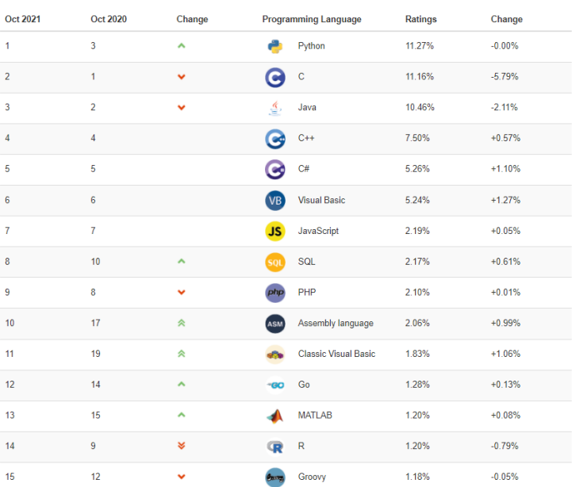

#### 1. 3 SQL 分类

SQL语言在功能上主要分为如下 3 大类：

- **DDL（Data Definition Languages、数据定义语言）** ，这些语句定义了不同的数据库、表、视图、索引等数据库对象，还可以用来创建、删除、修改数据库和数据表的结构。
  - 主要的语句关键字包括`CREATE`、`DROP`、`ALTER`等。
- **DML（Data Manipulation Language、数据操作语言）** ，用于添加、删除、更新和查询数据库记录，并检查数据完整性。
  - 主要的语句关键字包括`INSERT`、`DELETE`、`UPDATE`、`SELECT`等。
  - **SELECT是SQL语言的基础，最为重要。**
- `DCL（Data Control Language、数据控制语言）` ，用于定义数据库、表、字段、用户的访问权限和安全级别。
  - 主要的语句关键字包括`GRANT`、`REVOKE`、`COMMIT`、`ROLLBACK`、`SAVEPOINT`等。

> 因为查询语句使用的非常的频繁，所以很多人把查询语句单拎出来一类：DQL（数据查询语言）。还有单独将`COMMIT`、`ROLLBACK` 取出来称为TCL （Transaction Control Language，事务控制语言）。

------

### 2. SQL语言的规则与规范

------

#### 2. 1 基本规则

- SQL 可以写在一行或者多行。为了提高可读性，各子句分行写，必要时使用缩进
- 每条命令以 ; 或 \g 或 \G 结束
- 关键字不能被缩写也不能分行
- 关于标点符号
  - 必须保证所有的()、单引号、双引号是成对结束的
  - 必须使用英文状态下的半角输入方式
  - 字符串型和日期时间类型的数据可以使用单引号（’ ‘）表示
  - 列的别名，尽量使用双引号（” “），而且不建议省略as

#### 2. 2 SQL大小写规范 （建议遵守）

- **MySQL 在 Windows 环境下是大小写不敏感的**
- MySQL 在 Linux 环境下是大小写敏感的
  - 数据库名、表名、表的别名、变量名是严格区分大小写的
  - 关键字、函数名、列名(或字段名)、列的别名(字段的别名) 是忽略大小写的。
- 推荐采用统一的书写规范：
  - 数据库名、表名、表别名、字段名、字段别名等都小写
  - SQL 关键字、函数名、绑定变量等都大写

#### 2. 3 注 释

可以使用如下格式的注释结构

```
单行注释：#注释文字(MySQL特有的方式)
单行注释：-- 注释文字(--后面必须包含一个空格。)
多行注释：/* 注释文字 */
```

#### 2. 4 命名规则（暂时了解）

- 数据库、表名不得超过 30 个字符，变量名限制为 29 个
- 必须只能包含 A–Z, a–z, 0–9, _共 63 个字符
- 数据库名、表名、字段名等对象名中间不要包含空格
- 同一个MySQL软件中，数据库不能同名；同一个库中，表不能重名；同一个表中，字段不能重名
- 必须保证你的字段没有和保留字、数据库系统或常用方法冲突。如果坚持使用，请在SQL语句中使用`（着重号）引起来
- 保持字段名和类型的一致性，在命名字段并为其指定数据类型的时候一定要保证一致性。假如数据类型在一个表里是整数，那在另一个表里可就别变成字符型了

举例：

```
#以下两句是一样的，不区分大小写
show databases;
SHOW DATABASES;

#创建表格
#create table student info(...); #表名错误，因为表名有空格
create table student_info(...);

#其中order使用``飘号，因为order和系统关键字或系统函数名等预定义标识符重名了
CREATE TABLE `order`(
id INT,
lname VARCHAR( 20 )
);

select id as "编号", `name` as "姓名" from t_stu; #起别名时，as都可以省略
select id as 编号, `name` as 姓名 from t_stu; #如果字段别名中没有空格，那么可以省略""
select id as 编 号, `name` as 姓 名 from t_stu; #错误，如果字段别名中有空格，那么不能省略""
```

#### 2. 5 数据导入指令

在命令行客户端登录mysql，使用source指令导入

```
mysql> source d:\mysqldb.sql
mysql> desc employees;
+----------------+-------------+------+-----+---------+-------+
| Field | Type | Null | Key | Default | Extra |
+----------------+-------------+------+-----+---------+-------+
| employee_id | int( 6 ) | NO | PRI | 0 | |
| first_name | varchar( 20 ) | YES | | NULL | |
| last_name | varchar( 25 ) | NO | | NULL | |
| email | varchar( 25 ) | NO | UNI | NULL | |
| phone_number | varchar( 20 ) | YES | | NULL | |
| hire_date | date | NO | | NULL | |
| job_id | varchar( 10 ) | NO | MUL | NULL | |
| salary | double( 8 , 2 ) | YES | | NULL | |
| commission_pct | double( 2 , 2 ) | YES | | NULL | |
| manager_id | int( 6 ) | YES | MUL | NULL | |
| department_id | int( 4 ) | YES | MUL | NULL | |
+----------------+-------------+------+-----+---------+-------+
11 rows in set (0.00 sec)
```

------

### 3. 基本的SELECT语句

------

#### 0 SELECT…

```
SELECT 1 ; #没有任何子句
SELECT 9 /2; #没有任何子句
```

#### 1 SELECT … FROM

- 语法：

  ```
  SELECT 标识选择哪些列
  FROM 标识从哪个表中选择
  ```

- 选择全部列：

  ```
  SELECT *
  FROM departments;
  ```


> 一般情况下，除非需要使用表中所有的字段数据，最好不要使用通配符‘*’。使用通配符虽然可以节省输入查询语句的时间，但是获取不需要的列数据通常会降低查询和所使用的应用程序的效率。通配符的优势是，当不知道所需要的列的名称时，可以通过它获取它们。
>
> 在生产环境下，不推荐你直接使用SELECT *进行查询。

- 选择特定的列：

  ```
  SELECT department_id, location_id
  FROM departments;
  ```

  

> MySQL中的SQL语句是不区分大小写的，因此SELECT和select的作用是相同的，但是，许多开发人员习惯将**关键字大写、数据列和表名小写**，读者也应该养成一个良好的编程习惯，这样写出来的代码更容易阅读和维护。

#### 2 列的别名

- 重命名一个列
- 便于计算
- 紧跟列名，也可以 在列名和别名之间加入关键字AS，别名使用双引号 ，以便在别名中包含空格或特殊的字符并区分大小写。
- AS 可以省略
- 建议别名简短，见名知意
- 举例

```
SELECT last_name AS name, commission_pct comm
FROM employees;
```


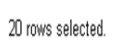

```
SELECT last_name "Name", salary* 12 "Annual Salary"
FROM employees;
```


#### 3 去除重复行

默认情况下，查询会返回全部行，包括重复行。

```
SELECT department_id
FROM employees;
```


**在SELECT语句中使用关键字DISTINCT去除重复行**

```
SELECT DISTINCT department_id
FROM employees;
```

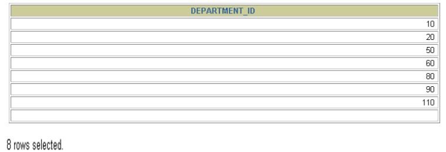

针对于：

```
SELECT DISTINCT department_id,salary
FROM employees;
```

这里有两点需要注意：

1. DISTINCT 需要放到所有列名的前面，如果写成`SELECT salary, DISTINCT department_id FROM employees`会报错。
2. DISTINCT 其实是对**后面所有列名的组合进行去重**，你能看到最后的结果是 74 条，因为这 74 个部门id不同，都有 salary 这个属性值。如果你想要看都有哪些不同的部门（department_id），只需要写`DISTINCT department_id`即可，后面不需要再加其他的列名了。

#### 4 空值参与运算

- 所有运算符或列值遇到null值，运算的结果都为null

  ```
  SELECT employee_id,salary,commission_pct,
  12 * salary * ( 1 + commission_pct) "annual_sal"
  FROM employees;
  ```

这里你一定要注意，在 MySQL 里面， 空值不等于空字符串。一个空字符串的长度是 0 ，而一个空值的长度是空。而且，在 MySQL 里面，空值是占用空间的。

####  5 着重号

- 错误的

  ```sql
  mysql> SELECT * FROM ORDER;
  ERROR 1064 ( 42000 ): You have an error in your SQL syntax; check the manual that
  corresponds to your MySQL server version for the right syntax to use near 'ORDER' at
  line 1
  ```

- 正确的

  ```sql
  mysql> SELECT * FROM `ORDER`;
  mysql> SELECT * FROM `order`;
  +----------+------------+
  | order_id | order_name |
  +----------+------------+
  | 1 | shkstart |
  | 2 | tomcat |
  | 3 | dubbo |
  +----------+------------+
  3 rows in set (0.00 sec)
  ```
  
- 结论
  我们需要保证表中的字段、表名等没有和保留字、数据库系统或常用方法冲突。如果真的相同，请在SQL语句中使用一对**``（着重号）**引起来。

#### 3. 6 查询常数

SELECT 查询还可以对常数进行查询。对的，就是在 SELECT 查询结果中增加一列固定的常数列。这列的取值是我们指定的，而不是从数据表中动态取出的。

你可能会问为什么我们还要对常数进行查询呢？

SQL 中的 SELECT 语法的确提供了这个功能，一般来说我们只从一个表中查询数据，通常不需要增加一个固定的常数列，但如果我们想整合不同的数据源，用常数列作为这个表的标记，就需要查询常数。

比如说，我们想对 employees 数据表中的员工姓名进行查询，同时增加一列字段corporation，这个字段固定值为“硅谷”，可以这样写：

```sql
SELECT '硅谷' as corporation, last_name FROM employees;
```

------

### 4. 显示表结构

------

使用DESCRIBE 或 DESC 命令，表示表结构。

```sql
DESCRIBE employees;
或
DESC employees;
mysql> desc employees;
+----------------+-------------+------+-----+---------+-------+
| Field | Type | Null | Key | Default | Extra |
+----------------+-------------+------+-----+---------+-------+
| employee_id | int( 6 ) | NO | PRI | 0 | |
| first_name | varchar( 20 ) | YES | | NULL | |
| last_name | varchar( 25 ) | NO | | NULL | |
| email | varchar( 25 ) | NO | UNI | NULL | |
| phone_number | varchar( 20 ) | YES | | NULL | |
| hire_date | date | NO | | NULL | |
| job_id | varchar( 10 ) | NO | MUL | NULL | |
| salary | double( 8 , 2 ) | YES | | NULL | |
| commission_pct | double( 2 , 2 ) | YES | | NULL | |
| manager_id | int( 6 ) | YES | MUL | NULL | |
| department_id | int( 4 ) | YES | MUL | NULL | |
+----------------+-------------+------+-----+---------+-------+
11 rows in set (0.00 sec)
```

其中，各个字段的含义分别解释如下：

- Field：表示字段名称。
- Type：表示字段类型，这里 barcode、goodsname 是文本型的，price 是整数类型的。
- Null：表示该列是否可以存储NULL值。
- Key：表示该列是否已编制索引。PRI表示该列是表主键的一部分；UNI表示该列是UNIQUE索引的一部分；MUL表示在列中某个给定值允许出现多次。
- Default：表示该列是否有默认值，如果有，那么值是多少。
- Extra：表示可以获取的与给定列有关的附加信息，例如AUTO_INCREMENT等。

------

### 5. 过滤数据

------

- 背景：
  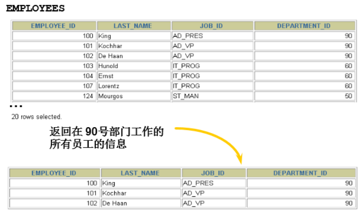

- 语法：

  ```sql
  SELECT 字段1,字段 2
  FROM 表名
  WHERE 过滤条件
  ```

  - 使用WHERE 子句，将不满足条件的行过滤掉
  - **WHERE子句紧随 FROM子句**

- 举例

  ```sql
  xSELECT employee_id, last_name, job_id, department_idFROM employeesWHERE department_id = 90 ;
  ```

  

## 4运算符

### 1. 算术运算符

------

算术运算符主要用于数学运算，其可以连接运算符前后的两个数值或表达式，对数值或表达式进行加（+）、减（-）、乘（*）、除（/）和取模（%）运算。


#### 1.1加法与减法运算符

```
mysql> SELECT 100 , 100 + 0 , 100 - 0 , 100 + 50 , 100 + 50 - 30 , 100 + 35.5, 100 - 35.
FROM dual;
+-----+---------+---------+----------+--------------+------------+------------+
| 100 | 100 + 0 | 100 - 0 | 100 + 50 | 100 + 50 - 30 | 100 + 35.5 | 100 - 35.5 |
+-----+---------+---------+----------+--------------+------------+------------+
| 100 | 100 | 100 | 150 | 120 |  135.5 | 64.5 |
+-----+---------+---------+----------+--------------+------------+------------+
1 row in set (0.00 sec)
```

由运算结果可以得出如下结论：

> - 一个整数类型的值对整数进行加法和减法操作，结果还是一个整数；
> - 一个整数类型的值对浮点数进行加法和减法操作，结果是一个浮点数；
> - 加法和减法的优先级相同，进行先加后减操作与进行先减后加操作的结果是一样的；
> - 在Java中，+的左右两边如果有字符串，那么表示字符串的拼接。但是在MySQL中+只表示数值相加。如果遇到非数值类型，先尝试转成数值，如果转失败，就按 0 计算。（补充：MySQL中字符串拼接要使用字符串函数CONCAT()实现）

#### 1.2乘法与除法运算符

```
mysql> SELECT 100 , 100 * 1 , 100 * 1.0, 100 / 1.0, 100 / 2 , 100 + 2 * 5 / 2 , 100 /3, 100 DIV 0 FROM dual;
+-----+---------+-----------+-----------+---------+-----------------+---------+-----------+
| 100 | 100 * 1 | 100 * 1.0 | 100 / 1.0 | 100 / 2 | 100 + 2 * 5 / 2 | 100 /3 | 100 DIV 0 |
+-----+---------+-----------+-----------+---------+-----------------+---------+-----------+
| 100 | 100 | 100.0 |  100.0000 | 50.0000 |  105.0000 | 33.3333 | NULL |
+-----+---------+-----------+-----------+---------+-----------------+---------+-----------+
1 row in set (0.00 sec)
#计算出员工的年基本工资
SELECT employee_id,salary,salary * 12 annual_sal
FROM employees;
```

由运算结果可以得出如下结论：

> - 一个数乘以整数 1 和除以整数 1 后仍得原数；
> - 一个数乘以浮点数 1 和除以浮点数 1 后变成浮点数，数值与原数相等；
> - 一个数除以整数后，不管是否能除尽，结果都为一个浮点数；
> - 一个数除以另一个数，除不尽时，结果为一个浮点数，并保留到小数点后 4 位；
> - 乘法和除法的优先级相同，进行先乘后除操作与先除后乘操作，得出的结果相同。
> - 在数学运算中， 0 不能用作除数，在MySQL中，一个数除以 0 为NULL。

#### 1.3求模（求余）运算符

将t22表中的字段 i 对 3 和 5 进行求模（求余）运算。

```
mysql> SELECT 12 % 3 , 12 MOD 5 FROM dual;
+--------+----------+
| 12 % 3 | 12 MOD 5 |
+--------+----------+
| 0 | 2 |
+--------+----------+
1 row in set (0.00 sec)
#筛选出employee_id是偶数的员工
SELECT * FROM employees
WHERE employee_id MOD 2 = 0 ;
```

可以看到， 100 对 3 求模后的结果为 3 ，对 5 求模后的结果为 0 。

------

### 2. 比较运算符

------

比较运算符用来对表达式左边的操作数和右边的操作数进行比较，比较的结果为真则返回 1 ，比较的结果为假则返回 0 ，其他情况则返回NULL。

比较运算符经常被用来作为SELECT查询语句的条件来使用，返回符合条件的结果记录。


#### 2.1 等号运算符

- 等号运算符（=）判断等号两边的值、字符串或表达式是否相等，如果相等则返回 1 ，不相等则返回0 。
- 在使用等号运算符时，遵循如下规则：
  - 如果等号两边的值、字符串或表达式都为字符串，则MySQL会按照字符串进行比较，其比较的是每个字符串中字符的ANSI编码是否相等。
  - 如果等号两边的值都是整数，则MySQL会按照整数来比较两个值的大小。
  - 如果等号两边的值一个是整数，另一个是字符串，则MySQL会将字符串转化为数字进行比较。
  - 如果等号两边的值、字符串或表达式中有一个为NULL，则比较结果为NULL。
- 对比：SQL中赋值符号使用 :=

```
mysql> SELECT 1 = 1 , 1 = '1', 1 = 0 , 'a' = 'a', ( 5 + 3 ) = ( 2 + 6 ), '' = NULL , NULL = NULL;
+-------+---------+-------+-----------+-------------------+-----------+-------------+
| 1 = 1 | 1 = '1' | 1 = 0 | 'a' = 'a' | ( 5 + 3 ) = ( 2 + 6 ) | '' = NULL | NULL = NULL |
+-------+---------+-------+-----------+-------------------+-----------+-------------+
| 1 | 1 | 0 | 1 | 1 |  NULL |  NULL |
+-------+---------+-------+-----------+-------------------+-----------+-------------+
1 row in set (0.00 sec)
mysql> SELECT 1 = 2 , 0 = 'abc', 1 = 'abc' FROM dual;
+-------+-----------+-----------+
| 1 = 2 | 0 = 'abc' | 1 = 'abc' |
+-------+-----------+-----------+
| 0 | 1 | 0 |
+-------+-----------+-----------+
1 row in set, 2 warnings (0.00 sec)
#查询salary=10000，注意在Java中比较是==
SELECT employee_id,salary FROM employees WHERE salary = 10000 ;
```

#### 2.2 安全等于运算符

安全等于运算符（<=>）与等于运算符（=）的作用是相似的，`唯一的区别`是‘<=>’可以用来对NULL进行判断。在两个操作数均为NULL时，其返回值为 1 ，而不为NULL；当一个操作数为NULL时，其返回值为 0 ，而不为NULL。

```
mysql> SELECT 1 <=> '1', 1 <=> 0 , 'a' <=> 'a', ( 5 + 3 ) <=> ( 2 + 6 ), '' <=> NULL,NULL <=> NULL FROM dual;
+-----------+---------+-------------+---------------------+-------------+---------------+
| 1 <=> '1' | 1 <=> 0 | 'a' <=> 'a' | ( 5 + 3 ) <=> ( 2 + 6 ) | '' <=> NULL | NULL <=> NULL |
+-----------+---------+-------------+---------------------+-------------+---------------+
| 1 | 0 | 1 | 1 | 0 | 1 |
+-----------+---------+-------------+---------------------+-------------+---------------+
1 row in set (0.00 sec)
#查询commission_pct等于0.
SELECT employee_id,commission_pct FROM employees WHERE commission_pct = 0.40;

SELECT employee_id,commission_pct FROM employees WHERE commission_pct <=> 0.40;

#如果把0.40改成 NULL 呢？
```

可以看到，使用安全等于运算符时，两边的操作数的值都为NULL时，返回的结果为 1 而不是NULL，其他返回结果与等于运算符相同。

#### 2.3 不等于运算符

不等于运算符（<>和!=）用于判断两边的数字、字符串或者表达式的值是否不相等，如果不相等则返回 1 ，相等则返回 0 。不等于运算符不能判断NULL值。如果两边的值有任意一个为NULL，或两边都为NULL，则结果为NULL。 SQL语句示例如下：

```
mysql> SELECT 1 <> 1 , 1 != 2 , 'a' != 'b', ( 3 + 4 ) <> ( 2 + 6 ), 'a' != NULL, NULL <> NULL;
+--------+--------+------------+----------------+-------------+--------------+
| 1 <> 1 | 1 != 2 | 'a' != 'b' | ( 3 + 4 ) <> ( 2 + 6 ) | 'a' != NULL | NULL <> NULL |
+--------+--------+------------+----------------+-------------+--------------+
| 0 | 1 | 1 | 1 | NULL | NULL |
+--------+--------+------------+----------------+-------------+--------------+
1 row in set (0.00 sec)
```

此外，还有非符号类型的运算符：


#### 2.4 空运算符

空运算符（IS NULL或者ISNULL）判断一个值是否为NULL，如果为NULL则返回 1 ，否则返回0 。 SQL语句示例如下：

```
mysql> SELECT NULL IS NULL, ISNULL(NULL), ISNULL('a'), 1 IS NULL;
+--------------+--------------+-------------+-----------+
| NULL IS NULL | ISNULL(NULL) | ISNULL('a') | 1 IS NULL |
+--------------+--------------+-------------+-----------+
| 1 | 1 | 0 | 0 |
+--------------+--------------+-------------+-----------+
1 row in set (0.00 sec)
#查询commission_pct等于NULL。比较如下的四种写法
SELECT employee_id,commission_pct FROM employees WHERE commission_pct IS NULL;
SELECT employee_id,commission_pct FROM employees WHERE commission_pct <=> NULL;
SELECT employee_id,commission_pct FROM employees WHERE ISNULL(commission_pct);
SELECT employee_id,commission_pct FROM employees WHERE commission_pct = NULL;
SELECT last_name, manager_id
FROM employees
WHERE manager_id IS NULL;
```

#### 2.5 非空运算符

非空运算符（IS NOT NULL）判断一个值是否不为NULL，如果不为NULL则返回 1 ，否则返回 0 。 SQL语句示例如下：

```
mysql> SELECT NULL IS NOT NULL, 'a' IS NOT NULL, 1 IS NOT NULL;
+------------------+-----------------+---------------+
| NULL IS NOT NULL | 'a' IS NOT NULL | 1 IS NOT NULL |
+------------------+-----------------+---------------+
| 0 | 1 | 1 |
+------------------+-----------------+---------------+
1 row in set (0.01 sec)
#查询commission_pct不等于NULL
SELECT employee_id,commission_pct FROM employees WHERE commission_pct IS NOT NULL;
SELECT employee_id,commission_pct FROM employees WHERE NOT commission_pct <=> NULL;
SELECT employee_id,commission_pct FROM employees WHERE NOT ISNULL(commission_pct);
```

#### 2.6 最小值运算符

语法格式为：LEAST(值 1 ，值 2 ，…，值n)。其中，“值n”表示参数列表中有n个值。在有两个或多个参数的情况下，返回最小值。

```
mysql> SELECT LEAST ( 1 , 0 , 2 ), LEAST('b','a','c'), LEAST( 1 ,NULL, 2 );
+---------------+--------------------+-----------------+
| LEAST ( 1 , 0 , 2 ) | LEAST('b','a','c') | LEAST( 1 ,NULL, 2 ) |
+---------------+--------------------+-----------------+
| 0 | a |  NULL |
+---------------+--------------------+-----------------+
1 row in set (0.00 sec)
```

由结果可以看到，当参数是整数或者浮点数时，LEAST将返回其中最小的值；当参数为字符串时，返回字母表中顺序最靠前的字符；当比较值列表中有NULL时，不能判断大小，返回值为NULL。

#### 2.7 最大值运算符

语法格式为：GREATEST(值 1 ，值 2 ，…，值n)。其中，n表示参数列表中有n个值。当有两个或多个参数时，返回值为最大值。假如任意一个自变量为NULL，则GREATEST()的返回值为NULL。

```
mysql> SELECT GREATEST( 1 , 0 , 2 ), GREATEST('b','a','c'), GREATEST( 1 ,NULL, 2 );
+-----------------+-----------------------+--------------------+
| GREATEST( 1 , 0 , 2 ) | GREATEST('b','a','c') | GREATEST( 1 ,NULL, 2 ) |
+-----------------+-----------------------+--------------------+
| 2 | c | NULL |
+-----------------+-----------------------+--------------------+
1 row in set (0.00 sec)
```

由结果可以看到，当参数中是整数或者浮点数时，GREATEST将返回其中最大的值；当参数为字符串时，返回字母表中顺序最靠后的字符；当比较值列表中有NULL时，不能判断大小，返回值为NULL。

#### 2.8 BETWEEN AND运算符

BETWEEN运算符使用的格式通常为SELECT D FROM TABLE WHERE C BETWEEN A AND B，此时，当C大于或等于A，并且C小于或等于B时，结果为 1 ，否则结果为 0 。

```
mysql> SELECT 1 BETWEEN 0 AND 1 , 10 BETWEEN 11 AND 12 , 'b' BETWEEN 'a' AND 'c';
+-------------------+----------------------+-------------------------+
| 1 BETWEEN 0 AND 1 | 10 BETWEEN 11 AND 12 | 'b' BETWEEN 'a' AND 'c' |
+-------------------+----------------------+-------------------------+
| 1 | 0 | 1 |
+-------------------+----------------------+-------------------------+
1 row in set (0.00 sec)
SELECT last_name, salary
FROM employees
WHERE salary BETWEEN 2500 AND 3500 ;
```

#### 2.9 IN运算符

IN运算符用于判断给定的值是否是IN列表中的一个值，如果是则返回 1 ，否则返回 0 。如果给定的值为NULL，或者IN列表中存在NULL，则结果为NULL。

```
mysql> SELECT 'a' IN ('a','b','c'), 1 IN ( 2 , 3 ), NULL IN ('a','b'), 'a' IN ('a', NULL);
+----------------------+------------+-------------------+--------------------+
| 'a' IN ('a','b','c') | 1 IN ( 2 , 3 ) | NULL IN ('a','b') | 'a' IN ('a', NULL) |
+----------------------+------------+-------------------+--------------------+
| 1 | 0 | NULL | 1 |
+----------------------+------------+-------------------+--------------------+
1 row in set (0.00 sec)
SELECT employee_id, last_name, salary, manager_id
FROM employees
WHERE manager_id IN ( 100 , 101 , 201 );
```

#### 2.10 NOT IN运算符

NOT IN运算符用于判断给定的值是否不是IN列表中的一个值，如果不是IN列表中的一个值，则返回 1 ，否则返回 0 。

```
mysql> SELECT 'a' NOT IN ('a','b','c'), 1 NOT IN ( 2 , 3 );
+--------------------------+----------------+
| 'a' NOT IN ('a','b','c') | 1 NOT IN ( 2 , 3 ) |
+--------------------------+----------------+
| 0 | 1 |
+--------------------------+----------------+
1 row in set (0.00 sec)
```

#### 2.11 LIKE运算符

LIKE运算符主要用来匹配字符串，通常用于模糊匹配，如果满足条件则返回 1 ，否则返回0 。如果给定的值或者匹配条件为NULL，则返回结果为NULL。

LIKE运算符通常使用如下通配符：

```
“%”：匹配 0 个或多个字符。
“_”：只能匹配一个字符。
```

SQL语句示例如下：

```
mysql> SELECT NULL LIKE 'abc', 'abc' LIKE NULL;
+-----------------+-----------------+
| NULL LIKE 'abc' | 'abc' LIKE NULL |
+-----------------+-----------------+
|  NULL |  NULL |
+-----------------+-----------------+
1 row in set (0.00 sec)
SELECT first_name
FROM employees
WHERE first_name LIKE 'S%';
SELECT last_name
FROM employees
WHERE last_name LIKE '_o%';
```

**ESCAPE**

- 回避特殊符号的： 使用转义符 。例如：将[%]转为[$%]、[]转为[$]，然后再加上[ESCAPE‘$’]即可。

  ```
  SELECT job_id
  FROM jobs
  WHERE job_id LIKE ‘IT\_%‘;
  ```

- 如果使用\表示转义，要省略ESCAPE。如果不是\，则要加上ESCAPE。

  ```
  SELECT job_id
  FROM jobs
  WHERE job_id LIKE ‘IT$_%‘ escape ‘$‘;
  ```

#### 2.12 REGEXP运算符

REGEXP运算符用来匹配字符串，语法格式为：expr REGEXP 匹配条件。如果expr满足匹配条件，返回1 ；如果不满足，则返回 0 。若expr或匹配条件任意一个为NULL，则结果为NULL。

REGEXP运算符在进行匹配时，常用的有下面几种通配符：

```
（ 1 ）‘^’匹配以该字符后面的字符开头的字符串。
（ 2 ）‘$’匹配以该字符前面的字符结尾的字符串。
（ 3 ）‘.’匹配任何一个单字符。
（ 4 ）“[...]”匹配在方括号内的任何字符。例如，“[abc]”匹配“a”或“b”或“c”。为了命名字符的范围，使用一个‘-’。“[a-z]”匹配任何字母，而“[0-9]”匹配任何数字。
（ 5 ）‘*’匹配零个或多个在它前面的字符。例如，“x*”匹配任何数量的‘x’字符，“[0-9]*”匹配任何数量的数字，而“*”匹配任何数量的任何字符。
```

SQL语句示例如下：

```
mysql> SELECT 'shkstart' REGEXP '^s', 'shkstart' REGEXP 't$', 'shkstart' REGEXP 'hk';
+------------------------+------------------------+-------------------------+
| 'shkstart' REGEXP '^s' | 'shkstart' REGEXP 't$' | 'shkstart' REGEXP 'hk' |
+------------------------+------------------------+-------------------------+
| 1 | 1 | 1 |
+------------------------+------------------------+-------------------------+
1 row in set (0.01 sec)
mysql> SELECT 'atguigu' REGEXP 'gu.gu', 'atguigu' REGEXP '[ab]';
+--------------------------+-------------------------+
| 'atguigu' REGEXP 'gu.gu' | 'atguigu' REGEXP '[ab]' |
+--------------------------+-------------------------+
| 1 | 1 |
+--------------------------+-------------------------+
1 row in set (0.00 sec)
```

------

### 3.逻辑运算符

------

逻辑运算符主要用来判断表达式的真假，在MySQL中，逻辑运算符的返回结果为 1 、 0 或者NULL。

MySQL中支持 4 种逻辑运算符如下：


#### 3.1 逻辑非运算符

逻辑非（NOT或!）运算符表示当给定的值为 0 时返回 1 ；当给定的值为非 0 值时返回 0 ；当给定的值为NULL时，返回NULL。

```
mysql> SELECT NOT 1 , NOT 0 , NOT( 1 + 1 ), NOT! 1 , NOT NULL;
+-------+-------+----------+--------+----------+
| NOT 1 | NOT 0 | NOT( 1 + 1 ) | NOT! 1 | NOT NULL |
+-------+-------+----------+--------+----------+
| 0 | 1 | 0 | 1 | NULL |
+-------+-------+----------+--------+----------+
1 row in set, 1 warning (0.00 sec)
SELECT last_name, job_id
FROM employees
WHERE job_id NOT IN ('IT_PROG', 'ST_CLERK', 'SA_REP');
```

#### 3.2 逻辑与运算符

逻辑与（AND或&&）运算符是当给定的所有值均为非 0 值，并且都不为NULL时，返回1 ；当给定的一个值或者多个值为 0 时则返回 0 ；否则返回NULL。

```
mysql> SELECT 1 AND - 1 , 0 AND 1 , 0 AND NULL, 1 AND NULL;
+----------+---------+------------+------------+
| 1 AND - 1 | 0 AND 1 | 0 AND NULL | 1 AND NULL |
+----------+---------+------------+------------+
| 1 | 0 | 0 | NULL |
+----------+---------+------------+------------+
1 row in set (0.00 sec)
SELECT employee_id, last_name, job_id, salary
FROM employees
WHERE salary >= 10000
AND job_id LIKE '%MAN%';
```

#### 3.3 逻辑或运算符

逻辑或（OR或||）运算符是当给定的值都不为NULL，并且任何一个值为非 0 值时，则返回 1 ，否则返回 0 ；当一个值为NULL，并且另一个值为非 0 值时，返回 1 ，否则返回NULL；当两个值都为NULL时，返回NULL。

```
mysql> SELECT 1 OR - 1 , 1 OR 0 , 1 OR NULL, 0 || NULL, NULL || NULL;
+---------+--------+-----------+-----------+--------------+
| 1 OR - 1 | 1 OR 0 | 1 OR NULL | 0 || NULL | NULL || NULL |
+---------+--------+-----------+-----------+--------------+
| 1 | 1 | 1 |  NULL | NULL |
+---------+--------+-----------+-----------+--------------+
1 row in set, 2 warnings (0.00 sec)
#查询基本薪资不在9000-12000之间的员工编号和基本薪资
SELECT employee_id,salary FROM employees
WHERE NOT (salary >= 9000 AND salary <= 12000 );

SELECT employee_id,salary FROM employees
WHERE salary < 9000 OR salary > 12000 ;

SELECT employee_id,salary FROM employees
WHERE salary NOT BETWEEN 9000 AND 12000 ;
SELECT employee_id, last_name, job_id, salary
FROM employees
WHERE salary >= 10000
OR job_id LIKE '%MAN%';
```

> 注意：
>
> OR可以和AND一起使用，但是在使用时要注意两者的优先级，由于AND的优先级高于OR，因此先对AND两边的操作数进行操作，再与OR中的操作数结合。

#### 3.4 逻辑异或运算符

逻辑异或（XOR）运算符是当给定的值中任意一个值为NULL时，则返回NULL；如果两个非NULL的值都是 0 或者都不等于 0 时，则返回 0 ；如果一个值为 0 ，另一个值不为 0 时，则返回 1 。

```
mysql> SELECT 1 XOR - 1 , 1 XOR 0 , 0 XOR 0 , 1 XOR NULL, 1 XOR 1 XOR 1 , 0 XOR 0 XOR 0 ;
+----------+---------+---------+------------+---------------+---------------+
| 1 XOR - 1 | 1 XOR 0 | 0 XOR 0 | 1 XOR NULL | 1 XOR 1 XOR 1 | 0 XOR 0 XOR 0 |
+----------+---------+---------+------------+---------------+---------------+
| 0 | 1 | 0 | NULL | 1 | 0 |
+----------+---------+---------+------------+---------------+---------------+
1 row in set (0.00 sec)
select last_name,department_id,salary
from employees
where department_id in ( 10 , 20 ) XOR salary > 8000 ;
```

------

### 4. 位运算符

------

位运算符是在二进制数上进行计算的运算符。位运算符会先将操作数变成二进制数，然后进行位运算，最后将计算结果从二进制变回十进制数。

MySQL支持的位运算符如下：
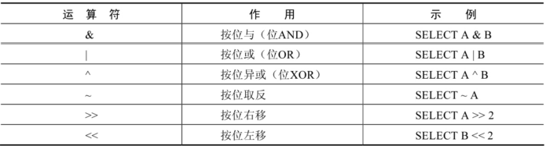

#### 4.1 按位与运算符

按位与（&）运算符将给定值对应的二进制数逐位进行逻辑与运算。当给定值对应的二进制位的数值都为 1 时，则该位返回 1 ，否则返回 0 。

```
mysql> SELECT 1 & 10 , 20 & 30 ;
+--------+---------+
| 1 & 10 | 20 & 30 |
+--------+---------+
| 0 | 20 |
+--------+---------+
1 row in set (0.00 sec)
```

1 的二进制数为 0001 ， 10 的二进制数为 1010 ，所以 1 & 10 的结果为 0000 ，对应的十进制数为 0 。 20 的二进制数为 10100 ， 30 的二进制数为 11110 ，所以 20 & 30 的结果为 10100 ，对应的十进制数为 20 。

#### 4.2 按位或运算符

按位或（|）运算符将给定的值对应的二进制数逐位进行逻辑或运算。当给定值对应的二进制位的数值有一个或两个为 1 时，则该位返回 1 ，否则返回 0 。

```
mysql> SELECT 1 | 10 , 20 | 30 ;
+--------+---------+
| 1 | 10 | 20 | 30 |
+--------+---------+
| 11 | 30 |
+--------+---------+
1 row in set (0.00 sec)
```

1 的二进制数为 0001 ， 10 的二进制数为 1010 ，所以 1 | 10 的结果为 1011 ，对应的十进制数为 11 。 20 的二进制数为 10100 ， 30 的二进制数为 11110 ，所以 20 | 30 的结果为 11110 ，对应的十进制数为 30 。

#### 4.3 按位异或运算符

按位异或（^）运算符将给定的值对应的二进制数逐位进行逻辑异或运算。当给定值对应的二进制位的数值不同时，则该位返回 1 ，否则返回 0 。

```
mysql> SELECT 1 ^ 10 , 20 ^ 30 ;
+--------+---------+
| 1 ^ 10 | 20 ^ 30 |
+--------+---------+
| 11 | 10 |
+--------+---------+
1 row in set (0.00 sec)
```

1 的二进制数为 0001 ， 10 的二进制数为 1010 ，所以 1 ^ 10 的结果为 1011 ，对应的十进制数为 11 。 20 的二进制数为 10100 ， 30 的二进制数为 11110 ，所以 20 ^ 30 的结果为 01010 ，对应的十进制数为 10 。

再举例：

```
mysql> SELECT 12 & 5 , 12 | 5 , 12 ^ 5 FROM DUAL;
+--------+--------+--------+
| 12 & 5 | 12 | 5 | 12 ^ 5 |
+--------+--------+--------+
| 4 | 13 | 9 |
+--------+--------+--------+
1 row in set (0.00 sec)
```


#### 4.4 按位取反运算符

按位取反（~）运算符将给定的值的二进制数逐位进行取反操作，即将 1 变为 0 ，将 0 变为 1 。

```
mysql> SELECT 10 & ~1;
+---------+
| 10 & ~1 |
+---------+
| 10 |
+---------+
1 row in set (0.00 sec)
```

由于按位取反（~）运算符的优先级高于按位与（&）运算符的优先级，所以 10 & ~ 1 ，首先，对数字 1 进行按位取反操作，结果除了最低位为 0 ，其他位都为 1 ，然后与 10 进行按位与操作，结果为 10 。

#### 4.5 按位右移运算符

按位右移（>>）运算符将给定的值的二进制数的所有位右移指定的位数。右移指定的位数后，右边低位的数值被移出并丢弃，左边高位空出的位置用 0 补齐。

```
mysql> SELECT 1 >> 2 , 4 >> 2 ;
+--------+--------+
| 1 >> 2 | 4 >> 2 |
+--------+--------+
| 0 | 1 |
+--------+--------+
1 row in set (0.00 sec)
```

1 的二进制数为 0000 0001 ，右移 2 位为 0000 0000 ，对应的十进制数为 0 。 4 的二进制数为 0000 0100 ，右移 2位为 0000 0001 ，对应的十进制数为 1 。

#### 4.6 按位左移运算符

按位左移（<<）运算符将给定的值的二进制数的所有位左移指定的位数。左移指定的位数后，左边高位的数值被移出并丢弃，右边低位空出的位置用 0 补齐。

```
mysql> SELECT 1 << 2 , 4 << 2 ;
+--------+--------+
| 1 << 2 | 4 << 2 |
+--------+--------+
| 4 | 16 |
+--------+--------+
1 row in set (0.00 sec)
```

1 的二进制数为 0000 0001 ，左移两位为 0000 0100 ，对应的十进制数为 4 。 4 的二进制数为 0000 0100 ，左移两位为 0001 0000 ，对应的十进制数为 16 。

------

### 5. 运算符的优先级

------


数字编号越大，优先级越高，优先级高的运算符先进行计算。可以看到，赋值运算符的优先级最低，使用“()”括起来的表达式的优先级最高。

------

### 6. 拓展：使用正则表达式查询

------

正则表达式通常被用来检索或替换那些符合某个模式的文本内容，根据指定的匹配模式匹配文本中符合要求的特殊字符串。例如，从一个文本文件中提取电话号码，查找一篇文章中重复的单词或者替换用户输入的某些敏感词语等，这些地方都可以使用正则表达式。正则表达式强大而且灵活，可以应用于非常复杂的查询。

MySQL中使用REGEXP关键字指定正则表达式的字符匹配模式。下表列出了REGEXP操作符中常用字符匹配列表。


#### 6.1 查询以特定字符或字符串开头的记录

字符‘^’匹配以特定字符或者字符串开头的文本。

在fruits表中，查询f_name字段以字母‘b’开头的记录，SQL语句如下：

```
mysql> SELECT * FROM fruits WHERE f_name REGEXP '^b';
```

#### 6.2 查询以特定字符或字符串结尾的记录

字符‘$’匹配以特定字符或者字符串结尾的文本。

在fruits表中，查询f_name字段以字母‘y’结尾的记录，SQL语句如下：

```
mysql> SELECT * FROM fruits WHERE f_name REGEXP 'y$';
```

#### 6.3 用符号”.”来替代字符串中的任意一个字符

字符‘.’匹配任意一个字符。 在fruits表中，查询f_name字段值

包含字母‘a’与‘g’且两个字母之间只有一个字母的记录，SQL语句如下：

```
mysql> SELECT * FROM fruits WHERE f_name REGEXP 'a.g';
```

#### 6.4 使用”*”和”+”来匹配多个字符

星号‘*’匹配前面的字符任意多次，包括 0 次。加号‘+’匹配前面的字符至少一次。

在fruits表中，查询f_name字段值以字母‘b’开头且‘b’后面出现字母‘a’的记录，SQL语句如下：

```
mysql> SELECT * FROM fruits WHERE f_name REGEXP '^ba*';
```

在fruits表中，查询f_name字段值以字母‘b’开头且‘b’后面出现字母‘a’至少一次的记录，SQL语句如下：

```
mysql> SELECT * FROM fruits WHERE f_name REGEXP '^ba+';
```

#### 6.5 匹配指定字符串

正则表达式可以匹配指定字符串，只要这个字符串在查询文本中即可，如要匹配多个字符串，多个字符串之间使用分隔符‘|’隔开。

在fruits表中，查询f_name字段值包含字符串“on”的记录，SQL语句如下：

```
mysql> SELECT * FROM fruits WHERE f_name REGEXP 'on';
```

在fruits表中，查询f_name字段值包含字符串“on”或者“ap”的记录，SQL语句如下：

```
mysql> SELECT * FROM fruits WHERE f_name REGEXP 'on|ap';
```

之前介绍过，LIKE运算符也可以匹配指定的字符串，但与REGEXP不同，LIKE匹配的字符串如果在文本中间出现，则找不到它，相应的行也不会返回。REGEXP在文本内进行匹配，如果被匹配的字符串在文本中出现，REGEXP将会找到它，相应的行也会被返回。对比结果如下所示。

在fruits表中，使用LIKE运算符查询f_name字段值为“on”的记录，SQL语句如下：

```
mysql> SELECT * FROM fruits WHERE f_name like 'on';
Empty set(0.00 sec)
```

#### 6.6 匹配指定字符中的任意一个

方括号“[]”指定一个字符集合，只匹配其中任何一个字符，即为所查找的文本。

在fruits表中，查找f_name字段中包含字母‘o’或者‘t’的记录，SQL语句如下：

```
mysql> SELECT * FROM fruits WHERE f_name REGEXP '[ot]';
```

在fruits表中，查询s_id字段中包含 4 、 5 或者 6 的记录，SQL语句如下：

```
mysql> SELECT * FROM fruits WHERE s_id REGEXP '[456]';
```

#### 6.7 匹配指定字符以外的字符

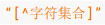匹配不在指定集合中的任何字符。

在fruits表中，查询f_id字段中包含字母a~~e和数字1~~2以外字符的记录，SQL语句如下：

```
mysql> SELECT * FROM fruits WHERE f_id REGEXP '[^a-e1-2]';
```

#### 6.8 使用{n,}或者{n,m}来指定字符串连续出现的次数

“字符串{n,}”表示至少匹配n次前面的字符；“字符串{n,m}”表示匹配前面的字符串不少于n次，不多于m次。例如，a{2,}表示字母a连续出现至少 2 次，也可以大于 2 次；a{2,4}表示字母a连续出现最少 2 次，最多不能超过 4 次。

在fruits表中，查询f_name字段值出现字母‘x’至少 2 次的记录，SQL语句如下：

```
mysql> SELECT * FROM fruits WHERE f_name REGEXP 'x{2,}';
```

在fruits表中，查询f_name字段值出现字符串“ba”最少 1 次、最多 3 次的记录，SQL语句如下：

```
mysql> SELECT * FROM fruits WHERE f_name REGEXP 'ba{1,3}';
```

## 5排序与分页

### 1. 排序数据

------

#### 1. 1 排序规则

- 使用 ORDER BY 子句排序
  - **ASC（ascend）: 升序**
  - **DESC（descend）:降序**
- **ORDER BY 子句在SELECT语句的结尾。**

#### 1. 2 单列排序

```
SELECT last_name, job_id, department_id, hire_date
FROM employees
ORDER BY hire_date ;
```

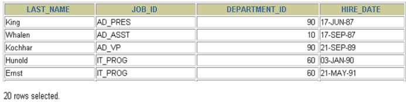

```
SELECT last_name, job_id, department_id, hire_date
FROM employees
ORDER BY hire_date DESC ;
```


```
SELECT employee_id, last_name, salary* 12 annsal
FROM employees
ORDER BY annsal;
```

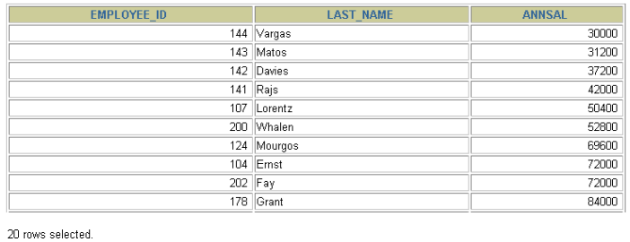

#### 1. 3 多列排序

```
SELECT last_name, department_id, salary
FROM employees
ORDER BY department_id, salary DESC;
```


- 可以使用不在SELECT列表中的列排序。
- 在对多列进行排序的时候，首先排序的第一列必须有相同的列值，才会对第二列进行排序。如果第一列数据中所有值都是唯一的，将不再对第二列进行排序。

------

### 分页

#### 应用场景

实际的web项目中需要根据用户的需求提交对应的分页查询的sql语句

####  实现规则


- 分页原理
  所谓分页显示，就是将数据库中的结果集，一段一段显示出来需要的条件。

- MySQL中使用 LIMIT 实现分页

  **限制返回的行数**。可以有两个参数，第一个参数为**起始行**，**从 0 开始**；第二个参数为返回的总行数。

**格式：**

  ```sql
  LIMIT [位置偏移量,] 行数
  LIMIT n <==> LIMIT 0,n
  ```

  **语法：**

  ```mysql
  select 字段|表达式,...
  from 表
  【where 条件】
  【group by 分组字段】
  【having 条件】
  【order by 排序的字段】
  limit 【起始行，】条目数;
  # 使用offset
  select 字段|表达式,...
  from 表
  【where 条件】
  【group by 分组字段】
  【having 条件】
  【order by 排序的字段】
  limit 条目数 offset 起始行;
  ```

- **起始条目索引从0开始**：第一个“位置偏移量”参数指示MySQL从哪一行开始显示，是一个可选参数，**如果不指定“位置偏移量”，将会从表中的第一条记录开始**（第一条记录的位置偏移量是 0 ，第二条记录的位置偏移量是1 ，以此类推）；第二个参数“行数”指示返回的记录条数。

- 分页公式 ：（**当前页数- 1 ）\*每页条数，每页条数**

  ```sql
  SELECT * FROM table
  LIMIT(PageNo - 1 )*PageSize,PageSize;
  ```

- **注意：LIMIT 子句必须放在整个SELECT语句的最后！**

- 使用 LIMIT 的好处
  约束返回结果的数量可以减少数据表的网络传输量，也可以提升查询效率。如果我们**知道返回结果只有1 条，就可以使用LIMIT 1，告诉 SELECT 语句只需要返回一条记录即可**。这样的好处就是 SELECT 不需要扫描完整的表，只需要检索到一条符合条件的记录即可返回。

**举例：**

  ```sql
  --前 10 条记录：
  SELECT * FROM 表名 LIMIT 0, 10 ;
  或者
  SELECT * FROM 表名 LIMIT 10 ;
  
  --第 11 至 20 条记录：
  SELECT * FROM 表名 LIMIT 10 , 10 ;
  
  --第 21 至 30 条记录：
  SELECT * FROM 表名 LIMIT 20 , 10 ;
  ```

  > MySQL 8.0中可以使用“LIMIT 3 OFFSET 4”，意思是获取从第 5 条记录（标号为4的记录，0开始）开始后面的 3 条记录，和“LIMIT 4,3;”返回的结果相同。


### offset

当 **limit和offset组合使用的时候**，limit后面只能有一个参数，表示要取的的数量,offset表示要跳过的数量 。

```mysql
select * from article 
LIMIT 3 OFFSET 1
```

 表示跳过1条数据,从第2条数据开始取，取3条数据，也就是取2,3,4三条数据


#### 拓展

在不同的 DBMS 中使用的关键字可能不同。在 MySQL、PostgreSQL、MariaDB 和 SQLite 中使用 LIMIT 关键字，而且需要放到 SELECT 语句的最后面。

- 如果是 SQL Server 和 Access，需要使用 TOP 关键字，比如：

  ```sql
  SELECT TOP 5 name, hp_max FROM heros ORDER BY hp_max DESC
  ```

- 如果是 DB2，使用FETCH FIRST 5 ROWS ONLY这样的关键字：

  ```sql
  SELECT name, hp_max FROM heros ORDER BY hp_max DESC FETCH FIRST 5 ROWS ONLY
  ```

- 如果是 Oracle，你需要基于 ROWNUM 来统计行数：

  ```sql
  SELECT rownum,last_name,salary FROM employees WHERE rownum < 5 ORDER BY salary DESC;
  ```

  需要说明的是，这条语句是先取出来前 5 条数据行，然后再按照 hp_max 从高到低的顺序进行排序。但这样产生的结果和上述方法的并不一样。我会在后面讲到子查询，你可以使用

  ```sql
  SELECT rownum, last_name,salary
  FROM (
  SELECT last_name,salary
  FROM employees
  ORDER BY salary DESC)
  WHERE rownum < 10 ;
  ```

  得到与上述方法一致的结果。


## 6多表查询、

> 注：cross join是笛卡尔积，理论上不应该支持on语法，但是MySQL在这方面做的比较奇怪。
>
> 总共有五种join：cross，outer full，outer left，outer right和inner。除了cross之外都支持on语法。
>
> **cross join 和inner join 这俩在 MySQL 中没有区别~，cross join 同样支持on过滤笛卡尔积**

多表查询，也称为关联查询，指两个或更多个表一起完成查询操作。

前提条件：这些一起查询的表之间是有关系的（一对一、一对多），它们之间一定是有关联字段，这个关联字段可能建立了外键，也可能没有建立外键。比如：员工表和部门表，这两个表依靠“部门编号”进行关联。


------

### 1. 一个案例引发的多表连接

------

#### 1. 1 案例说明


从多个表中获取数据：

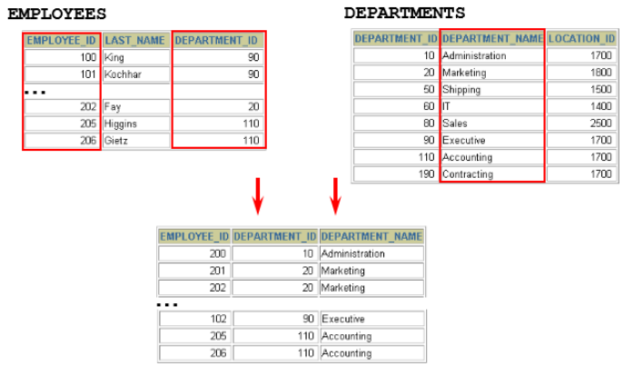

```
#案例：查询员工的姓名及其部门名称
SELECT last_name, department_name
FROM employees, departments;
```

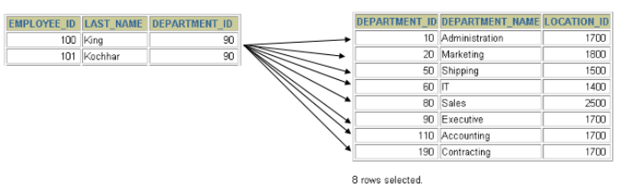

查询结果：

```
+-----------+----------------------+
| last_name | department_name |
+-----------+----------------------+
| King | Administration |
| King | Marketing |
| King | Purchasing |
| King | Human Resources |
| King | Shipping |
| King | IT |
| King | Public Relations |
| King | Sales |
| King | Executive |
| King | Finance |
| King | Accounting |
| King | Treasury |
...
| Gietz | IT Support |
| Gietz | NOC |
| Gietz | IT Helpdesk |
| Gietz | Government Sales |
| Gietz | Retail Sales |
| Gietz | Recruiting |
| Gietz | Payroll |
+-----------+----------------------+
2889 rows in set (0.01 sec)
```

**分析错误情况：**

```
SELECT COUNT(employee_id) FROM employees;
#输出 107 行

SELECT COUNT(department_id)FROM departments;
#输出 27 行

SELECT 107 * 27 FROM dual;
```

我们把上述多表查询中出现的问题称为：笛卡尔积的错误。

#### cross join—笛卡尔积（或交叉连接）的理解

笛卡尔乘积是一个数学运算。假设我有两个集合 X 和 Y，那么 X 和 Y 的笛卡尔积就是 X 和 Y 的所有可能组合，也就是第一个对象来自于 X，第二个对象来自于 Y 的所有可能。组合的个数即为两个集合中元素个数的乘积数。

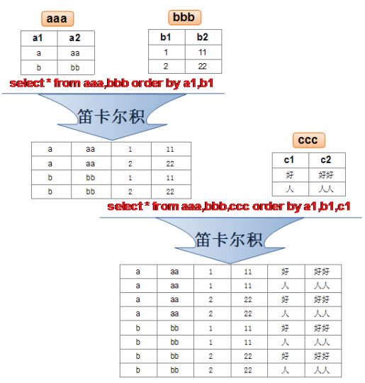

SQL 92 中，笛卡尔积也称为`交叉连接`，英文是 `CROSS JOIN`。在 SQL 99 中也是使用 CROSS JOIN表示交叉连接。它的作用就是可以把任意表进行连接，即使这两张表不相关。在MySQL中如下情况会出现笛卡尔积：

```
#查询员工姓名和所在部门名称
SELECT last_name,department_name FROM employees,departments;
SELECT last_name,department_name FROM employees CROSS JOIN departments;
SELECT last_name,department_name FROM employees INNER JOIN departments;
SELECT last_name,department_name FROM employees JOIN departments;
```

#### 1.3 案例分析与问题解决

- 笛卡尔积的错误会在下面条件下产生

   

  ：

  - 省略多个表的连接条件（或关联条件）
  - 连接条件（或关联条件）无效
  - 所有表中的所有行互相连接

- 为了避免笛卡尔积， 可以 **在 WHERE 加入有效的连接条件**。

- 加入连接条件后，查询语法：

```
SELECT table1.column, table2.column
FROM table1, table
WHERE table1.column 1 = table2.column 2 ;  #连接条件
```

- **在 WHERE子句中写入连接条件。**
- 正确写法：

```
#案例：查询员工的姓名及其部门名称
SELECT last_name, department_name
FROM employees, departments
WHERE employees.department_id = departments.department_id;
```

- **在表中有相同列时，在列名之前加上表名前缀。**

------

### 2. 多表查询分类讲解

------

#### 2.1 分类 1 ：等值连接 vs 非等值连接

等值连接

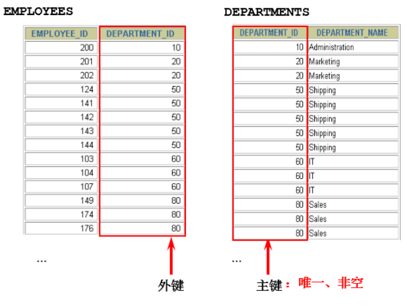

```sql
SELECT employees.employee_id, employees.last_name,
	employees.department_id, departments.department_id,
	departments.location_id
FROM employees, departments
WHERE employees.department_id = departments.department_id;
```


**拓展 1 ：多个连接条件与 AND 操作符**

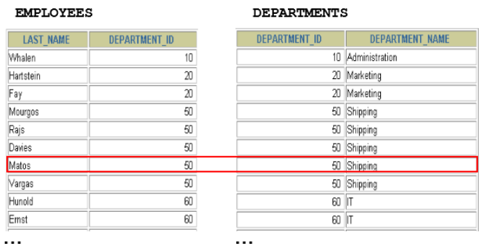

**拓展 2 ：区分重复的列名**

- **多个表中有相同列时，必须在列名之前加上表名前缀。**
- 在不同表中具有相同列名的列可以用表名加以区分。

```
SELECT employees.last_name, departments.department_name,employees.department_id
FROM employees, departments
WHERE employees.department_id = departments.department_id;
```

**拓展 3 ：表的别名**

- 使用别名可以简化查询。
- 列名前使用表名前缀可以提高查询效率。

```
SELECT e.employee_id, e.last_name, e.department_id,
	d.department_id, d.location_id
FROM employees e , departments d
WHERE e.department_id = d.department_id;
```

> 需要注意的是，如果我们使用了表的别名，在查询字段中、过滤条件中就只能使用别名进行代替，不能使用原有的表名，否则就会报错。

> `阿里开发规范`：
>
> 【`强制`】对于数据库中表记录的查询和变更，只要涉及多个表，都需要在列名前加表的别名（或表名）进行限定。
>
> `说明`：对多表进行查询记录、更新记录、删除记录时，如果对操作列没有限定表的别名（或表名），并且操作列在多个表中存在时，就会抛异常。
>
> `正例`：select t1.name from table_first as t1 , table_second as t2 where t1.id=t2.id;
>
> `反例`：在某业务中，由于多表关联查询语句没有加表的别名（或表名）的限制，正常运行两年后，最近在 某个表中增加一个同名字段，在预发布环境做数据库变更后，线上查询语句出现出1052 异常：Column ‘name’ in field list is ambiguous。

**拓展 4 ：连接多个表**


**总结：连接 n个表,至少需要n- 1 个连接条件。**比如，连接三个表，至少需要两个连接条件。

练习：查询出公司员工的 last_name,department_name, city

**非等值连接**


```sql
SELECT e.last_name, e.salary, j.grade_level
FROM employees e, job_grades j
WHERE e.salary BETWEEN j.lowest_sal AND j.highest_sal;
```

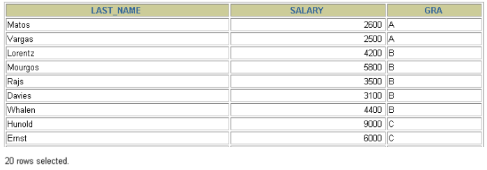

#### 2.2 分类 2 ：自连接 vs 非自连接

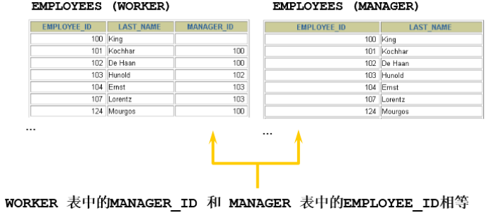

- 当table1和table2本质上是同一张表，只是用取别名的方式虚拟成两张表以代表不同的意义。然后两个表再进行内连接，外连接等查询。

**题目：查询employees表，返回“Xxx works for Xxx”**

```
SELECT CONCAT(worker.last_name ,' works for '
	, manager.last_name)
FROM employees worker, employees manager
WHERE worker.manager_id = manager.employee_id ;
```

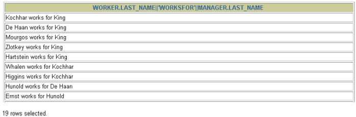

练习：查询出last_name为 ‘Chen’ 的员工的 manager 的信息。

#### 2.3 分类 3 ：内连接 vs 外连接

除了查询满足条件的记录以外，外连接还可以查询某一方不满足条件的记录。

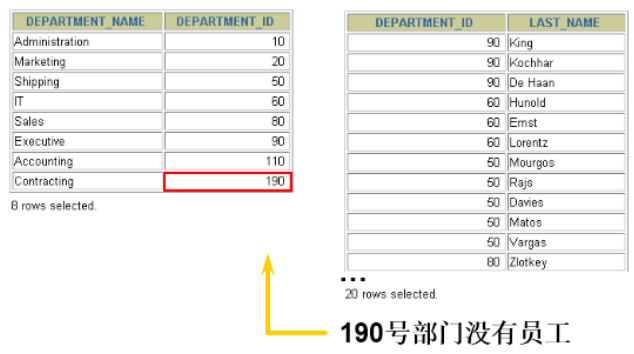

- 内连接: 合并具有同一列的两个以上的表的行, 结果集中不包含一个表与另一个表不匹配的行
- 外连接: 两个表在连接过程中除了返回满足连接条件的行以外 还返回左（或右）表中不满足条件的行 ，这种连接称为左（或右） 外连接 。没有匹配的行时, 结果表中相应的列为空(NULL)。
- 如果是左外连接，则连接条件中左边的表也称为主表，右边的表称为从表。
  如果是右外连接，则连接条件中右边的表也称为主表，左边的表称为从表。

#### 2.4 SQL 92 ：使用(+)创建连接

- 在 SQL92 中采用（+）代表从表所在的位置。即左或右外连接中，(+) 表示哪个是从表。

- Oracle 对 SQL92 支持较好，而 MySQL 则不支持 SQL92 的外连接。

  ```sql
  #左外连接
  SELECT last_name,department_name
  FROM employees ,departments
  WHERE employees.department_id = departments.department_id(+);
  
  #右外连接
  SELECT last_name,department_name
  FROM employees ,departments
  WHERE employees.department_id(+) = departments.department_id;
  ```

- 而且在 SQL92 中，只有左外连接和右外连接，没有满（或全）外连接。

------

### 3. SQL 99 语法实现多表查询

------

#### 3. 1 基本语法

- 使用JOIN…ON子句创建连接的语法结构：

  ```sql
  SELECT table1.column, table2.column,table3.column
  FROM table
  	JOIN table2 ON table1 和 table2 的连接条件
  		JOIN table3 ON table2 和 table3 的连接条件
  ```

  它的嵌套逻辑类似我们使用的 FOR 循环：

  ```
  for t1 in table1:
  	for t2 in table2:
  		if condition1:
  			for t3 in table3:
  				if condition2:
  					output t1 + t2 + t
  ```

  SQL 99 采用的这种嵌套结构非常清爽、层次性更强、可读性更强，即使再多的表进行连接也都清晰可见。如果你采用 SQL 92 ，可读性就会大打折扣。

- 语法说明：

  - **可以使用 ON 子句指定额外的连接条件 。**
  - 这个连接条件是与其它条件分开的。
  - **ON 子句使语句具有更高的易读性 。**
  - 关键字 JOIN、INNER JOIN、CROSS JOIN 的含义是一样的，都表示内连接

#### 3. 2 内连接(INNER JOIN)的实现

- 语法：

  ```
  SELECT 字段列表
  FROM A表 INNER JOIN B表
  ON 关联条件
  WHERE 等其他子句;
  ```

题目 1 ：

```
SELECT e.employee_id, e.last_name, e.department_id,
	d.department_id, d.location_id
FROM employees e JOIN departments d
ON (e.department_id = d.department_id);
```


题目 2 ：

```
SELECT employee_id, city, department_name
FROM employees e
JOIN departments d
ON d.department_id = e.department_id
JOIN locations l
ON d.location_id = l.location_id;
```


#### 外连接(OUTER JOIN)的实现

##### 左外连接(LEFT OUTER JOIN)

- 语法：

  ```
  #实现查询结果是A
  SELECT 字段列表
  FROM A表 LEFT JOIN B表
  ON 关联条件
  WHERE 等其他子句;
  ```

- 举例：

  ```
  SELECT e.last_name, e.department_id, d.department_name
  FROM employees e
  LEFT OUTER JOIN departments d
  ON (e.department_id = d.department_id) ;
  ```

  

#####  右外连接(RIGHT OUTER JOIN)

- 语法：

  ```
  #实现查询结果是B
  SELECT 字段列表
  FROM A表 RIGHT JOIN B表
  ON 关联条件
  WHERE 等其他子句;
  ```

- 举例：

  ```
  SELECT e.last_name, e.department_id, d.department_name
  FROM employees e
  RIGHT OUTER JOIN departments d
  ON (e.department_id = d.department_id) ;
  ```

  

> 需要注意的是，LEFT JOIN 和 RIGHT JOIN 只存在于 SQL 99 及以后的标准中，在 SQL 92 中不存在，只能用 (+) 表示。

##### 满外连接(FULL OUTER JOIN)

- 满外连接的结果 = 左右表匹配的数据 + 左表没有匹配到的数据 + 右表没有匹配到的数据。
- SQL 99 是支持满外连接的。使用FULL JOIN 或 FULL OUTER JOIN来实现。
- 需要注意的是，MySQL不支持FULL JOIN，但是可以用 LEFT JOIN UNION RIGHT join代替。

------

### 4. UNION的使用

------

**合并查询结果**利用UNION关键字，可以给出多条SELECT语句，并将它们的结果组合成单个结果集。合并时，两个表对应的列数和数据类型必须相同，并且相互对应。各个SELECT语句之间使用UNION或UNION ALL关键字分隔。

语法格式：

```
SELECT column,... FROM table
UNION [ALL]
SELECT column,... FROM table
```

**UNION操作符**


UNION 操作符返回两个查询的结果集的并集，去除重复记录。

**UNION ALL操作符**


UNION ALL操作符返回两个查询的结果集的并集。对于两个结果集的重复部分，不去重。

> 注意：执行UNION ALL语句时所需要的资源比UNION语句少。如果明确知道合并数据后的结果数据不存在重复数据，或者不需要去除重复的数据，则尽量使用UNION ALL语句，以提高数据查询的效率。

举例：查询部门编号> 90 或邮箱包含a的员工信息

```
#方式 1
SELECT * FROM employees WHERE email LIKE '%a%' OR department_id> 90 ;
#方式 2
SELECT * FROM employees  WHERE email LIKE '%a%'
UNION
SELECT * FROM employees  WHERE department_id> 90 ;
```

举例：查询中国用户中男性的信息以及美国用户中年男性的用户信息

```
SELECT id,cname FROM t_chinamale WHERE csex='男'
UNION ALL
SELECT id,tname FROM t_usmale WHERE tGender='male';
```

------

### 5. 七种SQL JOINS的实现

------


#### 5.1 代码实现

```
#中图：内连接 A∩B
SELECT employee_id,last_name,department_name
FROM employees e JOIN departments d
ON e.`department_id` = d.`department_id`;
#左上图：左外连接
SELECT employee_id,last_name,department_name
FROM employees e LEFT JOIN departments d
ON e.`department_id` = d.`department_id`;
#右上图：右外连接
SELECT employee_id,last_name,department_name
FROM employees e RIGHT JOIN departments d
ON e.`department_id` = d.`department_id`;
SELECT employee_id,last_name,department_name
FROM employees e LEFT JOIN departments d
ON e.`department_id` = d.`department_id`
WHERE d.`department_id` IS NULL
#右中图：B-A∩B
SELECT employee_id,last_name,department_name
FROM employees e RIGHT JOIN departments d
ON e.`department_id` = d.`department_id`
WHERE e.`department_id` IS NULL
#左下图：满外连接
左中图 + 右上图 A∪B
SELECT employee_id,last_name,department_name
FROM employees e LEFT JOIN departments d
ON e.`department_id` = d.`department_id`
WHERE d.`department_id` IS NULL
UNION ALL #没有去重操作，效率高
SELECT employee_id,last_name,department_name
FROM employees e RIGHT JOIN departments d
ON e.`department_id` = d.`department_id`;
#右下图
#左中图 + 右中图 A ∪B- A∩B 或者 (A - A∩B) ∪ （B - A∩B）
SELECT employee_id,last_name,department_name
FROM employees e LEFT JOIN departments d
ON e.`department_id` = d.`department_id`
WHERE d.`department_id` IS NULL
UNION ALL
SELECT employee_id,last_name,department_name
FROM employees e RIGHT JOIN departments d
ON e.`department_id` = d.`department_id`
WHERE e.`department_id` IS NULL
```

#### 5.2 语法格式小结

- 左中图

  ```
  #实现A - A∩B
  select 字段列表
  from A表 left join B表
  on 关联条件
  where 从表关联字段 is null and 等其他子句;
  ```

- 右中图

  ```
  #实现B - A∩B
  select 字段列表
  from A表 right join B表
  on 关联条件
  where 从表关联字段 is null and 等其他子句;
  ```

- 左下图

  ```
  #实现查询结果是A∪B
  #用左外的A，union 右外的B
  select 字段列表
  from A表 left join B表
  on 关联条件
  where 等其他子句
  
  union
  
  select 字段列表
  from A表 right join B表
  on 关联条件
  where 等其他子句;
  ```

- 右下图

  ```
  #实现A∪B - A∩B 或 (A - A∩B) ∪ （B - A∩B）
  #使用左外的 (A - A∩B) union 右外的（B - A∩B）
  select 字段列表
  from A表 left join B表
  on 关联条件
  where 从表关联字段 is null and 等其他子句
  
  union
  
  select 字段列表
  from A表 right join B表
  on 关联条件
  where 从表关联字段 is null and 等其他子句
  ```

------

### 6. SQL 99 语法新特性

------

#### 6. 1 自然连接

SQL 99 在 SQL 92 的基础上提供了一些特殊语法，比如 `NATURAL JOIN` 用来表示自然连接。我们可以把自然连接理解为 SQL 92 中的等值连接。它会帮你自动查询两张连接表中`所有相同的字段`，然后进行`等值连接`。

在SQL 92 标准中：

```sql
SELECT employee_id,last_name,department_name
FROM employees e JOIN departments d
ON e.`department_id` = d.`department_id`
AND e.`manager_id` = d.`manager_id`;
```

在 SQL 99 中你可以写成：

```
SELECT employee_id,last_name,department_name
FROM employees e NATURAL JOIN departments d;
```

#### 6. 2 USING连接

当我们进行连接的时候，SQL 99 还支持使用 USING 指定数据表里的同名字段进行等值连接。但是只能配合JOIN一起使用。比如：

```sql
SELECT employee_id,last_name,department_name
FROM employees e JOIN departments d
USING (department_id);
```

你能看出与自然连接 NATURAL JOIN 不同的是，USING 指定了具体的相同的字段名称，你需要在 USING的括号 () 中填入要指定的同名字段。同时使用 JOIN…USING 可以简化 JOIN ON 的等值连接。它与下面的 SQL 查询结果是相同的：

```sql
SELECT employee_id,last_name,department_name
FROM employees e ,departments d
WHERE e.department_id = d.department_id;
```

------

### 7. 章节小结

注：**多表连接表的连接顺序从左往右**


------

表连接的约束条件可以有三种方式：WHERE, ON, USING

- WHERE：适用于所有关联查询
- ON：只能和JOIN一起使用，只能写关联条件。虽然关联条件可以并到WHERE中和其他条件一起写，但分开写可读性更好。
- USING：只能和JOIN一起使用，而且要求 两个 关联字段在关联表中名称一致，而且只能表示关联字段值相等

```sql
#关联条件
#把关联条件写在where后面
SELECT last_name,department_name
FROM employees,departments
WHERE employees.department_id = departments.department_id;

#把关联条件写在on后面，只能和JOIN一起使用
SELECT last_name,department_name
FROM employees INNER JOIN departments
ON employees.department_id = departments.department_id;

SELECT last_name,department_name
FROM employees CROSS JOIN departments
ON employees.department_id = departments.department_id;

SELECT last_name,department_name
FROM employees JOIN departments
ON employees.department_id = departments.department_id;

#把关联字段写在using()中，只能和JOIN一起使用
#而且两个表中的关联字段必须名称相同，而且只能表示=
#查询员工姓名与基本工资
SELECT last_name,job_title
FROM employees INNER JOIN jobs USING(job_id);

#n张表关联，需要n-1个关联条件
#查询员工姓名，基本工资，部门名称
SELECT last_name,job_title,department_name FROM employees,departments,jobs
WHERE employees.department_id = departments.department_id
AND employees.job_id = jobs.job_id;

SELECT last_name,job_title,department_name
FROM employees INNER JOIN departments INNER JOIN jobs
ON employees.department_id = departments.department_id
AND employees.job_id = jobs.job_id;
```

**注意：**

我们要`控制连接表的数量`。多表连接就相当于嵌套 for 循环一样，非常消耗资源，会让 SQL 查询性能下降得很严重，因此不要连接不必要的表。在许多 DBMS 中，也都会有最大连接表的限制。

> 【强制】超过三个表禁止 join。需要 join 的字段，数据类型保持绝对一致；多表关联查询时， 保证被关联的字段需要有索引。
>
> 说明：即使双表 join 也要注意表索引、SQL 性能。
>
> 来源：阿里巴巴《Java开发手册》

------

### 附录：常用的 SQL 标准有哪些

------

在正式开始讲连接表的种类时，我们首先需要知道 SQL 存在不同版本的标准规范，因为不同规范下的表连接操作是有区别的。

SQL 有两个主要的标准，分别是 `SQL92` 和 `SQL99`。 92 和 99 代表了标准提出的时间，SQL92 就是 92 年提出的标准规范。当然除了 SQL92 和 SQL99 以外，还存在 SQL-86、SQL-89、SQL:2003、SQL:2008、SQL:2011 和 SQL:2016 等其他的标准。

这么多标准，到底该学习哪个呢？ **实际上最重要的 SQL 标准就是 SQL 92 和 SQL 99** 。一般来说 SQL92 的形式更简单，但是写的 SQL 语句会比较长，可读性较差。而 SQL99 相比于 SQL92 来说，语法更加复杂，但可读性更强。我们从这两个标准发布的页数也能看出，SQL92 的标准有 500 页，而 SQL99 标准超过了1000 页。实际上从 SQL99 之后，很少有人能掌握所有内容，因为确实太多了。就好比我们使用Windows、Linux 和 Office 的时候，很少有人能掌握全部内容一样。我们只需要掌握一些核心的功能，满足日常工作的需求即可。

**SQL 92 和 SQL 99 是经典的 SQL 标准，也分别叫做 SQL- 2 和 SQL- 3 标准。** 也正是在这两个标准发布之后，SQL 影响力越来越大，甚至超越了数据库领域。现如今 SQL 已经不仅仅是数据库领域的主流语言，还是信息领域中信息处理的主流语言。在图形检索、图像检索以及语音检索中都能看到 SQL 语言的使用。

## 7单行函数

### 1. 函数的理解

------

#### 1. 1 什么是函数

函数在计算机语言的使用中贯穿始终，函数的作用是什么呢？它可以把我们经常使用的代码封装起来，需要的时候直接调用即可。这样既`提高了代码效率`，又`提高了可维护性`。在 SQL 中我们也可以使用函数对检索出来的数据进行函数操作。使用这些函数，可以极大地`提高用户对数据库的管理效率`。


从函数定义的角度出发，我们可以将函数分成`内置函数`和`自定义函数`。在 SQL 语言中，同样也包括了内置函数和自定义函数。内置函数是系统内置的通用函数，而自定义函数是我们根据自己的需要编写的，本章及下一章讲解的是 SQL 的内置函数。

#### 1. 2 不同DBMS函数的差异

我们在使用 SQL 语言的时候，不是直接和这门语言打交道，而是通过它使用不同的数据库软件，即DBMS。 **DBMS 之间的差异性很大，远大于同一个语言不同版本之间的差异。** 实际上，只有很少的函数是被 DBMS 同时支持的。比如，大多数 DBMS 使用（||）或者（+）来做拼接符，而在 MySQL 中的字符串拼接函数为concat()。大部分 DBMS 会有自己特定的函数，这就意味着 **采用 SQL 函数的代码可移植性是很差的** ，因此在使用函数的时候需要特别注意。

#### 1. 3 MySQL的内置函数及分类

MySQL提供了丰富的内置函数，这些函数使得数据的维护与管理更加方便，能够更好地提供数据的分析与统计功能，在一定程度上提高了开发人员进行数据分析与统计的效率。

MySQL提供的内置函数从`实现的功能角度`可以分为数值函数、字符串函数、日期和时间函数、流程控制函数、加密与解密函数、获取MySQL信息函数、聚合函数等。这里，我将这些丰富的内置函数再分为两类：`单行函数`、`聚合函数（或分组函数）`。

**两种SQL函数**


**单行函数**

- 操作数据对象
- 接受参数返回一个结果
- **只对一行进行变换**
- **每行返回一个结果**
- 可以嵌套
- 参数可以是一列或一个值

------

### 2. 数值函数

------

#### 2. 1 基本函数

| 函数                | 用法                                                         |
| ------------------- | ------------------------------------------------------------ |
| ABS(x)              | 返回x的绝对值                                                |
| SIGN(X)             | 返回X的符号。正数返回 1 ，负数返回-1， 0 返回 0              |
| PI()                | 返回圆周率的值                                               |
| CEIL(x)，CEILING(x) | 返回大于或等于某个值的最小整数                               |
| FLOOR(x)            | 返回小于或等于某个值的最大整数                               |
| LEAST(e1,e2,e3…)    | 返回列表中的最小值                                           |
| GREATEST(e1,e2,e3…) | 返回列表中的最大值                                           |
| MOD(x,y)            | 返回X除以Y后的余数                                           |
| RAND()              | 返回0~1的随机值                                              |
| RAND(x)             | 返回0~1的随机值，其中x的值用作种子值，相同的X值会产生相同的随机数 |
| ROUND(x)            | 返回一个对x的值进行四舍五入后，最接近于X的整数               |
| ROUND(x,y)          | 返回一个对x的值进行四舍五入后最接近X的值，并保留到小数点后面Y位 |
| TRUNCATE(x,y)       | 返回数字x截断为y位小数的结果                                 |
| SQRT(x)             | 返回x的平方根。当X的值为负数时，返回NULL                     |

举例：

```
SELECT
ABS(-123),ABS(32),SIGN(-23),SIGN(43),PI(),CEIL(32.32),CEILING(-43.23),FLOOR(32.32),
FLOOR(-43.23),MOD( 12 , 5 )
FROM DUAL;
```


```
SELECT RAND(),RAND(),RAND( 10 ),RAND( 10 ),RAND(- 1 ),RAND(- 1 )
FROM DUAL;
```

####### 

```
SELECT
ROUND(12.33),ROUND(12.343,2),ROUND(12.324,-1),TRUNCATE(12.66,1),TRUNCATE(12.66,-1)
FROM DUAL;
```


#### 2. 2 角度与弧度互换函数

| 函数       | 用法                                  |
| ---------- | ------------------------------------- |
| RADIANS(x) | 将角度转化为弧度，其中，参数x为角度值 |
| DEGREES(x) | 将弧度转化为角度，其中，参数x为弧度值 |

```
SELECT RADIANS(30),RADIANS(60),RADIANS(90),DEGREES(2*PI()),DEGREES(RADIANS(90))
FROM DUAL;
```

#### 2. 3 三角函数

| 函数       | 用法                                                         |
| ---------- | ------------------------------------------------------------ |
| SIN(x)     | 返回x的正弦值，其中，参数x为弧度值                           |
| ASIN(x)    | 返回x的反正弦值，即获取正弦为x的值。如果x的值不在- 1 到 1 之间，则返回NULL |
| COS(x)     | 返回x的余弦值，其中，参数x为弧度值                           |
| ACOS(x)    | 返回x的反余弦值，即获取余弦为x的值。如果x的值不在- 1 到 1 之间，则返回NULL |
| TAN(x)     | 返回x的正切值，其中，参数x为弧度值                           |
| ATAN(x)    | 返回x的反正切值，即返回正切值为x的值                         |
| ATAN2(m,n) | 返回两个参数的反正切值                                       |
| COT(x)     | 返回x的余切值，其中，X为弧度值                               |

举例：

ATAN 2 (M,N)函数返回两个参数的反正切值。 与ATAN(X)函数相比，ATAN 2 (M,N)需要两个参数，例如有两个点point(x 1 ,y 1 )和point(x 2 ,y 2 )，使用ATAN(X)函数计算反正切值为ATAN((y 2 - y 1 )/(x 2 - x 1 ))，使用ATAN 2 (M,N)计算反正切值则为ATAN 2 (y 2 - y 1 ,x 2 - x 1 )。由使用方式可以看出，当x 2 - x 1 等于 0 时，ATAN(X)函数会报错，而ATAN 2 (M,N)函数则仍然可以计算。

ATAN 2 (M,N)函数的使用示例如下：

```
SELECT
SIN(RADIANS(30)),DEGREES(ASIN(1)),TAN(RADIANS(45)),DEGREES(ATAN(1)),DEGREES(ATAN2(1,1))
FROM DUAL;
```

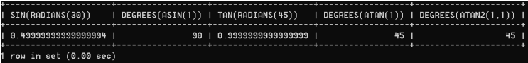

#### 2.4 指数与对数

| 函数                 | 用法                                                   |
| -------------------- | ------------------------------------------------------ |
| POW(x,y)，POWER(X,Y) | 返回x的y次方                                           |
| EXP(X)               | 返回e的X次方，其中e是一个常数，2.718281828459045       |
| LN(X)，LOG(X)        | 返回以e为底的X的对数，当X <= 0 时，返回的结果为NULL    |
| LOG10(X)             | 返回以 10 为底的X的对数，当X <= 0 时，返回的结果为NULL |
| LOG2(X)              | 返回以 2 为底的X的对数，当X <= 0 时，返回NULL          |

```
mysql> SELECT POW( 2 , 5 ),POWER( 2 , 4 ),EXP( 2 ),LN( 10 ),LOG10( 10 ),LOG2(4)
	-> FROM DUAL;
+----------+------------+------------------+-------------------+-----------+---------+
| POW( 2 , 5 ) | POWER( 2 , 4 ) | EXP( 2 ) | LN( 10 ) | LOG10( 10 ) | LOG2(4) |
+----------+------------+------------------+-------------------+-----------+---------+
| 32 | 16 | 7.38905609893065 | 2.302585092994046 | 1 | 2 |
+----------+------------+------------------+-------------------+-----------+---------+
1 row in set (0.00 sec)
```

#### 2. 5 进制间的转换

| 函数          | 用法                     |
| ------------- | ------------------------ |
| BIN(x)        | 返回x的二进制编码        |
| HEX(x)        | 返回x的十六进制编码      |
| OCT(x)        | 返回x的八进制编码        |
| CONV(x,f1,f2) | 返回f1进制数变成f2进制数 |

```
mysql> SELECT BIN( 10 ),HEX( 10 ),OCT( 10 ),CONV( 10 , 2 , 8 )
	-> FROM DUAL;
+---------+---------+---------+--------------+
| BIN( 10 ) | HEX( 10 ) | OCT( 10 ) | CONV( 10 , 2 , 8 ) |
+---------+---------+---------+--------------+
| 1010 | A | 12 | 2 |
+---------+---------+---------+--------------+
1 row in set (0.00 sec)
```

------

### 3. 字符串函数

------

| 函数                           | 用法                                                         |
| ------------------------------ | ------------------------------------------------------------ |
| ASCII(S)                       | 返回字符串S中的第一个字符的ASCII码值                         |
| CHAR_LENGTH(s)                 | 返回字符串s的字符数。作用与CHARACTER_LENGTH(s)相同           |
| LENGTH(s)                      | 返回字符串s的字节数，和字符集有关                            |
| CONCAT(s1,s2,……,sn)            | 连接s1,s2,……,sn为一个字符串                                  |
| CONCAT_WS(x,s1,s2,……,sn)       | 同CONCAT(s1,s2,…)函数，但是每个字符串之间要加上x             |
| INSERT(str,idx,len,replacestr) | 将字符串str从第idx位置开始，len个字符长的子串替换为字符串replacestr |
| REPLACE(str, a, b)             | 用字符串b替换字符串str中所有出现的字符串a                    |
| UPPER(s) 或 UCASE(s)           | 将字符串s的所有字母转成大写字母                              |
| LOWER(s) 或LCASE(s)            | 将字符串s的所有字母转成小写字母                              |
| LEFT(str,n)                    | 返回字符串str最左边的n个字符                                 |
| RIGHT(str,n)                   | 返回字符串str最右边的n个字符                                 |
| LPAD(str, len, pad)            | 用字符串pad对str最左边进行填充，直到str的长度为len个字符     |
| RPAD(str ,len, pad)            | 用字符串pad对str最右边进行填充，直到str的长度为len个字符     |
| LTRIM(s)                       | 去掉字符串s左侧的空格                                        |
| RTRIM(s)                       | 去掉字符串s右侧的空格                                        |
| TRIM(s)                        | 去掉字符串s开始与结尾的空格                                  |
| TRIM(s1 FROM s)                | 去掉字符串s开始与结尾的s                                     |
| TRIM(LEADING s FROM s)         | 去掉字符串s开始处的s                                         |
| TRIM(TRAILING s FROM s)        | 去掉字符串s结尾处的s                                         |
| REPEAT(str, n)                 | 返回str重复n次的结果                                         |
| SPACE(n)                       | 返回n个空格                                                  |
| STRCMP(s1,s2)                  | 比较字符串s1,s2的ASCII码值的大小                             |
| SUBSTR(s,index,len)            | 返回从字符串s的index位置其len个字符，作用与SUBSTRING(s,n,len)、MID(s,n,len)相同 |
| LOCATE(substr,str)             | 返回字符串substr在字符串str中首次出现的位置，作用于POSITION(substr IN str)、INSTR(str,substr)相同。未找到，返回 0 |
| ELT(m,s1,s2,…,sn)              | 返回指定位置的字符串，如果m=1，则返回s1，如果m=2，则返回s2，如果m=n，则返回sn |
| FIELD(s,s1,s2,…,sn)            | 返回字符串s在字符串列表中第一次出现的位置                    |
| FIND_IN_SET(s1,s2)             | 返回字符串s1在字符串s2中出现的位置。其中，字符串s2是一个以逗号分隔的字符串 |
| REVERSE(s)                     | 返回s反转后的字符串                                          |
| NULLIF(value1,value2)          | 比较两个字符串，如果value1与value2相等，则返回NULL，否则返回value1 |

> 注意：MySQL中，字符串的位置是从 1 开始的。

举例：

```
mysql> SELECT FIELD('mm','hello','msm','amma'),FIND_IN_SET('mm','hello,mm,amma')
	-> FROM DUAL;
+----------------------------------+-----------------------------------+
| FIELD('mm','hello','msm','amma') | FIND_IN_SET('mm','hello,mm,amma') |
+----------------------------------+-----------------------------------+
| 0 | 2 |
+----------------------------------+-----------------------------------+
1 row in set (0.00 sec)
mysql> SELECT NULLIF('mysql','mysql'),NULLIF('mysql', '');
+-------------------------+---------------------+
| NULLIF('mysql','mysql') | NULLIF('mysql', '') |
+-------------------------+---------------------+
| NULL | mysql |
+-------------------------+---------------------+
1 row in set (0.00 sec)
```

------

### 4. 日期和时间函数

------

#### 4. 1 获取日期、时间

| 函数                                                         | 用法                           |
| ------------------------------------------------------------ | ------------------------------ |
| CURDATE() ，CURRENT_DATE()                                   | 返回当前日期，只包含年、月、日 |
| CURTIME() ， CURRENT_TIME()                                  | 返回当前时间，只包含时、分、秒 |
| NOW() / SYSDATE() / CURRENT_TIMESTAMP() / LOCALTIME() / LOCALTIMESTAMP() | 返回当前系统日期和时间         |
| UTC_DATE()                                                   | 返回UTC（世界标准时间）日期    |
| UTC_TIME()                                                   | 返回UTC（世界标准时间）时间    |

举例：

```
SELECT
CURDATE(),CURTIME(),NOW(),SYSDATE()+0,UTC_DATE(),UTC_DATE()+0,UTC_TIME(),UTC_TIME()+0
FROM DUAL;
```

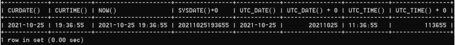

#### 4. 2 日期与时间戳的转换

| 函数                     | 用法                                                         |
| ------------------------ | ------------------------------------------------------------ |
| UNIX_TIMESTAMP()         | 以UNIX时间戳的形式返回当前时间。SELECT UNIX_TIMESTAMP() - >1634348884 |
| UNIX_TIMESTAMP(date)     | 将时间date以UNIX时间戳的形式返回。                           |
| FROM_UNIXTIME(timestamp) | 将UNIX时间戳的时间转换为普通格式的时间                       |

举例：

```
mysql> SELECT UNIX_TIMESTAMP(CURTIME());
+---------------------------+
| UNIX_TIMESTAMP(CURTIME()) |
+---------------------------+
| 1576380969 |
+---------------------------+
1 row in set (0.00 sec)

mysql> SELECT UNIX_TIMESTAMP(now());
+-----------------------+
| UNIX_TIMESTAMP(now()) |
+-----------------------+
| 1576380910 |
+-----------------------+
1 row in set (0.01 sec)

mysql> SELECT UNIX_TIMESTAMP(CURDATE());
+---------------------------+
| UNIX_TIMESTAMP(CURDATE()) |
+---------------------------+
| 1576339200 |
+---------------------------+
1 row in set (0.00 sec)

mysql> SELECT UNIX_TIMESTAMP(CURTIME());
+---------------------------+
| UNIX_TIMESTAMP(CURTIME()) |
+---------------------------+
| 1576380969 |
+---------------------------+
1 row in set (0.00 sec)

mysql> SELECT UNIX_TIMESTAMP('2011-11-11 11:11:11')
+---------------------------------------+
| UNIX_TIMESTAMP('2011-11-11 11:11:11') |
+---------------------------------------+
| 1320981071 |
+---------------------------------------+
1 row in set (0.00 sec)

mysql> SELECT FROM_UNIXTIME( 1576380910 );
+---------------------------+
| FROM_UNIXTIME( 1576380910 ) |
+---------------------------+
| 2019 - 12 - 15 11 :35:10 |
+---------------------------+
1 row in set (0.00 sec)
```

#### 4. 3 获取月份、星期、星期数、天数等函数

| 函数                                 | 用法                                           |
| ------------------------------------ | ---------------------------------------------- |
| YEAR(date) / MONTH(date) / DAY(date) | 返回具体的日期值                               |
| HOUR(time)/MINUTE(time)/SECOND(time) | 返回具体的时间值                               |
| MONTHNAME(date)                      | 返回月份：January，…                           |
| DAYNAME(date)                        | 返回星期几：MONDAY，TUESDAY…..SUNDAY           |
| WEEKDAY(date)                        | 返回周几，注意，周1是0，周2是1，…周日是6       |
| QUARTER(date)                        | 返回日期对应的季度，范围为 1 ～ 4              |
| WEEK(date) ， WEEKOFYEAR(date)       | 返回一年中的第几周                             |
| DAYOFYEAR(date)                      | 返回日期是一年中的第几天                       |
| DAYOFMONTH(date)                     | 返回日期位于所在月份的第几天                   |
| DAYOFWEEK(date)                      | 返回周几，注意：周日是 1 ，周一是 2 ，…周六是7 |

举例：

```
SELECT YEAR(CURDATE()),MONTH(CURDATE()),DAY(CURDATE()),
HOUR(CURTIME()),MINUTE(NOW()),SECOND(SYSDATE())
FROM DUAL;
```


```
SELECT MONTHNAME('2021-10-26'),DAYNAME('2021-10-26'),WEEKDAY('2021-10-26'),
QUARTER(CURDATE()),WEEK(CURDATE()),DAYOFYEAR(NOW()),
DAYOFMONTH(NOW()),DAYOFWEEK(NOW())
FROM DUAL;
```


#### 4. 4 日期的操作函数

| 函数                    | 用法                                       |
| ----------------------- | ------------------------------------------ |
| EXTRACT(type FROM date) | 返回指定日期中特定的部分，type指定返回的值 |

EXTRACT(type FROM date)函数中type的取值与含义：


```
SELECT EXTRACT(MINUTE FROM NOW()),EXTRACT( WEEK FROM NOW()),

EXTRACT( QUARTER FROM NOW()),EXTRACT( MINUTE_SECOND FROM NOW())

FROM DUAL;
```

#### 4. 5 时间和秒钟转换的函数

| 函数                 | 用法                                                         |
| -------------------- | ------------------------------------------------------------ |
| TIME_TO_SEC(time)    | 将time转化为秒并返回结果值。转化的公式为：`小时 * 3600+分钟 * 60+秒` |
| SEC_TO_TIME(seconds) | 将 seconds 描述转化为包含小时、分钟和秒的时间                |

举例：

```
mysql> SELECT TIME_TO_SEC(NOW());
+--------------------+
| TIME_TO_SEC(NOW()) |
+--------------------+
| 78774 |
+--------------------+
1 row in set (0.00 sec)
mysql> SELECT SEC_TO_TIME( 78774 );
+--------------------+
| SEC_TO_TIME( 78774 ) |
+--------------------+
| 21 :52:54 |
+--------------------+
1 row in set (0.12 sec)
```

#### 4. 6 计算日期和时间的函数

**第 1 组：**

| 函数                                                         | 用法                                           |
| ------------------------------------------------------------ | ---------------------------------------------- |
| DATE_ADD(datetime, INTERVAL expr type)，ADDDATE(date,INTERVAL expr type) | 返回与给定日期时间相差INTERVAL时间段的日期时间 |
| DATE_SUB(date,INTERVAL expr type)，SUBDATE(date,INTERVAL expr type) | 返回与date相差INTERVAL时间间隔的日期           |

上述函数中type的取值：

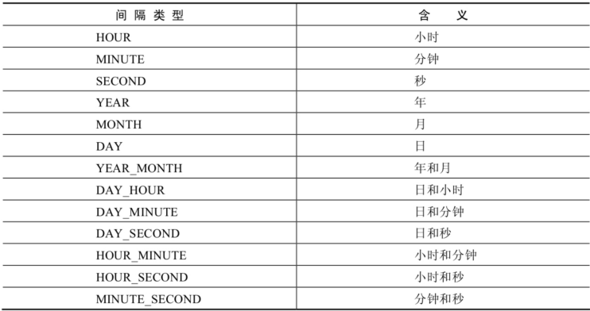

举例：

```
SELECT DATE_ADD(NOW(), INTERVAL 1 DAY) AS col1,DATE_ADD('2021-10-21 23:32:12',INTERVAL 1 SECOND) AS col2,
ADDDATE('2021-10-21 23:32:12',INTERVAL 1 SECOND) AS col3,
DATE_ADD('2021-10-21 23:32:12',INTERVAL '1_1' MINUTE_SECOND) AS col4,
DATE_ADD(NOW(), INTERVAL - 1 YEAR) AS col5, #可以是负数
DATE_ADD(NOW(), INTERVAL '1_1' YEAR_MONTH) AS col6 #需要单引号
FROM DUAL;
SELECT DATE_SUB('2021-01-21',INTERVAL 31 DAY) AS col1,
SUBDATE('2021-01-21',INTERVAL 31 DAY) AS col2,
DATE_SUB('2021-01-21 02:01:01',INTERVAL '1 1' DAY_HOUR) AS col
FROM DUAL;
```

**第 2 组：**

| 函数                         | 用法                                                         |
| ---------------------------- | ------------------------------------------------------------ |
| ADDTIME(time1,time2)         | 返回time1加上time2的时间。当time2为一个数字时，代表的是`秒`，可以为负数 |
| SUBTIME(time1,time2)         | 返回time1减去time2后的时间。当time2为一个数字时，代表的是`秒`，可以为负数 |
| DATEDIFF(date1,date2)        | 返回date1 - date2的日期间隔天数                              |
| TIMEDIFF(time1, time2)       | 返回time1 - time2的时间间隔                                  |
| FROM_DAYS(N)                 | 返回从 0000 年 1 月 1 日起，N天以后的日期                    |
| TO_DAYS(date)                | 返回日期date距离 0000 年 1 月 1 日的天数                     |
| LAST_DAY(date)               | 返回date所在月份的最后一天的日期                             |
| MAKEDATE(year,n)             | 针对给定年份与所在年份中的天数返回一个日期                   |
| MAKETIME(hour,minute,second) | 将给定的小时、分钟和秒组合成时间并返回                       |
| PERIOD_ADD(time,n)           | 返回time加上n后的时间                                        |

举例：

```
SELECT
ADDTIME(NOW(),20),SUBTIME(NOW(),30),SUBTIME(NOW(),'1:1:3'),DATEDIFF(NOW(),'2021-10-01'),
TIMEDIFF(NOW(),'2021-10-25 22:10:10'),FROM_DAYS( 366 ),TO_DAYS('0000-12-25'),
LAST_DAY(NOW()),MAKEDATE(YEAR(NOW()), 12 ),MAKETIME( 10 , 21 , 23 ),PERIOD_ADD( 20200101010101 ,10 )
FROM DUAL;
mysql> SELECT ADDTIME(NOW(), 50 );
+---------------------+
| ADDTIME(NOW(), 50 ) |
+---------------------+
| 2019 - 12 - 15 22 :17:47 |
+---------------------+
1 row in set (0.00 sec)

mysql> SELECT ADDTIME(NOW(), '1:1:1');
+-------------------------+
| ADDTIME(NOW(), '1:1:1') |
+-------------------------+
| 2019 - 12 - 15 23 :18:46 |
+-------------------------+
1 row in set (0.00 sec)
mysql> SELECT SUBTIME(NOW(), '1:1:1');
+-------------------------+
| SUBTIME(NOW(), '1:1:1') |
+-------------------------+
| 2019 - 12 - 15 21 :23:50 |
+-------------------------+
1 row in set (0.00 sec)

mysql> SELECT SUBTIME(NOW(), '-1:-1:-1');
+----------------------------+
| SUBTIME(NOW(), '-1:-1:-1') |
+----------------------------+
| 2019 - 12 - 15 22 :25:11 |
+----------------------------+
1 row in set, 1 warning (0.00 sec)
mysql> SELECT FROM_DAYS( 366 );
+----------------+
| FROM_DAYS( 366 ) |
+----------------+
| 0001 - 01 - 01 |
+----------------+
1 row in set (0.00 sec)
mysql> SELECT MAKEDATE( 2020 , 1 );
+------------------+
| MAKEDATE( 2020 , 1 ) |
+------------------+
| 2020 - 01 - 01 |
+------------------+
1 row in set (0.00 sec)

mysql> SELECT MAKEDATE( 2020 , 32 );
+-------------------+
| MAKEDATE( 2020 , 32 ) |
+-------------------+
| 2020 - 02 - 01 |
+-------------------+
1 row in set (0.00 sec)
mysql> SELECT MAKETIME( 1 , 1 , 1 );
+-----------------+
| MAKETIME( 1 , 1 , 1 ) |
+-----------------+
| 01 :01:01 |
+-----------------+
1 row in set (0.00 sec)
mysql> SELECT PERIOD_ADD( 20200101010101 , 1 );
+------------------------------+
| PERIOD_ADD( 20200101010101 , 1 ) |
+------------------------------+
| 20200101010102 |
+------------------------------+
1 row in set (0.00 sec)
mysql> SELECT TO_DAYS(NOW());
+----------------+
| TO_DAYS(NOW()) |
+----------------+
| 737773 |
+----------------+
1 row in set (0.00 sec)
```

举例：查询 7 天内的新增用户数有多少？

```
SELECT COUNT(*) as num FROM new_user WHERE TO_DAYS(NOW())-TO_DAYS(regist_time)<=7
```

#### 4. 7 日期的格式化与解析

| 函数                              | 用法                                       |
| --------------------------------- | ------------------------------------------ |
| DATE_FORMAT(date,fmt)             | 按照字符串fmt格式化日期date值              |
| TIME_FORMAT(time,fmt)             | 按照字符串fmt格式化时间time值              |
| GET_FORMAT(date_type,format_type) | 返回日期字符串的显示格式                   |
| STR_TO_DATE(str, fmt)             | 按照字符串fmt对str进行解析，解析为一个日期 |

上述`非GET_FORMAT`函数中fmt参数常用的格式符：

| 格式符 | 说明                                                     | 格式符 | 说明                                                     |
| ------ | -------------------------------------------------------- | ------ | -------------------------------------------------------- |
| %Y     | 4 位数字表示年份                                         | %y     | 表示两位数字表示年份                                     |
| %M     | 月名表示月份（January,….）                               | %m     | 两位数字表示月份（01,02,03…）                            |
| %b     | 缩写的月名（Jan.，Feb.，….）                             | %c     | 数字表示月份（1,2,3,…）                                  |
| %D     | 英文后缀表示月中的天数（1st,2nd,3rd,…）                  | %d     | 两位数字表示月中的天数(01,02…)                           |
| %e     | 数字形式表示月中的天数（1,2,3,4,5…..）                   |        |                                                          |
| %H     | 两位数字表示小数， 24 小时制（01,02..）                  | %h和%I | 两位数字表示小时， 12 小时制（01,02..）                  |
| %k     | 数字形式的小时， 24 小时制(1,2,3)                        | %l     | 数字形式表示小时， 12 小时制（1,2,3,4….）                |
| %i     | 两位数字表示分钟（00,01,02）                             | %S和%s | 两位数字表示秒(00,01,02…)                                |
| %W     | 一周中的星期名称（Sunday…）                              | %a     | 一周中的星期缩写（Sun.，Mon.,Tues.，..）                 |
| %w     | 以数字表示周中的天数(0=Sunday,1=Monday….)                |        |                                                          |
| %j     | 以 3 位数字表示年中的天数(001,002…)                      | %U     | 以数字表示年中的第几周，（1,2,3…）其中Sunday为周中第一天 |
| %u     | 以数字表示年中的第几周，（1,2,3…）其中Monday为周中第一天 |        |                                                          |
| %T     | 24 小时制                                                | %r     | 12 小时制                                                |
| %p     | AM或PM                                                   | %%     | 表示%                                                    |

GET_FORMAT函数中date_type和format_type参数取值如下：

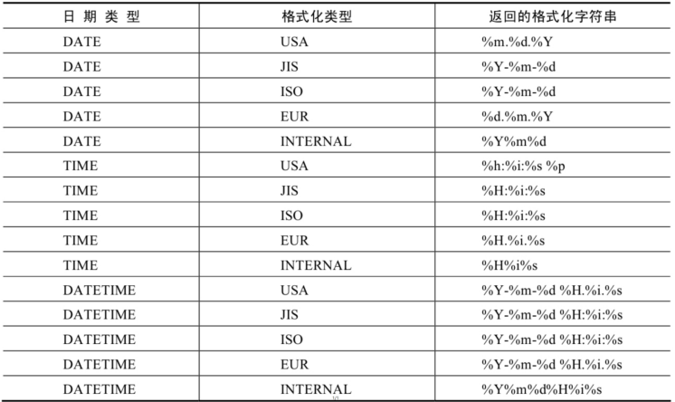

举例：

```
mysql> SELECT DATE_FORMAT(NOW(), '%H:%i:%s');
+--------------------------------+
| DATE_FORMAT(NOW(), '%H:%i:%s') |
+--------------------------------+
| 22 :57:34 |
+--------------------------------+
1 row in set (0.00 sec)
SELECT STR_TO_DATE('09/01/2009','%m/%d/%Y')
FROM DUAL;

SELECT STR_TO_DATE('20140422154706','%Y%m%d%H%i%s')
FROM DUAL;

SELECT STR_TO_DATE('2014-04-22 15:47:06','%Y-%m-%d %H:%i:%s')
FROM DUAL;
mysql> SELECT GET_FORMAT(DATE, 'USA');
+-------------------------+
| GET_FORMAT(DATE, 'USA') |
+-------------------------+
| %m.%d.%Y |
+-------------------------+
1 row in set (0.00 sec)

SELECT DATE_FORMAT(NOW(),GET_FORMAT(DATE,'USA')),
FROM DUAL;
mysql> SELECT STR_TO_DATE('2020-01-01 00:00:00','%Y-%m-%d');
+-----------------------------------------------+
| STR_TO_DATE('2020-01-01 00:00:00','%Y-%m-%d') |
+-----------------------------------------------+
| 2020 - 01 - 01 |
+-----------------------------------------------+
1 row in set, 1 warning (0.00 sec)
```

------

### 5. 流程控制函数

------

流程处理函数可以根据不同的条件，执行不同的处理流程，可以在SQL语句中实现不同的条件选择。MySQL中的流程处理函数主要包括IF()、IFNULL()和CASE()函数。

| 函数                                                         | 用法                                           |
| ------------------------------------------------------------ | ---------------------------------------------- |
| IF(value,value1,value2)                                      | 如果value的值为TRUE，返回value1，否则返回value |
| IFNULL(value1, value2)                                       | 如果value1不为NULL，返回value1，否则返回value  |
| CASE WHEN 条件1 THEN 结果1 WHEN 条件2 THEN 结果 2 …. [ELSE resultn] END | 相当于Java的if…else if…else…                   |
| CASE expr WHEN 常量值1 THEN 值1 WHEN 常量值1 THEN 值1 …. [ELSE 值n] END | 相当于Java的switch…case…                       |

```
SELECT IF( 1 > 0 ,'正确','错误')
->正确
SELECT IFNULL(null,'Hello Word')
->Hello Word
SELECT CASE
	WHEN 1 > 0
	THEN '1 > 0'
	WHEN 2 > 0
	THEN '2 > 0'
	ELSE '3 > 0'
	END
-> 1 > 0
SELECT CASE 1
	WHEN 1 THEN '我是1'
	WHEN 2 THEN '我是2'
ELSE '你是谁'
SELECT employee_id,salary, CASE WHEN salary>= 15000 THEN '高薪'
					WHEN salary>= 10000 THEN '潜力股'
					WHEN salary>= 8000 THEN '屌丝'
					ELSE '草根' END "描述"
FROM employees;
SELECT oid,`status`, CASE `status` WHEN 1 THEN '未付款'
								WHEN 2 THEN '已付款'
								WHEN 3 THEN '已发货'
								WHEN 4 THEN '确认收货'
								ELSE '无效订单' END
FROM t_order;
mysql> SELECT CASE WHEN 1 > 0 THEN 'yes' WHEN 1 <= 0 THEN 'no' ELSE 'unknown' END;
+---------------------------------------------------------------------+
| CASE WHEN 1 > 0 THEN 'yes' WHEN 1 <= 0 THEN 'no' ELSE 'unknown' END |
+---------------------------------------------------------------------+
| yes |
+---------------------------------------------------------------------+
1 row in set (0.00 sec)

mysql> SELECT CASE WHEN 1 < 0 THEN 'yes' WHEN 1 = 0 THEN 'no' ELSE 'unknown' END;
+--------------------------------------------------------------------+
| CASE WHEN 1 < 0 THEN 'yes' WHEN 1 = 0 THEN 'no' ELSE 'unknown' END |
+--------------------------------------------------------------------+
| unknown |
+--------------------------------------------------------------------+
1 row in set (0.00 sec)
mysql> SELECT CASE 1 WHEN 0 THEN 0 WHEN 1 THEN 1 ELSE - 1 END;
+------------------------------------------------+
| CASE 1 WHEN 0 THEN 0 WHEN 1 THEN 1 ELSE - 1 END |
+------------------------------------------------+
| 1 |
+------------------------------------------------+
1 row in set (0.00 sec)

mysql> SELECT CASE - 1 WHEN 0 THEN 0 WHEN 1 THEN 1 ELSE - 1 END;
+-------------------------------------------------+
| CASE - 1 WHEN 0 THEN 0 WHEN 1 THEN 1 ELSE - 1 END |
+-------------------------------------------------+
| - 1 |
+-------------------------------------------------+
1 row in set (0.00 sec)
SELECT employee_id, 12 * salary * ( 1 + IFNULL(commission_pct, 0 ))
FROM employees;
SELECT last_name, job_id, salary,
		CASE job_id WHEN 'IT_PROG' THEN 1.10*salary
			WHEN 'ST_CLERK' THEN 1.15*salary
			WHEN 'SA_REP' THEN 1.20*salary
			ELSE salary END "REVISED_SALARY"
FROM employees;
```


**练习：查询部门号为 10 , 20 , 30 的员工信息, 若部门号为 10 , 则打印其工资的 1. 1 倍, 20 号部门, 则打印其工资的 1. 2 倍, 30 号部门打印其工资的 1. 3 倍数。**

------

### 6. 加密与解密函数

------

加密与解密函数主要用于对数据库中的数据进行加密和解密处理，以防止数据被他人窃取。这些函数在保证数据库安全时非常有用。

| 函数                        | 用法                                                         |
| --------------------------- | ------------------------------------------------------------ |
| PASSWORD(str)               | 返回字符串str的加密版本， 41 位长的字符串。加密结果`不可逆`，常用于用户的密码加密 |
| MD5(str)                    | 返回字符串str的md5加密后的值，也是一种加密方式。若参数为NULL，则会返回NULL |
| SHA(str)                    | 从原明文密码str计算并返回加密后的密码字符串，当参数为NULL时，返回NULL。`SHA加密算法比MD5更加安全`。 |
| ENCODE(value,password_seed) | 返回使用password_seed作为加密密码加密value                   |
| DECODE(value,password_seed) | 返回使用password_seed作为加密密码解密value                   |

可以看到，ENCODE(value,password_seed)函数与DECODE(value,password_seed)函数互为反函数。

举例：

```
mysql> SELECT PASSWORD('mysql'), PASSWORD(NULL);
+-------------------------------------------+----------------+
| PASSWORD('mysql') | PASSWORD(NULL) |
+-------------------------------------------+----------------+
| *E74858DB86EBA20BC33D0AECAE8A8108C56B17FA | |
+-------------------------------------------+----------------+
1 row in set, 1 warning (0.00 sec)
SELECT md5('123')
-> 202 cb962ac59075b964b07152d234b
SELECT SHA('Tom123')
->c7c506980abc31cc390a2438c90861d0f1216d
mysql> SELECT ENCODE('mysql', 'mysql');
+--------------------------+
| ENCODE('mysql', 'mysql') |
+--------------------------+
| íg ¼ ìÉ |
+--------------------------+
1 row in set, 1 warning (0.01 sec)
mysql> SELECT DECODE(ENCODE('mysql','mysql'),'mysql');
+-----------------------------------------+
| DECODE(ENCODE('mysql','mysql'),'mysql') |
+-----------------------------------------+
| mysql |
+-----------------------------------------+
1 row in set, 2 warnings (0.00 sec)
```

------

### 7. MySQL信息函数

------

MySQL中内置了一些可以查询MySQL信息的函数，这些函数主要用于帮助数据库开发或运维人员更好地对数据库进行维护工作。

| 函数                                                  | 用法                                                     |
| ----------------------------------------------------- | -------------------------------------------------------- |
| VERSION()                                             | 返回当前MySQL的版本号                                    |
| CONNECTION_ID()                                       | 返回当前MySQL服务器的连接数                              |
| DATABASE()，SCHEMA()                                  | 返回MySQL命令行当前所在的数据库                          |
| USER()，CURRENT_USER()、SYSTEM_USER()，SESSION_USER() | 返回当前连接MySQL的用户名，返回结果格式为“主机名@用户名” |
| CHARSET(value)                                        | 返回字符串value自变量的字符集                            |
| COLLATION(value)                                      | 返回字符串value的比较规则                                |

举例：

```
mysql> SELECT DATABASE();
+------------+
| DATABASE() |
+------------+
| test |
+------------+
1 row in set (0.00 sec)

mysql> SELECT DATABASE();
+------------+
| DATABASE() |
+------------+
| test |
+------------+
1 row in set (0.00 sec)
mysql> SELECT USER(), CURRENT_USER(), SYSTEM_USER(),SESSION_USER();
+----------------+----------------+----------------+----------------+
| USER() | CURRENT_USER() | SYSTEM_USER() | SESSION_USER() |
+----------------+----------------+----------------+----------------+
| root@localhost | root@localhost | root@localhost | root@localhost |
+----------------+----------------+----------------+----------------+
mysql> SELECT CHARSET('ABC');
+----------------+
| CHARSET('ABC') |
+----------------+
| utf8mb4 |
+----------------+
1 row in set (0.00 sec)
mysql> SELECT COLLATION('ABC');
+--------------------+
| COLLATION('ABC') |
+--------------------+
| utf8mb4_general_ci |
+--------------------+
1 row in set (0.00 sec)
```

------

### 8. 其他函数

------

MySQL中有些函数无法对其进行具体的分类，但是这些函数在MySQL的开发和运维过程中也是不容忽视的。

| 函数                           | 用法                                                         |
| ------------------------------ | ------------------------------------------------------------ |
| FORMAT(value,n)                | 返回对数字value进行格式化后的结果数据。n表示四舍五入后保留到小数点后n位 |
| CONV(value,from,to)            | 将value的值进行不同进制之间的转换                            |
| INET_ATON(ipvalue)             | 将以点分隔的IP地址转化为一个数字                             |
| INET_NTOA(value)               | 将数字形式的IP地址转化为以点分隔的IP地址                     |
| BENCHMARK(n,expr)              | 将表达式expr重复执行n次。用于测试MySQL处理expr表达式所耗费的时间 |
| CONVERT(value USING char_code) | 将value所使用的字符编码修改为char_code                       |

举例：

```
## 如果n的值小于或者等于 0 ，则只保留整数部分
mysql> SELECT FORMAT(123.123, 2 ), FORMAT(123.523, 0 ), FORMAT(123.123, - 2 );
+--------------------+--------------------+---------------------+
| FORMAT(123.123, 2 ) | FORMAT(123.523, 0 ) | FORMAT(123.123, - 2 ) |
+--------------------+--------------------+---------------------+
| 123.12 | 124 | 123 |
+--------------------+--------------------+---------------------+
1 row in set (0.00 sec)
mysql> SELECT CONV( 16 , 10 , 2 ), CONV( 8888 , 10 , 16 ), CONV(NULL, 10 , 2 );
+-----------------+------------------+-------------------+
| CONV( 16 , 10 , 2 ) | CONV( 8888 , 10 , 16 ) | CONV(NULL, 10 , 2 ) |
+-----------------+------------------+-------------------+
| 10000 | 22 B8 | NULL |
+-----------------+------------------+-------------------+
1 row in set (0.00 sec)
mysql> SELECT INET_ATON('192.168.1.100');
+----------------------------+
| INET_ATON('192.168.1.100') |
+----------------------------+
| 3232235876 |
+----------------------------+
1 row in set (0.00 sec)

## 以“192.168.1.100”为例，计算方式为 192 乘以 256 的 3 次方，加上 168 乘以 256 的 2 次方，加上 1 乘以 256 ，再加上100 。
mysql> SELECT INET_NTOA( 3232235876 );
+-----------------------+
| INET_NTOA( 3232235876 ) |
+-----------------------+
| 192.168.1.100 |
+-----------------------+
1 row in set (0.00 sec)
mysql> SELECT BENCHMARK( 1 , MD5('mysql'));
+----------------------------+
| BENCHMARK( 1 , MD5('mysql')) |
+----------------------------+
| 0 |
+----------------------------+
1 row in set (0.00 sec)

mysql> SELECT BENCHMARK( 1000000 , MD5('mysql'));
+----------------------------------+
| BENCHMARK( 1000000 , MD5('mysql')) |
+----------------------------------+
| 0 |
+----------------------------------+
1 row in set (0.20 sec)
mysql> SELECT CHARSET('mysql'), CHARSET(CONVERT('mysql' USING 'utf8'));
+------------------+----------------------------------------+
| CHARSET('mysql') | CHARSET(CONVERT('mysql' USING 'utf8')) |
+------------------+----------------------------------------+
| utf8mb4 | utf8 |
+------------------+----------------------------------------+
1 row in set, 1 warning (0.00 sec)c
```

## 8聚合函数

我们上一章讲到了 SQL 单行函数。实际上 SQL 函数还有一类，叫做聚合（或聚集、分组）函数，它是对一组数据进行汇总的函数，输入的是一组数据的集合，输出的是单个值。

------

### 1. 聚合函数介绍

------

- **什么是聚合函数**
  聚合函数作用于一组数据，并对一组数据返回一个值。
  
- **聚合函数类型**
  - **AVG()**
  - **SUM()**
  - **MAX()**
  - **MIN()**
  - **COUNT()**
- 聚合函数语法
  
- 聚合函数不能嵌套调用。比如不能出现类似“AVG(SUM(字段名称))”形式的调用。

#### 1. 1 AVG和SUM函数

可以对**数值型数据**使用AVG 和 SUM 函数。

```
SELECT AVG(salary), MAX(salary),MIN(salary), SUM(salary)
FROM employees
WHERE job_id LIKE '%REP%';
```


#### 1. 2 MIN和MAX函数

可以对**任意数据类型**的数据使用 MIN 和 MAX 函数。

```
SELECT MIN(hire_date), MAX(hire_date)
FROM employees;
```


#### 1. 3 COUNT函数

- COUNT(*)返回表中记录总数，适用于 **任意数据类型** 。

  ```
  SELECT COUNT(*)
  FROM employees
  WHERE department_id = 50 ;
  ```

  

- COUNT(expr) 返回 **expr不为空** 的记录总数。

  ```
  SELECT COUNT(commission_pct)
  FROM employees
  WHERE department_id = 50 ;
  ```

  

- **问题：用count(\*)，count(1)，count(列名)谁好呢?**

  其实，对于MyISAM引擎的表是没有区别的。这种引擎内部有一计数器在维护着行数。

  Innodb引擎的表用count(*),count(1)直接读行数，复杂度是O(n)，因为innodb真的要去数一遍。但好于具体的count(列名)。

- **问题：能不能使用count(列名)替换count(\*)?**

  不要使用 count(列名)来替代 `count(*)`，`count(*)`是 SQL92 定义的标准统计行数的语法，跟数据库无关，跟 NULL 和非 NULL 无关。

  说明：count(*)会统计值为 NULL 的行，而 count(列名)不会统计此列为 NULL 值的行。

------

### 2. GROUP BY

------

#### 2. 1 基本使用


**可以使用GROUP BY子句将表中的数据分成若干组**

```
SELECT column, group_function(column)
FROM table
[WHERE condition]
[GROUP BY group_by_expression]
[ORDER BY column];
```

> 明确：WHERE一定放在FROM后面

**在SELECT列表中所有未包含在组函数中的列都应该包含在 GROUP BY子句中**

```
SELECT department_id, AVG(salary)
FROM employees
GROUP BY department_id ;
```


包含在 GROUP BY 子句中的列不必包含在SELECT 列表中

```
SELECT AVG(salary)
FROM employees
GROUP BY department_id ;
```


#### 2. 2 使用多个列分组


```
SELECT department_id dept_id, job_id, SUM(salary)
FROM employees
GROUP BY department_id, job_id ;
```


#### 2. 3 GROUP BY中使用WITH ROLLUP

使用`WITH ROLLUP`关键字之后，在所有查询出的分组记录之后增加一条记录，该记录计算查询出的所有记录的总和，即统计记录数量。

```
SELECT department_id,AVG(salary)
FROM employees
WHERE department_id > 80
GROUP BY department_id WITH ROLLUP;
```

> 注意：
>
> 当使用ROLLUP时，不能同时使用ORDER BY子句进行结果排序，即ROLLUP和ORDER BY是互相排斥的。

------

### 3. HAVING

------

#### 3. 1 基本使用


**过滤分组：HAVING子句**

1. 行已经被分组。
2. 使用了聚合函数。
3. 满足HAVING 子句中条件的分组将被显示。
4. HAVING 不能单独使用，必须要跟 GROUP BY 一起使用。


```
SELECT department_id, MAX(salary)
FROM employees
GROUP BY department_id
HAVING MAX(salary)> 10000 ;
```


- **非法使用聚合函数 ： 不能在 WHERE 子句中使用聚合函数。** 如下：

  ```
  SELECT department_id, AVG(salary)
  FROM employees
  WHERE AVG(salary) > 8000
  GROUP BY department_id;
  ```

  

#### 3. 2 WHERE和HAVING的对比

**区别 1 ：WHERE 可以直接使用表中的字段作为筛选条件，但不能使用分组中的计算函数作为筛选条件；HAVING 必须要与 GROUP BY 配合使用，可以把分组计算的函数和分组字段作为筛选条件。**

这决定了，在需要对数据进行分组统计的时候，HAVING 可以完成 WHERE 不能完成的任务。这是因为，在查询语法结构中，WHERE 在 GROUP BY 之前，所以无法对分组结果进行筛选。HAVING 在 GROUP BY 之后，可以使用分组字段和分组中的计算函数，对分组的结果集进行筛选，这个功能是 WHERE 无法完成的。另外，WHERE排除的记录不再包括在分组中。

**区别 2 ：如果需要通过连接从关联表中获取需要的数据，WHERE 是先筛选后连接，而 HAVING 是先连接后筛选。** 这一点，就决定了在关联查询中，WHERE 比 HAVING 更高效。因为 WHERE 可以先筛选，用一个筛选后的较小数据集和关联表进行连接，这样占用的资源比较少，执行效率也比较高。HAVING 则需要先把结果集准备好，也就是用未被筛选的数据集进行关联，然后对这个大的数据集进行筛选，这样占用的资源就比较多，执行效率也较低。

小结如下：

|        | 优点                         | 缺点                                   |
| ------ | ---------------------------- | -------------------------------------- |
| WHERE  | 先筛选数据再关联，执行效率高 | 不能使用分组中的计算函数进行筛选       |
| HAVING | 可以使用分组中的计算函数     | 在最后的结果集中进行筛选，执行效率较低 |

**开发中的选择：**

WHERE 和 HAVING 也不是互相排斥的，我们可以在一个查询里面同时使用 WHERE 和 HAVING。包含分组统计函数的条件用 HAVING，普通条件用 WHERE。这样，我们就既利用了 WHERE 条件的高效快速，又发挥了 HAVING 可以使用包含分组统计函数的查询条件的优点。当数据量特别大的时候，运行效率会有很大的差别。

------

### 4. SELECT的执行过程

------

#### 4. 1 查询的结构

```sql
#方式 1 ：
SELECT ...,....,...
FROM ...,...,....
WHERE 多表的连接条件
AND 不包含组函数的过滤条件
GROUP BY ...,...
HAVING 包含组函数的过滤条件
ORDER BY ... ASC/DESC
LIMIT ...,...

#方式 2 ：
SELECT ...,....,...
FROM ... JOIN ...
ON 多表的连接条件
JOIN ...
ON ...
WHERE 不包含组函数的过滤条件
AND/OR 不包含组函数的过滤条件
GROUP BY ...,...
HAVING 包含组函数的过滤条件
ORDER BY ... ASC/DESC
LIMIT ...,...

#其中：
#（ 1 ）from：从哪些表中筛选
#（ 2 ）on：关联多表查询时，去除笛卡尔积
#（ 3 ）where：从表中筛选的条件
#（ 4 ）group by：分组依据
#（ 5 ）having：在统计结果中再次筛选
#（ 6 ）order by：排序
#（ 7 ）limit：分页
```

#### 4. 2 SELECT执行顺序

你需要记住 SELECT 查询时的两个顺序：

1. **关键字的顺序是不能颠倒的：**

   ```
   SELECT ... FROM ... WHERE ... GROUP BY ... HAVING ... ORDER BY ... LIMIT...
   ```

2. **SELECT 语句的执行顺序** （在 MySQL 和 Oracle 中，SELECT 执行顺序基本相同）：

   ```
   FROM -> WHERE -> GROUP BY -> HAVING -> SELECT 的字段 -> DISTINCT -> ORDER BY -> LIMIT
   ```

   

   比如你写了一个 SQL 语句，那么它的关键字顺序和执行顺序是下面这样的：

   ```
   SELECT DISTINCT player_id, player_name, count(*) as num ## 顺序 5
   FROM player JOIN team ON player.team_id = team.team_id ## 顺序 1
   WHERE height > 1.80 ## 顺序 2
   GROUP BY player.team_id ## 顺序 3
   HAVING num > 2 ## 顺序 4
   ORDER BY num DESC ## 顺序 6
   LIMIT 2 ## 顺序 7
   ```

   在 SELECT 语句执行这些步骤的时候，每个步骤都会产生一个`虚拟表`，然后将这个虚拟表传入下一个步骤中作为输入。需要注意的是，这些步骤隐含在 SQL 的执行过程中，对于我们来说是不可见的。

#### 4. 3 SQL 的执行原理

SELECT 是先执行 FROM 这一步的。在这个阶段，如果是多张表联查，还会经历下面的几个步骤：

1. 首先先通过 CROSS JOIN 求笛卡尔积，相当于得到虚拟表 vt（virtual table）1-1；
2. 通过 ON 进行筛选，在虚拟表 vt1-1 的基础上进行筛选，得到虚拟表 vt1-2；
3. 添加外部行。如果我们使用的是左连接、右链接或者全连接，就会涉及到外部行，也就是在虚拟
   表 vt1-2 的基础上增加外部行，得到虚拟表 vt1-3。

当然如果我们操作的是两张以上的表，还会重复上面的步骤，直到所有表都被处理完为止。这个过程得到是我们的原始数据。

当我们拿到了查询数据表的原始数据，也就是最终的虚拟表 `vt1`，就可以在此基础上再进行 `WHERE 阶段`。在这个阶段中，会根据 vt1 表的结果进行筛选过滤，得到虚拟表 `vt2`。

然后进入第三步和第四步，也就是 `GROUP 和 HAVING 阶段`。在这个阶段中，实际上是在虚拟表 vt2 的基础上进行分组和分组过滤，得到中间的虚拟表 `vt3` 和 `vt4`。

当我们完成了条件筛选部分之后，就可以筛选表中提取的字段，也就是进入到 `SELECT 和 DISTINCT`
`阶段`。

首先在 SELECT 阶段会提取想要的字段，然后在 DISTINCT 阶段过滤掉重复的行，分别得到中间的虚拟表`vt5- 1` 和 `vt5- 2` 。

当我们提取了想要的字段数据之后，就可以按照指定的字段进行排序，也就是 `ORDER BY 阶段`，得到虚拟表 `vt6`。

最后在 vt6 的基础上，取出指定行的记录，也就是 `LIMIT 阶段`，得到最终的结果，对应的是虚拟表`vt7`。

当然我们在写 SELECT 语句的时候，不一定存在所有的关键字，相应的阶段就会省略。

同时因为 SQL 是一门类似英语的结构化查询语言，所以我们在写 SELECT 语句的时候，还要注意相应的关键字顺序， **所谓底层运行的原理，就是我们刚才讲到的执行顺序。**

## 9子查询

子查询指一个查询语句嵌套在另一个查询语句内部的查询，这个特性从MySQL 4. 1 开始引入。

SQL 中子查询的使用大大增强了 SELECT 查询的能力，因为很多时候查询需要从结果集中获取数据，或者需要从同一个表中先计算得出一个数据结果，然后与这个数据结果（可能是某个标量，也可能是某个集合）进行比较。

------

### 1. 需求分析与问题解决

------

#### 1. 1 实际问题


现有解决方式：

```sql
#方式一：
SELECT salary
FROM employees
WHERE last_name = 'Abel';

SELECT last_name,salary
FROM employees
WHERE salary > 11000 ;

#方式二：自连接
SELECT e2.last_name,e2.salary
FROM employees e1,employees e
WHERE e1.last_name = 'Abel'
AND e1.`salary` < e2.`salary`

#方式三：子查询
SELECT last_name,salary
FROM employees
WHERE salary > (
		SELECT salary
		FROM employees
		WHERE last_name = 'Abel'
		);
```


#### 1. 2 子查询的基本使用

- 子查询的基本语法结构：
  
- 子查询（内查询）在主查询之前一次执行完成。
- 子查询的结果被主查询（外查询）使用 。
- **注意事项**
  - 子查询要包含在括号内
  - 将子查询放在比较条件的右侧
  - 单行操作符对应单行子查询，多行操作符对应多行子查询

#### 1. 3 子查询的分类

**分类方式 1 ：**

我们按内查询的结果返回一条还是多条记录，将子查询分为单行子查询、多行子查询。

- 单行子查询
  
- 多行子查询
  

**分类方式 2 ：**

我们按内查询是否被执行多次，将子查询划分为相关(或关联)子查询和不相关(或非关联)子查询。

子查询从数据表中查询了数据结果，如果这个数据结果只执行一次，然后这个数据结果作为主查询的条件进行执行，那么这样的子查询叫做不相关子查询。

同样，如果子查询需要执行多次，即采用循环的方式，先从外部查询开始，每次都传入子查询进行查询，然后再将结果反馈给外部，这种嵌套的执行方式就称为相关子查询。

------

### 2. 单行子查询

------

#### 2. 1 单行比较操作符

| 操作符 | 含义                     |
| ------ | ------------------------ |
| =      | equal to                 |
| >      | greater than             |
| >=     | greater than or equal to |
| <      | less than                |
| <=     | less than or equal to    |
| <>     | not equal to             |

#### 2. 2 代码示例

**题目：查询工资大于 149 号员工工资的员工的信息**


**题目：返回job_id与 141 号员工相同，salary比 143 号员工多的员工姓名，job_id和工资**

```
SELECT last_name, job_id, salary
FROM employees
WHERE job_id =
			(SELECT job_id
			FROM employees
			WHERE employee_id = 141 )
AND salary >
			(SELECT salary
			FROM employees
			WHERE employee_id = 143 );
```

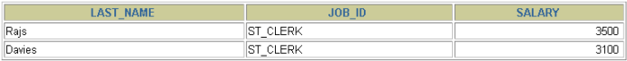

**题目：返回公司工资最少的员工的last_name,job_id和salary**

```
SELECT last_name, job_id, salary
FROM employees
WHERE salary =
			(SELECT MIN(salary)
			FROM employees);
```


**题目：查询与 141 号或 174 号员工的manager_id和department_id相同的其他员工的employee_id，manager_id，department_id**

实现方式 1 ：不成对比较

```
SELECT employee_id, manager_id, department_id
FROM employees
WHERE manager_id IN
		(SELECT manager_id
				FROM employees
				WHERE employee_id IN (174,141))
AND department_id IN
		(SELECT department_id
				FROM employees
				WHERE employee_id IN (174,141))
AND employee_id NOT IN(174,141);
```

实现方式 2 ：成对比较

```
SELECT employee_id, manager_id, department_id
FROM employees
WHERE (manager_id, department_id) IN
					(SELECT manager_id, department_id
					FROM employees
					WHERE employee_id IN (141,174))
AND employee_id NOT IN (141,174);
```

#### 2. 3 HAVING 中的子查询

- 首先执行子查询。
- 向主查询中的HAVING 子句返回结果。

**题目：查询最低工资大于 50 号部门最低工资的部门id和其最低工资**

```
SELECT department_id, MIN(salary)
FROM employees
GROUP BY department_id
HAVING MIN(salary) >
					(SELECT MIN(salary)
					FROM employees
					WHERE department_id = 50 );
```

#### 2. 4 CASE中的子查询

在CASE表达式中使用单列子查询：

**题目：显式员工的employee_id,last_name和location。其中，若员工department_id与location_id为 1800的department_id相同，则location为’Canada’，其余则为’USA’。**

```
SELECT employee_id, last_name,
		(CASE department_id
		WHEN
			(SELECT department_id FROM departments WHERE location_id = 1800)
		THEN 'Canada' ELSE 'USA' END) location
FROM employees;
```

#### 2. 5 子查询中的空值问题

```
SELECT last_name, job_id
FROM employees
WHERE job_id =
			(SELECT job_id
			FROM employees
			WHERE last_name = 'Haas');
```


> **子查询不返回任何行**

#### 2. 5 非法使用子查询

```
SELECT employee_id, last_name
FROM employees
WHERE salary =
			(SELECT MIN(salary)
			FROM employees
			GROUP BY department_id);
```


> **多行子查询使用单行比较符**

------

### 3. 多行子查询

------

- 也称为集合比较子查询
- 内查询返回多行
- 使用多行比较操作符

#### 3. 1 多行比较操作符

| 操作符 | 含义                                                         |
| ------ | ------------------------------------------------------------ |
| IN     | 等于列表中的**任意一个**                                     |
| ANY    | 需要和单行比较操作符一起使用，和子查询返回的 **某一个** 值比较 |
| ALL    | 需要和单行比较操作符一起使用，和子查询返回的 **所有** 值比较 |
| SOME   | 实际上是ANY的别名，作用相同，一般常使用ANY                   |

> 体会 ANY 和 ALL 的区别

#### 3. 2 代码示例

**题目：返回其它job_id中比job_id为‘IT_PROG’部门任一工资低的员工的员工号、姓名、job_id 以及salary**


**题目：返回其它job_id中比job_id为‘IT_PROG’部门所有工资都低的员工的员工号、姓名、job_id以及salary**

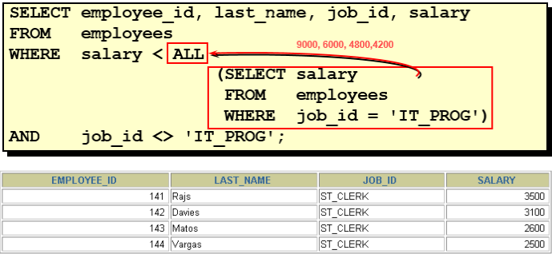

**题目：查询平均工资最低的部门id**

```
#方式 1 ：
SELECT department_id
FROM employees
GROUP BY department_id
HAVING AVG(salary) = (
			SELECT MIN(avg_sal)
			FROM (
				SELECT AVG(salary) avg_sal
				FROM employees
				GROUP BY department_id
				) dept_avg_sal
			)
#方式 2 ：
SELECT department_id
FROM employees
GROUP BY department_id
HAVING AVG(salary) <= ALL (
				SELECT AVG(salary) avg_sal
				FROM employees
				GROUP BY department_id
)
```

#### 3. 3 空值问题

```
SELECT last_name
FROM employees
WHERE employee_id NOT IN (
			SELECT manager_id
			FROM employees
			);
```


------

### 4. 相关子查询

------

#### 4. 1 相关子查询执行流程

如果子查询的执行依赖于外部查询，通常情况下都是因为子查询中的表用到了外部的表，并进行了条件关联，因此每执行一次外部查询，子查询都要重新计算一次，这样的子查询就称之为`关联子查询`。

相关子查询按照一行接一行的顺序执行，主查询的每一行都执行一次子查询。


说明： **子查询中使用主查询中的列**

#### 4. 2 代码示例

**题目：查询员工中工资大于本部门平均工资的员工的last_name,salary和其department_id**

**方式一：相关子查询**


**方式二：在 FROM 中使用子查询**

```
SELECT last_name,salary,e1.department_id
FROM employees e1,(SELECT department_id,AVG(salary) dept_avg_sal FROM employees GROUP
BY department_id) e
WHERE e1.`department_id` = e2.department_id
AND e2.dept_avg_sal < e1.`salary`;
```

> from型的子查询：子查询是作为from的一部分，子查询要用()引起来，并且要给这个子查询取别名， 把它当成一张“临时的虚拟的表”来使用。

在ORDER BY 中使用子查询：

**题目：查询员工的id,salary,按照department_name 排序**

```
SELECT employee_id,salary
FROM employees e
ORDER BY (
		SELECT department_name
		FROM departments d
		WHERE e.`department_id` = d.`department_id`
);
```

**题目：若employees表中employee_id与job_history表中employee_id相同的数目不小于 2 ，输出这些相同id的员工的employee_id,last_name和其job_id**

```
SELECT e.employee_id, last_name,e.job_id
FROM employees e
WHERE 2 <= (SELECT COUNT(*)
			FROM job_history
			WHERE employee_id = e.employee_id);
```

#### 4. 3 EXISTS 与 NOT EXISTS关键字

- 关联子查询通常也会和 EXISTS操作符一起来使用，用来检查在子查询中是否存在满足条件的行。
- **如果在子查询中不存在满足条件的行：**
  - 条件返回 FALSE
  - 继续在子查询中查找
- **如果在子查询中存在满足条件的行：**
  - 不在子查询中继续查找
  - 条件返回 TRUE
- NOT EXISTS关键字表示如果不存在某种条件，则返回TRUE，否则返回FALSE。

**题目：查询公司管理者的employee_id，last_name，job_id，department_id信息**

方式一：

```
SELECT employee_id, last_name, job_id, department_id
FROM employees e
WHERE EXISTS ( SELECT *
			FROM employees e
			WHERE e2.manager_id =
			e1.employee_id);
```

方式二：自连接

```
SELECT DISTINCT e1.employee_id, e1.last_name, e1.job_id, e1.department_id
FROM employees e1 JOIN employees e
WHERE e1.employee_id = e2.manager_id;
```

方式三：

```
SELECT employee_id,last_name,job_id,department_id
FROM employees
WHERE employee_id IN (
			SELECT DISTINCT manager_id
			FROM employees
			);
```

**题目：查询departments表中，不存在于employees表中的部门的department_id和department_name**

```
SELECT department_id, department_name
FROM departments d
WHERE NOT EXISTS (SELECT 'X'
				FROM employees
				WHERE department_id = d.department_id);
```


#### 4. 4 相关更新

```
UPDATE table1 alias
SET column = (SELECT expression
			FROM table2 alias
			WHERE alias1.column = alias2.column);
```

使用相关子查询依据一个表中的数据更新另一个表的数据。

**题目：在employees中增加一个department_name字段，数据为员工对应的部门名称**

```
## 1）
ALTER TABLE employees
ADD(department_name VARCHAR2( 14 ));

## 2）
UPDATE employees e
SET department_name = (SELECT department_name
					FROM departments d
					WHERE e.department_id = d.department_id);
```

#### 4. 4 相关删除

```
DELETE FROM table1 alias
WHERE column operator (SELECT expression
					FROM table2 alias
					WHERE alias1.column = alias2.column);
```

使用相关子查询依据一个表中的数据删除另一个表的数据。

**题目：删除表employees中，其与emp_history表皆有的数据**

```
DELETE FROM employees e
WHERE employee_id in
			(SELECT employee_id
			FROM emp_history
			WHERE employee_id = e.employee_id);
```

------

### 5. 抛一个思考题

------

**问题：** 谁的工资比Abel的高？

**解答：**

```
#方式 1 ：自连接
SELECT e2.last_name,e2.salary
FROM employees e1,employees e
WHERE e1.last_name = 'Abel'
AND e1.`salary` < e2.`salary`
#方式 2 ：子查询
SELECT last_name,salary
FROM employees
WHERE salary > (
		SELECT salary
		FROM employees
		WHERE last_name = 'Abel'
		);
```

**问题：** 以上两种方式有好坏之分吗？

**解答：** 自连接方式好！

题目中可以使用子查询，也可以使用自连接。一般情况建议你使用自连接，因为在许多 DBMS 的处理过程中，对于自连接的处理速度要比子查询快得多。

可以这样理解：子查询实际上是通过未知表进行查询后的条件判断，而自连接是通过已知的自身数据表进行条件判断，因此在大部分 DBMS 中都对自连接处理进行了优化。

## 10创建和管理表


### 1. 基础知识

------

#### 1. 1 一条数据存储的过程

`存储数据是处理数据的第一步`。只有正确地把数据存储起来，我们才能进行有效的处理和分析。否则，只能是一团乱麻，无从下手。

那么，怎样才能把用户各种经营相关的、纷繁复杂的数据，有序、高效地存储起来呢？ 在 MySQL 中，一个完整的数据存储过程总共有 4 步，分别是创建数据库、确认字段、创建数据表、插入数据。


我们要先创建一个数据库，而不是直接创建数据表呢？

因为从系统架构的层次上看，MySQL 数据库系统从大到小依次是`数据库服务器`、`数据库`、`数据表`、`数据表的行与列`。

MySQL 数据库服务器之前已经安装。所以，我们就从创建数据库开始。

#### 1. 2 标识符命名规则

- 数据库名、表名不得超过 30 个字符，变量名限制为 29 个
- 必须只能包含 A–Z, a–z, 0 – 9 , _共 63 个字符
- 数据库名、表名、字段名等对象名中间不要包含空格
- 同一个MySQL软件中，数据库不能同名；同一个库中，表不能重名；同一个表中，字段不能重名
- 必须保证你的字段没有和保留字、数据库系统或常用方法冲突。如果坚持使用，请在SQL语句中使用`（着重号）引起来
- 保持字段名和类型的一致性：在命名字段并为其指定数据类型的时候一定要保证一致性，假如数据类型在一个表里是整数，那在另一个表里可就别变成字符型了

#### 1. 3 MySQL中的数据类型

| 类型             | 类型举例                                                     |
| ---------------- | ------------------------------------------------------------ |
| 整数类型         | TINYINT、SMALLINT、MEDIUMINT、 **INT(或INTEGER)** 、BIGINT   |
| 浮点类型         | FLOAT、DOUBLE                                                |
| 定点数类型       | **DECIMAL**                                                  |
| 位类型           | BIT                                                          |
| 日期时间类型     | YEAR、TIME、 **DATE** 、DATETIME、TIMESTAMP                  |
| 文本字符串类型   | CHAR、 **VARCHAR** 、TINYTEXT、TEXT、MEDIUMTEXT、LONGTEXT    |
| 枚举类型         | ENUM                                                         |
| 集合类型         | SET                                                          |
| 二进制字符串类型 | BINARY、VARBINARY、TINYBLOB、BLOB、MEDIUMBLOB、LONGBLOB      |
| JSON类型         | JSON对象、JSON数组                                           |
| 空间数据类型     | 单值：GEOMETRY、POINT、LINESTRING、POLYGON； 集合：MULTIPOINT、MULTILINESTRING、MULTIPOLYGON、GEOMETRYCOLLECTION |

其中，常用的几类类型介绍如下：

| 数据类型      | 描述                                                         |
| ------------- | ------------------------------------------------------------ |
| INT           | 从-2^31到2^31-1的整型数据。存储大小为 4 个字节               |
| CHAR(size)    | 定长字符数据。若未指定，默认为 1 个字符，最大长度 255        |
| VARCHAR(size) | 可变长字符数据，根据字符串实际长度保存， 必须指定长度        |
| FLOAT(M,D)    | 单精度，占用 4 个字节，M=整数位+小数位，D=小数位。 D<=M<=255,0<=D<=30，默认M+D<=6 |
| DOUBLE(M,D)   | 双精度，占用 8 个字节，D<=M<=255,0<=D<=30，默认M+D<=15       |
| DECIMAL(M,D)  | 高精度小数，占用M+2个字节，D<=M<=65，0<=D<=30，最大取值范围与DOUBLE相同。 |
| DATE          | 日期型数据，格式’YYYY-MM-DD’                                 |
| BLOB          | 二进制形式的长文本数据，最大可达4G                           |
| TEXT          | 长文本数据，最大可达4G                                       |

------

### 2. 创建和管理数据库

------

#### 2. 1 创建数据库

- 方式 1 ：创建数据库

  ```
  CREATE DATABASE 数据库名;
  ```

- 方式 2 ：创建数据库并指定字符集

  ```
  CREATE DATABASE 数据库名 CHARACTER SET 字符集;
  ```

- 方式 3 ：判断数据库是否已经存在，不存在则创建数据库（推荐）

  ```
  CREATE DATABASE IF NOT EXISTS 数据库名;
  ```

如果MySQL中已经存在相关的数据库，则忽略创建语句，不再创建数据库。

> 注意：DATABASE 不能改名。一些可视化工具可以改名，它是建新库，把所有表复制到新库，再删旧库完成的。

#### 2. 2 使用数据库

- 查看当前所有的数据库

  ```
  SHOW DATABASES; #有一个S，代表多个数据库
  ```

- 查看当前正在使用的数据库

  ```
  SELECT DATABASE();  #使用的一个 mysql 中的全局函数
  ```

- 查看指定库下所有的表

  ```
  SHOW TABLES FROM 数据库名;
  ```

- 查看数据库的创建信息

  ```
  SHOW CREATE DATABASE 数据库名;
  或者：
  SHOW CREATE DATABASE 数据库名\G
  ```

- 使用/切换数据库

  ```
  USE 数据库名;
  ```

> 注意：要操作表格和数据之前必须先说明是对哪个数据库进行操作，否则就要对所有对象加上“数据库名.”。

#### 2. 3 修改数据库

- 更改数据库字符集

  ```
  ALTER DATABASE 数据库名 CHARACTER SET 字符集;  #比如：gbk、utf8等
  ```

#### 2. 4 删除数据库

- 方式 1 ：删除指定的数据库

  ```
  DROP DATABASE 数据库名;
  ```

- 方式 2 ：删除指定的数据库（`推荐`）

  ```
  DROP DATABASE IF EXISTS 数据库名;
  ```

------

### 3. 创建表

------

#### 3. 1 创建方式 1

- **必须具备：**

  - CREATE TABLE权限
  - 存储空间

- **语法格式：**

  ```
  CREATE TABLE [IF NOT EXISTS] 表名(
  字段1, 数据类型 [约束条件] [默认值],
  字段2, 数据类型 [约束条件] [默认值],
  字段3, 数据类型 [约束条件] [默认值],
  ......
  [表约束条件]
  );
  ```

> 加上了IF NOT EXISTS关键字，则表示：如果当前数据库中不存在要创建的数据表，则创建数据表；如果当前数据库中已经存在要创建的数据表，则忽略建表语句，不再创建数据表。

- **必须指定：**

  - 表名
  - 列名(或字段名)，数据类型， 长度

- **可选指定：**

  - 约束条件
  - 默认值

- 创建表举例 1 ：

  ```
  -- 创建表
  CREATE TABLE emp (
  	-- int类型
  	emp_id INT,
  	-- 最多保存 20 个中英文字符
  	emp_name VARCHAR( 20 ),
  	-- 总位数不超过 15 位
  	salary DOUBLE,
  	-- 日期类型
  	birthday DATE
  );
  ```

  ```
  DESC emp;
  ```

  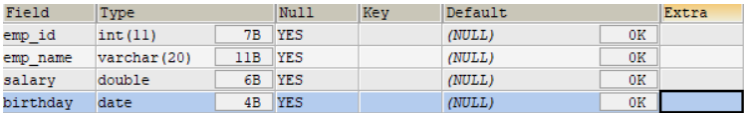

  MySQL在执行建表语句时，将id字段的类型设置为int(11)，这里的 11 实际上是int类型指定的显示宽度，默认的显示宽度为 11 。也可以在创建数据表的时候指定数据的显示宽度。

- 创建表举例 2 ：

  ```
  CREATE TABLE dept(
  -- int类型，自增
  deptno INT( 2 ) AUTO_INCREMENT,
  dname VARCHAR( 14 ),
  loc VARCHAR( 13 ),
  -- 主键
  PRIMARY KEY (deptno)
  );
  ```

  ```
  DESCRIBE dept;
  ```

  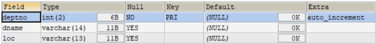

> 在MySQL 8.x版本中，不再推荐为INT类型指定显示长度，并在未来的版本中可能去掉这样的语法。

#### 3. 2 创建方式 2

- 使用 AS subquery 选项， **将创建表和插入数据结合起来**
  

- 指定的列和子查询中的列要一一对应

- 通过列名和默认值定义列

  ```
  CREATE TABLE emp1 AS SELECT * FROM employees;
  
  CREATE TABLE emp2 AS SELECT * FROM employees WHERE 1 = 2 ; -- 创建的emp2是空表
  ```

  ```
  CREATE TABLE dept
  AS
  SELECT employee_id, last_name, salary* 12 ANNSAL, hire_date
  FROM employees
  WHERE department_id = 80 ;
  ```

  ```
  DESCRIBE dept80;
  ```

  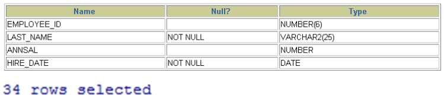

#### 3. 3 查看数据表结构

在MySQL中创建好数据表之后，可以查看数据表的结构。MySQL支持使用`DESCRIBE/DESC`语句查看数据表结构，也支持使用`SHOW CREATE TABLE`语句查看数据表结构。

语法格式如下：

```
SHOW CREATE TABLE 表名\G
```

使用SHOW CREATE TABLE语句不仅可以查看表创建时的详细语句，还可以查看存储引擎和字符编码。

------

### 4. 修改表

------

修改表指的是修改数据库中已经存在的数据表的结构。

**使用 ALTER TABLE 语句可以实现：**

- 向已有的表中添加列
- 修改现有表中的列
- 删除现有表中的列
- 重命名现有表中的列

#### 4. 1 追加一个列

语法格式如下：

```
ALTER TABLE 表名 ADD 【COLUMN】 字段名 字段类型 【FIRST|AFTER 字段名】;
```

举例：

```
ALTER TABLE dept
ADD job_id varchar( 15 );
```

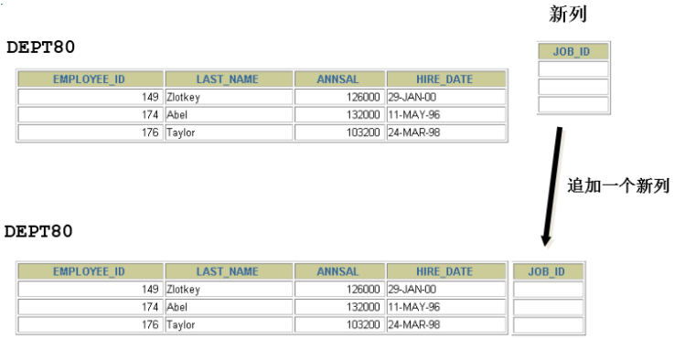

#### 4. 2 修改一个列

- 可以修改列的数据类型，长度、默认值和位置

- 修改字段数据类型、长度、默认值、位置的语法格式如下：

  ```
  ALTER TABLE 表名 MODIFY 【COLUMN】 字段名 1 字段类型 【DEFAULT 默认值】【FIRST|AFTER 字段名2】;
  ```

- 举例：

  ```
  ALTER TABLE dept
  MODIFY last_name VARCHAR( 30 );
  ```

  ```
  ALTER TABLE dept
  MODIFY salary double( 9 , 2 ) default 1000 ;
  ```

- 对默认值的修改只影响今后对表的修改

- 此外，还可以通过此种方式修改列的约束。这里暂先不讲。

#### 4. 3 重命名一个列

使用 CHANGE old_column new_column dataType子句重命名列。语法格式如下：

```
ALTER TABLE 表名 CHANGE 【column】 列名 新列名 新数据类型;
```

举例：

```
ALTER TABLE dept
CHANGE department_name dept_name varchar( 15 );
```

#### 4. 4 删除一个列

删除表中某个字段的语法格式如下：

```
ALTER TABLE 表名 DROP 【COLUMN】字段名
```

举例：

```
ALTER TABLE dept
DROP COLUMN job_id;
```

------

### 5. 重命名表

------

- 方式一：使用RENAME

  ```
  RENAME TABLE emp
  TO myemp;
  ```

- 方式二：

  ```
  ALTER table dept
  RENAME [TO] detail_dept;  -- [TO]可以省略
  ```

- 必须是对象的拥有者

------

### 6. 删除表

------

- 在MySQL中，当一张数据表`没有与其他任何数据表形成关联关系`时，可以将当前数据表直接删除。

- 数据和结构都被删除

- 所有正在运行的相关事务被提交

- 所有相关索引被删除

- 语法格式：

  ```
  DROP TABLE [IF EXISTS] 数据表1 [, 数据表2, ..., 数据表n];
  ```

  `IF EXISTS`的含义为：如果当前数据库中存在相应的数据表，则删除数据表；如果当前数据库中不存在相应的数据表，则忽略删除语句，不再执行删除数据表的操作。

- 举例：

  ```
  DROP TABLE dept80;
  ```

- DROP TABLE 语句不能回滚

------

### 7. 清空表

------

- TRUNCATE TABLE语句：

  - 删除表中所有的数据
  - 释放表的存储空间

- 举例：

  ```
  TRUNCATE TABLE detail_dept;
  ```

- TRUNCATE语句 **不能回滚** ，而使用 DELETE 语句删除数据，可以回滚

- 对比：

  ```
  SET autocommit = FALSE;
  
  DELETE FROM emp2;
  #TRUNCATE TABLE emp2;
  
  SELECT * FROM emp2;
  
  ROLLBACK;
  
  SELECT * FROM emp2;
  ```

> 阿里开发规范：
>
> 【参考】TRUNCATE TABLE 比 DELETE 速度快，且使用的系统和事务日志资源少，但 TRUNCATE 无事务且不触发 TRIGGER，有可能造成事故，故不建议在开发代码中使用此语句。
>
> 说明：TRUNCATE TABLE 在功能上与不带 WHERE 子句的 DELETE 语句相同。

------

### 8. 内容拓展

------

#### 拓展 1 ：阿里巴巴《Java开发手册》之MySQL字段命名

- 【`强制`】表名、字段名必须使用小写字母或数字，禁止出现数字开头，禁止两个下划线中间只出现数字。数据库字段名的修改代价很大，因为无法进行预发布，所以字段名称需要慎重考虑。

  - 正例：aliyun_admin，rdc_config，level3_name
  - 反例：AliyunAdmin，rdcConfig，level_3_name

- 【`强制`】禁用保留字，如 desc、range、match、delayed 等，请参考 MySQL 官方保留字。

- 【`强制`】表必备三字段：id, gmt_create, gmt_modified。

  - 说明：其中id必为主键，类型为BIGINT UNSIGNED、单表时自增、步长为1。gmt_create,gmt_modified 的类型均为 DATETIME 类型，前者现在时表示主动式创建，后者过去分词表示被动式更新

- 【`推荐`】表的命名最好是遵循 “业务名称_表的作用”。

  - 正例：alipay_task 、 force_project、 trade_config

- 【`推荐`】库名与应用名称尽量一致。

- 【参考】合适的字符存储长度，不但节约数据库表空间、节约索引存储，更重要的是提升检索速度。

  - 正例：无符号值可以避免误存负数，且扩大了表示范围。

    | 对象     | 年龄区间  | 类型               | 字节 | 表示范围                    |
    | -------- | --------- | ------------------ | ---- | --------------------------- |
    | 人       | 150岁之内 | tinyint unsigned   | 1    | 无符号值：0 到 255          |
    | 龟       | 数百岁    | smallint unnsigned | 2    | 无符号值：0 到 65535        |
    | 恐龙化石 | 数千万年  | int unsigned       | 4    | 无符号值：0 到 约43亿       |
    | 太阳     | 约50亿年  | bigint unsigned    | 8    | 无符号值：0 到 约10的19次方 |

#### 拓展 2 ：如何理解清空表、删除表等操作需谨慎？！

`表删除`操作将把表的定义和表中的数据一起删除，并且MySQL在执行删除操作时，不会有任何的确认信息提示，因此执行删除操时应当慎重。在删除表前，最好对表中的数据进行`备份`，这样当操作失误时可以对数据进行恢复，以免造成无法挽回的后果。

同样的，在使用 `ALTER TABLE` 进行表的基本修改操作时，在执行操作过程之前，也应该确保对数据进行完整的`备份`，因为数据库的改变是`无法撤销`的，如果添加了一个不需要的字段，可以将其删除；相同的，如果删除了一个需要的列，该列下面的所有数据都将会丢失。

#### 拓展 3 ：MySQL 8 新特性—DDL的原子化

在MySQL 8.0版本中，InnoDB表的DDL支持事务完整性，即`DDL操作要么成功要么回滚`。DDL操作回滚日志写入到data dictionary数据字典表mysql.innodb_ddl_log（该表是隐藏的表，通过show tables无法看到）中，用于回滚操作。通过设置参数，可将DDL操作日志打印输出到MySQL错误日志中。

分别在MySQL 5.7版本和MySQL 8.0版本中创建数据库和数据表，结果如下：

```
CREATE DATABASE mytest;

USE mytest;

CREATE TABLE book1(
book_id INT ,
book_name VARCHAR( 255 )
);

SHOW TABLES;
```

(1) 在MySQL 5.7版本中，测试步骤如下： 删除数据表book1和数据表book2，结果如下：

```
mysql> DROP TABLE book1,book2;
ERROR 1051 ( 42 S02): Unknown table 'mytest.book2'
```

再次查询数据库中的数据表名称，结果如下：

```
mysql> SHOW TABLES;
Empty set (0.00 sec)
```

从结果可以看出，虽然删除操作时报错了，但是仍然删除了数据表book1。

(2) 在MySQL 8.0版本中，测试步骤如下： 删除数据表book1和数据表book2，结果如下：

```
mysql> DROP TABLE book1,book2;
ERROR 1051 ( 42 S02): Unknown table 'mytest.book2'
```

再次查询数据库中的数据表名称，结果如下：

```
mysql> show tables;
+------------------+
| Tables_in_mytest |
+------------------+
| book1 |
+------------------+
1 row in set (0.00 sec)
```

从结果可以看出，数据表book1并没有被删除。

## 11数据处理之增删改

### 1. 插入数据

------

#### 1. 1 实际问题

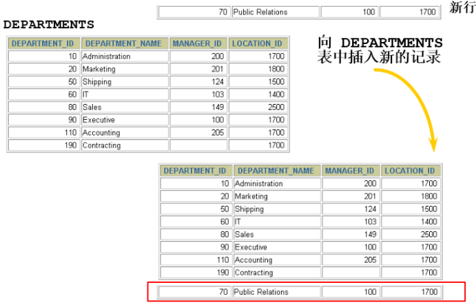

解决方式：使用 INSERT 语句向表中插入数据。

#### 1. 2 方式 1 ：VALUES的方式添加

使用这种语法一次只能向表中插入 **一条** 数据。

**情况 1 ：为表的所有字段按默认顺序插入数据**

```
INSERT INTO 表名
VALUES (value1,value2,....);
```

值列表中需要为表的每一个字段指定值，并且值的顺序必须和数据表中字段定义时的顺序相同。

举例：

```
INSERT INTO departments
VALUES ( 70 , 'Pub', 100 , 1700 );
INSERT INTO departments
VALUES ( 100 , 'Finance', NULL, NULL);
```

**情况 2 ：为表的指定字段插入数据**

```
INSERT INTO 表名(column1 [, column2, ..., columnn])
VALUES (value1 [,value2, ..., valuen]);
```

为表的指定字段插入数据，就是在INSERT语句中只向部分字段中插入值，而其他字段的值为表定义时的默认值。

在 INSERT 子句中随意列出列名，但是一旦列出，VALUES中要插入的value1,….valuen需要与column1,…columnn列一一对应。如果类型不同，将无法插入，并且MySQL会产生错误。

举例：

```
INSERT INTO departments(department_id, department_name)
VALUES ( 80 , 'IT');
```

**情况 3 ：同时插入多条记录**

INSERT语句可以同时向数据表中插入多条记录，插入时指定多个值列表，每个值列表之间用逗号分隔开，基本语法格式如下：

```
INSERT INTO table_name
VALUES
(value1 [,value2, ..., valuen]),
(value1 [,value2, ..., valuen]),
......
(value1 [,value2, ..., valuen]);
```

或者

```
INSERT INTO table_name(column1 [, column2, ..., columnn])
VALUES
(value1 [,value2, ..., valuen]),
(value1 [,value2, ..., valuen]),
......
(value1 [,value2, ..., valuen]);
```

举例：

```
mysql> INSERT INTO emp(emp_id,emp_name)
-> VALUES ( 1001 ,'shkstart'),
-> ( 1002 ,'atguigu'),
-> ( 1003 ,'Tom');
Query OK, 3 rows affected (0.00 sec)
Records: 3 Duplicates: 0 Warnings: 0
```

使用INSERT同时插入多条记录时，MySQL会返回一些在执行单行插入时没有的额外信息，这些信息的含义如下：

- Records：表明插入的记录条数。
- Duplicates：表明插入时被忽略的记录，原因可能是这些记录包含了重复的主键值。
- Warnings：表明有问题的数据值，例如发生数据类型转换。

> 一个同时插入多行记录的INSERT语句等同于多个单行插入的INSERT语句，但是多行的INSERT语句在处理过程中`效率更高`。因为MySQL执行单条INSERT语句插入多行数据比使用多条INSERT语句快，所以在插入多条记录时最好选择使用单条INSERT语句的方式插入。

**小结：**

- `VALUES`也可以写成`VALUE`，但是VALUES是标准写法。
- 字符和日期型数据应包含在单引号中。

#### 1. 3 方式 2 ：将查询结果插入到表中

INSERT还可以将SELECT语句查询的结果插入到表中，此时不需要把每一条记录的值一个一个输入，只需要使用一条INSERT语句和一条SELECT语句组成的组合语句即可快速地从一个或多个表中向一个表中插入多行。

基本语法格式如下：

```
INSERT INTO 目标表名
(tar_column1 [, tar_column2, ..., tar_columnn])
SELECT
(src_column1 [, src_column2, ..., src_columnn])
FROM 源表名
[WHERE condition]
```

- 在 INSERT 语句中加入子查询。
- **不必书写 VALUES 子句。**
- 子查询中的值列表应与 INSERT 子句中的列名对应。

举例：

```
INSERT INTO emp
SELECT *
FROM employees
WHERE department_id = 90 ;
INSERT INTO sales_reps(id, name, salary, commission_pct)
SELECT employee_id, last_name, salary, commission_pct
FROM employees
WHERE job_id LIKE '%REP%';
```

------

### 2. 更新数据

------

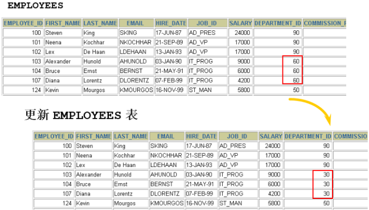

- 使用 UPDATE 语句更新数据。语法如下：

  ```sql
  UPDATE table_name
  SET column1=value1, column2=value2, ... , column=valuen
  [WHERE condition]
  ```

- 可以一次更新 **多条** 数据。

- 如果需要回滚数据，需要保证在DML前，进行设置： **SET AUTOCOMMIT = FALSE;**

- 使用 **WHERE** 子句指定需要更新的数据。

  ```
  UPDATE employees
  SET department_id = 70
  WHERE employee_id = 113 ;
  ```

- 如果省略 WHERE 子句，则表中的所有数据都将被更新。

  ```
  UPDATE copy_emp
  SET department_id = 110 ;
  ```

- 更新中的数据完整性错误

  ```
  UPDATE employees
  SET department_id = 55
  WHERE department_id = 110 ;
  ```

> 说明：不存在 55 号部门

------

### 3. 删除数据

------

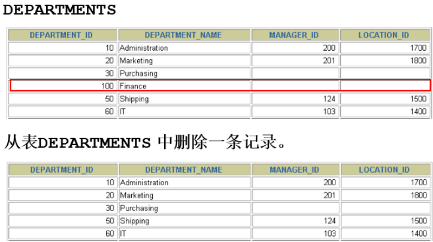

- 使用 DELETE 语句从表中删除数据

  

  ```sql
  DELETE FROM table_name [WHERE <condition>];
  ```

  table_name指定要执行删除操作的表；“[WHERE ]”为可选参数，指定删除条件，如果没有WHERE子句，DELETE语句将删除表中的所有记录。

- 使用 WHERE 子句删除指定的记录。

  ```
  DELETE FROM departments
  WHERE department_name = 'Finance';
  ```

- 如果省略 WHERE 子句，则表中的全部数据将被删除

  ```
  DELETE FROM copy_emp;
  ```

- **删除中的数据完整性错误**

  ```
  DELETE FROM departments
  WHERE department_id = 60 ;
  ```

> 说明：You cannot delete a row that contains a primary key that is used as a foreign key in another table.

------

### 4. MySQL 8 新特性：计算列

------

什么叫计算列呢？简单来说就是某一列的值是通过别的列计算得来的。例如，a列值为 1 、b列值为 2 ，c列不需要手动插入，定义a+b的结果为c的值，那么c就是计算列，是通过别的列计算得来的。

在MySQL 8.0中，CREATE TABLE 和 ALTER TABLE 中都支持增加计算列。下面以CREATE TABLE为例进行讲解。

举例：定义数据表tb1，然后定义字段id、字段a、字段b和字段c，其中字段c为计算列，用于计算a+b的值。 首先创建测试表tb1，语句如下：

```
CREATE TABLE tb1(
id INT,
a INT,
b INT,
c INT GENERATED ALWAYS AS (a + b) VIRTUAL
);
```

插入演示数据，语句如下：

```
INSERT INTO tb1(a,b) VALUES ( 100 , 200 );
```

查询数据表tb1中的数据，结果如下：

```
mysql> SELECT * FROM tb1;
+------+------+------+------+
| id | a | b | c |
+------+------+------+------+
| NULL | 100 | 200 | 300 |
+------+------+------+------+
1 row in set (0.00 sec)
```

更新数据中的数据，语句如下：

```
mysql> UPDATE tb1 SET a = 500 ;
Query OK, 0 rows affected (0.00 sec)
Rows matched: 1 Changed: 0 Warnings: 0
```

------

### 5. 综合案例

------

```
## 1、创建数据库test01_library

## 2、创建表 books，表结构如下：
```

| 字段名  | 字段说明 | 数据类型     |
| ------- | -------- | ------------ |
| id      | 书编号   | INT          |
| name    | 书名     | VARCHAR(50)  |
| authors | 作者     | VARCHAR(100) |
| price   | 价格     | FLOAT        |
| pubdate | 出版日期 | YEAR         |
| note    | 说明     | VARCHAR(100) |
| num     | 库存     | INT          |

```
## 3、向books表中插入记录

## 1）不指定字段名称，插入第一条记录
## 2）指定所有字段名称，插入第二记录
## 3）同时插入多条记录（剩下的所有记录）
```

| id   | name          | authors         | price | pubdate | note     | num  |
| ---- | ------------- | --------------- | ----- | ------- | -------- | ---- |
| 1    | Tal of AAA    | Dickes          | 23    | 1995    | novel    | 11   |
| 2    | EmmaT         | Jane lura       | 35    | 1993    | joke     | 22   |
| 3    | Story of Jane | Jane Tim        | 40    | 2001    | novel    | 0    |
| 4    | Lovey Day     | George Byron    | 20    | 2005    | novel    | 30   |
| 5    | Old land      | Honore Blade    | 30    | 2010    | law      | 0    |
| 6    | The Battle    | Upton Sara      | 30    | 1999    | medicine | 40   |
| 7    | Rose Hood     | Richard haggard | 28    | 2008    | cartoon  | 28   |

```
## 4、将小说类型(novel)的书的价格都增加 5 。
## 5、将名称为EmmaT的书的价格改为 40 ，并将说明改为drama。
## 6、删除库存为 0 的记录。
## 7、统计书名中包含a字母的书
## 8、统计书名中包含a字母的书的数量和库存总量
## 9、找出“novel”类型的书，按照价格降序排列
## 10、查询图书信息，按照库存量降序排列，如果库存量相同的按照note升序排列
## 11、按照note分类统计书的数量
## 13、查询所有图书，每页显示 5 本，显示第二页
## 14、按照note分类统计书的库存量，显示库存量最多的
## 15、查询书名达到 10 个字符的书，不包括里面的空格
## 16、查询书名和类型，其中note值为novel显示小说，law显示法律，medicine显示医药,cartoon显示卡通，joke显示笑话
## 17、查询书名、库存，其中num值超过 30 本的，显示滞销，大于 0 并低于 10 的，显示畅销，为 0 的显示需要无货
## 18、统计每一种note的库存量，并合计总量
## 19、统计每一种note的数量，并合计总量
## 20、统计库存量前三名的图书
## 21、找出最早出版的一本书
## 22、找出novel中价格最高的一本书
## 23、找出书名中字数最多的一本书，不含空格
```

答案：

```
#1、创建数据库test01_library
CREATE DATABASE IF NOT EXISTS test01_library CHARACTER SET 'utf8';

#指定使用哪个数据库
USE test01_library;

#2、创建表 books
CREATE TABLE books(
id INT,
name VARCHAR( 50 ),
`authors` VARCHAR( 100 ) ,
price FLOAT,
pubdate YEAR ,
note VARCHAR( 100 ),
num INT
);

#3、向books表中插入记录
1）不指定字段名称，插入第一条记录
INSERT INTO books
VALUES( 1 ,'Tal of AAA','Dickes', 23 , 1995 ,'novel', 11 );
2）指定所有字段名称，插入第二记录
INSERT INTO books (id,name,`authors`,price,pubdate,note,num)
VALUES( 2 ,'EmmaT','Jane lura', 35 , 1993 ,'Joke', 22 );
3）同时插入多条记录（剩下的所有记录）
INSERT INTO books (id,name,`authors`,price,pubdate,note,num) VALUES
(3 ,'Story of Jane','Jane Tim', 40 , 2001 ,'novel', 0),
(4 ,'Lovey Day','George Byron', 20 , 2005 ,'novel', 30),
(5 ,'Old land','Honore Blade', 30 , 2010 ,'Law', 0),
(6 ,'The Battle','Upton Sara', 30 , 1999 ,'medicine', 40),
(7 ,'Rose Hood','Richard haggard', 28 , 2008 ,'cartoon', 28);

## 4、将小说类型(novel)的书的价格都增加 5 。
UPDATE books SET price=price+ 5 WHERE note = 'novel';

## 5、将名称为EmmaT的书的价格改为 40 ，并将说明改为drama。
UPDATE books SET price= 40 ,note='drama' WHERE name='EmmaT';

## 6、删除库存为 0 的记录。
DELETE FROM books WHERE num= 0 ;

## 7、统计书名中包含a字母的书
SELECT * FROM books WHERE name LIKE '%a%';

## 8、统计书名中包含a字母的书的数量和库存总量
SELECT COUNT(*),SUM(num) FROM books WHERE name LIKE '%a%';

## 9、找出“novel”类型的书，按照价格降序排列
SELECT * FROM books WHERE note = 'novel' ORDER BY price DESC;

## 10、查询图书信息，按照库存量降序排列，如果库存量相同的按照note升序排列
SELECT * FROM books ORDER BY num DESC,note ASC;

## 11、按照note分类统计书的数量
SELECT note,COUNT(*) FROM books GROUP BY note;

## 12、按照note分类统计书的库存量，显示库存量超过 30 本的
SELECT note,SUM(num) FROM books GROUP BY note HAVING SUM(num)> 30 ;

## 13、查询所有图书，每页显示 5 本，显示第二页
SELECT * FROM books LIMIT 5 , 5 ;

## 14、按照note分类统计书的库存量，显示库存量最多的
SELECT note,SUM(num) sum_num FROM books GROUP BY note ORDER BY sum_num DESC LIMIT 0 , 1 ;

## 15、查询书名达到 10 个字符的书，不包括里面的空格
SELECT * FROM books WHERE CHAR_LENGTH(REPLACE(name,' ',''))>= 10 ;

/*
16 、查询书名和类型，
其中note值为 novel显示小说，law显示法律，medicine显示医药，cartoon显示卡通，joke显示笑话
*/
SELECT name AS "书名" ,note, CASE note
	WHEN 'novel' THEN '小说'
	WHEN 'law' THEN '法律'
	WHEN 'medicine' THEN '医药'
	WHEN 'cartoon' THEN '卡通'
	WHEN 'joke' THEN '笑话'
	END AS "类型"
FROM books;

## 17、查询书名、库存，其中num值超过 30 本的，显示滞销，大于 0 并低于 10 的，显示畅销，为 0 的显示需要无货
SELECT name,num,CASE
	WHEN num> 30 THEN '滞销'
	WHEN num> 0 AND num< 10 THEN '畅销'
	WHEN num= 0 THEN '无货'
	ELSE '正常'
	END AS "库存状态"
FROM books;

## 18、统计每一种note的库存量，并合计总量
SELECT IFNULL(note,'合计总库存量') AS note,SUM(num) FROM books GROUP BY note WITH ROLLUP;

## 19、统计每一种note的数量，并合计总量
SELECT IFNULL(note,'合计总数') AS note,COUNT(*) FROM books GROUP BY note WITH ROLLUP;

## 20、统计库存量前三名的图书
SELECT * FROM books ORDER BY num DESC LIMIT 0 , 3 ;

## 21、找出最早出版的一本书
SELECT * FROM books ORDER BY pubdate ASC LIMIT 0 , 1 ;

## 22、找出novel中价格最高的一本书
SELECT * FROM books WHERE note = 'novel' ORDER BY price DESC LIMIT 0 , 1 ;

## 23、找出书名中字数最多的一本书，不含空格
SELECT * FROM books ORDER BY CHAR_LENGTH(REPLACE(name,' ','')) DESC LIMIT 0 ,1;
```


## 相关链接
Bilibili尚硅谷宋红康老师老师的学习视频：[点我传送](https://www.bilibili.com/video/BV1iq4y1u7vj?spm_id_from=333.999.0.0)