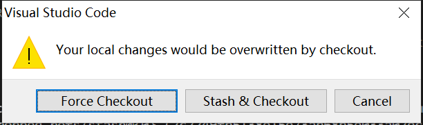
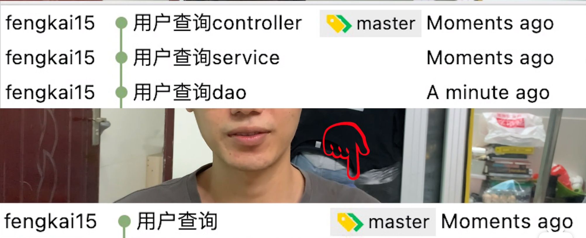
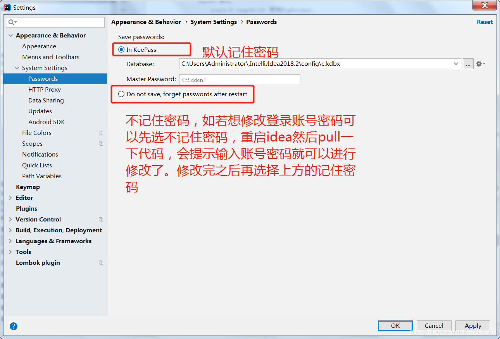
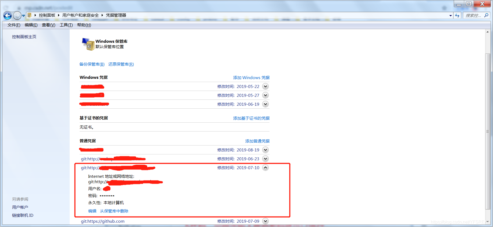

# git-me

##  git项目流程中常用命令

git克隆远程仓库代码 ：git clone xx (远程仓库地址)
克隆下来之后启动项目，按需求修改问题，完成之后准备提交代码
这时候不能直接提交push的，我们需要先 git add .
然后git commit -m "xx(需求的描述)"
再 git pull 拉取最新代码 看看是否有冲突，有冲突解决冲突合并代码，没有冲突，就可以git push 大功告成等待进一步测试

## git其它一些常用命令

查看本地分支: git branch
查看所有分支: git branch -a
切换到本地xxx分支: git checkout xxx
查看状态: git status
切换到远程xxx分支: git checkout -t origin/xxx
查看commit日志: git log


## 开发时不使用master(保存)分支

1. 开发时添加大型文件，如果在主分支添加，将很难删除其占用的空间，通过合并分支，或者删除分支，很容易办到。

## 添加大型文件请慎重

git commit之后git会保存此时所有文件，如果此时添加了不必要的大型文件，会不必要的增加文件大小。特别是master分支。

[https://git-scm.com/docs/git-checkout]: 

## Git 修改已提交的commit注释

两种情况：
 1.已经将代码push到远程仓库
 2.还没将代码push到远程仓库，还在本地的仓库中

这两种情况下的修改大体相同，只是第一种情况最后会多一步
 下面来说怎么修改

先搞清楚你要修改哪次的提交注释或者哪几次的提交注释

### 修改最后一次注释

如果你只想修改最后一次注释（就是最新的一次提交），那好办：
 `git commit --amend`
 出现有注释的界面（你的注释应该显示在第一行）， 输入`i`进入修改模式，修改好注释后，按`Esc`键 退出编辑模式，输入`:wq`保存并退出。ok，修改完成。
 例如修改时编辑界面的图：


编辑commit注释.png


### 修改之前的注释

### 修改之前的某次注释

1. 输入：
   `git rebase -i HEAD~2`
   最后的数字2指的是显示到倒数第几次  比如这个输入的2就会显示倒数的两次注释（最上面两行）

   

   显示倒数两次的commit注释.png

   

2. 你想修改哪条注释 就把哪条注释前面的`pick`换成`edit`。方法就是上面说的编辑方式：`i`---编辑，把`pick`换成`edit`---`Esc`---`:wq`.

3. 然后：（接下来的步骤Terminal会提示）
   `git commit --amend`

4. 修改注释，保存并退出后，输入：
   `git rebase --continue`

   

   提示输入的命令.png

   

其实这个原理我的理解就是先版本回退到你想修改的某次版本，然后修改当前的commit注释，然后再回到本地最新的版本

#### 修改之前的某几次注释

修改多次的注释其实步骤和上面的一样，不同点在于：

1. 同上
2. 你可以将**多个**想修改的commit注释前面的`pick`换成`edit`
3. **依次修改**你的注释（顺序是从旧到新），Terminal基本都会提示你接下来的操作，每修改一个注释都要重复上面的3和4步，直到修改完你所选择的所有注释

### 已经将代码push到远程仓库

首先，你把最新的版本从远程仓库先pull下来，修改的方法都如上，最后修改完成后，强制push到远程仓库：
 `git push --force origin master`
 **注：很重要的一点是，你最好保证在你强制push之前没有人提交代码，如果在你push之前有人提交了新的代码到远程仓库，然后你又强制push，那么会被你的强制更新覆盖！！！**

最后，可以检查一下远程的提交记录~~


[参考链接](https://www.jianshu.com/p/098d85a58bf1)

## github

[Github 网页上 更新 Fork别人的 Repository](https://blog.csdn.net/huutu/article/details/51018317)

github查看代码方式：

**github.com改成github1s.com**

/github1s.com/codeOflI/JudgeServer/blob/HEAD/src/main/java/com/yoj/judge_server/aspect/JudgePermitAspect.java

## git cherry-pick 教程

http://www.ruanyifeng.com/blog/2020/04/git-cherry-pick.html

## 使用git stash命令保存和恢复进度

我们有时会遇到这样的情况，正在dev分支开发新功能，做到一半时有人过来反馈一个bug，让马上解决，但是新功能做到了一半你又不想提交，这时就**可以使用git stash命令先把当前进度保存起来**，然后切换到另一个分支去修改bug，修改完提交后，再切回dev分支，使**用git stash pop来恢复之前的进度继续开发新功能**。下面来看一下git stash命令的常见用法

原文链接：https://blog.csdn.net/daguanjia11/article/details/73810577

## git 文件及文件加大小写不识别的解决方案

项目更改了文件名提交到git 仓库结果文件并没有得到跟踪的情况，在你独立开发的时候这个问题是可以被忽略的，但是如果你是，要部署到服务器的时候问题立马就暴露出来了
例子：修改某文件的某个字母 大小写后 git上传到仓库时，并没有跟踪的情况


1.git查看是否忽略了大小写
true:忽略了大小写 fasle:未忽略大小写
```
git config --get core.ignorecase 
```
得到的结果是false 说明我本地已经配置了 区分大小写了，如果 窗口提示为true执行下列代码
```
git config core.ignorecase false 
```
##### 解决方案如下：

1. 用`git`执行下列命令：

```ruby
$ git config core.ignorecase false
```

解释：设置本地`git`环境识别大小写

1. 修改文件夹名称，全部改为小写（F2重命名修改即可），然后`push`到远程仓库。
    这时如我前面的图片所示，仓库上就会有重名的文件(文件夹)了。
2. 删除多余的文件，我这里就是把`Footer`,`Header`,`Menu`等给删掉。
    a).  执行命令，删除远程文件（删除文件夹里面的文件，文件夹也会消失）

```ruby
# 删除Header文件夹下的所有文件
$ git rm --cached src/components/Header -r
# 删除Footer文件夹下的所有文件
$ git rm --cached src/components/Footer -r
# 删除Menu文件夹下的所有文件
$ git rm --cached src/components/Menu -r
```

如果显示如下，说明操作成功：

```bash
rm 'src/components/Menu/Header.js'
rm 'src/components/Menu/Header.less'
...
```

b). 同步，提交到远程仓库

```ruby
# 添加在缓存
$ git add .
# 提交到本地
$ git commit -m'rm files'
# 提交到远程仓库 origin
& git push origin master
```


链接：https://www.jianshu.com/p/420d38913578

## 怎么撤销 git commit 提交的代码

## 问题

比如：我在项目里面添加了一个新的组件 gitTest.vue，

写完之后，我就提交代码：

```
git add .
git commit -m '提交git测试组件'
```


### git reset 命令

[菜鸟教程：git reset 命令](https://www.runoob.com/git/git-reset.html)

git reset 命令用于回退版本，可以指定退回某一次提交的版本。

git reset 命令语法格式如下：

```
git reset [--soft | --mixed | --hard] [HEAD]
```

1

- -mixed 为默认，可以不用带该参数，用于重置暂存区的文件与上一次的提交(commit)保持一致，工作区文件内容保持不变。
  **不删除工作空间改动代码，撤销 commit，并且撤销 `git add .` 操作,回退到未提交git add .的工作区状态**
  git reset --mixed HEAD^ 和 `git reset HEAD^` 效果是一样的
- –soft 参数用于回退到某个版本
  不删除工作空间改动代码，撤销 commit，不撤销 git add .
- –hard 参数撤销工作区中所有未提交的修改内容，将暂存区与工作区都回到上一次版本，并删除之前的所有信息提交
  删除工作空间改动代码，撤销 commit，撤销 git add .
  实例：

$ git reset HEAD^            		# 回退所有内容到上一个版本  
$ git reset HEAD^ hello.php  		# 回退 hello.php 文件的版本到上一个版本  
$ git reset 052e             		# 回退到指定版本
$ git reset --soft HEAD~3    		# 回退上上上一个版本
$ git reset --hard HEAD~3     		# 回退上上上一个版本  
$ git reset --hard bae128          	# 回退到某个版本回退点之前的所有信息。 
$ git reset --hard origin/master  	# 将本地的状态回退到和远程的一样 
1
2
3
4
5
6
7
注意：谨慎使用 –hard 参数，它会删除回退点之前的所有信息。

HEAD 说明：

HEAD 表示当前版本
HEAD^ 上一个版本
HEAD^^ 上上一个版本
HEAD^^^ 上上上一个版本
可以使用 ～数字表示

HEAD~0 表示当前版本
HEAD~1 上一个版本
HEAD~2 上上一个版本
HEAD~3 上上上一个版本
解决
执行完commit后，想撤回commit，怎么办？

通过上面的 git reset 命令学习，可以知道：使用下面的命令

# 回退上一个版本，然后需要删掉代码
git reset --hard HEAD~1
1
2
执行完我们发现已经回退到了提交前的状态

可以输入查看日志命令：

git log --oneline -10
1

拓展
推荐阅读：Git 工具 - 重置揭密
————————————————
版权声明：本文为CSDN博主「凯小默」的原创文章，遵循CC 4.0 BY-SA版权协议，转载请附上原文出处链接及本声明。
原文链接：https://blog.csdn.net/kaimo313/article/details/118578629

# git切换分支时，如何保存当前分支的修改(暂时不想提交

### git切换分支时，如何保存当前分支的修改(暂时不想提交)

下面是我自己的理解

暂且将<u>当前分支称为a分支，即将切换的分支称为b分支</u>

1. 若a分支修改一半，并不着急提交，且需要到b分支上修改开发时，我们可以选择git stash ，git pull 将a分支的修改暂存到堆栈区中，然后切换到b分支进行开发，然后切换到a分支继续开发，释放堆栈中的保存的文件有以下两种

   1. git stash pop 这种方法是直接将堆栈中的文件释放出来，并且删除堆栈中的文件

   2. git stash apply 这种方法是将堆栈中的东西恢复出来，但是堆栈中还保留，这种方法比较保守，但同时也比较安全。

      > git stash pop和git stash apply 使用哪一种比较好呢？视情况而定
      >
      > 直接使用git stash pop 属于简单粗暴，也不是不可以，大部分情况下都没事，但是如果你从b分支重新切换到a分支，在这期间，有人在a分支上更新并提交了代码并且包含你git stash 中的文件时，这个时候你再git stash pop 的时候就会很麻烦，会报错产生冲突，会让你开始合并区分，因为释放的文件是根据之前的版本修改的
      >
      > 这个时候听着就很头疼，也很棘手，怎么办呢？就解决冲突呗~~
      >
      > 还有个区别就是git stash list查看一下当前堆栈当中已经有的记录
      >
      > git stash pop 默认的是应用的栈顶的记录，也就是 stash@{0}
      >
      > git stash apply 可以自由选择我们想要应用的记录stash@{0}，stash@{1}，stash@{2}........

2. 如果a分支修改的文件，b分支上也有**且两个分支的文件源码是一样的**

   ，是可以顺利切换过去的，不管是在工作树还是暂存区的直接切换过去都不会报错。

   注：这里的文件一样指的不仅仅是文件名而是包括文件里的内容，如两个分支中都有home.vue文件，若里面的代码不一样那么切换的时候也会报错

3. 若a分支修改的文件在b分支上没有，就会有以下提示
   

若你继续选择（强制）切换分支，那么就会丢弃你本地所有修改的分支。

1. 若a分支修改的多个文件，b分支有的有，有的没有，那么切换分支的时候也会有这样的提示，如果继续checkout，那么a分支上的所有修改也将会都被丢弃。

> git stash：备份当前工作区内容，从最近的一次提交中读取相关内容，让工作区保证和上次提交的内容一致。同时，将当前工作区内容保存到Git栈中
> git pull：拉取服务器上当前分支代码
> git stash pop：从Git栈中读取最近一次保存的内容，恢复工作区相关内容。同时，用户可能进行多次stash操作，需要保证后stash的最先被取到，所以用栈（先进后出）来管理；pop取栈顶的内容并恢复
> git stash list：显示Git栈内的所有备份，可以利用这个列表来决定从那个地方恢复。
> git stash clear：清空Git栈

参考链接：https://www.cnblogs.com/wszzj/p/16175740.html

# git常用命令

## 合并提交几个commit为一个

```
git rebase -i
```




### 把一个代码的提交信息合并到另一个分支里面去

```
git cherry -pick
```

### 补充提交-git commit 少提交了一个文件

```
git commit --amend
```

# git修改登录账号密码

1.修改Idea中的账号密码配置



2.如若上方不生效可以选择修改控制面板中的配置（找到对应的git仓库）



 

# git 常见冲突解决

总结：**自己git stash用的比较多一点**

—— git pull遇到报错Your local changes to the following files would be overwritten by merge

## 1 场景

在进行代码开发时，忘了先git pull到本地之后，直接在台式机上的代码进行编写，突然想起忘了pull了，然后想用git pull来更新本地代码。结果报错：

```
error: Your local changes to the following files would be overwritten by merge: xxx/xxx/xxx.xx Please, commit your changes or stash them before you can merge. Aborting
```

## 2 报错分析

出现这个问题的原因是其他人修改了项目中的代码文件xxx并提交到远程版本库中去了，而你本地也修改了改代码文件xxx，这时候你进行git pull操作就好出现冲突了，上面报错的意思是我台式机上新修改的代码的文件，将会被git服务器上的代码覆盖，我们当然不想刚刚写的代码被覆盖掉，那么我们应该如何解决呢。

## 3 解决方案：

在报错中我们看到官方推荐的解决方案是使用直接commit或者**使用stash**。那么我们来看看这两种操作方式的区别和使用：

### 3.1 方案一：使用stash

**保留本地的方式修改**（强烈推荐，还有一种是直接拉取服务器的（不推荐使用就不写了），这样你本地修改的代码的，就会舍弃，相当于你写的代码直接没，你还的重新写）。
主要方式如下：
  通过**git stash**将**工作区恢复到上次提交的内容，同时备份并暂时隐藏本地所做的修改**，之后就可以正常git pull了，git pull完成后，执行**git stash pop**将之前**本地做的修改隐藏的应用拉取到当前工作区**。
**stash翻译为“隐藏”**，如下操作：

```
git stash
git pull
git stash pop
```


`git stash`: **备份当前的工作区**的内容，从**最近的一次提交中读取相关内容**，让工作区保证和上次提交的内容一致。同时，将当前的工作区内容保存到Git栈中。
`git stash pop`: 从**Git栈中读取最近一次保存的内容**，恢复工作区的相关内容。由于可能存在多个Stash的内容，所以用栈来管理，**pop会从最近的一个stash**中读取内容并恢复。
git stash list: 显示**Git栈内的所有备份**，可以利用这个列表来决定从那个地方恢复。
git stash clear: **清空Git栈**。此时使用gitk等图形化工具会发现，原来stash的哪些节点都消失了。
3.2 方案二：硬覆盖（谨慎使用，使用前先备份当前代码!!!）：
放弃本地修改，只保留服务器端代码，则直接回退到上一个版本，再进行pull：

```
git reset --hard
git pull origin master
```


注：其中origin master表示git的主分支。

## 4 Git冲突解决方法实际应用场景

### 4.1 硬覆盖应用

忽略本地修改，强制拉取远程到本地，硬覆盖是一种比较通用的方式吗，但是不建议使用，如果使用需要先将修改在本地做好备份，否则本得改变将丢失。
主要是项目中的文档目录，看的时候可能多了些标注，现在远程文档更新，本地的版本已无用，可以强拉

```
git fetch --all

git reset --hard origin/dev

git pull
```


## 4.2 commit和pull的先后顺序造成的冲突的情况

**关于commit和pull的先后顺序**，commit >> pull >> push 和 pull >> commit >> push的顺序，两种情况都遇到过代码冲突。解决方法如下：

### 4.2.1 未commit先pull（pull >> commit >> push）

**未commit先pull，视本地修改量选择revert或stash**

**场景:**
同事 有新提交
我 没有pull -> 修改了文件 -> pull -> 提示有冲突

#### 4.2.1.1 本地修改量小

如果本地修改量小，例如只修改了一行，可以按照以下流程:

 git revert(把自己的代码取消) >> git pull >> 在最新代码上修改 >> [pull确认最新] >> commit&push

#### 4.2.1.2 本地修改量大

本地修改量大，冲突较多,有两种方式处理:

##### 第一种：

stash save(把自己的代码隐藏存起来) >> 重新pull -> stash pop(把存起来的隐藏的代码取回来 ) >> 代码文件会显示冲突 >> 右键选择edit conficts，解决后点击编辑页面的 mark as resolved >>  commit&push


##### 第二种：

stash save(把自己的代码隐藏存起来) >> 重新pull >> stash pop(把存起来的隐藏的代码取回来 ) >> 代码文件会显示冲突 >> 右键选择resolve conflict >> 打开文件解决冲突 ->commit&push
1

##### 4.2.2 已commit未push(commit >> pull >> push)

已commit未push，视本地修改量选择reset或直接merge。

场景：
同事 有新提交
我 没有pull >> 修改了文件 >> commit >> pull >> 提示有冲突

##### 4.2.2.1 修改量小

修改量小，直接回退到未提交的版本（可选择是否保存本地修改）
如果本地修改量小，例如只修改了一行，可以按照以下流程

reset(回退到未修改之前，选hard模式，把自己的更改取消) >> 重新pull >> 在最新代码上修改 >> [pull确认最新] >> commit&push
1
ps：实际上完全可以采取直接merge的方法，这里主要是根据尽量避免merge的原则，提供一种思路

##### 4.2.2.2 修改量大

修改量大，直接merge，再提交（目前常用）

```
commit后pull显示冲突 >> 手动merge解决冲突 >> 重新commit >> push
```


————————————————

原文链接：https://blog.csdn.net/qq_41018861/article/details/118442711