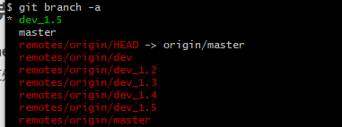
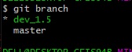

[TOC]

特点：

分布式版本控制系统
优势：
	SVN在开发过程中必须保证需要与SVN服务器连接才能使用，需要联网

[git官方文档](https://git-scm.com/docs/git-checkout)

[git book](https://git-scm.com/book/zh/v2)

# git安装

## Git安装教程（2.30.1详细教程）

https://www.cnblogs.com/hdlan/p/14395189.html

# 基础操作

## 1、设置全局信息

```shell
设置开发者的用户名
	git config --global user.name mzli
设置开发者邮箱
	git config --global user.email nicolaslee5@foxmail.com
取得全部的全局信息
	git config --list
	git config -l
```

## 2、创建仓库

1、创建目录当做仓库目录
2、进入目录中配置
将目录变为仓库目录，需要进入目录中配置
3、初始化仓库
方法一：创建一个包含有配置信息目录的仓库文件夹

```shell
git init
Initialized empty Git repository in E:/gitpro/.git/
```

## 文件区域

git分为3个文件区域

工作区——暂存区——版本库

1. **工作区**
   用户编写代码的文件夹
   所有的文件操作以工作区为主
   GIT仓库

2.  **暂存库**
   只是将工作中的未保存文件保存到暂存区中，有GIT维护；
   保存的内容是暂时需要的

3. **Git 目录（版本库Master）**

   真正发布的代码
   
   git stage
   
   
   
   

# 仓库基本操作

1、观察仓库的状态

```shell
git status
```

2、将文件添加到git暂存区

```shell
git add 文件名称
```

4、批量添加新文件到暂存区

```shell
git add .
```

添加所有在仓库目录中创建的新文件到暂存区

3、将文件提交到版本库中

```shell
git commit -m "注释信息Comment"
```

现在才表示将新的文件提交到了GIT之中进行管理（这个代码才能被项目使用）
**自动增加并提交修改到版本库中**

只要在提交的时候，给 git commit 加上 -a 选项，Git 就会自动把所有已经跟踪过的文件暂存
起来一并提交，从而跳过 git add 步骤：

```shell
git commit -a -m "注释Comment"
```

4、修改仓库文件


​	查看修改历史

```shell
git log 文件名
git log
```

​		每次提交时都会自动生成一个Commit ID（在日后版本恢复中使用）

### 比较同一文件

```shell
git diff
git diff 文件名
```

比对暂存区和工作区中readme.txt文件的差异

### 版本穿越

​	查看日志信息

```shell
git log
git log --pretty=oneline
```

简化查看
可以按q结束查看
整个日志记录是用栈来记录的
master库存在head指针
回退到上一个版本

```shell
git reset --hard head~1
```

查看所有删除的日志

```shell
git reflog
```

​	到指定版本

```shell
git reset --hard 1fc9d3f（Commit id）
```

### 撤销修改

#### 撤销add操作——暂存区到工作区


如果您已经使用 `git add` 命令将文件添加到 Git 暂存区，但是希望撤销添加操作，您可以使用以下命令将文件从暂存区中移除：

```shell
git reset <file>
```

其中，`<file>` 是您想要撤销添加操作的文件名或文件路径。

如果您想要**撤销所有已添加到暂存区的文件**，可以使用以下命令：

```
git reset
```

这将移除所有已添加到暂存区的文件。请注意，这不会影响您已经提交的文件，只会将它们从暂存区中移除。


#### 撤销工作区修改——还原文件的所有更改

**撤销对某个文件的修改，而不是撤销添加操作**，可以使用以下命令：

```
luaCopy code
git checkout -- <file>
```

这将**还原指定文件的最新提交版本，并覆盖暂存区和工作目录中的任何更改**。请注意，这将永久删除您在该文件上进行的所有未提交更改。

显示那些文件发生了改变

```shell
git checkout
```

恢复单个文件

```shell
git checkout 文件名
```

恢复多个文件

```shell
git checkout .
```

#### 修改已在暂存区

将暂存区的文件撤回到工作区

```shell
git reset HEAD <file>...
```

**将暂存区的文件撤回到工作区 :`.`-多个文件**

```
git reset HEAD .
```

文件删除

```shell
del 文件名
```

删除工作区中的文件
恢复

```shell
git checkout -- 文件名
```

​			因为版本库中任存在，可以直接删除
​	git commit -a -m "Commet"
​		提交之后，库中相应的文件也没有了
​		只能通过版本穿越恢复


远程仓库：GITHUB ...

[git-book:github章节](https://git-scm.com/book/zh/v2/GitHub-账户的创建和配置)

## 移除文件

`git rm` 

要从 Git 中移除某个文件，就必须要从已跟踪文件清单中移除（确切地说，是从暂存区域移除），然后提交。可以用 `git rm` 命令完成此项工作，并连带从工作目录中删除指定的文件，这样以后就不会出现在未跟踪文件清单中了。

git rm 命令后面可以列出文件或者目录的名字，**也可以使用 glob 模式**。比如：

```
$ git rm log/\*.log
```

注意到星号 * 之前的反斜杠 \， 因为 Git 有它自己的文件模式扩展匹配方式，所以我们不用 shell 来帮忙展开。
此命令删除 log/ 目录下扩展名为 .log 的所有文件。 类似的比如：

```
$ git rm \*~
```

该命令会删除所有名字以 ~ 结尾的文件。

该命令会删除所有名字以 ~ 结尾的文件。

注意到星号 * 之前的反斜杠 \， 因为 Git 有它自己的文件模式扩展匹配方式，所以我们不用 shell 来帮忙展开。
此命令删除 log/ 目录下扩展名为 .log 的所有文件。 类似的比如：

```
$ git rm \*~
```

该命令会删除所有名字以 ~ 结尾的文件。

该命令会删除所有名字以 ~ 结尾的文件。

# 远程仓库的使用

[git-book:Git-基础-远程仓库的使用](https://git-scm.com/book/zh/v2/Git-基础-远程仓库的使用)

## 配置远程仓库

### Git配置SSH

ssh通信模式

1. 启动git bash输入下列命令-生成ssh key密钥

在此之中可以使用linux命令

```sh
 ssh-keygen -t rsa -C "1162314270@qq.com"
```

命令输入后，首先询问用户密钥的保存位置
	默认为公钥和私钥保存在：`用户/xxx/.ssh/id_rsa.pub`
	然后询问是否设置保护密码

2、将公钥内容保存到GITHUB
		打开github的setting页面添加ssh key

​		id_rsa.pub

公钥文件，保存在外部使用**==(保存到github的ssh密匙中)==**

​		id_rsa

私钥文件，做本机标识


​		

将公钥内容复制到key内容中

```
ssh-rsa AAAAB3NzaC1yc2EAAAAxxxxxxxxxxxxxxxxxxxxxxxxxxxecsbj2eVTZoHuCkW5GxxupV9jSbj/MePZPHHhhdH lmz
```


```
C:\Users\11623>ssh-keygen -t rsa -C "lmz"
Generating public/private rsa key pair.
Enter file in which to save the key (C:\Users\11623/.ssh/id_rsa):
C:\Users\11623/.ssh/id_rsa already exists.
Overwrite (y/n)? y
Enter passphrase (empty for no passphrase):
Enter same passphrase again:
Your identification has been saved in C:\Users\11623/.ssh/id_rsa.
Your public key has been saved in C:\Users\11623/.ssh/id_rsa.pub.
The key fingerprint is:
SHA256:722mRw92N2R2fb71Yr3tBEgSQORYxzzzF6n4xRkh7Mk lmz
The key's randomart image is:
+---[RSA 2048]----+
|       o=+o.. .o |
|       + .=...+  |
|      . . .B.+ +.|
|          .oE.=++|
|        S  ..o=.o|
|         .  = .o+|
|          .o + o*|
|         . .+ +o+|
|          o=.. ++|
+----[SHA256]-----+

```

4、在github上建立远程仓库信息
	不选择：Initialize this repository with a README
	创建仓库后界面上就给出了仓库的访问地址
	SSH，有了SSH key直接连接
		https://github.com/NicolasCoder/rep.git
	HRRPS,所有人都可以连接
		https://github.com/NicolasCoder/rep.git
删除github仓库
	仓库的setting

### problem

**github每次push都要密码**

原因是使用了https方式 push 
这种方式产生的原因，一般是我们clone是一定是使用了http的方式 
例如我们在github上创建了一个项目，然后我们clone到本地时使用了http而非git (ssh)

```cmd
git remote rm origin
git remote add origin git@github.com:codeOflI/MyDouban.git
```


### 查看远程仓库

```shell
git remote [-v]
```

选项 `-v`，会显示需要读写远程仓库使用的 Git 保存的简写与其对应的 URL。

### 添加远程仓库

`git remote add <shortname> <url>` 添加一个新的远程 Git 仓库

```shell
git remote add origin https://github.com/codeOflI/rep.git
```

### 从远程仓库中抓取与拉取

这个命令会访问远程仓库，从中拉取所有你还没有的数据。

```console
git fetch [remote-name]
```

如果你使用 `clone` 命令克隆了一个仓库，命令会自动将其添加为远程仓库并默认以 “origin” 为简写。 所以，`git fetch origin` 会抓取克隆（或上一次抓取）后新推送的所有工作。 必须注意 `git fetch` 命令会将数据拉取到你的本地仓库——它并不会自动合并或修改你当前的工作。 当准备好时你必须手动将其合并入你的工作。

如果你有一个分支设置为跟踪一个远程分支（阅读下一节与 [Git 分支](https://git-scm.com/book/zh/v2/ch00/ch03-git-branching) 了解更多信息），可以使用 `git pull` 命令来自动的抓取然后合并远程分支到当前分支。 这对你来说可能是一个更简单或更舒服的工作流程；默认情况下，`git clone` 命令会自动设置本地 master 分支跟踪克隆的远程仓库的 master 分支（或不管是什么名字的默认分支）。 运行 `git pull` 通常会从最初克隆的服务器上抓取数据并自动尝试合并到当前所在的分支。

### 推送到远程仓库

`git push [remote-name] [branch-name]`。 当你想要将 master 分支推送到 `origin` 服务器时

```shell
git push origin master
```

常用参数

- `-f, --force `:  force updates,**请谨慎使用，会强制将远程仓库内容更新为本地。**

### 设置git push和pull的默认分支

设置git push和git pull的默认分支：

```
git branch --set-upstream-to=origin/<远程分支> <本地分支>
```


		更为简洁的方式是在push时，使用-u参数

更为简洁的方式是在push时，使用-u参数

```
git push -u origin <远程分支>
```

-u参数会在push的同时会指定当前分支的默认上游分支；

### 查看某个远程仓库

使用 `git remote show [remote-name]` 命令

可以通过 `git remote show` 看到更多的信息。

### 远程仓库的移除与重命名

如果想要重命名引用的名字可以运行 `git remote rename` 去修改一个远程仓库的简写名。 例如，想要将 `pb` 重命名为 `paul`，可以用 `git remote rename` 这样做：

```console
$ git remote rename pb paul
$ git remote
origin
paul
```

 移除一个远程仓库——你已经从服务器上搬走了或不再想使用某一个特定的镜像了，又或者某一个贡献者不再贡献了——可以使用 `git remote rm` ：

```console
$ git remote rm paul
$ git remote
origin
```

## 远程推送

一般开发分支和master分支都在服务器上

```shell
git push -u origin 分支名
```

删除分支

```shell
git branch -d 分支名
```

删除远程分支

```shell
git push origin --delete 分支名
```

推送空的分支

```shell
git push origin:dev
```

## 

## 打标签

Git 可以给历史中的某一个提交打上标签，以示重要。比较有代表性的是人们会使用这个功能来标记发布结点（v1.0 等等）。

### 列出标签

[https://git-scm.com/book/zh/v2/Git-%E5%9F%BA%E7%A1%80-%E6%89%93%E6%A0%87%E7%AD%BE](https://git-scm.com/book/zh/v2/Git-基础-打标签)


## 客服端访问

本地代码同步到远程仓库中

```shell
Either specify the URL from the command-line or configure a remote repository using
    git remote add <name> <url>

and then push using the remote name
    git push <name>
```

2、连接成功后将本地仓库全部代码推送到服务器端

```shell
git push -u origin master
```

强推，即利用强覆盖方式用你本地的代码替代git仓库内的内容

```shell
git push -f
git push -u origin master -f
```

：**使用这个强制的方法**

```shell
git pull origin master --allow-unrelated-histories
```

后面加上 `--allow-unrelated-histories` ， 把两段不相干的 分支进行强行合并

提高本地修改
	首先将修改提高到master分支上，然后推送代码到服务器

**3、git pull**的作用是从一个仓库或者本地的分支拉取并且整合代码。

```shell
git pull [<options>] [<repository> [<refspec>…]]
```

**实例：**默认使用方式

```
git pull
```

按照`git branch` 设置的默认跟踪的服务器和分支来拉取。

**实例：** 拉取远程服务器`origin`的`master`分支

```shell
git pull origin master
```

**删除远程分支**

```shell
git remote rm origin
```

## 克隆远程仓库

**git clone**
**克隆远程仓库：**（直接在当前目录新建远程仓库的项目文件）

```
git clone （HTTPS）https://github.com/codeOflI/ssm-crud
```

注：**==git clone默认只会克隆master==**

### git clone 下载所有分支

通常情况下，我们使用命令 git clone 来下载代码。但是下载的代码一般都是默认分支(默认分支可以再gitlab/github里设置)。

```bash
# 克隆代码,仅下载一个分支,gitlab/github上设置的默认分支,一般是master/main。也可以指定分支clone
git clone https://github.com/pcottle/learnGitBranching.git
```

此时。

```bash
# 显示本地分支(注意:是本地分支),分支前面有 * 号的表示处于当前分支
git branch
# 显示所有分支,包括远程分支。
git branch -a
```

在有网的情况下。我们clone代码之后，切换分支时比较容易的，通过。

```shell
git checkout 分支名
```

即可切换分支。但是如果说目前并不知道要用到哪些分支。而且我需要把代码传输到内网环境下使用，那就只能 挨个去checkout 所有分支，然后就进行内网传输。

#### --bare 参数

这就带来一个问题，如果代码分支数量少还好说，如果分支比较多，就比较麻烦了。有什么简单的方法可以一次下载所有分支么？

通过我们在做Git迁移时，需要使用到一个命令。

```shell
git clone --bare https://github.com/pcottle/learnGitBranching
```

即 git clone --bare (需要注意这种方法下载的文件是不能直接使用的)。 关于git迁移，可以[查阅](https://www.jianshu.com/p/7932c715c138)

**那么现在我们也可以通过使用这种方式来进行全量分支的下载**。

```shell
# 创建一个空文件夹
mkdir repo
# 进入该文件夹
cd repo
# 使用bare方式clone代码。并把下载后的文件夹重命名为 .git
git clone --bare path/to/repo.git .git
# 使用该命令(不用担心core.bare是否存在) 或 git config --bool core.bare false
git config --unset core.bare
# 上面的命令执行完,再执行该命令,就可以看到仓库里面的内容了
git reset --hard
```

```
git clone --bare git@github.com:DerekYRC/mini-spring.git .git
```

之后你就可以通过

```
git branch
```

命令查看本地所有分支。你会发现本地有所有的分支。

这里有几点需要注意：

1.是使用bare的形式去下载

2.下载完后重命名文件夹

3.将重命名后的文件夹，放到一个空文件中(这一步不是必须的,但是有必要,因为如果不这么做并且所在文件夹的文件数量有很多的的话,后续的两个命令恢复的代码,会搞的比较乱)

目前来说这种方式是最好的下载git所有分支的办法了。网上的其他方法并不好用。

参见：git - How do I clone all remote branches? - Stack Overflow 

Jacob Fike的回答
————————————————
版权声明：本文为CSDN博主「kanyun123」的原创文章，遵循CC 4.0 BY-SA版权协议，转载请附上原文出处链接及本声明。
原文链接：https://blog.csdn.net/kanyun123/article/details/116749871


### git克隆下来只有master分支的问题

#### 1. git克隆下来只有master分支，切换其它分支

当我们 git clone + 远程仓库地址 下来代码之后，git branch 发现只有master分支，而我们大多时候都是在其它分支处理事情的，所以我们用git branch -a 查看所有分支

```shell
git branch -a 
```


```bash
-a, --all             list both remote-tracking and local branches
```



上图我已经切换到非master的dev_1.5分支,已经正式使用，要想达到这个最终目的，我们只需要
`git checkout -t origin/xxx` (xxx指你要切换的分支名,比如我的就是dev_1.5)

```bash
git checkout -t origin/xxx
```


```bash
D:\Users\Lenovo\Desktop\note>git checkout -h
    -t, --track           set upstream info for new branch
```

现在 git branch 查看一下 ，大功告成



# 分支操作

## 分支管理

### 1).基础操作

1、查看当前仓库中可用的分支

```git
git branch
```

```bash
git branch
iss53
* master
testing
```

注意 master 分支前的 * 字符：它代表现在检出的那一个分支（也就是说，当前 HEAD 指针所指向的分支）。

每一个分支的最后一次提交，可以运行 `git branch -v` 命令

```bash
$ git branch -v
iss53 93b412c fix javascript issue
* master 7a98805 Merge branch 'iss53'
testing 782fd34 add scott to the author list in the readmes
```

`--merged` 与 `--no-merged` 这两个有用的选项可以过滤这个列表中已经合并或尚未合并到当前分支的分支。

如果要查看哪些分支已经合并到当前分支，可以运行 git branch --merged：

```bash
$ git branch --merged
iss53
* master
```

因为之前已经合并了 iss53 分支，所以现在看到它在列表中。 在这个列表中分支名字前没有 * 号的分支通常可
以使用 `git branch -d` 删除掉；你已经将它们的工作整合到了另一个分支，所以并不会失去任何东西。

2、创建新的分支

```shell
git branch 分支名
```

3、切换分支

```shell
git checkout 分支名
```

要想进行开发，一定不能再master中开发，必须在子分支开发

### 合并分支

回到master进行合并分支

```shell
git merge dev
```

​	合并后提示Fast-forward
​		快速合并方式

#### 合并git分支时，如何避免提交日志分支？

你可以用几种方式做到这一点，但最明显的是使用压扁的合并。

```bash
 git merger 
 # 参数，--squash 创建单个提交，而不是进行合并
 --squash              create a single commit instead of doing a merge
git merge --squash <other_branch> 
git commit 
```

注意，git会预填充合并提交的消息从压扁提交的日志消息，但你可以自由地修改或删除的邮件，以适应自己。

> squash ：v. 压扁，压碎；

```bash
git merge --squash test
git commit -m "one commit"
```

在执行了`git merge --squash test`后，**在test branch上做的提交都变成修改到了master分支，**

**故需要再提交一次。**


## 2）合并操作

冲突解决
	创建并切换到dev分支

```
git checkout -b dev
```

两个分支修改了同一文件
		提交到master后会提示conflict和文件名
			打开文件会发现相应的冲突都写在了里面
			修改后再次提交即可
**分支合并模式**
	通过图形化的方式查看所有分支合并记录

```shell
git log --graph --pretty=oneline
```

```shell
Fast forwaed(默认)合并
```

​		不会产生新的提交点
添加参数 -no-ff(Not Fast Forward)		

```shell
git merge --no-ff -m "use no-ff merge" dev
```

**–no-ff的作用：**

git merge –no-ff 可以保存你之前的分支历史。能够更好的查看 merge历史，以及branch 状态。

git merge 则不会显示 feature，只保留单条分支记录。

​	master不予许修改，dev分支如果有多人共享，需要在创建自己的分支在进行开发，合并时使用no-ff方式
bug分支,暂挂工作区
​	有错误的代码不能保存在暂存区
​	保存当前工作区的状态
​		git stash
​	查看所有暂时挂起的工作区
​		git stash list
​	两步
​		恢复挂起的工作区
​			git stash apply
​		清除保存的工作区
​			git stash drop
​	一步
​		恢复并清除保存区
​			git stash pop
feature,扩展分支
​	已经开发，但不准备使用的功能等
​	**强制删除有不同修改的分支**
​		git branch -D feature
补丁

### 比较分支区别

​		git diff master > patch
​		通过命令行的管道流，将diff保存再来patch文件里
​	通过补丁合并分支
​		git apply patch
​		当项目很大的时候，效率更高
​		不便于开发者沟通
​	git format-patch -M master
​		通知master
​	应用分支补丁
​		git am （补丁路劲）"E:\gitpro\0001-git-apply-patch.patch"

## orphan分支

创建一个新的分支（空）而不是从原分支拷贝

```shell
git checkout --orphan branchName
```

 可以将A和B两个完全不同的工程，可以作为两个分支放到git中。
 这时候还是一个分支

```git
git branch
master
```

1.创建orphan分支，名为dev**（本地和远程都需要)**

```git
$ git checkout --orphan dev
```

**注：**
 如果不提交东西，这个分支实际上没有创建

2.修改一些东西，并提交

**注意：**

**远程分支和本地分支保持名称一致，可减少不必要麻烦**

```git
$ git add .
$ git commit -m "init"
$ git push origin dev
```

**注：**
 git push origin source表示把本地代码（origin）提交到source分支
 git push origin master表示把本地代码（origin）提交到master分支

3.现在就有两个分支了master和source

# 忽略文件.gitignore的操作

详见pro git忽略文件

下面是一些.gitignore文件忽略的匹配规则：

```

*.a       # 忽略所有 .a 结尾的文件
!lib.a    # 但 lib.a 除外
/TODO     # 仅仅忽略项目根目录下的 TODO 文件，不包括 subdir/TODO
build/    # 忽略 build/ 目录下的所有文件
doc/*.txt # 会忽略 doc/notes.txt 但不包括 doc/server/arch.txt
```


目的是忽略指定类型的文件或者某个文件夹

1. a、新建.gitignore文件：
2. b、输入要忽略的文件（可用通配符）
3. 利用`git status` 查看，可以看出排除了写入的文件，避免了其提交

```
HELP.md
target/
!.mvn/wrapper/maven-wrapper.jar
!**/src/main/**
!**/src/test/**

### xxx ###
application.properties

### STS ###
.apt_generated
.classpath
.factorypath
.project
.settings
.springBeans
.sts4-cache

### IntelliJ IDEA ###
.idea
*.iws
*.iml
*.ipr
.mvn/
mvnw
mvnw.cmd

### NetBeans ###
/nbproject/private/
/nbbuild/
/dist/
/nbdist/
/.nb-gradle/
build/

### VS Code ###
.vscode/
```


## .gitignore不生效问题解决方法

https://blog.csdn.net/Saintmm/article/details/120847019

# 删除git上已经提交的文件

1.先查看有哪些文件可以删除,但是不真执行删除

```sh
git rm -r -n job-executor-common/target/*
```

-r 递归移除目录

-n 加上这个参数，执行命令时，是不会删除任何文件，而是展示此命令要删除的文件列表预览，所以一般用这个参数先看看要删除哪些文件，防止误删，确认之后，就去掉此参数，真正的删除文件。

上面这个命令就是先查看 job-executor-common/target/* 下有哪些可以删除的内容

2.执行删除

```
git rm -r  job-executor-common/target/*
```

此时,就把指定目录下所有内容从本地版本库中删除了

如果只想**从版本库中删除**,但是本地仍旧保留的话,加上 --cached 参数

```sh
git rm -r --cached job-executor-common/target/*
```

3.**删除远程版本库中的文件**

再执行提交操作即可

```
git commit -m "移除target目录下所有文件"
git push origin dev其中origin dev为分支名称
```

