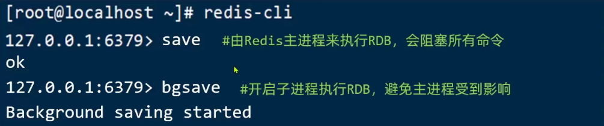
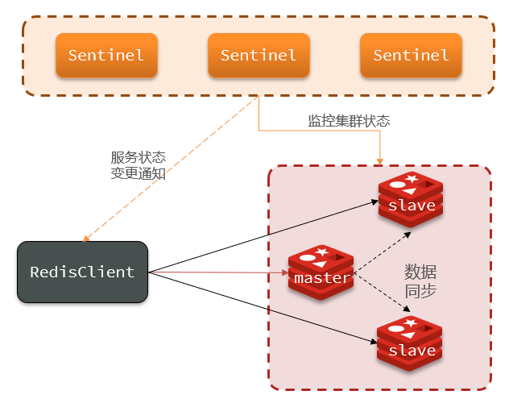
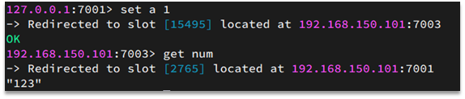
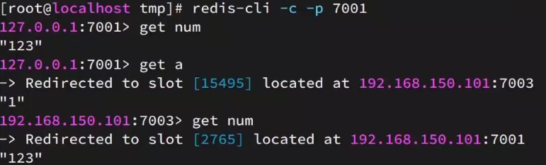
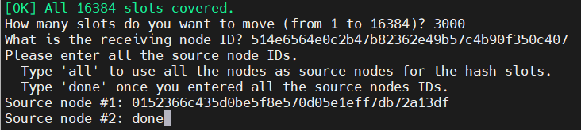
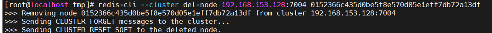
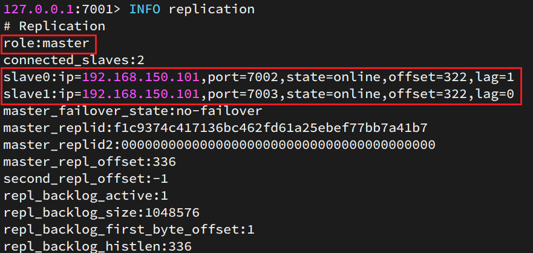
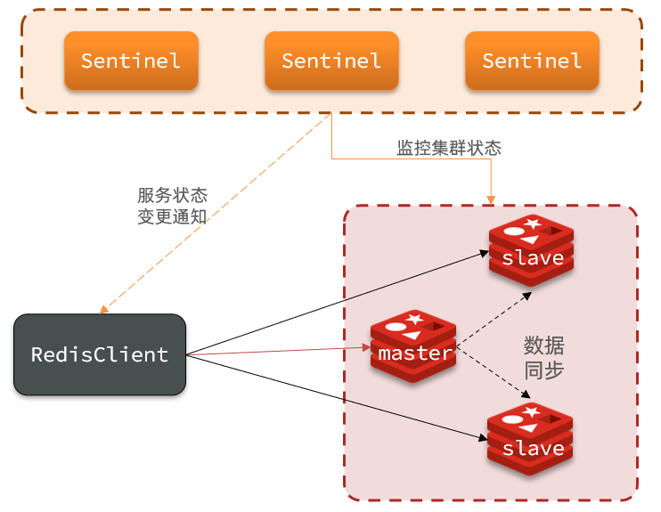
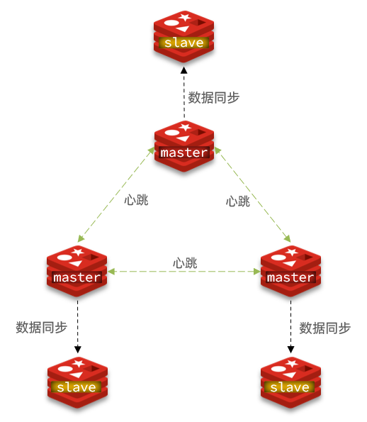
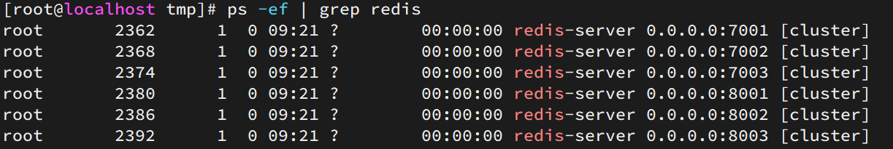

---

title: 分布式缓存-Redis集群
date: 2021-11-2 10:40:06

categories: Redis

---
[TOC]

# 分布式缓存-Redis集群

## 单点Redis的问题


**数据丢失问题**


Redis是内存存储，服务重启可能会丢失数据


**并发能力问题**


单节点Redis并发能力虽然不错，但也无法满足如618这样的高并发场景


**故障恢复问题**


如果Redis宕机，则服务不可用，需要一种自动的故障恢复手段


**存储能力问题**


Redis基于内存，单节点能存储的数据量难以满足海量数据需求


# Redis持久化

## RDB持久化

RDB全称**Redis Database Backup file（Redis数据备份文件）**，也被叫做**Redis数据快照**。简单来说就是**把内存中的所有数据都记录到磁盘中**。当Redis实例故障重启后，从磁盘读取快照文件，恢复数据。

快照文件称为RDB文件，默认是保存在当前运行目录。



Redis停机时会执行一次RDB。

```bash
^C
^C7509:signal-handler (1635042365) Received SIGINT scheduling shutdown...
7509:M 23 Oct 2021 19:26:05.981 # User requested shutdown...
7509:M 23 Oct 2021 19:26:05.981 * Saving the final RDB snapshot before exiting.
7509:M 23 Oct 2021 19:26:05.982 * DB saved on disk
7509:M 23 Oct 2021 19:26:05.982 * Removing the pid file.
7509:M 23 Oct 2021 19:26:05.982 # Redis is now ready to exit, bye bye...
[root@localhost redis-6.2.4]# 
[root@localhost redis-6.2.4]# ll
total 332
-rw-r--r--.  1 root root   104 Oct 23 19:26 dump.rdb
```

首先需要在Linux系统中安装一个Redis，可以参考课前资料《Redis集群》：

Redis内部有触发RDB的机制，可以在redis.conf文件中找到，格式如下：

```bash
# 900秒内，如果至少有1个key被修改，则执行bgsave ， 如果是save "" 则表示禁用RDB
save 900 1  
save 300 10  
save 60 10000 
```

**异步更新时间太长太短都不好，一般用默认设置即可**

**Bash**，[Unix shell](https://baike.baidu.com/item/Unix shell)的一种，在1987年由布莱恩·福克斯为了[GNU计划](https://baike.baidu.com/item/GNU计划)而编写。1989年发布第一个正式版本，原先是计划用在[GNU](https://baike.baidu.com/item/GNU)操作系统上，但能运行于大多数[类Unix系统](https://baike.baidu.com/item/类Unix系统)的操作系统之上，包括[Linux](https://baike.baidu.com/item/Linux)与Mac OS X v10.4都将它作为默认shell。

```
# You can set these explicitly by uncommenting the three following lines.
#
# save 3600 1
# save 300 100
# save 60 10000
save 5 1

# The filename where to dump the DB
dbfilename dump.test.rdb


7763:M 23 Oct 2021 19:41:04.697 * Ready to accept connections
7763:M 23 Oct 2021 19:41:10.094 * 1 changes in 5 seconds. Saving...
7763:M 23 Oct 2021 19:41:10.095 * Background saving started by pid 7776
7776:C 23 Oct 2021 19:41:10.096 * DB saved on disk
7776:C 23 Oct 2021 19:41:10.096 * RDB: 2 MB of memory used by copy-on-write
7763:M 23 Oct 2021 19:41:10.197 * Background saving terminated with success

```


RDB的其它配置也可以在redis.conf文件中设置：

```bash
# 是否压缩 ,建议不开启，压缩也会消耗cpu，磁盘的话不值钱
rdbcompression yes

# RDB文件名称
dbfilename dump.rdb  

# 文件保存的路径目录
dir ./ 

```

bgsave开始时会**fork主进程**得到子进程，子进程共享主进程的内存数据。完成fork后读取内存数据并写入 RDB 文件。

fork采用的是**copy-on-write技**术：

•当主进程执行读操作时，访问共享内存；

•当主进程执行写操作时，则会拷贝一份数据，执行写操作。


RDB方式bgsave的基本流程？

•fork主进程得到一个子进程，共享内存空间

•子进程读取内存数据并写入新的RDB文件

•用新RDB文件替换旧的RDB文件。

RDB会在什么时候执行？save 60 1000代表什么含义？

•默认是服务停止时。

•代表60秒内至少执行1000次修改则触发RDB

RDB的缺点？

•RDB执行间隔时间长，两次RDB之间写入数据有丢失的风险

•fork子进程、压缩、写出RDB文件都比较耗时

## AOF持久化

AOF全称为**Append Only File（追加文件）**。Redis处理的每一个写命令都会记录在AOF文件，可以看做是命令日志文件。


**AOF默认是关闭的**，需要修改redis.conf配置文件来开启AOF：

```bash
# 是否开启AOF功能，默认是no
appendonly yes
# AOF文件的名称
appendfilename "appendonly.aof"
```

AOF的命令记录的频率也可以通过redis.conf文件来配：

```bash
# 表示每执行一次写命令，立即记录到AOF文件
appendfsync always 
# 写命令执行完先放入AOF缓冲区，然后表示每隔1秒将缓冲区数据写到AOF文件，是默认方案
appendfsync everysec 
# 写命令执行完先放入AOF缓冲区，由操作系统决定何时将缓冲区内容写回磁盘
appendfsync no
```

| **配置项** | **刷盘时机** | **优点**               | **缺点**                     |
| ---------- | ------------ | ---------------------- | ---------------------------- |
| Always     | 同步刷盘     | 可靠性高，几乎不丢数据 | 性能影响大                   |
| everysec   | 每秒刷盘     | 性能适中               | 最多丢失1秒数据              |
| no         | 操作系统控制 | 性能最好               | 可靠性较差，可能丢失大量数据 |

**通常采用everysec，折中方案**，**redis默认方案**


```bash
# You can set these explicitly by uncommenting the three following lines.
#
# save 3600 1
# save 300 100
# save 60 10000
#禁用rdb
save ""


appendonly yes


9588:M 23 Oct 2021 20:10:24.820 # Server initialized
9588:M 23 Oct 2021 20:10:24.820 # WARNING overcommit_memory is set to 0! Background save may fail under low memory condition. To fix this issue add 'vm.overcommit_memory = 1' to /etc/sysctl.conf and then reboot or run the command 'sysctl vm.overcommit_memory=1' for this to take effect.
9588:M 23 Oct 2021 20:10:24.821 * Ready to accept connections
#启动时，没有读取备份文件

127.0.0.1:6379> keys *
(empty array)

[root@localhost redis-6.2.4]# cat appendonly.aof 
*2
$6
SELECT
$1
0
*3
$3
set
$3
num
$3
123
^C9588:signal-handler (1635045279) Received SIGINT scheduling shutdown...
9588:M 23 Oct 2021 20:14:39.899 # User requested shutdown...
9588:M 23 Oct 2021 20:14:39.899 * Calling fsync() on the AOF file.
9588:M 23 Oct 2021 20:14:39.899 * Removing the pid file.
9588:M 23 Oct 2021 20:14:39.899 # Redis is now ready to exit, bye bye...

9683:M 23 Oct 2021 20:15:07.154 # Server initialized
9683:M 23 Oct 2021 20:15:07.154 # WARNING overcommit_memory is set to 0! Background save may fail under low memory condition. To fix this issue add 'vm.overcommit_memory = 1' to /etc/sysctl.conf and then reboot or run the command 'sysctl vm.overcommit_memory=1' for this to take effect.
9683:M 23 Oct 2021 20:15:07.154 * DB loaded from append only file: 0.000 seconds
9683:M 23 Oct 2021 20:15:07.154 * Ready to accept connections

127.0.0.1:6379> set num 666
OK


[root@localhost redis-6.2.4]# cat appendonly.aof 
*2
$6
SELECT
$1
0
*3
$3
set
$3
num
$3
123
*3
$3
set
$4
name
$4
jack
*2
$6
SELECT
$1
0
*3
$3
set
$3
num
$3

```

#### bgrewriteaof命令

因为是记录命令，AOF文件会比RDB文件大的多。而且AOF会记录对同一个key的多次写操作，但只有最后一次写操作才有意义。通过执行**bgrewriteaof命令**，可以让AOF文件执行重写功能，用最少的命令达到相同效果。


Redis也会在触发阈值时自动去重写AOF文件。阈值也可以在redis.conf中配置：

```bash
# AOF文件比上次文件 增长超过多少百分比则触发重写
auto-aof-rewrite-percentage 100
# AOF文件体积最小多大以上才触发重写 
auto-aof-rewrite-min-size 64mb 
```


```shell
127.0.0.1:6379> BGREWRITEAOF
Background append only file rewriting started

[root@localhost redis-6.2.4]# cat appendonly.aof 
REDIS0009	redis-ver6.2.4
redis-bits󿿀򳨭eµϴused-memè*
𮤭preamble󿾁þ⭵mZnamejackÿ¬Zح.k

127.0.0.1:6379> keys *
1) "name"
2) "num"

```

#### RDB和AOF的优缺点

RDB和AOF各有自己的优缺点，如果对数据安全性要求较高，在实际开发中往往会**结合**两者来使用。

|                | **RDB**                                      | **AOF**                                                  |
| -------------- | -------------------------------------------- | -------------------------------------------------------- |
| 持久化方式     | 定时对整个内存做快照                         | 记录每一次执行的命令                                     |
| 数据完整性     | 不完整，两次备份之间会丢失                   | 相对完整，取决于刷盘策略                                 |
| 文件大小       | 会有压缩，文件体积小                         | 记录命令，文件体积很大                                   |
| 宕机恢复速度   | 很快                                         | 慢                                                       |
| 数据恢复优先级 | 低，因为数据完整性不如AOF                    | 高，因为数据完整性更高                                   |
| 系统资源占用   | 高，大量CPU和内存消耗                        | 低，主要是磁盘IO资源  但AOF重写时会占用大量CPU和内存资源 |
| 使用场景       | 可以容忍数分钟的数据丢失，追求更快的启动速度 | 对数据安全性要求较高常见                                 |

# Redis主从

## 搭建主从架构

单节点Redis的并发能力是有上限的，要进一步提高Redis的并发能力，就需要搭建主从集群，实现读写分离。


具体搭建流程参考课前资料**《Redis集群.md》**：

假设有A、B两个Redis实例，如何让B作为A的slave节点？

•在B节点执行命令：slaveof A的IP A的port


## 主从数据同步原理

主从第一次同步是**全量同步**（Full resync）：


master如何判断slave是不是第一次来同步数据？这里会用到两个很重要的概念：

•**Replication Id**：简称replid，是数据集的标记，id一致则说明是同一数据集。每一个master都有唯一的replid，slave则会继承master节点的replid

•**offset**：偏移量，随着记录在repl_baklog中的数据增多而逐渐增大。slave完成同步时也会记录当前同步的offset。如果slave的offset小于master的offset，说明slave数据落后于master，需要更新。

因此slave做数据同步，必须向master声明自己的**replication id 和offset**，master才可以判断到底需要同步哪些数据

master如何判断slave节点是不是第一次来做数据同步？**通过判断replid是否相同，如果不同，则是第一次**


但如果slave重启后同步，则执行**增量同步**


环形缓冲区


repl_baklog大小有上限，写满后会覆盖最早的数据。如果slave断开时间过久，**导致尚未备份的数据被覆盖**，则无法基于log做增量同步，**只能再次全量同步**。

**简述全量同步的流程**？

•slave节点请求增量同步

•master节点判断replid，发现不一致，拒绝增量同步

•master将完整内存数据生成RDB，发送RDB到slave

•slave清空本地数据，加载master的RDB

•master将RDB期间的命令记录在repl_baklog，并持续将log中的命令发送给slave

•slave执行接收到的命令，保持与master之间的同步

### 优化Redis主从就集群

可以从以下几个方面来**优化Redis主从就集群**：

•在master中配置repl-diskless-sync yes启用无磁盘复制，避免全量同步时的磁盘IO。

•Redis单节点上的内存占用不要太大，减少RDB导致的过多磁盘IO

•适当提高repl_baklog的大小，发现slave宕机时尽快实现故障恢复，**尽可能避免全量同步**

•限制一个master上的slave节点数量，如果实在是太多slave，则可以采用**主-从-从链式结构**，减少master压力


简述全量同步和增量同步区别？

•全量同步：master将完整内存数据生成RDB，发送RDB到slave。后续命令则记录在repl_baklog，逐个发送给slave。

•增量同步：slave提交自己的offset到master，master获取repl_baklog中从offset之后的命令给slave

什么时候执行全量同步？

•slave节点第一次连接master节点时

•slave节点断开时间太久，repl_baklog中的offset已经被覆盖时

什么时候执行增量同步？

•slave节点断开又恢复，并且在repl_baklog中能找到offset时


# Redis哨兵

## 哨兵的作用和原理

### 哨兵的作用

Redis提供了哨兵（Sentinel）机制来实现主从集群的**自动故障恢复**。哨兵的结构和作用如下：

•**监控**：Sentinel 会不断检查您的master和slave是否按预期工作

•**自动故障恢复**：如果master故障，Sentinel会将一个slave提升为master。当故障实例恢复后也以新的master为主

•**通知**：Sentinel充当Redis客户端的服务发现来源，当集群发生故障转移时，会将最新信息推送给Redis的客户端




### 服务状态监控

Sentinel基于心跳机制监测服务状态，每隔1秒向集群的每个实例发送ping命令：

•主观下线：如果某sentinel节点发现某实例未在规定时间响应，则认为该实例**主观下线**。

•客观下线：若**超过指定数量（quorum）的sentinel**都认为该实例主观下线，则该实例**客观下线**。quorum值最好超过Sentinel实例数量的一半。


### 选举新的master

一旦发现master故障，sentinel需要在salve中选择一个作为新的master，选择依据是这样的：

•首先会判断slave节点与master节点断开时间长短，如果超过指定值（down-after-milliseconds * 10）则会排除该slave节点

•然后判断slave节点的slave-priority值，越小优先级越高，如果是0则永不参与选举

•如果slave-prority一样，则判断slave节点的**offset值，越大说明数据越新**，优先级越高

•最后是判断slave节点的运行id大小，越小优先级越高。

### 如何实现故障转移

当选中了其中一个slave为新的master后（例如slave1），故障的转移的步骤如下：

•sentinel给备选的slave1节点发送slaveof no one命令，让该节点成为master

•sentinel给所有其它slave发送slaveof 192.168.153.128  7002 命令，让这些slave成为新master的从节点，开始从新的master上同步数据。

•最后，sentinel将故障节点标记为slave，当故障节点恢复后会自动成为新的master的slave节点


Sentinel的三个作用是什么？

**•监控**

**•故障转移**

**•通知**

Sentinel如何判断一个redis实例是否健康？

•每隔1秒发送一次ping命令，如果超过一定时间没有相向则认为是主观下线

•如果大多数sentinel都认为实例主观下线，则判定服务下线

故障转移步骤有哪些？

•首先选定一个slave作为新的master，执行slaveof no one

•然后让所有节点都执行slaveof 新master

•修改故障节点配置，添加slaveof 新master

## 搭建哨兵集群

### 搭建哨兵架构

具体搭建流程参考[Redis集群-3 搭建哨兵集群](##3.搭建哨兵集群)

## RedisTemplate的哨兵模式

在Sentinel集群监管下的Redis主从集群，其节点会因为自动故障转移而发生变化，Redis的客户端必须感知这种变化，及时更新连接信息。Spring的RedisTemplate底层利用lettuce实现了节点的感知和自动切换。

首先，我们引入课前资料提供的Demo工程：redis-demo

1.在pom文件中引入redis的starter依赖：

```

<dependency>
	<groupId>org.springframework.boot</groupId>
	<artifactId>spring-boot-starter-data-redis</artifactId>
</dependency>
```

2.然后在配置文件application.yml中指定sentinel相关信息：

```yaml
spring:
  redis:
    sentinel:
      master: mymaster # 指定master名称
      nodes: # 指定redis-sentinel集群信息
        - 192.168.153.128:27001
        - 192.168.153.128:27002
        - 192.168.153.128:27003
```

3.配置主从读写分离

```java
@Bean
public LettuceClientConfigurationBuilderCustomizer configurationBuilderCustomizer() {
	return configBuilder -> configBuilder.readFrom(ReadFrom.REPLICA_PREFERRED);
}
```

这里的ReadFrom是配置Redis的读取策略，是一个枚举，包括下面选择：

•MASTER：从主节点读取

•MASTER_PREFERRED：优先从master节点读取，master不可用才读取replica

•REPLICA：从slave（replica）节点读取

•REPLICA _PREFERRED：优先从slave（replica）节点读取，所有的slave都不可用才读取master


```
[root@localhost ~]# redis-cli -p 7001
127.0.0.1:7001> get num
"123"
```


# Redis分片集群

分片集群结构

主从和哨兵可以解决高可用、高并发读的问题。但是依然有两个问题没有解决：

•海量数据存储问题

•高并发写的问题

使用分片集群可以解决上述问题，分片集群特征：

•集群中有多个master，每个master保存不同数据

•每个master都可以有多个slave节点

•master之间通过ping监测彼此健康状态

•客户端请求可以访问集群任意节点，最终都会被转发到正确节点


## 搭建分片集群

具体搭建流程参考[4.搭建分片集群](##4.搭建分片集群)

## 散列插槽

Redis会把每一个master节点映射到0~16383共16384个插槽（hash slot）上，查看集群信息时就能看到：


数据key不是与节点绑定，而是与插槽绑定。redis会根据key的有效部分计算插槽值，分两种情况：

•key中包含"{}"，且“{}”中至少包含1个字符，“{}”中的部分是有效部分

•key中不包含“{}”，整个key都是有效部分

例如：key是num，那么就根据num计算，如果是{itcast}num，则根据itcast计算。计算方式是利用CRC16算法得到一个hash值，然后对16384取余，得到的结果就是slot值。



Redis如何判断某个key应该在哪个实例？

•将16384个插槽分配到不同的实例

•根据key的有效部分计算哈希值，对16384取余

•余数作为插槽，寻找插槽所在实例即可

如何将同一类数据固定的保存在同一个Redis实例？

•这一类数据使用相同的有效部分，例如key都以{typeId}为前缀

如：

```sh
[root@localhost tmp]# redis-cli -c -p 7001
127.0.0.1:7001> set num 123
OK
127.0.0.1:7001> set a 1
-> Redirected to slot [15495] located at 192.168.153.128:7003
OK
192.168.153.128:7003> get num
-> Redirected to slot [2765] located at 192.168.153.128:7001
"123"
192.168.153.128:7001> set {a}num 111
-> Redirected to slot [15495] located at 192.168.153.128:7003
OK
192.168.153.128:7003>
```

## 集群伸缩

### 添加一个节点到集群

redis-cli --cluster提供了很多操作集群的命令，可以通过下面方式查看：


比如，添加节点的命令：


### **案例：**向集群中添加一个新的master节点，并向其中存储 num = 10

需求：

•启动一个新的redis实例，端口为7004

•添加7004到之前的集群，并作为一个master节点

•给7004节点分配插槽，使得num这个key可以存储到7004实例

创建文件夹

```sh
[root@localhost tmp]# mkdir 7004
[root@localhost tmp]# cp redis.conf 7004
[root@localhost tmp]# ll
```

修改7004配置文件

```sh
[root@localhost tmp]# sed -i s/6379/7004/g 7004/redis.conf
```

启动redis并查看

```
oot@localhost tmp]# redis-server 7004/redis.conf

[root@localhost tmp]# ps -ef | grep redis
root       2925      1  0 07:07 ?        00:00:01 redis-server 0.0.0.0:7001 [cluster]
root       2927      1  0 07:07 ?        00:00:01 redis-server 0.0.0.0:7002 [cluster]
root       2933      1  0 07:07 ?        00:00:01 redis-server 0.0.0.0:7003 [cluster]
root       2943      1  0 07:07 ?        00:00:01 redis-server 0.0.0.0:8001 [cluster]
root       2945      1  0 07:07 ?        00:00:01 redis-server 0.0.0.0:8002 [cluster]
root       2951      1  0 07:07 ?        00:00:01 redis-server 0.0.0.0:8003 [cluster]
root       3208      1  0 07:30 ?        00:00:00 redis-server 0.0.0.0:7004 [cluster]
root       3233   2673  0 07:30 pts/0    00:00:00 grep --color=auto redis

```

向集群中添加当前节点

```sh
[root@localhost tmp]# redis-cli --cluster add-node 192.168.153.128:7004 192.168.153.128:7001

```

查看是否添加成功

```sh
[root@localhost tmp]# redis-cli -p 7001 cluster nodes
0152366c435d0be5f8e570d05e1eff7db72a13df 192.168.153.128:7004@17004 master - 0 1635950070571 0 connected
#没有插槽分配
514e6564e0c2b47b82362e49b57c4b90f350c407 192.168.153.128:7001@17001 myself,master - 0 1635950068000 1 connected 0-5460
a21bce6120773d05c8c20c5f3ecd4867e793a464 192.168.153.128:8003@18003 slave 514e6564e0c2b47b82362e49b57c4b90f35              0c407 0 1635950069000 1 connected
6d629f5fa3b124b22b510802a246212d795602c2 192.168.153.128:8002@18002 slave 253d20ff6ed20660c970a504a6785ce4216              9e0b3 0 1635950068508 3 connected
b0961b15ecf41a922f50b3f1b382e705b95d76e7 192.168.153.128:7002@17002 master - 0 1635950068508 2 connected 5461-10922
e041127dbacaa65213a767e72edbe845f9a2cd39 192.168.153.128:8001@18001 slave b0961b15ecf41a922f50b3f1b382e705b95              d76e7 0 1635950069000 2 connected
253d20ff6ed20660c970a504a6785ce42169e0b3 192.168.153.128:7003@17003 master - 0 1635950070000 3 connected 10923-16383

```

查看num的插槽位置




```
redis-cli --cluster reshard 192.168.153.128:7004
```


重新查看是否分配成功

```
[root@localhost tmp]# redis-cli -p 7001 cluster nodes
```


存储数据

```sh

[root@localhost tmp]# redis-cli -c -p 7001
127.0.0.1:7001> get num
-> Redirected to slot [2765] located at 192.168.153.128:7004
"123"
192.168.153.128:7004> set num 10
OK
```

### 联系：删除集群中的一个节点

需求：

•删除7004这个实例

1）查看操作help

```
[root@localhost tmp]# redis-cli --cluster help
....
  del-node       host:port node_id 
```

2)删除7004

```
redis-cli --cluster del-node 192.168.153.128:7004 0152366c435d0be5f8e570d05e1eff7db72a13df
```


2）要先转移数据




3）再次删除

```
redis-cli --cluster del-node 192.168.153.128:7004 0152366c435d0be5f8e570d05e1eff7db72a13df
```



查看是否删除成功

```sh
[root@localhost tmp]# redis-cli -p 7001 cluster nodes
514e6564e0c2b47b82362e49b57c4b90f350c407 192.168.153.128:7001@17001 myself,master - 0 1635951731000 8 connected 0-5460
a21bce6120773d05c8c20c5f3ecd4867e793a464 192.168.153.128:8003@18003 slave 514e6564e0c2b47b82362e49b57c4b90f350c407 0 163595        1732582 8 connected
6d629f5fa3b124b22b510802a246212d795602c2 192.168.153.128:8002@18002 slave 253d20ff6ed20660c970a504a6785ce42169e0b3 0 163595        1731424 3 connected
b0961b15ecf41a922f50b3f1b382e705b95d76e7 192.168.153.128:7002@17002 master - 0 1635951732000 2 connected 5461-10922
e041127dbacaa65213a767e72edbe845f9a2cd39 192.168.153.128:8001@18001 slave b0961b15ecf41a922f50b3f1b382e705b95d76e7 0 163595        1731529 2 connected
253d20ff6ed20660c970a504a6785ce42169e0b3 192.168.153.128:7003@17003 master - 0 1635951732475 3 connected 10923-16383
```


## 故障转移

当集群中有一个master宕机会发生什么呢？

1.首先是该实例与其它实例失去连接

2.然后是疑似宕机：


3.最后是确定下线，自动提升一个slave为新的master：


watch模式监控集群状态

```
watch redis-cli -p 7001 cluster nodes
```


```
[root@localhost ~]# redis-cli -p 7002 shutdown
[root@localhost tmp]# redis-server 7002/redis.conf

```

#### 数据迁移

利用cluster failover命令可以手动让集群中的某个master宕机，切换到执行cluster failover命令的这个slave节点，实现无感知的数据迁移。其流程如下：

手动的Failover支持三种不同模式：

•缺省：默认的流程，如图1~6歩

•force：省略了对offset的一致性校验

•takeover：直接执行第5歩，忽略数据一致性、忽略master状态和其它master的意见


### 案例：在7002这个slave节点执行手动故障转移，重新夺回master地位

步骤如下：

1.利用redis-cli连接7002这个节点

2.执行cluster failover命令

```sh
[root@localhost tmp]# redis-cli -p 7002
127.0.0.1:7002> CLUSTER FAILOVER
OK
```

主从状态切换


## RedisTemplate访问分片集群

RedisTemplate底层同样基于lettuce实现了分片集群的支持，而使用的步骤与哨兵模式基本一致：

1.引入redis的starter依赖

2.配置分片集群地址

3.配置读写分离

与哨兵模式相比，其中只有分片集群的配置方式略有差异，如下：

```yaml
spring:
  redis: 
    cluster:
      nodes: #指定分片集群的每一个节点信息
        - 192.168.153.128:7001
        - 192.168.153.128:7002
        - 192.168.153.128:7003
        - 192.168.153.128:8001
        - 192.168.153.128:8002
        - 192.168.153.128:8003
```

启动测试


# Redis集群

本章是基于CentOS7下的Redis集群教程，包括：

- 单机安装Redis
- Redis主
- Redis分片集群


## 1.单机安装Redis

首先需要安装Redis所需要的依赖：

```sh
yum install -y gcc tcl
```

*Yum*（全称为 **Yellow dog Updater**, Modified）是一个在Fedora和RedHat以及CentOS中的Shell前端软件包管理器。

然后将课前资料提供的Redis安装包上传到虚拟机的任意目录：

redis-6.2.4.tar.gz


例如，我放到了/tmp目录：


解压缩：

```sh
tar -xvf redis-6.2.4.tar.gz
```

解压后：


进入redis目录：

```sh
cd redis-6.2.4
```


运行编译命令：

```sh
make && make install
```

如果没有出错，应该就安装成功了。

然后修改redis.conf文件中的一些配置：

```properties
# 绑定地址，默认是127.0.0.1，会导致只能在本地访问。修改为0.0.0.0则可以在任意IP访问
bind 0.0.0.0
# 数据库数量，设置为1
databases 1
```


启动Redis：（**要制定配置文件**）

```sh
redis-server redis.conf
```

停止redis服务：

```sh
redis-cli shutdown
```

测试是否开启成功

```bash
[root@localhost ~]# redis-cli
127.0.0.1:6379> ping
PONG
127.0.0.1:6379> set num 123
OK
127.0.0.1:6379> get num
"123"
```


## 2.Redis主从集群

### 2.1.集群结构

我们搭建的主从集群结构如图：


共包含三个节点，一个主节点，两个从节点。

这里我们会在同一台虚拟机中开启3个redis实例，模拟主从集群，信息如下：

|       IP        | PORT |  角色  |
| :-------------: | :--: | :----: |
| 192.168.153.128 | 7001 | master |
| 192.168.153.128 | 7002 | slave  |
| 192.168.153.128 | 7003 | slave  |

### 2.2.准备实例和配置

要在同一台虚拟机开启3个实例，必须准备三份不同的配置文件和目录，配置文件所在目录也就是工作目录。

1）创建目录

我们创建三个文件夹，名字分别叫7001、7002、7003：

```sh
# 进入/tmp目录
cd /tmp
# 创建目录
mkdir 7001 7002 7003
```

如图：


2）恢复原始配置

修改redis-6.2.4/redis.conf文件，将其中的持久化模式改为默认的RDB模式，AOF保持关闭状态。

```properties
# 开启RDB
# save ""
save 3600 1
save 300 100
save 60 10000

# 关闭AOF
appendonly no
```


3）拷贝配置文件到每个实例目录

然后将redis-6.2.4/redis.conf文件拷贝到三个目录中（在/tmp目录执行下列命令）：

```sh
# 方式一：逐个拷贝
cp redis-6.2.4/redis.conf 7001
cp redis-6.2.4/redis.conf 7002
cp redis-6.2.4/redis.conf 7003
# 方式二：管道组合命令，一键拷贝
echo 7001 7002 7003 | xargs -t -n 1 cp redis-6.2.4/redis.conf
```


4）修改每个实例的端口、工作目录

修改每个文件夹内的配置文件，将端口分别修改为7001、7002、7003，将rdb文件保存位置都修改为自己所在目录（在/tmp目录执行下列命令）：

```sh
sed -i -e 's/6379/7001/g' -e 's/dir .\//dir \/tmp\/7001\//g' 7001/redis.conf
sed -i -e 's/6379/7002/g' -e 's/dir .\//dir \/tmp\/7002\//g' 7002/redis.conf
sed -i -e 's/6379/7003/g' -e 's/dir .\//dir \/tmp\/7003\//g' 7003/redis.conf
```


5）修改每个实例的声明IP

虚拟机本身有多个IP，为了避免将来混乱，我们需要在redis.conf文件中指定每一个实例的绑定ip信息，格式如下：

```properties
# redis实例的声明 IP
replica-announce-ip 192.168.153.128 
```


每个目录都要改，我们一键完成修改（在/tmp目录执行下列命令）：

```sh
# 逐一执行
sed -i '1a replica-announce-ip 192.168.153.128 ' 7001/redis.conf
sed -i '1a replica-announce-ip 192.168.153.128 ' 7002/redis.conf
sed -i '1a replica-announce-ip 192.168.153.128 ' 7003/redis.conf

# 或者一键修改
printf '%s\n' 7001 7002 7003 | xargs -I{} -t sed -i '1a replica-announce-ip 192.168.153.128 ' {}/redis.conf
```


### 2.3.启动

为了方便查看日志，我们打开3个ssh窗口，分别启动3个redis实例，启动命令：

```sh
# 第1个
redis-server 7001/redis.conf
# 第2个
redis-server 7002/redis.conf
# 第3个
redis-server 7003/redis.conf
```


启动后：


如果要一键停止，可以运行下面命令：

```sh
printf '%s\n' 7001 7002 7003 | xargs -I{} -t redis-cli -p {} shutdown
```


### 2.4.开启主从关系

现在三个实例还没有任何关系，要配置主从可以使用replicaof 或者slaveof（5.0以前）命令。

有临时和永久两种模式：

- 修改配置文件（永久生效）

  - 在redis.conf中添加一行配置：```slaveof <masterip> <masterport>```

- 使用redis-cli客户端连接到redis服务，执行slaveof命令（重启后失效）：

  ```sh
  slaveof <masterip> <masterport>
  ```


<strong><font color='red'>注意</font></strong>：在5.0以后新增命令replicaof，与salveof效果一致。


这里我们为了演示方便，使用方式二。

通过redis-cli命令连接7002，执行下面命令：

```sh
# 连接 7002
redis-cli -p 7002
# 执行slaveof
slaveof 192.168.153.128 7001
```

**注意：**使用localhost成功，但IP不行:失败

```
slaveof localhost 7001
```

可能是**IP号**写错了

通过redis-cli命令连接7003，执行下面命令：

```sh
# 连接 7003
redis-cli -p 7003
# 执行slaveof
slaveof 192.168.153.128 7001
```


然后连接 7001节点，查看集群状态：

```sh
# 连接 7001
redis-cli -p 7001
# 查看状态
info replication
```

结果：




### 2.5.测试

执行下列操作以测试：

- 利用redis-cli连接7001，执行```set num 123```

- 利用redis-cli连接7002，执行```get num```，再执行```set num 666```

- 利用redis-cli连接7003，执行```get num```，再执行```set num 888```


可以发现，只有在7001这个master节点上可以执行写操作，7002和7003这两个slave节点只能执行读操作。


## 3.搭建哨兵集群


### 3.1.集群结构

这里我们搭建一个三节点形成的Sentinel集群，来监管之前的Redis主从集群。如图：




三个sentinel实例信息如下：

| 节点 |       IP        | PORT  |
| ---- | :-------------: | :---: |
| s1   | 192.168.153.128 | 27001 |
| s2   | 192.168.153.128 | 27002 |
| s3   | 192.168.153.128 | 27003 |

### 3.2.准备实例和配置

要在同一台虚拟机开启3个实例，必须准备三份不同的配置文件和目录，配置文件所在目录也就是工作目录。

我们创建三个文件夹，名字分别叫s1、s2、s3：

```sh
# 进入/tmp目录
cd /tmp
# 创建目录
mkdir s1 s2 s3
```

如图：


然后我们在s1目录创建一个sentinel.conf文件，添加下面的内容：

```ini
port 27001
sentinel announce-ip 192.168.153.128
sentinel monitor mymaster 192.168.153.128 7001 2
sentinel down-after-milliseconds mymaster 5000
sentinel failover-timeout mymaster 60000
dir "/tmp/s1"
```

解读：

- `port 27001`：是当前sentinel实例的端口
- `sentinel monitor mymaster 192.168.153.128  7001 2`：指定主节点信息
  - `mymaster`：主节点名称，自定义，任意写
  - `192.168.153.128  7001`：主节点的ip和端口
  - `2`：选举master时的quorum值


然后将s1/sentinel.conf文件拷贝到s2、s3两个目录中（在/tmp目录执行下列命令）：

```sh
# 方式一：逐个拷贝
cp s1/sentinel.conf s2
cp s1/sentinel.conf s3
# 方式二：管道组合命令，一键拷贝
echo s2 s3 | xargs -t -n 1 cp s1/sentinel.conf
```


修改s2、s3两个文件夹内的配置文件，将端口分别修改为27002、27003：

```sh
sed -i -e 's/27001/27002/g' -e 's/s1/s2/g' s2/sentinel.conf
sed -i -e 's/27001/27003/g' -e 's/s1/s3/g' s3/sentinel.conf
```


### 3.3.启动

为了方便查看日志，我们打开3个ssh窗口，分别启动3个redis实例，启动命令：

```sh
# 第1个
redis-sentinel s1/sentinel.conf
# 第2个
redis-sentinel s2/sentinel.conf
# 第3个
redis-sentinel s3/sentinel.conf
```


启动后：


### 3.4.测试

尝试让master节点7001宕机，查看sentinel日志：


查看7003的日志：


查看7002的日志：


## 4.搭建分片集群

### 4.1.集群结构

分片集群需要的节点数量较多，这里我们搭建一个最小的分片集群，包含3个master节点，每个master包含一个slave节点，结构如下：




这里我们会在同一台虚拟机中开启6个redis实例，模拟分片集群，信息如下：

|       IP        | PORT |  角色  |
| :-------------: | :--: | :----: |
| 192.168.153.128 | 7001 | master |
| 192.168.153.128 | 7002 | master |
| 192.168.153.128 | 7003 | master |
| 192.168.153.128 | 8001 | slave  |
| 192.168.153.128 | 8002 | slave  |
| 192.168.153.128 | 8003 | slave  |


### 4.2.准备实例和配置

删除之前的7001、7002、7003这几个目录，重新创建出7001、7002、7003、8001、8002、8003目录：

```sh
# 进入/tmp目录
cd /tmp
# 删除旧的，避免配置干扰
rm -rf 7001 7002 7003
# 创建目录
mkdir 7001 7002 7003 8001 8002 8003
```


在/tmp下准备一个新的redis.conf文件，内容如下：

```ini
port 6379
# 开启集群功能
cluster-enabled yes
# 集群的配置文件名称，不需要我们创建，由redis自己维护
cluster-config-file /tmp/6379/nodes.conf
# 节点心跳失败的超时时间
cluster-node-timeout 5000
# 持久化文件存放目录
dir /tmp/6379
# 绑定地址
bind 0.0.0.0
# 让redis后台运行
daemonize yes
# 注册的实例ip
replica-announce-ip 192.168.153.128 
# 保护模式
protected-mode no
# 数据库数量
databases 1
# 日志
logfile /tmp/6379/run.log
```

将这个文件拷贝到每个目录下：

```sh
# 进入/tmp目录
cd /tmp
# 执行拷贝
echo 7001 7002 7003 8001 8002 8003 | xargs -t -n 1 cp redis.conf
```


修改每个目录下的redis.conf，将其中的6379修改为与所在目录一致：

```sh
# 进入/tmp目录
cd /tmp
# 修改配置文件
printf '%s\n' 7001 7002 7003 8001 8002 8003 | xargs -I{} -t sed -i 's/6379/{}/g' {}/redis.conf
```


### 4.3.启动

因为已经配置了后台启动模式，所以可以直接启动服务：

```sh
# 进入/tmp目录
cd /tmp
# 一键启动所有服务
printf '%s\n' 7001 7002 7003 8001 8002 8003 | xargs -I{} -t redis-server {}/redis.conf
```

通过ps查看状态：

```sh
ps -ef | grep redis
```

发现服务都已经正常启动：




如果要关闭所有进程，可以执行命令：

```sh
ps -ef | grep redis | awk '{print $2}' | xargs kill
```

或者（推荐这种方式）：

```sh
printf '%s\n' 7001 7002 7003 8001 8002 8003 | xargs -I{} -t redis-cli -p {} shutdown
```


### 4.4.创建集群

虽然服务启动了，但是目前每个服务之间都是独立的，没有任何关联。

我们需要执行命令来创建集群，在Redis5.0之前创建集群比较麻烦，5.0之后集群管理命令都集成到了redis-cli中。


1）Redis5.0之前

Redis5.0之前集群命令都是用redis安装包下的src/redis-trib.rb来实现的。因为redis-trib.rb是有ruby语言编写的所以需要安装ruby环境。

 ```sh
 # 安装依赖
 yum -y install zlib ruby rubygems
 gem install redis
 ```


然后通过命令来管理集群：

```sh
# 进入redis的src目录
cd /tmp/redis-6.2.4/src
# 创建集群
./redis-trib.rb create --replicas 1 192.168.153.128 :7001 192.168.153.128 :7002 192.168.153.128 :7003 192.168.153.128 :8001 192.168.153.128 :8002 192.168.153.128 :8003
```


2）Redis5.0以后

我们使用的是Redis6.2.4版本，集群管理以及集成到了redis-cli中，格式如下：

```sh
redis-cli --cluster create --cluster-replicas 1 192.168.153.128:7001 192.168.153.128:7002 192.168.153.128:7003 192.168.153.128:8001 192.168.153.128:8002 192.168.153.128:8003
```

命令说明：

- `redis-cli --cluster`或者`./redis-trib.rb`：代表集群操作命令
- `create`：代表是创建集群
- `--replicas 1`或者`--cluster-replicas 1` ：指定集群中**每个master的副本个数为1**，此时`节点总数 ÷ (replicas + 1)` 得到的就是master的数量。因此节点列表中的前n个就是master，其它节点都是slave节点，随机分配到不同master


运行后的样子：


这里输入yes，则集群开始创建：


通过命令可以查看集群状态：

```sh
redis-cli -p 7001 cluster nodes
```


### 4.5.测试

尝试连接7001节点，存储一个数据：

```sh
# 连接
redis-cli -p 7001
# 存储数据
set num 123
# 读取数据
get num
# 再次存储
set a 1
```

结果悲剧了：


集群操作时，**需要给`redis-cli`加上`-c`参数**才可以：

```sh
redis-cli -c -p 7001
```

这次可以了：


# Redis命令操作

启动redis

```
[root@localhost tmp]# redis-server 7001/redis.conf
```

redis客户端

```
redis-cli -p 7001
```

