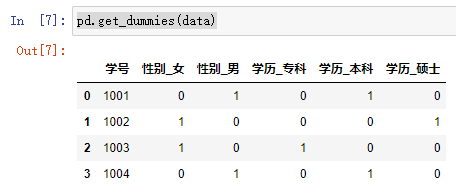

pandas官方user_guide

[pandas官方user_guide](https://pandas.pydata.org/pandas-docs/stable/user_guide/10min.html#object-creation)

## kaggle-pandas

[kaggle-pandas](https://www.kaggle.com/learn/pandas)


# 1Creating, Reading and Writing

Creating, Reading and Writing：https://www.kaggle.com/code/residentmario/creating-reading-and-writing

You can't work with data if you can't read it. Get started here.

##  Introduction

In this micro-course, you'll learn all about **[pandas](https://pandas.pydata.org/)**, the most popular Python library for data analysis.

Along the way, you'll complete several hands-on exercises with real-world data. We recommend that you work on the exercises while reading the corresponding tutorials.

**To start the first exercise, please click [here](https://www.kaggle.com/kernels/fork/587970).**

In this tutorial, you will learn how to create your own data, along with how to work with data that already exists.

##  Getting started

To use pandas, you'll typically start with the following line of code.

In [1]:

```
import pandas as pd
```

##  Creating data

There are two core objects in pandas: the **DataFrame** and the **Series**.

##   DataFrame

A DataFrame is a table. It contains an array of individual *entries*, each of which has a certain *value*. Each entry corresponds to a row (or *record*) and a *column*.

For example, consider the following simple DataFrame:

In [2]:

```
pd.DataFrame({'Yes': [50, 21], 'No': [131, 2]})
```

Out[2]:

|      | Yes  | No   |
| :--- | :--- | :--- |
| 0    | 50   | 131  |
| 1    | 21   | 2    |

In this example, the "0, No" entry has the value of 131. The "0, Yes" entry has a value of 50, and so on.

DataFrame entries are not limited to integers. For instance, here's a DataFrame whose values are strings:

In [3]:

```
pd.DataFrame({'Bob': ['I liked it.', 'It was awful.'], 'Sue': ['Pretty good.', 'Bland.']})
```

Out[3]:

|      | Bob           | Sue          |
| :--- | :------------ | :----------- |
| 0    | I liked it.   | Pretty good. |
| 1    | It was awful. | Bland.       |

We are using the `pd.DataFrame()` constructor to generate these DataFrame objects. The syntax for declaring a new one is a dictionary whose keys are the column names (`Bob` and `Sue` in this example), and whose values are a list of entries. This is the standard way of constructing a new DataFrame, and the one you are most likely to encounter.

The dictionary-list constructor assigns values to the *column labels*, but just uses an ascending count from 0 (0, 1, 2, 3, ...) for the *row labels*. Sometimes this is OK, but oftentimes we will want to assign these labels ourselves.

The list of row labels used in a DataFrame is known as an **Index**. We can assign values to it by using an `index` parameter in our constructor:

In [4]:

```
pd.DataFrame({'Bob': ['I liked it.', 'It was awful.'], 
              'Sue': ['Pretty good.', 'Bland.']},
             index=['Product A', 'Product B'])
```

Out[4]:

|           | Bob           | Sue          |
| :-------- | :------------ | :----------- |
| Product A | I liked it.   | Pretty good. |
| Product B | It was awful. | Bland.       |

##  Series

A Series, by contrast, is a sequence of data values. If a DataFrame is a table, a Series is a list. And in fact you can create one with nothing more than a list:

In [5]:

```python
pd.Series([1, 2, 3, 4, 5])
```

Out[5]:

```
0    1
1    2
2    3
3    4
4    5
dtype: int64
```

A Series is, in essence, a single column of a DataFrame. So you can assign row labels to the Series the same way as before, using an `index` parameter. However, a Series does not have a column name, it only has one overall `name`:

In [6]:

```
pd.Series([30, 35, 40], index=['2015 Sales', '2016 Sales', '2017 Sales'], name='Product A')
```

Out[6]:

```
2015 Sales    30
2016 Sales    35
2017 Sales    40
Name: Product A, dtype: int64
```

The Series and the DataFrame are intimately related. It's helpful to think of a DataFrame as actually being just a bunch of Series "glued together". We'll see more of this in the next section of this tutorial.

##  Reading data files

常用函数

| function                |                                       |
| ----------------------- | ------------------------------------- |
| train_df.columns.values | 查看df数据全部列名                    |
| df.head()               | Print the first five rows of the data |
| df.tail()               | Print the last five rows of the data  |
| train_df.info()         | 查看df列名，dtype,等信息              |
| train_df.describe()     | 整个数据集的相关统计信息              |
|                         |                                       |

### train_df.columns.values

```python
print(train_df.columns.values)
```

out:

```
['PassengerId' 'Survived' 'Pclass' 'Name' 'Sex' 'Age' 'SibSp' 'Parch'
 'Ticket' 'Fare' 'Cabin' 'Embarked']
```

### 查看数据帧的前5行和后五行

（默认情况下）

```python
#前五行
df.head()
#后五行
# Print the last five rows of the data
df.tail()
```

### train_df.info()

```python
train_df.info()
print('_'*40)
```

```
<class 'pandas.core.frame.DataFrame'>
RangeIndex: 891 entries, 0 to 890
Data columns (total 12 columns):
 #   Column       Non-Null Count  Dtype  
---  ------       --------------  -----  
 0   PassengerId  891 non-null    int64  
 1   Survived     891 non-null    int64  
 2   Pclass       891 non-null    int64  
 3   Name         891 non-null    object 
 4   Sex          891 non-null    object 
 5   Age          714 non-null    float64
 6   SibSp        891 non-null    int64  
 7   Parch        891 non-null    int64  
 8   Ticket       891 non-null    object 
 9   Fare         891 non-null    float64
 10  Cabin        204 non-null    object 
 11  Embarked     889 non-null    object 
dtypes: float64(2), int64(5), object(5)
memory usage: 83.7+ KB
________________________________________
```

### train_df.describe()

```python
DataFrame.describe(percentiles=None, include=None, exclude=None, datetime_is_numeric=False)

```

**Parameters:**

**include**: ‘all’, list-like of dtypes or None (default), optional

A white list of data types to include in the result. Ignored for `Series`. Here are the options:

- ‘all’ : All columns of the input will be included in the output.
- A list-like of dtypes : Limits the results to the provided data types. To limit the result to numeric types submit `numpy.number`. To limit it instead to object columns submit the `numpy.object` data type. **Strings can also be used in the style of `select_dtypes` (e.g. `df.describe(include=['O'])`).** To select pandas categorical columns, use `'category'`
- None (default) : The result will include all numeric columns.

```
train_df.describe()
```

|       | PassengerId |   Survived |     Pclass |        Age |      SibSp |      Parch |       Fare |
| ----: | ----------: | ---------: | ---------: | ---------: | ---------: | ---------: | ---------: |
| count |  891.000000 | 891.000000 | 891.000000 | 714.000000 | 891.000000 | 891.000000 | 891.000000 |
|  mean |  446.000000 |   0.383838 |   2.308642 |  29.699118 |   0.523008 |   0.381594 |  32.204208 |
|   std |  257.353842 |   0.486592 |   0.836071 |  14.526497 |   1.102743 |   0.806057 |  49.693429 |
|   min |    1.000000 |   0.000000 |   1.000000 |   0.420000 |   0.000000 |   0.000000 |   0.000000 |
|   25% |  223.500000 |   0.000000 |   2.000000 |  20.125000 |   0.000000 |   0.000000 |   7.910400 |
|   50% |  446.000000 |   0.000000 |   3.000000 |  28.000000 |   0.000000 |   0.000000 |  14.454200 |
|   75% |  668.500000 |   1.000000 |   3.000000 |  38.000000 |   1.000000 |   0.000000 |  31.000000 |
|   max |  891.000000 |   1.000000 |   3.000000 |  80.000000 |   8.000000 |   6.000000 | 512.329200 |


### 指定行index加载文件


```python
## Path of the file to read
flight_filepath = "./input_data/flight_delays.csv"

## Read the file into a variable flight_data
flight_data = pd.read_csv(flight_filepath, index_col="Month")
```

You may notice that the code is slightly shorter than what we used in the previous tutorial. In this case, since the row labels (from the `'Month'` column) don't correspond to dates, we don't add `parse_dates=True` in the parentheses. But, we keep the first two pieces of text as before, to provide both:

- the filepath for the dataset (in this case, `flight_filepath`), and
- the name of the column that will be used to index the rows (in this case, `index_col="Month"`).


Being able to create a DataFrame or Series by hand is handy. But, most of the time, we won't actually be creating our own data by hand. Instead, we'll be working with data that already exists.

Data can be stored in any of a number of different forms and formats. By far the most basic of these is the humble CSV file. When you open a CSV file you get something that looks like this:

```
Product A,Product B,Product C,
30,21,9,
35,34,1,
41,11,11
```

So a CSV file is a table of values separated by commas. Hence the name: "Comma-Separated Values", or CSV.

Let's now set aside our toy datasets and see what a real dataset looks like when we read it into a DataFrame. We'll use the `pd.read_csv()` function to read the data into a DataFrame. This goes thusly:

In [7]:

```
wine_reviews = pd.read_csv("../input/wine-reviews/winemag-data-130k-v2.csv")
```

We can use the `shape` attribute to check how large the resulting DataFrame is:

In [8]:

```
wine_reviews.shape
```

Out[8]:

```
(129971, 14)
```

So our new DataFrame has 130,000 records split across 14 different columns. That's almost 2 million entries!


We can examine the contents of the resultant DataFrame using the `head()` command, which grabs the first five rows:

In [9]:

```
wine_reviews.head()
```

Out[9]:

|      | Unnamed: 0 | country  | description                                       | designation                        | points | price | province          | region_1            | region_2          | taster_name        | taster_twitter_handle | title                                             | variety        | winery              |
| :--- | :--------- | :------- | :------------------------------------------------ | :--------------------------------- | :----- | :---- | :---------------- | :------------------ | :---------------- | :----------------- | :-------------------- | :------------------------------------------------ | :------------- | :------------------ |
| 0    | 0          | Italy    | Aromas include tropical fruit, broom, brimston... | Vulkà Bianco                       | 87     | NaN   | Sicily & Sardinia | Etna                | NaN               | Kerin O’Keefe      | @kerinokeefe          | Nicosia 2013 Vulkà Bianco (Etna)                  | White Blend    | Nicosia             |
| 1    | 1          | Portugal | This is ripe and fruity, a wine that is smooth... | Avidagos                           | 87     | 15.0  | Douro             | NaN                 | NaN               | Roger Voss         | @vossroger            | Quinta dos Avidagos 2011 Avidagos Red (Douro)     | Portuguese Red | Quinta dos Avidagos |
| 2    | 2          | US       | Tart and snappy, the flavors of lime flesh and... | NaN                                | 87     | 14.0  | Oregon            | Willamette Valley   | Willamette Valley | Paul Gregutt       | @paulgwine            | Rainstorm 2013 Pinot Gris (Willamette Valley)     | Pinot Gris     | Rainstorm           |
| 3    | 3          | US       | Pineapple rind, lemon pith and orange blossom ... | Reserve Late Harvest               | 87     | 13.0  | Michigan          | Lake Michigan Shore | NaN               | Alexander Peartree | NaN                   | St. Julian 2013 Reserve Late Harvest Riesling ... | Riesling       | St. Julian          |
| 4    | 4          | US       | Much like the regular bottling from 2012, this... | Vintner's Reserve Wild Child Block | 87     | 65.0  | Oregon            | Willamette Valley   | Willamette Valley | Paul Gregutt       | @paulgwine            | Sweet Cheeks 2012 Vintner's Reserve Wild Child... | Pinot Noir     | Sweet Cheeks        |

The `pd.read_csv()` function is well-endowed, with over 30 optional parameters you can specify. For example, you can see in this dataset that the CSV file has a built-in index, which pandas did not pick up on automatically. To make pandas use that column for the index (instead of creating a new one from scratch), we can specify an `index_col`.

In [10]:

```
wine_reviews = pd.read_csv("../input/wine-reviews/winemag-data-130k-v2.csv", index_col=0)
wine_reviews.head()
```

Out[10]:

|      | country  | description                                       | designation                        | points | price | province          | region_1            | region_2          | taster_name        | taster_twitter_handle | title                                             | variety        | winery              |
| :--- | :------- | :------------------------------------------------ | :--------------------------------- | :----- | :---- | :---------------- | :------------------ | :---------------- | :----------------- | :-------------------- | :------------------------------------------------ | :------------- | :------------------ |
| 0    | Italy    | Aromas include tropical fruit, broom, brimston... | Vulkà Bianco                       | 87     | NaN   | Sicily & Sardinia | Etna                | NaN               | Kerin O’Keefe      | @kerinokeefe          | Nicosia 2013 Vulkà Bianco (Etna)                  | White Blend    | Nicosia             |
| 1    | Portugal | This is ripe and fruity, a wine that is smooth... | Avidagos                           | 87     | 15.0  | Douro             | NaN                 | NaN               | Roger Voss         | @vossroger            | Quinta dos Avidagos 2011 Avidagos Red (Douro)     | Portuguese Red | Quinta dos Avidagos |
| 2    | US       | Tart and snappy, the flavors of lime flesh and... | NaN                                | 87     | 14.0  | Oregon            | Willamette Valley   | Willamette Valley | Paul Gregutt       | @paulgwine            | Rainstorm 2013 Pinot Gris (Willamette Valley)     | Pinot Gris     | Rainstorm           |
| 3    | US       | Pineapple rind, lemon pith and orange blossom ... | Reserve Late Harvest               | 87     | 13.0  | Michigan          | Lake Michigan Shore | NaN               | Alexander Peartree | NaN                   | St. Julian 2013 Reserve Late Harvest Riesling ... | Riesling       | St. Julian          |
| 4    | US       | Much like the regular bottling from 2012, this... | Vintner's Reserve Wild Child Block | 87     | 65.0  | Oregon            | Willamette Valley   | Willamette Valley | Paul Gregutt       | @paulgwine            | Sweet Cheeks 2012 Vintner's Reserve Wild Child... | Pinot Noir     | Sweet Cheeks        |

## Viewing data


##  Your turn

If you haven't started the exercise, you can **[get started here](https://www.kaggle.com/kernels/fork/587970)**.

# 2Indexing, Selecting & Assigning

Pro data scientists do this dozens of times a day. You can, too!

官方链接：https://www.kaggle.com/code/residentmario/indexing-selecting-assigning

## Introduction

Selecting specific values of a pandas DataFrame or Series to work on is an implicit step in almost any data operation you'll run, so one of the first things you need to learn in working with data in Python is how to go about selecting the data points relevant to you quickly and effectively.

In [1]:

```
import pandas as pd
reviews = pd.read_csv("../input/wine-reviews/winemag-data-130k-v2.csv", index_col=0)
pd.set_option('max_rows', 5)
```

**To start the exercise for this topic, please click [here](https://www.kaggle.com/kernels/fork/587910).**

## Native accessors-获取列数据

Native Python objects provide good ways of indexing data. Pandas carries all of these over, which helps make it easy to start with.

Consider this DataFrame:

In [2]:

```
reviews
```

Out[2]:

|        | country  | description                                       | designation                   | points | price | province          | region_1 | region_2 | taster_name   | taster_twitter_handle | title                                             | variety        | winery               |
| :----- | :------- | :------------------------------------------------ | :---------------------------- | :----- | :---- | :---------------- | :------- | :------- | :------------ | :-------------------- | :------------------------------------------------ | :------------- | :------------------- |
| 0      | Italy    | Aromas include tropical fruit, broom, brimston... | Vulkà Bianco                  | 87     | NaN   | Sicily & Sardinia | Etna     | NaN      | Kerin O’Keefe | @kerinokeefe          | Nicosia 2013 Vulkà Bianco (Etna)                  | White Blend    | Nicosia              |
| 1      | Portugal | This is ripe and fruity, a wine that is smooth... | Avidagos                      | 87     | 15.0  | Douro             | NaN      | NaN      | Roger Voss    | @vossroger            | Quinta dos Avidagos 2011 Avidagos Red (Douro)     | Portuguese Red | Quinta dos Avidagos  |
| ...    | ...      | ...                                               | ...                           | ...    | ...   | ...               | ...      | ...      | ...           | ...                   | ...                                               | ...            | ...                  |
| 129969 | France   | A dry style of Pinot Gris, this is crisp with ... | NaN                           | 90     | 32.0  | Alsace            | Alsace   | NaN      | Roger Voss    | @vossroger            | Domaine Marcel Deiss 2012 Pinot Gris (Alsace)     | Pinot Gris     | Domaine Marcel Deiss |
| 129970 | France   | Big, rich and off-dry, this is powered by inte... | Lieu-dit Harth Cuvée Caroline | 90     | 21.0  | Alsace            | Alsace   | NaN      | Roger Voss    | @vossroger            | Domaine Schoffit 2012 Lieu-dit Harth Cuvée Car... | Gewürztraminer | Domaine Schoffit     |

129971 rows × 13 columns

In Python, we can access the property of an object by accessing it as an attribute. A `book` object, for example, might have a `title` property, which we can access by calling `book.title`. Columns in a pandas DataFrame work in much the same way.

Hence to access the `country` property of `reviews` we can use:

In [3]:

```
reviews.country
```

Out[3]:

```
0            Italy
1         Portugal
            ...   
129969      France
129970      France
Name: country, Length: 129971, dtype: object
```

If we have a Python dictionary, we can access its values using the indexing (`[]`) operator. We can do the same with columns in a DataFrame:

In [4]:

```
reviews['country']
```

Out[4]:

```
0            Italy
1         Portugal
            ...   
129969      France
129970      France
Name: country, Length: 129971, dtype: object
```

These are the two ways of selecting a specific Series out of a DataFrame. Neither of them is more or less syntactically valid than the other, but the indexing operator `[]` does have the advantage that it can handle column names with reserved characters in them (e.g. if we had a `country providence` column, `reviews.country providence` wouldn't work).

Doesn't a pandas Series look kind of like a fancy dictionary? It pretty much is, so it's no surprise that, to drill down to a single specific value, we need only use the indexing operator `[]` once more:

In [5]:

```
reviews['country'][0]
```

Out[5]:

```
'Italy'
```

## Indexing in pandas

The indexing operator and attribute selection are nice because they work just like they do in the rest of the Python ecosystem. As a novice, this makes them easy to pick up and use. However, pandas has its own accessor operators, `loc` and `iloc`. For more advanced operations, these are the ones you're supposed to be using.

#### Index-based selection

Pandas indexing works in one of two paradigms. The first is **index-based selection**: selecting data based on its numerical position in the data. `iloc` follows this paradigm.

To select the **first row of data in a DataFrame**, we may use the following:

In [6]:

```
reviews.iloc[0]
```

Out[6]:

```
country                                                    Italy
description    Aromas include tropical fruit, broom, brimston...
                                     ...                        
variety                                              White Blend
winery                                                   Nicosia
Name: 0, Length: 13, dtype: object
```

##### 二维形式

**Both `loc` and `iloc` are row-first, column-second.** This is the opposite of what we do in native Python, which is column-first, row-second.

This means that it's marginally easier to retrieve rows, and marginally harder to get retrieve columns. To get a column with `iloc`, we can do the following:

In [7]:

```python
reviews.iloc[:, 0]
# 是可以基于index-name和col-name的
museum_data.loc['2018-07-01','Chinese American Museum'] 
```

Out[7]:

```
0            Italy
1         Portugal
            ...   
129969      France
129970      France
Name: country, Length: 129971, dtype: object
```

On its own, the `:` operator, which also comes from native Python, means "everything". When combined with other selectors, however, it can be used to indicate a range of values. For example, to select the `country` column from just the first, second, and third row, we would do:

In [8]:

```
reviews.iloc[:3, 0]
```

Out[8]:

```
0       Italy
1    Portugal
2          US
Name: country, dtype: object
```

Or, to select just the second and third entries, we would do:

In [9]:

```
reviews.iloc[1:3, 0]
```

Out[9]:

```
1    Portugal
2          US
Name: country, dtype: object
```

It's also possible to pass a list:

In [10]:

```
reviews.iloc[[0, 1, 2], 0]
```

Out[10]:

```
0       Italy
1    Portugal
2          US
Name: country, dtype: object
```

Finally, it's worth knowing that negative numbers can be used in selection. This will start counting forwards from the *end* of the values. So for example here are the last five elements of the dataset.

In [11]:

```
reviews.iloc[-5:]
```

Out[11]:

|        | country | description                                       | designation                            | points | price | province | region_1 | region_2     | taster_name        | taster_twitter_handle | title                                             | variety        | winery                                   |
| :----- | :------ | :------------------------------------------------ | :------------------------------------- | :----- | :---- | :------- | :------- | :----------- | :----------------- | :-------------------- | :------------------------------------------------ | :------------- | :--------------------------------------- |
| 129966 | Germany | Notes of honeysuckle and cantaloupe sweeten th... | Brauneberger Juffer-Sonnenuhr Spätlese | 90     | 28.0  | Mosel    | NaN      | NaN          | Anna Lee C. Iijima | NaN                   | Dr. H. Thanisch (Erben Müller-Burggraef) 2013 ... | Riesling       | Dr. H. Thanisch (Erben Müller-Burggraef) |
| 129967 | US      | Citation is given as much as a decade of bottl... | NaN                                    | 90     | 75.0  | Oregon   | Oregon   | Oregon Other | Paul Gregutt       | @paulgwine            | Citation 2004 Pinot Noir (Oregon)                 | Pinot Noir     | Citation                                 |
| 129968 | France  | Well-drained gravel soil gives this wine its c... | Kritt                                  | 90     | 30.0  | Alsace   | Alsace   | NaN          | Roger Voss         | @vossroger            | Domaine Gresser 2013 Kritt Gewurztraminer (Als... | Gewürztraminer | Domaine Gresser                          |
| 129969 | France  | A dry style of Pinot Gris, this is crisp with ... | NaN                                    | 90     | 32.0  | Alsace   | Alsace   | NaN          | Roger Voss         | @vossroger            | Domaine Marcel Deiss 2012 Pinot Gris (Alsace)     | Pinot Gris     | Domaine Marcel Deiss                     |
| 129970 | France  | Big, rich and off-dry, this is powered by inte... | Lieu-dit Harth Cuvée Caroline          | 90     | 21.0  | Alsace   | Alsace   | NaN          | Roger Voss         | @vossroger            | Domaine Schoffit 2012 Lieu-dit Harth Cuvée Car... | Gewürztraminer | Domaine Schoffit                         |

#### Label-based selection

**这个只能用loc**

The second paradigm for attribute selection is the one followed by the `loc` operator: **label-based selection**. In this paradigm, it's the data index value, not its position, which matters.

For example, to get the first entry in `reviews`, we would now do the following:

In [12]:

```
reviews.loc[0, 'country']
```

Out[12]:

```
'Italy'
```

`iloc` is conceptually simpler than `loc` because it ignores the dataset's indices. When we use `iloc` we treat the dataset like a big matrix (a list of lists), one that we have to index into by position. `loc`, by contrast, uses the information in the indices to do its work. Since your dataset usually has meaningful indices, it's usually easier to do things using `loc` instead. For example, here's one operation that's much easier using `loc`:

In [13]:

```
reviews.loc[:, ['taster_name', 'taster_twitter_handle', 'points']]
```

Out[13]:

|        | taster_name   | taster_twitter_handle | points |
| :----- | :------------ | :-------------------- | :----- |
| 0      | Kerin O’Keefe | @kerinokeefe          | 87     |
| 1      | Roger Voss    | @vossroger            | 87     |
| ...    | ...           | ...                   | ...    |
| 129969 | Roger Voss    | @vossroger            | 90     |
| 129970 | Roger Voss    | @vossroger            | 90     |

129971 rows × 3 columns

#### Choosing between `loc` and `iloc`

**直接建议使用loc，因为loc支持label-based selection；而iloc不支持**

~~index-based selection建议使用iloc，因为符合Python语法习惯~~

When choosing or transitioning between `loc` and `iloc`, there is one "gotcha" worth keeping in mind, which is that the two methods use slightly different indexing schemes.

**`iloc` uses the Python stdlib indexing scheme, where the first element of the range is included and the last one excluded.** So `0:10` will select entries `0,...,9`. **`loc`, meanwhile, indexes inclusively**. So `0:10` will select entries `0,...,10`.

Why the change? Remember that loc can index any stdlib type: strings, for example. If we have a DataFrame with index values `Apples, ..., Potatoes, ...`, and we want to select "all the alphabetical fruit choices between Apples and Potatoes", then it's a lot more convenient to index `df.loc['Apples':'Potatoes']` than it is to index something like `df.loc['Apples', 'Potatoet']` (`t` coming after `s` in the alphabet).

This is particularly confusing when the DataFrame index is a simple numerical list, **e.g. `0,...,1000`. In this case `df.iloc[0:1000]` will return 1000 entries, while `df.loc[0:1000]` return 1001 of them!** To get 1000 elements using `loc`, you will need to go one lower and ask for `df.loc[0:999]`.

Otherwise, the semantics of using `loc` are the same as those for `iloc`.

## Manipulating the index

Label-based selection derives its power from the labels in the index. Critically, the index we use is not immutable. We can manipulate the index in any way we see fit.

The `set_index()` method can be used to do the job. Here is what happens when we `set_index` to the `title` field:

In [14]:

```
reviews.set_index("title")
```

Out[14]:

|                                                              | country  | description                                       | designation                   | points | price | province          | region_1 | region_2 | taster_name   | taster_twitter_handle | variety        | winery               |
| :----------------------------------------------------------- | :------- | :------------------------------------------------ | :---------------------------- | :----- | :---- | :---------------- | :------- | :------- | :------------ | :-------------------- | :------------- | :------------------- |
| title                                                        |          |                                                   |                               |        |       |                   |          |          |               |                       |                |                      |
| Nicosia 2013 Vulkà Bianco (Etna)                             | Italy    | Aromas include tropical fruit, broom, brimston... | Vulkà Bianco                  | 87     | NaN   | Sicily & Sardinia | Etna     | NaN      | Kerin O’Keefe | @kerinokeefe          | White Blend    | Nicosia              |
| Quinta dos Avidagos 2011 Avidagos Red (Douro)                | Portugal | This is ripe and fruity, a wine that is smooth... | Avidagos                      | 87     | 15.0  | Douro             | NaN      | NaN      | Roger Voss    | @vossroger            | Portuguese Red | Quinta dos Avidagos  |
| ...                                                          | ...      | ...                                               | ...                           | ...    | ...   | ...               | ...      | ...      | ...           | ...                   | ...            | ...                  |
| Domaine Marcel Deiss 2012 Pinot Gris (Alsace)                | France   | A dry style of Pinot Gris, this is crisp with ... | NaN                           | 90     | 32.0  | Alsace            | Alsace   | NaN      | Roger Voss    | @vossroger            | Pinot Gris     | Domaine Marcel Deiss |
| Domaine Schoffit 2012 Lieu-dit Harth Cuvée Caroline Gewurztraminer (Alsace) | France   | Big, rich and off-dry, this is powered by inte... | Lieu-dit Harth Cuvée Caroline | 90     | 21.0  | Alsace            | Alsace   | NaN      | Roger Voss    | @vossroger            | Gewürztraminer | Domaine Schoffit     |

129971 rows × 12 columns

This is useful if you can come up with an index for the dataset which is better than the current one.

## Conditional selection

So far we've been indexing various strides of data, using structural properties of the DataFrame itself. To do *interesting* things with the data, however, we often need to ask questions based on conditions.

For example, suppose that we're interested specifically in better-than-average wines produced in Italy.

### ==

We can start by checking if each wine is Italian or not:

In [15]:

```
reviews.country == 'Italy'
```

Out[15]:

```
0          True
1         False
          ...  
129969    False
129970    False
Name: country, Length: 129971, dtype: bool
```

This operation produced a Series of `True`/`False` booleans based on the `country` of each record. This result can then be used inside of `loc` to select the relevant data:

In [16]:

```
reviews.loc[reviews.country == 'Italy']
```

Out[16]:

|        | country | description                                       | designation               | points | price | province          | region_1 | region_2 | taster_name   | taster_twitter_handle | title                                             | variety      | winery          |
| :----- | :------ | :------------------------------------------------ | :------------------------ | :----- | :---- | :---------------- | :------- | :------- | :------------ | :-------------------- | :------------------------------------------------ | :----------- | :-------------- |
| 0      | Italy   | Aromas include tropical fruit, broom, brimston... | Vulkà Bianco              | 87     | NaN   | Sicily & Sardinia | Etna     | NaN      | Kerin O’Keefe | @kerinokeefe          | Nicosia 2013 Vulkà Bianco (Etna)                  | White Blend  | Nicosia         |
| 6      | Italy   | Here's a bright, informal red that opens with ... | Belsito                   | 87     | 16.0  | Sicily & Sardinia | Vittoria | NaN      | Kerin O’Keefe | @kerinokeefe          | Terre di Giurfo 2013 Belsito Frappato (Vittoria)  | Frappato     | Terre di Giurfo |
| ...    | ...     | ...                                               | ...                       | ...    | ...   | ...               | ...      | ...      | ...           | ...                   | ...                                               | ...          | ...             |
| 129961 | Italy   | Intense aromas of wild cherry, baking spice, t... | NaN                       | 90     | 30.0  | Sicily & Sardinia | Sicilia  | NaN      | Kerin O’Keefe | @kerinokeefe          | COS 2013 Frappato (Sicilia)                       | Frappato     | COS             |
| 129962 | Italy   | Blackberry, cassis, grilled herb and toasted a... | Sàgana Tenuta San Giacomo | 90     | 40.0  | Sicily & Sardinia | Sicilia  | NaN      | Kerin O’Keefe | @kerinokeefe          | Cusumano 2012 Sàgana Tenuta San Giacomo Nero d... | Nero d'Avola | Cusumano        |

19540 rows × 13 columns

This DataFrame has ~20,000 rows. The original had ~130,000. That means that around 15% of wines originate from Italy.

We also wanted to know which ones are better than average. Wines are reviewed on a 80-to-100 point scale, so this could mean wines that accrued at least 90 points.

### &

We can use the **ampersand (`&`)** to bring the two questions together:

In [17]:

```
reviews.loc[(reviews.country == 'Italy') & (reviews.points >= 90)]
```

Out[17]:

|        | country | description                                       | designation               | points | price | province          | region_1 | region_2 | taster_name   | taster_twitter_handle | title                                             | variety      | winery   |
| :----- | :------ | :------------------------------------------------ | :------------------------ | :----- | :---- | :---------------- | :------- | :------- | :------------ | :-------------------- | :------------------------------------------------ | :----------- | :------- |
| 120    | Italy   | Slightly backward, particularly given the vint... | Bricco Rocche Prapó       | 92     | 70.0  | Piedmont          | Barolo   | NaN      | NaN           | NaN                   | Ceretto 2003 Bricco Rocche Prapó (Barolo)         | Nebbiolo     | Ceretto  |
| 130    | Italy   | At the first it was quite muted and subdued, b... | Bricco Rocche Brunate     | 91     | 70.0  | Piedmont          | Barolo   | NaN      | NaN           | NaN                   | Ceretto 2003 Bricco Rocche Brunate (Barolo)       | Nebbiolo     | Ceretto  |
| ...    | ...     | ...                                               | ...                       | ...    | ...   | ...               | ...      | ...      | ...           | ...                   | ...                                               | ...          | ...      |
| 129961 | Italy   | Intense aromas of wild cherry, baking spice, t... | NaN                       | 90     | 30.0  | Sicily & Sardinia | Sicilia  | NaN      | Kerin O’Keefe | @kerinokeefe          | COS 2013 Frappato (Sicilia)                       | Frappato     | COS      |
| 129962 | Italy   | Blackberry, cassis, grilled herb and toasted a... | Sàgana Tenuta San Giacomo | 90     | 40.0  | Sicily & Sardinia | Sicilia  | NaN      | Kerin O’Keefe | @kerinokeefe          | Cusumano 2012 Sàgana Tenuta San Giacomo Nero d... | Nero d'Avola | Cusumano |

6648 rows × 13 columns

###  I

Suppose we'll buy any wine that's made in Italy *or* which is rated above average. For this we use a **pipe (`|`):**

In [18]:

```
reviews.loc[(reviews.country == 'Italy') | (reviews.points >= 90)]
```

Out[18]:

|        | country | description                                       | designation                   | points | price | province          | region_1 | region_2 | taster_name   | taster_twitter_handle | title                                             | variety        | winery               |
| :----- | :------ | :------------------------------------------------ | :---------------------------- | :----- | :---- | :---------------- | :------- | :------- | :------------ | :-------------------- | :------------------------------------------------ | :------------- | :------------------- |
| 0      | Italy   | Aromas include tropical fruit, broom, brimston... | Vulkà Bianco                  | 87     | NaN   | Sicily & Sardinia | Etna     | NaN      | Kerin O’Keefe | @kerinokeefe          | Nicosia 2013 Vulkà Bianco (Etna)                  | White Blend    | Nicosia              |
| 6      | Italy   | Here's a bright, informal red that opens with ... | Belsito                       | 87     | 16.0  | Sicily & Sardinia | Vittoria | NaN      | Kerin O’Keefe | @kerinokeefe          | Terre di Giurfo 2013 Belsito Frappato (Vittoria)  | Frappato       | Terre di Giurfo      |
| ...    | ...     | ...                                               | ...                           | ...    | ...   | ...               | ...      | ...      | ...           | ...                   | ...                                               | ...            | ...                  |
| 129969 | France  | A dry style of Pinot Gris, this is crisp with ... | NaN                           | 90     | 32.0  | Alsace            | Alsace   | NaN      | Roger Voss    | @vossroger            | Domaine Marcel Deiss 2012 Pinot Gris (Alsace)     | Pinot Gris     | Domaine Marcel Deiss |
| 129970 | France  | Big, rich and off-dry, this is powered by inte... | Lieu-dit Harth Cuvée Caroline | 90     | 21.0  | Alsace            | Alsace   | NaN      | Roger Voss    | @vossroger            | Domaine Schoffit 2012 Lieu-dit Harth Cuvée Car... | Gewürztraminer | Domaine Schoffit     |

61937 rows × 13 columns

### built-in conditional selectors

Pandas comes with a few **built-in conditional selectors**, two of which we will highlight here.

#### isin

The first is `isin`. `isin` is lets you select data whose value "is in" a list of values. For example, here's how we can use it to select wines only from Italy or France:

In [19]:

```
reviews.loc[reviews.country.isin(['Italy', 'France'])]
```

Out[19]:

|        | country | description                                       | designation                   | points | price | province          | region_1 | region_2 | taster_name   | taster_twitter_handle | title                                             | variety        | winery               |
| :----- | :------ | :------------------------------------------------ | :---------------------------- | :----- | :---- | :---------------- | :------- | :------- | :------------ | :-------------------- | :------------------------------------------------ | :------------- | :------------------- |
| 0      | Italy   | Aromas include tropical fruit, broom, brimston... | Vulkà Bianco                  | 87     | NaN   | Sicily & Sardinia | Etna     | NaN      | Kerin O’Keefe | @kerinokeefe          | Nicosia 2013 Vulkà Bianco (Etna)                  | White Blend    | Nicosia              |
| 6      | Italy   | Here's a bright, informal red that opens with ... | Belsito                       | 87     | 16.0  | Sicily & Sardinia | Vittoria | NaN      | Kerin O’Keefe | @kerinokeefe          | Terre di Giurfo 2013 Belsito Frappato (Vittoria)  | Frappato       | Terre di Giurfo      |
| ...    | ...     | ...                                               | ...                           | ...    | ...   | ...               | ...      | ...      | ...           | ...                   | ...                                               | ...            | ...                  |
| 129969 | France  | A dry style of Pinot Gris, this is crisp with ... | NaN                           | 90     | 32.0  | Alsace            | Alsace   | NaN      | Roger Voss    | @vossroger            | Domaine Marcel Deiss 2012 Pinot Gris (Alsace)     | Pinot Gris     | Domaine Marcel Deiss |
| 129970 | France  | Big, rich and off-dry, this is powered by inte... | Lieu-dit Harth Cuvée Caroline | 90     | 21.0  | Alsace            | Alsace   | NaN      | Roger Voss    | @vossroger            | Domaine Schoffit 2012 Lieu-dit Harth Cuvée Car... | Gewürztraminer | Domaine Schoffit     |

41633 rows × 13 columns

#### isnull

The second is `isnull` (and its companion `notnull`). These methods let you highlight values which are (or are not) empty (`NaN`). For example, to filter out wines lacking a price tag in the dataset, here's what we would do:

In [20]:

```
reviews.loc[reviews.price.notnull()]
```

Out[20]:

|        | country  | description                                       | designation                   | points | price | province | region_1          | region_2          | taster_name  | taster_twitter_handle | title                                             | variety        | winery               |
| :----- | :------- | :------------------------------------------------ | :---------------------------- | :----- | :---- | :------- | :---------------- | :---------------- | :----------- | :-------------------- | :------------------------------------------------ | :------------- | :------------------- |
| 1      | Portugal | This is ripe and fruity, a wine that is smooth... | Avidagos                      | 87     | 15.0  | Douro    | NaN               | NaN               | Roger Voss   | @vossroger            | Quinta dos Avidagos 2011 Avidagos Red (Douro)     | Portuguese Red | Quinta dos Avidagos  |
| 2      | US       | Tart and snappy, the flavors of lime flesh and... | NaN                           | 87     | 14.0  | Oregon   | Willamette Valley | Willamette Valley | Paul Gregutt | @paulgwine            | Rainstorm 2013 Pinot Gris (Willamette Valley)     | Pinot Gris     | Rainstorm            |
| ...    | ...      | ...                                               | ...                           | ...    | ...   | ...      | ...               | ...               | ...          | ...                   | ...                                               | ...            | ...                  |
| 129969 | France   | A dry style of Pinot Gris, this is crisp with ... | NaN                           | 90     | 32.0  | Alsace   | Alsace            | NaN               | Roger Voss   | @vossroger            | Domaine Marcel Deiss 2012 Pinot Gris (Alsace)     | Pinot Gris     | Domaine Marcel Deiss |
| 129970 | France   | Big, rich and off-dry, this is powered by inte... | Lieu-dit Harth Cuvée Caroline | 90     | 21.0  | Alsace   | Alsace            | NaN               | Roger Voss   | @vossroger            | Domaine Schoffit 2012 Lieu-dit Harth Cuvée Car... | Gewürztraminer | Domaine Schoffit     |

120975 rows × 13 columns

## Assigning data

Going the other way, assigning data to a DataFrame is easy. You can assign either a constant value:

In [21]:

```
reviews['critic'] = 'everyone'
reviews['critic']
```

Out[21]:

```
0         everyone
1         everyone
            ...   
129969    everyone
129970    everyone
Name: critic, Length: 129971, dtype: object
```

Or with an iterable of values:

In [22]:

```
reviews['index_backwards'] = range(len(reviews), 0, -1)
reviews['index_backwards']
```

Out[22]:

```
0         129971
1         129970
           ...  
129969         2
129970         1
Name: index_backwards, Length: 129971, dtype: int64
```

## Your turn

If you haven't started the exercise, you can **[get started here](https://www.kaggle.com/kernels/fork/587910)**.

# 3Summary Functions and Maps

Extract insights from your data.

## Introduction

In the last tutorial, we learned how to select relevant data out of a DataFrame or Series. Plucking the right data out of our data representation is critical to getting work done, as we demonstrated in the exercises.

However, the data does not always come out of memory in the format we want it in right out of the bat. Sometimes we have to do some more work ourselves to reformat it for the task at hand. This tutorial will cover different operations we can apply to our data to get the input "just right".

**To start the exercise for this topic, please click [here](https://www.kaggle.com/kernels/fork/595524).**

We'll use the Wine Magazine data for demonstration.

In [2]:

```
reviews
```

Out[2]:

|        | country  | description                                       | designation                   | points | price | province          | region_1 | region_2 | taster_name   | taster_twitter_handle | title                                             | variety        | winery               |
| :----- | :------- | :------------------------------------------------ | :---------------------------- | :----- | :---- | :---------------- | :------- | :------- | :------------ | :-------------------- | :------------------------------------------------ | :------------- | :------------------- |
| 0      | Italy    | Aromas include tropical fruit, broom, brimston... | Vulkà Bianco                  | 87     | NaN   | Sicily & Sardinia | Etna     | NaN      | Kerin O’Keefe | @kerinokeefe          | Nicosia 2013 Vulkà Bianco (Etna)                  | White Blend    | Nicosia              |
| 1      | Portugal | This is ripe and fruity, a wine that is smooth... | Avidagos                      | 87     | 15.0  | Douro             | NaN      | NaN      | Roger Voss    | @vossroger            | Quinta dos Avidagos 2011 Avidagos Red (Douro)     | Portuguese Red | Quinta dos Avidagos  |
| ...    | ...      | ...                                               | ...                           | ...    | ...   | ...               | ...      | ...      | ...           | ...                   | ...                                               | ...            | ...                  |
| 129969 | France   | A dry style of Pinot Gris, this is crisp with ... | NaN                           | 90     | 32.0  | Alsace            | Alsace   | NaN      | Roger Voss    | @vossroger            | Domaine Marcel Deiss 2012 Pinot Gris (Alsace)     | Pinot Gris     | Domaine Marcel Deiss |
| 129970 | France   | Big, rich and off-dry, this is powered by inte... | Lieu-dit Harth Cuvée Caroline | 90     | 21.0  | Alsace            | Alsace   | NaN      | Roger Voss    | @vossroger            | Domaine Schoffit 2012 Lieu-dit Harth Cuvée Car... | Gewürztraminer | Domaine Schoffit     |

129971 rows × 13 columns

## Summary functions

### 常见函数

下面只是简单总结常见函数，具体使用详见笔记下面总结或自行百度


### 使用技巧

统计函数是对**一组数据进行统计**

下面代码对一列前五行进行统计

```python
#In the first five rows of the data, what is the
# largest value for 'Perimeter (mean)'?
cancer_data['Perimeter (mean)'][:5].max()
```


#### idxmax()-idmin()

```
bargain_idx = (reviews.points / reviews.price).idxmax()
```

Pandas `Series.idxmax()`函数返回最大值的行标签。如果多个值等于最大值，则返回具有该值的第一行标签。

```python
# Fill in the line below: On the Playstation Vita platform, which genre has the 
# lowest average score? Please provide the name of the column, and put your answer 
# in single quotes (e.g., 'Action', 'Adventure', 'Fighting', etc.)
worst_genre = ign_data.loc["PlayStation Vita"].idxmin()
print(worst_genre)
```


### describe()

Pandas provides many simple "summary functions" (not an official name) which restructure the data in some useful way. For example, consider the `describe()` method:

In [3]:

```
reviews.points.describe()
```

Out[3]:

```
count    129971.000000
mean         88.447138
             ...      
75%          91.000000
max         100.000000
Name: points, Length: 8, dtype: float64
```

This method generates a high-level summary of the attributes of the given column. It is type-aware, meaning that its output changes based on the data type of the input. The output above only makes sense for numerical data; for string data here's what we get:

In [4]:

```
reviews.taster_name.describe()
```

Out[4]:

```
count         103727
unique            19
top       Roger Voss
freq           25514
Name: taster_name, dtype: object
```

If you want to get some particular simple summary statistic about a column in a DataFrame or a Series, there is usually a helpful pandas function that makes it happen.

For example, to see the mean of the points allotted (e.g. how well an averagely rated wine does), we can use the `mean()` function:


```
reviews.points.median()
```

In [5]:

```
reviews.points.mean()
```

Out[5]:

```
88.44713820775404
```

To see a list of unique values we can use the `unique()` function:

In [6]:

```
reviews.taster_name.unique()
```

Out[6]:

```
array(['Kerin O’Keefe', 'Roger Voss', 'Paul Gregutt',
       'Alexander Peartree', 'Michael Schachner', 'Anna Lee C. Iijima',
       'Virginie Boone', 'Matt Kettmann', nan, 'Sean P. Sullivan',
       'Jim Gordon', 'Joe Czerwinski', 'Anne Krebiehl\xa0MW',
       'Lauren Buzzeo', 'Mike DeSimone', 'Jeff Jenssen',
       'Susan Kostrzewa', 'Carrie Dykes', 'Fiona Adams',
       'Christina Pickard'], dtype=object)
```

To see a list of unique values *and* how often they occur in the dataset, we can use the `value_counts()` method:

In [7]:

```
reviews.taster_name.value_counts()
```

Out[7]:

```
Roger Voss           25514
Michael Schachner    15134
                     ...  
Fiona Adams             27
Christina Pickard        6
Name: taster_name, Length: 19, dtype: int64
```

## Maps

A **map** is a term, borrowed from mathematics, for a function that takes one set of values and "maps" them to another set of values. In data science we often have a need for creating new representations from existing data, or for transforming data from the format it is in now to the format that we want it to be in later. Maps are what handle this work, making them extremely important for getting your work done!

#### mpping methods

##### map()

There are two mapping methods that you will use often.

[`map()`](https://pandas.pydata.org/pandas-docs/stable/generated/pandas.Series.map.html) is the first, and slightly simpler one. For example, suppose that we wanted to remean the scores the wines received to 0. We can do this as follows:

In [8]:

```
review_points_mean = reviews.points.mean()
reviews.points.map(lambda p: p - review_points_mean)
```

Out[8]:

```
0        -1.447138
1        -1.447138
            ...   
129969    1.552862
129970    1.552862
Name: points, Length: 129971, dtype: float64
```

The function you pass to `map()` should expect a single value from the Series (a point value, in the above example), and return a transformed version of that value. `map()` returns a new Series where all the values have been transformed by your function.

##### apply()

[`apply()`](https://pandas.pydata.org/pandas-docs/stable/generated/pandas.DataFrame.apply.html) is the equivalent method if we want to transform a whole DataFrame by **calling a custom method on each row.**

In [9]:

```
def remean_points(row):
    row.points = row.points - review_points_mean
    return row

reviews.apply(remean_points, axis='columns')
```

Out[9]:

|        | country  | description                                       | designation                   | points    | price | province          | region_1 | region_2 | taster_name   | taster_twitter_handle | title                                             | variety        | winery               |
| :----- | :------- | :------------------------------------------------ | :---------------------------- | :-------- | :---- | :---------------- | :------- | :------- | :------------ | :-------------------- | :------------------------------------------------ | :------------- | :------------------- |
| 0      | Italy    | Aromas include tropical fruit, broom, brimston... | Vulkà Bianco                  | -1.447138 | NaN   | Sicily & Sardinia | Etna     | NaN      | Kerin O’Keefe | @kerinokeefe          | Nicosia 2013 Vulkà Bianco (Etna)                  | White Blend    | Nicosia              |
| 1      | Portugal | This is ripe and fruity, a wine that is smooth... | Avidagos                      | -1.447138 | 15.0  | Douro             | NaN      | NaN      | Roger Voss    | @vossroger            | Quinta dos Avidagos 2011 Avidagos Red (Douro)     | Portuguese Red | Quinta dos Avidagos  |
| ...    | ...      | ...                                               | ...                           | ...       | ...   | ...               | ...      | ...      | ...           | ...                   | ...                                               | ...            | ...                  |
| 129969 | France   | A dry style of Pinot Gris, this is crisp with ... | NaN                           | 1.552862  | 32.0  | Alsace            | Alsace   | NaN      | Roger Voss    | @vossroger            | Domaine Marcel Deiss 2012 Pinot Gris (Alsace)     | Pinot Gris     | Domaine Marcel Deiss |
| 129970 | France   | Big, rich and off-dry, this is powered by inte... | Lieu-dit Harth Cuvée Caroline | 1.552862  | 21.0  | Alsace            | Alsace   | NaN      | Roger Voss    | @vossroger            | Domaine Schoffit 2012 Lieu-dit Harth Cuvée Car... | Gewürztraminer | Domaine Schoffit     |

129971 rows × 13 columns

If we had called `reviews.apply()` with `axis='index'`, then instead of passing a function to transform each row, we would need to give a function to transform each *column*.

**Note that `map()` and `apply()` return new**, transformed Series and DataFrames, respectively. **They don't modify the original data they're called on.** If we look at the first row of `reviews`, we can see that it still has its original `points` value.

In [10]:

```
reviews.head(1)
```

Out[10]:

|      | country | description                                       | designation  | points | price | province          | region_1 | region_2 | taster_name   | taster_twitter_handle | title                            | variety     | winery  |
| :--- | :------ | :------------------------------------------------ | :----------- | :----- | :---- | :---------------- | :------- | :------- | :------------ | :-------------------- | :------------------------------- | :---------- | :------ |
| 0    | Italy   | Aromas include tropical fruit, broom, brimston... | Vulkà Bianco | 87     | NaN   | Sicily & Sardinia | Etna     | NaN      | Kerin O’Keefe | @kerinokeefe          | Nicosia 2013 Vulkà Bianco (Etna) | White Blend | Nicosia |

#### common mapping operations

Pandas provides many common mapping operations as built-ins. For example, here's a faster way of remeaning our points column:

In [11]:

```
review_points_mean = reviews.points.mean()
reviews.points - review_points_mean
```

Out[11]:

```
0        -1.447138
1        -1.447138
            ...   
129969    1.552862
129970    1.552862
Name: points, Length: 129971, dtype: float64
```

In this code we are performing an operation between a lot of values on the left-hand side (everything in the Series) and a single value on the right-hand side (the mean value). Pandas looks at this expression and figures out that we must mean to subtract that mean value from every value in the dataset.

Pandas will also understand what to do if we perform these operations between Series of equal length. For example, an easy way of combining country and region information in the dataset would be to do the following:

In [12]:

```
reviews.country + " - " + reviews.region_1
```

Out[12]:

```
0            Italy - Etna
1                     NaN
               ...       
129969    France - Alsace
129970    France - Alsace
Length: 129971, dtype: object
```

These operators are faster than `map()` or `apply()` because they use speed ups built into pandas. All of the standard Python operators (`>`, `<`, `==`, and so on) work in this manner.

However, they are not as flexible as `map()` or `apply()`, which can do more advanced things, like applying conditional logic, which cannot be done with addition and subtraction alone.

## Your turn

If you haven't started the exercise, you can **[get started here](https://www.kaggle.com/kernels/fork/595524)**.

# 4Grouping and Sorting

Scale up your level of insight. The more complex the dataset, the more this matters

##  Introduction

Maps allow us to transform data in a DataFrame or Series one value at a time for an entire column. However, often we want to group our data, and then do something specific to the group the data is in.

As you'll learn, we do this with the `groupby()` operation. We'll also cover some additional topics, such as more complex ways to index your DataFrames, along with how to sort your data.

**To start the exercise for this topic, please click [here](https://www.kaggle.com/kernels/fork/598715).**

##  Groupwise analysis

One function we've been using heavily thus far is the `value_counts()` function. We can replicate what `value_counts()` does by doing the following:

In [2]:

```python
reviews.groupby('points').points.count()
# ===
reviews_written = reviews.groupby("points").size()
```

Out[2]:

```
points
80     397
81     692
      ... 
99      33
100     19
Name: points, Length: 21, dtype: int64
```

`groupby()` created a group of reviews which allotted the same point values to the given wines. Then, for each of these groups, we grabbed the `points()` column and counted how many times it appeared. `value_counts()` is just a shortcut to this `groupby()` operation.

We can use any of the summary functions we've used before with this data. For example, to get the cheapest wine in each point value category, we can do the following:

In [3]:

```
reviews.groupby('points').price.min()
```

Out[3]:

```
points
80      5.0
81      5.0
       ... 
99     44.0
100    80.0
Name: price, Length: 21, dtype: float64
```

You can think of each group we generate as being a slice of our DataFrame containing only data with values that match. This DataFrame is accessible to us directly using the `apply()` method, and we can then manipulate the data in any way we see fit. For example, here's one way of selecting the name of the first wine reviewed from each winery in the dataset:

In [4]:

```
reviews.groupby('winery').apply(lambda df: df.title.iloc[0])
```

Out[4]:

```
winery
1+1=3                          1+1=3 NV Rosé Sparkling (Cava)
10 Knots                 10 Knots 2010 Viognier (Paso Robles)
                                  ...                        
àMaurice    àMaurice 2013 Fred Estate Syrah (Walla Walla V...
Štoka                         Štoka 2009 Izbrani Teran (Kras)
Length: 16757, dtype: object
```

For even more fine-grained control, you can also group by more than one column. For an example, here's how we would pick out the best wine by country *and* province:

In [5]:

```
reviews.groupby(['country', 'province']).apply(lambda df: df.loc[df.points.idxmax()])
```

Out[5]:

|           |                  | country                                           | description                                       | designation              | points | price   | province         | region_1 | region_2          | taster_name       | taster_twitter_handle                             | title                                             | variety   | winery               |
| :-------- | :--------------- | :------------------------------------------------ | :------------------------------------------------ | :----------------------- | :----- | :------ | :--------------- | :------- | :---------------- | :---------------- | :------------------------------------------------ | :------------------------------------------------ | :-------- | :------------------- |
| country   | province         |                                                   |                                                   |                          |        |         |                  |          |                   |                   |                                                   |                                                   |           |                      |
| Argentina | Mendoza Province | Argentina                                         | If the color doesn't tell the full story, the ... | Nicasia Vineyard         | 97     | 120.0   | Mendoza Province | Mendoza  | NaN               | Michael Schachner | @wineschach                                       | Bodega Catena Zapata 2006 Nicasia Vineyard Mal... | Malbec    | Bodega Catena Zapata |
| Other     | Argentina        | Take note, this could be the best wine Colomé ... | Reserva                                           | 95                       | 90.0   | Other   | Salta            | NaN      | Michael Schachner | @wineschach       | Colomé 2010 Reserva Malbec (Salta)                | Malbec                                            | Colomé    |                      |
| ...       | ...              | ...                                               | ...                                               | ...                      | ...    | ...     | ...              | ...      | ...               | ...               | ...                                               | ...                                               | ...       | ...                  |
| Uruguay   | San Jose         | Uruguay                                           | Baked, sweet, heavy aromas turn earthy with ti... | El Preciado Gran Reserva | 87     | 50.0    | San Jose         | NaN      | NaN               | Michael Schachner | @wineschach                                       | Castillo Viejo 2005 El Preciado Gran Reserva R... | Red Blend | Castillo Viejo       |
| Uruguay   | Uruguay          | Cherry and berry aromas are ripe, healthy and ... | Blend 002 Limited Edition                         | 91                       | 22.0   | Uruguay | NaN              | NaN      | Michael Schachner | @wineschach       | Narbona NV Blend 002 Limited Edition Tannat-Ca... | Tannat-Cabernet Franc                             | Narbona   |                      |

425 rows × 13 columns

Another `groupby()` method worth mentioning is `agg()`, which lets you run a bunch of different functions on your DataFrame simultaneously. For example, we can generate a simple statistical summary of the dataset as follows:

In [6]:

```
reviews.groupby(['country']).price.agg([len, min, max])
```

Out[6]:

|           | len  | min  | max   |
| :-------- | :--- | :--- | :---- |
| country   |      |      |       |
| Argentina | 3800 | 4.0  | 230.0 |
| Armenia   | 2    | 14.0 | 15.0  |
| ...       | ...  | ...  | ...   |
| Ukraine   | 14   | 6.0  | 13.0  |
| Uruguay   | 109  | 10.0 | 130.0 |

43 rows × 3 columns

Effective use of `groupby()` will allow you to do lots of really powerful things with your dataset.

##  Multi-indexes

In all of the examples we've seen thus far we've been working with DataFrame or Series objects with a single-label index. `groupby()` is slightly different in the fact that, depending on the operation we run, it will sometimes result in what is called a multi-index.

A multi-index differs from a regular index in that it has multiple levels. For example:

In [7]:

```
countries_reviewed = reviews.groupby(['country', 'province']).description.agg([len])
countries_reviewed
```

Out[7]:

|           |                  | len  |
| :-------- | :--------------- | :--- |
| country   | province         |      |
| Argentina | Mendoza Province | 3264 |
| Other     | 536              |      |
| ...       | ...              | ...  |
| Uruguay   | San Jose         | 3    |
| Uruguay   | 24               |      |

425 rows × 1 columns

In [8]:

```
mi = countries_reviewed.index
type(mi)
```

Out[8]:

```
pandas.core.indexes.multi.MultiIndex
```

Multi-indices have several methods for dealing with their tiered structure which are absent for single-level indices. They also require two levels of labels to retrieve a value. Dealing with multi-index output is a common "gotcha" for users new to pandas.

The use cases for a multi-index are detailed alongside instructions on using them in the [MultiIndex / Advanced Selection](https://pandas.pydata.org/pandas-docs/stable/advanced.html) section of the pandas documentation.

### reset_index()

However, in general the multi-index method you will use most often is the one for converting back to a regular index, the `reset_index()` method:

In [9]:

```
countries_reviewed.reset_index()
```

Out[9]:

|      | country   | province         | len  |
| :--- | :-------- | :--------------- | :--- |
| 0    | Argentina | Mendoza Province | 3264 |
| 1    | Argentina | Other            | 536  |
| ...  | ...       | ...              | ...  |
| 423  | Uruguay   | San Jose         | 3    |
| 424  | Uruguay   | Uruguay          | 24   |

425 rows × 3 columns

##  Sorting

Looking again at `countries_reviewed` we can see that grouping returns data in index order, not in value order. That is to say, when outputting the result of a `groupby`, the order of the rows is dependent on the values in the index, not in the data.

To get data in the order want it in we can sort it ourselves. **The `sort_values()` method is handy for this.**

**`sort_values()` defaults to an ascending sort**, where the lowest values go first. However, most of the time we want a descending sort, where the higher numbers go first. That goes thusly:

In [11]:

```python
countries_reviewed.sort_values(by='len', ascending=False)
```

Out[11]:

|      | country | province   | len   |
| :--- | :------ | :--------- | :---- |
| 392  | US      | California | 36247 |
| 415  | US      | Washington | 8639  |
| ...  | ...     | ...        | ...   |
| 63   | Chile   | Coelemu    | 1     |
| 149  | Greece  | Beotia     | 1     |

425 rows × 3 columns

### sort by index values

To sort by index values, use the companion method `sort_index()`. This method has the same arguments and default order:

在countries_reviewed中index是lencountry

In [12]:

```
countries_reviewed.sort_index()
```

Out[12]:

|      | country   | province         | len  |
| :--- | :-------- | :--------------- | :--- |
| 0    | Argentina | Mendoza Province | 3264 |
| 1    | Argentina | Other            | 536  |
| ...  | ...       | ...              | ...  |
| 423  | Uruguay   | San Jose         | 3    |
| 424  | Uruguay   | Uruguay          | 24   |

425 rows × 3 columns

### sort by more than one column at a time

Finally, know that you **can sort by more than one column at a time:**

In [13]:

```
countries_reviewed.sort_values(by=['country', 'len'])
```

Out[13]:

|      | country   | province         | len  |
| :--- | :-------- | :--------------- | :--- |
| 1    | Argentina | Other            | 536  |
| 0    | Argentina | Mendoza Province | 3264 |
| ...  | ...       | ...              | ...  |
| 424  | Uruguay   | Uruguay          | 24   |
| 419  | Uruguay   | Canelones        | 43   |

425 rows × 3 columns

##  Your turn

If you haven't started the exercise, you can **[get started here](https://www.kaggle.com/kernels/fork/598715)**.

# 5Data Types and Missing Values

Deal with the most common progress-blocking problems

##  Introduction

In this tutorial, you'll learn how to investigate data types within a DataFrame or Series. You'll also learn how to find and replace entries.

**To start the exercise for this topic, please click [here](https://www.kaggle.com/kernels/fork/598826).**

##  Dtypes

The **data type for a column in a DataFrame or a Series is known** as the **dtype**.

You can use the `dtype` property to grab the type of a specific column. For instance, we can get the dtype of the `price` column in the `reviews` DataFrame:

```python
import pandas as pd
reviews = pd.read_csv("../input/wine-reviews/winemag-data-130k-v2.csv", index_col=0)
pd.set_option('max_rows', 5)
```

In [2]:

```
reviews.price.dtype
```

Out[2]:

```
dtype('float64')
```

Alternatively, the `dtypes` property returns the `dtype` of ***every* column in the DataFrame**:

In [3]:

```
reviews.dtypes
```

Out[3]:

```
country        object
description    object
                ...  
variety        object
winery         object
Length: 13, dtype: object
```

Data types tell us something about how pandas is storing the data internally. `float64` means that it's using a 64-bit floating point number; `int64` means a similarly sized integer instead, and so on.

One peculiarity to keep in mind (and on display very clearly here) is that c**olumns consisting entirely of strings** do not get their own type; **they are instead given the `object` type.**

It's possible to **convert a column of one type into another** wherever such a conversion makes sense by using the `astype()` function. For example, we may transform the `points` column from its existing `int64` data type into a `float64` data type:

In [4]:

```
reviews.points.astype('float64')
```

Out[4]:

```
0         87.0
1         87.0
          ... 
129969    90.0
129970    90.0
Name: points, Length: 129971, dtype: float64
```

A **DataFrame or Series index** has its own `dtype`, too:

In [5]:

```
reviews.index.dtype
```

Out[5]:

```
dtype('int64')
```

Pandas also supports more exotic data types, such as categorical data and timeseries data. Because these data types are more rarely used, we will omit them until a much later section of this tutorial.

##  Missing data

Entries missing values are given the value `NaN`, short for "Not a Number". For technical reasons these `NaN` values are always of the `float64` dtype.

Pandas provides some methods specific to missing data. To select `NaN` entries you can use `pd.isnull()` (or its companion `pd.notnull()`). This is meant to be used thusly:

In [6]:

```
reviews[pd.isnull(reviews.country)]
```

Out[6]:

|        | country | description                                       | designation    | points | price | province | region_1 | region_2 | taster_name   | taster_twitter_handle | title                                          | variety   | winery             |
| :----- | :------ | :------------------------------------------------ | :------------- | :----- | :---- | :------- | :------- | :------- | :------------ | :-------------------- | :--------------------------------------------- | :-------- | :----------------- |
| 913    | NaN     | Amber in color, this wine has aromas of peach ... | Asureti Valley | 87     | 30.0  | NaN      | NaN      | NaN      | Mike DeSimone | @worldwineguys        | Gotsa Family Wines 2014 Asureti Valley Chinuri | Chinuri   | Gotsa Family Wines |
| 3131   | NaN     | Soft, fruity and juicy, this is a pleasant, si... | Partager       | 83     | NaN   | NaN      | NaN      | NaN      | Roger Voss    | @vossroger            | Barton & Guestier NV Partager Red              | Red Blend | Barton & Guestier  |
| ...    | ...     | ...                                               | ...            | ...    | ...   | ...      | ...      | ...      | ...           | ...                   | ...                                            | ...       | ...                |
| 129590 | NaN     | A blend of 60% Syrah, 30% Cabernet Sauvignon a... | Shah           | 90     | 30.0  | NaN      | NaN      | NaN      | Mike DeSimone | @worldwineguys        | Büyülübağ 2012 Shah Red                        | Red Blend | Büyülübağ          |
| 129900 | NaN     | This wine offers a delightful bouquet of black... | NaN            | 91     | 32.0  | NaN      | NaN      | NaN      | Mike DeSimone | @worldwineguys        | Psagot 2014 Merlot                             | Merlot    | Psagot             |

63 rows × 13 columns

### Replacing missing values

```
reviews.region_2.fillna("Unknown")
```

**Replacing missing values** is a common operation. Pandas provides a really handy method for this problem: `fillna()`. `fillna()` provides a few different strategies for mitigating such data. For example, we can simply replace each `NaN` with an `"Unknown"`:

In [7]:

```python
reviews.region_2.fillna("Unknown")
```

Out[7]:

```python
0         Unknown
1         Unknown
           ...   
129969    Unknown
129970    Unknown
Name: region_2, Length: 129971, dtype: object
```

Or we could fill each missing value with the first non-null value that appears sometime after the given record in the database. This is known as the backfill strategy.

Alternatively, we may have a non-null value that we would like to replace. For example, suppose that since this dataset was published, reviewer Kerin O'Keefe has changed her Twitter handle from `@kerinokeefe` to `@kerino`. One way to reflect this in the dataset is using the `replace()` method:

In [8]:

```
reviews.taster_twitter_handle.replace("@kerinokeefe", "@kerino")
```

Out[8]:

```
0            @kerino
1         @vossroger
             ...    
129969    @vossroger
129970    @vossroger
Name: taster_twitter_handle, Length: 129971, dtype: object
```

The `replace()` method is worth mentioning here because **it's handy for replacing missing data** which is given some kind of sentinel value in the dataset: things like `"Unknown"`, `"Undisclosed"`, `"Invalid"`, and so on.

##  Your turn

If you haven't started the exercise, you can **[get started here](https://www.kaggle.com/kernels/fork/598826)**.

# 6Renaming and Combining

Data comes in from many sources. Help it all make sense together

## Introduction

Oftentimes data will come to us with column names, index names, or other naming conventions that we are not satisfied with. In that case, you'll learn how to use pandas functions to change the names of the offending entries to something better.

You'll also explore how to combine data from multiple DataFrames and/or Series.

**To start the exercise for this topic, please click [here](https://www.kaggle.com/kernels/fork/638064).**

## Renaming

The first function we'll introduce here is `rename()`, which lets you change index names and/or column names. For example, to change the `points` column in our dataset to `score`, we would do:

```
import pandas as pd
pd.set_option('max_rows', 5)
reviews = pd.read_csv("../input/wine-reviews/winemag-data-130k-v2.csv", index_col=0)
```

In [2]:

这个语法好像js的变量解构语法

```
reviews.rename(columns={'points': 'score'})
reviews.rename(columns= {"region_1": "region","region_2":"locale"})
```

Out[2]:

|        | country  | description                                       | designation                   | score | price | province          | region_1 | region_2 | taster_name   | taster_twitter_handle | title                                             | variety        | winery               |
| :----- | :------- | :------------------------------------------------ | :---------------------------- | :---- | :---- | :---------------- | :------- | :------- | :------------ | :-------------------- | :------------------------------------------------ | :------------- | :------------------- |
| 0      | Italy    | Aromas include tropical fruit, broom, brimston... | Vulkà Bianco                  | 87    | NaN   | Sicily & Sardinia | Etna     | NaN      | Kerin O’Keefe | @kerinokeefe          | Nicosia 2013 Vulkà Bianco (Etna)                  | White Blend    | Nicosia              |
| 1      | Portugal | This is ripe and fruity, a wine that is smooth... | Avidagos                      | 87    | 15.0  | Douro             | NaN      | NaN      | Roger Voss    | @vossroger            | Quinta dos Avidagos 2011 Avidagos Red (Douro)     | Portuguese Red | Quinta dos Avidagos  |
| ...    | ...      | ...                                               | ...                           | ...   | ...   | ...               | ...      | ...      | ...           | ...                   | ...                                               | ...            | ...                  |
| 129969 | France   | A dry style of Pinot Gris, this is crisp with ... | NaN                           | 90    | 32.0  | Alsace            | Alsace   | NaN      | Roger Voss    | @vossroger            | Domaine Marcel Deiss 2012 Pinot Gris (Alsace)     | Pinot Gris     | Domaine Marcel Deiss |
| 129970 | France   | Big, rich and off-dry, this is powered by inte... | Lieu-dit Harth Cuvée Caroline | 90    | 21.0  | Alsace            | Alsace   | NaN      | Roger Voss    | @vossroger            | Domaine Schoffit 2012 Lieu-dit Harth Cuvée Car... | Gewürztraminer | Domaine Schoffit     |

129971 rows × 13 columns

`rename()` lets you rename index *or* column values by specifying a `index` or `column` keyword parameter, respectively. It supports a variety of input formats, but **usually a Python dictionary is the most convenient.** Here is an example using it to rename some elements of the index.

In [3]:

```
reviews.rename(index={0: 'firstEntry', 1: 'secondEntry'})
```

Out[3]:

|             | country  | description                                       | designation                   | points | price | province          | region_1 | region_2 | taster_name   | taster_twitter_handle | title                                             | variety        | winery               |
| :---------- | :------- | :------------------------------------------------ | :---------------------------- | :----- | :---- | :---------------- | :------- | :------- | :------------ | :-------------------- | :------------------------------------------------ | :------------- | :------------------- |
| firstEntry  | Italy    | Aromas include tropical fruit, broom, brimston... | Vulkà Bianco                  | 87     | NaN   | Sicily & Sardinia | Etna     | NaN      | Kerin O’Keefe | @kerinokeefe          | Nicosia 2013 Vulkà Bianco (Etna)                  | White Blend    | Nicosia              |
| secondEntry | Portugal | This is ripe and fruity, a wine that is smooth... | Avidagos                      | 87     | 15.0  | Douro             | NaN      | NaN      | Roger Voss    | @vossroger            | Quinta dos Avidagos 2011 Avidagos Red (Douro)     | Portuguese Red | Quinta dos Avidagos  |
| ...         | ...      | ...                                               | ...                           | ...    | ...   | ...               | ...      | ...      | ...           | ...                   | ...                                               | ...            | ...                  |
| 129969      | France   | A dry style of Pinot Gris, this is crisp with ... | NaN                           | 90     | 32.0  | Alsace            | Alsace   | NaN      | Roger Voss    | @vossroger            | Domaine Marcel Deiss 2012 Pinot Gris (Alsace)     | Pinot Gris     | Domaine Marcel Deiss |
| 129970      | France   | Big, rich and off-dry, this is powered by inte... | Lieu-dit Harth Cuvée Caroline | 90     | 21.0  | Alsace            | Alsace   | NaN      | Roger Voss    | @vossroger            | Domaine Schoffit 2012 Lieu-dit Harth Cuvée Car... | Gewürztraminer | Domaine Schoffit     |

129971 rows × 13 columns

You'll probably rename columns very often, but rename index values very rarely. For that, `set_index()` is usually more convenient.

Both the row index and the column index can have their own `name` attribute. The complimentary `rename_axis()` method may be used to change these names. For example:

In [4]:

```
reviews.rename_axis("wines", axis='rows').rename_axis("fields", axis='columns')
```

Out[4]:

| fields | country  | description                                       | designation                   | points | price | province          | region_1 | region_2 | taster_name   | taster_twitter_handle | title                                             | variety        | winery               |
| :----- | :------- | :------------------------------------------------ | :---------------------------- | :----- | :---- | :---------------- | :------- | :------- | :------------ | :-------------------- | :------------------------------------------------ | :------------- | :------------------- |
| wines  |          |                                                   |                               |        |       |                   |          |          |               |                       |                                                   |                |                      |
| 0      | Italy    | Aromas include tropical fruit, broom, brimston... | Vulkà Bianco                  | 87     | NaN   | Sicily & Sardinia | Etna     | NaN      | Kerin O’Keefe | @kerinokeefe          | Nicosia 2013 Vulkà Bianco (Etna)                  | White Blend    | Nicosia              |
| 1      | Portugal | This is ripe and fruity, a wine that is smooth... | Avidagos                      | 87     | 15.0  | Douro             | NaN      | NaN      | Roger Voss    | @vossroger            | Quinta dos Avidagos 2011 Avidagos Red (Douro)     | Portuguese Red | Quinta dos Avidagos  |
| ...    | ...      | ...                                               | ...                           | ...    | ...   | ...               | ...      | ...      | ...           | ...                   | ...                                               | ...            | ...                  |
| 129969 | France   | A dry style of Pinot Gris, this is crisp with ... | NaN                           | 90     | 32.0  | Alsace            | Alsace   | NaN      | Roger Voss    | @vossroger            | Domaine Marcel Deiss 2012 Pinot Gris (Alsace)     | Pinot Gris     | Domaine Marcel Deiss |
| 129970 | France   | Big, rich and off-dry, this is powered by inte... | Lieu-dit Harth Cuvée Caroline | 90     | 21.0  | Alsace            | Alsace   | NaN      | Roger Voss    | @vossroger            | Domaine Schoffit 2012 Lieu-dit Harth Cuvée Car... | Gewürztraminer | Domaine Schoffit     |

129971 rows × 13 columns

## Combining

When performing operations on a dataset, we will sometimes need to combine different DataFrames and/or Series in non-trivial ways. Pandas has three core methods for doing this. In order of increasing complexity, these are `concat()`, `join()`, and `merge()`. Most of what `merge()` can do can also be done more simply with `join()`, so we will omit it and focus on the first two functions here.

### concat

The simplest combining method is `concat()`. Given a list of elements, this function will smush those elements together along an axis.

This is useful when we **have data in different DataFrame or Series objects but having the same fields (columns).** One example: the [YouTube Videos dataset](https://www.kaggle.com/datasnaek/youtube-new), which splits the data up based on country of origin (e.g. Canada and the UK, in this example). If we want to study multiple countries simultaneously, we can use `concat()` to smush them together:

In [5]:

```
canadian_youtube = pd.read_csv("../input/youtube-new/CAvideos.csv")
british_youtube = pd.read_csv("../input/youtube-new/GBvideos.csv")

pd.concat([canadian_youtube, british_youtube])
```

Out[5]:

|       | video_id    | trending_date | title                                             | channel_title           | category_id | publish_time             | tags                                                  | views    | likes  | dislikes | comment_count | thumbnail_link                                 | comments_disabled | ratings_disabled | video_error_or_removed | description                                       |
| :---- | :---------- | :------------ | :------------------------------------------------ | :---------------------- | :---------- | :----------------------- | :---------------------------------------------------- | :------- | :----- | :------- | :------------ | :--------------------------------------------- | :---------------- | :--------------- | :--------------------- | :------------------------------------------------ |
| 0     | n1WpP7iowLc | 17.14.11      | Eminem - Walk On Water (Audio) ft. Beyoncé        | EminemVEVO              | 10          | 2017-11-10T17:00:03.000Z | Eminem\|"Walk"\|"On"\|"Water"\|"Aftermath/Shady/In... | 17158579 | 787425 | 43420    | 125882        | https://i.ytimg.com/vi/n1WpP7iowLc/default.jpg | False             | False            | False                  | Eminem's new track Walk on Water ft. Beyoncé i... |
| 1     | 0dBIkQ4Mz1M | 17.14.11      | PLUSH - Bad Unboxing Fan Mail                     | iDubbbzTV               | 23          | 2017-11-13T17:00:00.000Z | plush\|"bad unboxing"\|"unboxing"\|"fan mail"\|"id... | 1014651  | 127794 | 1688     | 13030         | https://i.ytimg.com/vi/0dBIkQ4Mz1M/default.jpg | False             | False            | False                  | STill got a lot of packages. Probably will las... |
| ...   | ...         | ...           | ...                                               | ...                     | ...         | ...                      | ...                                                   | ...      | ...    | ...      | ...           | ...                                            | ...               | ...              | ...                    | ...                                               |
| 38914 | -DRsfNObKIQ | 18.14.06      | Eleni Foureira - Fuego - Cyprus - LIVE - First... | Eurovision Song Contest | 24          | 2018-05-08T20:32:32.000Z | Eurovision Song Contest\|"2018"\|"Lisbon"\|"Cypru...  | 14317515 | 151870 | 45875    | 26766         | https://i.ytimg.com/vi/-DRsfNObKIQ/default.jpg | False             | False            | False                  | Eleni Foureira represented Cyprus at the first... |
| 38915 | 4YFo4bdMO8Q | 18.14.06      | KYLE - Ikuyo feat. 2 Chainz & Sophia Black [A...  | SuperDuperKyle          | 10          | 2018-05-11T04:06:35.000Z | Kyle\|"SuperDuperKyle"\|"Ikuyo"\|"2 Chainz"\|"Soph... | 607552   | 18271  | 274      | 1423          | https://i.ytimg.com/vi/4YFo4bdMO8Q/default.jpg | False             | False            | False                  | Debut album 'Light of Mine' out now: http://ky... |

79797 rows × 16 columns

### join

The middlemost combiner in terms of complexity is `join()`. `join()` lets you combine different DataFrame objects which have an index in common. For example, to pull down videos that happened to be trending on the same day in *both* Canada and the UK, we could do the following:

In [6]:

```
left = canadian_youtube.set_index(['title', 'trending_date'])
right = british_youtube.set_index(['title', 'trending_date'])

left.join(right, lsuffix='_CAN', rsuffix='_UK')
```

Out[6]:

|                                                              |               | video_id_CAN | channel_title_CAN               | category_id_CAN | publish_time_CAN         | tags_CAN                                              | views_CAN | likes_CAN | dislikes_CAN | comment_count_CAN | thumbnail_link_CAN                             | ...  | tags_UK | views_UK | likes_UK | dislikes_UK | comment_count_UK | thumbnail_link_UK | comments_disabled_UK | ratings_disabled_UK | video_error_or_removed_UK | description_UK |
| :----------------------------------------------------------- | :------------ | :----------- | :------------------------------ | :-------------- | :----------------------- | :---------------------------------------------------- | :-------- | :-------- | :----------- | :---------------- | :--------------------------------------------- | :--- | :------ | :------- | :------- | :---------- | :--------------- | :---------------- | :------------------- | :------------------ | :------------------------ | :------------- |
| title                                                        | trending_date |              |                                 |                 |                          |                                                       |           |           |              |                   |                                                |      |         |          |          |             |                  |                   |                      |                     |                           |                |
| !! THIS VIDEO IS NOTHING BUT PAIN !! \| Getting Over It - Part 7 | 18.04.01      | PNn8sECd7io  | Markiplier                      | 20              | 2018-01-03T19:33:53.000Z | getting over it\|"markiplier"\|"funny moments"\|"...  | 835930    | 47058     | 1023         | 8250              | https://i.ytimg.com/vi/PNn8sECd7io/default.jpg | ...  | NaN     | NaN      | NaN      | NaN         | NaN              | NaN               | NaN                  | NaN                 | NaN                       | NaN            |
| #1 Fortnite World Rank - 2,323 Solo Wins!                    | 18.09.03      | DvPW66IFhMI  | AlexRamiGaming                  | 20              | 2018-03-09T07:15:52.000Z | PS4 Battle Royale\|"PS4 Pro Battle Royale"\|"Bat...   | 212838    | 5199      | 542          | 11                | https://i.ytimg.com/vi/DvPW66IFhMI/default.jpg | ...  | NaN     | NaN      | NaN      | NaN         | NaN              | NaN               | NaN                  | NaN                 | NaN                       | NaN            |
| ...                                                          | ...           | ...          | ...                             | ...             | ...                      | ...                                                   | ...       | ...       | ...          | ...               | ...                                            | ...  | ...     | ...      | ...      | ...         | ...              | ...               | ...                  | ...                 | ...                       | ...            |
| 🚨 BREAKING NEWS 🔴 Raja Live all Slot Channels Welcome 🎰      | 18.07.05      | Wt9Gkpmbt44  | TheBigJackpot                   | 24              | 2018-05-07T06:58:59.000Z | Slot Machine\|"win"\|"Gambling"\|"Big Win"\|"raja"... | 28973     | 2167      | 175          | 10                | https://i.ytimg.com/vi/Wt9Gkpmbt44/default.jpg | ...  | NaN     | NaN      | NaN      | NaN         | NaN              | NaN               | NaN                  | NaN                 | NaN                       | NaN            |
| 🚨Active Shooter at YouTube Headquarters - LIVE BREAKING NEWS COVERAGE | 18.04.04      | Az72jrKbANA  | Right Side Broadcasting Network | 25              | 2018-04-03T23:12:37.000Z | YouTube shooter\|"YouTube active shooter"\|"acti...   | 103513    | 1722      | 181          | 76                | https://i.ytimg.com/vi/Az72jrKbANA/default.jpg | ...  | NaN     | NaN      | NaN      | NaN         | NaN              | NaN               | NaN                  | NaN                 | NaN                       | NaN            |
Both tables include references to a MeetID, a unique key for each meet (competition) included in the database. Using this, generate a dataset combining the two tables into one.

```python

add Codeadd Markdown
powerlifting_combined = powerlifting_meets.set_index("MeetID").join(powerlifting_competitors.set_index("MeetID"))
powerlifting_combined = powerlifting_meets.set_index("MeetID").join(powerlifting_competitors.set_index("MeetID"))

```

The `lsuffix` and `rsuffix` parameters are necessary here because the **data has the same column names in both British and Canadian datasets.** If this wasn't true (because, say, we'd renamed them beforehand) we wouldn't need them.

## Your turn

If you haven't started the exercise, you can **[get started here](https://www.kaggle.com/kernels/fork/638064)**.

# 下方均为自己总结

大多来自[Pandas-User Guide](https://pandas.pydata.org/pandas-docs/stable/user_guide/index.html)

对于`DataFrame`和`Series`都是Pandas常用的数据容器类型，所以**很多方法和变量都是通用的**。

# Viewing data

[Pandas官网-Viewing data](https://pandas.pydata.org/pandas-docs/stable/user_guide/10min.html#viewing-data)

Here is how to view the top and bottom rows of the frame:

| function   |                            |
| ---------- | -------------------------- |
| df.head()  |                            |
| df.tail(3) |                            |
| df.index   | Display the index, columns |
| df.columns |                            |


# Descriptive statistics-描述性统计

[Pandas官网-Descriptive statistics](https://pandas.pydata.org/pandas-docs/stable/user_guide/basics.html#descriptive-statistics)

## 常用函数

| function                      |                                                              |
| ----------------------------- | ------------------------------------------------------------ |
| guess_df.median()             | 一组值中的中位数                                             |
| `Series.idxmax()`             | 返回最大值的行标签                                           |
| Pandas `Series.idxmax()`      | 返回最小值的行标签                                           |
| reviews.points.describe()     | restructure the data in some useful way                      |
| `cancer_data['xx'][:5].max()` | 一组数据中的最大值                                           |
| xx.count()                    | count=unique,统计不同值的个数                                |
| Series.mode()                 | The mode(众数) is the value that **appears most often.**     |
| DataFrame.isna()              | Return a **boolean same-sized object** indicating if the values are NA. |

### 使用方式

**统计函数通常有两种使用方式**，一种是Series.mode()，另一种是DataFrame.mode()

There exists a large number of methods for computing descriptive statistics and other related operations **on [Series](https://pandas.pydata.org/pandas-docs/stable/reference/series.html#api-series-stats), [DataFrame](https://pandas.pydata.org/pandas-docs/stable/reference/frame.html#api-dataframe-stats).** Most of these are aggregations (hence producing a lower-dimensional result) like [`sum()`](https://pandas.pydata.org/pandas-docs/stable/reference/api/pandas.DataFrame.sum.html#pandas.DataFrame.sum), [`mean()`](https://pandas.pydata.org/pandas-docs/stable/reference/api/pandas.DataFrame.mean.html#pandas.DataFrame.mean), and [`quantile()`](https://pandas.pydata.org/pandas-docs/stable/reference/api/pandas.DataFrame.quantile.html#pandas.DataFrame.quantile), but some of them, like [`cumsum()`](https://pandas.pydata.org/pandas-docs/stable/reference/api/pandas.DataFrame.cumsum.html#pandas.DataFrame.cumsum) and [`cumprod()`](https://pandas.pydata.org/pandas-docs/stable/reference/api/pandas.DataFrame.cumprod.html#pandas.DataFrame.cumprod), produce an object of the same size. Generally speaking, these methods take an **axis** argument, just like *ndarray.{sum, std, …}*, but the axis can be specified by name or integer:

- **Series**: no axis argument needed
- **DataFrame**: “index” (axis=0, default), “columns” (axis=1)


### DataFrame.isna()

```python
#1. 删除缺失值最多的列。
nan_max_id = data.isna().sum(axis = 0).idxmax()
print(data)
print(data.isna())

print(nan_max_id)
del_data = data.drop(nan_max_id,axis=1)
```

```python
# out
NumRooms Alley   Price
0       NaN  Pave  127500
1       2.0   NaN  106000
2       4.0   NaN  178100
3       NaN   NaN  140000
   NumRooms  Alley  Price
0      True  False  False
1     False   True  False
2     False   True  False
3      True   True  False
Alley
```

## Summarizing data: describe

There is a convenient [`describe()`](https://pandas.pydata.org/pandas-docs/stable/reference/api/pandas.DataFrame.describe.html#pandas.DataFrame.describe) function which computes a variety of summary statistics about **a Series or the columns of a DataFrame** (excluding NAs of course):

```python
In [94]: series = pd.Series(np.random.randn(1000))

In [95]: series[::2] = np.nan

In [96]: series.describe()
Out[96]: 
count    500.000000
mean      -0.021292
std        1.015906
min       -2.683763
25%       -0.699070
50%       -0.069718
75%        0.714483
max        3.160915
dtype: float64

In [97]: frame = pd.DataFrame(np.random.randn(1000, 5), columns=["a", "b", "c", "d", "e"])

In [98]: frame.iloc[::2] = np.nan

In [99]: frame.describe()
Out[99]: 
                a           b           c           d           e
count  500.000000  500.000000  500.000000  500.000000  500.000000
mean     0.033387    0.030045   -0.043719   -0.051686    0.005979
std      1.017152    0.978743    1.025270    1.015988    1.006695
min     -3.000951   -2.637901   -3.303099   -3.159200   -3.188821
25%     -0.647623   -0.576449   -0.712369   -0.691338   -0.691115
50%      0.047578   -0.021499   -0.023888   -0.032652   -0.025363
75%      0.729907    0.775880    0.618896    0.670047    0.649748
max      2.740139    2.752332    3.004229    2.728702    3.240991
```

You can select specific percentiles to include in the output:

```
In [100]: series.describe(percentiles=[0.05, 0.25, 0.75, 0.95])
Out[100]: 
count    500.000000
mean      -0.021292
std        1.015906
min       -2.683763
5%        -1.645423
25%       -0.699070
50%       -0.069718
75%        0.714483
95%        1.711409
max        3.160915
dtype: float64
```

By default, the median is always included.

For a **non-numerical Series object**, [`describe()`](https://pandas.pydata.org/pandas-docs/stable/reference/api/pandas.Series.describe.html#pandas.Series.describe) will give a simple summary of the number of **unique values and most frequently occurring values**:

```
In [101]: s = pd.Series(["a", "a", "b", "b", "a", "a", np.nan, "c", "d", "a"])

In [102]: s.describe()
Out[102]: 
count     9
unique    4
top       a
freq      5
dtype: object
```

Note that on a mixed-type DataFrame object, [`describe()`](https://pandas.pydata.org/pandas-docs/stable/reference/api/pandas.DataFrame.describe.html#pandas.DataFrame.describe) will restrict the summary to include **only numerical columns** or, if none are, only categorical columns:

```
In [103]: frame = pd.DataFrame({"a": ["Yes", "Yes", "No", "No"], "b": range(4)})

In [104]: frame.describe()
Out[104]: 
              b
count  4.000000
mean   1.500000
std    1.290994
min    0.000000
25%    0.750000
50%    1.500000
75%    2.250000
max    3.000000
```

#### `include`/`exclude` arguments.

This behavior can be controlled by providing a list of types as **`include`/`exclude` arguments.** The special value `all` can also be used:

```
In [105]: frame.describe(include=["object"])
Out[105]: 
          a
count     4
unique    2
top     Yes
freq      2

In [106]: frame.describe(include=["number"])
Out[106]: 
              b
count  4.000000
mean   1.500000
std    1.290994
min    0.000000
25%    0.750000
50%    1.500000
75%    2.250000
max    3.000000

In [107]: frame.describe(include="all")
Out[107]: 
          a         b
count     4  4.000000
unique    2       NaN
top     Yes       NaN
freq      2       NaN
mean    NaN  1.500000
std     NaN  1.290994
min     NaN  0.000000
25%     NaN  0.750000
50%     NaN  1.500000
75%     NaN  2.250000
max     NaN  3.000000
```

That feature relies on [select_dtypes](https://pandas.pydata.org/pandas-docs/stable/user_guide/basics.html#basics-selectdtypes). Refer to there for details about accepted inputs.

# Pandas修正数据-增删改查数据

### 删除列数据

```
train_df.drop(['Ticket', 'Cabin'], axis=1)
```


```python
print("Before", train_df.shape, test_df.shape, combine[0].shape, combine[1].shape)

train_df = train_df.drop(['Ticket', 'Cabin'], axis=1)
test_df = test_df.drop(['Ticket', 'Cabin'], axis=1)
combine = [train_df, test_df]

"After", train_df.shape, test_df.shape, combine[0].shape, combine[1].shape
```

## 替换数据

```python
title_mapping = {"Mr": 1, "Miss": 2, "Mrs": 3, "Master": 4, "Rare": 5}
for dataset in combine:
    dataset['Title'] = dataset['Title'].map(title_mapping)
    dataset['Title'] = dataset['Title'].fillna(0)

train_df.head()
```

### 替换空值


用该列中位数替换NAN值（前提该列是数值型的一列）

```python
test_df['Fare'].fillna(test_df['Fare'].dropna().median(), inplace=True)
```


## 创造一列值

直接计算两列创造一列值

FamilySize这一列在原来的df上没有

```python
for dataset in combine:
    dataset['FamilySize'] = dataset['SibSp'] + dataset['Parch'] + 1
```


## 高级表达式查找替换

```python
for dataset in combine:
    for i in range(0, 2):
        for j in range(0, 3):
            guess_df = dataset[(dataset['Sex'] == i) & \
                                  (dataset['Pclass'] == j+1)]['Age'].dropna()

            # age_mean = guess_df.mean()
            # age_std = guess_df.std()
            # age_guess = rnd.uniform(age_mean - age_std, age_mean + age_std)

            age_guess = guess_df.median()

            # Convert random age float to nearest .5 age
            guess_ages[i,j] = int( age_guess/0.5 + 0.5 ) * 0.5
            
    for i in range(0, 2):
        for j in range(0, 3):
            dataset.loc[ (dataset.Age.isnull()) & (dataset.Sex == i) & (dataset.Pclass == j+1),\
                    'Age'] = guess_ages[i,j]

    dataset['Age'] = dataset['Age'].astype(int)

train_df.head()
```

## 处理缺失值

### 删除缺失值最多的列

```python
#1. 删除缺失值最多的列。
nan_max_id = data.isna().sum(axis = 0).idxmax()
print(data)
print(nan_max_id)
data.drop(nan_max_id,axis=1)
```


# 交叉表（crosstab）和透视表（pivotTab）

```python
import  numpy as np
import  pandas as pd
"""
1：透视表（pivotTab）
透视表是将原有的DataFrame的列分别作为行索引和列索引，然后对指定的列应用聚集函数
"""
df = pd.DataFrame({'类别':['水果','水果','水果','蔬菜','蔬菜','肉类','肉类'],
                '产地':['美国','中国','中国','中国','新西兰','新西兰','美国'],
                '水果':['苹果','梨','草莓','番茄','黄瓜','羊肉','牛肉'],
               '数量':[5,5,9,3,2,10,8],
               '价格':[5,5,10,3,3,13,20]})
print(df)
print(df.pivot_table(index=['产地','类别']))
#行索引为"产地"，列索引为'类别'
#对“价格”应用'max',并提供分项统计，缺失值填充0
print(df.pivot_table('价格',index='产地',columns='类别',aggfunc='max',margins=True,fill_value=0))
print("*******************交叉表的信息******************************")
"""
交叉表
用于统计分组频率的特殊透视表
"""
print(pd.crosstab(df['类别'],df['产地'],margins=True))
```


原文链接：https://blog.csdn.net/bll1992/article/details/85106722

# DataFrame类型转换成Numpy中array类型的三种方法

```python
import numpy as np

import pandas as pd

df=pd.DataFrame({'A':[1,2,3],'B':[4,5,6],'C':[7,8,9]})
```

1.使用[DataFrame](https://so.csdn.net/so/search?q=DataFrame&spm=1001.2101.3001.7020)中的values方法

```python
df.values
```

2.使用DataFrame中的as_matrix()方法

```undefined
df.as_matrix()
```

3.使用Numpy中的array方法

```bash
np.array(df)
```

# Pandas库

## 使用

### pandas 将字符串映射为数字的方法

在有些数据集中，有些数据变量用字符串表示，但为了方便处理，往往想转换为好处理的格式，这时候不一定要用one hot进行编码，也可以直接转成整数：

test_df["xx"] = pd.factorize(test_df["xx"])[0].astype(int)

但是这样映射的数字是从0开始的，如果有初始要求，可以对映射结果加上某个值，例如，把从0开始变为从15开始：

test_df["xx"] = test_df["xx"].add(15)

```python
gift_cards["user_id"] = pd.factorize(gift_cards["user_id"])[0].astype(int)
```

效果

​      

```python
	 	user_id         item_id  ratings        time
0       B001GXRQW0   APV13CM0919JD      1.0  1229644800
1       B001GXRQW0  A3G8U1G1V082SN      5.0  1229472000
2       B001GXRQW0   A11T2Q0EVTUWP      5.0  1229472000
3       B001GXRQW0   A9YKGBH3SV22C      5.0  1229472000
4       B001GXRQW0  A34WZIHVF3OKOL      1.0  1229472000
...            ...             ...      ...         ...
147189  B01H5PPJT4  A2K9WVQW9TLWNK      5.0  1536969600
147190  B01H5PPJT4  A149ALSR6TPGF7      4.0  1536278400
147191  B01H5PPJT4  A2Q066NZCQSCOR      5.0  1535500800
147192  B01H5PPJT4  A1KJLWCW7XBS8I      5.0  1534550400
147193  B01H5PPJT4   ANABUB0FRZXRM      5.0  1534204800
```


```python
        user_id         item_id  ratings        time
0             0   APV13CM0919JD      1.0  1229644800
1             0  A3G8U1G1V082SN      5.0  1229472000
2             0   A11T2Q0EVTUWP      5.0  1229472000
3             0   A9YKGBH3SV22C      5.0  1229472000
4             0  A34WZIHVF3OKOL      1.0  1229472000
...         ...             ...      ...         ...
147189      858  A2K9WVQW9TLWNK      5.0  1536969600
147190      858  A149ALSR6TPGF7      4.0  1536278400
147191      858  A2Q066NZCQSCOR      5.0  1535500800
147192      858  A1KJLWCW7XBS8I      5.0  1534550400
147193      858   ANABUB0FRZXRM      5.0  1534204800
```


很成功

原文链接：https://blog.csdn.net/baishuiniyaonulia/article/details/123782779


很成功

原文链接：https://blog.csdn.net/baishuiniyaonulia/article/details/123782779

## pd.get_dummies方法理解

1.举例说明：
1.1 在jupyter notebook里面输入如下代码：
import numpy as np
import pandas as pd
data = pd.DataFrame({"学号":[1001,1002,1003,1004],
                    "性别":["男","女","女","男"],
                    "学历":["本科","硕士","专科","本科"]})
data

1.2 显示结果：

1.3 使用 pd.get_dummies(data)
pd.get_dummies(data)

1.4结果：

以上可以看出，用**pd.get_dummies() 方法是为了将原本不好区分的数据进行再次打标签区分，从而得到更细的数据。**

原文链接：https://blog.csdn.net/scar2016/article/details/115698961


